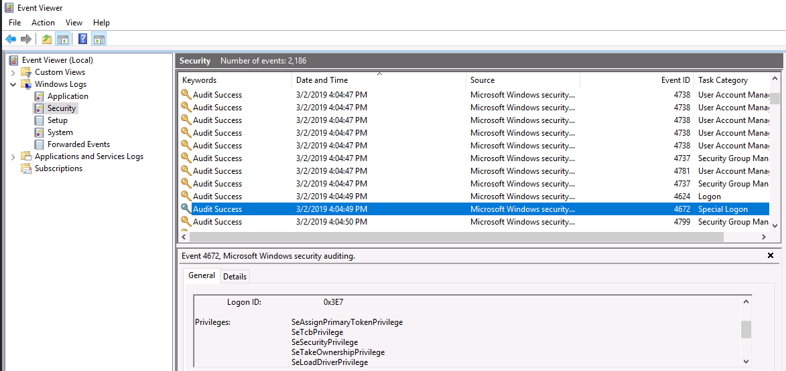

#Investingating Windows#

***

Tout d'abord il faut se connecter sur Windows avec rdesktop.
```bash
rdesktop -u Administrator -p letmein123! 10.10.106.155
Autoselecting keyboard map 'fr' from locale
Core(warning): Certificate received from server is NOT trusted by this system, an exception has been added by the user to trust this specific certificate.
Failed to initialize NLA, do you have correct Kerberos TGT initialized ?
Core(warning): Certificate received from server is NOT trusted by this system, an exception has been added by the user to trust this specific certificate.
Connection established using SSL.
Protocol(warning): process_pdu_logon(), Unhandled login infotype 1
Clipboard(error): xclip_handle_SelectionNotify(), unable to find a textual target to satisfy RDP clipboard text request
```

Vous serez sur le bureau de windows.  

***

**Whats the version and year of the windows machine?**
Ouvrez un terminal (window+r et tapez cmd et vous validez)  

```bash
C:\Users\Administrator>systeminfo | findstr  /c:"OS Name"
OS Name:                   Microsoft Windows Server 2016 Datacenter
```

***

**Which user logged in last?**

Dans un terminal.  

On récupère tous les noms  

```bash
C:\Users\Administrator>net user

User accounts for \\EC2AMAZ-I8UHO76

-------------------------------------------------------------------------------
Administrator            DefaultAccount           Guest
Jenny                    John
The command completed successfully.
```

On regarde la dernière connexion de tous les utilisateurs.

```bash
C:\Users\Administrator>net user Administrator | findstr "Last logon"
Last logon                   7/12/2021 11:00:51 AM

C:\Users\Administrator>net user DefaultAccount | findstr "Last logon"
Last logon                   Never

C:\Users\Administrator>net user Guest | findstr "Last logon"
Last logon                   Never

C:\Users\Administrator>net user Jenny | findstr "Last logon"
Last logon                   Never

C:\Users\Administrator>net user John | findstr "Last logon"
Last logon                   3/2/2019 5:48:32 PM
```

On voit ici que c'est l'administrateur que c'est connecté en dernier.  

***

**When did John log onto the system last?**

même procédure que ci-dessus.  

```bash
 C:\Users\Administrator>net user John | findstr "Last logon"
Last logon                   3/2/2019 5:48:32 PM
```

***

**What IP does the system connect to when it first starts?**

On voit au début une fenêtre s'ouvrir avec le message.  

```bash
PsExec v1.98 - Execute processes remotely
Copyright (C) 2001-2010 Mark Russinovich
Sysinternals - www.sysinternals.com

Connecting to 10.34.2.3...
```

***

**What two accounts had administrative privileges (other than the Administrator user)?**

Dans le terminal.  
```bash
C:\Users\Administrator>net user

User accounts for \\EC2AMAZ-I8UHO76

-------------------------------------------------------------------------------
Administrator            DefaultAccount           Guest
Jenny                    John
The command completed successfully.

C:\Users\Administrator>net user DefaultAccount | findstr /c:"Local Group"
Local Group Memberships      *System Managed Group
C:\Users\Administrator>net user Guest | findstr /c:"Local Group"
Local Group Memberships      *Administrators       *Guests
C:\Users\Administrator>net user Jenny | findstr /c:"Local Group"
Local Group Memberships      *Administrators       *Users
C:\Users\Administrator>net user John | findstr /c:"Local Group"
Local Group Memberships      *Users
```

On voit ici les deux comptes avec les privilèges administrateur sont : Guest et Jenny. 

***

** Whats the name of the scheduled task that is malicous**

Dans un terminal.  
```bash
C:\Users\Administrator>Schtasks | findstr /c:"Ready"  | findstr /v /c:"N/A"
check logged in                          7/12/2021 4:59:43 PM   Ready
Clean file system                        7/12/2021 4:55:17 PM   Ready
falshupdate22                            7/12/2021 11:47:04 AM  Ready
GameOver                                 7/12/2021 11:47:00 AM  Ready
Microsoft Compatibility Appraiser        7/13/2021 4:51:44 AM   Ready
appuriverifierdaily                      7/13/2021 3:00:00 AM   Ready
appuriverifierinstall                    7/17/2021 3:00:00 AM   Ready
Consolidator                             7/12/2021 12:00:00 PM  Ready
Data Integrity Scan                      8/5/2021 5:23:25 AM    Ready
Device                                   7/13/2021 3:58:46 AM   Ready
SvcRestartTask                           7/19/2021 11:29:13 AM  Ready
SpeechModelDownloadTask                  7/13/2021 12:00:00 AM  Ready
Refresh Settings                         7/13/2021 5:58:15 AM   Ready
Schedule Scan                            7/13/2021 10:23:37 AM  Ready
Windows Defender Scheduled Scan          7/13/2021 4:05:58 AM   Ready
QueueReporting                           7/12/2021 3:29:30 PM   Ready
Automatic App Update                     7/12/2021 1:33:49 PM   Ready
sih                                      7/13/2021 1:31:01 AM   Ready
```

On voit ici que Clean file system semble suspicieux.  

***

**What file was the task trying to run daily?**

Dans un terminal.  

```bash
C:\Users\Administrator>Schtasks  /query /v /TN "Clean file system" /FO LIST | findstr /c:"Task To Run"
Task To Run:                          C:\TMP\nc.ps1 -l 1348
```

Ici on voit bien que le fichier est nc.ps1  

***

**What port did this file listen locally for?**

même commande que ci dessus on voit bien ceci : C:\TMP\nc.ps1 -l 1348  
Donc le port est le : 1348  

***

**When did Jenny last logon?**

```bash
C:\Users\Administrator>net user Jenny | findstr "logon"
Last logon                   Never
```

Jenny c'est jamais connectée.  

***

**At what date did the compromise take place?**

```bash
C:\Users\Administrator>Schtasks  /query /v /TN "Clean file system" /FO LIST | findstr /c:"Start Date"
Start Date:                           3/2/2019
```

C'est la première exécution.  

***

**At what time did Windows first assign special privileges to a new logon?**

On trouve le réponse dans l'Event viewer voir le screenshoot ci-dessous.  



***

**What tool was used to get Windows passwords?**

Dans une question ci-dessus on avait trouvé un fichier dans le répertoire c:\TMP.  
Dans un terminal powerShell

```bash
Windows PowerShell
Copyright (C) 2016 Microsoft Corporation. All rights reserved.

PS C:\Users\Administrator> cd /tmp
PS C:\tmp> ls


    Directory: C:\tmp


Mode                LastWriteTime         Length Name
----                -------------         ------ ----
-a----         3/2/2019   4:37 PM           9673 d.txt
-a----         3/2/2019   4:37 PM           3389 mim-out.txt
-a----         3/2/2019   4:37 PM         663552 mim.exe
-a----         3/2/2019   4:45 PM         176148 moutput.tmp
-a----         3/2/2019   4:37 PM          36864 nbtscan.exe
-a----         3/2/2019   4:37 PM          37640 nc.ps1
-a----         3/2/2019   4:37 PM         381816 p.exe
-a----         3/2/2019   4:46 PM              0 scan1.tmp
-a----         3/2/2019   4:46 PM              0 scan2.tmp
-a----         3/2/2019   4:46 PM              0 scan3.tmp
-a----         3/2/2019   4:37 PM           7022 schtasks-backdoor.ps1
-a----         3/2/2019   4:45 PM       40464394 somethingwindows.dmp
-a----         3/2/2019   4:46 PM          11950 sys.txt
-a----         3/2/2019   4:37 PM          19998 WMIBackdoor.ps1
-a----         3/2/2019   4:37 PM         843776 xCmd.exe


PS C:\tmp> Get-Content .\mim-out.txt -head 10

  .#####.   mimikatz 2.0 alpha (x86) release "Kiwi en C" (Feb 16 2015 22:17:52)
 .## ^ ##.
 ## / \ ##  /* * *
 ## \ / ##   Benjamin DELPY `gentilkiwi` ( benjamin@gentilkiwi.com )
 '## v ##'   http://blog.gentilkiwi.com/mimikatz             (oe.eo)
  '#####'                                     with 15 modules * * */


mimikatz(powershell) # sekurlsa::logonpasswords
```

On voit ici que le logiciel utilisé est mimikatz

***

**What was the attackers external control and command servers IP?**

On regarde dans le fichier hosts.  

Dans un terminal power-shell.

```bash
PS C:\tmp> Get-Content C:\Windows\System32\drivers\etc\hosts
# Copyright (c) 1993-2009 Microsoft Corp.
#
# This is a sample HOSTS file used by Microsoft TCP/IP for Windows.
#
# This file contains the mappings of IP addresses to host names. Each
# entry should be kept on an individual line. The IP address should
# be placed in the first column followed by the corresponding host name.
# The IP address and the host name should be separated by at least one
# space.
#
# Additionally, comments (such as these) may be inserted on individual
# lines or following the machine name denoted by a '#' symbol.
#
# For example:
#
#      102.54.94.97     rhino.acme.com          # source server
#       38.25.63.10     x.acme.com              # x client host

# localhost name resolution is handled within DNS itself.
#       127.0.0.1       localhost
#       ::1             localhost
10.2.2.2        update.microsoft.com
127.0.0.1  www.virustotal.com
127.0.0.1  www.www.com
127.0.0.1  dci.sophosupd.com
10.2.2.2        update.microsoft.com
127.0.0.1  www.virustotal.com
127.0.0.1  www.www.com
127.0.0.1  dci.sophosupd.com
10.2.2.2        update.microsoft.com
127.0.0.1  www.virustotal.com
127.0.0.1  www.www.com
127.0.0.1  dci.sophosupd.com
76.32.97.132 google.com
76.32.97.132 www.google.com
```

Dans le fichier hosts on voit que la réponse sont les deux dernières adresse IP.  

***

**What was the extension name of the shell uploaded via the servers website?**

Regardons les fichiers du site web de Windows.  

```bash
Copyright (C) 2016 Microsoft Corporation. All rights reserved.

PS C:\Users\Administrator> cd C:\inetpub\wwwroot
PS C:\inetpub\wwwroot> ls


    Directory: C:\inetpub\wwwroot


Mode                LastWriteTime         Length Name
----                -------------         ------ ----
-a----         3/2/2019   4:37 PM          74853 b.jsp
-a----         3/2/2019   4:37 PM          12572 shell.gif
-a----         3/2/2019   4:37 PM            657 tests.jsp


PS C:\inetpub\wwwroot>
```

On voit ici des fichiers avec l'extension .jsp  (java server page).

***

**What was the last port the attacker opened?**

```bash
PS C:\Users\Administrator> Get-NetFirewallRule | select -last 1 | Format-Table -Property DisplayName,
>> @{Name='LocalPort';Expression={($PSItem | Get-NetFirewallPortFilter).LocalPort}}

DisplayName                               LocalPort
-----------                               ---------
Allow outside connections for development 1337
```

On voit ici le numéro de port 1337.  

***

**Check for DNS poisoning, what site was targeted?**

```bash
PS C:\Users\Administrator> Get-Content C:\Windows\System32\drivers\etc\hosts | select -Last 5
127.0.0.1  www.virustotal.com
127.0.0.1  www.www.com
127.0.0.1  dci.sophosupd.com
76.32.97.132 google.com
76.32.97.132 www.google.com
```

On voit ici que le dns poisoning est : google.com
