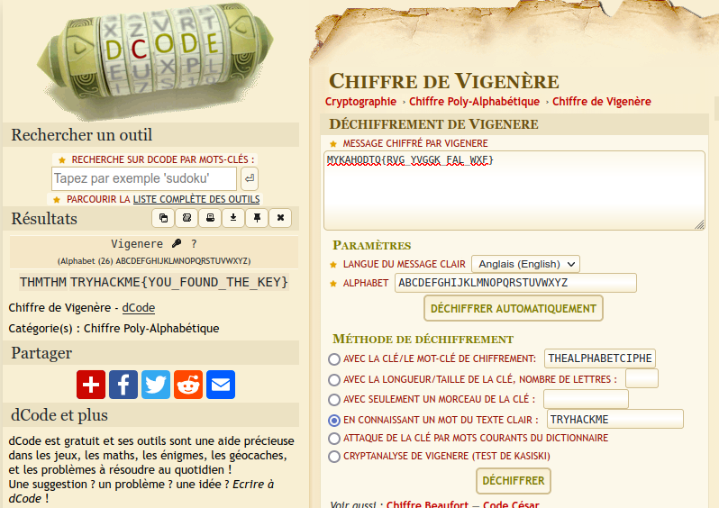

# CTF collection Vol.1 #

## Task 1 Author note  ##

## Task 2 What does the base said? ##

**Feed me the flag!**
```bash
tim@kali:~/Bureau/tryhackme/write-up$ echo -n "VEhNe2p1NTdfZDNjMGQzXzdoM19iNDUzfQ==" | base64 -d
THM{ju57_d3c0d3_7h3_b453}
```

C'est base64.
La réponse est : THM{ju57_d3c0d3_7h3_b453} 

## Task 3 Meta meta  ##
**I'm hungry, I need the flag.**
```bash
tim@kali:~/Bureau/tryhackme/write-up$ exiftool Findme.jpg 
ExifTool Version Number         : 12.16
File Name                       : Findme.jpg
Directory                       : .
File Size                       : 34 KiB
File Modification Date/Time     : 2021:07:20 22:21:02+02:00
File Access Date/Time           : 2021:07:20 22:23:01+02:00
File Inode Change Date/Time     : 2021:07:20 22:23:01+02:00
File Permissions                : rwxrwx---
File Type                       : JPEG
File Type Extension             : jpg
MIME Type                       : image/jpeg
JFIF Version                    : 1.01
X Resolution                    : 96
Y Resolution                    : 96
Exif Byte Order                 : Big-endian (Motorola, MM)
Resolution Unit                 : inches
Y Cb Cr Positioning             : Centered
Exif Version                    : 0231
Components Configuration        : Y, Cb, Cr, -
Flashpix Version                : 0100
Owner Name                      : THM{3x1f_0r_3x17}
Comment                         : CREATOR: gd-jpeg v1.0 (using IJG JPEG v62), quality = 60.
Image Width                     : 800
Image Height                    : 480
Encoding Process                : Progressive DCT, Huffman coding
Bits Per Sample                 : 8
Color Components                : 3
Y Cb Cr Sub Sampling            : YCbCr4:2:0 (2 2)
Image Size                      : 800x480
Megapixels                      : 0.384
```
On la réponse dans Owner name.  
La réponse est : THM{3x1f_0r_3x17} 

## Task 4 Mon, are we going to be okay?  ##
**It is sad. Feed me the flag.**
```bash
tim@kali:~/Bureau/tryhackme/write-up$ steghide --extract -sf Extinction.jpg 
Entrez la passphrase: 
�criture des donn�es extraites dans "Final_message.txt".
tim@kali:~/Bureau/tryhackme/write-up$ cat Final_message.txt 
It going to be over soon. Sleep my child.

THM{500n3r_0r_l473r_17_15_0ur_7urn}
```

Il suffire d'extraire les données avec steghide.  
La réponse est : THM{500n3r_0r_l473r_17_15_0ur_7urn}

## Task 5 Erm......Magick ##
**Did you find the flag?**


Il suffit passer le curseur de la souris sur le texte.  

La réponse est : THM{wh173_fl46} 

## Task 6 QRrrrr ##
**More flag please!**
```bash
tim@kali:~/Bureau/tryhackme/write-up$ zbarimg QR.png 
QR-Code:THM{qr_m4k3_l1f3_345y}
scanned 1 barcode symbols from 1 images in 0,04 seconds
```
Le logiciel zbarimg peut lire les QR codes.  
La réponse est : THM{qr_m4k3_l1f3_345y}   

##  Task 7 Reverse it or read it? ##
**Found the flag?**
```bash
tim@kali:~/Bureau/tryhackme/write-up$ strings hello.hello | grep THM
THM{345y_f1nd_345y_60}
```

En regardant toutes les chaîne dans le fichier on trouve la réponse.  
Réponse : THM{345y_f1nd_345y_60} 

## Task 8 Another decoding stuff ##
**Oh, Oh, Did you get it?**


On utilise CyberChef avec l'option magic, il nous trouve automatiquement la solution.  

La réponse : THM{17_h45_l3553r_l3773r5} 

## Task 9 Left or right  ##
**What did you get?**


On utilise dCode, avec déchiffrement de Cesar.  
La réponse est : THM{hail_the_caesar}  

## Task 10 Make a comment ##
**I'm hungry now... I need the flag**

Il suffit de regarder dans le code html de la page en faisant inspecter l'élément.  

La réponse est : THM{4lw4y5_ch3ck_7h3_c0m3mn7} 

## Task 11 Can you fix it? ##
**What is the content?**
```bash
tim@kali:~/Bureau/tryhackme/write-up$ file spoil.png 
spoil.png: data
```

Il y a un problème file détecte que c'est que des données.  
La signature doit être mauvaise.  

```bash
tim@kali:~/Bureau/tryhackme/write-up$ hexdump spoil.png | head
0000000 3323 5f44 0a0d 0a1a 0000 0d00 4849 5244
0000010 0000 2003 0000 2003 0608 0000 db00 0670
0000020 0068 0000 7301 4752 0042 ceae e91c 0000
0000030 0900 4870 7359 0000 c40e 0000 c40e 9501
0000040 0e2b 001b 2000 4900 4144 7854 ec9c 79dd
0000050 9c9c 9d55 f1ef 79cf 5a9e 7abb 925f 7774
0000060 40f6 0248 2009 5011 20c4 a2bb a888 5c80
0000070 0619 5d7c c064 e979 2e75 ce03 e338 8e0e
0000080 752f 3ae6 ea23 0c8c 30e8 038e 7064 91c1
0000090 80cd 0c88 204b 0909 4c18 b642 d24e f4e9
```

Je ne reconnais pas la signature.  

Je faire une recherche sur internet pour connaître la signature d'un fichier png.
C'est : 89 50 4E 47 0D 0A 1A 0A  

```bash
tim@kali:~/Bureau/tryhackme/write-up$ printf '\x89\x50\x4E\x47\x0D\x0A\x1A\x0A' | dd of=spoil.png bs=1 seek=0 count=8 conv=notrunc
8+0 enregistrements lus
8+0 enregistrements écrits
8 octets copiés, 0,000431303 s, 18,5 kB/s
```


On remplace les bons octets on bon au bon endroit.  
La solution est dans l'image.  

La solution est : THM{y35_w3_c4n} 

## Task 12 Read it ##
**Did you found the hidden flag?**


En faisant une recherche sur reddit on trouve la solution.  

Réponse : THM{50c14l_4cc0un7_15_p4r7_0f_051n7}  

## Task 13 Spin my head ##
** Can you decode it? **
```bash
tim@kali:~/Bureau/tryhackme/write-up$ echo "++++++++++[>+>+++>+++++++>++++++++++<<<<-]>>>++++++++++++++.------------.+++++.>+++++++++++++++++++++++.<<++++++++++++++++++.>>-------------------.---------.++++++++++++++.++++++++++++.<++++++++++++++++++.+++++++++.<+++.+.>----.>++++." > bf
tim@kali:~/Bureau/tryhackme/write-up$ beef bf
THM{0h_my_h34d}
```

Il suffit d'avoir interpréteur brainfuck pour pouvoir lire le contenu.  
La réponse est : THM{0h_my_h34d}  

## Task 14 An exclusive! ##
**Did you crack it? Feed me now!**
```bash
tim@kali:~/Bureau/tryhackme/write-up$ python3
Python 3.9.2 (default, Feb 28 2021, 17:03:44) 
[GCC 10.2.1 20210110] on linux
Type "help", "copyright", "credits" or "license" for more information.

>>> solution = hex(int('44585d6b2368737c65252166234f20626d',16)^int('1010101010101010101010101010101010',16))[2:]
>>> print(bytes.fromhex(solution))
b'THM{3xclu51v3_0r}'
```

On décode la solution avec un script python.  
La solution est : THM{3xclu51v3_0r}  

## Task 15 Binary walk ##
**Please exfiltrate my file :)**
```bash
tim@kali:~/Bureau/tryhackme/write-up$ binwalk hell.jpg 

DECIMAL       HEXADECIMAL     DESCRIPTION
--------------------------------------------------------------------------------
0             0x0             JPEG image data, JFIF standard 1.02
30            0x1E            TIFF image data, big-endian, offset of first image directory: 8
265845        0x40E75         Zip archive data, at least v2.0 to extract, uncompressed size: 69, name: hello_there.txt
266099        0x40F73         End of Zip archive, footer length: 22

tim@kali:~/Bureau/tryhackme/write-up$ binwalk -e hell.jpg 

DECIMAL       HEXADECIMAL     DESCRIPTION
--------------------------------------------------------------------------------
0             0x0             JPEG image data, JFIF standard 1.02
30            0x1E            TIFF image data, big-endian, offset of first image directory: 8
265845        0x40E75         Zip archive data, at least v2.0 to extract, uncompressed size: 69, name: hello_there.txt
266099        0x40F73         End of Zip archive, footer length: 22

tim@kali:~/Bureau/tryhackme/write-up$ cat _hell.jpg.extracted/hello_there.txt 
Thank you for extracting me, you are the best!

THM{y0u_w4lk_m3_0u7}
```

On remarque qu'il y a des fichiers cachés.  
Dans hello_there.txt on trouve la solution.  
La solution : THM{y0u_w4lk_m3_0u7} 

## Task 16 Darkness ##
**What does the flag said?**
```bash
tim@kali:~/Bureau/tryhackme/write-up$ wget http://www.caesum.com/handbook/Stegsolve.jar -O stegsolve.jar
--2021-07-21 09:58:39--  http://www.caesum.com/handbook/Stegsolve.jar
Résolution de www.caesum.com (www.caesum.com)… 216.234.173.1
Connexion à www.caesum.com (www.caesum.com)|216.234.173.1|:80… connecté.
requête HTTP transmise, en attente de la réponse… 200 OK
Taille : 312271 (305K) [application/x-java-archive]
Sauvegarde en : « stegsolve.jar »

stegsolve.jar                                               100%[=========================================================================================================================================>] 304,95K   195KB/s    ds 1,6s    

2021-07-21 09:58:41 (195 KB/s) — « stegsolve.jar » sauvegardé [312271/312271]

tim@kali:~/Bureau/tryhackme/write-up$ java -jar stegsolve.jar 
Picked up _JAVA_OPTIONS: -Dawt.useSystemAAFontSettings=on -Dswing.aatext=true
```

On télécharge et exécute stegsolve.  


La solution est : THM{7h3r3_15_h0p3_1n_7h3_d4rkn355}  

## Task 17 A sounding QR ##
**What does the bot said?**
```bash
tim@kali:~/Bureau/tryhackme/write-up$ zbarimg QRCTF.png 
QR-Code:https://soundcloud.com/user-86667759/thm-ctf-vol1
scanned 1 barcode symbols from 1 images in 0,1 seconds
```

On va sur le lien [soundcloud](https://soundcloud.com/user-86667759/thm-ctf-vol1)

Il y un fichier son ou une personne dit les lettres du mot.  

Si vous avez du mal avec l'anglais, utiliser se site : [waston](https://speech-to-text-demo.ng.bluemix.net/)  

## Task 18 Dig up the past ##
**Did you found my past?**
Normalement on utilise wayback machine.  
Suite à une erreur du serveur le lien n'est pas ou plus disponible.   

La réponse est : THM{ch3ck_th3_h4ckb4ck}  

## Task 19 Uncrackable!  ##
**The deciphered text**

C'est un chiffrement vigenère ou on sait une partie de texte en clair.  

La réponse est : TRYHACKME{YOU_FOUND_THE_KEY} 

## Task 20 Small bases ##
C'est une conversion décimal à héxadécimal à ascii.  
Réponse :  THM{17_ju57_4n_0rd1n4ry_b4535}  

## Task 21 Read the packet ##

Il suffit d'ouvrir le fichier avec Wireshar.  
Allez Fichier=>Exporter Objets=>http
Puis dans une fenêtre il y a les données dans flag.txt.  

Réponse : THM{d0_n07_574lk_m3}  
