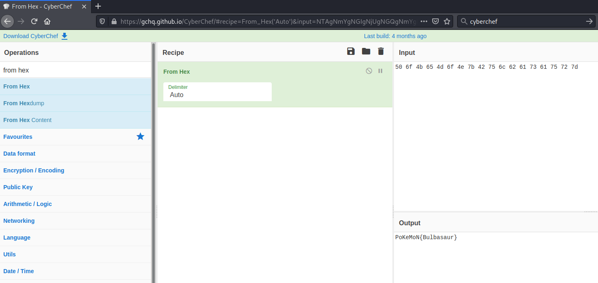
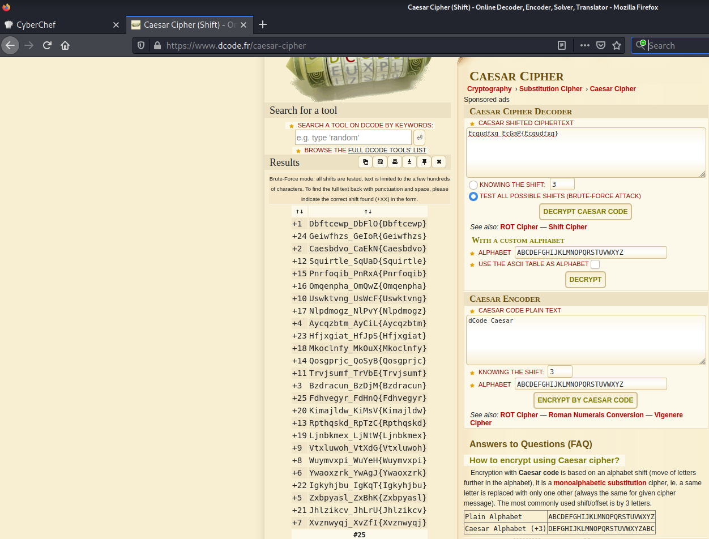

# Gotta Catch'em All! #

## Task 1 Can You Catch'em All? ##

```bash
tim@kali:~/Bureau/tryhackme/write-up$ sudo sh -c "echo '10.10.150.86 gottacatch.thm' >> /etc/hosts"

tim@kali:~/Bureau/tryhackme/write-up$ sudo nmap -A gottacatch.thm
Starting Nmap 7.91 ( https://nmap.org ) at 2021-08-04 08:17 CEST
Nmap scan report for gottacatch.thm (10.10.150.86)
Host is up (0.082s latency).
Not shown: 998 closed ports
PORT   STATE SERVICE VERSION
22/tcp open  ssh     OpenSSH 7.2p2 Ubuntu 4ubuntu2.8 (Ubuntu Linux; protocol 2.0)
| ssh-hostkey: 
|   2048 58:14:75:69:1e:a9:59:5f:b2:3a:69:1c:6c:78:5c:27 (RSA)
|   256 23:f5:fb:e7:57:c2:a5:3e:c2:26:29:0e:74:db:37:c2 (ECDSA)
|_  256 f1:9b:b5:8a:b9:29:aa:b6:aa:a2:52:4a:6e:65:95:c5 (ED25519)
80/tcp open  http    Apache httpd 2.4.18 ((Ubuntu))
|_http-server-header: Apache/2.4.18 (Ubuntu)
|_http-title: Can You Find Them All?
No exact OS matches for host (If you know what OS is running on it, see https://nmap.org/submit/ ).
TCP/IP fingerprint:
OS:SCAN(V=7.91%E=4%D=8/4%OT=22%CT=1%CU=31313%PV=Y%DS=2%DC=T%G=Y%TM=610A3100
OS:%P=x86_64-pc-linux-gnu)SEQ(SP=104%GCD=1%ISR=109%TI=Z%CI=Z%II=I%TS=A)OPS(
OS:O1=M506ST11NW6%O2=M506ST11NW6%O3=M506NNT11NW6%O4=M506ST11NW6%O5=M506ST11
OS:NW6%O6=M506ST11)WIN(W1=F4B3%W2=F4B3%W3=F4B3%W4=F4B3%W5=F4B3%W6=F4B3)ECN(
OS:R=Y%DF=Y%T=40%W=F507%O=M506NNSNW6%CC=Y%Q=)T1(R=Y%DF=Y%T=40%S=O%A=S+%F=AS
OS:%RD=0%Q=)T2(R=N)T3(R=N)T4(R=Y%DF=Y%T=40%W=0%S=A%A=Z%F=R%O=%RD=0%Q=)T5(R=
OS:Y%DF=Y%T=40%W=0%S=Z%A=S+%F=AR%O=%RD=0%Q=)T6(R=Y%DF=Y%T=40%W=0%S=A%A=Z%F=
OS:R%O=%RD=0%Q=)T7(R=Y%DF=Y%T=40%W=0%S=Z%A=S+%F=AR%O=%RD=0%Q=)U1(R=Y%DF=N%T
OS:=40%IPL=164%UN=0%RIPL=G%RID=G%RIPCK=G%RUCK=G%RUD=G)IE(R=Y%DFI=N%T=40%CD=
OS:S)

Network Distance: 2 hops
Service Info: OS: Linux; CPE: cpe:/o:linux:linux_kernel

TRACEROUTE (using port 256/tcp)
HOP RTT       ADDRESS
1   33.10 ms  10.9.0.1
2   108.68 ms gottacatch.thm (10.10.150.86)

OS and Service detection performed. Please report any incorrect results at https://nmap.org/submit/ .
Nmap done: 1 IP address (1 host up) scanned in 27.38 seconds
```

D'après le scan de nmap on voit deux services :     
Le service SSH sur le port 22.         
Le service HTTP sur le port 80.           

Le titre de la page nous indique que c'est la page par défaut d'Apache.         

```bash
tim@kali:~/Bureau/tryhackme/write-up$ curl -s gottacatch.thm | grep -B 2 -F '<!--'
        </span>
      </div>
<!--      <div class="table_of_contents floating_element">
--
        </div>
        <pokemon>:<hack_the_pokemon>
        	<!--(Check console for extra surprise!)-->
```

On dessus d'un commentaire on trouve 2 mots.
pokemon
hack_the_pokemon

**Find the Grass-Type Pokemon**

```bash
tim@kali:~/Bureau/tryhackme/write-up$ ssh pokemon@gottacatch.thm
The authenticity of host 'gottacatch.thm (10.10.150.86)' can't be established.
ECDSA key fingerprint is SHA256:mXXTCQORSu35gV+cSi+nCjY/W0oabQFNjxuXUDrsUHI.
Are you sure you want to continue connecting (yes/no/[fingerprint])? yes
Warning: Permanently added 'gottacatch.thm,10.10.150.86' (ECDSA) to the list of known hosts.
pokemon@gottacatch.thm's password: 
Welcome to Ubuntu 16.04.6 LTS (GNU/Linux 4.15.0-112-generic x86_64)

 * Documentation:  https://help.ubuntu.com
 * Management:     https://landscape.canonical.com
 * Support:        https://ubuntu.com/advantage

84 packages can be updated.
0 updates are security updates.


The programs included with the Ubuntu system are free software;
the exact distribution terms for each program are described in the
individual files in /usr/share/doc/*/copyright.

Ubuntu comes with ABSOLUTELY NO WARRANTY, to the extent permitted by
applicable law.

```

Les identifiants          
Nom utilisateur : pokemon      
Mot de passe : hack_the_pokemon       

Les identifiants fonctionnent pour la connexion SSH.   

```bash
pokemon@root:~$ ls
Desktop  Documents  Downloads  examples.desktop  Music  Pictures  Public  Templates  Videos

pokemon@root:~/Desktop$ ls
P0kEmOn.zip

pokemon@root:~/Desktop$ unzip P0kEmOn.zip 
Archive:  P0kEmOn.zip
   creating: P0kEmOn/
  inflating: P0kEmOn/grass-type.txt  

pokemon@root:~/Desktop$ cat P0kEmOn/grass-type.txt 
50 6f 4b 65 4d 6f 4e 7b 42 75 6c 62 61 73 61 75 72 7d

```



Dans le répertoire Desktop on trouve un fichier zip.        
Dans le fichier il y a un message codé en hexadécimal.       
Quand on décode le message on a notre premier flag.    

Réponse : Find the Grass-Type Pokemon   

**Find the Water-Type Pokemon**

```bash
pokemon@root:~$ find / -name water-type.txt 2>/dev/null
/var/www/html/water-type.txt

pokemon@root:~$ cat /var/www/html/water-type.txt 
Ecgudfxq_EcGmP{Ecgudfxq}
```



Le premier fichier s'appelait grass-type.txt, on cherche un fichier water-type.txt.     
On trouve le bon fichier mais il est encodé avec la méthode césar.  
On le décode et on trouve le flag.    

Réponse : Squirtle_SqUaD{Squirtle}   

**Find the Fire-Type Pokemon**

```bash
pokemon@root:~$ find / -name fire-type.txt 2>/dev/null
/etc/why_am_i_here?/fire-type.txt

pokemon@root:~$ cat /etc/why_am_i_here\?/fire-type.txt 
UDBrM20wbntDaGFybWFuZGVyfQ==

DBrM20wbntDaGFybWFuZGVyfQ==pokemon@root:~$ echo "UDBrM20wbntDaGFybWFuZGVyfQ==" | base64 -d
P0k3m0n{Charmander}
```

On fait une recherche sur fire-type.txt.       
On regarde le fichier.    
Dans le fichier c'est du base64, on le décode.   

Réponse : P0k3m0n{Charmander}       

**Who is Root's Favorite Pokemon?**

```bash
pokemon@root:~$ ls
Desktop  Documents  Downloads  examples.desktop  Music  Pictures  Public  Templates  Videos
pokemon@root:~$ cd Videos/
pokemon@root:~/Videos$ ls
Gotta
pokemon@root:~/Videos$ cd Gotta/
pokemon@root:~/Videos/Gotta$ ls
Catch
pokemon@root:~/Videos/Gotta$ cd Catch/
pokemon@root:~/Videos/Gotta/Catch$ ls
Them
pokemon@root:~/Videos/Gotta/Catch$ cd Them/
pokemon@root:~/Videos/Gotta/Catch/Them$ ls
ALL!
pokemon@root:~/Videos/Gotta/Catch/Them$ cd ALL\!/
pokemon@root:~/Videos/Gotta/Catch/Them/ALL!$ ls
Could_this_be_what_Im_looking_for?.cplusplus
pokemon@root:~/Videos/Gotta/Catch/Them/ALL!$ cat Could_this_be_what_Im_looking_for\?.cplusplus 
# include <iostream>

int main() {
	std::cout << "ash : pikapika"
	return 0;

```

Dans le répertoire \/home\/pokemon\/Videos\/Gotta\/Catch\/Them\/ALL!
On trouve un fichier avec deux mots intéressants ash et pikapika.    

```bash
pokemon@root:~/Videos/Gotta/Catch/Them/ALL!$ su ash
Password: 
To run a command as administrator (user "root"), use "sudo <command>".
See "man sudo_root" for details.

bash: /home/ash/.bashrc: Permission denied
ash@root:/home/pokemon/Videos/Gotta/Catch/Them/ALL!$ id
uid=1001(ash) gid=1001(ash) groups=1001(ash),27(sudo)
ash@root:/home/pokemon/Videos/Gotta/Catch/Them/ALL!$ sudo -l

[sudo] password for ash: 
Matching Defaults entries for ash on root:
    env_reset, mail_badpass, secure_path=/usr/local/sbin\:/usr/local/bin\:/usr/sbin\:/usr/bin\:/sbin\:/bin\:/snap/bin

User ash may run the following commands on root:
    (ALL : ALL) ALL

sudo su
root@root:/home/pokemon/Videos/Gotta/Catch/Them/ALL!#

root@root:/home/pokemon/Videos/Gotta/Catch/Them/ALL!# cd /home/

root@root:/home# ls
ash  pokemon  roots-pokemon.txt

root@root:/home# cat roots-pokemon.txt 
Pikachu!
```

On se connect en tant que utilisateur ash avec le mot de passe pikapika.   
On remarque que l'on peut exécuter toute les commandes avec sudo sans mot de passe.   
On se connect avec les droits root.    
On va dans home puis on regarde dans le fichier roots-pokemon.txt.    

La réponse est : Pikachu!     
