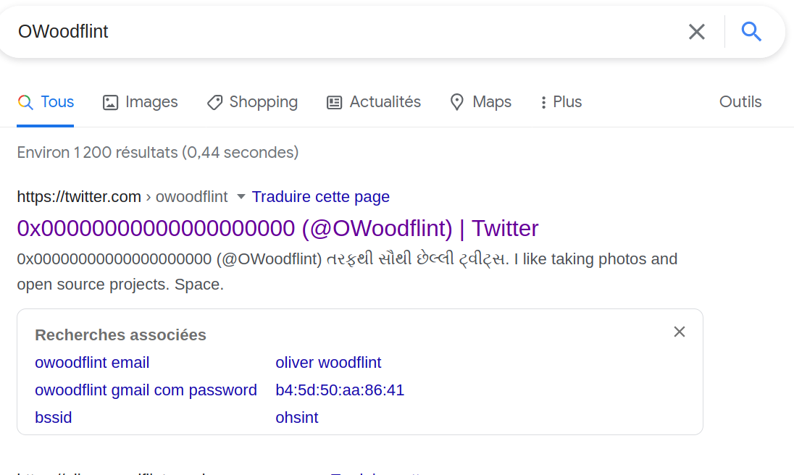
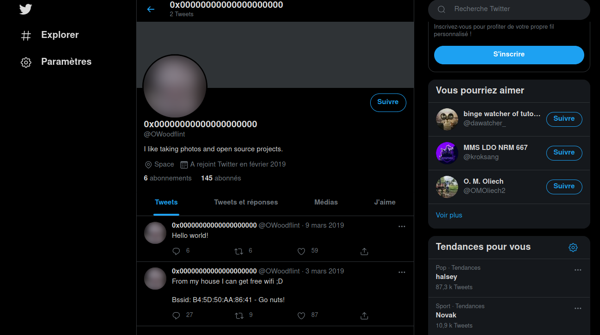
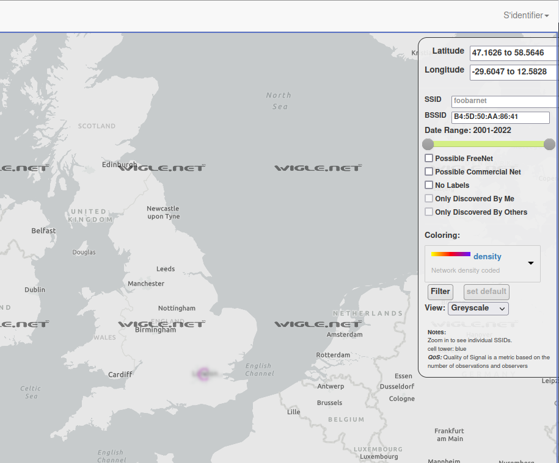

# OhSINT #

## Introduction ## 
***
Ce write-up nous apprend à rechercher des informations.

***
**What is this users avatar of?**

Dans le fichier télécharger on trouve un fichier WindowsXP.jpg

Regardons les métas données du fichier avec exiftool.jpg
 
 ```bash
 tim@kali:~/Bureau/tryhackme/ohsint$ exiftool WindowsXP.jpg 
ExifTool Version Number         : 12.16
File Name                       : WindowsXP.jpg
Directory                       : .
File Size                       : 229 KiB
File Modification Date/Time     : 2021:04:06 11:00:55+02:00
File Access Date/Time           : 2021:04:06 11:03:25+02:00
File Inode Change Date/Time     : 2021:04:06 11:03:25+02:00
File Permissions                : rwxrwx---
File Type                       : JPEG
File Type Extension             : jpg
MIME Type                       : image/jpeg
XMP Toolkit                     : Image::ExifTool 11.27
GPS Latitude                    : 54 deg 17' 41.27" N
GPS Longitude                   : 2 deg 15' 1.33" W
Copyright                       : OWoodflint
Image Width                     : 1920
Image Height                    : 1080
Encoding Process                : Baseline DCT, Huffman coding
Bits Per Sample                 : 8
Color Components                : 3
Y Cb Cr Sub Sampling            : YCbCr4:2:0 (2 2)
Image Size                      : 1920x1080
Megapixels                      : 2.1
GPS Latitude Ref                : North
GPS Longitude Ref               : West
GPS Position                    : 54 deg 17' 41.27" N, 2 deg 15' 1.33" W
```

Dans la section Copyright on remarque le mot : OWoodflint

Faisons une recherche sur moteur de recherche avec l'occurrence  OWoodflint.



Je clique sur le premier lien qui m'amène sur twitter.


Dans le cercle on a une image, ce quelle représente est l'avatar.

***

**What city is this person in?**

Sur le compte twitter on remarque un bssid
Bssid: B4:5D:50:AA:86:41

Avec le BSSID et Wigle.net on peut retracer la destination du signal.
Voici un apercu sur l'image si dessous.


***

**Whats the SSID of the WAP he connected to?**

Tout d'abord il faut s'inscrire le site wigle.net et zoomant sur le cercle rose on a le SSID.

***

**What is his personal email address?**

Dans un moteur de recherche tapez OWoodflint mail.
On tombe sur une plateforme connu avec le mail.

***

**What site did you find his email address on?**

La réponse dans la solution ci-dessus.

***

**Where has he gone on holiday?**

Faite une recherche avec le moteur de recherche avec l'occurrence  OWoodflint.
Dans les premiers lien vous trouverez un site wordpress avec le nom de la ville.

***

**What is this persons password?**

Dans le site wordpress regardez dans le code source de page, la réponse est là.