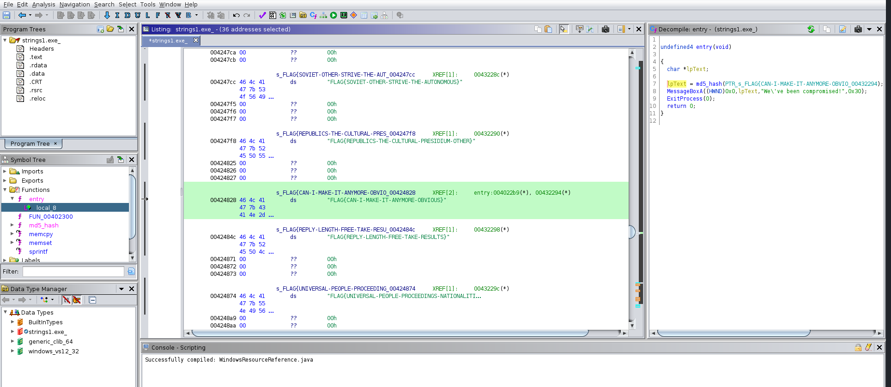
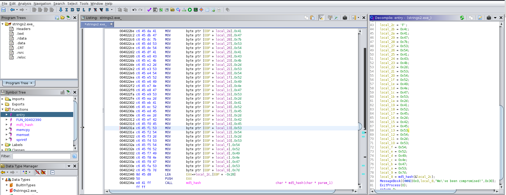
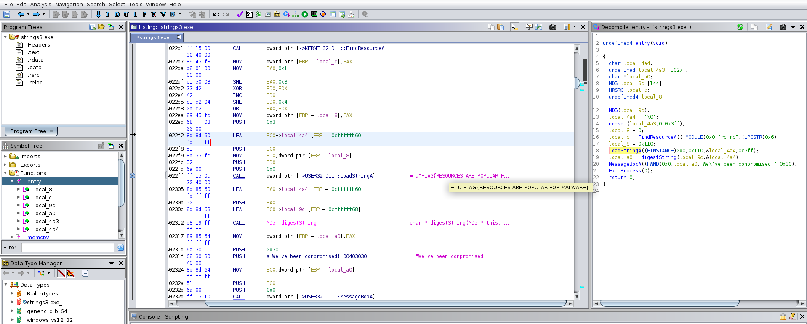

# Basic Malware RE #

## Task 1 Introduction ##

On nous apprend que le mot de passe des fichiers zip est : MalwareTech  

## Task 2 Strings :: Challenge 1 ##

**What is the flag of which that MD5 gets generated?**



Dans la fonction entry il y a une fonction md5_hash qui prend une adresse de chaîne qui pointe vers notre flag.  
La flag est : FLAG{CAN-I-MAKE-IT-ANYMORE-OBVIOUS}   

## Task 3 Strings :: Challenge 2 ##

**What is the flag of which that MD5 gets generated?**



On voit que chaque lettres est encodés en hexadécimale.   

F
4c41477b535441434b2d535452494e47532d4152452d424553542d535452494e47537d.  

```bash
tim@kali:~/Bureau/tryhackme/write-up$ echo  "4c 41 47 7b 53 54 41 43 4b 2d 53 54 52 49 4e 47 53 2d 41 52 45 2d 42 45 53 54 2d 53 54 52 49 4e 47 53 7d" | hex2raw 
LAG{STACK-STRINGS-ARE-BEST-STRINGS}
```

La réponse est : FLAG{STACK-STRINGS-ARE-BEST-STRINGS}    

## Task 4 Strings 3 :: Challenge 3 ##

   

On voit que la valeur retournée de la fonction LoadStingA est le FLAG.    

La réponse est : FLAG{RESOURCES-ARE-POPULAR-FOR-MALWARE}    

