# Biohazard #

## Task 1 Introduction ##

**Deploy the machine and start the nightmare**

Cliquez sur start machine.  


```bash
tim@kali:~/Bureau/tryhackme/write-up$ sudo sh -c "echo '10.10.182.143 biohazard.thm' >> /etc/hosts"
[sudo] Mot de passe de tim : 

tim@kali:~/Bureau/tryhackme/write-up$ sudo nmap -A biohazard.thm -p-
Starting Nmap 7.91 ( https://nmap.org ) at 2021-08-22 10:11 CEST
Nmap scan report for biohazard.thm (10.10.182.143)
Host is up (0.034s latency).
Not shown: 65532 closed ports
PORT   STATE SERVICE VERSION
21/tcp open  ftp     vsftpd 3.0.3
22/tcp open  ssh     OpenSSH 7.6p1 Ubuntu 4ubuntu0.3 (Ubuntu Linux; protocol 2.0)
| ssh-hostkey: 
|   2048 c9:03:aa:aa:ea:a9:f1:f4:09:79:c0:47:41:16:f1:9b (RSA)
|   256 2e:1d:83:11:65:03:b4:78:e9:6d:94:d1:3b:db:f4:d6 (ECDSA)
|_  256 91:3d:e4:4f:ab:aa:e2:9e:44:af:d3:57:86:70:bc:39 (ED25519)
80/tcp open  http    Apache httpd 2.4.29 ((Ubuntu))
|_http-server-header: Apache/2.4.29 (Ubuntu)
|_http-title: Beginning of the end
No exact OS matches for host (If you know what OS is running on it, see https://nmap.org/submit/ ).
TCP/IP fingerprint:
OS:SCAN(V=7.91%E=4%D=8/22%OT=21%CT=1%CU=33245%PV=Y%DS=2%DC=T%G=Y%TM=612206C
OS:3%P=x86_64-pc-linux-gnu)SEQ(SP=104%GCD=1%ISR=10A%TI=Z%CI=I%II=I%TS=A)OPS
OS:(O1=M506ST11NW6%O2=M506ST11NW6%O3=M506NNT11NW6%O4=M506ST11NW6%O5=M506ST1
OS:1NW6%O6=M506ST11)WIN(W1=68DF%W2=68DF%W3=68DF%W4=68DF%W5=68DF%W6=68DF)ECN
OS:(R=Y%DF=Y%T=40%W=6903%O=M506NNSNW6%CC=Y%Q=)T1(R=Y%DF=Y%T=40%S=O%A=S+%F=A
OS:S%RD=0%Q=)T2(R=N)T3(R=N)T4(R=Y%DF=Y%T=40%W=0%S=A%A=Z%F=R%O=%RD=0%Q=)T5(R
OS:=Y%DF=Y%T=40%W=0%S=Z%A=S+%F=AR%O=%RD=0%Q=)T6(R=Y%DF=Y%T=40%W=0%S=A%A=Z%F
OS:=R%O=%RD=0%Q=)T7(R=Y%DF=Y%T=40%W=0%S=Z%A=S+%F=AR%O=%RD=0%Q=)U1(R=Y%DF=N%
OS:T=40%IPL=164%UN=0%RIPL=G%RID=G%RIPCK=G%RUCK=G%RUD=G)IE(R=Y%DFI=N%T=40%CD
OS:=S)

Network Distance: 2 hops
Service Info: OSs: Unix, Linux; CPE: cpe:/o:linux:linux_kernel

TRACEROUTE (using port 256/tcp)
HOP RTT      ADDRESS
1   33.36 ms 10.9.0.1
2   33.53 ms biohazard.thm (10.10.182.143)

OS and Service detection performed. Please report any incorrect results at https://nmap.org/submit/ .
Nmap done: 1 IP address (1 host up) scanned in 46.04 seconds

```

**How many open ports?**

D'après nmap on voit 3 ports le 21, 22 et 80.   

Réponse : 3

**What is the team name in operation**

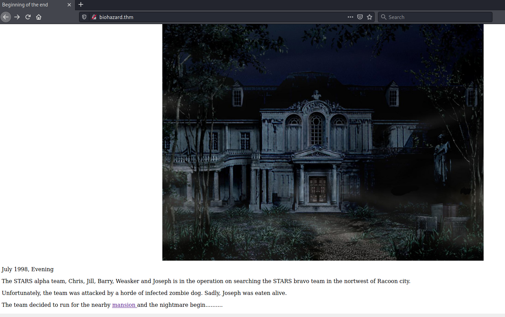    

Sur la page principale on voit que le nom de l'opération est : STARS alpha team    

## Task 2 The Mansion ##

**What is the emblem flag**

```bash
tim@kali:~/Bureau/tryhackme/write-up$ curl http://biohazard.thm/mansionmain/ -s | grep '<!--'
	<!-- It is in the /diningRoom/ -->
```

En regardant dans les codes sources on trouve un répertoire caché.   

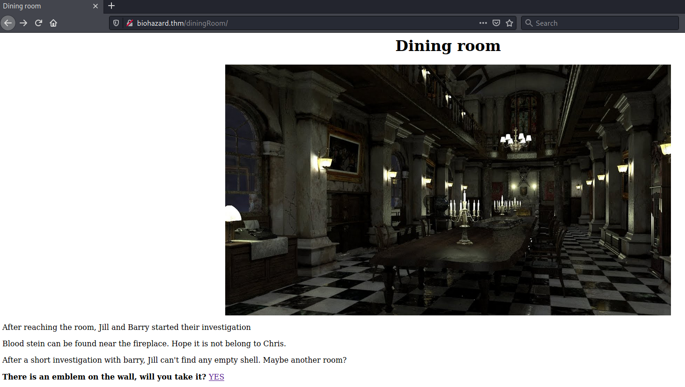    

En cliquant sur le lien YES on trouve le flag.     

```bash
tim@kali:~/Bureau/tryhackme/write-up$ curl http://biohazard.thm/diningRoom/emblem.php
<p>emblem{fec832623ea498e20bf4fe1821d58727}</p>
<p>Look like you can put something on the emblem slot, refresh /diningRoom/</p>
```

La réponse est : emblem{fec832623ea498e20bf4fe1821d58727}     

**What is the lock pick flag**

En regardant dans les codes sources de diningRoom dans les commentaire on trouve une chaîne en base64.   

```bash 
tim@kali:~/Bureau/tryhackme/write-up$ echo "SG93IGFib3V0IHRoZSAvdGVhUm9vbS8=" | base64 -d
How about the /teaRoom/
``` 

En le décodant on trouve un nouveau répertoire caché qui est teaRoom.   

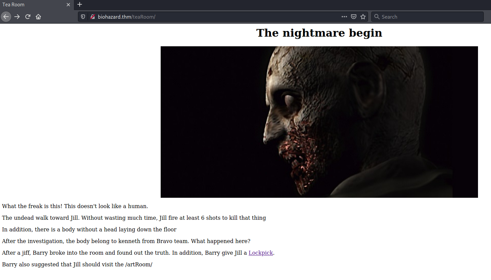    

Sur le nouvelle page on voit un lien avec un lien Lockpick.   

On clique sur se lien et on a notre flag.   

```bash
tim@kali:~/Bureau/tryhackme/write-up$ curl 'http://biohazard.thm/teaRoom/master_of_unlock.html'
<p>lock_pick{037b35e2ff90916a9abf99129c8e1837}</p>
```

La réponse est : lock_pick{037b35e2ff90916a9abf99129c8e1837}   

**What is the music sheet flag**

Sur la page TeaRoom on nous donne un autre lien qui est : artRoom

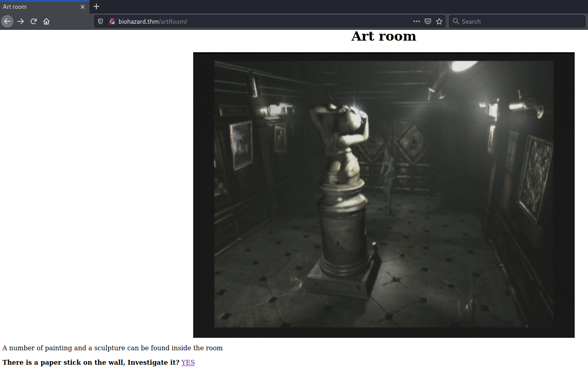    

Sur cette page on trouve un lien.   

```bash
tim@kali:~/Bureau/tryhackme/write-up$ curl 'http://biohazard.thm/artRoom/MansionMap.html'
<p>Look like a map</p>

<p>Location:<br>
/diningRoom/<br>
/teaRoom/<br>
/artRoom/<br>
/barRoom/<br>
/diningRoom2F/<br>
/tigerStatusRoom/<br>
/galleryRoom/<br>
/studyRoom/<br>
/armorRoom/<br>
/attic/<br>
</p>
```

Le lien nous donne un plans du site avec tous les répertoires.    

Dans le lien barRoom on nous demande d'entrer le flag de lockpick
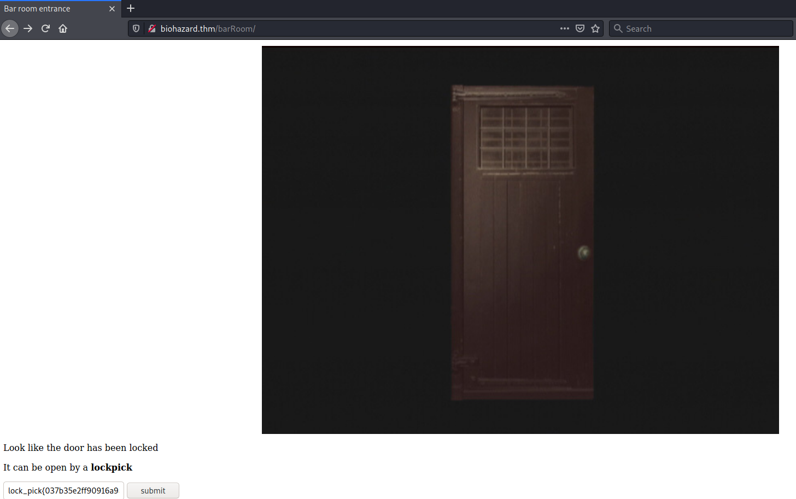    

On tombe sur une nouvelle page qui nous demande un flag ou un lien qui pointe sur une note.   

```bash
tim@kali:~/Bureau/tryhackme/write-up$ curl http://biohazard.thm/barRoom357162e3db904857963e6e0b64b96ba7/musicNote.html
<p>Look like a music note</p>

NV2XG2LDL5ZWQZLFOR5TGNRSMQ3TEZDFMFTDMNLGGVRGIYZWGNSGCZLDMU3GCMLGGY3TMZL5
```

Sur lien on trouve une chaîne en base32.  

```bash
tim@kali:~/Bureau/tryhackme/write-up$ echo 'NV2XG2LDL5ZWQZLFOR5TGNRSMQ3TEZDFMFTDMNLGGVRGIYZWGNSGCZLDMU3GCMLGGY3TMZL5' | base32 -d
music_sheet{362d72deaf65f5bdc63daece6a1f676e}
``` 

On décode le chaîne est on trouve notre flag.    

Réponse : music_sheet{362d72deaf65f5bdc63daece6a1f676e}   

**What is the gold emblem flag**

Dans la page qui nous demande un flag du la partition on met le flag. 

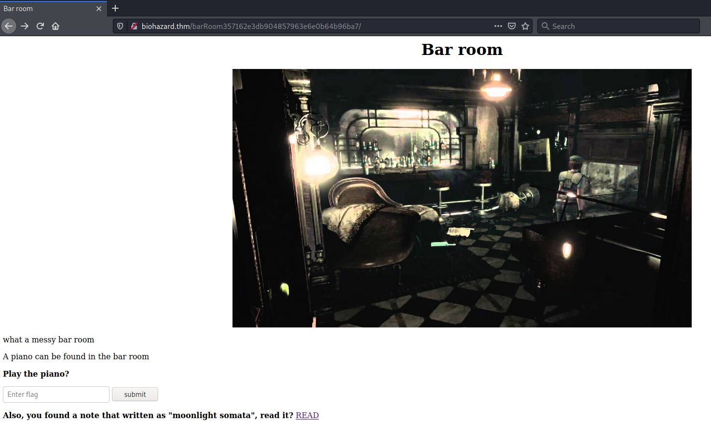  

On tombe sur la page gold emblem.

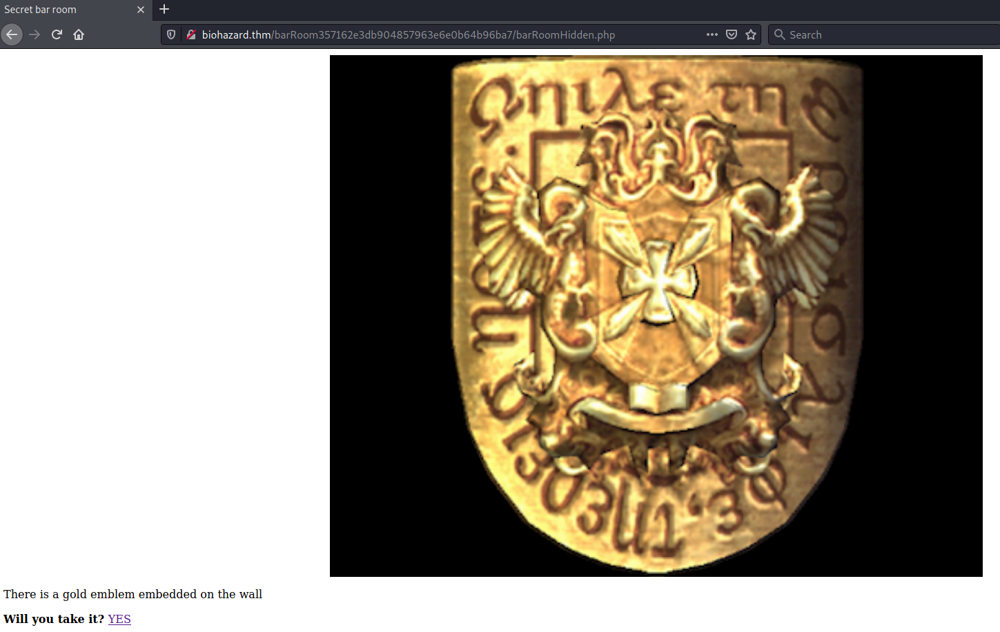 

Il suffit de cliquer sur le ien YES et vous avez le flag.    

```bash
tim@kali:~/Bureau/tryhackme/write-up$ curl http://biohazard.thm/barRoom357162e3db904857963e6e0b64b96ba7/gold_emblem.php
<p>gold_emblem{58a8c41a9d08b8a4e38d02a4d7ff4843}</p>
<p>Look like you can put something on the emblem slot, refresh the previous page</p>
```

Le flag est : gold_emblem{58a8c41a9d08b8a4e38d02a4d7ff4843}     

**What is the shield key flag**

On va sur la page cachée du bar.     

 
La page nous demande le flag de l'emblem.   

 
On le met et trouve un nom.    

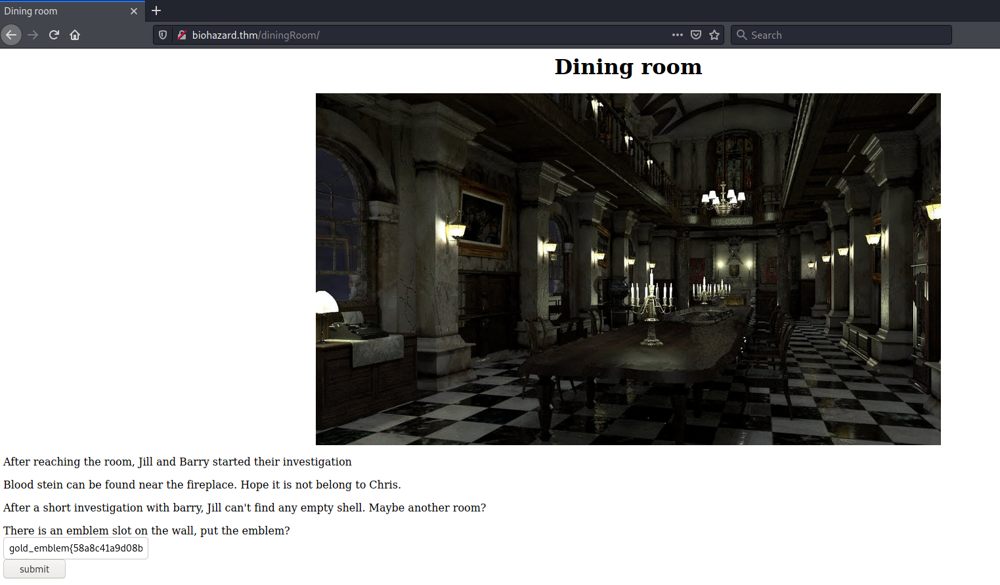 
On va sur diningRoom la page a changée.   
Elle nous demande de mettre le flag de gold_emblem.   

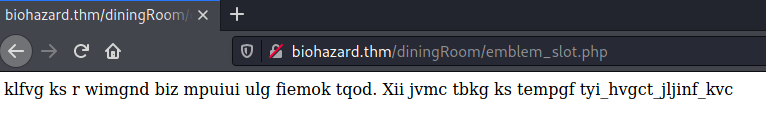 
Une fois validée on a une chaîne chiffrée.    

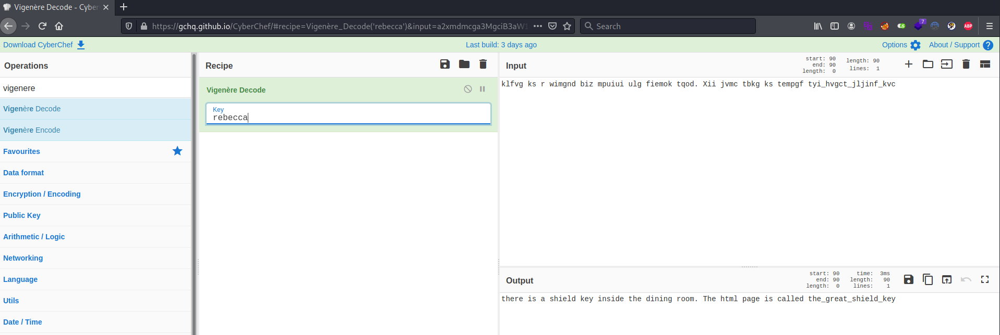

On déchiffre la chaîne qui est chiffrée avec vigenère avec le mot passe rebecca.     

On obtient l'endroit on se trouve le flag.   

```bash
tim@kali:~/Bureau/tryhackme/write-up$ curl http://biohazard.thm/diningRoom/the_great_shield_key.html
<p>shield_key{48a7a9227cd7eb89f0a062590798cbac}</p>
```

Le flag est : shield_key{48a7a9227cd7eb89f0a062590798cbac}   


**What is the blue gem flag**


```bash
tim@kali:~/Bureau/tryhackme/write-up$ curl http://biohazard.thm/diningRoom2F/ -s | grep  '<!--\|<p>'
	<p>Once Jill reach the room, she saw a tall status with a shiining blue gem on top of it. However, she can't reach it</p>
	<!-- Lbh trg gur oyhr trz ol chfuvat gur fgnghf gb gur ybjre sybbe. Gur trz vf ba gur qvavatEbbz svefg sybbe. Ivfvg fnccuver.ugzy -->  
```

Dans le code source de la page diningRoom2F on trouve une chaîne chiffrée en rot13.    

```bash
tim@kali:~/Bureau/tryhackme/write-up$ echo "Lbh trg gur oyhr trz ol chfuvat gur fgnghf gb gur ybjre sybbe. Gur trz vf ba gur qvavatEbbz svefg sybbe. Ivfvg fnccuver.ugzy" | python -c 'import sys; print sys.stdin.read().encode("rot13")'
You get the blue gem by pushing the status to the lower floor. The gem is on the diningRoom first floor. Visit sapphire.html
```

Une fois décodée on a lien.    

```bash
tim@kali:~/Bureau/tryhackme/write-up$ curl http://biohazard.thm/diningRoom/sapphire.html
blue_jewel{e1d457e96cac640f863ec7bc475d48aa}
```

Le flag est : blue_jewel{e1d457e96cac640f863ec7bc475d48aa}   

**What is the FTP username**


Sur la page tigersStatusRoom on nous demande le flag blue_jewel.    

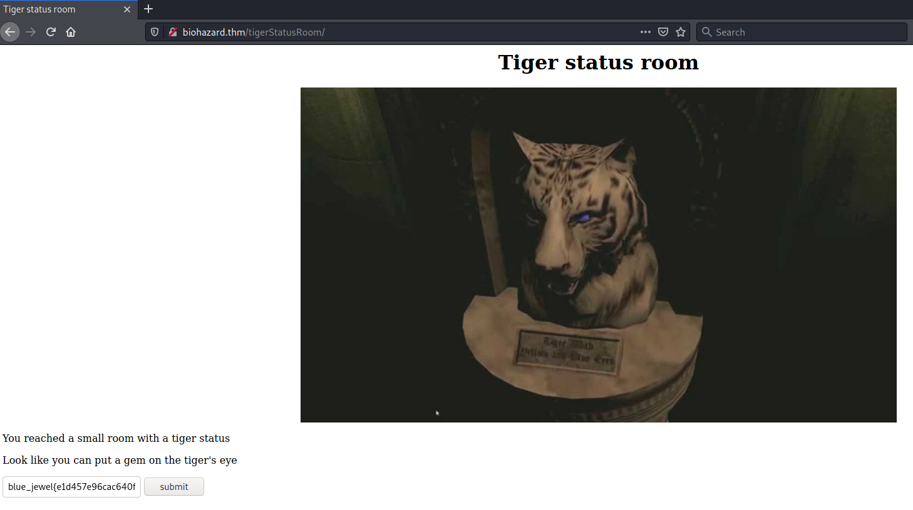

On obtient un morceau de code qui a été encodé 2 fois.  

```bash
tim@kali:~/Bureau/tryhackme/write-up$  echo "S0pXRkVVS0pKQkxIVVdTWUpFM0VTUlk9" | base64 -d | base32 -d
RlRQIHVzZXI6IG
```
On décode la première chaîne.   

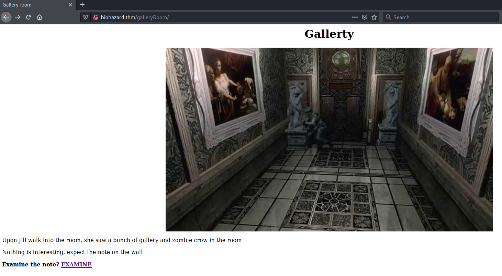

Sur la page on a un lien EXAMINE.   

```bash
tim@kali:~/Bureau/tryhackme/write-up$ curl http://biohazard.thm/galleryRoom/note.txt
crest 2:
GVFWK5KHK5WTGTCILE4DKY3DNN4GQQRTM5AVCTKE
Hint 1: Crest 2 has been encoded twice
Hint 2: Crest 2 contanis 18 letters
Note: You need to collect all 4 crests, combine and decode to reavel another path
The combination should be crest 1 + crest 2 + crest 3 + crest 4. Also, the combination is a type of encoded base and you need to decode it
```

On trouve une chaîne encodée 2 fois.  

```bash
tim@kali:~/Bureau/tryhackme/write-up$ echo "GVFWK5KHK5WTGTCILE4DKY3DNN4GQQRTM5AVCTKE" | base32 -d | base58 -d
h1bnRlciwgRlRQIHBh
```

On décode la deuxième chaîne.     

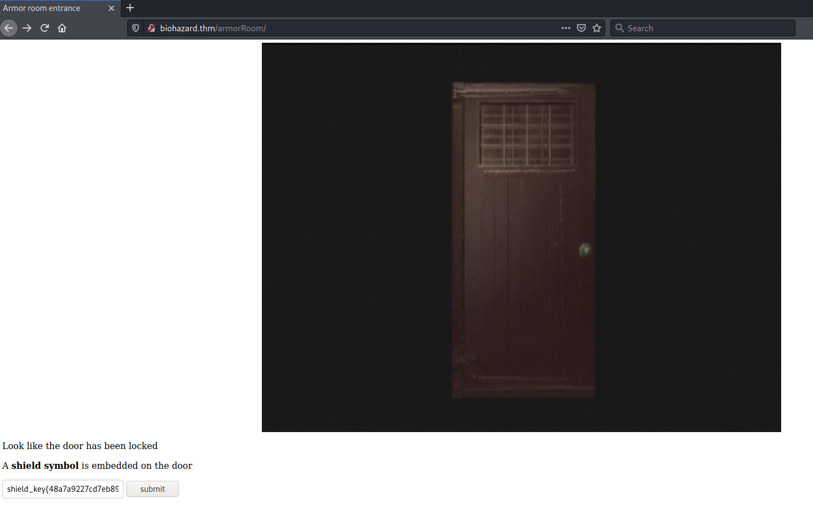

Dans armorRoom on met le flag shield_key.    
Sur la page suivante, il y a un lien READ.   

```bash
tim@kali:~/Bureau/tryhackme/write-up$ curl http://biohazard.thm/armorRoom547845982c18936a25a9b37096b21fc1/note.txt
crest 3:
MDAxMTAxMTAgMDAxMTAwMTEgMDAxMDAwMDAgMDAxMTAwMTEgMDAxMTAwMTEgMDAxMDAwMDAgMDAxMTAxMDAgMDExMDAxMDAgMDAxMDAwMDAgMDAxMTAwMTEgMDAxMTAxMTAgMDAxMDAwMDAgMDAxMTAxMDAgMDAxMTEwMDEgMDAxMDAwMDAgMDAxMTAxMDAgMDAxMTEwMDAgMDAxMDAwMDAgMDAxMTAxMTAgMDExMDAwMTEgMDAxMDAwMDAgMDAxMTAxMTEgMDAxMTAxMTAgMDAxMDAwMDAgMDAxMTAxMTAgMDAxMTAxMDAgMDAxMDAwMDAgMDAxMTAxMDEgMDAxMTAxMTAgMDAxMDAwMDAgMDAxMTAwMTEgMDAxMTEwMDEgMDAxMDAwMDAgMDAxMTAxMTAgMDExMDAwMDEgMDAxMDAwMDAgMDAxMTAxMDEgMDAxMTEwMDEgMDAxMDAwMDAgMDAxMTAxMDEgMDAxMTAxMTEgMDAxMDAwMDAgMDAxMTAwMTEgMDAxMTAxMDEgMDAxMDAwMDAgMDAxMTAwMTEgMDAxMTAwMDAgMDAxMDAwMDAgMDAxMTAxMDEgMDAxMTEwMDAgMDAxMDAwMDAgMDAxMTAwMTEgMDAxMTAwMTAgMDAxMDAwMDAgMDAxMTAxMTAgMDAxMTEwMDA=
Hint 1: Crest 3 has been encoded three times
Hint 2: Crest 3 contanis 19 letters
Note: You need to collect all 4 crests, combine and decode to reavel another path
The combination should be crest 1 + crest 2 + crest 3 + crest 4. Also, the combination is a type of encoded base and you need to decode it
```

On trouve la troisième chaîne encodée trois fois. 

```bash
tim@kali:~/Bureau/tryhackme/write-up$ echo "MDAxMTAxMTAgMDAxMTAwMTEgMDAxMDAwMDAgMDAxMTAwMTEgMDAxMTAwMTEgMDAxMDAwMDAgMDAxMTAxMDAgMDExMDAxMDAgMDAxMDAwMDAgMDAxMTAwMTEgMDAxMTAxMTAgMDAxMDAwMDAgMDAxMTAxMDAgMDAxMTEwMDEgMDAxMDAwMDAgMDAxMTAxMDAgMDAxMTEwMDAgMDAxMDAwMDAgMDAxMTAxMTAgMDExMDAwMTEgMDAxMDAwMDAgMDAxMTAxMTEgMDAxMTAxMTAgMDAxMDAwMDAgMDAxMTAxMTAgMDAxMTAxMDAgMDAxMDAwMDAgMDAxMTAxMDEgMDAxMTAxMTAgMDAxMDAwMDAgMDAxMTAwMTEgMDAxMTEwMDEgMDAxMDAwMDAgMDAxMTAxMTAgMDExMDAwMDEgMDAxMDAwMDAgMDAxMTAxMDEgMDAxMTEwMDEgMDAxMDAwMDAgMDAxMTAxMDEgMDAxMTAxMTEgMDAxMDAwMDAgMDAxMTAwMTEgMDAxMTAxMDEgMDAxMDAwMDAgMDAxMTAwMTEgMDAxMTAwMDAgMDAxMDAwMDAgMDAxMTAxMDEgMDAxMTEwMDAgMDAxMDAwMDAgMDAxMTAwMTEgMDAxMTAwMTAgMDAxMDAwMDAgMDAxMTAxMTAgMDAxMTEwMDA=" | base64 -d
00110110 00110011 00100000 00110011 00110011 00100000 00110100 01100100 00100000 00110011 00110110 00100000 00110100 00111001 00100000 00110100 00111000 00100000 00110110 01100011 00100000 00110111 00110110 00100000 00110110 00110100 00100000 00110101 00110110 00100000 00110011 00111001 00100000 00110110 01100001 00100000 00110101 00111001 00100000 00110101 00110111 00100000 00110011 00110101 00100000 00110011 00110000 00100000 00110101 00111000 00100000 00110011 00110010 00100000 00110110 00111000
```

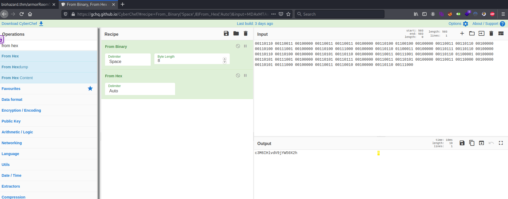   

On a la troisième chaîne.    

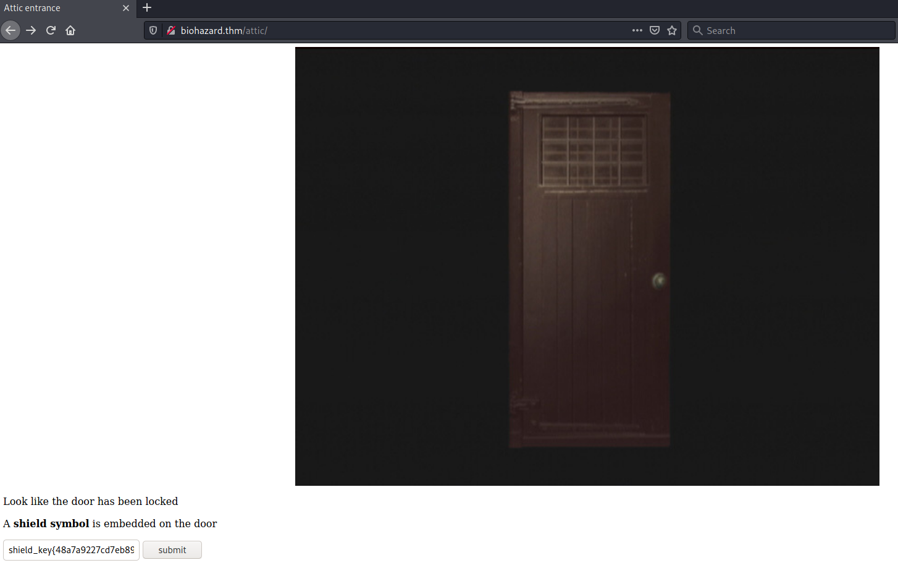   

On va sur attic et on met le flag shield_key.  
On a un lien READ.    

```bash
tim@kali:~/Bureau/tryhackme/write-up$ curl http://biohazard.thm/attic909447f184afdfb352af8b8a25ffff1d/note.txt
crest 4:
gSUERauVpvKzRpyPpuYz66JDmRTbJubaoArM6CAQsnVwte6zF9J4GGYyun3k5qM9ma4s
Hint 1: Crest 2 has been encoded twice
Hint 2: Crest 2 contanis 17 characters
Note: You need to collect all 4 crests, combine and decode to reavel another path
The combination should be crest 1 + crest 2 + crest 3 + crest 4. Also, the combination is a type of encoded base and you need to decode it
```

On obtient une chaîne encodée deux fois.   

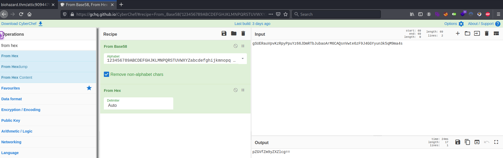   

On obtient la quatrième chaîne. 

On rassemble les trois chaînes.    

RlRQIHVzZXI6IG + h1bnRlciwgRlRQIHBh + c3M6IHlvdV9jYW50X2h + pZGVfZm9yZXZlcg==

```bash
tim@kali:~/Bureau/tryhackme/write-up$ echo "RlRQIHVzZXI6IGh1bnRlciwgRlRQIHBhc3M6IHlvdV9jYW50X2hpZGVfZm9yZXZlcg==" | base64 -d
FTP user: hunter, FTP pass: you_cant_hide_forever
```

On a les identifiant pour FTP. 

La réponse pour le nom est : hunter     

What is the FTP password   

La réponse pour le mot de passe est : you_cant_hide_forever     

## Task 3 The guard house ##

**Where is the hidden directory mentioned by Barry**

```bash
tim@kali:~/Bureau/tryhackme/write-up$ ftp biohazard.thm
Connected to biohazard.thm.
220 (vsFTPd 3.0.3)
Name (biohazard.thm:tim): hunter
331 Please specify the password.
Password:
230 Login successful.
Remote system type is UNIX.
Using binary mode to transfer files.
200 PORT command successful. Consider using PASV.
150 Here comes the directory listing.
drwxrwxrwx    2 1002     1002         4096 Sep 20  2019 .
drwxrwxrwx    2 1002     1002         4096 Sep 20  2019 ..
-rw-r--r--    1 0        0            7994 Sep 19  2019 001-key.jpg
-rw-r--r--    1 0        0            2210 Sep 19  2019 002-key.jpg
-rw-r--r--    1 0        0            2146 Sep 19  2019 003-key.jpg
-rw-r--r--    1 0        0             121 Sep 19  2019 helmet_key.txt.gpg
-rw-r--r--    1 0        0             170 Sep 20  2019 important.txt
226 Directory send OK.
ftp> mget *
mget 001-key.jpg? y
200 PORT command successful. Consider using PASV.
150 Opening BINARY mode data connection for 001-key.jpg (7994 bytes).
226 Transfer complete.
7994 bytes received in 0.00 secs (3.2580 MB/s)
mget 002-key.jpg? y
200 PORT command successful. Consider using PASV.
150 Opening BINARY mode data connection for 002-key.jpg (2210 bytes).
226 Transfer complete.
2210 bytes received in 0.01 secs (261.2204 kB/s)
mget 003-key.jpg? y
200 PORT command successful. Consider using PASV.
150 Opening BINARY mode data connection for 003-key.jpg (2146 bytes).
226 Transfer complete.
2146 bytes received in 0.00 secs (14.6185 MB/s)
mget helmet_key.txt.gpg? y
200 PORT command successful. Consider using PASV.
150 Opening BINARY mode data connection for helmet_key.txt.gpg (121 bytes).
226 Transfer complete.
121 bytes received in 0.05 secs (2.2958 kB/s)
mget important.txt? y
200 PORT command successful. Consider using PASV.
150 Opening BINARY mode data connection for important.txt (170 bytes).
226 Transfer complete.
170 bytes received in 0.00 secs (67.6235 kB/s)
```

On transfert les fichiers.    

```bash
tim@kali:~/Bureau/tryhackme/write-up$ cat important.txt 
Jill,

I think the helmet key is inside the text file, but I have no clue on decrypting stuff. Also, I come across a /hidden_closet/ door but it was locked.

From,
Barry
```

Le répertoire caché est : \/hidden_closet\/    

**Password for the encrypted file**

```bash
tim@kali:~/Bureau/tryhackme/write-up$ steghide extract -sf 001-key.jpg 
Entrez la passphrase: 
�criture des donn�es extraites dans "key-001.txt".
tim@kali:~/Bureau/tryhackme/write-up$ cat key-001.txt 
cGxhbnQ0Ml9jYW
```

On la première chaîne qui est : cGxhbnQ0Ml9jYW    

```bash
tim@kali:~/Bureau/tryhackme/write-up$ exiftool 002-key.jpg 
ExifTool Version Number         : 12.16
File Name                       : 002-key.jpg
Directory                       : .
File Size                       : 2.2 KiB
File Modification Date/Time     : 2021:08:22 21:54:51+02:00
File Access Date/Time           : 2021:08:22 21:54:51+02:00
File Inode Change Date/Time     : 2021:08:22 21:54:51+02:00
File Permissions                : rw-r--r--
File Type                       : JPEG
File Type Extension             : jpg
MIME Type                       : image/jpeg
JFIF Version                    : 1.01
Resolution Unit                 : None
X Resolution                    : 1
Y Resolution                    : 1
Comment                         : 5fYmVfZGVzdHJveV9
Image Width                     : 100
Image Height                    : 80
Encoding Process                : Progressive DCT, Huffman coding
Bits Per Sample                 : 8
Color Components                : 3
Y Cb Cr Sub Sampling            : YCbCr4:2:0 (2 2)
Image Size                      : 100x80
Megapixels                      : 0.008
```

On la deuxième chaîne est : 5fYmVfZGVzdHJveV9    

```bash
tim@kali:~/Bureau/tryhackme/write-up$ binwalk 003-key.jpg -e 

DECIMAL       HEXADECIMAL     DESCRIPTION
--------------------------------------------------------------------------------
0             0x0             JPEG image data, JFIF standard 1.01
1930          0x78A           Zip archive data, at least v2.0 to extract, uncompressed size: 14, name: key-003.txt
2124          0x84C           End of Zip archive, footer length: 22

tim@kali:~/Bureau/tryhackme/write-up$ cd _003-key.jpg.extracted/
tim@kali:~/Bureau/tryhackme/write-up/_003-key.jpg.extracted$ ls
78A.zip  key-003.txt
tim@kali:~/Bureau/tryhackme/write-up/_003-key.jpg.extracted$ cat key-003.txt 
3aXRoX3Zqb2x0
```

La troisième chaîne est : 3aXRoX3Zqb2x0    

On rassemble les 3 chaînes : cGxhbnQ0Ml9jYW5fYmVfZGVzdHJveV93aXRoX3Zqb2x0  

```bash
echo "cGxhbnQ0Ml9jYW5fYmVfZGVzdHJveV93aXRoX3Zqb2x0" | base64 -d
plant42_can_be_destroy_with_vjolt
```

On a le mot de passe pour déchiffrer le fichier.  
La réponse est : plant42_can_be_destroy_with_vjolt     

**What is the helmet key flag**

```bash
tim@kali:~/Bureau/tryhackme/write-up$ gpg -d helmet_key.txt.gpg 
gpg: données chiffrées avec AES256.CFB
gpg: chiffré avec 1 phrase secrète
helmet_key{458493193501d2b94bbab2e727f8db4b}
```

On déchiffre le fichier et on a le flag.    

Réponse : helmet_key{458493193501d2b94bbab2e727f8db4b}    

## Task 4 The Revisit ##

**What is the SSH login username**

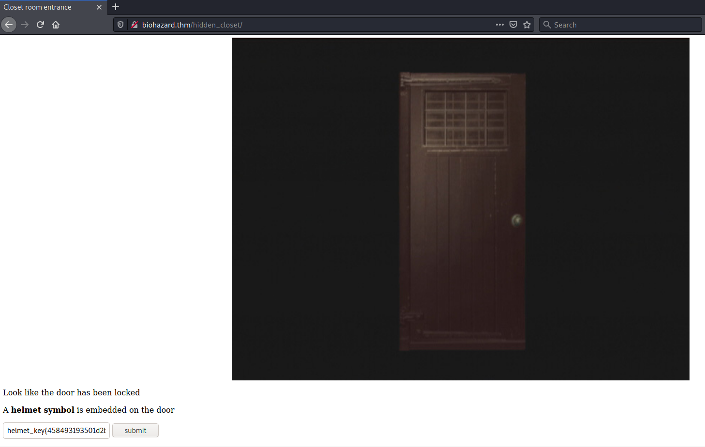   

Sur la page hidden_closet on met le flag helmet_key.   

On tombe sur une page avec deux liens.  
Le lien READ :  

```bash
tim@kali:~/Bureau/tryhackme/write-up$ curl http://biohazard.thm/hiddenCloset8997e740cb7f5cece994381b9477ec38/MO_DISK1.txt
wpbwbxr wpkzg pltwnhro, txrks_xfqsxrd_bvv_fy_rvmexa_ajk
```
C'est du vigenère mais j'ai pas le mot de passe.  
On peut pas le déchiffrer maintenant.    

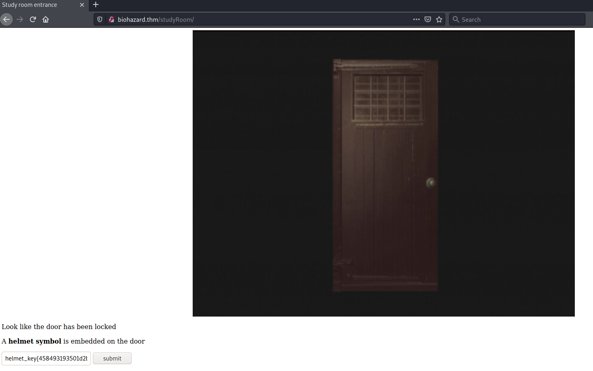 

On va sur la page studyRoom est on met le flag helmet symbol.     

On tombe sur une page avec le lien EXAMINE qui pointe vers un fichier doom.tar.gz.    

```bash
tim@kali:~/Bureau/tryhackme/write-up$ wget http://biohazard.thm/studyRoom28341c5e98c93b89258a6389fd608a3c/doom.tar.gz -nv
2021-08-23 14:27:41 URL:http://biohazard.thm/studyRoom28341c5e98c93b89258a6389fd608a3c/doom.tar.gz [149/149] -> "doom.tar.gz" [1]

tim@kali:~/Bureau/tryhackme/write-up$ tar -xf doom.tar.gz

tim@kali:~/Bureau/tryhackme/write-up$ cat eagle_medal.txt 
SSH user: umbrella_guest
```

On trouve le nom d'utilisateur SSH qui est : umbrella_guest    

**what is the SSH login password**   

```bash
tim@kali:~/Bureau/tryhackme/write-up$ curl http://biohazard.thm/hiddenCloset8997e740cb7f5cece994381b9477ec38/wolf_medal.txt
SSH password: T_virus_rules
```
Sur l'autre lien EXAMIME on a le mot de passe.   

Le mot de passe est : T_virus_rules      

**Who the STARS bravo team leader**    

```bash
tim@kali:~/Bureau/tryhackme/write-up$ curl http://biohazard.thm/hiddenCloset8997e740cb7f5cece994381b9477ec38/ -s | grep '<p>'
   <p>The closet room lead to an underground cave</p>
	<p>In the cave, Jill met injured Enrico, the leader of the STARS Bravo team. He mentioned there is a traitor among the STARTS Alpha team.</p>
	<p>When he was about to tell the traitor name, suddenly, a gun shot can be heard and Enrico was shot dead.</p>
	<p>Jill somehow cannot figure out who did that. Also, Jill found a MO disk 1 and a wolf Medal</p>
	<p><b>Read the MO disk 1?</b>   <a href="MO_DISK1.txt">READ</a></p>
	<p><b>Examine the wolf medal?</b>  <a href="wolf_medal.txt">EXAMINE</a></p> 

```

Sur la page hiddenCloset le team leader est indiqué comme : Enrico     

## Task 5 Underground laboratory ##

**Where you found Chris**

```bash
tim@kali:~/Bureau/tryhackme/write-up$ ssh umbrella_guest@biohazard.thm
umbrella_guest@biohazard.thm's password: 
Welcome to Ubuntu 18.04 LTS (GNU/Linux 4.15.0-20-generic x86_64)

 * Documentation:  https://help.ubuntu.com
 * Management:     https://landscape.canonical.com
 * Support:        https://ubuntu.com/advantage


 * Canonical Livepatch is available for installation.
   - Reduce system reboots and improve kernel security. Activate at:
     https://ubuntu.com/livepatch

320 packages can be updated.
58 updates are security updates.

Failed to connect to https://changelogs.ubuntu.com/meta-release-lts. Check your Internet connection or proxy settings

Last login: Fri Sep 20 03:25:46 2019 from 127.0.0.1

umbrella_guest@umbrella_corp:~$ ls -al
total 68
drwxr-xr-x  8 umbrella_guest umbrella 4096 Aug 23 05:49 .
drwxr-xr-x  5 root           root     4096 Sep 20  2019 ..
-rw-------  1 umbrella_guest umbrella  243 Aug 23 05:49 .bash_history
-rw-r--r--  1 umbrella_guest umbrella  220 Sep 19  2019 .bash_logout
-rw-r--r--  1 umbrella_guest umbrella 3771 Sep 19  2019 .bashrc
drwxrwxr-x  6 umbrella_guest umbrella 4096 Sep 20  2019 .cache
drwxr-xr-x 11 umbrella_guest umbrella 4096 Sep 19  2019 .config
-rw-r--r--  1 umbrella_guest umbrella   26 Sep 19  2019 .dmrc
drwx------  3 umbrella_guest umbrella 4096 Sep 19  2019 .gnupg
-rw-------  1 umbrella_guest umbrella  346 Sep 19  2019 .ICEauthority
drwxr-xr-x  2 umbrella_guest umbrella 4096 Sep 20  2019 .jailcell
drwxr-xr-x  3 umbrella_guest umbrella 4096 Sep 19  2019 .local
-rw-r--r--  1 umbrella_guest umbrella  807 Sep 19  2019 .profile
drwx------  2 umbrella_guest umbrella 4096 Sep 20  2019 .ssh
-rw-------  1 umbrella_guest umbrella  109 Sep 19  2019 .Xauthority
-rw-------  1 umbrella_guest umbrella 7546 Sep 19  2019 .xsession-errors
umbrella_guest@umbrella_corp:~$ ls .jailcell/
chris.txt

```

On se connecte sur le SSH.    
Dans le répertoire de l'utilisateur on trouve un répertoire caché .jailcell.    
Dans .jailcell il y a un fichier chris.txt.   
La réponse est : jaicell.     

**Who is the traitor**

```bash
umbrella_guest@umbrella_corp:~$ cat .jailcell/chris.txt 
Jill: Chris, is that you?
Chris: Jill, you finally come. I was locked in the Jail cell for a while. It seem that weasker is behind all this.
Jil, What? Weasker? He is the traitor?
Chris: Yes, Jill. Unfortunately, he play us like a damn fiddle.
Jill: Let's get out of here first, I have contact brad for helicopter support.
Chris: Thanks Jill, here, take this MO Disk 2 with you. It look like the key to decipher something.
Jill: Alright, I will deal with him later.
Chris: see ya.

MO disk 2: albert 
```

Dans le fichier chris.txt on comprend que Weasker est le traitre.    
On a aussi le mot de passe pour la chaîne trouvée dans doom.tar.gz.   

La réponse est : weasker    

**The login password for the traitor**

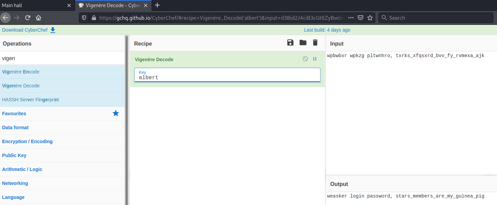    

On le déchiffre est on trouve un mot de passe qui est stars_members_are_my_guinea_pig.   

La réponse est : stars_members_are_my_guinea_pig     

**The name of the ultimate form**

```bash
weasker@umbrella_corp:/home/umbrella_guest$ cd ../weasker/
weasker@umbrella_corp:~$ ls
Desktop  weasker_note.txt
weasker@umbrella_corp:~$ cat weasker_note.txt 
Weaker: Finally, you are here, Jill.
Jill: Weasker! stop it, You are destroying the  mankind.
Weasker: Destroying the mankind? How about creating a 'new' mankind. A world, only the strong can survive.
Jill: This is insane.
Weasker: Let me show you the ultimate lifeform, the Tyrant.

(Tyrant jump out and kill Weasker instantly)
(Jill able to stun the tyrant will a few powerful magnum round)

Alarm: Warning! warning! Self-detruct sequence has been activated. All personal, please evacuate immediately. (Repeat)
Jill: Poor bastard
```

On change d'utilisateur.    
On va dans le répertoir de l'utilisateur.  
On lit le fichier weasker_note.txt.   

On voit que dans le fichier la forme utlime est : Tyrant.     

**The root flag**

```bash
weasker@umbrella_corp:~$ sudo -l
[sudo] password for weasker: 
Matching Defaults entries for weasker on umbrella_corp:
    env_reset, mail_badpass, secure_path=/usr/local/sbin\:/usr/local/bin\:/usr/sbin\:/usr/bin\:/sbin\:/bin\:/snap/bin

User weasker may run the following commands on umbrella_corp:

weasker@umbrella_corp:~$ sudo sh
# cat /root/root.txt
In the state of emergency, Jill, Barry and Chris are reaching the helipad and awaiting for the helicopter support.

Suddenly, the Tyrant jump out from nowhere. After a tough fight, brad, throw a rocket launcher on the helipad. Without thinking twice, Jill pick up the launcher and fire at the Tyrant.

The Tyrant shredded into pieces and the Mansion was blowed. The survivor able to escape with the helicopter and prepare for their next fight.

The End

flag: 3c5794a00dc56c35f2bf096571edf3bf
```

On voit le sudo est configuré pour donner les droits root sur n'importe quel programme.     
On obtient un shell root.   
On lit le fichier root.txt dans le répetoire root et on obtient le flag.    

La réponse est : flag: 3c5794a00dc56c35f2bf096571edf3bf    