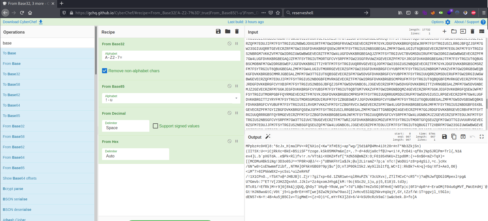

# Break it #

## Task 1 Bases ##

**[Super easy] MVQXG6K7MJQXGZJTGI======**

```bash
tim@kali:~/Bureau/tryhackme/write-up$ echo "MVQXG6K7MJQXGZJTGI======" | base32 -d
easy_base32
```

C'est du base32.   

Réponse : easy_base32    

**[Easy] TVJYWEtZVE1NVlBXRVlMVE1WWlE9PT09**

```bash
tim@kali:~/Bureau/tryhackme/write-up$ echo "TVJYWEtZVE1NVlBXRVlMVE1WWlE9PT09" | base64 -d | base32 -d
double_bases
```

C'est encodé en base64, puis en base32.   

La réponse est : double_bases     

**[Moderate] GM4HOU3VHBAW6OKNJJFW6SS2IZ3VAMTYORFDMUC2G44EQULIJI3WIVRUMNCWI6KGK5XEKZDTN5YU2RT2MR3E45KKI5TXSOJTKZJTC4KRKFDWKZTZOF3TORJTGZTXGNKCOE======**

```bash
tim@kali:~/Bureau/tryhackme/write-up$ echo "GM4HOU3VHBAW6OKNJJFW6SS2IZ3VAMTYORFDMUC2G44EQULIJI3WIVRUMNCWI6KGK5XEKZDTN5YU2RT2MR3E45KKI5TXSOJTKZJTC4KRKFDWKZTZOF3TORJTGZTXGNKCOE======" | base32 -d | base58 -d | base16 -d | base64 -d
base16_is_hex
```

Ici c'est encodé en :   
base 32    
base 58    
base 16    
base 64    

La réponse est : base16_is_hex    


**[Hard] HRBUGQDUHFWDIXKUIBWXIJTHIE3DCY3BIE2FKQSZHNDE6MRUIA2TWWDMHRBV2ZKCHQWFCTLPIE2EEJDBIBZCEW3OHUSTOLRCHNFGMVC6IFJXIQ2AHVMVONSBHVOVIM2MHVPV42J4HQVCQ4REIFHVIJ2WHFWDYQSUHROGILJCIFIU23CXHNCEIXK2HRDVSXKOHV2SQJLC**

```bash
git clone --recursive https://github.com/securisec/chepy.git
cd chepy
pip3 install -e .
```

Il faut installer la dernière version de chepy sinon, il manque des fonctions.   

```python
tim@kali:~/Bureau/tryhackme/write-up$ cat decode.py 
from chepy import Chepy

data = "HRBUGQDUHFWDIXKUIBWXIJTHIE3DCY3BIE2FKQSZHNDE6MRUIA2TWWDMHRBV2ZKCHQWFCTLPIE2EEJDBIBZCEW3OHUSTOLRCHNFGMVC6IFJXIQ2AHVMVONSBHVOVIM2MHVPV42J4HQVCQ4REIFHVIJ2WHFWDYQSUHROGILJCIFIU23CXHNCEIXK2HRDVSXKOHV2SQJLC"
c = (
        Chepy(data)
        .base32_decode()
        .base85_decode()
        .base64_decode()
        .base58_decode()
        .base85_decode()
        .base64_decode()
        .base64_decode()
    )
print(c.o)
```
```bash
tim@kali:~/Bureau/tryhackme/write-up$ python3 decode.py 
b'that_is_a_lot_of_bases'
```

On install chepy. 
Dans un script python on décode toutes les bases.   
Les bases sont :   
base32   
base85   
base64  
base58  
base85  
base64   
base64   

La réponse est : that_is_a_lot_of_bases   

**[Insane]**
```text
GIUTMORPGBFEMVRKGEVECRZRFM7GGJRDGFDVKKBRGITT2XZYFM7FSYTRGIUUQRRVGBEGALZMFM7GYIZBGNBCMJZ2GEVECRZOFM7GW23SGFDVKKBRGFQSEWJRFM7FSYTRGIUS2NBRGMSDUIRUFM7GW2DRGIUS2NBQGEVECRZPFM7GYJRCGFDVKKBRGITT2VRNGBEGALZMFM7GW23SGIUVUURVGEVECRZPFM7TWQJHGFDVKKBRGBEGAQJXFM7FSYTRGIUS2NBSGFQSEUZQFM7GW5DVGIUS2NBQGEVECRZQFM7TWQJHGFDVKKBRGITT2YRXFM7FSYTRGIUT6QBQGBFFQYRMGEVECRZQFM7GYJRCGFDVKKBRGITT23R6FM7FSYTRGIUUQRRRGBFEMVRKGEVECRZSFM7GGKJEGFDVKKBRGEVECRZVFM7FSYTRGIUT6QBTGMSDUIRUFM7GW4LUGIUUQRRTGEVECRZPFM7TWRZJGFDVKKBRGBSCMMRJGBEGALZMFM7GW4LUGIUSILRPGEVECRZRFM7TWRBIGFDVKKBRGBEGANJPFM7FSYTRGIUT6QBUGJBFQZJSFM7GW5DVGIUWGWBWGEVECRZSFM7EOUJKFM7FSYTRGIUVCTB2GMSDUIRUFM7GW23SGNBDQMZ4GEVECRZQFM7TWRBIGFDVKKBRGITT2YRWFM7FSYTRGIUSILRVGJOXG3RTFM7GW4LUGIUVUURVGEVECRZSFM7GW5DVGFDVKKBRGBEGANJNFM7FSYTRGIUTMORTGFCVYSRPFM7GW23SGIUUQRRTGEVECRZSFM7TWQJHGFDVKKBRGBEGAQJYFM7FSYTRGIUUQRRUGM7VKKZVFM7GYIZBGFRVCVJWGEVECRZOFM7GW2DRGFDVKKBRGITT2YRWFM7FSYTRGIUUQRRVGITT2XBRFM7GW2DRGBSWEQBKGFDVKKBRGFCVYRBLGBEGALZMFM7GW23SGIUT6QBSGEVECRZSFM7GW3TTGFDVKKBRGBSCMOZVFM7FSYTRGIUSILRRGFQSEUZQFM7GW4LUGFRVCVJWGEVECRZQFM7GGJRDGFDVKKBRGBSCMPRPFM7FSYTRGIUTMORPGBFEMVRKGEVECRZSFM7EOUJJFM7FSYTRGIUS2NBSGEVECQJOFM7GW5DVGIUWGWBWGEVECRZPFM7GW23SGFDVKKBRGITT2YRTFM7FSYTRGIUS2NBSGBEGALZMFM7GW23SGFRVCVJWGEVECRZTFM7GW2DRGFDVKKBRGBEGANJNFM7FSYTRGIUUQRRRGBFE6XBLGEVECRZRFM7GW3TTGFDVKKBRGBEGAQJXFM7FSYTRGIUTMORPGBFE6XBLGEVECRZSFM7GW2DRGFDVKKBRGBSCMPROFM7FSYTRGIUT6QBYGJOXG3RTFM7GW5DVGNBC6LJ3GEVECRZSFM7TWQJHGFDVKKBRGFCVYUBQFM7FSYTRGIUUQRRRGBFE6XBLGEVECRZOFM7GYKJDGFDVKKBRGBEGANJSFM7FSYTRGIUTMORTGJOXG3RTFM7GW3TTGIUWGWBWGEVECRZPFM7EOUJKFM7FSYTRGIUS2NBSGBSCMOBNFM7GW4LUGIUVUURVGEVECRZPFM7TWQJHGFDVKKBRGFCVYUBSFM7FSYTRGIUS2NBWGM7VKKZVFM7GW23SGBSWEORIGFDVKKBRGFQSEWJXFM7FSYTRGIUTMORTGBSCMOBNFM7GW5DVGNBCMJZ2GEVECRZRFM7GW2DRGFDVKKBRGFQSEZJ4FM7FSYTRGIUT6QBUGJBFQZJSFM7GW5DVGIUS2NBQGEVECRZPFM7EOUJIFM7FSYTRGIUTMORTGBEGALZMFM7GW5DVGNBC6LJ3GEVECRZQFM7GW4LUGFDVKKBRGBEGAQJYFM7FSYTRGIUTMORTGBEGALZMFM7GW23SGIUT6QBSGEVECRZSFM7GYKJDGFDVKKBRGFQSEWJXFM7FSYTRGIUT6QBUGBSCMOBNFM7GW3TTGIUUQRRTGEVECRZOFM7TWQJHGFDVKKBRGFCVYUBWFM7FSYTRGIUVCTB2GJOXG3RTFM7GW5DVGBSWEQBKGFDVKKBRGFQSEWJVFM7FSYTRGIUUQRRVGFCVYSRPFM7GW2DRGBSWEPJJGFDVKKBRGFQSEZJ4FM7FSYTRGIUT6QBUGBSCMOBNFM7GW5DVGNBC6LJ3GEVECRZPFM7GGJRDGFDVKKBRGBSCMPRQFM7FSYTRGIUTMORPGBFEMVRKGEVECRZQFM7TWRBIGFDVKKBRGFCVYTJWFM7FSYTRGIUUQRRRGBFEMVRKGEVECRZOFM7GW5DVGFDVKKBRGFQSEWJTFM7FSYTRGIUT6QBYGMSDUIRUFM7GYIZBGNBCMJZ2GEVECRZPFM7EOUJIFM7FSYTRGIUSILRVGM7VKKZVFM7GW2DRGBSWEPJJGFDVKKBRGBSCMMRJGEVECQJOFM7GYIZBGBSWEPJJGFDVKKBRGFQSEWJSFM7FSYTRGIUS2NBOGBFEMVRKGEVECRZPFM7GW3TTGFDVKKBRGFQSEWJSFM7FSYTRGIUT6QBUGFCVYSRPFM7GW5DVGNBCMJZ2GEVECRZSFM7GGKJEGFDVKKBRGBSCMOZUFM7FSYTRGIUUQRRVGBSCMOBNFM7GW23SGBSWEQBKGFDVKKBRGFQSEWJUFM7FSYTRGIUTMORSGMSDUIRUFM7GW3TTGNBCMJZ2GEVECRZPFM7EOUJJFM7FSYTRGIUVCTBWGITT2XBRFM7GW23SGNBDQMZ4GEVECRZSFM7GYKJDGFDVKKBRGBEGAMRUFM7FSYTRGIUSILRRGBSCMOBNFM7GW2DRGNBDQMZ4GEVECRZRFM7GGJRDGFDVKKBRGITT23R4FM7FSYTRGIUTMORPGBFFQYRMGEVECRZPFM7GW3TTGFDVKKBRGFQSEWJXFM7FSYTRGIUVCTBSGBFE6XBLGEVECRZTFM7GGKJEGFDVKKBRGFQSEWJUFM7FSYTRGIUS2NBRGMSDUIRUFM7GYIZBGIUVUURVGEVECRZOFM7GYKJDGFDVKKBRGBEGANJPFM7FSYTRGIUVCTBVGMSDUIRUFM7GW4LUGIUS2NBQGEVECRZQFM7TWQJHGFDVKKBRGFCVYUBPFM7FSYTRGIUUQRRZGM7VKKZVFM7GW4LUGFRVCVJWGEVECRZSFM7EOUJIFM7FSYTRGIUS2NBOGBFEMVRKGEVECRZRFM7GW3TTGFDVKKBRGITT2YRRFM7FSYTRGIUUQRRZGM7VKKZVFM7GYIZBGNBC6LJ3GEVECRZOFM7TWRZJGFDVKKBRGBEGANJPFM7FSYTRGIUS2NBRGM7VKKZVFM7GW2DRGIUUQRRTGEVECRZSFM7GW4LUGFDVKKBRGITT2YRVFM7FSYTRGIUS2NBSGEVECQJOFM7GW4LUGBSWEORIGFDVKKBRGEVECUZ3FM7FSYTRGIUSILRNGBFE6XBLGEVECRZSFM7GW2DRGFDVKKBRGFQSEVRXFM7FSYTRGIUVCTBVGMSDUIRUFM7GW4LUGIUVUURVGEVECRZQFM7GYIZBGFDVKKBRGFCVYUBRFM7FSYTRGIUUQRRVGEVECQJOFM7GW3TTGFRVUWZXGEVECRZOFM7EOUJJFM7FSYTRGIUSILRNGBFE6XBLGEVECRZSFM7GW4LUGFDVKKBRGBEGANJOFM7FSYTRGIUT6QBTGMSDUIRUFM7GW5DVGNBC6LJ3GEVECRZPFM7TWRZJGFDVKKBRGFCVYUBPFM7FSYTRGIUUQRRZGM7VKKZVFM7GW2DRGIUWGWBWGEVECRZSFM7GW5DVGFDVKKBRGITT2YRVFM7FSYTRGIUSILRQGM7VKKZVFM7GYIZBGIUSILRPGEVECRZOFM7EOUJJFM7FSYTRGIUUQRRRGBFE6XBLGEVECRZOFM7EOUJKFM7FSYTRGIUT6QBUGFQSEUZQFM7GW4LUGIUTMORRGEVECRZTFM7GW3TTGFDVKKBRGBEGANJQFM7FSYTRGIUUQRRVGJOXG3RTFM7GW23SGNBDQMZ4GEVECRZRFM7GYJRCGFDVKKBRGEVECOZKGEVECQJOFM7GW3TTGIUVUURVGEVECRZRFM7TWQJHGFDVKKBRGBEGANJNFM7FSYTRGIUUQRRVGFQSEUZQFM7GW5DVGIUT6QBSGEVECRZSFM7GW5DVGFDVKKBRGFCVYXB3FM7FSYTRGIUSILRVGJOXG3RTFM7GW4LUGIUVUURVGEVECRZSFM7GW3TTGFDVKKBRGBEGANJPFM7FSYTRGIUS2NBSGFCVYSRPFM7GW23SGIUUQRRTGEVECRZQFM7GGJRDGFDVKKBRGFQSETJMGBEGALZMFM7GW3TTGBSWEPJJGFDVKKBRGFCVYXB2FM7FSYTRGIUT6QBUGJBFQZJSFM7GW23SGNBCMJZ2GEVECRZQFM7EOUJKFM7FSYTRGIUS2NBWGMSDUIRUFM7GW3TTGIUUQRRTGEVECRZPFM7GW5DVGFDVKKBRGBSCMOZVFM7FSYTRGIUS2NBRGMSDUIRUFM7GW4LUGIUS2NBQGEVECRZPFM7GW3TTGFDVKKBRGBEGANJPFM7FSYTRGIUTMORXGMSDUIRUFM7GW4LUGIUT6QBSGEVECRZOFM7TWRBIGFDVKKBRGFCVYXB2FM7FSYTRGIUS2NBRGM7VKKZVFM7GYIZBGFRVCVJWGEVECRZSFM7GW3TTGFDVKKBRGBSCMPRTFM7FSYTRGIUTMORPGBFEMVRKGEVECRZPFM7TWQJHGFDVKKBRGITT23R5FM7FSYTRGIUS2NBOGBFE6XBLGEVECRZOFM7TWRBIGFDVKKBRGBSCMPRRFM7FSYTRGIUUQRRRGBFE6XBLGEVECRZOFM7GW3TTGFDVKKBRGBSCMOZUFM7FSYTRGIUS2NBWGM7VKKZVFM7GW5DVGBSWEORIGFDVKKBRGFCVYXB2FM7FSYTRGIUS2NBOGBFE6XBLGEVECRZRFM7GW3TTGFDVKKBRGITT2XZZFM7FSYTRGIUT6QBUGJBFQZJSFM7GW2DRGIUWGWBWGEVECRZPFM7EOUJIFM7FSYTRGIUT6QBYGMSDUIRUFM7GW4LUGNBC6LJ3GEVECRZQFM7EOUJIFM7FSYTRGIUTMORTGBSCMOBNFM7GW3TTGIUTMORRGEVECRZQFM7EOUJIFM7FSYTRGIUVCTBWGFCVYSRPFM7GW3TTGIUVUURVGEVECRZQFM7GW2DRGFDVKKBRGFQSEZJ4FM7FSYTRGIUT6QBUGBSCMOBNFM7GW5DVGIUWGWBWGEVECRZQFM7EOUJJFM7FSYTRGIUUQRRVGITT2XBRFM7GW2DRGFRVUWZXGEVECRZPFM7GW23SGFDVKKBRGEVECRZQFM7FSYTRGIUS2NBSGBSCMOBNFM7GW5DVGBSWEQBKGFDVKKBRGBSCMOZUFM7FSYTRGIUT6QBUGBSCMOBNFM7GW3TTGNBCMJZ2GEVECRZRFM7EOUJJFM7FSYTRGIUS2NBOGBFEMVRKGEVECRZPFM7EOUJKFM7FSYTRGIUT6QBTGMSDUIRUFM7GW23SGIUVUURVGEVECRZRFM7GW2DRGFDVKKBRGBSCMMRJGBSCMOBNFM7GW4LUGIUT6QBSGEVECRZQFM7GGJRDGFDVKKBRGEVECUZZFM7FSYTRGIUSILRNGBFFQYRMGEVECRZPFM7TWRZJGFDVKKBRGITT2VRNGBSCMOBNFM7GW5DVGNBCMJZ2GEVECRZOFM7GW2DRGFDVKKBRGFCVYUBSFM7FSYTRGIUTMORTGBEGALZMFM7GW2DRGIUT6QBSGEVECRZQFM7TWRBIGFDVKKBRGEVECRZSFM7FSYTRGIUUQRRVGJBFQZJSFM7GW4LUGIUWGWBWGEVECRZSFM7TWRZJGFDVKKBRGFQSEVRYFM7FSYTRGIUSILRRGEVECQJOFM7GW3TTGNBCMJZ2GEVECRZSFM7TWRBIGFDVKKBRGBSCMSRZFM7FSYTRGIUTMORSGMSDUIRUFM7GYIZBGIUT6QBSGEVECRZRFM7EOUJIFM7FSYTRGIUS2NBSGBEGALZMFM7GW3TTGNBDQMZ4GEVECRZSFM7GYKJDGFDVKKBRGITT2YRRFM7FSYTRGIUUQRRUGM7VKKZVFM7GW5DVGBSWEORIGFDVKKBRGFCVYXB2FM7FSYTRGIUT6QBQGBFE6XBLGEVECRZPFM7GYIZBGFDVKKBRGITT2XZYFM7FSYTRGIUS2NBWGMSDUIRUFM7GW5DVGFRVUWZXGEVECRZSFM7GGJRDGFDVKKBRGFQSETJMGBSCMOBNFM7GW4LUGIUTMORRGEVECRZSFM7GW23SGFDVKKBRGBEGAMRUFM7FSYTRGIUT6QBYGMSDUIRUFM7GW4LUGIUVCTBUGEVECRZSFM7EOUJKFM7FSYTRGIUTMORTGEVECQJOFM7GW4LUGIUT6QBSGEVECRZSFM7GYKJDGFDVKKBRGFCVYRBLGBSCMOBNFM7GYIZBGNBCMJZ2GEVECRZPFM7GYJRCGFDVKKBRGBSCMMRJGBEGALZMFM7GYIZBGFRVCVJWGEVECRZPFM7GW3TTGFDVKKBRGFQSEWJVFM7FSYTRGIUT6QBUGBSCMOBNFM7GW5DVGIUWGWBWGEVECRZQFM7TWQJHGFDVKKBRGBEGAQJZFM7FSYTRGIUS2NBOGBFEMVRKGEVECRZSFM7GW23SGFDVKKBRGBEGAKJIGBSCMOBNFM7GYIZBGBSWEORIGFDVKKBRGFQSEWJRFM7FSYTRGIUTMORTGJBFQZJSFM7GYIZBGIUVUURVGEVECRZOFM7EOUJKFM7FSYTRGIUTMORTGITT2XBRFM7GW3TTGBSWEPJJGFDVKKBRGBEGAQJXFM7FSYTRGIUVCTBWGITT2XBRFM7GW23SGFRVCVJWGEVECRZPFM7EOUJJFM7FSYTRGIUS2NBRGM7VKKZVFM7GYIZBGIUS2NBQGEVECRZQFM7GW4LUGFDVKKBRGBEGANJPFM7FSYTRGIUVCTBWGITT2XBRFM7GW5DVGBSWEORIGFDVKKBRGFQSETJMGBEGALZMFM7GW5DVGIUUQRRTGEVECRZPFM7GW2DRGFDVKKBRGFQSEWJXFM7FSYTRGIUUQRRVGBEGALZMFM7GW5DVGIUUQRRTGEVECRZOFM7TWRZJGFDVKKBRGBEGAQJZFM7FSYTRGIUTMORPGBFE6XBLGEVECRZRFM7GW3TTGFDVKKBRGEVECOZKGBEGALZMFM7GW3TTGFRVUWZXGEVECRZRFM7EOUJIFM7FSYTRGIUTMORPGBFFQYRMGEVECRZQFM7GW5DVGFDVKKBRGBEGANJPFM7FSYTRGIUUQRRZGMSDUIRUFM7GW4LUGIUUQRRTGEVECRZQFM7GYIZBGFDVKKBRGEVECRZOFM7FSYTRGIUTMORTGITT2XBRFM7GW23SGIUWGWBWGEVECRZPFM7EOUJKFM7FSYTRGIUS2NBSGJOXG3RTFM7GYIZBGFRVCVJWGEVECRZSFM7TWQJHGFDVKKBRGBEGANJOFM7FSYTRGIUVCTBWGFCVYSRPFM7GW2DRGNBCMJZ2GEVECRZRFM7EOUJIFM7FSYTRGIUTMORPGBFFQYRMGEVECRZPFM7TWRBIGFDVKKBRGFQSETJMGBSCMOBNFM7GW4LUGIUTMORRGEVECRZQFM7TWQJHGFDVKKBRGFCVYTJWFM7FSYTRGIUS2NBRGMSDUIRUFM7GW3TTGBSWEQBKGFDVKKBRGFQSEZJ4FM7FSYTRGIUTMORTGJOXG3RTFM7GW4LUGIUS2NBQGEVECRZSFM7TWRBIGFDVKKBRGBSCMPRNFM7FSYTRGIUSILRNGBFE6XBLGEVECRZRFM7GYIZBGFDVKKBRGITT2YRYFM7FSYTRGIUS2NBSGJOXG3RTFM7GW5DVGNBDQMZ4GEVECRZSFM7TWRZJGFDVKKBRGFQSEWJQFM7FSYTRGIUUQRRZGM7VKKZVFM7GYIZBGIUTMORRGEVECRZSFM7GW5DVGFDVKKBRGFCVYTJXFM7FSYTRGIUSILRVGM7VKKZVFM7GW4LUGIUVCTBUGEVECRZQFM7GW23SGFDVKKBRGBSCMMRJGBEGALZMFM7GW3TTGIUWGWBWGEVECRZTFM7TWRZJGFDVKKBRGBSCMSRYFM7FSYTRGIUT6QBUGBEGALZMFM7GW5DVGNBC6LJ3GEVECRZQFM7GW2DRGFDVKKBRGFQSEZJ4FM7FSYTRGIUS2NBOGBFFQYRMGEVECRZOFM7TWRBIGFDVKKBRGEVECRBWFM7FSYTRGIUS2NBOGBFE6XBLGEVECRZTFM7GGKJEGFDVKKBRGFCVYRBLGBEGALZMFM7GW23SGNBDQMZ4GEVECRZQFM7GYIZBGFDVKKBRGITT2XZZFM7FSYTRGIUSILRQGM7VKKZVFM7GW4LUGIUVUURVGEVECRZSFM7GW5DVGFDVKKBRGBSCMPROFM7FSYTRGIUSILRVGMSDUIRUFM7GW3TTGFRVUWZXGEVECRZSFM7GW4LUGFDVKKBRGBSCMPROFM7FSYTRGIUSILRVGM7VKKZVFM7GW3TTGBSWEQBKGFDVKKBRGBSCMOZUFM7FSYTRGIUVCTBSGBFEMVRKGEVECRZPFM7TWRZJGFDVKKBRGFQSEWJXFM7FSYTRGIUTMORPGBFEMVRKGEVECRZOFM7GW2DRGFDVKKBRGBSCMPRSFM7FSYTRGIUS2NBOGBFE6XBLGEVECRZPFM7GYJRCGFDVKKBRGEVECRZVFM7FSYTRGIUT6QBTGMSDUIRUFM7GW2DRGIUT6QBSGEVECRZSFM7TWRBIGFDVKKBRGFCVYUBUFM7FSYTRGIUS2NBSGJBFQZJSFM7GW4LUGIUVUURVGEVECRZPFM7GW2DRGFDVKKBRGBEGAQJYFM7FSYTRGIUVCTBWGJOXG3RTFM7GW5DVGIUS2NBQGEVECRZRFM7GW23SGFDVKKBRGITT2YRSFM7FSYTRGIUTMORXGM7VKKZVFM7GW4LUGBSWEPJJGFDVKKBRGITT2YRUFM7FSYTRGIUUQRRVGJOXG3RTFM7GW4LUGNBCMJZ2GEVECRZSFM7GW4LUGFDVKKBRGFCVYUBPFM7FSYTRGIUSILRRGBSCMOBNFM7GW2DRGIUT6QBSGEVECRZSFM7GW5DVGFDVKKBRGBEGAKJIGEVECQJOFM7GW2DRGFRVUWZXGEVECRZPFM7GGKJEGFDVKKBRGFCVYUBVFM7FSYTRGIUS2NBRGM7VKKZVFM7GW3TTGIUS2NBQGEVECRZRFM7GGJRDGFDVKKBRGFQSETJMGBSCMOBNFM7GW3TTGBSWEQBKGFDVKKBRGBEGAKJIGBSCMOBNFM7GW2DRGNBDQMZ4GEVECRZPFM7EOUJIFM7FSYTRGIUT6QBUGEVECQJOFM7GW5DVGIUSILRPGEVECRZRFM7GYJRCGFDVKKBRGBSCMMRJGEVECQJOFM7GYIZBGIUVUURVGEVECRZQFM7GGJRDGFDVKKBRGFCVYRBLGBSCMOBNFM7GW3TTGNBCMJZ2GEVECRZQFM7GYJRCGFDVKKBRGEVECRZOFM7FSYTRGIUTMORXGJOXG3RTFM7GW3TTGIUSILRPGEVECRZRFM7EOUJIFM7FSYTRGIUVCTBWGEVECQJOFM7GW2DRGBSWEPJJGFDVKKBRGFCVYXB2FM7FSYTRGIUUQRRZGJOXG3RTFM7GYIZBGIUSILRPGEVECRZOFM7GGKJEGFDVKKBRGBSCMPRSFM7FSYTRGIUUQRRVGITT2XBRFM7GW5DVGIUWGWBWGEVECRZPFM7GYIZBGFDVKKBRGITT2YRXFM7FSYTRGIUVCTBVGMSDUIRUFM7GW2DRGNBC6LJ3GEVECRZPFM7GW5DVGFDVKKBRGFQSEWJSFM7FSYTRGIUSILRNGBFE6XBLGEVECRZPFM7GGKJEGFDVKKBRGFCVYXB2FM7FSYTRGIUSILRRGFCVYSRPFM7GW4LUGIUSILRPGEVECRZPFM7GGKJEGFDVKKBRGITT2YRWFM7FSYTRGIUUQRRRGBFE6XBLGEVECRZPFM7TWRZJGFDVKKBRGITT2XZZFM7FSYTRGIUUQRRZGM7VKKZVFM7GW4LUGIUSILRPGEVECRZQFM7GYJRCGFDVKKBRGITT2YRUFM7FSYTRGIUT6QBTGMSDUIRUFM7GW4LUGNBCMJZ2GEVECRZOFM7GW4LUGFDVKKBRGFQSEVRXFM7FSYTRGIUT6QBUGJOXG3RTFM7GW23SGIUS2NBQGEVECRZSFM7GW23SGFDVKKBRGFCVYUBSFM7FSYTRGIUT6QBUGJBFQZJSFM7GYIZBGIUUQRRTGEVECRZTFM7GYJRCGFDVKKBRGITT23R6FM7FSYTRGIUSILRVGM7VKKZVFM7GW4LUGNBCMJZ2GEVECRZRFM7GW3TTGFDVKKBRGFQSEZJ5FM7FSYTRGIUT6QBUGEVECQJOFM7GW3TTGIUVUURVGEVECRZQFM7GW23SGFDVKKBRGITT2YRVFM7FSYTRGIUTMORTGBSCMOBNFM7GW4LUGBSWEPJJGFDVKKBRGFQSEWJRFM7FSYTRGIUT6QBUGBEGALZMFM7GW23SGIUT6QBSGEVECRZOFM7GW2DRGFDVKKBRGBSCMMRJGBEGALZMFM7GW2DRGIUWGWBWGEVECRZPFM7EOUJKFM7FSYTRGIUUQRRUGM7VKKZVFM7GW3TTGFRVCVJWGEVECRZOFM7GW4LUGFDVKKBRGEVECUZZFM7FSYTRGIUVCTBWGITT2XBRFM7GW5DVGIUUQRRTGEVECRZRFM7GGKJEGFDVKKBRGEVECRZQFM7FSYTRGIUTMORTGITT2XBRFM7GW5DVGNBDQMZ4GEVECRZQFM7GYIZBGFDVKKBRGEVECOZKGBEGALZMFM7GYIZBGFRVCVJWGEVECRZSFM7GW4LUGFDVKKBRGITT2YRXFM7FSYTRGIUUQRRZGM7VKKZVFM7GW23SGBSWEORIGFDVKKBRGITT2XZYFM7FSYTRGIUUQRRVGITT2XBRFM7GW2DRGIUUQRRTGEVECRZRFM7GW4LUGFDVKKBRGBSCMMRJGEVECQJOFM7GW3TTGIUVCTBUGEVECRZSFM7EOUJIFM7FSYTRGIUVCTBWGFQSEUZQFM7GW5DVGIUSILRPGEVECRZPFM7TWQJHGFDVKKBRGBSCMPRSFM7FSYTRGIUSILRVGJOXG3RTFM7GW3TTGIUT6QBSGEVECRZRFM7GW3TTGFDVKKBRGBEGAMRUFM7FSYTRGIUT6QBUGFQSEUZQFM7GW4LUGNBC6LJ3GEVECRZQFM7TWQJHGFDVKKBRGBSCMPROFM7FSYTRGIUTMORTGJBFQZJSFM7GW23SGIUSILRPGEVECRZRFM7TWQJHGFDVKKBRGFCVYTJXFM7FSYTRGIUVCTBWGJBFQZJSFM7GW5DVGBSWEPJJGFDVKKBRGFQSEWJWFM7FSYTRGIUT6QBUGJBFQZJSFM7GW2DRGBSWEPJJGFDVKKBRGEVECUZZFM7FSYTRGIUTMORXGJOXG3RTFM7GW5DVGNBC6LJ3GEVECRZSFM7TWRZJGFDVKKBRGITT2YRVFM7FSYTRGIUT6QBQGBFE6XBLGEVECRZPFM7GW2DRGFDVKKBRGITT23R4FM7FSYTRGIUS2NBSGEVECQJOFM7GYIZBGFRVUWZXGEVECRZTFM7GYJRCGFDVKKBRGFQSETJMGEVECQJOFM7GW5DVGBSWEORIGFDVKKBRGEVECUZZFM7FSYTRGIUSILRRGBSCMOBNFM7GW5DVGIUVUURVGEVECRZSFM7GYIZBGFDVKKBRGBEGANJQFM7FSYTRGIUT6QBYGMSDUIRUFM7GW5DVGNBC6LJ3GEVECRZQFM7EOUJIFM7FSYTRGIUS2NBWGJOXG3RTFM7GW2DRGFRVUWZXGEVECRZPFM7GYKJDGFDVKKBRGFQSEWJRFM7FSYTRGIUSILRRGJBFQZJSFM7GW23SGIUUQRRTGEVECRZRFM7GW23SGFDVKKBRGFQSEWJRFM7FSYTRGIUS2NBSGBEGALZMFM7GW4LUGIUT6QBSGEVECRZRFM7EOUJKFM7FSYTRGIUS2NBRGM7VKKZVFM7GW2DRGIUWGWBWGEVECRZTFM7GW4LUGFDVKKBRGBEGAQJZFM7FSYTRGIUVCTBVGMSDUIRUFM7GW2DRGIUWGWBWGEVECRZPFM7GW4LUGFDVKKBRGBEGAQJZFM7FSYTRGIUTMORTGFCVYSRPFM7GW23SGFRVUWZXGEVECRZPFM7GYJRCGFDVKKBRGBEGANJTFM7FSYTRGIUT6QBUGBSCMOBNFM7GW2DRGBSWEPJJGFDVKKBRGITT2YRTFM7FSYTRGIUUQRRVGEVECQJOFM7GW23SGIUS2NBQGEVECRZTFM7GYKJDGFDVKKBRGBSCMSRZFM7FSYTRGIUT6QBUGBEGALZMFM7GW4LUGIUTMORRGEVECRZSFM7GW23SGFDVKKBRGFCVYUBPFM7FSYTRGIUS2NBRGM7VKKZVFM7GW2DRGBSWEQBKGFDVKKBRGBSCMMRJGBEGALZMFM7GW3TTGIUT6QBSGEVECRZSFM7GW5DVGFDVKKBRGFCVYUBPFM7FSYTRGIUUQRRZGMSDUIRUFM7GW2DRGIUWGWBWGEVECRZQFM7EOUJIFM7FSYTRGIUS2NBOGBFEMVRKGEVECRZTFM7GW2DRGFDVKKBRGBSCMPRUFM7FSYTRGIUT6QBQGBFEMVRKGEVECRZPFM7GGJRDGFDVKKBRGFCVYXB3FM7FSYTRGIUS2NBSGJBFQZJSFM7GW5DVGNBC6LJ3GEVECRZOFM7GW5DVGFDVKKBRGITT2VRNGBEGALZMFM7GW5DVGNBCMJZ2GEVECRZRFM7GGKJEGFDVKKBRGFCVYUBSFM7FSYTRGIUT6QBTGM7VKKZVFM7GW2DRGNBDQMZ4GEVECRZRFM7GGKJEGFDVKKBRGFQSEWJWFM7FSYTRGIUTMORPGBFFQYRMGEVECRZTFM7GYKJDGFDVKKBRGBSCMPRSFM7FSYTRGIUUQRRUGMSDUIRUFM7GW5DVGIUSILRPGEVECRZOFM7GW4LUGFDVKKBRGITT2YRYFM7FSYTRGIUTMORSGMSDUIRUFM7GYIZBGBSWEPJJGFDVKKBRGFCVYUBWFM7FSYTRGIUT6QBUGBEGALZMFM7GW5DVGBSWEQBKGFDVKKBRGFCVYUBUFM7FSYTRGIUSILRVGM7VKKZVFM7GYIZBGFRVCVJWGEVECRZSFM7GW4LUGFDVKKBRGBEGANJMFM7FSYTRGIUS2NBOGBFE6XBLGEVECRZPFM7GYIZBGFDVKKBRGFQSEWJSFM7FSYTRGIUSILRRGBEGALZMFM7GW3TTGNBDQMZ4GEVECRZPFM7GGJRDGFDVKKBRGEVECRBVFM7FSYTRGIUUQRRRGBFFQYRMGEVECRZPFM7GYIZBGFDVKKBRGBEGANJNFM7FSYTRGIUUQRRVGFCVYSRPFM7GW4LUGNBCMJZ2GEVECRZSFM7EOUJKFM7FSYTRGIUS2NBSGFCVYSRPFM7GW3TTGIUVCTBUGEVECRZTFM7TWRZJGFDVKKBRGBSCMOZUFM7FSYTRGIUTMORTGFQSEUZQFM7GW3TTGIUVUURVGEVECRZSFM7EOUJJFM7FSYTRGIUS2NBSGFQSEUZQFM7GW4LUGNBC6LJ3GEVECRZPFM7EOUJIFM7FSYTRGIUT6QBUGITT2XBRFM7GW23SGIUWGWBWGEVECRZRFM7GW3TTGFDVKKBRGITT2XZYFM7FSYTRGIUVCTB2GM7VKKZVFM7GW5DVGIUS2NBQGEVECRZTFM7TWRZJGFDVKKBRGBSCMOZUFM7FSYTRGIUTMORTGFQSEUZQFM7GW23SGIUS2NBQGEVECRZRFM7EOUJJFM7FSYTRGIUUQRRVGEVECQJOFM7GYIZBGFRVCVJWGEVECRZRFM7GW2DRGFDVKKBRGFCVYRBLGBSCMOBNFM7GW2DRGIUS2NBQGEVECRZTFM7EOUJJFM7FSYTRGIUTMORTGFCVYSRPFM7GYIZBGIUSILRPGEVECRZSFM7GGKJEGFDVKKBRGEVECOZKGEVECQJOFM7GW3TTGBSWEORIGFDVKKBRGBEGANJSFM7FSYTRGIUTMORTGFQSEUZQFM7GW23SGFRVCVJWGEVECRZPFM7GW3TTGFDVKKBRGITT2YRUFM7FSYTRGIUS2NBSGFQSEUZQFM7GW5DVGIUVCTBUGEVECRZQFM7EOUJIFM7FSYTRGIUT6QBUGFQSEUZQFM7GW5DVGIUUQRRTGEVECRZRFM7EOUJKFM7FSYTRGIUT6QBTGMSDUIRUFM7GW4LUGIUVCTBUGEVECRZSFM7GW23SGFDVKKBRGEVECRZRFM7FSYTRGIUSILRRGBSCMOBNFM7GW5DVGIUTMORRGEVECRZQFM7GYJRCGFDVKKBRGFQSEZJ3FM7FSYTRGIUUQRRUGMSDUIRUFM7GW3TTGFRVCVJWGEVECRZQFM7GYIZBGFDVKKBRGITT2YRTFM7FSYTRGIUSILRQGM7VKKZVFM7GW3TTGIUVUURVGEVECRZQFM7TWQJHGFDVKKBRGEVECOZKGBSCMOBNFM7GW23SGIUVUURVGEVECRZTFM7GYIZBGFDVKKBRGFQSETJMGEVECQJOFM7GW2DRGIUUQRRTGEVECRZTFM7GW3TTGFDVKKBRGEVECRZPFM7FSYTRGIUS2NBWGMSDUIRUFM7GW4LUGIUUQRRTGEVECRZPFM7GGJRDGFDVKKBRGITT2YRTFM7FSYTRGIUUQRRUGMSDUIRUFM7GW5DVGNBCMJZ2GEVECRZPFM7GW4LUGFDVKKBRGBSCMSR2FM7FSYTRGIUTMORXGM7VKKZVFM7GW5DVGIUVCTBUGEVECRZTFM7GW5DVGFDVKKBRGEVECRZOFM7FSYTRGIUVCTBWGBEGALZMFM7GW3TTGIUT6QBSGEVECRZOFM7GW23SGFDVKKBRGBSCMMRJGBEGALZMFM7GW3TTGIUVUURVGEVECRZRFM7GW3TTGFDVKKBRGFCVYXB3FM7FSYTRGIUVCTBWGITT2XBRFM7GW5DVGIUT6QBSGEVECRZRFM7EOUJIFM7FSYTRGIUS2NBSGJBFQZJSFM7GW4LUGNBCMJZ2GEVECRZTFM7GYIZBGFDVKKBRGBSCMPRNFM7FSYTRGIUTMORPGBFE6XBLGEVECRZSFM7TWQJHGFDVKKBRGFQSEZJ4FM7FSYTRGIUUQRRVGJBFQZJSFM7GYIZBGIUVCTBUGEVECRZPFM7EOUJKFM7FSYTRGIUS2NBRGMSDUIRUFM7GW5DVGFRVUWZXGEVECRZSFM7EOUJKFM7FSYTRGIUTMORXGJOXG3RTFM7GW4LUGNBC6LJ3GEVECRZRFM7TWRBIGFDVKKBRGEVECUZZFM7FSYTRGIUVCTBWGFQSEUZQFM7GW3TTGIUVUURVGEVECRZSFM7GW23SGFDVKKBRGITT2YRVFM7FSYTRGIUTMORTGFCVYSRPFM7GW4LUGIUS2NBQGEVECRZSFM7TWRZJGFDVKKBRGEVECRZTFM7FSYTRGIUT6QBTGM7VKKZVFM7GW23SGIUSILRPGEVECRZOFM7GW4LUGFDVKKBRGFQSEZJ4FM7FSYTRGIUVCTBWGFQSEUZQFM7GW2DRGIUS2NBQGEVECRZTFM7GGKJEGFDVKKBRGFCVYUBSFM7FSYTRGIUVCTBVGM7VKKZVFM7GW5DVGNBCMJZ2GEVECRZRFM7GYKJDGFDVKKBRGBEGAQJZFM7FSYTRGIUTMORTGITT2XBRFM7GW4LUGIUWGWBWGEVECRZOFM7TWRZJGFDVKKBRGITT2YRTFM7FSYTRGIUT6QBYGJOXG3RTFM7GYIZBGNBCMJZ2GEVECRZSFM7GW5DVGFDVKKBRGBEGAKJIGEVECQJOFM7GW4LUGIUVCTBUGEVECRZPFM7TWQJHGFDVKKBRGBSCMOZVFM7FSYTRGIUT6QBUGEVECQJOFM7GW23SGBSWEORIGFDVKKBRGFQSEWJVFM7FSYTRGIUUQRRVGITT2XBRFM7GYIZBGIUUQRRTGEVECRZSFM7TWQJHGFDVKKBRGFQSEZJ5FM7FSYTRGIUT6QBQGBFFQYRMGEVECRZTFM7GW3TTGFDVKKBRGBSCMPRQFM7FSYTRGIUTMORTGITT2XBRFM7GW5DVGNBDQMZ4GEVECRZSFM7EOUJKFM7FSYTRGIUS2NBWGMSDUIRUFM7GW5DVGIUTMORRGEVECRZQFM7GW4LUGFDVKKBRGEVECOZKGBSCMOBNFM7GW23SGIUT6QBSGEVECRZPFM7GYIZBGFDVKKBRGBEGAQJYFM7FSYTRGIUTMORPGBFE6XBLGEVECRZOFM7TWRBIGFDVKKBRGFCVYUBWFM7FSYTRGIUS2NBWGJOXG3RTFM7GW23SGIUTMORRGEVECRZQFM7GW2DRGFDVKKBRGBSCMMRJGBSCMOBNFM7GW3TTGFRVUWZXGEVECRZTFM7GW4LUGFDVKKBRGBSCMPRQFM7FSYTRGIUUQRRZGJOXG3RTFM7GW3TTGIUSILRPGEVECRZPFM7GW4LUGFDVKKBRGEVECRZPFM7FSYTRGIUUQRRZGM7VKKZVFM7GYIZBGIUUQRRTGEVECRZOFM7TWRBIGFDVKKBRGFCVYUBRFM7FSYTRGIUUQRRVGJOXG3RTFM7GW5DVGIUVCTBUGEVECRZQFM7EOUJIFM7FSYTRGIUUQRRRGBFEMVRKGEVECRZQFM7GW4LUGFDVKKBRGBSCMMRJGBSCMOBNFM7GW23SGNBDQMZ4GEVECRZRFM7TWRBIGFDVKKBRGITT23R4FM7FSYTRGIUS2NBWGM7VKKZVFM7GW3TTGBSWEQBKGFDVKKBRGBEGANJTFM7FSYTRGIUS2NBRGM7VKKZVFM7GW4LUGBSWEPJJGFDVKKBRGEVECRZPFM7FSYTRGIUSILRVGM7VKKZVFM7GW5DVGBSWEORIGFDVKKBRGFCVYUBWFM7FSYTRGIUVCTBWGBEGALZMFM7GW3TTGIUUQRRTGEVECRZQFM7TWRBIGFDVKKBRGBSCMPROFM7FSYTRGIUT6QBQGBFEMVRKGEVECRZRFM7TWQJHGFDVKKBRGFQSEWJSFM7FSYTRGIUSILRVGMSDUIRUFM7GW23SGIUUQRRTGEVECRZOFM7EOUJKFM7FSYTRGIUS2NBSGEVECQJOFM7GW23SGBSWEORIGFDVKKBRGFQSEZJ4FM7FSYTRGIUT6QBUGBSCMOBNFM7GW4LUGIUT6QBSGEVECRZPFM7GYKJDGFDVKKBRGFQSEWJRFM7FSYTRGIUT6QBUGBEGALZMFM7GYIZBGNBCMJZ2GEVECRZSFM7TWRBIGFDVKKBRGBSCMPRUFM7FSYTRGIUUQRRUGM7VKKZVFM7GW3TTGIUS2NBQGEVECRZOFM7GGKJEGFDVKKBRGBSCMOZVFM7FSYTRGIUVCTBWGITT2XBRFM7GW2DRGIUUQRRTGEVECRZSFM7GW23SGFDVKKBRGFQSEWJQFM7FSYTRGIUUQRRVGFCVYSRPFM7GW5DVGNBC6LJ3GEVECRZOFM7EOUJJFM7FSYTRGIUTMORTGEVECQJOFM7GW23SGBSWEPJJGFDVKKBRGFQSEWJUFM7FSYTRGIUUQRRRGBFFQYRMGEVECRZRFM7EOUJIFM7FSYTRGIUTMORSGM6A
```

   

Avec Cyberchef on convertit en 
Base32
Base85
Base10
base16

```bash
tim@kali:~/Bureau/tryhackme/write-up$ wget https://raw.githubusercontent.com/aberaud/base91-python/master/base91.py -nv
2021-08-19 17:33:58 URL:https://raw.githubusercontent.com/aberaud/base91-python/master/base91.py [3551/3551] -> "base91.py" [1]

tim@kali:~/Bureau/tryhackme/write-up$ cat decode91.py 
import base91

output = base91.decode('MPpbz#c0#8}8:*6cJx_H|maIPV<=R[%Xio{<Kw*Xf#E6j+ap"wg/]5d1&P@4Mn4i3t20r#nT*Nb3ZkjSn)(II?3X:U<=iCjRkXc=BkE+B5iiSF*Yzoge.kSk05MKPm&e[z=,.?~d=4dUja0c?f@J>w<i!#,PzO4i~qf0x)%pSJRlPm=Trl{,%1&ev4]L.b`pXGTdA..e$Pk<Rl)fv!r.n/VTt&i<XOHZ#fef[*Xd%56@mNZX:O;F610S4%KU+Z1pd8M:{>+6n$0<mZ>TqX)=[[MCDMuHBkSiNg!3D3o0SJ^=?P8R>U@J/<~j"UB%KFhYla$Jk;@u]2LiramZ^7p;a`nTc![WoDUi^z8=p4gSiJ,=c.}cHx/GN*w0>1sE%wmmf2ibf,,NTMA]OF%kVGBG9?9pj$u*]O;nTJP0OkISk2.Wy9llbltfQ,WC=I|:RkBk?+A>q]<Gq!Xf3+Ae3,O0}<iM"7>8IP%kW8X2+ycSsL^uiZeR#%f/!1X1CPnO.,=TbX?x@^JHBJB]t.Zjr!7gi7xp+6d.1Z%R1wn<qlRHuPZ%`Y3cUXvx|,ZTlTHCvC^cR5"=)?a@%JwfQDGlGMpexl=pg&U?Gmvb:7*ET!V[J3H2ZQxnhX.JJklv^2z4qxomJ#hg&[kM:!9c(6Sc2U_1)u,p)5,E18)S.td3y;RTcR1/=EfRk)M=r9]0[8k&}jQUQ,QhOy7`b%y@~YRoW,pe">7d"L0@o7#eZo5G|0FHn6[=W9Tp|c|0F3^dpR^#~EraOM(F04u6gMVf_PWcE#dHj`@Gt!HJN8wo&tC;V0t`j5<LgvBrE#=HT[we]8Zw2Njkhw?0aoJ[[JvHcvESlGQ2%kv#qUqjY,GY,tZzf/W:1T=ggvjl_t5Glo;dEN57+N+Y:4B>Au5jB5Clv+TigMmE><[z<O)1^C,mYrFK3]Zd+6/4=kSU9cRzk9aC!1w&cbek.D>fo]A')

print(output.decode())

tim@kali:~/Bureau/tryhackme/write-up$ python3 decode91.py 
aE8aZL9YYk4vQt1Zd7yaxV77wCZNkkD9DhEiAnujqBWRzyYphzsb6PVBZtCNPg9K4Sxctp2dvV76p1Qho73sLDqXvhFkNYQ4ovG5GdcWrR1wqTUCsNXBQTkpxE16j9KKqbGoSvajW4pZds8Rm2cLvuAwHxBw9BLafyUYP6NKZ9v8khk3zMvDQGDkdac3EHUy11BDEBDLM3uMNJBvqUKCprznqvBz8WhtstapDVE3CamkyBNRY4d7i92jgp4mefw8ntHEcin4kUH8CXZJHLUZGytcbGPNPatrsGPCS5L7mfRrqMPbVY21CTDmQs7qesrELzuhh7bDHqh7nk1SAqFcQj37c55PxejBMf5efP2Ju7kf1YwCu7Ac9VFVUtYQrm32UEkWihj5i2HASAZaAJ1ZWBWLwyUBJav8HH7FwCA3NzqVd5vsmTbGNk3Fb2EqeG5G1Xhn7ZQAH3RfmcnzA98RT4wgqEN7jVHhiJdZa5pgyS8bCNC56tXpn9sfrqpNhoT3mX87heTmn6p5t4BecT85PRgezBmwHgCbU5GPunkisbPtnP1PxmkWgYZ5o2c9MyyQG9osEy8JrSyZQpE5DHyHMWQnKLKAQLawq5uKjZJNQEcpmqHKRDApPfJF4VjQPiVShy9qcuFXEsApUGJ2oFkH5TziVYxsmeZSb5yg1qYJ9jN8XE4T3GBh64Jkt6YUvDFPGJh2moZW5TjSpKt9M5Jdj9qF2twkAUFDSZDNadD2Hm9iT6fBHnaortu4ENchFs91JFNWhP1MomRgYaj9u
```

Avec un librairie base91.py et un script python on décode du base91.     

```python
tim@kali:~/Bureau/tryhackme/write-up$ cat decode.py
from chepy import Chepy
data = "aE8aZL9YYk4vQt1Zd7yaxV77wCZNkkD9DhEiAnujqBWRzyYphzsb6PVBZtCNPg9K4Sxctp2dvV76p1Qho73sLDqXvhFkNYQ4ovG5GdcWrR1wqTUCsNXBQTkpxE16j9KKqbGoSvajW4pZds8Rm2cLvuAwHxBw9BLafyUYP6NKZ9v8khk3zMvDQGDkdac3EHUy11BDEBDLM3uMNJBvqUKCprznqvBz8WhtstapDVE3CamkyBNRY4d7i92jgp4mefw8ntHEcin4kUH8CXZJHLUZGytcbGPNPatrsGPCS5L7mfRrqMPbVY21CTDmQs7qesrELzuhh7bDHqh7nk1SAqFcQj37c55PxejBMf5efP2Ju7kf1YwCu7Ac9VFVUtYQrm32UEkWihj5i2HASAZaAJ1ZWBWLwyUBJav8HH7FwCA3NzqVd5vsmTbGNk3Fb2EqeG5G1Xhn7ZQAH3RfmcnzA98RT4wgqEN7jVHhiJdZa5pgyS8bCNC56tXpn9sfrqpNhoT3mX87heTmn6p5t4BecT85PRgezBmwHgCbU5GPunkisbPtnP1PxmkWgYZ5o2c9MyyQG9osEy8JrSyZQpE5DHyHMWQnKLKAQLawq5uKjZJNQEcpmqHKRDApPfJF4VjQPiVShy9qcuFXEsApUGJ2oFkH5TziVYxsmeZSb5yg1qYJ9jN8XE4T3GBh64Jkt6YUvDFPGJh2moZW5TjSpKt9M5Jdj9qF2twkAUFDSZDNadD2Hm9iT6fBHnaortu4ENchFs91JFNWhP1MomRgYaj9u"


c = (
        Chepy(data)
        .base58_decode()
        .remove_whitespace()
        .hex_to_str()
        .base64_decode()
        .split_by_char(" ")
        .from_decimal()
        .list_to_str()
        .remove_whitespace()
        .hex_to_str()
    )

print(c.o.converse())
```

On décode le reste de la chaîne : 
base58   
base16  
base64   
base10   
base16   

```bash
tim@kali:~/Bureau/tryhackme/write-up$ python3 decode.py 
defense_the_base
```

La solution est : defense_the_base    

## Task 2 Base and cipher ##

**[Easy] PJXHQ4S7GEZV6ZTDOZQQ====**

```python
tim@kali:~/Bureau/tryhackme/write-up$ cat decode.py
from chepy import Chepy
data = "PJXHQ4S7GEZV6ZTDOZQQ===="


c = (
        Chepy(data)
        .base32_decode()
        .rot_13()
    )

print(c.o)
```
```bash
tim@kali:~/Bureau/tryhackme/write-up$ python3 decode.py 
make_13_spin
```

La chaîne est encodée en base32 et rot13.    

La réponse est : make_13_spin  

**Moderate] NjZMKVhATl1EcEI2Jio4Q0xuVy1EZSo5ZkFLV0M6QVUtPFpGQ0InIkReYg==**

```python
tim@kali:~/Bureau/tryhackme/write-up$ cat decode.py
from chepy import Chepy
data = "NjZMKVhATl1EcEI2Jio4Q0xuVy1EZSo5ZkFLV0M6QVUtPFpGQ0InIkReYg=="


c = (
        Chepy(data)
        .base64_decode()
        .base85_decode()
    )

print(c.o.decode())

data = str(c.o.decode())

c = (
        Chepy(data)
        .vigenere_decode("tango")
    )

print(c.o)
```
```bash
tim@kali:~/Bureau/tryhackme/write-up$ python3 decode.py 
B lhb jbgrtske podaee (key: tango)
ILUVVIGENERECIPHEREQFTNHSV
```

On decode en base64 et base85.   
Cela nous donne une phrase chiffrée avec un mot de passe.   

On decode la phrase avec vigenese avec le mot de passe.   
Cela nous donne la réponse.   
Il faut un peut la modifier.  

ILUVVIGENERECIPHEREQFTNHSV

I luv vigenere cipher

La réponse est : I luv vigenere cipher     

**[Hard] -!r/X,]n/Z-Zs\X,X$,rI<@]#-9Oh,-=A]R-p9\+**


On le décode avec :   
Base85    
ROT47    
Base64   
Base32   
ROT13    

On trouve la réponse.    

La réponse est : decode_and_rot    

**[Insane]**
```text
GZXSMPKXH4RGE4TKGQSVKYS3HJEUCXDMGJPDAXCSIE2SGQSIIFIWQRJZGBUUGKJJFU4T24DJIFISQSZSFY4VKMKUGZXSI2DLHRRTSXLKGQSVKYS3HUSG4LJQGFCW4OCOIE2SIZTAGQSSCJLFGBUUGKJJFU4T4J3NFNOUGM2BFY4VKMKUGZXSMPKXH4RGE4TKGQSVKYS3HNQVMXRMGEVFGL2NIE2SIIKMIFIWOQTRGBUUGKJJFU4T4J3NIMXWMSJGFY4VKMKUGZXSMPKXFURTKNJVGQSVKYS3HNQVMXRMGFQTIQKPIE2SGQSIIFIWQRJZGBUUGKJJFU4T24DJIFISQTRTFY4VKMKUGZXSMPKXFURTKNJVGQSVKYS3HNQVMXRMGFCW4OCOIE2SGLKDIFIWQY2FGBUUGKJJFU4T4XRKFNOUGKR6FY4VKMKUGRNCIX2SH4RGE4TKGQSVKYS3HUSG4LJQGBSDQJSMIE2SGQSIIFIWSQKRGBUUGKJJFU4T4URGFNOUGM2BFY4VKMKUGZXSI3CKIQXTU4JJGQSVKYS3IA3SURS6GFQTIQKPIE2SIZTAIFIWQRJZGBUUGKJJFU4T4XRKFNOUGM2BFY4VKMKUGRNCGNLGHRRTSXLKGQSVKYS3HUSG4LJQGFQTIQKPIE2SGLKDIFIWSU2ZGBUUGKJJFU4T24DJIFISQSZSFY4VKMKUHRES6NZNH4RGE4TKGQSVKYS3HUSG4LJQGFQTIQKPIE2SGLKDGRCWAZRHGBUUGKJJFU4T4J3NFNOUGKR6FY4VKMKUHRES2Y2OHRRTSXLKGQSVKYS3HJEUCXDMGJPDAXCSIE2SIIKMIFIWOQTRGBUUGKJJFU4T4J3NFNOUKXBSFY4VKMKUHRES2Y2OHRRTSXLKGQSVKYS3IA3SURS6GFCW4OCOIE2SIIKMIFIWQRJZGBUUGKJJFU4T24DJFNOUKXBSFY4VKMKUGZXSI2DLHRRTSXLKGQSVKYS3IFHUC2TCGFCW4OCOIE2SIIKMGRCWEUSYGBUUGKJJFU4T24DJIFISQTRTFY4VKMKUGRNCIX2SIBYW2X3SGQSVKYS3HUSG4LJQJA3E6ZKAIE2SIIKMGQSSCJLFGBUUGKJJFU4T4URGIMXWMSJGFY4VKMKUGRNCGNLGHRRTSXLKGQSVKYS3HJET6ORII5YDIXB7IE2SGQSIIFIWOQTRGBUUGKJJFU4T24DJFNOUGKR6FY4VKMKUHRES6NZNH4RGE4TKGQSVKYS3IA3SSMR2GITU6SSQIE2SIIKMIFIWSQKRGBUUGKJJFU4T24DJIFISQSZSFY4VKMKUGZXSMPKXGQUUQXKNGQSVKYS3HUSG4LJQGFCW4OCOIE2SIZTAIFIWQRJZGBUUGKJJFU4T4URGGZZFUKLIFY4VKMKUGRNCIX2SH4RGE4TKGQSVKYS3HJET6ORII5YDIXB7IE2SGQSIIFIWSQKRGBUUGKJJFU4T4XRKFNOUGLJ7FY4VKMKUGRNCIX2SIBYW2X3SGQSVKYS3HJET6ORII5YDIXB7IE2SIZTAIFIWSU2ZGBUUGKJJFU4T4XRKIFISQRKP
```

```python
tim@kali:~/Bureau/tryhackme/write-up$ cat decode.py
import base91  
from chepy import Chepy
data = "GZXSMPKXH4RGE4TKGQSVKYS3HJEUCXDMGJPDAXCSIE2SGQSIIFIWQRJZGBUUGKJJFU4T24DJIFISQSZSFY4VKMKUGZXSI2DLHRRTSXLKGQSVKYS3HUSG4LJQGFCW4OCOIE2SIZTAGQSSCJLFGBUUGKJJFU4T4J3NFNOUGM2BFY4VKMKUGZXSMPKXH4RGE4TKGQSVKYS3HNQVMXRMGEVFGL2NIE2SIIKMIFIWOQTRGBUUGKJJFU4T4J3NIMXWMSJGFY4VKMKUGZXSMPKXFURTKNJVGQSVKYS3HNQVMXRMGFQTIQKPIE2SGQSIIFIWQRJZGBUUGKJJFU4T24DJIFISQTRTFY4VKMKUGZXSMPKXFURTKNJVGQSVKYS3HNQVMXRMGFCW4OCOIE2SGLKDIFIWQY2FGBUUGKJJFU4T4XRKFNOUGKR6FY4VKMKUGRNCIX2SH4RGE4TKGQSVKYS3HUSG4LJQGBSDQJSMIE2SGQSIIFIWSQKRGBUUGKJJFU4T4URGFNOUGM2BFY4VKMKUGZXSI3CKIQXTU4JJGQSVKYS3IA3SURS6GFQTIQKPIE2SIZTAIFIWQRJZGBUUGKJJFU4T4XRKFNOUGM2BFY4VKMKUGRNCGNLGHRRTSXLKGQSVKYS3HUSG4LJQGFQTIQKPIE2SGLKDIFIWSU2ZGBUUGKJJFU4T24DJIFISQSZSFY4VKMKUHRES6NZNH4RGE4TKGQSVKYS3HUSG4LJQGFQTIQKPIE2SGLKDGRCWAZRHGBUUGKJJFU4T4J3NFNOUGKR6FY4VKMKUHRES2Y2OHRRTSXLKGQSVKYS3HJEUCXDMGJPDAXCSIE2SIIKMIFIWOQTRGBUUGKJJFU4T4J3NFNOUKXBSFY4VKMKUHRES2Y2OHRRTSXLKGQSVKYS3IA3SURS6GFCW4OCOIE2SIIKMIFIWQRJZGBUUGKJJFU4T24DJFNOUKXBSFY4VKMKUGZXSI2DLHRRTSXLKGQSVKYS3IFHUC2TCGFCW4OCOIE2SIIKMGRCWEUSYGBUUGKJJFU4T24DJIFISQTRTFY4VKMKUGRNCIX2SIBYW2X3SGQSVKYS3HUSG4LJQJA3E6ZKAIE2SIIKMGQSSCJLFGBUUGKJJFU4T4URGIMXWMSJGFY4VKMKUGRNCGNLGHRRTSXLKGQSVKYS3HJET6ORII5YDIXB7IE2SGQSIIFIWOQTRGBUUGKJJFU4T24DJFNOUGKR6FY4VKMKUHRES6NZNH4RGE4TKGQSVKYS3IA3SSMR2GITU6SSQIE2SIIKMIFIWSQKRGBUUGKJJFU4T24DJIFISQSZSFY4VKMKUGZXSMPKXGQUUQXKNGQSVKYS3HUSG4LJQGFCW4OCOIE2SIZTAIFIWQRJZGBUUGKJJFU4T4URGGZZFUKLIFY4VKMKUGRNCIX2SH4RGE4TKGQSVKYS3HJET6ORII5YDIXB7IE2SGQSIIFIWSQKRGBUUGKJJFU4T4XRKFNOUGLJ7FY4VKMKUGRNCIX2SIBYW2X3SGQSVKYS3HJET6ORII5YDIXB7IE2SIZTAIFIWSU2ZGBUUGKJJFU4T4XRKIFISQRKP"


c = (
        Chepy(data)
        .base32_decode()
        .base85_decode()
    )

data = str((c.o.decode()))

#print(data)

data = base91.decode(data)

c = (
        Chepy(data)
        .split_by_char(" ")
        .from_decimal()
        .list_to_str()
        .remove_whitespace()
        .hex_to_str()
        .base64_decode()
    )

print(c.o.decode())
data = c.o

c = (
        Chepy(data)
        .find_replace("\(key: tangodown\)","")
        .base58_decode()
        .vigenere_decode("tangodown")
    )

print(c.o)
```

tim@kali:~/Bureau/tryhackme/write-up$ python3 decode.py 
GU4AmGDQNTu5ThnmDafNqiwt9yD7QB617C2uu (key: tangodown)
YOUAREAREALCODECRACKER

On le décode avec :    
Base32   
Base85   
Base91  
Base10  
Base16  
Base64  ici on une clef tangodown
Base58
Vigenere avec la clef tangodown   

On a la réponse en majuscule.    
YOUAREAREALCODECRACKER

you are real code cracker    

La réponse est : you are real code cracker   

## Task 3 base, cipher, bit shift ##

**[Moderate]**

```text
2D 37 2B 19 31 99 31 B3 B2 AB A5 18 32 37 20 B3 B2 AC 2D 1A 31 B4 A1 3A A4 A3 9C B4 AD 36 AC 9E
```

```python
tim@kali:~/Bureau/tryhackme/write-up$ cat decode.py
from chepy import Chepy
data = "2D 37 2B 19 31 99 31 B3 B2 AB A5 18 32 37 20 B3 B2 AC 2D 1A 31 B4 A1 3A A4 A3 9C B4 AD 36 AC 9E"

data = data.replace(" ","")  # suprime les espaces
data = int(data,16)          # convertie en int
data = data << 1             # décale gauche    
data = hex(data)             # convertit en hexa
data = data[2:]
data = bytearray.fromhex(data) # hex to ascii

print(data)

c = (
        Chepy(data)
        .base64_decode()
        .rot_13()
    )

print(c.o)

tim@kali:~/Bureau/tryhackme/write-up$ python3 decode.py 
bytearray(b'ZnV2c2cgeWJ0dnAgeXZ4ciBuIG9iZmY<')
WARNING:root:Padding error. Adding =
shift logic like a boss
```

On décale la chaîne de 1 vers la gauche.   
On decode en base64.    
On decode en rot13.   

On trouve la réponse.    

La réponse est : shift logic like a boss    

**[Hard]**

```text
19 1A 1C 99 1C 9C A8 38 27 B2 34 27 B9 27 26 28 3C 3B AA 28 A5 AA 2A 29 3C 29 B2 B2 21 B1 AC A6 1C AC 29 A8 38 99 2C
```

```python
tim@kali:~/Bureau/tryhackme/write-up$ cat rot.py 
from chepy import Chepy

data = "19 1A 1C 99 1C 9C A8 38 27 B2 34 27 B9 27 26 28 3C 3B AA 28 A5 AA 2A 29 3C 29 B2 B2 21 B1 AC A6 1C AC 29 A8 38 99 2C"
lengthString = len(data)

INT_BITS = 8
 
def leftRotate(n, d):
    return ((n << d)|(n >> (INT_BITS - d))) % 256

def caesar_encrypt(text,s):
    result = ""
    for i in range(len(text)):
        char = text[i]
        if(char.isalpha()):
            if (char.isupper()):
                result += chr((ord(char) + s-65) % 26 + 65)
            else:
                result += chr((ord(char) + s - 97) % 26 + 97)
        else:
            result += char
    return result

str2 = "" 
for i in range(0, lengthString, 3):
    hexa = (data[i]+data[i+1])
    number = int(hexa,16)
    number = leftRotate(number, 1)
    str1 = hex(number)
    str1 = str1[2:]
    str2 = str2 + str1

str2 = bytearray.fromhex(str2)

c = ( 
        Chepy(str2)
        .base58_decode()
    )

data = c.o.decode()
print(caesar_encrypt(data,13))
```
```bash
tim@kali:~/Bureau/tryhackme/write-up$ python3 rot.py 
shift arithmetic like a boss
```


Le message est encodé par une rotation de 1 bit.  
Puis en base 58.
Et en caesar, décalage de 13 caractères.   

La réponse est : shif arithmetic like a boss     

**[Insane]**
```text
A9 A8 2B EE 2A AA C9 C8 C9 AA A8 0F 2A 8A AA EE A9 8A CA A8 A9 4F 6D 46 E9 A8 A8 0F A9 8A 6D 86 A9 AA A9 26 2A 8A 48 E8  
```
```python
tim@kali:~/Bureau/tryhackme/write-up$ cat rot.py
from chepy import Chepy

data = "A9 A8 2B EE 2A AA C9 C8 C9 AA A8 0F 2A 8A AA EE A9 8A CA A8 A9 4F 6D 46 E9 A8 A8 0F A9 8A 6D 86 A9 AA A9 26 2A 8A 48 E8"
lengthString = len(data)

INT_BITS = 8
 
def leftRotate(n, d):
    return ((n << d)|(n >> (INT_BITS - d))) % 256

def caesar_encrypt(text,s):
    result = ""
    for i in range(len(text)):
        char = text[i]
        if(char.isalpha()):
            if (char.isupper()):
                result += chr((ord(char) + s-65) % 26 + 65)
            else:
                result += chr((ord(char) + s - 97) % 26 + 97)
        else:
            result += char
    return result

str2 = "" 

for i in range(0, lengthString, 3):
    hexa = (data[i]+data[i+1])
    number = int(hexa,16)
    number = leftRotate(number,3)
    str1 = hex(number)
    str1 = str1[2:]
    str2 = str2 + str1

str2 = bytearray.fromhex(str2)

c = ( 
        Chepy(str2)
        .base64_decode()
    )

data = c.o.decode()

data = int(data,16)          # convertie en int
data = data << 2             # décale gauche    
data = hex(data)             # convertit en hexa
data = data[2:]
data = bytearray.fromhex(data)

print(data)
c = ( 
        Chepy(data)
        .base85_decode()
    )

data = c.o.decode()

print(caesar_encrypt(data,13))
```
```bash
tim@kali:~/Bureau/tryhackme/write-up$ python3 rot.py 
God of shifs
```

Ici les chiffrements sont :    
Une rotation sur 3 bits.   
Base64.   
Décalage sur 2 bits.   
Base85.   
Chiffrement césar décalé sur 13.   

La réponse est : God of shifs    