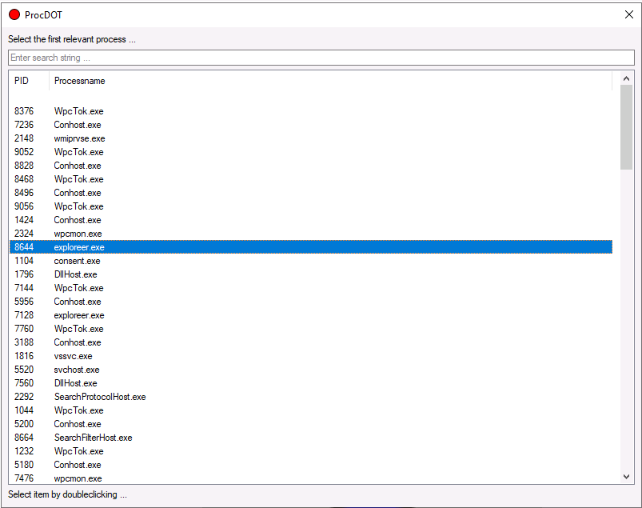
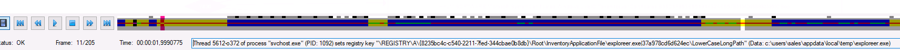
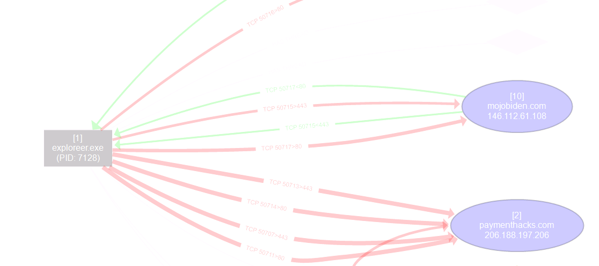
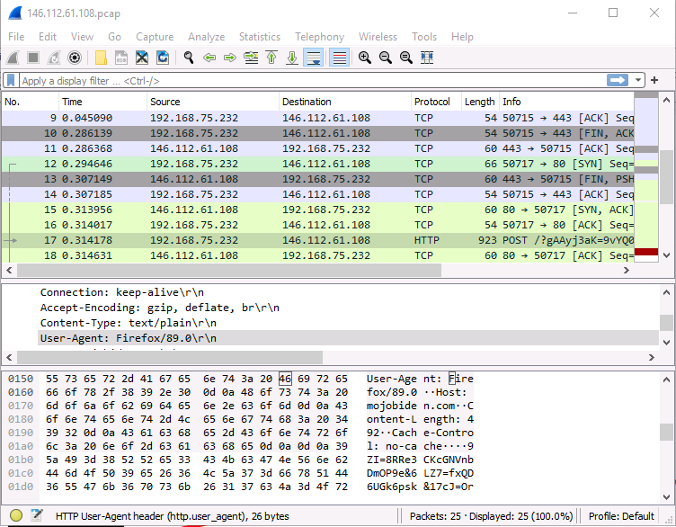
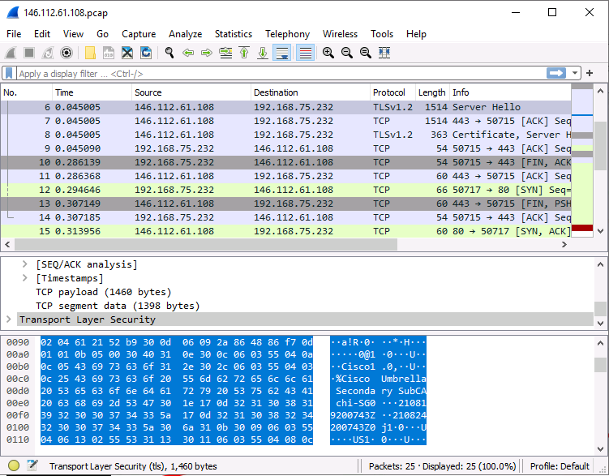
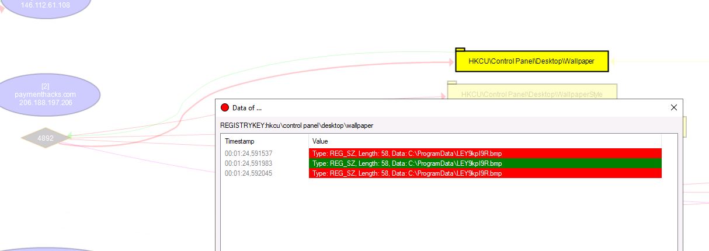
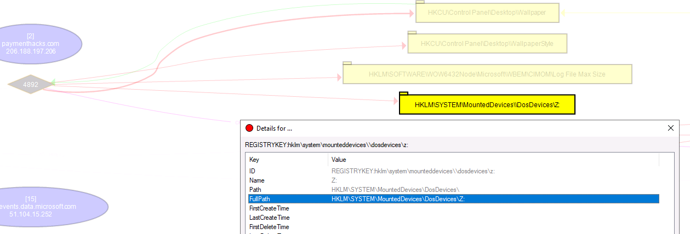
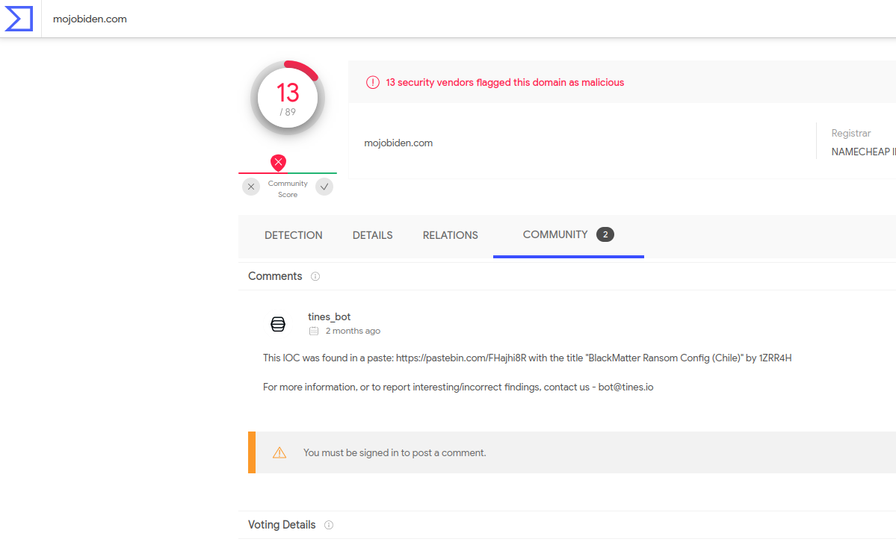

# Dunkle Materie # 

## Task 1 Ransomware Investigation ## 

**Provide the two PIDs spawned from the malicious executable. (In the order as they appear in the analysis tool)**

    

Dans render configuration on génère un rapport.  
On trouve 2 pid explorer.exe.   
Les pid sont : 8644 et 7128.    

**Provide the full path where the ransomware initially got executed? (Include the full path in your answer)**  

  

On regardant le déroulement des actions on trouve le chemin complet du ransomware.   

**This ransomware transfers the information about the compromised system and the encryption results to two domains over HTTP POST. What are the two C2 domains? (no space in the answer)**

 

Le ransomware communique avec deux domaines qui sont : mojobiden.com et paymenthacks.com.    

**What are the IPs of the malicious domains? (no space in the answer)**

 

Les adresses des domaines malicieux sont : 146.112.61.108 et 206.188.197.206     

**Provide the user-agent used to transfer the encrypted data to the C2 channel.**   

 

Avec wireshark sur l'adresse de mojobiden.com on trouve l'user agent qui est : Firefox/89.0 

**Provide the cloud security service that blocked the malicious domain.**  

 

On regarde les paquets qui vont a mojobiden.com on trouve marque de fabricant de routeurs et de solutions de sécurités.  
On voit Cisco Umbrella est une plate forme de sécuritée dans le cloud.  
La réponse est : Cisco Umbrella   

**Provide the name of the bitmap that the ransomware set up as a desktop wallpaper.**  

 

En observe le pid 4892 modifie le fond d'écran dans la base de registre.   
Quand regarde la valeur modifiée on trouve le nom du fichier qui est : LEY9kpI9R.bmp    

**Find the PID (Process ID) of the process which attempted to change the background wallpaper on the victim's machine.**

 

Le PID qui tente de changer le fond d'écran est le 4892.  

**The ransomware mounted a drive and assigned it the letter. Provide the registry key path to the mounted drive, including the drive letter.**  

   

Le regardant les modification que le pid fait sur les base de registre on voit la key qui permet de monté un disque est : HKLM\SYSTEM\MountedDevices\DosDevices\Z:   

**Now you have collected some IOCs from this investigation. Provide the name of the ransomware used in the attack. (external research required)**   

   

En faisant une recherche avec mojobiden.con sur virustotal on trouve le nom du ransomware.  
Le nom du ransomware est : Blackmatter ransomware  

